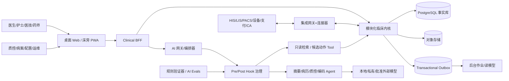
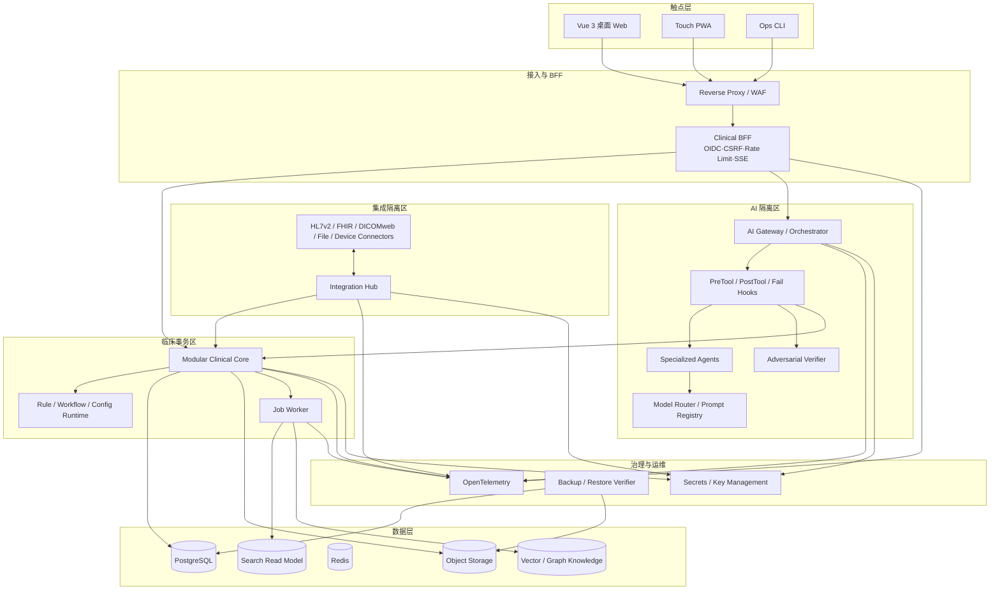
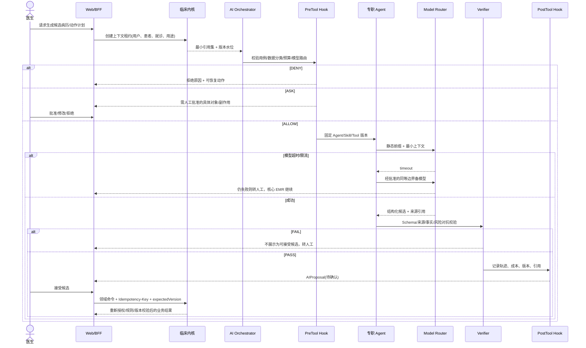

# openemr2026 v1.0 系统概要设计与架构决策（HLD & ADR）

## 0. 需求交接与可行性评估

### 0.1 输入验收

| 输入 | 版本/分母 | 结论 |
|---|---:|---|
| PRD | v0.15，138 FR / 138 AC | 可用；包含门急住、病历/病案、协同执行、10 个核心专科、AI、配置、迁移和生产运维 |
| 原型 | v0.13，194 条实际路由 | 可用；194/194 路由标题精确匹配，唯一一级归属，70/70 专科深页无导航遮挡 |
| UI 设计 | A 临床可信蓝 v1.2.0，194/194 | 可用；Token、页面、状态、可追溯栅格资产和浏览器证据已通过 S003-2 审计 |
| 合规/标准 | 国内规范 + 可选国际互操作 | 可用；只固化业务不变量，标准版本通过连接器和映射包升级 |
| 流量、SLO、RPO/RTO | PRD Q-004 未定 | 使用 S/M/L 三档可验证假设，在 Alpha 压测与恢复演练后基线化 |

### 0.2 核心业务闭环

`MPI 患者→就诊→病历版本→诊断/医嘱→执行/结果→质控/签署→病案封存→迁移/备份/恢复验真`是不可分割的临床主链。AI、配置和外部集成只能通过该主链的显式契约工作。

### 0.3 触点与网络水位

| 触点 | 网络 | 特征 | 架构要求 |
|---|---|---|---|
| 医生/护士桌面 Web | 院内网、高并发 | 长时在线、高频小事务 | BFF、乐观锁、草稿恢复、SSE 任务更新 |
| 床旁/移动查房 PWA | 院内 Wi-Fi/弱网 | 触控、扫码、短会话 | 最小缓存、受控离线读、高风险写失败关闭 |
| 管理/质控/科研 | 院内网、低频重查询 | 大筛选、导出、审批 | 读模型、异步作业、用途和导出门禁 |
| HIS/LIS/PACS/设备 | 集成区/DMZ | 异步、重复、乱序、异构标识 | 连接器隔离、源消息留存、幂等、死信、重放和对账 |
| 本地/私有/外部 AI | AI 网关 | 慢、不确定、可停用 | 数据分类、模型路由、Hook 拦截、人工批准、全量溯源 |

### 0.4 爆炸半径与默认处置

| 操作 | 爆炸半径 | 默认处置 |
|---|---|---|
| 患者合并/撤销 | 全院临床引用 | 专用工作流、双人审批、关系表重定向、不改原始键、可撤销 |
| 病历签署/更正 | 法律证据链 | 不可变版本、签名摘要、时间戳、新版更正，禁止覆盖 |
| 医嘱生效/执行 | 患者安全、药品/费用 | 业务幂等键、状态机、资质与风险规则、双人核对、补偿事务 |
| 配置/模型/Agent 发布 | 整个机构或科室 | 草稿→模拟→差异→审批→灰度→观测→全量，支持一键停用/回滚 |
| 迁移切换 | 全院数据 | 原始快照、转换区、多轮对账、业务签字、双轨只读、回退窗口 |

## 1. 架构目标与系统约束

### 1.1 一句话架构愿景

以 PostgreSQL 事务型模块化临床内核为唯一事实源，把外部集成、AI 和重作业物理隔离，通过 Outbox、版本化契约和安全状态机，同一套核心代码从单机诊所伸缩到三级医院。

**复杂度分级：`STANDARD`。** v1.0 核心采用模块化单体、独立集成/作业/AI 故障域和可选读模型；只有真实压测、组织隔离或多院区容灾证据触发 L 档时，才把消息、搜索、向量或图能力外置为独立集群。医院等级不自动决定拓扑，三级医院也必须按实际并发、数据量、接口数和恢复目标选型。

### 1.2 强制不变量

1. 临床事实只能由受权用户/服务身份通过领域用例写入。
2. 已签病历不覆盖；签名、更正、封存、导出和恢复可验真。
3. 患者、就诊、文书、医嘱、结果、执行和审计的关联不可静默重绑。
4. 外部消息、前端重试和 Agent Tool 均不能绕过业务幂等和权限。
5. 配置不得执行任意脚本、修改表结构或关闭平台安全规则。
6. AI 不自动诊断、处方、签署或执行；AI 停机不影响核心 EMR。

### 1.3 容量与 SLO 假设（Alpha 待基线化）

| Profile | 典型机构 | 在线临床用户 | 峰值读/写 | 年新增就诊 | 部署目标 |
|---|---|---:|---:|---:|---|
| S | 诊所/小型医院 | 50 | 200/20 rps | 30 万 | 单机容器化，可外挂备份 |
| M | 基层/二级医院 | 500 | 1,500/150 rps | 300 万 | 3 应用实例 + HA 数据库/对象存储 |
| L | 三级医院/多院区 | 5,000 | 10,000/1,000 rps | 3,000 万 | K8s/等价编排、读模型、独立消息/搜索/AI 集群 |

机构级别不作为代码或拓扑分支。定容使用以下 `CREATED` 规划包络，实际项目必须以医院连续 30 天高峰数据替换：

| 容量档 | 日门诊/日急诊 | 开放床位 | 高峰在线临床用户 | 还必须单独压测 |
|---|---:|---:|---:|---|
| S | ≤1,000 / ≤200 | ≤300 | ≤100 | 早高峰挂号、批量签署、护理执行、备份窗口 |
| M | 1,000–10,000 / 200–1,500 | 300–2,000 | 100–1,000 | 多病区交班、集中医嘱、LIS/PACS 结果峰值、历史迁移追平 |
| L | 10,000–50,000 / 1,500–5,000 | 2,000–6,000 | 1,000–8,000 | 多院区、大量设备、病案归档、科研导出、集成断线重放与灾备切换 |

| 指标 | S/M | L | 说明 |
|---|---:|---:|---|
| 核心查询 p95 | ≤800ms | ≤600ms | 不含 LIS/PACS/模型外部耗时 |
| 临床写入 p95 | ≤1.2s | ≤1.0s | 包含审计与 Outbox 同事务 |
| 签署 p95 | ≤2.0s | ≤2.0s | 不含外部 CA 不可控耗时 |
| 可用性 | 99.9% | 99.95% | AI/科研不计入核心临床 SLO |
| 同城关键写 RPO | ≤5min | 0（同步副本） | 依医院基建复核 |
| 异地灾备 RPO/RTO | 15min / 4h | 5min / 60min | 必须通过隔离恢复演练 |

上述数字均为 `CREATED` 容量假设，不是生产实测。机构定容使用以下公式并保留原始测量：

- `峰值读写 RPS = 峰值在线临床用户 × 每用户每分钟动作数 ÷ 60 × 突发系数`；门诊集中开诊、交班、医嘱批量执行和集中签署分别压测。
- `年增长字节 = 就诊量 × 每就诊结构数据 + 文书版本 + 附件/扫描件 + 审计/Outbox + 索引放大`；PACS 像素默认不复制进 EMR。
- Stable 门禁要求 1.5 倍目标峰值下核心写入仍达 SLO、连接池无耗尽、Outbox 可在 15 分钟内追平，并完成目标 RPO/RTO 的隔离恢复。

### 1.4 成本与扩展触发器

| 成本驱动 | 观测量 | 默认控制 | 外置/扩展触发器 |
|---|---|---|---|
| PostgreSQL | TPS、WAL、锁等待、热表/索引、备份窗口 | 分区、读模型、连接池与归档 | 单库在 1.5× 峰值或恢复窗口内持续不达标 |
| 对象存储 | 新增附件/扫描件、保留年限、复制份数 | 内容寻址、生命周期、分层存储 | 单节点容量/恢复带宽不满足保留与 RTO |
| 集成消息 | 接口数、峰值消息、重放积压 | Outbox + 分队列 Worker | 追平时间或故障隔离持续不达标才外置 broker |
| 搜索/科研 | 索引量、复杂查询、刷新延迟 | PostgreSQL FTS/只读作业 | 临床事务受重查询影响或查询 SLO 不达标 |
| AI | 模型调用量、Token、GPU、并发、TTFT | 用例预算、队列、缓存、可停用 | 只按通过评测的容量模型扩容，不挤占临床资源 |

## 2. 业务上下文与边界

### 2.1 C4 上下文视图

### 2.2 可部署单元与领域模块

| 部署单元 | 内部模块/职责 | 权限边界 |
|---|---|---|
| `clinical-app` | IAM 适配、Organization、MPI、Encounter、Documentation、Order、Result、Medication、Nursing、Billing、Archive、Quality、Workflow/Config | 唯一临床写入入口；模块边界经架构测试强制 |
| `integration-hub` | HL7 v2/MLLP、FHIR R4 API、DICOMweb 代理、文件/API/设备连接器、映射、重放、对账 | 不直连临床表；只通过版本化用例 API/事件 |
| `job-worker` | 导入、迁移、OCR、导出、质控重算、读模型、备份验证 | 作业凭据最小化；分队列、限额、可取消和可恢复 |
| `ai-runtime` | 模型路由、上下文组装、Agent/Skill、Tool 审批、运行轨迹、Evals | 无独立临床身份；默认只读；候选副作用必须人工批准 |
| `web` | Vue 3/TypeScript PWA、A 方案设计系统、194 路由 | 不在浏览器保存长期 PHI；所有签署/执行以服务端状态为准 |
| `ops-cli` | 安装、健康检查、升级、回滚、备份恢复、完整性报告 | 操作权分离；不以数据库超级用户执行常规业务 |

### 2.3 专职 AI 节点

| 节点 | 职责 | 允许工具 | 生命周期 |
|---|---|---|---|
| Context Builder | 按用户权限构建最小患者/就诊上下文 | 只读领域 Query | 请求级，上下文租约到期即销毁 |
| Summarizer/Drafter | 摘要、问诊整理、文书草拟 | 只读检索、草稿候选输出 | 短任务，不直接写病历 |
| QC/Coding | 质控建议、诊断/编码候选 | 规则结果、知识检索 | 与文书版本绑定，版本变更即过期 |
| Action Planner | 把用户目标拆成候选 Tool 计划 | 无写工具 | 计划必须先展示并批准 |
| Verification Agent | 对来源、字段、状态转移和副作用进行对抗检查 | 只读查询、规则引擎、Schema 验证 | 独立上下文，对高风险任务强阻断 |

### 2.4 全科室适配边界

“支持全部科室”指同一临床内核能够承载医院登记的任意科室，并不等于每个专科已经具备生产级专业深度。每个科室必须发布一条可审计的支持声明：

| 支持级别 | 可宣称范围 | 上线门禁 |
|---|---|---|
| 通用可用 | 患者/就诊、通用病历、诊断、医嘱、结果、任务、签署、审计和迁移 | 通用 E2E、权限、恢复、模板/字典与接口验证 |
| 基础闭环 | 在通用内核上完成该科室的真实门急住/日间/病区主流程 | 科室样本回放、角色/时限/设备/交接、异常与恢复验证 |
| 专科包待交付 | 仅有通用能力，专业字段、量表、设备、流程或质控未齐 | UI 必须显示缺口和负责人，不得以通用表单冒充生产支持 |
| 暂不支持 | 安全关键能力或法定流程缺失 | 阻止启用对应业务场景 |

v1.0 的妇产、生殖、儿科、新生儿、精神心理、眼科、耳鼻咽喉、口腔、皮肤和中医已形成 70 个深层设计页面与专科安全契约，但仍需在 S009 通过各自 E2E/设备/临床评审后才能升级为“基础闭环/生产支持”。其他内外科、急诊、重症、手术麻醉、透析、康复等复用通用内核和能力包机制，逐科室验收，不分叉核心代码。

## 3. 技术选型与 ADR

### 3.1 选型基线（截至 2026-08-20）

| 领域 | 选型 | 决策 |
|---|---|---|
| 后端 | Java 21 + Spring Boot 4.1.0 + Spring Modulith 2.1.0 | 国内医院技术生态成熟；模块化单体先稳定事务和领域边界 |
| 前端 | Vue 3 + TypeScript + Vite 8 + Vue Router + Pinia + TanStack Vue Query | 响应国内团队与用户明确偏好；组件、路由、客户端状态和服务端缓存分层，不改变 BFF/领域契约 |
| 事实库 | PostgreSQL 18.4 基线、18.x 内安全小版升级 | 事务、JSONB、分区、逻辑复制、RLS 能力成熟；18 大版支持至 2030-11-14 |
| 文件/附件 | S3-compatible object storage | 内容寻址 SHA-256、不可变对象、生命周期与防勒索隔离副本 |
| 缓存 | Redis（M/L 必选，S 可选） | 会话、短锁、限流、SSE offset；不存临床唯一事实 |
| 消息 | PostgreSQL Outbox 必选；Kafka-compatible 仅 L 外置 | 避免小机构的运维负担；大机构保留高吞吐消费 |
| 搜索 | PostgreSQL FTS（S）/ OpenSearch（M/L） | 搜索是可重建读模型，不进入临床事务 |
| 向量/图 | pgvector+关系边表（S/M 按需）/ Qdrant+Neo4j（L 可选） | 只在批准用例和压测证据存在时启用，不强迫任何机构运行固定多库组合 |
| 可观测 | OpenTelemetry + Prometheus-compatible + structured logs | 追踪患者主链、消息重试、AI TTFT/超时；日志默认脱敏 |
| 身份 | OIDC/OAuth2 + 医院 IdP/LDAP/AD 适配；内置应急账户 | 人员、账户、任期、执业资质和数据范围分离 |

选型现状来源（2026-08-20 核验）：[Vue 3 TypeScript 官方指南](https://vuejs.org/guide/typescript/overview)、[Vite 8 官方发布](https://vite.dev/blog/announcing-vite8)、[Spring Boot 4.1.0](https://spring.io/projects/spring-boot/)、[Spring Modulith 2.1.0](https://spring.io/projects/spring-modulith/)、[PostgreSQL 版本策略](https://www.postgresql.org/support/versioning/)。版本只在锁文件中升级，Stable 不跟随最新大版自动升级。

### ADR-001：模块化单体优先，不提前微服务化

- **状态**：Accepted。
- **备选**：A. 从第一天按领域拆 20+ 服务；B. 一个无边界单体；C. 模块化单体 + 可抽离端口。
- **决策**：C。临床主链大量依赖 ACID 事务和不变量，小机构不能承受分布式运维成本。外部集成、AI、OCR/导出等故障域独立部署。
- **代价**：需要严格模块 API、架构测试和禁止跨模块直连表。
- **绝对不能**：为追求“微服务数量”拆分同一签署/医嘱事务；也不允许所有模块直接读写所有表。

### ADR-002：内部领域模型不等于 FHIR

- **状态**：Accepted。
- **决策**：内部模型表达中国病历、签署、医嘱执行和病案证据；FHIR R4 作为 v1 外部互操作 API，R5 通过独立映射包支持。
- **代价**：需维护 Canonical↔FHIR/HL7v2 映射、版本和一致性测试。
- **绝对不能**：把 FHIR Resource JSON 直接当事实表，或在升级 FHIR 版本时批量重写临床历史。

### ADR-003：事务 Outbox 是跨边界唯一事件出口

- **状态**：Accepted。
- **决策**：业务变更、审计摘要和 Outbox 在同一 PostgreSQL 事务提交；消费者幂等；搜索/向量/数仓可全量重建。
- **代价**：事件 Schema 治理、积压监控、死信和重放工具成为必须品。
- **绝对不能**：一个请求中先写库再“尽力发消息”，或将搜索索引成功当成业务成功。

### ADR-004：配置是版本化 DSL，不是任意低代码

- **状态**：Accepted。
- **决策**：流程、表单、规则、范围、路由均引用平台注册的受控动作和表达式；每个发布包有依赖、差异、模拟、审批和回滚点。
- **代价**：需要 DSL 版本、静态分析、模拟器和升级影响分析。
- **绝对不能**：上传 Groovy/JS/SQL 脚本并以应用数据库账号执行。

### ADR-005：AI 候选与临床事实物理分层

- **状态**：Accepted。
- **决策**：AIProposal/AIRun 独立存储；用户接受后仍由对应领域用例重新校验权限、上下文和版本再写入。
- **代价**：用户看到额外的“待确认”阶段，但换取可追溯与可停用。
- **绝对不能**：模型输出直接 UPDATE 病历/医嘱表；不保存或展示隐藏思维链。

### ADR-006：上下文经济学与模型路由

- **状态**：Proposed，Alpha 校准。
- **决策**：静态 System/Tool Schema 在前，机构策略与 Skill 版本半静态，患者事实动态；上下文引用而非复制；大结果截断并用可追溯摘要替换。
- **代价**：需监控 cache hit、过期摘要、漏掉来源和 Token 预算。
- **绝对不能**：每轮投入全量病历和全部会话；模型切换不得扩大数据驻留、模态或用途范围。

### ADR-007：科室差异使用能力包，不分叉临床内核

- **状态**：Accepted。
- **备选**：A. 每个科室复制一套代码/表；B. 所有差异塞进自由表单；C. 通用内核 + 版本化 Specialty Pack。
- **决策**：C。专科包只能组合已登记的字段、表单、术语、规则、流程、医嘱集、接口、AI Skill 和评测证据；核心患者/就诊/签署/权限/审计状态机不可覆盖。
- **代价**：需要支持矩阵、依赖解析、兼容检查、沙箱回放和科室联合签字。
- **绝对不能**：页面存在即宣称专科可生产使用；也不能让专科包执行任意代码或降低平台硬规则。

### ADR-008：生产 Web 前端统一迁移到 Vue 3

- **状态**：Accepted，S005-4 细化、S007 拆迁移工单。
- **上下文**：现有 `web/` React 是已观察的早期纵向切片，用户明确期望 Vue 3；194 路由仍大部分尚未进入生产实现，当前是避免长期双栈的最后低成本窗口。
- **备选**：A. 继续 React；B. Vue 3 一次性路由/契约对等迁移；C. React/Vue 微前端长期共存。
- **决策**：B。保留 OpenAPI、BFF、服务端状态和 S003-2 Token/截图契约，用 Vue 3 + TypeScript 逐个纵向切片替换；迁移期只允许一个生产入口和一个路由注册表。
- **代价**：已有 React 测试和组件需重写；短期放慢新功能，换取国内团队招聘/维护匹配和长期单栈一致性。
- **验证**：现有生产纵向切片 API 契约回归；194 路由注册、标题、唯一父级、权限和深链静态检查；门诊→门诊病历→全院病历中心以及已实现纵向切片的同视口截图差分。
- **绝对不能**：以 iframe/微前端将两套患者上下文长期并存；不得在迁移时重写后端业务规则。

## 4. 整体物理与逻辑架构

## 5. 核心调度与 Hook 时序

## 6. 数据流、上下文与缓存生命周期

1. **事实写入**：BFF→领域命令→权限/资质/规则/版本→业务表+审计+出站事件同事务。
2. **读模型**：Outbox→幂等投影→搜索/统计/科研。读模型有 `source_watermark`，过期必须显示。
3. **外部数据**：原消息摘要+受控原文对象→解析→标准中间体→身份/标识映射→领域用例→回执/对账。
4. **AI 上下文**：上下文租约仅存 ID、用途、范围、水位和过期时间；文本按需取得；不跨患者复用。
5. **缓存**：患者临床事实不以 Redis 为权威；患者切换、权限任期变更、签署和配置发布触发定向失效。
6. **日志压缩**：不把全部 Tool 原始结果注入模型；保留 `pass/fail`、错误类型、不超过限额的摘要和可寻址引用。

## 7. 部署、容灾与发布

### 7.1 三档物理拓扑

| 组件 | S | M | L |
|---|---|---|---|
| 应用 | 1 实例 | 3 实例 + LB | 无状态水平扩展，容量隔离池 |
| PostgreSQL | 单主 + PITR | 主+同城备+异地 WAL | 同步 HA + 读副本 + 异地灾备 |
| 对象存储 | 单实例+隔离备份 | 4 盘/节点冗余 | 分布式+异地复制+锁定保留 |
| 消息 | Outbox worker | Outbox + 可选 broker | Kafka-compatible 多副本 |
| 搜索/知识 | PostgreSQL FTS，语义/图能力按需 | 可外置 Search/Vector | 经容量证据后才拆 Search/Vector/Graph 集群 |
| AI | 可全关闭/远程受限 | 本地网关+备模型 | 独立 GPU/AI 区，队列和租户限额 |

### 7.2 发布门禁

`SBOM/签名→单元/架构/契约测试→合成数据端到端→安全扫描→数据迁移往返→升级/回滚→隔离恢复验真→容量压测→AI Evals/红队→人工批准`。任一 Stable 门禁失败即阻断。

## 8. 安全、合规与外部标准

### 8.1 安全控制

- 严格区分身份认证、功能权限、数据范围、执业资质、紧急访问和职责分离。
- TLS 1.2+/可配置国密边界、列/对象存储密钥分层、密钥不入库、定期轮换。
- 审计与业务分区存储，重要事件使用 hash chain/外部时间戳验真；查看病历也要审计。
- AI 区默认无外网 egress；外部模型必须通过批准的路由与脱敏/最小化策略。
- 依《网络数据安全管理条例》落实分类分级、加密、备份、访问控制、安全认证和事件处置；医疗健康数据按敏感个人信息处理。

### 8.2 标准版本政策

| 标准 | v1 政策 | 来源 |
|---|---|---|
| 国家卫健委 EMR 功能/分级 | 作为功能和取证基线 | [功能规范](https://www.nhc.gov.cn/wjw/gfxwj/201101/a769b5f4b9ca4415a72fa9888bce0bc1.shtml)、[分级评价](https://www.nhc.gov.cn/wjw/c100175/201812/7d64363a20cd4ea798f8343842b28d0c.shtml) |
| WS 445 | 作为中国病历数据集映射基线 | [20 项电子病历基本数据集](https://www.nhc.gov.cn/fzs/c100048/201406/077528a74b04441da2ccce0082ce01e9.shtml) |
| WS/T 364 | 值域包版本化导入，不写死 | [2023 版总则](https://www.nhc.gov.cn/fzs/c100048/202310/16a32e2b1c0b42e99480b945ef10c0dc/files/1733821985537_88120.pdf) |
| HL7 FHIR | 对外 R4 默认，R5 适配；显式版本协商 | [FHIR R4 HTTP](https://hl7.org/fhir/R4/http.html)、[FHIR 版本政策](https://hl7.org/fhir/versions.html) |
| DICOMweb | QIDO-RS/WADO-RS/STOW-RS；不自建 PACS 影像存档核心 | [DICOMweb 官方](https://www.dicomstandard.org/using/dicomweb) |
| LOINC/UCUM | 可选术语包；保留原编码与许可声明 | [LOINC 2.82](https://loinc.org/downloads/)、[UCUM](https://ucum.org/) |

## 9. 主要风险与 LLD 入口

| 风险 | 等级 | HLD 对策 | LLD 所属 |
|---|---|---|---|
| 大型医院单库热点/审计膨胀 | 高 | 时间分区、读模型、归档、连接池和索引基线 | DATA/BACK |
| 历史迁移错配 | 极高 | raw/stage/canonical 三层、源键映射、业务对账和回退 | DATA/BACK |
| LIS/PACS 重复/乱序 | 高 | 原消息持久化、业务幂等、重放和最终对账 | BACK |
| 配置发布破坏临床流程 | 极高 | 受控 DSL、静态分析、模拟、双人审批、灰度回滚 | BACK/FRONT |
| AI 幻觉/错患者/越权 | 极高 | 上下文租约、物理候选层、Hook、Verifier、人工批准、紧急停用 | AGENT |
| 194 页面状态分裂 | 高 | 统一 Query/Command/Stream 状态契约与组件族 | FRONT |
| React→Vue 3 迁移造成双路由/双上下文 | 高 | 单入口、单路由注册表、契约对等和纵向切片替换后删除 React 实现 | FRONT/PLANNER |

## 10. S005 输入契约与并行边界

| 分支 | 固定输入 | 必须交付 | 可并行/阻断关系 |
|---|---|---|---|
| S005-1 DATA | PostgreSQL 事实库、对象存储、Outbox、raw/stage/canonical 迁移、S/M/L 包络 | 聚合所有权、不变量、分区/索引/保留、恢复和对账契约 | 先固定主键/版本/出站事件，BACK/AGENT 可在稳定契约上并行 |
| S005-2 BACK | 模块化单体、BFF、集成/作业隔离、领域状态机 | API/事件/错误码、幂等、授权、超时/重试/降级和容量限额 | 依赖 DATA 不变量；向 FRONT/AGENT 发布机器可读契约 |
| S005-3 AGENT | AIProposal/AIRun 物理分层、上下文租约、Hook/人工批准、模型路由 | Agent/Skill/Tool 版本、风险分级、预/后 Hook、评测、恢复、预算与本地/DeepSeek 适配端口 | 依赖 BACK 授权/工具契约；不能反向定义临床真相 |
| S005-4 FRONT | Vue 3 单栈、194 路由、S003-2 Token/截图、Query/Command/Stream 分层 | 路由/状态/组件、患者上下文、弱网/恢复、权限和 React 迁移施工契约 | 依赖 BACK OpenAPI/错误码；可与 AGENT 并行，但不得发明后端规则 |

HLD v0.15 当前状态为 `CREATED`；S/M/L 容量与 RPO/RTO 仍为待压测/演练基线化的规划值。下一阶段严格依次产出 `LLD-DATA`→`LLD-BACK`，在机器可读契约固定后可并行 `LLD-AGENT` 和 `LLD-FRONT`，再进入 S006 技术评审。
