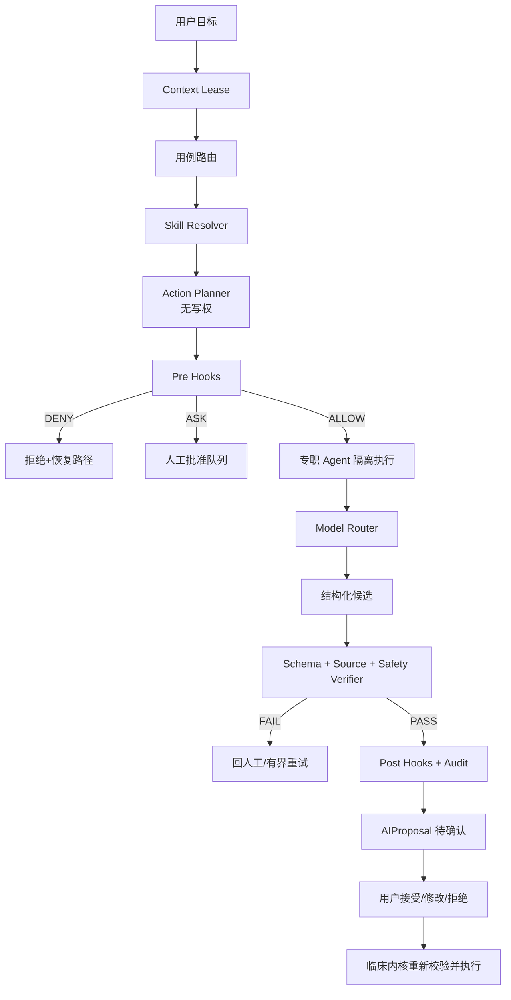
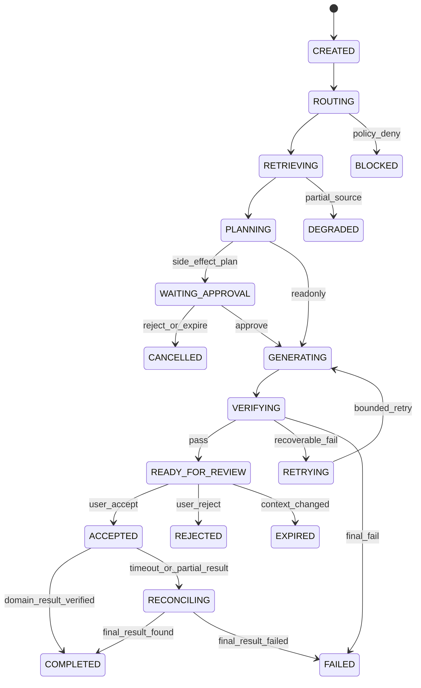

# openemr2026 v1.0 AI Agent / Skill 编排与治理详细设计（LLD-AGENT-ORCH）

## 0. 前置资产与验证闭环

| 输入 | 已锁定契约 |
|---|---|
| PRD v0.15 | AI 只是候选层；不自动诊断、处方、执行、签署；可全局停用；模型/Agent/Skill/Tool 可配置和切换 |
| Prototype v0.13 / UI v1.2.0 | 全局 AI 入口、页内提醒、完整工作区、来源与人工批准状态已定义；194 路由均有入口 |
| HLD | `ai-runtime` 独立故障域；Pre/Post/Fail Hooks；候选通过临床内核重新验证后才可写入 |
| LLD-DATA | `ContextReference` 字节契约、按需混合检索、版本/水位/授权重校验 |
| LLD-BACK | `AIProposal/AIRun/ToolApproval`、SSE、幂等命令、超时/重试/熔断与配置发布状态机 |

### 0.1 是否需要 Agent

| 任务 | 首选实现 | 使用 Agent 的条件 | 禁止替代 |
|---|---|---|---|
| 必填、时限、编码/单位、过敏/剂量硬校验 | 确定性规则/计算函数 | 不使用 Agent | Agent 不得改变硬规则结论 |
| 病历来源定位、患者时间线精确查询 | 授权 Query + 检索 | 仅用于查询改写/结果编排 | 不用向量相似度猜患者事实 |
| 多来源摘要、病历/交班/出院草稿 | 专职 Agent + Skill | 需要多步检索、引用和结构化生成 | 不直接写入/签署病历 |
| 质控与编码候选 | 规则结果 + Agent 第二视角 | 语义一致性/遗漏检查且有金标评测 | 不伪装成法规硬阻断 |
| 处方、医嘱、执行、收费、配置发布 | 普通领域命令 | Agent 只能生成候选计划并等待逐项批准 | 不直接执行副作用 |

任何新 AI 用例先证明普通函数、规则或单次检索不能满足，再进入 Agent 注册表；否则保持确定性实现。

### 完成定义（Verifier）

Agent 仅当同时满足以下条件才能返回 `SUCCEEDED`：

1. 输出通过用例 JSON Schema，无未定义字段。
2. 所有临床事实均有可寻址且当前用户可读的 `ContextReference`，来源版本未过期。
3. 不确定或无来源内容被明确标为 `UNVERIFIED`，不写成肯定临床事实。
4. 硬规则、授权、患者/就诊上下文、数据分类和预算 Hook 均 PASS。
5. 高风险候选通过独立 Verification Agent/确定性校验器；副作用仍处于人工待批准。
6. 运行轨迹保存 Agent/Skill/Tool/模型/Prompt/知识版本、输入范围摘要、评验和完成原因，不保存隐藏思维链。

## 1. Agent 六层治理全景

| 层级 | 职责 | 物理载体 | 加载 | 临床不变量 |
|---|---|---|---|---|
| Context | 用途、患者/就诊锁、数据范围、水位 | `ContextLease` + System Contract | 全局契约常驻，临床上下文按请求 | 不跨患者/就诊污染；过期即不可用 |
| Action | 告诉模型能做什么 | 细粒度 Tools/API | 用例白名单 | 默认只读；没有“万能数据库工具” |
| Skill | 特定工作流和知识 | 版本化 Skill Package | 触发时渐进加载 | Skill 不自动获得 Tool 权限 |
| Control | 确定性校验、拦截、限额、审计 | Pre/Post/Fail Hooks | 模型上下文之外 | 不依赖 Prompt 自律；拒绝优先 |
| Isolation | 隔离不同专职任务和大结果 | 独立 Agent Run/Worker 池 | 按需调度 | 规划、生成、验证不共用可变上下文 |
| Verification | Schema、来源、医疗安全、Evals、人工审批 | 确定性验证器 + Verification Agent + HITL | 任务终止门禁 | 未验证不得进入可接受候选状态 |



## 2. 上下文经济学、模型路由与 Cache

### 2.1 Prompt 缓存物理布局

```text
[STATIC / release-scoped]
1. Clinical safety system contract
2. Use-case output JSON Schema
3. Tool JSON Schemas (stable order, fixed versions)
4. Agent + Skill immutable versions

[SEMI-STATIC / session-scoped]
5. Institution policy release id + concise policy facts
6. Model route decision + approved capability boundary
7. Conversation handoff summary (no cross-patient text)

[DYNAMIC / request-scoped]
8. ContextLease: user/patient/encounter/purpose/watermark/expiry
9. Retrieved ContextReferences within token budget
10. User message + bounded tool results
```

- 静态区任一内容变化都产生新的 `prompt_release_id`，不在运行中动态增删 Tool Schema。
- `institution_policy_release_id/knowledge_release_ids/skill_version/model_deployment_id` 都进入缓存键；新运行只读取当前已批准 release。撤回、到期、权限水位变化或紧急停用发布失效事件，网关先封禁旧键再接收新请求；在途运行进入 `EXPIRED/BLOCKED` 或按副作用状态转 `RECONCILING`，不得继续引用已退休知识。
- 每个运行快照固定所用 release 和 `authorization_watermark`，不能在同一运行中静默混用新旧知识；确需升级时创建新 run 并向用户展示差异。
- Tool 返回超过用例限额时，RTK（Result Token Killer）只保留结构化结论、错误、水位和可寻址引用；原始大结果不入 Prompt。
- 超过会话上限时生成 Handoff：目标、已确认事实引用、未决问题、拒绝/失败路径、下一步；销毁旧临床文本。

### 2.2 ContextLease

```json
{
  "lease_id": "uuidv7",
  "tenant_id": "uuid",
  "organization_id": "uuid",
  "facility_id": "uuid",
  "user_id": "uuid",
  "role_assignment_ids": ["uuid"],
  "patient_id": "uuid|null",
  "encounter_id": "uuid|null",
  "task_id": "uuid|null",
  "purpose_code": "DOCUMENT_DRAFT",
  "allowed_source_types": ["DOCUMENT_VERSION","OBSERVATION","ORDER"],
  "allowed_time_range": {"start":"...","end":"..."},
  "authorization_watermark": "opaque-hash",
  "data_classification_ceiling": "SENSITIVE",
  "model_residency_policy": "ON_PREM_ONLY",
  "expires_at": "2026-08-14T10:15:00+08:00"
}
```

患者、就诊、用途、角色任期、数据范围、机构策略或紧急停用任一变化，租约失效。端侧只保存 `lease_id`，不保存可以换取任意患者数据的长期 token。

租约、Tool、Proposal、AIRun、ContextReference 的 HTTP/SSE 线格式统一为 `snake_case`；前端 camelCase 只能由生成 codec 显式转换。`role_assignment_ids` 必须保持数组语义，禁止降为单一岗位导致多岗位授权丢失或扩大。

### 2.3 基座模型注册与切换

```typescript
export interface FoundationModelProfile {
  modelDeploymentId: string;
  providerType: 'LOCAL' | 'PRIVATE_CLOUD' | 'APPROVED_EXTERNAL';
  modelFamily: string;
  modelVersion: string;
  endpointSecretRef: string;
  capabilities: ('TEXT'|'VISION'|'SPEECH'|'EMBEDDING'|'TOOL_CALLING')[];
  contextWindow: number;
  supportedLanguages: string[];
  residency: { country: string; region?: string; onPrem: boolean };
  permittedDataClasses: ('PUBLIC'|'INTERNAL'|'SENSITIVE'|'RESTRICTED')[];
  permittedUseCases: string[];
  capacity: { maxConcurrency: number; tokensPerMinute: number; ttftP95Ms: number };
  lifecycle: 'DRAFT'|'EVALUATING'|'APPROVED'|'DEPRECATED'|'DISABLED';
  evaluationReleaseId: string;
}
```

`ModelRoutePolicy` 先按数据驻留/用例/模态/批准状态做硬过滤，再在候选中按质量、容量、延迟、成本和灰度策略选择。

- `RESTRICTED` 只允许进入 `providerType=LOCAL`、`residency.onPrem=true`、机构明确批准且专科用例白名单命中的模型部署；禁止私有云/外部模型、禁止远程故障回退。任一条件不满足时直接拒绝 AI 运行并回退人工流程。
- 会话默认固定 `model_deployment_id`；只有故障回退可切换。
- 备用模型必须已通过同一用例评估，且数据级别、驻留、工具与用途边界不扩大。
- 切换写入 `route_decision` 和用户可见的模型变更说明；未批准模型不参与“自动兜底”。
- 影子运行的输出不展示、不写入、不调用 Tool，且使用经批准的数据范围。

### 2.4 Prompt 资产注册与回滚

| 资产 | 必填变量 | 版本/缓存 | 发布门禁 | 回滚 |
|---|---|---|---|---|
| `clinical-safety-system` | 用例、数据分类、禁止动作、机构策略版本 | `prompt_release_id`；release 级静态前缀 | 安全红队、禁止 Tool、跨患者泄漏 | 回到上一批准 release 并终止旧租约 |
| `document-draft` | 文书类型、模板版本、ContextReference、输出 Schema | Skill + 模板共同入缓存键 | 结构、引用、否定词/时序、医生评审 | 新 run 重建，不在途热换 |
| `record-qc` | 文书版本、规则结果、专科包、证据水位 | 文书版本绑定 | 硬规则/AI 建议分层、漏报/误报样本 | 停用该建议用例，硬规则继续 |
| `coding-candidate` | 术语包版本、病案版本、允许编码体系 | 知识 release 绑定 | 失效码、主次诊断和来源回查 | 回退术语/Prompt 组合版本 |
| `assistant-dialog` | 当前页面、任务、最小上下文租约 | 会话级；切患者失效 | 越权、Prompt injection、长会话压缩 | 清空上下文并回人工 |

注册表保存 `asset_id/version/content_hash/owner/input_schema/output_schema/allowed_use_cases/eval_suite/release_status`。生产审计只保存版本、变量名、引用和输入/输出哈希摘要，不记录隐藏思维链或整份病历 Prompt。

## 3. Action Surface：Agent 工具契约

### 3.1 工具分类

| 类别 | 例子 | 默认 | 运行时门禁 |
|---|---|---|---|
| 精确只读 | `get_current_document_version`, `list_recent_observations` | ALLOW（在 ContextLease 范围内） | 每次重新授权、数据最小化、结果截断 |
| 检索 | `search_guideline_chunks`, `search_patient_timeline` | ALLOW | 指南审批版本、患者不跨界、引用必填 |
| 确定性计算 | `calculate_pediatric_dose_range`, `validate_ucum` | ALLOW | 参数 Schema、计算库版本、结果不替代临床判断 |
| 候选产生 | `create_document_proposal`, `create_quality_proposal` | ALLOW | 只写 AIProposal，不写临床事实 |
| 业务副作用 | `propose_order_items`, `propose_task_creation` | ASK | 预览对象/变化/后果，人工批准后由临床内核执行 |
| 禁止 | 任意 SQL、自动签署、自动执行医嘱、绕过审计 | DENY | 不注册 Tool；即使模型生成同名也无法执行 |

### 3.2 只读工具示例

```json
{
  "name": "list_recent_observations",
  "description": "在当前 ContextLease 的患者与时间范围内读取已确认检验/生命体征，返回可寻址引用。",
  "inputSchema": {
    "type": "object",
    "additionalProperties": false,
    "properties": {
      "lease_id": {"type":"string","format":"uuid"},
      "codes": {"type":"array","maxItems":50,"items":{"type":"object","required":["system","code"]}},
      "from": {"type":"string","format":"date-time"},
      "to": {"type":"string","format":"date-time"},
      "limit": {"type":"integer","minimum":1,"maximum":200}
    },
    "required": ["lease_id","codes","from","to"]
  },
  "timeout_ms": 3000,
  "max_result_tokens": 3000,
  "side_effect": "NONE"
}
```

### 3.3 候选副作用契约

```json
{
  "proposal_id": "uuidv7",
  "proposal_type": "ORDER_ITEMS",
  "lease_id": "uuid",
  "target": {"patient_id":"uuid","encounter_id":"uuid"},
  "expected_versions": [{"resource_type":"ENCOUNTER","resource_id":"uuid","version":18}],
  "items": [{"catalog_item_id":"uuid","dose":"...","route":"...","frequency":"...","references":["ref-1"]}],
  "side_effects": ["CREATE_CHARGE","CREATE_SPECIMEN_TASK","NOTIFY_PATIENT"],
  "risk_level": "HIGH",
  "required_approvals": [{"role":"ORDERING_CLINICIAN","count":1}],
  "expires_at": "...",
  "idempotency_key": "..."
}
```

批准动作不会“恢复 Agent 写库权限”；BFF 把 proposal 转换成正常领域命令，内核重新校验身份、版本、规则和幂等。

## 4. Control Surface：Hooks 运行时治理

```mermaid
sequenceDiagram
  participant Agent
  participant Pre as PreToolUse
  participant Policy as Policy Engine
  participant Tool as Tool Gateway
  participant Post as PostToolUse
  participant Fail as Failure Hook
  participant Audit

  Agent->>Pre: tool_name + args + run_id
  Pre->>Policy: lease/purpose/role/data/model/tool/version
  alt DENY
    Policy-->>Agent: structured denial + recovery hint
    Policy->>Audit: denied attempt
  else ASK
    Policy-->>Agent: WAITING_APPROVAL + approval_id
  else ALLOW
    Policy-->>Pre: normalized args + budget/fencing token
    Pre->>Tool: execute
    alt timeout/schema/error
      Tool->>Fail: typed failure
      Fail->>Audit: failure + retry decision
      Fail-->>Agent: bounded recovery; no blind loop
    else result
      Tool->>Post: result
      Post->>Post: redact + schema + source + token-limit
      Post->>Audit: result summary + hashes
      Post-->>Agent: bounded structured result
    end
  end
```

### 4.1 Hook 矩阵

| Hook | 确定性检查 | 行为 |
|---|---|---|
| `PromptInput` | PHI 分类、上下文租约、数据驻留、用例开关 | 外部模型路由不合规则 DENY/改走本地模型；不静默脱敏改变医学语义 |
| `PreToolUse` | Tool/Agent/Skill 版本、参数 Schema、权限、患者/就诊、预算、幂等、副作用 | ALLOW/ASK/DENY；允许收紧 limit/时间范围，禁止扩大输入 |
| `PostToolUse` | 输出 Schema、引用完整性、新增 PHI、结果大小、水位 | 截断/拒绝/返回可寻址摘要；不把错误 HTML/栈全量入模 |
| `PostModel` | 输出 Schema、无来源事实、禁止行为、患者交叉泄漏 | 进入 Verifier；严重项直接 FAIL |
| `Failure` | 连续同类错误、超时、重试预算、熔断 | 最多 2 次有界重试；参数未改的同样调用禁止循环；转人工 |
| `EmergencyStop` | 机构/用例/模型/Agent/Skill/Tool 停用开关 | 终止新运行；暂停在途 Tool；已执行副作用进入对账而不伪回滚 |

预算 Hook 必须由后端持久状态执行。Alpha `CREATED` 起点为单 run `max_model_calls=4`、`max_tool_calls=8`、同参 Tool 无新证据最多 1 次、总恢复重试最多 2 次；这些值需经用例压测、费用上限和故障注入基线化后才能标记 `VERIFIED`。具体 Skill 只能收紧或在审批发布后调整，模型不能自行提高。每次 Tool 分配 fencing token，过期 Worker 的迟到结果不得写入当前 run。

## 5. Isolation Surface：专职 Agent 与生命周期

### 5.1 Agent 注册表

| Agent | 用例 | 可用 Skill/Tool | 限制 | 超时 |
|---|---|---|---|---:|
| `EncounterSummarizer` | 诊前/当次就诊摘要 | 时间线只读、结果只读、引用 | 不给出无证据诊断 | 30s |
| `DocumentDrafter` | 门诊/入院/病程/交班/出院草拟 | 文书模板、只读事实、草稿 proposal | 不写文书，不签署 | 45s |
| `RecordQC` | 书写中/签署前/归档前质控 | 硬规则结果、文书版本、质控 proposal | AI 建议不伪装成硬阻断 | 45s |
| `CodingAssistant` | 诊断/手术/病案编码候选 | 版本化术语包、文书只读 | 失效编码不可接受 | 30s |
| `SafetyReviewer` | 医嘱/用药/专科风险的第二视角 | 确定性计算、规则、来源检索 | 不取代规则引擎，不自动解除阻断 | 30s |
| `ActionPlanner` | 把用户目标拆为候选步骤 | 只读 Tool 目录 | 不执行 Tool，步骤和副作用先展示 | 10s |
| `VerificationAgent` | 给候选挑错 | 只读原引用、Schema/规则校验 | 独立上下文，无业务写权 | 20s |

专科 Agent 不复制这些基础 Agent；妇产/生殖/儿科等使用版本化 Specialty Skill Pack 扩展字段、规则、确定性计算和评测集。10 个核心专科已有设计契约，但在专科评测、临床双人复核和对应设备/流程 E2E 通过前只能标记 `CREATED`。其他科室可复用基础 Agent，也必须先建立专科 Skill/数据范围/风险/评测声明；系统不得把“通用 Agent 可运行”展示为“该专科 AI 已验证”。

### 5.2 AIRun 状态机



创建运行使用 `POST /api/v1/ai/runs` 并立即返回 `202`；快照、取消、候选决策和 SSE 端点以 LLD-BACK 4.2/4.3 为唯一传输契约。AIRun 状态与 Worker `durable_job` 状态分层，前端只接收本状态机的枚举。

## 6. Skill Surface：渐进式披露与供应链

### 6.1 Skill 契约

```yaml
apiVersion: ai.openemr2026.org/v1
kind: Skill
metadata:
  id: inpatient-discharge-summary
  version: 1.3.0
  owner: medical-records-committee
spec:
  purpose: DRAFT_DISCHARGE_SUMMARY
  inputSchemaRef: schema://skills/discharge-summary/input/1.3.0
  outputSchemaRef: schema://skills/discharge-summary/output/1.3.0
  preconditions:
    - encounter.type == INPATIENT
    - encounter.status in [DISCHARGE_PLANNING, DISCHARGED_PENDING_ARCHIVE]
  allowedContext:
    sourceTypes: [DOCUMENT_VERSION, ORDER, OBSERVATION, TASK]
    maxLookbackDays: 365
    classificationCeiling: SENSITIVE
  allowedTools:
    - get_current_document_version@1
    - list_recent_observations@1
    - list_encounter_orders@1
    - create_document_proposal@1
  forbiddenActions: [SIGN_DOCUMENT, CHANGE_DIAGNOSIS, EXECUTE_ORDER]
  budgets:
    maxInputTokens: 32000
    maxOutputTokens: 6000
    maxToolCalls: 12
    timeoutSeconds: 45
  failureSemantics:
    partialSource: RETURN_INCOMPLETE_WITH_SOURCE_STATUS
    modelUnavailable: FALLBACK_TO_MANUAL_TEMPLATE
    verificationFailed: DO_NOT_PRESENT_AS_ACCEPTABLE
  evalSuiteRef: eval://discharge-summary/1.3.0
  approvals:
    publish: [clinical-owner, ai-governance, security]
```

### 6.2 供应链与发布

- Skill 包含 manifest、Schema、Prompt fragments、参考资产哈希、测试、Evals、SBOM、签名和许可；依赖完全锁定。
- 只有管理端的显式用例路由可触发有副作用/高成本 Skill；模型不可仅凭 Skill 名称自动上载。
- `supporting_files/` 只在路由器确认专科/用例后加载；不把数百页指南常驻在 System Prompt。
- 发布流程：草稿→Schema/lint→合成测试→离线 Evals→隐私/越权红队→临床审阅→影子→灰度→全量。

## 7. Verification Surface：评测与闭环验证

### 7.1 三层验证

| 层 | 验证 | 失败处置 |
|---|---|---|
| 确定性 | JSON Schema、枚举/单位、患者/就诊、引用 hash、禁止 Tool | 直接 FAIL，不让模型“解释过关” |
| 语义/对抗 | 幻觉、遗漏、否定词、时间线、专科风险、Prompt injection | Verification Agent + 金标对比；高风险 FAIL |
| 人工 | 临床合理性、候选接受/修改/拒绝、副作用 | 只有人工可把候选送入领域命令 |

### 7.2 评测集分层

- `unit`：单 Skill 格式、引用、字段和失败语义。
- `workflow`：完整上下文→检索→生成→校验→审批链。
- `specialty`：妇产母婴、生殖夫妇、儿科剂量、精神隐私/自伤、眼/耳鼻喉侧别、口腔牙位、皮肤图像授权、中医毒性饮片。
- `safety-redteam`：错患者注入、隐藏指令、越权来源、工具参数扩权、重试重复副作用、模型切换边界扩大。
- `degradation`：模型停机、超时、部分数据源、缓存未命中、Tool 乱序回调、紧急停用。

### 7.3 指标与发布门禁

| 指标 | Stable 门禁 |
|---|---:|
| 错患者/越权来源 | 0 |
| 未授权 Tool 执行 | 0 |
| 高风险无来源确定结论 | 0 |
| 未审批业务副作用 | 0 |
| 引用可寻址率 | 100% |
| Schema 通过率 | 100%（失败不展示为可接受） |
| 紧急停用生效 | 新请求 <10s，在途副作用全部进入对账 |
| 用例临床质量 | 按用例设定，不用一个通用“准确率”替代 |

## 8. Eng Manager & QA 治理清单

- [ ] System/Tool/Skill 静态前缀只随发布变更，cache hit/输入 Token/结果截断率可观测。
- [ ] 每个 Tool 单一职责、Schema 关闭 `additionalProperties`、有超时、结果限额、失败恢复和副作用声明。
- [ ] 强制诱导 Agent 调用禁止 Tool，PreToolUse 物理拦截，而不是只返回 Prompt 警告。
- [ ] 生成 Agent 与 Verification Agent 使用独立上下文；Verifier 不获得业务写权。
- [ ] 强制模型超时、同参数重试、工具部分成功和回调乱序，无死循环、重复副作用或孤儿运行。
- [ ] 模型/Prompt/Agent/Skill/Tool/知识任一变更都产生新评测证据和发布记录。
- [ ] 日志不保存隐藏思维链、全量病历或完整外部模型 Prompt；审计仍可证明使用了哪些版本和来源。

## 9. S005-3 可发布 Agent 契约补全

### 9.1 Agent 注册表

| agent_id | goal / non_goals | input / output schema | allowed_tools / data_scope | budget / termination | escalation / owner |
|---|---|---|---|---|---|
| `document-drafter@1` | 生成有来源的门急住文书候选；不诊断、不签署、不直接写库 | `DocumentDraftInputV1` / `AIProposal<DocumentDraftV1>` | 文书/结果/医嘱只读 + create proposal；只限 lease 就诊 | 45s/4 模型/12 Tool/2 重试；Schema/来源/预算任一失败终止 | 转责任医生手工模板；病案委员会+AI 治理 |
| `record-qc@1` | 语义遗漏/一致性第二视角；不改硬规则严重度 | `RecordQCInputV1` / `AIProposal<QCFindingV1[]>` | 当前不可变版本、硬规则结果、批准知识 | 45s/4/8/2；发现错患者立即 BLOCKED | 转质控医师；质控办+AI 治理 |
| `encounter-summarizer@1` | 诊前/当次就诊摘要；不将缺失数据补成事实 | `EncounterSummaryInputV1` / `CitedSummaryV1` | 时间线/结果/医嘱只读；最小时间窗 | 30s/3/8/1；部分来源只能 DEGRADED | 显示来源缺口并转人工；临床应用 owner |
| `action-planner@1` | 将目标拆成可预览候选步骤；不执行 Tool | `ActionGoalV1` / `ProposedPlanV1` | 只读 Tool 目录和当前用例策略；无临床正文写权 | 10s/2/0/1；含禁止动作即终止 | 显示逐项审批；AI 产品 owner |
| `verification-agent@1` | 独立找错；不修改候选、不业务写入 | `VerificationInputV1` / `VerificationReportV1` | 原候选、原引用、确定性验证结果 | 20s/2/4/1；高风险无法裁决即 FAIL | 转临床人工审阅；独立评测 owner |

预算数字是 Alpha `CREATED` 初值，不是已验证产能；S009 压测、成本基线和故障注入前不得宣称 `VERIFIED`。

### 9.2 Tool 注册表

| tool_id | purpose / schema | permission / side_effect | idempotency / timeout | error_codes / audit / approval |
|---|---|---|---|---|
| `get_current_document_version@1` | 读当前文书不可变版本；`DocumentRefInputV1→DocumentVersionRefV1` | `document.read`；NONE | 只读；3s | `LEASE_EXPIRED`,`RESOURCE_NOT_FOUND_OR_DENIED`,`PARTIAL_SOURCE`；run/lease/resource/hash；ALLOW |
| `list_recent_observations@1` | 按编码/时间返回结果引用 | `observation.read`；NONE | 只读；3s | `INVALID_RANGE`,`PARTIAL_SOURCE`；只审计编码数/时间窗；ALLOW |
| `calculate_pediatric_dose_range@1` | 确定性儿科范围；药品/体重/年龄/规则版本 | `clinical.calculate`；NONE | args hash；1s | `WEIGHT_STALE`,`RULE_VERSION_RETIRED`,`OUT_OF_SCOPE`；输入摘要/规则；ALLOW |
| `create_document_proposal@1` | 保存独立 AIProposal；`ProposalInputV1→ProposalRefV1` | `ai.proposal.create`；CANDIDATE_ONLY | run+proposal type+payload hash；3s | `SCHEMA_INVALID`,`CONTEXT_STALE`；候选/hash/版本；ALLOW |
| `propose_order_items@1` | 生成业务命令预览，不执行 | `order.propose`；POTENTIAL_CLINICAL_SIDE_EFFECT | proposal id；3s | `RULE_BLOCKED`,`QUALIFICATION_DENIED`；对象/差异/后果；ASK 逐次 |

Tool Gateway 拒绝任意 SQL、自动签署、直接执行医嘱和通用 HTTP 透传；错误体只返回稳定代码、安全消息和恢复动作，不泄露内部栈/密钥/网络细节。

### 9.3 转移、上下文和终止契约

| from → to | event / guard | action / budget | verifier / failure destination |
|---|---|---|---|
| CREATED→ROUTING | run accepted / lease+use case enabled | 锁定 release 并扣减创建预算 | 路由策略；失败→BLOCKED |
| ROUTING→RETRIEVING | model+skill+tool all approved | 创建最小检索计划 | 数据驻留/用途；部分源→DEGRADED |
| RETRIEVING→PLANNING | references authorized/current | 结果截断+固定引用 | 错患者/越权→FAILED |
| PLANNING→WAITING_APPROVAL | 计划含 ASK 工具 | 保存可见对象/差异/后果/过期 | 过期/拒绝→CANCELLED |
| GENERATING→VERIFYING | 结构化输出完成 | 扣减模型/Token 预算 | Schema+来源+硬规则；可恢复→RETRYING，其他→FAILED |
| VERIFYING→READY_FOR_REVIEW | 全部验证 PASS | 冻结 proposal/reference/provenance | 人工审阅；上下文变化→EXPIRED |
| ACCEPTED→COMPLETED | 领域命令最终成功 | 保存业务结果引用 | 超时/部分成功→RECONCILING |

上下文固定分层为：安全规则（release）→任务输入（run）→检索证据（reference）→Tool 结果（bounded）→对话摘要（lease）。PII/PHI/秘密按最小化、用途和到期删除；患者/就诊/租户切换必须销毁旧缓存。压缩只保留事实引用和未决状态，不保留隐式推理。

### 9.4 模型适配、DeepSeek 可行性接口与 Evals

- Model Adapter 只实现 `capabilities/health/generate/embed/tool_call/cancel/usage`，不能绕过 ModelRoutePolicy。本地 vLLM/SGLang/Ollama 或私有网关、云端兼容端点均是可替换适配器，非业务内核。
- DeepSeek 开源模型仅作候选部署。S009 必须用固定权重/量化/推理引擎/硬件和黄金集建立 harness，比较结构化输出、引用、否定/时序、中文医学、Tool 参数、延迟、显存和停用恢复；未通过不进 `APPROVED`。

| eval_id | risk/scenario | dataset_version | metric / threshold source | judge / variance | release_action |
|---|---|---|---|---|---|
| EVAL-AI-001 | 错患者/越权引用 | redteam-v1 | violation=0；临床隔离硬规则 | 确定性+安全复核；不容忍方差 | 任一失败 BLOCK |
| EVAL-AI-002 | 文书事实引用 | document-golden-v1 | addressable=100%；契约硬门 | 程序回查 | 失败 BLOCK |
| EVAL-AI-003 | 否定/时序/遗漏 | specialty-golden-v1 | 待基线化；临床双人标注 | 双人+裁决；置信区间 | 低于批准基线不发布 |
| EVAL-AI-004 | 未批准 Tool/重复副作用 | tool-redteam-v1 | execution=0；幂等硬规则 | 确定性故障注入 | 失败 BLOCK |
| EVAL-AI-005 | DeepSeek/备模型切换 | model-harness-v1 | 质量/延迟/资源均待基线；不得扩大数据边界 | 固定种子多次+人工复核 | 仅通过用例进灰度 |

S005-3 状态为 `CREATED`；注册表、Hook 物理拦截、预算终止、隔离、Evals 和人工审批未有运行证据前不得标 `VERIFIED`。
