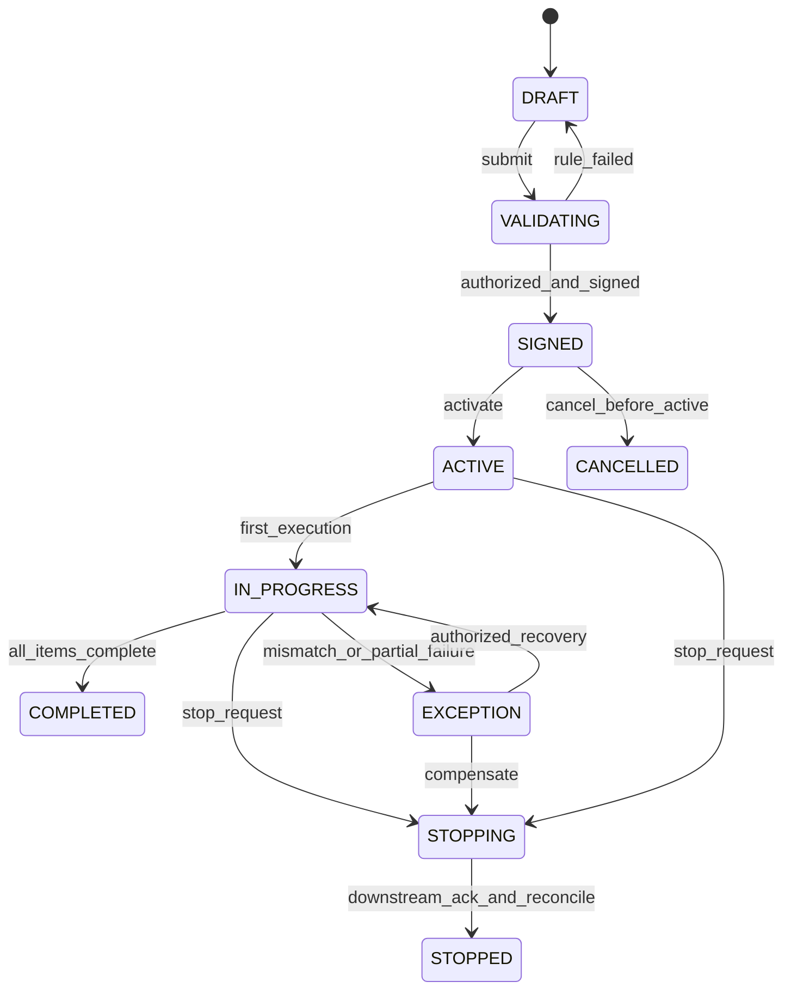
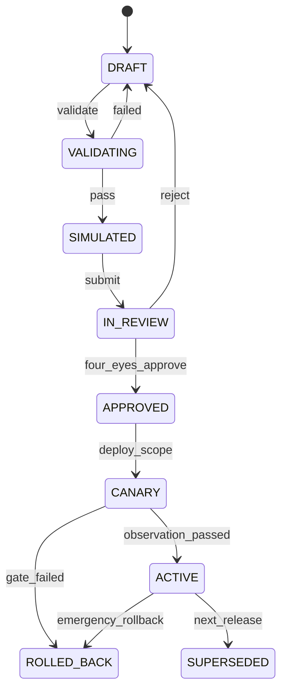

# openemr2026 v1.0 后端详细设计与临床状态治理（LLD-BACK）

## 1. 架构上下文与资产映射

### 1.1 前置资产验收

| 资产 | 对后端的强契约 |
|---|---|
| PRD v0.15 | 138 个领域能力；临床写入、迁移、配置、AI、全科室适配和恢复失败语义已定义 |
| Prototype v0.13 / UI v1.2.0 | 194 路由映射到 Query/Command/Job/Stream，含 70 个专科深页；页面状态不得用一个模糊 `loading/error` 替代 |
| HLD | `clinical-app` 为交易核心；`integration-hub`/`job-worker`/`ai-runtime` 是独立故障域 |
| LLD-DATA | PostgreSQL 是事实源；所有源键、版本、内容哈希、ContextReference 和 Outbox 字段字节对齐 |

### 1.2 工程基线

- Java 21、Spring Boot 4.1.x、Spring Modulith 2.1.x、Gradle Kotlin DSL。
- 业务代码依赖方向：`api -> application -> domain <- infrastructure`；领域模块之间只通过公开用例、事件或只读投影交互。
- 禁止 Controller 直调 Repository、跨模块 JPA entity 关联、在请求线程“顺手”发外部消息。
- 金丝雀版本锁定 Spring/PostgreSQL 小版，不随构建漂移。

## 2. 后端安全与性能本能

### 2.1 命令执行八道门


- 任何一道门计算失败默认拒绝；只有明确登记的停机续运模式可改变行为。
- 分布式锁不是常规写入的一致性基础；常规冲突使用数据库唯一约束、乐观版本和状态转移 `UPDATE ... WHERE row_version=? AND status=?`。
- Redis 短锁仅用于稀有的跨节点作业租约（如迁移切换），必须有 fencing token，禁止使用无期限锁。

### 2.2 数据与日志安全

- 请求日志白名单字段；不记录病历正文、证件号、手机、模型完整 Prompt/响应。
- 追踪属性只用伪名 `patient_ref_hash`，不使用姓名/门诊号。
- 密钥、模型凭据、CA 凭据只保存 secret reference；运行时短租约注入。
- 高风险读取（精神隐私、生殖、VIP、敏感人群）需二次用途确认并记录“读”审计。

## 3. 领域模块与事务设计

### 3.1 模块目录

```text
backend/
  app/                         # 组装、启动、运维端点
  modules/
    identity/                  # 账户、任期、岗位、资质适配
    organization/              # 机构、院区、科室、病区、床位
    patient/                   # MPI、标识、合并/撤销
    encounter/                 # 门急住就诊与转科/床
    documentation/             # 模板、文书、版本、签署、更正
    orders/                    # 医嘱/处方状态机
    results/                   # 标本、观察、报告、更正、危急值
    medication/                # 审方、调剂、退药、用药执行
    nursing/                   # 护理评估、任务、执行、交班
    archive/                   # 病案编目、封存、借阅、长期证据
    quality/                   # 规则、缺陷、整改、评级证据
    specialty_support/        # 科室支持声明、能力包依赖、上线证据与到期降级
    workflow_config/           # 受控 DSL、发布包、灰度/回滚
    tasks/                     # 统一临床任务、限时、升级、闭环
    ai_contracts/              # AIProposal/AIRun/ToolApproval 业务契约
    migration/                 # 批次、源键、对账、切换/回退
    audit/                     # 不可变审计、验真与取证
```

### 3.2 文书签署事务

```java
public record SignDocumentCommand(
    UUID tenantId,
    UUID documentId,
    UUID expectedVersionId,
    long expectedRowVersion,
    SignerContext signer,
    String idempotencyKey,
    String traceId
) {}

@Transactional
public SignDocumentResult sign(SignDocumentCommand cmd) {
  var replay = idempotency.claimOrReplay(cmd.tenantId(), cmd.idempotencyKey(), "SIGN_DOCUMENT");
  if (replay.isReplay()) return replay.resultAs(SignDocumentResult.class);
  authorization.require(cmd.signer(), "document.sign", cmd.documentId());
  credentials.requireValidAt(cmd.signer(), clock.instant());
  var aggregate = documents.lockForTransition(cmd.documentId(), cmd.expectedRowVersion());
  aggregate.requireCurrentVersion(cmd.expectedVersionId());
  qualityRuns.requireLatestForHash(aggregate.currentVersionId(), aggregate.canonicalDigest());
  var findings = signingRules.evaluate(aggregate, cmd.signer());
  findings.throwIfBlocking();
  var signed = aggregate.sign(signatureService.sign(aggregate.canonicalDigest(), cmd.signer()));
  documents.save(signed);
  audit.append(AuditEvent.documentSigned(signed, cmd.signer(), cmd.traceId()));
  outbox.append(DomainEvent.documentSigned(signed));
  idempotency.complete(replay.claim(), SignDocumentResult.from(signed));
  return SignDocumentResult.from(signed);
}
```

- CA/时间戳不可用时，默认不完成需 CA 的签署；已登记的停机续运策略可产生“待补强签名证据”状态，且必须限时补齐。
- 任何连接超时都不允许前端直接重新签署；先使用幂等键查询最终状态。
- “问题列表为空”不等于“已通过质控”；签署事务必须读取绑定当前 `document_version_id + canonical_hash` 的最新不可变质控运行。缺失时返回 `QUALITY_CHECK_REQUIRED`，阻断时返回 `SIGNING_RULE_BLOCKED`。

### 3.3 医嘱状态机



受保护转移必须在同一命令中校验患者、就诊、资质、过敏/剂量/互作用规则、行项版本和库存/价格水位。消息发送成功不等于下游业务完成。

### 3.4 Outbox 和投影

```sql
create table outbox_event (
  event_id uuid primary key,
  tenant_id uuid not null,
  aggregate_type varchar(64) not null,
  aggregate_id uuid not null,
  aggregate_version bigint not null,
  event_type varchar(128) not null,
  schema_version integer not null,
  payload jsonb not null,
  occurred_at timestamptz not null,
  available_at timestamptz not null,
  published_at timestamptz,
  attempt_count integer not null default 0,
  trace_id varchar(64) not null,
  unique (tenant_id, aggregate_type, aggregate_id, aggregate_version, event_type)
);
create index idx_outbox_pending on outbox_event(available_at, event_id) where published_at is null;
```

- 消费者使用 `consumer_name + event_id` 去重，更新投影水位。
- 同一聚合保证版本有序；不同聚合不承诺全局顺序。
- 死信重放需要原因、范围、影响预览和审计；不能“全部从头放”。

## 4. 接口契约与网关治理

### 4.1 通用 HTTP 契约

- 路径：`/api/v1/{domain}/...`；资源 ID 为 UUIDv7；外部标识作为查询条件，不放在内部主键位置。
- 写入必须携带 `Idempotency-Key`、`If-Match`/`expectedVersion`、`X-Organization-Context`、`X-Facility-Context`、`X-Patient-Context`、`X-Encounter-Context`（适用时）；服务端将其与身份声明及 `ContextLease` 交叉校验，不信任单独请求头。
- 读响应携带 `ETag`、`X-Data-Watermark`、`X-Partial-Sources`和 `Cache-Control: no-store`（临床正文）。
- 时间均用 RFC3339 + offset；库内 `timestamptz`；临床展示保留机构时区。

```json
{
  "error": {
    "code": "DOCUMENT_VERSION_CONFLICT",
    "category": "CONFLICT",
    "message": "文书已被其他用户更新，禁止静默覆盖。",
    "trace_id": "01J...",
    "retryable": false,
    "recovery": {
      "action": "OPEN_DIFF",
      "current_version_id": "...",
      "draft_recovery_token": "one-time-token"
    },
    "violations": [{"field":"expected_version_id","rule":"DOC-CURRENT-VERSION","severity":"BLOCKING"}]
  }
}
```

### 4.2 核心 API

| Method/Path | 用途 | 幂等/并发 | 主要错误 |
|---|---|---|---|
| `POST /api/v1/patients/search` | 受审计 MPI 查询 | 读取用途必填；返回最少字段 | `PURPOSE_REQUIRED`, `SCOPE_DENIED` |
| `POST /api/v1/patients` | 登记/待核患者 | Idempotency-Key；标识唯一约束 | `POSSIBLE_DUPLICATE`, `IDENTIFIER_CONFLICT` |
| `POST /api/v1/encounters` | 创建门急住就诊 | 源键+幂等键 | `INVALID_ORG_CONTEXT`, `DUPLICATE_SOURCE_KEY` |
| `PUT /api/v1/documents/{id}/draft` | 保存草稿 | If-Match；服务端合并禁止 | `VERSION_CONFLICT`, `PATIENT_CONTEXT_CHANGED` |
| `POST /api/v1/documents/{id}/quality-checks` | 对指定当前版本运行确定性质控 | 版本/内容哈希绑定；每次运行证据不可变 | `CONTEXT_NOT_PERMITTED`, `INVALID_DOCUMENT_STATE` |
| `GET /api/v1/documents/{id}/governance` | 读取质控、问题、签名、审签与退回证据 | 同患者/同就诊；`no-store` | `CONTEXT_NOT_PERMITTED` |
| `POST /api/v1/documents/{id}/signatures` | 单/双签 | 签名幂等键；当前版本 | `SIGNING_RULE_BLOCKED`, `CREDENTIAL_EXPIRED` |
| `POST /api/v1/documents/{id}/corrections` | 创建更正版 | 被替代版本+原因 | `NOT_CURRENT_CHAIN`, `ARCHIVE_HOLD` |
| `POST /api/v1/orders` | 创建医嘱草稿 | 业务幂等键 | `ORDER_DUPLICATE`, `CONTEXT_STALE` |
| `POST /api/v1/orders/{id}/sign` | 医嘱签署生效 | expectedVersion；规则水位 | `MEDICATION_BLOCK`, `QUALIFICATION_DENIED` |
| `POST /api/v1/executions/{id}/verify` | 扫码/双人核对 | 核对 token 一次性 | `PATIENT_MISMATCH`, `SITE_MISMATCH`, `EXPIRED_TOKEN` |
| `POST /api/v1/config/releases` | 发布配置包 | 差异哈希+双人审批 | `PROTECTED_INVARIANT`, `SIMULATION_FAILED` |
| `PUT /api/v1/specialty-support/{facilityId}/{departmentId}/{scope}` | 创建/更新科室支持声明 | If-Match；证据包 hash；批准人职责分离 | `PACK_INCOMPATIBLE`, `EVIDENCE_EXPIRED`, `SAFETY_GATE_MISSING` |
| `POST /api/v1/migrations/{id}/reconcile` | 对账 | 批次水位锁定 | `SOURCE_DRIFT`, `UNRESOLVED_IDENTITY` |
| `POST /api/v1/context-leases` | 为当前用途签发短期上下文租约 | 服务器从身份、机构、患者/就诊和策略计算范围 | `CONTEXT_DENIED`, `PURPOSE_REQUIRED` |
| `POST /api/v1/ai/runs` | 创建 AI 异步运行，返回 `202 + run_id/state` | Idempotency-Key + context_lease_id；不占用请求线程等待模型 | `LEASE_EXPIRED`, `AI_USE_CASE_DISABLED` |
| `GET /api/v1/ai/runs/{id}` | 运行快照/断流恢复 | 重新鉴权；返回最新 sequence/watermark | `RUN_NOT_FOUND_OR_DENIED` |
| `POST /api/v1/ai/runs/{id}/cancel` | 取消未完成运行 | 幂等；已执行副作用只进入对账 | `RUN_TERMINAL`, `RECONCILIATION_REQUIRED` |
| `POST /api/v1/ai/proposals/{id}/decisions` | 接受、修改或拒绝候选 | Idempotency-Key + expected proposal version；接受后仍走领域命令 | `APPROVAL_EXPIRED`, `CONTEXT_STALE`, `POLICY_CHANGED` |

### 4.3 SSE 事件契约

任务流使用 `GET /api/v1/streams/tasks?scope=...`；AI 单运行流使用 `GET /api/v1/streams/ai-runs/{run_id}`。二者都使用 `Last-Event-ID` 续传。服务端每 15s 发注释心跳，事件保留 24h（可配）。

```text
id: 01J5...
event: task.state.changed
data: {"schema_version":1,"task_id":"...","state":"WAITING_APPROVAL","watermark":"...","occurred_at":"..."}

```

- 客户端以 `event_id` 去重；断档时先 REST 拉取快照再用新 offset 连接。
- SSE 不承载大病历正文；只传资源 ID、状态、水位和最小展示摘要。

AI 事件 `event:` 固定为 `ai.run.event`，`data` 固定为以下 `snake_case` envelope：

```json
{"schema_version":1,"event_id":"01J...","run_id":"uuid","sequence":7,"event_type":"RUN_STATE_CHANGED","state":"VERIFYING","occurred_at":"2026-08-14T10:00:00+08:00","data_watermark":"opaque","context_lease_id":"uuid","payload":{}}
```

`event_type` 只允许 `RUN_STATE_CHANGED/REFERENCE_ADDED/PROPOSAL_UPSERTED/VERIFICATION_UPDATED/SNAPSHOT_REQUIRED`；`state` 与 LLD-AGENT 的 `AIRunState` 字典逐字一致。单 run 的 `sequence` 严格递增，重放保持相同 `event_id/sequence`。保留窗外的 `Last-Event-ID` 返回 `SNAPSHOT_REQUIRED`，不从错误水位继续拼接。响应以完整 UTF-8 JSON frame flush，禁止在多字节字符或 JSON token 中间切帧。

### 4.4 外部集成

| 协议 | 用途 | 超时/重试 | 降级 |
|---|---|---|---|
| HL7 v2 MLLP | ADT/ORM/ORU、检验/医嘱/结果 | connect 3s，ack 10s；指数退避 1m/5m/15m，最多 8 次 | 持久化失败队列，人工重放前重新对账 |
| FHIR R4 HTTPS | 标准查询/交换 | connect 3s，read 15s；GET 最多 2 次，POST 仅幂等条件下重试 | 返回 OperationOutcome；不伪装成完整数据 |
| DICOMweb | QIDO/WADO/STOW | query 10s，metadata 15s，像素流 60s/分块 | PACS 不可用时显示时间与重试，不缓存过期诊断图像伪装在线 |
| 文件/SFTP | 老系统批量 | 文件稳定窗口+摘要；作业级重试 3 次 | 原文隔离、错误报告、不部分静默导入 |
| CA/时间戳 | 签名证据 | connect 3s，request 8s，查询最多 2 次 | 依机构策略阻断或待补强，不返回虚假成功 |

所有连接器包含 `connector_id/version/capability_statement/source_of_truth/retry_policy/data_classification`，在 DMZ 不保存无期限临床正文。

### 4.5 统一错误与客户端恢复目录

| Error code | HTTP | 可重试 | 安全消息 | 客户端恢复 | 日志 |
|---|---:|---|---|---|---|
| `AUTHENTICATION_REQUIRED` | 401 | 否 | 会话已失效，请重新登录 | 保存安全草稿后重新认证 | INFO，不记录令牌 |
| `SCOPE_DENIED` / `RESOURCE_NOT_FOUND_OR_DENIED` | 403/404 | 否 | 当前上下文无权访问 | 返回队列/申请授权 | WARN，资源 ID 哈希化 |
| `PATIENT_CONTEXT_CHANGED` | 409 | 否 | 患者或就诊上下文已变化 | 丢弃旧请求并重新选择上下文 | WARN |
| `VERSION_CONFLICT` | 409 | 否 | 资源已被更新，不能静默覆盖 | 打开差异并恢复本地草稿 | INFO |
| `RULE_BLOCKED` / `SAFETY_GATE_MISSING` | 422 | 否 | 存在必须处理的安全项 | 定位字段/规则/证据 | INFO |
| `IDEMPOTENCY_IN_PROGRESS` | 409 | 是（只查询） | 操作仍在处理中 | 使用原幂等键查询最终状态 | INFO |
| `DEPENDENCY_TIMEOUT` | 503 | 有条件 | 外部服务暂不可用 | 显示来源和时间；允许安全重试/回人工 | WARN |
| `PARTIAL_SOURCE` | 206 | 否 | 部分来源不可用，当前数据不完整 | 保留可用内容并显著标记 | INFO |
| `RATE_LIMITED` | 429 | 是 | 请求过于频繁 | 按 `Retry-After` 等待 | INFO，无患者标签 |
| `INTERNAL_INTEGRITY_FAILURE` | 500 | 否 | 完整性校验失败，操作未完成 | 阻断并联系管理员/进入对账 | ERROR/P0，禁止正文入日志 |

稳定错误码只新增不改义；HTTP 状态、`retryable` 和 `recovery.action` 必须通过 OpenAPI 契约测试与前端恢复矩阵逐字一致。

### 4.6 环境配置与生产启动保护

| 变量/配置 | 必需环境 | 默认 | 敏感 | 缺失或无效时 |
|---|---|---|---|---|
| `OPENEMR_PROFILE` | 全部 | `local`（仅开发） | 否 | 生产值不是 `production` 时拒绝 Stable 启动 |
| `OPENEMR_DB_URL` | 全部 | 无 | 否 | 就绪失败；不回退内存库 |
| `OPENEMR_DB_USER` / `OPENEMR_DB_PASSWORD_REF` | 全部 | 无 | 是 | 启动失败；只接受 secret reference/注入 |
| `OPENEMR_OBJECT_STORE_ENDPOINT` / `..._CREDENTIAL_REF` | 生产 | 无 | 是 | 临床附件模块不可就绪；不得静默写本地临时盘 |
| `OPENEMR_OIDC_ISSUER` / `OPENEMR_OIDC_CLIENT_ID` | 生产 | 无 | 部分 | 启动失败；应急账户走独立策略 |
| `OPENEMR_SIGNING_PROVIDER` / `..._SECRET_REF` | 需可信签名机构 | `disabled`（开发） | 是 | 对需 CA 的签署返回明确阻断，不伪造成功 |
| `OPENEMR_AI_ENABLED` | 全部 | `false` | 否 | 关闭 AI，手工 EMR 主链继续 |
| `OPENEMR_AI_ROUTE_RELEASE_ID` | AI 启用 | 无 | 否 | AI 子系统不就绪；不自动选任意模型 |
| `OPENEMR_KMS_KEY_REF` | 生产 | 无 | 是 | 所有敏感写入与对象存储就绪失败 |
| `OPENEMR_TRUSTED_PROXY_CIDRS` | 反向代理部署 | 空 | 否 | 不信任转发 IP；限流按直连地址，生产检查报警 |
| `OPENEMR_SYNTHETIC_MODE` | 开发/测试 | `false` | 否 | 生产若为 true 立即拒绝启动 |

启动器输出只含配置名、来源层和校验结果，不打印秘密值；`/actuator/health/readiness` 分开报告 DB、对象存储、身份、签名、集成和 AI，非核心依赖失败不得把核心临床服务伪报不可用或完全正常。

## 5. 配置、Agent 与长任务编排

### 5.1 配置发布状态机



DSL 只引用登记的 `ActionDefinition`、受限表达式、表单字段和规则操作符。验证器检测循环、无终止状态、不可达节点、职责冲突、平台保护规则降级和无回滚路径。

### 5.2 长任务通用状态

`QUEUED -> LEASED -> RUNNING -> WAITING_APPROVAL|WAITING_EXTERNAL -> SUCCEEDED|FAILED_RETRYABLE|FAILED_FINAL|CANCELLED|COMPENSATING -> COMPENSATED`。

```sql
create table durable_job (
  job_id uuid primary key,
  tenant_id uuid not null,
  job_type varchar(64) not null,
  state varchar(32) not null,
  input_ref jsonb not null,
  checkpoint jsonb,
  lease_owner varchar(128),
  lease_fencing_token bigint not null default 0,
  lease_expires_at timestamptz,
  attempt integer not null default 0,
  max_attempts integer not null,
  next_attempt_at timestamptz,
  progress integer not null default 0 check (progress between 0 and 100),
  result_ref jsonb,
  error_code varchar(128),
  created_at timestamptz not null,
  updated_at timestamptz not null
);
```

OCR/导出/迁移/AI 的 Worker 池、队列、超时和预算独立，禁止重任务占满临床请求线程或数据库连接池。

`AIRun` 使用 LLD-AGENT 的专用状态机，`durable_job` 只负责租约、重试和恢复；两者通过不可变 `job_id/run_id` 关联，禁止把 `FAILED_RETRYABLE` 等 Worker 状态直接推给前端冒充 AIRun 状态。运行时强制保存并原子扣减 `max_model_calls/max_tool_calls/max_input_tokens/max_output_tokens/deadline_at`；同一 `tool_name + normalized_args_hash` 无新证据时最多执行 1 次，所有可恢复错误合计最多 2 次重试。超预算、租约 fencing 失败或 Deadline 到期立即停止调度并发出结构化终态，不能只依赖 Prompt 自律。

## 6. 高并发、缓存与资源隔离

容量档位是部署参数，不是按“诊所/二级/三级医院”写死的代码分支：S 档使用同一进程内模块和独立 Worker 池；M 档横向扩应用并启用 HA/Redis；L 档按门急住、集成、AI、导出/科研设置独立连接池、线程池、队列配额和熔断域。只有 1.5× 目标负载压测、Outbox 追平和恢复演练达标后，档位才能标记 `VERIFIED`。

| 对象 | 策略 |
|---|---|
| 患者时间线 | 窗口分页 + 按就诊聚合读模型；不一次拉取全生命周期正文 |
| 病区队列 | 按病区/班次投影；事件增量更新；水位过期显示 |
| 文书草稿 | 服务端版本 + 客户端加密短期恢复；只合并非重叠字段，冲突必须差异审查 |
| 字典/配置 | 版本化缓存键，发布时原子切换指针；旧会话按策略固定或过期 |
| 热点患者 | 聚合级乐观锁，不使用一个 patient 全局大锁；文书/医嘱/执行使用各自聚合版本 |
| 审计 | 月分区、异步索引、重要事件同事务摘要；审计不可因搜索延迟丢失 |

L1 应用缓存只存不含 PHI 的静态定义；L2 Redis 存短期会话/限流/水位；L3 PostgreSQL 是唯一事实。空对象缓存和布隆过滤器只用于非临床定义查询，不使用概率结构判断患者是否存在。

## 7. 可观测、告警与恢复

### 7.1 指标

- HTTP：按路由族的 RPS/p50/p95/p99/4xx/5xx，不以患者 ID 作 label。
- DB：连接池、锁等待、慢查询、复制延迟、WAL 增长、分区大小、膨胀。
- Outbox：最旧待发年龄、积压数、重试/死信、消费水位。
- 集成：连接器 ACK 延迟、错误码、重复/乱序、失败队列、对账差异。
- 安全：拒绝率、紧急访问、高风险导出、权限策略计算失败、审计写失败。

### 7.2 告警例

| 级别 | 条件 | 恢复条件 |
|---|---|---|
| P0 | 临床写 5xx >5% 持续 3min；主库不可写；审计同事务失败；错患者事件 | 人工确认主链恢复且对账通过 |
| P1 | Outbox 最旧 >5min；LIS/PACS 队列超容量 70%；复制延迟超 RPO 预算 | 连续 15min 低于阈值且无未处理差异 |
| P2 | 单路由 p95 超 SLO 15min；某科室配置灰度错误率上升 | 回滚/修复后 30min 稳定 |

## 8. Eng Manager & QA 验收清单

- [ ] 模块架构测试阻止跨模块表/Repository 访问和反向依赖。
- [ ] 所有写 API 有幂等、预期版本、患者/就诊上下文和审计验收用例。
- [ ] 签署、更正、医嘱生效、执行、患者合并和配置发布有非 Happy Path 状态机测试。
- [ ] 外部依赖每个调用点均明确 connect/read/overall timeout、重试次数、幂等条件、熔断与降级体。
- [ ] 断网、超时、重复、乱序、部分成功、杀 Worker 和重放不产生双份业务副作用。
- [ ] 日志、trace、metric label、错误体不泄漏病历正文和直接标识。
- [ ] 备份恢复运行实际业务完整性验证，不以进程退出码代替数据证据。

## 9. V24 病案归档、封存与导出实现契约

- `archive` 是独立模块，但只读取 `clinical_document/current_version`、`document_quality_run`和 `signature_evidence` 的不可变事实；不回写临床正文或签名状态。
- 查询 `GET /archive/readiness` 返回结构化 blocker；命令 `POST /archive/cases`、`/{id}/seals`、`/{id}/unseals`、`/{id}/export-packages` 均要求患者/就诊租约、幂等键和服务端岗位再校验。
- 归档就绪度只由确定性规则决定：`Encounter=FINISHED`，至少一份当前文书，所有当前版本 `SIGNED`，最新质控 `PASSED` 且 `content_hash` 一致，签名数大于 0 且全部 `VALID`。AI 不能调整此门禁。
- 首次封存必须由与 `archived_by` 不同的 `MEDICAL_RECORDS/CLINICAL_ADMIN` 执行；解封仅 `CLINICAL_ADMIN`，理由长度至少 4，并通过行版本观测并发。
- 导出仅对 `SEALED` 病案开放。服务端先完整构建 JSON，再按 UTF-8 计算 `byte_count` 和 SHA-256，最后在同一事务持久化 `READY`、事件、审计与 Outbox；部分构建或写入失败不存在“成功包”。
- 下载 `GET /archive/export-packages/{id}/content` 返回存储的精确正文字节、`Content-Length` 和 `X-Content-SHA256`；病案解封后下载默认拒绝。
- 当前原子切片不包括纸质扫描/OCR/恶意文件检测、借阅审批、CDA/PDF 生成和长期保存介质迁移，这些仍是 FR-094/105 的后续门禁。

## 10. S005-2 机器可验证后端契约

### 10.1 API / Event 目录

| operation_id | caller | method/path or topic | auth / input | output | errors | idempotency / timeout / rate | version |
|---|---|---|---|---|---|---|---|
| `Document_SaveDraft` | Web BFF | `PUT /api/v1/documents/{id}/draft` | OIDC+ContextLease+`If-Match`; DraftDocumentV1 | ResourceEnvelope<DocumentVersion> | `VERSION_CONFLICT`,`PATIENT_CONTEXT_CHANGED`,`RULE_BLOCKED` | Idempotency-Key；3s；用户/文书限流 | v1 |
| `Document_RunQC` | Web/Job | `POST /api/v1/documents/{id}/quality-checks` | `document_version_id+canonical_hash+rule_release_id` | immutable QualityRun | `QUALITY_CHECK_REQUIRED`,`INVALID_DOCUMENT_STATE` | 同版本+规则+哈希可重放；5s/异步降级 | v1 |
| `Document_Sign` | Web BFF | `POST /api/v1/documents/{id}/signatures` | 临床资质+签署权+expectedVersion | signed evidence/result | `SIGNING_RULE_BLOCKED`,`CREDENTIAL_EXPIRED`,`DEPENDENCY_TIMEOUT` | 必须幂等；8s；超时进对账 | v1 |
| `Archive_Export` | 病案室 | `POST /api/v1/archive/cases/{id}/export-packages` | SEALED+用途+岗位+租约 | 202 JobRef / READY package | `ARCHIVE_NOT_SEALED`,`PURPOSE_REQUIRED` | 业务键；2s 接收；作业 10min 待基线 | v1 |
| `Migration_Reconcile` | 迁移工作台 | `POST /api/v1/migrations/{id}/reconcile` | MIGRATION_ADMIN+锁定批次水位 | ReconcileRun | `SOURCE_DRIFT`,`UNRESOLVED_IDENTITY` | batch+watermark；202；作业级限流 | v1 |
| `AI_RunCreated` | ai-runtime | `ai.run.created.v1` | service identity + signed event | event ack/watermark | `SCHEMA_UNSUPPORTED`,`LEASE_EXPIRED` | event id + consumer；30s lease | v1 |
| `Clinical_FactChanged` | domain modules | `clinical.fact.changed.v1` | Outbox schema + tenant/aggregate version | 投影水位 | `EVENT_GAP`,`SCHEMA_UNSUPPORTED` | event id；有界重试；死信 | v1 |

全量 OpenAPI/AsyncAPI 必须生成 `operation_id,caller,method_or_event,path_or_topic,auth,input_schema,output_schema,error_refs,idempotency,timeout,rate_limit,version` 清单；上表是 P0 交互契约，不替代全量制品。

### 10.2 写操作与并发决策

| command | transaction owner | duplicate semantics | conflict / partial failure | audit and compensation |
|---|---|---|---|---|
| SaveDraft | documentation | 原幂等键返回同版本 | ETag 冲突返回差异 token，绝不服务端静默合并 | 保留本地恢复引用，无外部补偿 |
| SignDocument | documentation | 重放返回同 signature/result | CA 超时不再签，用原键查最终态 | 业务+审计+Outbox 同事务；待补强证据限时任务 |
| ExecuteOrder | orders/execution | 一次性核对 token+唯一约束 | 部分执行进 EXCEPTION/RECONCILING，不倒退已执行事实 | 逐项执行证据+人工对账/停止命令 |
| PublishConfig | workflow_config | release hash+作用域唯一 | 乐观版本；模拟/保护规则失败阻断 | 金丝雀失败回滚指针，不改旧 release |

### 10.3 异步作业、权限和外部依赖

| job_type | states / lease | timeout/cancel | retry/backoff/DLQ | result/idempotency/observability |
|---|---|---|---|---|
| MIGRATION_BATCH | 通用 durable states + fencing lease | 24h 待基线；切换前可取消 | 3 次有界重试；业务差异不自动重试 | batch/source key；进度、水位、隔离数 |
| ARCHIVE_EXPORT | lease+checkpoint | 10min 待基线；完整包前可取消 | 对象失败 3 次；部分包永不 READY | archive+purpose+manifest hash；字节/hash |
| AI_RUN | AIRun+durable worker 双层 | Skill 最长 45s 初值；立即取消新 Tool | 总恢复重试最多 2；失败转人工 | run id；预算、工具、模型、来源指标 |

| subject | resource/action | scope/condition | decision point | audit_fields |
|---|---|---|---|---|
| 临床医生 | document:read/edit/sign | 机构+科室+患者/就诊+任期+执业资质 | BFF PEP + domain PDP | actor/role/purpose/patient hash/resource/decision/reason/trace |
| 护士/技师 | order:execute/result:verify | 班次+执行地点+核对 token+必要双人 | domain command | 上下文、核对人、设备/标本、结果 |
| 病案人员 | archive:seal/export | 已归档+职责分离+用途 | archive module | archive/manifest/purpose/approvals/hash |
| AI service | tool:invoke | ContextLease+Agent/Skill/Tool release+预算+风险决策 | Tool Gateway PreHook | run/lease/tool/args hash/decision/result hash |

| dependency / owner | data_shared / auth | timeout/retry/circuit | fallback / SLO evidence / monitoring |
|---|---|---|---|
| LIS/HIS / 集成 owner | ADT/ORM/ORU 最小字段；MLLP/VPN/mTLS | connect 3s/ACK 10s；幂等消息 8 次；连接器熔断 | 持久化失败队列+对账；SLO 待院内基线；ACK/积压/重复率 |
| PACS / 影像 owner | 元数据/短时像素 URL；OIDC/mTLS | query 10s/stream 60s；GET 有界重试；独立熔断 | 显示不可用及时间，不伪缓存；成功/超时/断点 |
| CA/TSA / 医务+安全 | 内容摘要/证书参考；mTLS+短租约凭据 | 3s/8s；查询 2 次；熔断 | 阻断或待补强；验签成功、过期、延迟 |
| Model Gateway / AI owner | 经路由批准的最小上下文；secret ref+mTLS | 用例 deadline；仅等价边界备模型；用例熔断 | 手工 EMR 继续；TTFT/超时/路由/数据等级 |

S005-2 状态为 `CREATED`；契约校验、认证/授权负向用例、重放/乱序/并发冲突、故障降级和敏感日志测试全有证据后才可 `VERIFIED`。
