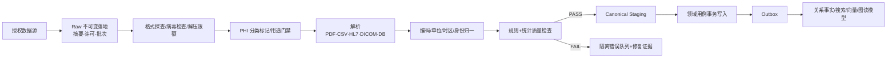
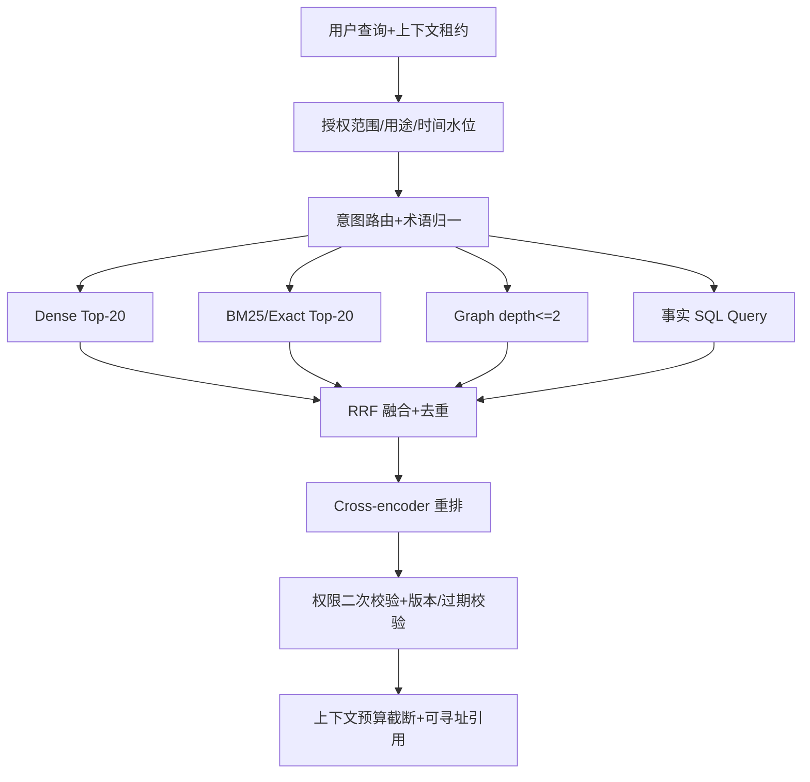

# openemr2026 v1.0 数据、迁移与检索详细设计（LLD-DATA）

## 1. 架构上下文与前置资产映射

### 1.1 上游验收

- PRD v0.15：138 FR/AC，对患者、就诊、病历版本、签署、医嘱、结果、病案、迁移、质控、科研、AI、全科室适配和恢复均有验收契约。
- HLD：PostgreSQL 是唯一临床事实源；对象存储承载附件与原始证据；搜索、向量和图是可重建读模型。
- 本 LLD 是 LLD-BACK/AGENT 的字段、溯源、迁移和检索绝对基准。

### 1.2 数据不变量

1. `tenant_id`/`facility_id`/`patient_id`/`encounter_id` 不得从前端显示文本推导，只能从授权上下文和主键获得。
2. 外部系统标识保留在 `source_system + source_key + assigning_authority`，不直接取代内部 UUIDv7。
3. 已签文书内容不 UPDATE；更正生成新 `document_version`，原版本与签名保留。
4. 附件、导入原文和恢复制品按 SHA-256 寻址，元数据与对象同时验真。
5. 搜索/向量/图返回的任何临床文本必须回到 PostgreSQL 重新授权，索引命中不等于可读。
6. AI 训练/评估集和科研数据集是派生数据产品，有用途、伦理/审批、去标识版本和到期回收，不与交易库混用。

## 2. 真实数据寻源与采集矩阵

> 以下来源已于 2026-08-14 核验。开源仓库不默认再分发受限术语或病历；每个数据包在导入前必须通过许可门禁。

| 类别 | 真实来源 | 采集方式 | 格式 | 许可/质量门禁 | 更新 |
|---|---|---|---|---|---|
| 中国 EMR 数据集 | [WS 445 系列清单](https://www.nhc.gov.cn/fzs/c100048/201406/077528a74b04441da2ccce0082ce01e9.shtml) | 人工批准的标准包导入 | PDF/结构化映射 | 保留标准号、实施日期、映射版本 | 跟随卫健标准发布 |
| 中国值域 | [WS/T 364.1—2023](https://www.nhc.gov.cn/fzs/c100048/202310/16a32e2b1c0b42e99480b945ef10c0dc/files/1733821985537_88120.pdf) 及分册 | 值域包导入器 | CSV/JSON | 弃用码不得新选，历史仍可解析 | 按发布版本 |
| 检验观察术语 | [LOINC 2.82](https://loinc.org/downloads/) | 需登录的官方下载/API，离线包导入 | CSV/XML/FHIR | 自由使用但必须附带许可和归属；不修改标准内容 | 通常每年 2 次 |
| 计量单位 | [UCUM 2.2](https://ucum.org/ucum) | 官方 XML/单位包导入 | XML/CSV | 校验大小写敏感代码和换算维度；附带许可 | 按官方发布 |
| 疾病分类 | 医院持有的国家临床版术语包；[WHO ICD API v2](https://icd.who.int/docs/icd-api/APIDoc-Version2/) | 秘密引用+OAuth2；离线包需许可 | REST/JSON | 不默认再分发中国临床版；记录分类/线性化/语言/版本 | 按发布版本 |
| 影像互操作 | [DICOM Current Edition](https://www.dicomstandard.org/current/)、[DICOMweb](https://www.dicomstandard.org/using/dicomweb) | PACS 连接器 | DICOM/JSON | 只索引元数据/缩略图，像素数据优先留在 PACS | 连接器能力声明版本 |
| 国际临床研究数据 | [MIMIC-IV 3.0](https://www.physionet.org/content/mimiciv/3.0/) | 凭证用户、CITI 培训、DUA 后人工导入 | CSV | 只用于许可的本地研究/开发，不随仓库分发；不是中国临床标准 | 按 PhysioNet 版本 |
| 医院历史病历 | HIS/EMR/LIS/PACS/纸质扫描 | CDC/API/数据库快照/文件批次 | DB/HL7/CSV/XML/PDF/DICOM | 最高敏感级；专用迁移区；原文不改；逐轮业务对账 | 按项目批次/CDC |
| 药品/耗材/价格 | 医院主数据、经批准国家/地方数据 | 主数据版本包/集成 | CSV/API | 来源、许可、有效期、映射责任人必填；本项目不再分发不明许可数据 | 机构自定 |

## 3. 数据清洗、迁移与加工流水线

### 3.1 通用数据管道



### 3.2 历史病历迁移专用管道

1. **Discover**：盘点源表/文件/接口、字段、编码、时区、缺失率、主从关系、数量与许可。
2. **Freeze raw**：生成 `migration_batch`、快照水位、文件清单和 SHA-256；原始数据只读。
3. **Stage**：每条源记录保留 `source_system/source_table/source_pk/raw_object_key/raw_hash`，禁止丢弃未识别字段。
4. **Identity**：先匹配机构/人员/字典，再执行 MPI 候选；高相似或冲突项进入人工工作队列。
5. **Transform**：映射到 Canonical DTO；原编码、原单位、原文本和转换规则版本同时保留。
6. **Load**：只通过迁移专用领域用例；每批次、每条源键幂等；禁止直接跨表 INSERT。
7. **Reconcile**：数量、关联、金额、时间线、文书版本、签名元数据、附件哈希和抽样业务七类对账。
8. **Cutover**：全量试迁移→增量追平→业务签字→短暂写入窗口→最终追平→切换。
9. **Rollback**：在回退窗口内将新系统改为只读，导出增量证据并恢复旧系统主路；不删除已迁移事实。

### 3.3 脱敏与数据产品管道

- 交易库内的真实身份用于法定诊疗，不进行破坏性“就地脱敏”。
- 科研/AI 导出使用独立管道：字段白名单→直接标识移除→准标识 tokenization→日期偏移→稀有组合风险评估→用途签名→到期删除证明。
- 脱敏不只依赖正则；对自由文本运行中文 NER + 规则，生成负样本红队集，必须证明医生/医院/联系方式/地址/证件号等无泄漏。
- 生产原文不默认进入外部模型。

## 4. 核心 Schema 与按需读模型

### 4.1 物理部署策略

| 逻辑能力 | 内容 | S/M 默认实现 | L 候选实现 | 一致性与启用证据 |
|---|---|---|---|---|
| 关系事实库 | 临床交易、元数据、审计、任务 | PostgreSQL | PostgreSQL HA/分区/读副本 | 强一致事实 |
| 关键词检索 | 精确术语、病历全文、索引字段 | PostgreSQL FTS | OpenSearch | Outbox 最终一致，可重建；只有 FTS 压测不达标才外置 |
| 语义检索 | 指南/Skill/经批准脱敏记录的语义 chunk | pgvector 或关闭 | Qdrant/等价 | 最终一致，可重算；没有批准 AI/RAG 用例时不部署 |
| 关系推理 | 术语、映射、禁忌、临床路径和证据关系 | PostgreSQL node/edge | Neo4j/等价 | 版本化知识发布，可重建；开放图遍历禁止进入临床请求 |

### 4.2 核心关系 Schema（PostgreSQL 18）

```sql
create table patient (
  patient_id uuid primary key,
  tenant_id uuid not null,
  status varchar(24) not null check (status in ('PENDING_IDENTITY','ACTIVE','MERGED','DECEASED','INACTIVE')),
  administrative_gender_code varchar(32),
  birth_date date,
  deceased_at timestamptz,
  row_version bigint not null default 0,
  created_at timestamptz not null,
  updated_at timestamptz not null,
  unique (tenant_id, patient_id)
);

create table patient_identifier (
  patient_identifier_id uuid primary key,
  tenant_id uuid not null,
  patient_id uuid not null references patient(patient_id),
  identifier_type varchar(48) not null,
  assigning_authority varchar(128) not null,
  identifier_hash bytea not null,
  identifier_ciphertext bytea not null,
  valid_from timestamptz not null,
  valid_to timestamptz,
  status varchar(16) not null,
  unique (tenant_id, assigning_authority, identifier_type, identifier_hash)
);

create table encounter (
  encounter_id uuid primary key,
  tenant_id uuid not null,
  patient_id uuid not null references patient(patient_id),
  encounter_type varchar(24) not null,
  status varchar(32) not null,
  facility_id uuid not null,
  department_id uuid,
  service_period tstzrange not null,
  source_system varchar(64),
  source_key varchar(128),
  row_version bigint not null default 0,
  created_at timestamptz not null,
  updated_at timestamptz not null,
  unique (tenant_id, source_system, source_key)
);
create index idx_encounter_patient_time on encounter(tenant_id, patient_id, lower(service_period) desc);

create table clinical_document (
  document_id uuid primary key,
  tenant_id uuid not null,
  patient_id uuid not null,
  encounter_id uuid not null,
  document_type_code varchar(64) not null,
  template_version_id uuid not null,
  current_version_no integer not null,
  lifecycle_status varchar(24) not null,
  confidentiality_code varchar(24) not null default 'NORMAL',
  row_version bigint not null default 0,
  created_by uuid not null,
  created_at timestamptz not null
);
create index idx_document_encounter on clinical_document(tenant_id, encounter_id, document_type_code, created_at desc);

create table document_version (
  document_version_id uuid primary key,
  tenant_id uuid not null,
  document_id uuid not null references clinical_document(document_id),
  version_no integer not null,
  version_kind varchar(24) not null check (version_kind in ('DRAFT','SIGNED','CORRECTION','ARCHIVED')),
  structured_content jsonb not null,
  narrative_text text not null,
  canonical_hash char(64) not null,
  supersedes_version_id uuid,
  correction_reason text,
  author_id uuid not null,
  authored_at timestamptz not null,
  signed_at timestamptz,
  created_at timestamptz not null,
  unique (tenant_id, document_id, version_no),
  unique (tenant_id, canonical_hash, document_version_id)
);

create table document_signature (
  signature_id uuid primary key,
  tenant_id uuid not null,
  document_version_id uuid not null references document_version(document_version_id),
  signer_id uuid not null,
  signer_role_code varchar(64) not null,
  certificate_ref varchar(256),
  signature_algorithm varchar(64) not null,
  signed_digest bytea not null,
  signed_at timestamptz not null,
  timestamp_evidence_object_id uuid,
  verification_status varchar(24) not null,
  unique (tenant_id, document_version_id, signer_id, signer_role_code)
);

-- 每次质控运行是可取证事实，不能由当前 finding 反推是否真正运行过。
create table document_quality_run (
  tenant_id uuid not null,
  quality_run_id uuid not null,
  document_id uuid not null,
  document_version_id uuid not null,
  rule_version varchar(64) not null,
  outcome varchar(24) not null check (outcome in ('PASSED','WARNING','BLOCKED')),
  finding_count integer not null,
  blocking_count integer not null,
  warning_count integer not null,
  content_hash char(64) not null,
  executed_by uuid not null,
  executed_at timestamptz not null,
  primary key (tenant_id, quality_run_id),
  foreign key (document_version_id) references document_version(document_version_id)
);

-- UPDATE/DELETE 均由数据库触发器拒绝；签署仅接受与当前内容哈希相同的最新运行。

create table clinical_order (
  order_id uuid primary key,
  tenant_id uuid not null,
  patient_id uuid not null,
  encounter_id uuid not null,
  order_type varchar(32) not null,
  status varchar(24) not null,
  placer_id uuid not null,
  placed_at timestamptz,
  stopped_at timestamptz,
  row_version bigint not null default 0,
  idempotency_key varchar(128) not null,
  unique (tenant_id, idempotency_key)
);

create table observation (
  observation_id uuid primary key,
  tenant_id uuid not null,
  patient_id uuid not null,
  encounter_id uuid,
  order_id uuid,
  code_system varchar(64) not null,
  code varchar(128) not null,
  status varchar(24) not null,
  value_json jsonb not null,
  unit_code varchar(64),
  reference_range_json jsonb,
  effective_at timestamptz not null,
  issued_at timestamptz,
  source_system varchar(64) not null,
  source_message_key varchar(128) not null,
  correction_of_id uuid,
  unique (tenant_id, source_system, source_message_key, code)
);
create index idx_observation_patient_code_time on observation(tenant_id, patient_id, code_system, code, effective_at desc);

create table source_key_map (
  tenant_id uuid not null,
  source_system varchar(64) not null,
  source_entity varchar(64) not null,
  source_key varchar(256) not null,
  canonical_entity varchar(64) not null,
  canonical_id uuid not null,
  migration_batch_id uuid,
  source_hash char(64) not null,
  mapped_at timestamptz not null,
  primary key (tenant_id, source_system, source_entity, source_key)
);

create table specialty_pack_release (
  specialty_pack_release_id uuid primary key,
  tenant_id uuid not null,
  pack_code varchar(96) not null,
  semantic_version varchar(32) not null,
  content_hash char(64) not null,
  manifest_object_id uuid not null,
  lifecycle_status varchar(24) not null check (lifecycle_status in ('DRAFT','VALIDATED','APPROVED','CANARY','ACTIVE','RETIRED','ROLLED_BACK')),
  compatibility_range jsonb not null,
  created_at timestamptz not null,
  unique (tenant_id, pack_code, semantic_version)
);

create table department_support_assessment (
  department_support_assessment_id uuid primary key,
  tenant_id uuid not null,
  facility_id uuid not null,
  department_id uuid not null,
  clinical_scope_code varchar(96) not null,
  support_level varchar(32) not null check (support_level in ('GENERAL_AVAILABLE','BASIC_CLOSED_LOOP','PACK_PENDING','UNSUPPORTED')),
  pack_release_id uuid references specialty_pack_release(specialty_pack_release_id),
  evidence_bundle_object_id uuid,
  assessed_by uuid not null,
  assessed_at timestamptz not null,
  expires_at timestamptz,
  row_version bigint not null default 0,
  unique (tenant_id, facility_id, department_id, clinical_scope_code)
);

create table audit_event (
  event_id uuid not null,
  tenant_id uuid not null,
  occurred_at timestamptz not null,
  actor_id uuid,
  service_identity varchar(128),
  action varchar(96) not null,
  resource_type varchar(64) not null,
  resource_id uuid,
  patient_id uuid,
  encounter_id uuid,
  decision varchar(24) not null,
  reason_code varchar(64),
  trace_id varchar(64) not null,
  previous_hash char(64),
  event_hash char(64) not null,
  payload_redacted jsonb not null,
  primary key (occurred_at, event_id)
) partition by range (occurred_at);
```

### 4.3 对象存储 Schema

```json
{
  "object_id": "uuidv7",
  "tenant_id": "uuid",
  "bucket_class": "CLINICAL_ATTACHMENT|MIGRATION_RAW|EXPORT|BACKUP_EVIDENCE",
  "object_key": "sha256/ab/cd/<digest>",
  "sha256": "64-hex",
  "size_bytes": 123456,
  "media_type": "application/pdf",
  "encryption_key_ref": "kms://tenant/key/version",
  "retention_policy_id": "uuid",
  "source_file_name_ciphertext": "base64",
  "malware_scan": {"engine_version":"...","status":"CLEAN","scanned_at":"..."},
  "created_at": "RFC3339"
}
```

### 4.4 知识文档、Chunk 与图 Schema

```json
{
  "doc_id": "guideline-or-skill-uuid",
  "tenant_id": "uuid-or-GLOBAL",
  "source_url": "https://...",
  "source_authority": "NHC|WHO|LOINC|HOSPITAL_POLICY",
  "license_id": "license-registry-id",
  "document_version": "2026.1",
  "effective_period": {"start":"2026-01-01","end":null},
  "content_hash": "sha256",
  "classification": "PUBLIC|INTERNAL|SENSITIVE|RESTRICTED",
  "approval_status": "DRAFT|APPROVED|RETIRED",
  "chunks": [{
    "chunk_id": "uuid",
    "section_path": ["5","5.1"],
    "section_title": "...",
    "text": "...",
    "token_count": 612,
    "language": "zh-CN",
    "clinical_tags": ["..."],
    "embedding_model_id": "uuid",
    "embedding_version": "v1",
    "content_hash": "sha256-of-normalized-chunk",
    "source_locator": {"page":12,"paragraph":"p3","bbox":[0.11,0.22,0.88,0.31]}
  }]
}
```

```cypher
(:Concept {concept_id, system, code, version, display})
(:Document {doc_id, version, authority, effective_from, effective_to})
(:Chunk {chunk_id, content_hash, section_path})
(:Rule {rule_id, version, severity, effective_from, effective_to})
(:Concept)-[:MAPS_TO {map_version, equivalence, reviewed_by}]->(:Concept)
(:Document)-[:HAS_CHUNK]->(:Chunk)
(:Chunk)-[:MENTIONS]->(:Concept)
(:Rule)-[:SUPPORTED_BY]->(:Chunk)
(:Rule)-[:CONSTRAINS]->(:Concept)
```

### 4.5 Chunking 策略

| 内容 | 切分 | 上限/重叠 | 禁止 |
|---|---|---|---|
| 指南/制度 | 标题感知+语义段落 | 600–900 tokens / 120 overlap | 跨越不同推荐级别或表格标题 |
| 病历 | 文书→版本→结构化章节 | 300–600 / 0–80 | 混合不同患者、不同就诊、已签与草稿 |
| 检验结果 | 按 panel/specimen/timepoint | 不转为纯文本丢失单位 | 将不同参考范围合并 |
| 配置/Skill | 按一个可执行契约 | 最大 800 tokens | 切断前置条件、失败语义或许可边界 |

临床原始字段不保存 embedding；只对经批准的用例与范围建立派生索引，可按患者/用途删除并重建。

## 5. 多路混合检索与图谱融合

### 5.1 检索流程



### 5.2 路由和重排

- 数值/日期/用药/诊断事实优先 SQL + exact，禁止用向量猜测。
- 罕见药名、编码、检验缩写优先 BM25/exact；症状叙述和指南语义优先 Dense。
- 禁忌、配伍、概念映射和规则证据走 Graph，最大深度 2，禁止开放式图遍历。
- 使用 RRF 而不直接比较不同检索器原始分数；重排阈值按用例评测集校准，不写死为通用 0.85。
- 每个 `ContextReference` 必须包含 `source_type/source_id/version/locator/content_hash/retrieved_at/authorization_watermark`；融合后还必须返回经用例校准的 `score`，只用于排序/转人工策略，不展示为医学概率。

```typescript
export interface ContextReference {
  referenceId: string;
  sourceType: 'DOCUMENT_VERSION' | 'OBSERVATION' | 'ORDER' | 'GUIDELINE_CHUNK' | 'RULE';
  sourceId: string;
  sourceVersion: string;
  sourceLocator: {
    sectionPath?: string[]; page?: number; paragraph?: string;
    fieldPath?: string; bbox?: [number, number, number, number];
  };
  contentHash: string;
  excerpt: string;
  score: number;
  retrievalMethod: ('SQL'|'BM25'|'DENSE'|'GRAPH')[];
  authorizationWatermark: string;
  retrievedAt: string;
}
```

`GUIDELINE_CHUNK` 的 `sourceId` 是 `chunk_id`，`sourceVersion` 是父文档 `document_version`，`contentHash` 必须等于 chunk 自身哈希；临床文书引用则以不可变 `document_version_id` 为 `sourceId`。点击引用时后端先按当前身份和 `authorizationWatermark` 重新授权，再用 `page/paragraph/bbox` 或 `fieldPath` 精确定位；不能只凭向量库 excerpt 展开原文。

## 6. 数据集交付物

### 6.1 完整数据集 Schema

```json
{
  "$schema": "https://json-schema.org/draft/2020-12/schema",
  "title": "openemr2026 Synthetic Clinical Dataset Item",
  "type": "object",
  "required": ["dataset_version","synthetic","patient","encounter","documents","observations"],
  "properties": {
    "dataset_version": {"type":"string"},
    "synthetic": {"const":true},
    "license": {"type":"string"},
    "patient": {"type":"object","required":["patient_id","birth_date","gender_code"]},
    "encounter": {"type":"object","required":["encounter_id","encounter_type","status"]},
    "documents": {"type":"array","items":{"type":"object","required":["document_id","version_no","status","sections","content_hash"]}},
    "observations": {"type":"array","items":{"type":"object","required":["code_system","code","value","unit_code","effective_at"]}},
    "expected_quality_findings": {"type":"array"}
  }
}
```

### 6.2 可直接联调的合成样本

已交付 `samples/data/synthetic-clinical-golden-v1.json`，包含：

- 一个完全虚构的门诊病历、结构化检验与 AI 引用预期。
- 一个含单位冲突、结果更正和文书缺失的噪声样本。
- 不来自真实患者，不带真实身份、联系方式、医院或医生信息。

## 7. 数据质量、恢复与 QA 门禁

### 7.1 数据质量规则矩阵

| Rule ID | 维度/范围 | 门禁 | 阈值来源 | 严重度/动作 | 证据 |
|---|---|---|---|---|---|
| DQ-IDENT-001 | 同机构患者标识、源消息键、幂等键 | 未解唯一冲突 0 | 领域唯一性不变量 | BLOCK / 隔离并人工处理 | 唯一约束 + 冲突队列 |
| DQ-REL-001 | 患者→就诊→文书/医嘱/结果 | 孤儿 0；附件哈希可读 100% | 法定病历关联与恢复要求 | BLOCK | FK/逐键对账/对象 HEAD+hash |
| DQ-TIME-001 | 签署、更正、结果版本链 | 逆序和环 0 | 版本法律证据不变量 | BLOCK | 时序属性测试 |
| DQ-CODE-001 | 编码/单位 | 版本可解析；原编码、原值、原单位保留 100% | WS/T/UCUM 映射契约 | BLOCK 或隔离 | 映射报告 + 原值抽样 |
| DQ-MIG-001 | 迁移批次 | 源=成功+排除+隔离；P0 差异 0 | 迁移验收契约 | BLOCK 切换 | 总量/分组/关联/关键样本报告 |
| DQ-RESTORE-001 | 隔离恢复 | 六类核心对象与关联完整率 100% | RPO/RTO 与法定证据链 | BLOCK 发布 | 恢复报告 + 哈希/水位 |
| DQ-DEID-001 | 科研/AI 脱敏 | 黄金集直接标识泄漏 0 | 数据用途与敏感信息保护 | BLOCK 交付 | 规则+NER+人工红队报告 |

未有法规、业务历史或实验来源的统计阈值只标 `待基线化`，不得作为 Stable 的既定生产数字。

### 7.2 必须自动化的验证

- Schema migration 前进+回退+重放，每次都使用旧版生成数据。
- 断点恢复迁移：在每 10% 处强制杀死 Worker，恢复后无重复/丢失。
- Outbox 重放 3 次与乱序消费，搜索/向量/图结果幂等。
- 对象存储丢块、错哈希、密钥轮换、隔离恢复和防勒索保留演练。
- ContextReference 每个引用均可以回到精确版本/字段/页码且重新授权。

### 7.3 验收清单

- [ ] 真实数据源 URL、版本、授权和下载流程均在许可注册表留证。
- [ ] 医院主数据映射先于临床事实迁移，不存在未解析部门/人员/编码的静默默认。
- [ ] PostgreSQL 是唯一权威事实；按需启用的关键词、向量和图读模型均可从事件和版本全量重建。
- [ ] 样本数据是合成数据，不含 MIMIC 原记录或任何真实患者信息。
- [ ] 恢复报告不只验证“作业成功”，而是验证六类核心对象和关联。

### 7.4 生命周期与删除传播

- 临床法定记录按保留策略到期前不得物理删除；撤销、合并、更正和停用通过状态、关系和新版本表达。
- 科研/AI 派生数据到期或用途撤销时，删除任务按 `事实引用→搜索→向量→图→缓存→导出副本` 传播；每个消费者写入完成水位和失败原因。
- 原始迁移快照、隔离错误和对账证据按迁移合同保留；回退窗口结束后仍不得删除支持法律取证的来源映射与哈希。
- 删除作业必须可幂等重放；数量相同不能作为完成证明，至少需要对象键清单、内容哈希或逐键不存在证明之一。

## 8. V24 病案证据数据模型

| 表 | 不变量 | 可变状态 |
|---|---|---|
| `archive_case` | 租户、患者、就诊、病案号、`manifest_hash`、归档人/时间永不变；每就诊唯一 | `ARCHIVED→SEALED→UNSEALED→SEALED`，每次必须 `row_version+1` |
| `archive_case_item` | 固化当前 `document_version_id`、`content_hash`、签名摘要哈希和顺序；UPDATE/DELETE 均拒绝 | 无 |
| `archive_case_event` | 事件号在病案内唯一且递增，行不可变 | 无 |
| `archive_export_package` | 存储精确 JSON 正文、SHA-256、UTF-8 字节数、用途和生成人；UPDATE/DELETE 均拒绝 | 当前只允许完整成功的 `READY` |

`manifest_hash = SHA-256(schema-version || ordered(document_id, document_version_id, document_type_code, content_hash, signature_summary_hash))`。导出正文不将自身 SHA-256 内嵌为自引用字段；校验值由包元数据/响应头携带，正文内包含 manifest 哈希、文书内容哈希和签名摘要哈希。备份恢复指纹必须同时覆盖四表行数、病案 manifest 和导出 content hash。

## 9. S005-1 可执行数据契约

### 9.1 数据源登记表

| source_id | owner | location | purpose | license / allowed_use | sensitivity | update_frequency | version/checksum | retention | status |
|---|---|---|---|---|---|---|---|---|---|
| SRC-NHC-WS445 | 数据标准负责人 | 卫健委标准包/院内制品库 | 基本数据集映射 | 依发布条款；允许院内映射，不默认再分发 | INTERNAL | 标准发布触发 | 标准号 + 实施日 + SHA-256 | 标准有效期+映射证据长期保留 | CREATED |
| SRC-HOSP-MASTER | 医院信息/医务联合 | 院内主数据系统 | 机构、人员、字典、药品、价格映射 | 仅当前机构授权用途 | SENSITIVE | 增量或日批 | source release + row hash | 业务保留策略+变更证据 | CREATED |
| SRC-LEGACY-EMR | 迁移负责人+病案室 | 迁移隔离区/只读快照 | 历史病历迁移 | 项目批次授权；不得用于训练或对外发布 | RESTRICTED | 全量+增量水位 | batch id + manifest SHA-256 | 合同/法定病历保留+取证 | CREATED |
| SRC-LIS-PACS | 集成负责人 | HL7/FHIR/DICOMweb 连接器 | 结果、报告、影像索引 | 院内诊疗；像素优先保留在 PACS | RESTRICTED | 近实时 | capability version + message hash | 原消息/对账依医院策略 | CREATED |
| SRC-KNOWLEDGE | 知识库管理员+临床专家 | 版本化知识制品库 | RAG/规则/专科 Skill 证据 | 逐资产登记许可和用途；未批准不发布 | PUBLIC–RESTRICTED | 发布触发 | semantic version + content hash | 有效期+退役/删除传播证据 | CREATED |

登记表的完整行为导入作业前置条件；`license/allowed_use/sensitivity/checksum` 任一缺失都进入 `QUARANTINED`，不能用“默认院内可用”放行。

### 9.2 实体、字段与血缘样例

| entity.field | type/null | identifier / uniqueness | classification | source / lineage | validation | retention |
|---|---|---|---|---|---|---|
| `patient.patient_id` | uuid / NOT NULL | 内部主键，租户内唯一 | INTERNAL | MPI 用例创建 | UUIDv7；禁止外部编号冒充 | 跟随患者法定记录 |
| `patient_identifier.identifier_ciphertext` | bytea / NOT NULL | authority+type+hash 唯一 | RESTRICTED | 登记/迁移原标识加密 | KMS 密钥引用；明文不入日志 | 保留合并/撤销证据 |
| `document_version.canonical_hash` | char(64) / NOT NULL | 内容证据键 | SENSITIVE | 规范化结构+叙事文本 | 签署前重算；不可变版本 | 与法定病历同期 |
| `observation.value_json` | jsonb / NOT NULL | source_message+code 幂等 | RESTRICTED | LIS/设备原消息→Canonical | Schema、单位、参考范围、更正链 | 临床保留策略 |
| `source_key_map.source_hash` | char(64) / NOT NULL | source system/entity/key 主键 | SENSITIVE | raw→stage→domain command | 重放同键必须同哈希；异哈希阻断 | 迁移取证长期保留 |
| `audit_event.payload_redacted` | jsonb / NOT NULL | event id+时间分区 | SENSITIVE | 领域命令同事务摘要 | 白名单、哈希链、无正文 | 安全/合规策略 |

全量字段字典由数据库迁移+OpenAPI/JSON Schema 生成，并输出 `entity,field,type,nullable,identifier,uniqueness,description,classification,source,lineage,validation,retention`；上表是不可缺失的核心样例，不替代生成制品。

### 9.3 管道与存储决策记录

| stage | input | output | validation | idempotency | failure/retry/quarantine | observability / owner |
|---|---|---|---|---|---|---|
| RAW_FREEZE | 授权文件/快照/消息 | 不可变 object+manifest | 许可、恶意文件、大小、hash | source+batch+hash | hash 冲突永不重试，隔离 | 字节/条数/hash；迁移负责人 |
| PARSE_STAGE | raw object | typed stage rows | Schema/字符集/时区/未识别字段 | raw hash+parser version | 最多 3 次；格式错误隔离 | parse error by code；数据工程 |
| NORMALIZE | stage rows | canonical DTO | 字典/单位/身份/关联 | source key+mapping release | 映射不决进人工队列 | unresolved rate；主数据负责人 |
| DOMAIN_LOAD | canonical DTO | clinical facts+audit+outbox | 领域不变量/权限/版本 | source key+command key | 冲突不盲重试；对账处理 | success/replay/conflict；领域 owner |
| PROJECT | outbox | FTS/vector/graph/statistical read models | event schema/watermark/auth metadata | consumer+event id | 有界重试后死信；可全量重建 | lag/dead-letter/rebuild proof；平台 owner |

| 访问模式 | 一致性 | 规模/延迟 | 候选 | 决策与证据 |
|---|---|---|---|---|
| 临床写、签署、执行 | 强一致 | 全档位，交互级 | PostgreSQL | 唯一事实源；不得换为搜索/缓存 |
| 病历精确/全文检索 | 最终一致+回表授权 | 按院增长 | PostgreSQL FTS / OpenSearch | S/M 默认 FTS；只有 1.5× 压测不达标才外置 |
| 知识语义检索 | 可重建派生 | 用例限界 | pgvector / Qdrant / 关闭 | 无批准 AI/RAG 用例就关闭；删除传播有水位 |
| 实时会话/限流/水位 | 短期最终一致 | 低延迟 | Redis / 进程内 | S 可进程内，M/L 可 Redis；不存临床权威正文 |

### 9.4 RAG 删除、评测与回查门禁

- Chunk 稳定 ID 由 `doc_id + document_version + section_path + normalized_content_hash` 派生；页码/paragraph/bbox 及许可与母文档同步。
- metadata 过滤先锁定租户、用途、数据级别、人员任期、患者/就诊和时间范围；召回后再用当前水位授权。
- 源更新/撤回生成删除传播作业，覆盖 FTS、向量、图、缓存和导出副本；无每个消费者完成水位不得关闭。
- 黄金集按门急住、文书类型、专科、否定/时序/单位、部分来源分层；版本、标注人和裁决全保留。
- 评测阈值不在本文伪设。上线前由 S009 使用经临床标注的基线得出；当前除“越权引用=0、引用可寻址=100%”外均标为 `待基线化`。

S005-1 状态为 `CREATED`；仅当数据库迁移、字段字典、许可登记、迁移对账和恢复证明均有自动化证据时才可升为 `VERIFIED`。
