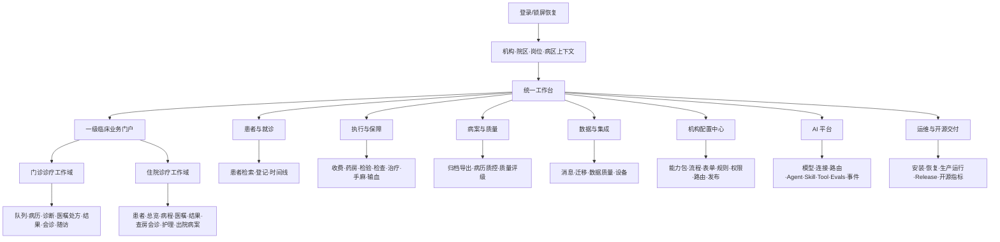
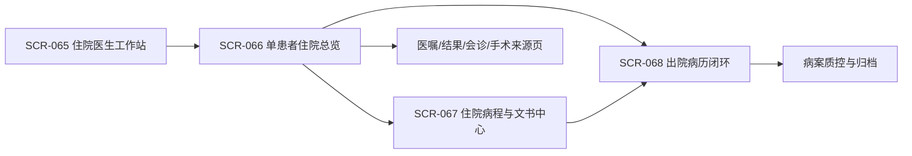

# openemr2026 v1.0 产品原型与交互规格

## 0. 文档控制

| 项目 | 内容 |
|---|---|
| 产品 | `openemr2026` v1.0 |
| 原型版本 | Prototype SPEC v0.13 + Full-Coverage BUILD v0.13 |
| 工作模式 | S003-1 / `SPEC` + `BUILD` |
| 状态 | SCR-001–175 均有独立或明确合并的可运行 BUILD；194/194 路由和 70/70 专科深页已完成真实浏览器回归，当前 S003-1 状态为 `VERIFIED` |
| 日期 | 2026-08-20（Asia/Shanghai） |
| 事实来源 | `docs/product/prd/2026-08-11-openemr2026-v1.0-prd.md` PRD v0.15；`docs/product/research/2026-08-13-leading-emr-competitive-gap-audit.md`；国家卫健委电子病历、医疗质量与专科管理规范、HL7 FHIR、DICOMweb 和嵌入式临床 AI 官方资料 |
| 目标设备 | 医院桌面 Web 为主；响应式床旁/移动查房 PWA 为 P1；小程序和原生 App 不在 v1.0 |
| 原型目的 | 验证信息架构、任务流、页面边界、状态和高风险交互，不提前锁定视觉品牌或前端技术栈 |

### 0.1 范围与口径

- 本规格覆盖 PRD 的 FR-001–138、AC-001–138；SCR-105 是门诊域内病历，SCR-106–145 为十类核心专科原四层页面，SCR-146–175 为十类专科新增的检查设备、诊疗执行、随访交接页面，并保留 5 个 AI医助小南交互深页、聚合中心及全局浮层。
- PRD v0.6 新增 SCR-065–068/PT-FLOW-16；v0.7 新增 SCR-069/PT-FLOW-17；v0.8 新增 SCR-070–073/PT-FLOW-18–20；v0.9 新增 SCR-074–090/PT-FLOW-21–24；PRD v0.10 新增 SCR-091–102/PT-FLOW-25–26；PRD v0.12 新增 SCR-103–104；PRD v0.13 新增 SCR-105–145；PRD v0.15 新增 SCR-146–175，不改写原编号。
- 屏幕是为验证需求而推导的交互载体，绝大多数为 `INFERRED`，不代表 PRD 已明确要求独立路由或物理页面。
- 弹窗、抽屉、Popover、Toast、全屏阻断和系统级状态统一纳入层级规范，不把它们虚增为主屏幕。
- 同一页面可按角色显示不同工作区，但权限必须由服务端契约执行，隐藏控件不能替代授权。
- 本期交付覆盖全部 SCR 的静态交互 BUILD；系统管理与业务配置独立，数据能力统一到数据中心，AI医助小南贯穿所有页面；不交付真实接口、生产前端代码或最终品牌资产。

### 0.2 原型决策、假设与未决项

| ID | 内容 | 类型 | 原型处理 |
|---|---|---|---|
| PT-FACT-001 | 医院桌面浏览器是首期主平台 | `EXPLICIT` | 以 1280–1600 宽度的高信息密度工作台为基线 |
| PT-FACT-002 | 单一核心代码覆盖诊所、基层及一二三级医院 | `EXPLICIT` | 导航按能力启用，页面不按医院等级复制 |
| PT-FACT-003 | AI、配置和临床状态均受权限、版本、审批和审计约束 | `EXPLICIT` | 高风险操作采用可见证据、明确确认和恢复路径 |
| PT-FACT-004 | 门诊、急诊与住院必须成为三个独立临床工作域 | `EXPLICIT` | 临床业务门户提供三入口；三域使用独立导航、患者/任务/搜索/AI 上下文 |
| PT-FACT-005 | 对标卫宁、东软、嘉和后需补齐路径、统一任务、病案/CDA、资质、专科包和移动查房 | `EXPLICIT` | 新增四个 BUILD 页面；专科包和 PWA 先以扩展契约与入口展示 |
| PT-FACT-006 | 系统管理与临床流程配置必须分域，但共同遵循版本、校验、审批、发布、回滚与审计 | `EXPLICIT` | 新增独立一级“系统管理”和 12 个后台管理页面；业务配置仍保留流程/模型/Agent 入口 |
| PT-FACT-007 | AI医助小南必须随处可达并根据医生操作主动提醒 | `EXPLICIT` | 每页提供顶栏入口、浮动入口和助手面板；临床页显示可关闭的主动提醒；另建完整工作区、证据、录音、动作审批和策略治理页 |
| PT-FACT-008 | 全部 1–4 级及必要深层规格页面必须形成可运行页面覆盖 | `EXPLICIT` | SCR-001–175 逐一映射到路由；补齐患者、收费药房、医技病理手麻输血、质量、科室适配、核心专科、数据、AI 设计与运维页面 |
| PT-FACT-009 | 数据能力统一到数据中心，急诊入口命名为“急诊工作台” | `EXPLICIT` | 一级侧栏按七大域重构；集成、迁移、质量、设备和科研使用数据中心二级导航 |
| PT-FACT-010 | 页面路由必须具有唯一一级菜单归属 | `EXPLICIT` | 病历中心、医疗质量和病案资产使用不同路由族；跨域查看明确标注目标中心 |
| PT-FACT-011 | 系统不能以通用内核宣称全部科室完整生产支持 | `EXPLICIT` | 新增科室适配与上线门禁页；逐科室声明支持等级、缺口、版本与证据 |
| PT-ASM-001 | 用户登录后只选择其有权的机构/院区/岗位上下文 | `INFERRED` | 设计全局上下文选择器；具体 SSO/MFA 留给 HLD |
| PT-ASM-002 | 同一工作站可能被轮班人员连续使用 | `INFERRED` | 全局显示当前用户、角色、机构、病区和锁屏入口 |
| PT-ASM-003 | 配置、模型、Agent 和 Skill 管理使用同一版本发布范式 | `INFERRED` | 复用差异、验证、审批、灰度、回滚组件 |
| PT-Q-001 | 首家医院最常用的角色与首页待办优先级尚未确定 | `UNKNOWN` | 首页模块可配置，原型先展示通用待办 |
| PT-Q-002 | 病区平板是否需支持扫码枪、腕带和离线给药 | `UNKNOWN` | 只定义适配位和断线阻断，不承诺设备实现 |
| PT-Q-003 | 原型是否进入 `BUILD` 并制作可点击演示 | `RESOLVED` | 已进入 BUILD，现交付 68 个代表性可点击页面；v0.8 新增完整系统管理页面族 |

## 1. 体验原则

1. **患者身份始终可见**：任何患者级临床操作都持续显示姓名、性别、年龄、主要标识、当前就诊、科室/床位、过敏/隔离等关键风险；切换患者需显著确认。
2. **事实、草稿与 AI 建议分层**：已签事实、人工草稿、AI 草稿、规则提示和 AI 建议使用不同状态标识，不能只依赖颜色。
3. **高风险动作给出具体后果**：签署、给药、输血、退费、患者合并、配置发布和 Agent Tool 副作用需展示对象、版本、范围、原因与恢复方式。
4. **工作台优先于菜单迷宫**：临床角色从患者/病区/队列进入任务；配置和治理角色从对象目录、待审批和异常进入。
5. **异常可恢复**：网络失败、重复提交、并发冲突、外部系统超时、AI/模型失败和配置灰度异常必须保留上下文与可重试路径。
6. **不以隐藏代替安全**：页面只显示授权内容，但服务端拒绝、最小泄露错误和审计仍是必需行为。
7. **配置结果可解释**：每个生效流程、字段、规则、权限和模型路由均可查看来源层级、版本、覆盖链与有效期。
8. **人工 EMR 永远可用**：AI、Agent、Skill 或模型停用时，用户回到原人工路径，不出现无法关闭的 AI 遮罩或依赖。

## 2. 角色—任务—入口—结果—恢复路径

| 角色 | 首要任务 | 主要入口 | 成功结果 | 主要恢复路径 |
|---|---|---|---|---|
| ROLE-001 机构管理员 | 初始化组织、人员、模板和能力 | 管理中心、待审批 | 有效配置发布且历史不丢失 | 回滚配置、停用不删除、查看依赖差异 |
| ROLE-002 安全管理员 | 管权限、审计和安全事件 | 安全中心、告警 | 越权为 0，高危操作可追责 | 拒绝优先、冻结账号、回滚策略、紧急审查 |
| ROLE-003 医生 | 接诊、病历、诊断、医嘱和签署 | 我的患者、门诊/病区工作台 | 完成合法签署并形成后续任务 | 恢复草稿、处理冲突、人工降级、发起更正 |
| ROLE-004 上级医生 | 审签与质量把关 | 审签队列、患者文书 | 退回或共同签署完成 | 重新分派、保留意见和版本差异 |
| ROLE-005 护士 | 评估、执行、给药、记录和交班 | 病区工作台、执行清单 | 正确患者的任务闭环 | 阻断错配、异常上报、未完任务交班 |
| ROLE-006 药师 | 审方、调剂、发药和住院配药 | 药房队列 | 药品与处方/医嘱/库存一致 | 退回处方、缺药替代流程、冲正和对账 |
| ROLE-007 医技人员 | 接收任务和结果回传 | 医技队列 | 结果关联原申请和正确患者 | 隔离错配、拒收/重采、重放对账 |
| ROLE-008 病案管理员 | 归档、封存、复制和长期保存 | 病案工作台 | 完整病案归档并可验证导出 | 退回整改、版本更正、隔离恢复 |
| ROLE-009 质控人员 | 运行/终末质控和整改 | 质控工作台、质量看板 | 缺陷闭环且不改原文 | 驳回误报、合法豁免、逾期升级 |
| ROLE-010 集成管理员 | 配接口、重放和对账 | 集成中心 | 消息幂等、可诊断、无错配 | 隔离队列、重放、切换适配器、人工对账 |
| ROLE-011 患者服务 | 预约、登记、分诊和身份维护 | 预约挂号、患者检索 | 唯一患者和正确就诊 | 待核身份、重复候选、合并/撤销 |
| ROLE-012 开源部署者 | 安装、体验、贡献和发布 | 安装向导、开发者/发布中心 | 可验证安装和发行制品 | 健康诊断、回滚版本、文档反馈 |
| ROLE-013 AI 管理员 | 治理用例、模型、Agent/Skill 和事件 | AI 平台、待审批、事件中心 | 只有已评估版本运行 | 隔离组件、回滚路由、全局/单用例停用 |
| ROLE-014 收费人员 | 收退费、预交、结算和日结 | 费用工作台 | 临床与费用、支付和日结一致 | 冲正不删账、失败重试、异常对账 |
| ROLE-015 检验人员 | 标本、结果、危急值和报告 | 检验工作台 | 标本到报告完整闭环 | 拒收/重采、重复隔离、危急值升级 |
| ROLE-016 检查人员 | 排程、执行、图像和报告 | 检查工作台 | 申请、图像和报告正确关联 | 改期、准备不足、PACS 故障补关联 |
| ROLE-017 治疗/手麻人员 | 治疗、手术、麻醉和复苏 | 治疗/手术/麻醉工作台 | 强制核查通过且记录完整 | 阻止开始、中止留痕、离线补录 |
| ROLE-018 输血人员 | 备血、配血、发血和输注 | 输血工作台 | 血袋全链关联正确患者 | 不匹配阻断、回收、反应与处置闭环 |
| ROLE-019 运维管理员 | 迁移、上线、HA、灾备和事件 | 迁移/运维中心 | 门禁通过、业务可持续 | 回退切换、停机续运、恢复补录对账 |
| ROLE-020 配置管理员 | 编排流程、表单、规则、权限和路由 | 配置中心 | 无代码适配并安全发布 | 沙箱修正、撤回审批、灰度暂停和回滚 |
| ROLE-021 AI 设计者 | 定义 Agent、Skill、Tool 和模型路由 | AI 设计中心 | 可复用、可测试且最小权限 | 修正契约、锁定依赖、隔离社区包 |

## 3. 信息架构与导航

### 3.1 全局导航模型



### 3.2 全局壳层

- **顶栏固定区**：产品标识、机构/院区、当前岗位/病区、全局患者搜索、通知、帮助、锁屏、当前用户。
- **患者上下文条**：进入患者级页面后固定在顶栏下方；包含身份、当前就诊、位置、风险标签和“切换患者”动作。
- **左侧主导航**：第一个一级入口固定为“临床业务门户”；门诊诊疗与住院诊疗分组显示，后续再列数据上线、配置和 AI 平台。按授权和机构能力裁剪，但不得把门诊与住院重新混成一个“临床工作”组。
- **工作域二级导航**：进入门诊或住院后，在顶栏下持续显示所属工作域及域内模块；返回临床业务门户前需按跨域切换规则处理草稿和患者上下文。
- **工作区**：标题、面包屑/返回、作用域、主操作、内容与右侧上下文面板；列表保留筛选和滚动位置。
- **全局任务中心**：审签、危急值、Agent 审批、配置审批、异常对账等进入统一通知，但点击后回到所属业务页面。
- **不得全局存在**：无遮罩的患者切换快捷键、自动确认 AI 建议、跨页面保留未明确绑定患者的临床输入。

### 3.3 层级与遮罩规则

| 层级 | 用途 | 返回/关闭 | 禁止事项 |
|---|---|---|---|
| L0 主页面 | 列表、工作台、详情 | 浏览器返回遵循路由历史 | 不用 Toast 承载必须处理的错误 |
| L1 右侧抽屉 | 预览、来源、历史、低风险编辑 | Esc/关闭返回原滚动位置 | 不承载签署、给药、输血、退费等最终确认 |
| L2 模态框 | 有界创建、选择、普通确认 | Esc 仅在无未保存输入时关闭 | 不嵌套超过一层模态 |
| L3 全屏任务 | 文书编辑、流程/表单设计、Agent 运行 | 明确“保存退出/放弃/继续” | 不因浏览器返回静默丢草稿 |
| L4 高风险确认 | 签署、合并、退费、配置发布、Tool 副作用 | 只能明确批准、修改或取消 | 不预勾选、不用模糊“确定”、不允许背景点击关闭 |
| L5 系统阻断 | 错患者、越权、硬规则、数据不一致、停机 | 提供原因、责任人和恢复动作 | 不被其他弹窗或 Toast 覆盖 |
| Toast | 低风险即时反馈 | 自动消失并可在通知历史查找 | 不作为失败、签署成功或临床异常的唯一反馈 |

## 4. Screen Map

字段口径：`required_states` 至少列出该屏专属状态；所有屏幕还需继承全局加载、空、错误、权限和会话过期状态。

| Screen ID | 名称 | 主要角色 | 入口 | 主要退出 | FR/AC | 来源 | 必需状态 | 状态 |
|---|---|---|---|---|---|---|---|---|
| SCR-001 | 登录、锁屏恢复与工作上下文 | 全部 | 系统入口/超时锁屏 | SCR-002 | FR-002/003；AC-002/003 | `INFERRED` | 登录失败、MFA/SSO 占位、无有效角色、上下文切换确认 | `CREATED` |
| SCR-002 | 统一首页与任务中心 | 全部 | SCR-001 | 各工作域 | FR-017/029；AC-017/029 | `INFERRED` | 无待办、部分服务异常、逾期/危急任务、权限裁剪 | `CREATED` |
| SCR-003 | 患者检索与登记 | ROLE-011/003/005 | 顶栏搜索/挂号 | SCR-005/011 | FR-004/006；AC-004/006 | `INFERRED` | 无结果、疑似重复、待核身份、重复提交 | `CREATED` |
| SCR-004 | 重复患者合并与撤销 | ROLE-011/008 | SCR-003/质量任务 | SCR-005 | FR-005；AC-005 | `INFERRED` | 高风险冲突、双人复核、合并成功、撤销差异 | `CREATED` |
| SCR-005 | 患者临床时间线 | ROLE-003/005/008 | 搜索/工作台 | 相关业务详情 | FR-007/031/035/037；AC-007/031/035/037 | `INFERRED` | 无历史、部分无权、AI 过期、来源不可用 | `CREATED` |
| SCR-006 | 紧急访问与待核身份 | ROLE-003/005/011/002 | 患者页/权限拒绝 | 原目标页 | FR-015；AC-015 | `INFERRED` | 越权限时、理由缺失、获批、事后审查 | `CREATED` |
| SCR-007 | 组织、人员与账户 | ROLE-001 | 管理中心 | SCR-002 | FR-001/002；AC-001/002 | `INFERRED` | 循环层级、停用引用、角色过期、导入差异 | `CREATED` |
| SCR-008 | 权限策略与访问模拟 | ROLE-002/020 | 安全/配置中心 | SCR-046 | FR-003/066；AC-003/066 | `INFERRED` | 显式拒绝、职责冲突、自提权、差分模拟 | `CREATED` |
| SCR-009 | 模板与参考数据目录 | ROLE-001/009 | 管理中心 | SCR-042/043 | FR-008/024；AC-008/024 | `INFERRED` | 历史版本、冲突导入、停用引用、待发布 | `CREATED` |
| SCR-010 | 审计与安全事件查询 | ROLE-002 | 安全中心/事件 | 资源详情 | FR-017；AC-017 | `INFERRED` | 审计降级、无权正文、导出审批、事件关联 | `CREATED` |
| SCR-011 | 预约、挂号、分诊、叫号与留观 | ROLE-011 | 首页/患者登记 | SCR-012 | FR-039；AC-039 | `INFERRED` | 号源冲突、退号、急危先救治、留观升级 | `CREATED` |
| SCR-012 | 门诊医生工作台 | ROLE-003 | 候诊队列/SCR-011 | SCR-013/015/016 | FR-019/020；AC-019/020 | `INFERRED` | 无历史、患者切换、未完项、接口失败 | `CREATED` |
| SCR-013 | 临床文书编辑器 | ROLE-003/005/017 | 临床工作台 | SCR-014 | FR-009/032/060；AC-009/032/060 | `INFERRED` | 自动保存失败、并发冲突、AI 草稿、来源缺失、超长文书 | `CREATED` |
| SCR-014 | 审签、版本、更正、归档与验签 | ROLE-003/004/008 | SCR-013/审签队列 | SCR-005 | FR-010/011/053；AC-010/011/053 | `INFERRED` | 必填阻断、版本变化、CA 中断、双签、补签/更正 | `CREATED` |
| SCR-015 | 诊断、医嘱与处方编辑 | ROLE-003 | 临床工作台 | 执行队列 | FR-012/013/033/034；AC-012/013/033/034 | `INFERRED` | 字典失效、重复提交、AI 风险、停止部分执行 | `CREATED` |
| SCR-016 | 结果、趋势与语义查询 | ROLE-003/005 | 临床工作台/时间线 | 来源报告 | FR-014/035/037；AC-014/035/037 | `INFERRED` | 单位冲突、未确认结果、无证据、跨患者攻击 | `CREATED` |
| SCR-017 | AI 建议与来源面板 | ROLE-003/005/009 | SCR-005/012/013/015/016 | 原页面 | FR-030–037；AC-030–037 | `INFERRED` | 生成中、待审、驳回、过期、失败、紧急停用 | `CREATED` |
| SCR-018 | 入院、病区与床位管理 | ROLE-011/005 | 入院通知/首页 | SCR-019 | FR-021；AC-021 | `INFERRED` | 无床、床位冲突、转科待接收、出院阻断 | `CREATED` |
| SCR-019 | 病区工作台 | ROLE-003/005 | SCR-002/SCR-018 | 患者/任务详情 | FR-021/022；AC-021/022 | `INFERRED` | 空病区、转区权限、逾期任务、批量操作部分失败 | `CREATED` |
| SCR-020 | 护理评估、记录、执行与交班 | ROLE-005 | SCR-019 | SCR-019/014 | FR-014/050；AC-014/050 | `INFERRED` | 评估过期、患者核对失败、未完任务、转区交班 | `CREATED` |
| SCR-021 | 会诊、转诊与临床路径 | ROLE-003/005 | 临床工作台/病区 | 原患者页 | FR-051；AC-051 | `INFERRED` | 超时、拒绝、路径变异、退组、转诊失败 | `CREATED` |
| SCR-022 | 费用、收退费、预交和结算 | ROLE-014 | 首页/患者费用 | 票据/日结 | FR-040；AC-040 | `INFERRED` | 重复支付、退费冲正、日结差异、医保降级 | `CREATED` |
| SCR-023 | 门诊药房审方与调剂 | ROLE-006 | 药房队列 | 发药完成/退回 | FR-041；AC-041 | `INFERRED` | 缺货、过期/召回、审方退回、退药 | `CREATED` |
| SCR-024 | 住院药房、配液与床旁给药 | ROLE-006/005 | 病区/药房 | 给药记录 | FR-042；AC-042 | `INFERRED` | 五正确阻断、停医嘱、部分配送、退药/ADR | `CREATED` |
| SCR-025 | 检验工作台 | ROLE-015/007 | 医技队列 | 报告/危急值闭环 | FR-043；AC-043 | `INFERRED` | 错标本、拒收、重复结果、危急值、报告更正 | `CREATED` |
| SCR-026 | 检查影像工作台 | ROLE-016/007 | 医技队列 | 报告/图像 | FR-044；AC-044 | `INFERRED` | 准备不足、错患者、PACS 不可用、报告更正 | `CREATED` |
| SCR-027 | 一般治疗工作台 | ROLE-017 | 治疗队列 | 治疗记录 | FR-045；AC-045 | `INFERRED` | 无医嘱、资质不足、中止、不良事件 | `CREATED` |
| SCR-028 | 围手术期排程与安全核查 | ROLE-017/003 | 手术申请 | SCR-029 | FR-046；AC-046 | `INFERRED` | 缺知情/检查/资质、改期、取消、植入物追踪 | `CREATED` |
| SCR-029 | 麻醉时间轴与复苏 | ROLE-017 | SCR-028 | 术后去向 | FR-047；AC-047 | `INFERRED` | 核查阻断、设备断线、离线补录、复苏未达标 | `CREATED` |
| SCR-030 | 监护绑定、趋势与告警 | ROLE-017/005 | 麻醉/病区 | 原业务页 | FR-048；AC-048 | `INFERRED` | 错绑定、时钟/单位异常、断线补传、告警未确认 | `CREATED` |
| SCR-031 | 输血全链工作台 | ROLE-018/003/005 | 用血申请 | 输注/回收 | FR-049；AC-049 | `INFERRED` | 血型/血袋/效期错配、双人核对、反应、回收 | `CREATED` |
| SCR-032 | 病历质控与整改工作台 | ROLE-009/003/005/008 | 质控任务/文书 | SCR-014/033 | FR-016/036/061；AC-016/036/061 | `INFERRED` | 硬规则、AI 建议、误报、豁免、逾期、终末阻断 | `CREATED` |
| SCR-033 | 病案归档、封存、复制与导出 | ROLE-008/011 | 病案队列/患者页 | 导出包/封存 | FR-011/018；AC-011/018 | `INFERRED` | 附件缺失、无权范围、导出失败、依法启封 | `CREATED` |
| SCR-034 | 医疗质量与电子病历评级看板 | ROLE-009/管理者 | 管理驾驶舱 | 指标/证据详情 | FR-055；AC-055 | `INFERRED` | 数据不完整、口径变化、异常下钻、整改/取证 | `CREATED` |
| SCR-035 | 院感、传染病与不良事件 | ROLE-003/009 | 线索队列/患者页 | 上报/关闭 | FR-052；AC-052 | `INFERRED` | 误报排除、截止升级、上报失败、幂等重试 | `CREATED` |
| SCR-036 | 集成消息、失败队列与对账 | ROLE-010 | 集成中心/告警 | 资源/重放结果 | FR-023；AC-023 | `INFERRED` | 鉴权、格式、重复、超时、死信、人工重放 | `CREATED` |
| SCR-037 | 历史数据迁移与切换工作台 | ROLE-019 | 上线项目 | SCR-038/062 | FR-038；AC-038 | `INFERRED` | 映射冲突、断点续传、增量追平、对账失败、回退 | `CREATED` |
| SCR-038 | 全院数据质量与问题工单 | ROLE-010/019 | 数据中心/评级 | 来源记录/工单 | FR-054；AC-054 | `INFERRED` | 身份/单位/关联冲突、迟到、隔离、修复重算 | `CREATED` |
| SCR-039 | 医疗设备目录与接入状态 | ROLE-010/019 | 设备中心/告警 | 连接/绑定详情 | FR-059；AC-059 | `INFERRED` | 不可信设备、错绑定、断线、重复、时钟/单位异常 | `CREATED` |
| SCR-040 | 机构能力包与继承解析 | ROLE-020/001 | 配置中心 | SCR-046 | FR-062；AC-062 | `INFERRED` | 依赖/互斥、保护模块、覆盖链、评级影响 | `CREATED` |
| SCR-041 | 流程与状态设计器 | ROLE-020 | 配置中心 | SCR-046 | FR-063；AC-063 | `INFERRED` | 死路/循环、无责任人、非法状态、沙箱模拟 | `CREATED` |
| SCR-042 | 表单与病历模板设计器 | ROLE-020/临床专家 | SCR-009/配置中心 | SCR-046 | FR-064；AC-064 | `INFERRED` | 字段冲突、计算循环、历史兼容、打印预览 | `CREATED` |
| SCR-043 | 规则、时限与提示中心 | ROLE-020/009/013 | 配置中心 | SCR-046 | FR-065；AC-065 | `INFERRED` | 保护/硬/提醒/AI 分层、冲突、回放、警报负担 | `CREATED` |
| SCR-044 | 角色、职责与数据范围设计 | ROLE-020/002 | 配置中心/安全中心 | SCR-046 | FR-066；AC-066 | `INFERRED` | 自提权、互斥职责、跨院区、临时授权、权限模拟 | `CREATED` |
| SCR-045 | 接口映射、主从与路由设计 | ROLE-020/010 | 配置/集成中心 | SCR-046 | FR-067；AC-067 | `INFERRED` | 未知字段、单位冲突、循环路由、秘密引用、模拟器 | `CREATED` |
| SCR-046 | 配置差异、验证、审批与发布 | ROLE-020/复核人/019 | SCR-040–045 | 发布/回滚证据 | FR-068；AC-068 | `INFERRED` | 回归失败、审批冲突、灰度暂停、在途实例、回滚 | `CREATED` |
| SCR-047 | 配置包与产品升级冲突中心 | ROLE-020/012 | 配置/升级中心 | SCR-046 | FR-069；AC-069 | `INFERRED` | 篡改/秘密/代码、依赖缺失、三方差异、旧版保留 | `CREATED` |
| SCR-048 | 基座模型目录与能力卡 | ROLE-013/021 | AI 平台 | SCR-049/051 | FR-070；AC-070 | `INFERRED` | 未验证、版本不明、许可/驻留缺失、废弃/隔离 | `CREATED` |
| SCR-049 | 模型连接与数据边界 | ROLE-013/019 | SCR-048 | SCR-050/051 | FR-071；AC-071 | `INFERRED` | 秘密/证书错误、区域冲突、字段预览、限流/健康 | `CREATED` |
| SCR-050 | 模型路由、主备和人工降级 | ROLE-013/021 | AI 平台/用例 | SCR-051 | FR-072；AC-072 | `INFERRED` | 无候选、边界更宽、会话固定、故障切换、回人工 | `CREATED` |
| SCR-051 | 模型评估、影子、灰度与隔离 | ROLE-013 | 模型/路由详情 | SCR-048/059 | FR-073；AC-073 | `INFERRED` | 门禁失败、影子无写入、漂移、政策变化、回滚 | `CREATED` |
| SCR-052 | Agent 目录与定义编辑器 | ROLE-021 | AI 平台 | SCR-057/058 | FR-074；AC-074 | `INFERRED` | 无限目标、通配 Tool、预算/停止缺失、权限摘要 | `CREATED` |
| SCR-053 | Agent 运行、计划与动作审批 | ROLE-003/005/009 | 临床 AI 入口/任务中心 | 原临床页面 | FR-075；AC-075 | `INFERRED` | 计划、执行、待批准、等待、失败、取消、恢复、完成 | `CREATED` |
| SCR-054 | Agent 上下文与记忆策略 | ROLE-013/021 | Agent/用例详情 | SCR-058 | FR-076；AC-076 | `INFERRED` | 跨患者、过期摘要、撤权、外发冲突、缓存清除 | `CREATED` |
| SCR-055 | Tool 目录、风险与审批策略 | ROLE-013/021 | AI 平台 | SCR-057/058 | FR-077；AC-077 | `INFERRED` | 只读/副作用、通配权限、幂等缺失、动作预览 | `CREATED` |
| SCR-056 | Skill 目录与定义编辑器 | ROLE-021 | AI 平台 | SCR-057/058 | FR-078；AC-078 | `INFERRED` | 契约缺失、依赖未锁、来源/许可、敏感样例、旧版本 | `CREATED` |
| SCR-057 | Agent/Skill/Tool 组合与数据流画布 | ROLE-021 | SCR-052/056 | SCR-058 | FR-079；AC-079 | `INFERRED` | 循环/冲突、权限交集、敏感流向、失败补偿 | `CREATED` |
| SCR-058 | Agent/Skill 评估与发布中心 | ROLE-013/021 | AI 设计中心 | SCR-059 | FR-080；AC-080 | `INFERRED` | 供应链隔离、红队失败、创建者自批、影子/灰度/回滚 | `CREATED` |
| SCR-059 | AI 运行、预算与事件中心 | ROLE-013/019 | AI 平台/告警 | 组件/运行详情 | FR-030/081；AC-030/081 | `INFERRED` | 未批准版本、成本激增、重复 Tool、监控盲区、单组件停用 | `CREATED` |
| SCR-060 | 安装向导与首次健康检查 | ROLE-012/019 | 发行制品入口 | SCR-002 | FR-025；AC-025 | `INFERRED` | 前置缺失、秘密检查、合成数据、部分健康失败 | `CREATED` |
| SCR-061 | 备份、恢复与完整性报告 | ROLE-001/019 | 运维中心 | SCR-062 | FR-026；AC-026 | `INFERRED` | 备份损坏、版本不兼容、附件缺失、恢复失败 | `CREATED` |
| SCR-062 | 生产运行、灾备与停机续运 | ROLE-019/002 | 运维中心/告警 | 事件/恢复报告 | FR-057/058；AC-057/058 | `INFERRED` | 单点/容量/漏洞阻断、灾备切换、停机补录、对账失败 | `CREATED` |
| SCR-063 | Release 门禁与制品发布 | ROLE-012/019 | 发布中心 | Release 详情 | FR-028；AC-028 | `INFERRED` | 门禁失败、Alpha/Beta 警示、撤回、升级/回滚说明 | `CREATED` |
| SCR-064 | 开源指标、文档与贡献入口 | ROLE-012 | 首页/仓库入口 | 外部文档/Issue | FR-027/029；AC-027/029 | `INFERRED` | 文档断链、资产口径、安装证据、无真实数据 | `CREATED` |
| SCR-065 | 住院医生工作站 | ROLE-003/004 | 临床门户/住院域 | SCR-066/067 | FR-082；AC-082 | `EXPLICIT` | 撤权、病危病重、逾期文书、异常结果、代管到期 | `CREATED` |
| SCR-066 | 单患者住院总览 | ROLE-003/004/005 | SCR-065 | SCR-067/068 | FR-083；AC-083 | `EXPLICIT` | 来源中断、结果更正、部分无权、患者切换 | `CREATED` |
| SCR-067 | 住院病程与文书中心 | ROLE-003/004 | SCR-065/066 | SCR-068 | FR-084–086；AC-084–086 | `EXPLICIT` | 时限逾期、并发、退回、AI 来源不足、事件补录 | `CREATED` |
| SCR-068 | 出院病历闭环 | ROLE-003/004/008 | SCR-066/067 | SCR-033 | FR-087；AC-087 | `EXPLICIT` | 文书/结果/首页/费用阻断、紧急离院、归档更正 | `CREATED` |
| SCR-069 | 临床业务门户 | ROLE-003/004/005 | 登录/首页 | 门诊/急诊/住院工作域 | FR-088–090；AC-088–090 | `EXPLICIT` | 单域无权/故障、跨域草稿、上下文清理失败 | `CREATED` |
| SCR-070 | 急诊工作台 | ROLE-003/005/011 | SCR-069/急诊登记 | 去向/交接 | FR-091；AC-091 | `EXPLICIT` | 待核身份、改级改区、抢救补录、设备断线、跨班/转住院 | `CREATED` |
| SCR-071 | 统一临床任务与路径中心 | 全部临床角色/ROLE-009 | 首页/各业务来源 | 原业务页/路径实例 | FR-092/095；AC-092/095 | `EXPLICIT` | 委托撤回、升级、来源中断、路径变异/退出/重入 | `CREATED` |
| SCR-072 | 病案资产与 CDA 中心 | ROLE-008/003 | 出院归档/迁移/病案 | 借阅/导出/隔离处理 | FR-094；AC-094 | `EXPLICIT` | 错患者、缺页、模糊、哈希/签名/CDA 失败、恶意文件 | `CREATED` |
| SCR-073 | 临床资质与扩展能力中心 | ROLE-002/医务管理员/ROLE-020 | 管理/配置中心 | 授权结果/发布 | FR-093/096/097；AC-093/096/097 | `EXPLICIT` | 过期撤销、自授权、专科包冲突、PWA 撤权/离线 | `CREATED` |
| SCR-074 | 本次就诊病历工作台 | ROLE-003/004/005 | 门诊/住院工作域 | SCR-075–078 | FR-098；AC-098 | `EXPLICIT` | 缺失、临期、逾期、退回、撤权、来源中断 | `CREATED` |
| SCR-075 | 病历专注编辑器 | ROLE-003/004/005 | SCR-074 | SCR-076/077 | FR-099；AC-099 | `EXPLICIT` | 自动保存失败、并发冲突、超长文书、患者切换、AI 降级 | `CREATED` |
| SCR-076 | 病历来源与证据中心 | ROLE-003/004/005 | SCR-074/075 | LIS/PACS/历史病历 | FR-100/103；AC-100/103 | `EXPLICIT` | 报告更正、来源断链、跨患者错配、过期引用 | `CREATED` |
| SCR-077 | 病历质控、审签与签署确认 | ROLE-003/004/005/009 | SCR-075 | SCR-078/病案 | FR-100；AC-100 | `EXPLICIT` | 硬阻断、资质失效、CA 失败、双签退回、AI 误报 | `CREATED` |
| SCR-078 | 病历版本、差异与更正证据 | ROLE-003/004/008/009 | SCR-074/077 | 病案资产详情 | FR-101；AC-101 | `EXPLICIT` | 已签覆盖、父版本缺失、传播失败、封存冲突 | `CREATED` |
| SCR-079 | LIS 检验报告调阅 | ROLE-003/004/005 | 病历来源/结果 | SCR-083 | FR-103/104；AC-103/104 | `EXPLICIT` | 标本错配、报告更正、危急值、技术成功业务未对账 | `CREATED` |
| SCR-080 | PACS 影像与报告调阅 | ROLE-003/004/005 | 病历来源/结果 | SCR-083 | FR-103/104；AC-103/104 | `EXPLICIT` | 报告可用图像不可用、Study 错配、部分序列、调阅超时 | `CREATED` |
| SCR-081 | 外部系统集成运行总览 | ROLE-010/019 | 管理入口 | SCR-082–084 | FR-102；AC-102 | `EXPLICIT` | 局部降级、积压、凭据失效、临床影响不明确 | `CREATED` |
| SCR-082 | 连接器目录与配置 | ROLE-010/020/019 | SCR-081 | SCR-083/084 | FR-102；AC-102 | `EXPLICIT` | 明文秘密、未测试发布、协议/版本不兼容 | `CREATED` |
| SCR-083 | 映射、路由与业务对账 | ROLE-010/020 | SCR-081/082 | SCR-084 | FR-102–104；AC-102–104 | `EXPLICIT` | 患者/申请/标本/报告/Study 关联不一致、乱序和重复 | `CREATED` |
| SCR-084 | 消息 Trace、重放与死信 | ROLE-010/019 | SCR-081/临床报告 | 原业务对象 | FR-104；AC-104 | `EXPLICIT` | 跨患者重放、重复副作用、死信、回执超时、原消息含敏感数据 | `CREATED` |
| SCR-085 | 病案目录与扫描编目 | ROLE-008 | 出院/迁移/病案入口 | SCR-086–088 | FR-105；AC-105 | `EXPLICIT` | 缺页、倒页、模糊、恶意文件、错患者、原件被覆盖 | `CREATED` |
| SCR-086 | 病案完整性、验真与长期保存 | ROLE-008/019 | SCR-085 | 资产证据详情 | FR-105；AC-105 | `EXPLICIT` | 哈希/签名/格式失效、介质迁移、保管期限和法律封存冲突 | `CREATED` |
| SCR-087 | 病案借阅、复制与外部提供 | ROLE-008/审计人员 | SCR-085 | 受控预览/交付 | FR-105；AC-105 | `EXPLICIT` | 超范围、未脱敏、过期访问码、水印缺失、封存中借阅 | `CREATED` |
| SCR-088 | 科研项目与队列构建 | ROLE-022/023 | 科研入口 | SCR-089/090 | FR-106；AC-106 | `EXPLICIT` | 审批缺失/过期、口径漂移、缺失误判、小样本识别风险 | `CREATED` |
| SCR-089 | 科研统计与质量解释 | ROLE-022/023 | SCR-088 | SCR-090 | FR-106；AC-106 | `EXPLICIT` | 不可复算、偏倚未提示、衍生变量污染病历、统计版本漂移 | `CREATED` |
| SCR-090 | 科研数据申请与受控交付 | ROLE-022/023 | SCR-088/089 | 科研安全区 | FR-107；AC-107 | `EXPLICIT` | 自由文本/影像高风险、范围扩大、导出越权、到期仍可访问 | `CREATED` |
| SCR-091 | 系统管理总览 | ROLE-001/002/019 | 一级系统管理入口 | SCR-092–102 | FR-108；AC-108 | `EXPLICIT` | 高危待办被平均数掩盖、统计延迟、越权深链 | `CREATED` |
| SCR-092 | 组织机构管理 | ROLE-001/002 | SCR-091 | 组织详情/版本差异 | FR-109；AC-109 | `EXPLICIT` | 组织环、在用节点删除、历史责任链断裂、批量错挂 | `CREATED` |
| SCR-093 | 用户与账户管理 | ROLE-001/002 | SCR-091/092 | 人员详情/账户生命周期 | FR-110；AC-110 | `EXPLICIT` | 身份重复、共享账号、孤儿高权账号、离岗未撤权 | `CREATED` |
| SCR-094 | 角色、岗位与工作组 | ROLE-001/002 | SCR-091/093 | 成员与策略绑定 | FR-111；AC-111 | `EXPLICIT` | 角色爆炸、资质替代权限、临时成员永不过期 | `CREATED` |
| SCR-095 | 权限策略与模拟 | ROLE-001/002/审计人员 | SCR-094 | 策略详情/发布审批 | FR-112；AC-112 | `EXPLICIT` | 自提权、显式拒绝失效、数据范围扩大、隐藏控件代替鉴权 | `CREATED` |
| SCR-096 | 认证与安全策略 | ROLE-001/019 | SCR-091 | SSO/MFA/会话/应急访问 | FR-113；AC-113 | `EXPLICIT` | SSO 故障、弱认证、高权应急账户滥用、秘密回显 | `CREATED` |
| SCR-097 | 字典、术语与值域 | ROLE-001/013/019 | SCR-091 | 版本、标准映射和影响分析 | FR-114；AC-114 | `EXPLICIT` | 代码复用、历史语义改变、标准升级误映射、停用影响未知 | `CREATED` |
| SCR-098 | 医院主数据 | ROLE-001/019 | SCR-091/097 | 药品/项目/耗材/医技主数据 | FR-115；AC-115 | `EXPLICIT` | 字典主数据混用、外部同步覆盖、价格/单位/映射不一致 | `CREATED` |
| SCR-099 | 模板、编号与输出 | ROLE-001/020 | SCR-091 | 模板/编号/打印/水印 | FR-116；AC-116 | `EXPLICIT` | 编号碰撞、在途模板漂移、未授权打印、签章位置变化 | `CREATED` |
| SCR-100 | 系统参数与功能开关 | ROLE-001/019 | SCR-091 | 参数差异/灰度发布 | FR-117；AC-117 | `EXPLICIT` | 任意键值绕过规则、秘密泄露、安全下限被降低、作用域误继承 | `CREATED` |
| SCR-101 | 通知、定时与批量任务 | ROLE-001/019 | SCR-091 | 作业详情/失败重试 | FR-118；AC-118 | `EXPLICIT` | 通知风暴、重复副作用、部分失败被宣告成功、重试跨患者 | `CREATED` |
| SCR-102 | 管理审计与权限复核 | ROLE-002/019/审计人员 | SCR-091/095 | 审计事件/复核活动 | FR-119；AC-119 | `EXPLICIT` | 管理员删改审计、审计缺口、过期授权未回收、导出越权 | `CREATED` |
| SCR-103 | 科室适配与上线门禁 | 产品/实施/医务/信息/科室负责人 | SCR-040/073 | 专科包计划/支持声明 | FR-125/127；AC-125/127 | `EXPLICIT` | 通用能力冒充专科、跨科室继承、缺接口/恢复/签字仍上线 | `CREATED` |
| SCR-104 | 病理科工作台 | 病理技师/病理医师/临床医师 | 临床申请/医疗协同中心 | 病理报告/临床来源 | FR-126；AC-126 | `EXPLICIT` | 错患者/部位/容器、固定超时、制片失败、会诊和报告更正 | `CREATED` |
| SCR-105 | 门诊域内病历 | 门诊医生 | 门诊工作台/临床门户 | 诊断/医嘱/结果/全院病历中心 | FR-128；AC-128 | `EXPLICIT` | 域内入口误跳全院病历中心、患者/就诊/AI 上下文丢失 | `VERIFIED` |
| SCR-106–109 | 妇产科四层页面 | 妇产科医护/助产士 | 核心专科工作台 | 专科病历/产程/质控 | FR-129；AC-129 | `EXPLICIT` | 子痫、产后出血、母婴身份和产程异常 | `VERIFIED` |
| SCR-110–113 | 生殖医学四层页面 | 生殖医师/护士/胚胎师 | 核心专科工作台 | 周期/胚胎/质控 | FR-130；AC-130 | `EXPLICIT` | 配子胚胎身份、载杆、双核、伦理和库存 | `VERIFIED` |
| SCR-114–117 | 儿科四层页面 | 儿科医护 | 核心专科工作台 | 儿童病历/用药/质控 | FR-131；AC-131 | `EXPLICIT` | 月龄、体重剂量、监护人和危重分诊 | `VERIFIED` |
| SCR-118–121 | 新生儿科四层页面 | 新生儿科医护 | 核心专科工作台 | 母婴/监护/筛查 | FR-132；AC-132 | `EXPLICIT` | 母婴腕带、胎龄、喂养、标本和筛查 | `VERIFIED` |
| SCR-122–125 | 精神心理科四层页面 | 精神科/心理治疗/护理 | 核心专科工作台 | 风险/保护/随访 | FR-133；AC-133 | `EXPLICIT` | 特殊隐私、自杀暴力风险和保护措施 | `VERIFIED` |
| SCR-126–129 | 眼科四层页面 | 眼科医护/技师 | 核心专科工作台 | 测量/影像/手术 | FR-134；AC-134 | `EXPLICIT` | OD/OS、测量来源、散瞳和手术眼别 | `VERIFIED` |
| SCR-130–133 | 耳鼻喉科四层页面 | 耳鼻喉医护/听力师 | 核心专科工作台 | 听力/内镜/操作 | FR-135；AC-135 | `EXPLICIT` | 侧别部位、气道风险、内镜与标本 | `VERIFIED` |
| SCR-134–137 | 口腔科四层页面 | 口腔医护/技师 | 核心专科工作台 | 牙位/影像/治疗 | FR-136；AC-136 | `EXPLICIT` | 牙位、麻醉、材料批次和收费对账 | `VERIFIED` |
| SCR-138–141 | 皮肤科四层页面 | 皮肤科医护/技师 | 核心专科工作台 | 图谱/影像/用药 | FR-137；AC-137 | `EXPLICIT` | 摄影授权、病理部位和用药前筛查 | `VERIFIED` |
| SCR-142–145 | 中医科四层页面 | 中医医护/中药师 | 核心专科工作台 | 四诊/方药/调剂 | FR-138；AC-138 | `EXPLICIT` | 理法方药、毒性饮片、配伍和中西药作用 | `VERIFIED` |
| SCR-146–148 | 妇产科检查设备/诊疗执行/随访交接 | 妇产科医护/助产士 | SCR-106–109 | 胎监与超声证据/高危执行/母婴交接 | FR-129；AC-129 | `EXPLICIT` | 来源失联、母婴错配、高危未处置、交接不完整 | `VERIFIED` |
| SCR-149–151 | 生殖医学检查设备/诊疗执行/随访交接 | 生殖医师/护士/胚胎师 | SCR-110–113 | 激素超声/周期执行/实验室与产科交接 | FR-130；AC-130 | `EXPLICIT` | 配子胚胎身份、双核、伦理过期、库存差异 | `VERIFIED` |
| SCR-152–154 | 儿科检查证据/诊疗执行/随访交接 | 儿科医护/药师/监护人 | SCR-114–117 | 生长与体重/剂量执行/门急住保健交接 | FR-131；AC-131 | `EXPLICIT` | 体重过期、剂量越界、监护人撤权、危重未升级 | `VERIFIED` |
| SCR-155–157 | 新生儿检查设备/诊疗执行/随访交接 | 新生儿科医护/产科/保健 | SCR-118–121 | 监护筛查/喂养处置/产房-NICU-保健交接 | FR-132；AC-132 | `EXPLICIT` | 母婴腕带错配、喂养中断、筛查逾期 | `VERIFIED` |
| SCR-158–160 | 精神心理检查证据/诊疗执行/随访交接 | 精神科/心理治疗/护理 | SCR-122–125 | 精神检查量表/危机与治疗/社区交接 | FR-133；AC-133 | `EXPLICIT` | 越权访问、高风险普通结束、保护措施过期 | `VERIFIED` |
| SCR-161–163 | 眼科检查设备/诊疗执行/随访交接 | 眼科医护/验光技师 | SCR-126–129 | 验光眼压OCT/手术执行/术后随访 | FR-134；AC-134 | `EXPLICIT` | OD/OS、设备来源、术眼与植入物错配 | `VERIFIED` |
| SCR-164–166 | 耳鼻喉检查设备/诊疗执行/随访交接 | 耳鼻喉医护/听力内镜技师 | SCR-130–133 | 听力内镜/气道与手术/病理听力交接 | FR-135；AC-135 | `EXPLICIT` | 侧别部位、气道升级、图像和标本来源 | `VERIFIED` |
| SCR-167–169 | 口腔检查设备/诊疗执行/随访交接 | 口腔医护/影像修复技师 | SCR-134–137 | 牙位CBCT/分期治疗/修复材料交接 | FR-136；AC-136 | `EXPLICIT` | 牙位、麻醉过敏、材料批次和费用错配 | `VERIFIED` |
| SCR-170–172 | 皮肤科检查证据/诊疗执行/随访交接 | 皮肤科医护/影像病理 | SCR-138–141 | 图谱摄影病理/光疗生物制剂/疗效随访 | FR-137；AC-137 | `EXPLICIT` | 摄影授权、病理部位、感染筛查和累计剂量 | `VERIFIED` |
| SCR-173–175 | 中医检查证据/诊疗执行/随访交接 | 中医医护/中药师/治疗师 | SCR-142–145 | 四诊与审方证据/方药针灸执行/证候疗效交接 | FR-138；AC-138 | `EXPLICIT` | 理法方药、毒性饮片、配伍和中西药作用 | `VERIFIED` |

屏幕分母：175 个主屏幕，均为需求驱动或为承载需求推导；没有额外“视觉展示页”。

## 5. 核心流程规格

| Flow ID | Actor | 前置 | 起点 | 主步骤与决策点 | 失败/恢复 | 终点 | FR/AC |
|---|---|---|---|---|---|---|---|
| PT-FLOW-01 机构初始化 | ROLE-001/020 | 已安装、具有机构管理权 | SCR-060 | 创建机构→组织/人员→选择能力包→模板/字典→权限模拟→配置验证发布 | 依赖/权限冲突回到对应配置；停用不删除历史 | SCR-002 | FR-001–003/008/024/062/066/068；对应 AC |
| PT-FLOW-02 患者登记 | ROLE-011 | 机构和号源有效 | SCR-003/011 | 检索→查看候选→确认已有或创建→疑似重复决策→建立门急诊/住院就诊 | 身份不足建待核；错合并可撤销；重复提交返回原结果 | SCR-012/018 | FR-004–006/015/039；对应 AC |
| PT-FLOW-03 门急诊诊疗 | ROLE-003 | 患者到诊且医生有权 | SCR-012 | 核对患者→历史/AI 摘要→文书→诊断→医嘱/处方→AI/硬规则→签署→结果/结束 | 草稿恢复、并发差异、AI 降级、未完项阻断或授权处理 | 完成就诊/SCR-005 | FR-007/009–014/019/020/031–035/060；对应 AC |
| PT-FLOW-04 住院与护理 | ROLE-003/005 | 已入院分床 | SCR-019 | 入院评估→住院文书→医嘱→药品/标本/治疗执行→护理→交班→转区/出院 | 床位/核对冲突阻断；未完任务带入交班；出院前对账 | 出院/SCR-033 | FR-021/022/042/050/051/060/061；对应 AC |
| PT-FLOW-05 病历签署质控 | ROLE-003/004/009/008 | 文书草稿完成 | SCR-013 | 书写中提示→提交→签署前硬规则→单/双签→运行抽查→整改→终末质控→归档/封存 | 退回草稿、并发保留双方、CA 待补签、误报/豁免、整改形成新版本 | SCR-033 | FR-009–011/016/036/053/061；对应 AC |
| PT-FLOW-06 医技与执行闭环 | ROLE-005–007/015–018 | 已生效医嘱/申请 | 执行队列 | 核对患者/任务→准备→执行→结果/报告→异常→对账 | 错配阻断；拒收/中止留痕；重复幂等；设备/外部失败隔离 | SCR-005/016 | FR-014/041–049/059；对应 AC |
| PT-FLOW-07 收费结算 | ROLE-014 | 有临床项目或预交请求 | SCR-022 | 费用来源→划价→支付/预交→日结/结算→票据→临床费用对账 | 重复支付幂等；退费冲正；医保失败转批准策略 | 结算完成 | FR-040；AC-040 |
| PT-FLOW-08 集成交换 | ROLE-010 | 连接/映射已批准 | SCR-036 | 鉴权→校验→接收/发送→幂等→确认→对账 | 格式/超时/下游拒绝进入隔离；人工查看差异后重放 | 消息终态 | FR-023/067；AC-023/067 |
| PT-FLOW-09 迁移切换 | ROLE-019 | 范围、源系统和切换窗口已批准 | SCR-037 | 盘点→映射→试迁移→对账→全量→增量追平→业务签字→上线门禁→切换 | 差异隔离、断点续传；未达 100% 不切换；异常按预案回退 | SCR-062 | FR-038/054/057/058；对应 AC |
| PT-FLOW-10 质量与评级 | ROLE-009/管理者 | 指标/规则已发布 | SCR-034 | 选择周期/范围→查看覆盖和四维质量→异常下钻→整改工单→重算→取证快照 | 不完整数据显著标识；口径变化保留旧快照 | 证据包 | FR-054–056/061；对应 AC |
| PT-FLOW-11 配置设计发布 | ROLE-020/复核人/019 | 有配置变更单 | SCR-040 | 作用域/继承→流程/表单/规则/权限/集成→静态校验→沙箱→差异影响→独立审批→灰度→确认/回滚 | 保护规则、死路、越权或回归失败阻止；灰度异常暂停并回滚 | 批准配置版本 | FR-062–069；对应 AC |
| PT-FLOW-12 模型接入切换 | ROLE-013/019/021 | 模型来源/许可明确 | SCR-048 | 画像→连接/数据边界→用例评估→路由主备→影子→灰度→主/备→监控 | 边界/质量失败不候选；无同边界备选则回人工；事件隔离组件 | SCR-059 | FR-070–073/081；对应 AC |
| PT-FLOW-13 Agent/Skill 设计发布 | ROLE-021/013 | 用例、允许数据和工具边界明确 | SCR-052/056 | Agent/Skill 契约→Tool 风险→组合/依赖/数据流→Evals/红队→审批→影子/灰度→发布 | 循环、权限扩大、供应链或严重 Eval 失败则隔离；回滚旧版 | AI 目录批准版本 | FR-074/076–080；对应 AC |
| PT-FLOW-14 Agent 受控运行 | ROLE-003/005/009 | 已批准 Agent 且患者/就诊授权有效 | SCR-053 | 展示计划→固定版本/上下文→只读步骤→副作用动作预览→逐次批准/修改/驳回→Tool→核验→草稿/待办→人工签署 | 患者切换、撤权、审批过期、预算/超时、停用时暂停；幂等恢复/补偿/人工接管 | 原临床流程 | FR-075–077/081；对应 AC |
| PT-FLOW-15 生产发布与恢复 | ROLE-012/019/002 | 候选制品/配置/迁移已准备 | SCR-063 | 安装→安全/容量/HA→迁移→灾备/停机/回滚演练→UAT→审批→上线观察 | 任一门禁失败 No-Go；生产异常回退/停机续运/恢复对账 | Stable 或继续 RC | FR-025–029/057/058/068/073/080/081；对应 AC |
| PT-FLOW-16 完整住院病历 | ROLE-003/004/008 | 患者已入院且责任关系有效 | SCR-065 | 患者/任务→住院总览→文书目录与时限→病程/特殊文书→审签→出院记录/首页→终末质控→归档 | 撤权、并发、时限、结果/费用/首页冲突形成可分派阻断，不伪造完成状态 | SCR-033/068 | FR-082–087；对应 AC |
| PT-FLOW-17 临床工作域选择与切换 | ROLE-003/004/005 | 已选择机构与岗位 | SCR-069 | 分域鉴权→选择门诊/急诊/住院→建立空患者上下文→域内工作→检查草稿/动作→清理并切换 | 单域失败局部降级；草稿或高风险动作未处理时阻止静默切换 | 目标工作域 | FR-088–091；对应 AC |
| PT-FLOW-18 急诊全链 | ROLE-003/005/011 | 急诊工作域和分诊规则有效 | SCR-070 | 院前/到院→待核身份/检索→预检分诊→抢救/诊室/留观→急诊病历医护执行→急会诊→交接→去向 | 先救治、改级改区、双时间补录、断线、跨班和转住院保留完整事件链 | 离院/转院/住院 | FR-091；AC-091 |
| PT-FLOW-19 路径与统一任务 | 全部临床角色/ROLE-009 | 路径版本、任务规则和责任关系有效 | SCR-071 | 入径→固定版本→生成阶段任务→业务对象完成回写→变异/审批→升级委托→退出/重入→质量统计 | 已读不等于完成；来源中断显著不确定；退出不删除事实；候选医嘱仍需原授权 | 原业务页/路径终态 | FR-092/095；AC-092/095 |
| PT-FLOW-20 病案资产与资质门禁 | ROLE-008/002/003 | 病案目录、格式和人员资质规则有效 | SCR-072/073 | 汇聚原件→转换/CDA/CA 校验→隔离整改→归档/借阅；资质登记→审批→实时判定→到期/撤销 | 原件不被转换覆盖；错配/缺页/验签失败阻断；撤权后旧页面写入拒绝并保留安全草稿 | 可验证病案/授权结果 | FR-093/094/096/097；对应 AC |
| PT-FLOW-21 病历创作与证据闭环 | ROLE-003/004/005/009 | 患者、就诊、文书任务和责任关系有效 | SCR-074 | 选择文书任务→专注编辑→核验来源→分层质控→确认最终版本→签署/分级审签→版本/传播证据 | 自动保存、并发、撤权、来源更正、硬阻断或 CA 失败时保留草稿并返回对应任务；已签内容不覆盖 | SCR-078/病案目录 | FR-098–101；对应 AC |
| PT-FLOW-22 LIS/PACS 临床互操作 | ROLE-003/004/005/010 | 连接器、映射和临床授权有效 | SCR-076/079/080 | 申请→标本/检查→报告/Study→版本与可用性→医生处置/引用→业务对账 | 报告/图像分开降级；错配阻断；报告更正不自动改写已签病历；消息可追踪和幂等重放 | 病历来源/结果页 | FR-102–104；对应 AC |
| PT-FLOW-23 病案资产全生命周期 | ROLE-008/019 | 病案目录、格式、期限、借阅策略有效 | SCR-085 | 汇聚→扫描编目→质量/病毒/哈希/CA/CDA 校验→隔离整改→归档包→借阅复制→周期验真→格式/介质迁移 | 原件不被转换覆盖；缺页/错患者/验签/格式失败隔离；封存和期限规则优先 | 可验证长期资产 | FR-105；AC-105 |
| PT-FLOW-24 科研统计与数据交付 | ROLE-022/023 | 项目、科学性/伦理/机构审批有效 | SCR-088 | 版本化队列→去标识计数→统计与质量解释→字段/人群申请→审批→脱敏快照/字典/质量报告→受控使用→到期回收 | 越范围、小样本、自由文本/影像、审批过期或项目暂停时缩减/阻止；衍生数据不回写病历 | SCR-089/090 | FR-106/107；对应 AC |
| PT-FLOW-25 医院后台初始化与身份生命周期 | ROLE-001/002/019 | 系统已安装且初始化审批人独立 | SCR-091 | 组织版本→人员/账号→岗位/资质→角色/工作组→权限模拟→复核发布→转岗/离岗回收→周期复核 | 身份重复、孤儿账户、自提权、无效资质或数据范围扩大时阻止；离岗停止新访问但保留署名 | SCR-092–096/102 | FR-108–113/119；对应 AC |
| PT-FLOW-26 管理配置变更发布 | ROLE-001/002/019 | 有已登记变更单和目标作用域 | SCR-097–101 | 字典/主数据/参数/模板/作业草拟→版本差异→依赖与安全下限→沙箱→审批→灰度/定时发布→对账→确认或回滚 | 历史语义、编号、秘密、权限、重复副作用或部分失败不可解释时阻止/暂停并幂等恢复 | SCR-091/102 | FR-114–119；对应 AC |

## 6. 关键屏幕与线框交互规格

### 6.1 SCR-012 门诊医生工作台

**目标与成功条件**：医生不离开当前患者上下文即可完成病历、诊断、医嘱/处方、结果和签署；结束就诊前无未解释必备项。

```text
┌ 顶栏：机构 / 岗位 / 全局搜索 / 待办 / 用户 ──────────────────────────┐
├ 患者条：姓名 标识 年龄 性别 | 当前门急诊 | 过敏/隔离/急危 | 切换患者 ┤
├ 左：候诊队列 ─────┬ 中：本次诊疗 ──────────────────┬ 右：患者上下文 ┤
│ 待诊/诊中/待结果  │ Tab 病历 | 诊断 | 医嘱处方 | 结果 │ 时间线摘要       │
│ 筛选/叫号/接诊    │ 当前编辑区 + 保存/提交/签署状态  │ 过敏/问题/用药     │
│ 当前患者强标识    │ 硬规则、AI 建议分别呈现           │ AI 来源/待办       │
├──────────────────┴────────────────────────────────┴─────────────────┤
│ 底部固定状态：草稿保存 / 接口状态 / 未完成项 / 结束就诊              │
└──────────────────────────────────────────────────────────────────────┘
```

- **入口/返回**：从候诊队列进入；返回保留队列筛选和滚动。直接深链必须先验证机构、角色和就诊权限。
- **患者切换**：有未保存输入、待审批 Agent 动作或弹窗时禁止直接切换；确认后清空前一患者的临时 UI 状态。
- **内容规则**：风险条始终在首屏；AI 建议显示“来源、版本、生成时间、是否过期”，不得替代原结果。
- **提交反馈**：保存为低风险局部反馈；签署与结束就诊为 L4 确认；接口部分失败形成可处理任务，不显示整体成功。
- **键盘**：队列与编辑区有独立焦点区；常用保存可有快捷键，签署不可使用单键触发。
- **关联**：FR-019/020/031–035；AC-019/020/031–035。

### 6.2 SCR-013/014 文书编辑、质控与签署

**目标与成功条件**：作者清楚区分已知事实、AI 草稿、待确认项和规则问题；最终签署版本可预览且不会因并发或模板变化被静默覆盖。

```text
┌ 文书标题 / 类型 / 模板版本 / 作者 / 当前状态 / 自动保存状态 ┐
├ 大纲与字段 ───────┬ 编辑区 ─────────────────┬ 质控与来源 ┤
│ 必填完成度         │ 结构化字段 + 叙述文本     │ 硬规则      │
│ 问题定位           │ AI 段落有独立标记         │ 机构规则    │
│ 版本历史           │ 冲突/缺失可逐项确认        │ AI 建议     │
│                    │                           │ 来源片段    │
├────────────────────┴───────────────────────────┴─────────────┤
│ 保存草稿 | 预览差异 | 提交审签 | 签署前检查                 │
└──────────────────────────────────────────────────────────────┘
```

- **自动保存**：显示最近成功时间；失败时持续可见并提供本地暂存/复制恢复，不用一次性 Toast。
- **并发冲突**：进入三栏差异“服务器版本/我的版本/合并结果”；禁止后到覆盖先到。
- **AI 草稿**：逐段或逐字段接受、编辑、驳回；“全部接受”在临床病历默认不提供。
- **签署**：全屏预览最终内容、缺陷、模板和签名类型；版本变化后原批准失效。CA 不可用时展示机构批准的阻止/待补签路径。
- **更正**：从签署版本发起，原文只读；新版本必须填写原因并显示关联。
- **关联**：FR-008–011/016/032/036/053/060/061；对应 AC。

### 6.3 SCR-019/020 病区与护理工作台

**目标与成功条件**：医护按病区、床位和任务优先级处理患者，转区后权限与待办同步，交班不遗漏未完成任务。

- 顶部展示病区、班次、床位占用、急危/隔离、逾期任务和交班倒计时。
- 床位卡只承载身份、风险和任务数量；临床正文进入患者详情，避免在公开大屏暴露。
- 批量操作只允许低风险任务，逐项显示成功/失败；给药、输血、签署不批量确认。
- 给药核对使用 L5 阻断覆盖患者、药品、剂量、途径、时间不一致；阻断后保留原任务与异常上报入口。
- 交班页按“患者风险—未完成任务—本班变化—需接班确认”组织，接班人逐项确认但不改变原记录。
- **关联**：FR-021/022/042/050；对应 AC。

### 6.4 SCR-032 病历质控与整改工作台

**目标与成功条件**：质控人员能够发现、分派和复核缺陷，但不能直接修改临床原文；医务人员从缺陷准确返回对应文书位置整改。

- 左栏筛选周期、机构/科室、文书类型、缺陷等级、规则层级、责任人和逾期状态。
- 中栏病例/文书队列展示抽取原因、硬规则数、结构规则数和 AI 建议数，不能混成一个分数。
- 右栏显示原文只读片段、证据、规则版本、缺陷历史和“创建缺陷/驳回误报/合法豁免”动作。
- 医务人员点击缺陷进入 SCR-013 对应锚点；整改通过补充/更正形成新版本，回到 SCR-032 复核。
- 终末质控未通过使用 L5 阻断归档；合法豁免需角色、原因、时限和二次确认。
- **关联**：FR-016/036/061；AC-016/036/061。

### 6.5 SCR-037 历史迁移工作台

**目标与成功条件**：上线团队能看到每个批次、对象、关联和业务抽样差异；没有任何方式绕过对账直接标记切换成功。

- 页面阶段条：盘点→映射→试迁移→全量→增量→对账→审批→切换→观察/封账。
- 核心视图显示源/目标对象计数、患者匹配、关联完整率、附件/签名来源、失败/隔离和增量滞后。
- 差异行可回到源标识、转换规则和目标对象，但真实正文默认遮蔽，仅授权抽样时查看。
- “申请切换”在 KPI-010 未达 100% 或业务签字缺失时禁用并解释缺口。
- 回退确认显示目标、预计中断、双写/增量处理和恢复后对账，不提供无条件“强制完成”。
- **关联**：FR-038；AC-038。

### 6.6 SCR-041 流程与状态设计器

**目标与成功条件**：配置人员无需写代码即可定义受支持流程，并在发布前发现死路、非法状态和安全核查绕过。

```text
┌ 流程名 / 作用域 / 基线版本 / 当前草稿 / 最终继承来源 ──────────────┐
├ 节点库 ───────┬ 画布 ────────────────────────────────┬ 属性/校验 ┤
│ 开始/任务/判断│ 节点、连线、异常、超时、补偿         │ 角色/条件  │
│ 审批/等待/终态│ 正常与失败路径可切换查看             │ 时限/升级  │
│ 受保护核查节点│ 受保护节点不可删除/绕过               │ 错误定位    │
├───────────────┴──────────────────────────────────────┴───────────┤
│ 版本差异 | 静态校验 | 合成病例模拟 | 保存草稿 | 提交验证          │
└──────────────────────────────────────────────────────────────────┘
```

- 节点库区分普通节点和平台保护节点；保护节点显示锁标识和依据，不能拖出流程形成旁路。
- 条件编辑同时显示结构化表达和自然语言解释；不提供任意脚本输入框。
- 模拟器逐步展示状态、责任人、时间、产生的任务和异常，支持正常、取消、超时、重复和失败样本。
- 自动布局不能改变流程语义；键盘用户可用节点列表/关系表替代画布操作。
- **关联**：FR-063；AC-063。

### 6.7 SCR-046 配置差异、审批与发布

**目标与成功条件**：复核人知道“谁、在哪个范围、改变了什么、影响哪些角色和在途业务”，并能安全灰度和回滚。

- 差异分为能力、流程、表单、规则、权限、集成和 AI；显示旧平台默认、新平台默认、机构覆盖三方来源。
- 影响页列出组织/角色、页面、在途实例、接口、评级指标、回归集和回滚难度。
- 验证页必须全部显示状态，失败可深链到 SCR-040–045 的准确配置项。
- 审批动作是 L4；高风险创建者不能成为最后批准人。批准后依赖变化时状态退回验证中。
- 灰度页展示范围、指标、停止阈值和剩余未覆盖范围；异常可暂停，回滚后显示在途实例处置和差异对账。
- **关联**：FR-068/069；AC-068/069。

### 6.8 SCR-048–051 基座模型、路由与发布

**目标与成功条件**：管理者依据具体部署版本和用例证据选择模型，而不是依据供应商品牌；切换不扩大数据边界。

- 模型卡必须包含部署版本、模态、语言、上下文限制、驻留、保留/训练政策、许可、容量、延迟、成本、生命周期和状态。
- 模型比较以具体用例为列，显示质量、安全、延迟、稳定性、成本和数据边界；禁止只展示综合排名。
- 路由设计器先选机构/用例/数据分类，再显示符合边界的候选；不合格模型可见原因但不可选。
- 影子状态明确“输出不写入病历”；灰度显示流量/组织范围和停止阈值。
- 故障切换预览显示“从哪个精确版本→哪个精确版本、为何、数据是否离开新边界”；无同边界备选显示人工降级。
- **关联**：FR-070–073；AC-070–073。

### 6.9 SCR-052 Agent 定义编辑器

**目标与成功条件**：设计者可解释 Agent 能做什么、不能做什么、使用哪些数据/Skill/Tool、何时停止和谁批准。

```text
┌ Agent 名称 / 稳定 ID / 版本 / 风险级别 / 状态 ─────────────────────┐
├ 导航 ───────────┬ 定义区 ───────────────────────────┬ 实时摘要 ┤
│ 目标与触发       │ 单一目标、启动角色、患者/就诊范围 │ 权限交集  │
│ 上下文与记忆     │ 字段允许清单、来源、有效期         │ 数据流    │
│ Skills / Tools   │ 版本、只读/副作用、审批策略        │ 预算      │
│ 预算与停止       │ 步数/时间/调用/成本、人工接管      │ 风险缺口  │
│ 输出与失败       │ 草稿/建议/任务、重试/补偿          │ 测试覆盖  │
├──────────────────┴───────────────────────────────────┴───────────┤
│ 保存草稿 | 行为说明 | 合成模拟 | 提交评估                         │
└──────────────────────────────────────────────────────────────────┘
```

- 目标字段限制为可验证任务，不接受“持续自主优化患者治疗”等无限目标。
- Tool 选择器先展示风险和所需权限；高风险 Tool 加入后自动新增不可删除的审批节点。
- 实时权限摘要显示“用户 ∩ Agent ∩ Skill ∩ Tool ∩ 机构策略 ∩ 当前状态”。
- 版本变化、依赖未锁、失败路径缺失和无停止条件持续显示在提交阻断清单。
- **关联**：FR-074；AC-074。

### 6.10 SCR-053 Agent 运行与动作审批

**目标与成功条件**：临床用户理解 Agent 当前患者、计划、已执行步骤和下一步后果，可拒绝/修改并安全恢复。

```text
┌ 患者条 + Agent 名/版本 + 当前模型/路由版本 + 预算/剩余时间 ─────────┐
├ 计划与步骤 ───────────┬ 当前步骤/证据 ────────────────┬ 运行状态 ┤
│ ✓ 已完成只读检索      │ 来源、结构化结果、错误/重试     │ 执行中    │
│ ● 待批准：创建草稿    │ 将执行的 Tool、对象、关键参数   │ 审批到期  │
│ ○ 后续：质控和提交    │ 风险、恢复和原业务确认说明      │ 用量/成本 │
├───────────────────────┴───────────────────────────────┴──────────┤
│ 修改动作 | 驳回 | 批准本次动作 | 暂停 | 取消并人工接管             │
└──────────────────────────────────────────────────────────────────┘
```

- 运行页固定患者、就诊、Agent/Skill/Tool/模型版本，不允许在页内无确认切换。
- 审批只适用于当前动作；按钮文案使用“批准创建本次病历草稿”等具体结果，禁止“始终允许”。
- 暂停/恢复显示上下文、权限和版本是否变化；变化后旧批准作废。
- 失败页区分“未执行、可能执行、已执行待核验”，引导幂等重试、补偿或人工对账。
- 完成页明确“Agent 已完成”与“病历已签署/医嘱已生效”不是同一状态。
- **关联**：FR-075–077/081；对应 AC。

### 6.11 SCR-056/057 Skill 与组合设计

**目标与成功条件**：Skill 的输入输出、依赖、权限和失败语义可读；组合不会产生循环、数据越界或隐式权限扩大。

- Skill 能力卡展示稳定 ID、版本、用途、负责人、输入/输出 schema 摘要、允许上下文、Tool、模型能力、预算、失败语义、Evals、来源和许可证。
- 组合画布的每条边显示传递的数据类型/敏感级别；敏感数据进入不允许组件时红色阻断且有文本说明。
- 权限视图展示每个组件权限和最终交集；依赖视图展示固定版本、循环/冲突和社区来源。
- 有副作用 Tool 后必须连接核验/补偿节点；未连接时不能提交。
- 非画布模式提供步骤表和数据流表，保证键盘与读屏可操作。
- **关联**：FR-078/079；AC-078/079。

### 6.12 SCR-058/059 AI 评估发布与事件中心

**目标与成功条件**：AI 管理员能从用例、模型、Agent、Skill、Tool 任一维度确认版本证据、运行影响，并精确停用问题组件。

- 发布中心依次显示制品/许可证扫描、契约、离线 Eval、权限/隐私红队、Tool 故障、模型切换、人机审批、延迟/成本和临床复核。
- 影子/灰度发布沿用 SCR-046 组件，但明确影子不产生副作用。
- 运行看板分开展示质量、安全、拒绝/接管、Tool 错误、模型切换、延迟、调用/token/成本和预算，不以单一“成功率”代替。
- 事件下钻展示必要结构化步骤、来源和审批，不展示隐藏思维链或无必要正文。
- 单组件停用确认列出受影响用例和人工替代路径；监控盲区时高风险 Agent 自动阻断而不是盲跑。
- **关联**：FR-030/073/080/081；对应 AC。

### 6.13 SCR-062 生产运行、灾备与停机续运

**目标与成功条件**：运维人员知道技术健康和临床业务健康是否一致，能发起停机流程、恢复补录和全链对账。

- 顶部同时展示服务/数据库/接口健康和门诊接诊、医嘱执行、给药、检验报告等业务探针。
- 告警按患者安全影响、范围、持续时间和责任人排序；不得只按 CPU/内存排序。
- 灾备演练显示目标/实测 RPO、RTO、对象完整率和差异；失败不能标为“基本成功”。
- 停机流程生成唯一表单/任务编号，恢复后按业务域显示待补录、冲突和对账进度。
- 上线/回退为 L4 操作；有未处理 P0 数据差异时使用 L5 阻断。
- **关联**：FR-057/058；AC-057/058。

## 7. 通用工作台模板

### 7.1 队列—任务—详情模板

适用于 SCR-019、023–031、035、036、038、053、059、062。

| 区域 | 内容 | 交互规则 |
|---|---|---|
| 顶部范围 | 机构/科室/病区、日期/班次、任务状态、风险计数 | 范围变化重新查询；患者级未保存输入存在时先确认 |
| 左侧队列 | 筛选、排序、搜索、任务卡和优先级 | 保留筛选/滚动；禁止仅用颜色表示危急/逾期 |
| 中部任务 | 当前患者/对象、阶段、核对项、主表单和动作 | 每次高风险执行前重新核对患者/对象/业务状态 |
| 右侧上下文 | 来源医嘱/申请、历史、规则、设备/接口状态 | 默认只读；来源深链可返回原任务位置 |
| 底部状态 | 暂存、提交、异常、中止、完成 | 成功必须是业务终态，不以 HTTP 成功代替 |

### 7.2 目录—版本—发布模板

适用于 SCR-009、040、043、044、048、052、055、056。

- 目录支持状态、作用域、负责人、版本、更新时间和风险筛选。
- 详情固定显示稳定 ID、具体版本、来源、继承/依赖和运行引用数。
- 编辑从已批准版本复制新草稿，不原地修改已生效定义。
- 发布入口统一进入 SCR-046、051 或 058；编辑页面不提供“立即全院生效”。
- 删除仅对无引用草稿；已发布版本使用停用/废弃并保留历史解析。

### 7.3 差异—验证—审批模板

适用于配置、模型、Agent、Skill 和 Release。

1. 差异：先显示用户可理解的业务影响，再提供结构化字段差异。
2. 验证：每项门禁有状态、证据、运行时间、版本和失败深链。
3. 影响：列出角色、科室、患者/在途实例、接口、评级和人工替代路径。
4. 审批：展示风险、创建者、复核职责、有效期和批准范围；禁止创建者完成高风险最终自批。
5. 灰度：显示范围、对照基线、停止阈值、扩大/暂停/回滚。
6. 证据：发布后生成不可由普通用户修改的版本、审批、验证和回滚记录。

## 8. 状态矩阵

### 8.1 全局页面状态

| 状态 | 页面表现 | 可用动作 | 禁止表现 |
|---|---|---|---|
| 首次加载 | 保留壳层和页面骨架；标注正在加载的范围 | 取消/返回；不阻塞无关导航 | 整屏无限 Spinner、患者身份条空白后突然替换 |
| 局部刷新 | 仅目标区域显示进度，旧数据标记更新时间 | 继续只读；必要时取消 | 把旧数据伪装为最新、闪烁清空整页 |
| 空状态 | 说明当前范围为何为空及下一步 | 创建、清除筛选、切换范围 | 用错误图标表示合法空状态 |
| 可恢复错误 | 保留输入、筛选、患者和业务标识 | 重试、保存草稿、复制输入、查看详情 | 只显示错误码或丢失用户输入 |
| 不可恢复/硬阻断 | L5 显示原因、影响、责任角色和恢复入口 | 返回安全页、创建工单、人工流程 | 背景仍可操作、允许绕过继续 |
| 无权限 | 最小泄露说明，提供申请/紧急访问（若允许） | 返回、申请、查看自身权限摘要 | 暴露患者/资源正文或用 404 混淆所有情况 |
| 会话过期/锁屏 | 遮罩敏感内容，保存合法草稿 | 重新认证、放弃并退出 | 登录页后仍显示患者正文 |
| 离线/断网 | 顶部持续状态；说明只读/停机流程 | 进入批准离线/纸质流程、复制未保存内容 | 对高风险动作排队后静默执行 |
| 外部系统降级 | 在对应模块显示连接、最后成功和影响 | 人工路径、重试/对账 | 把缺图像/未上报显示为完成 |
| AI/模型不可用 | 隐藏生成入口或显示明确降级，保留人工页面 | 人工书写/查询；稍后显式重试 | 无限重试、阻断核心 EMR、自动换到边界更宽模型 |
| 极端内容 | 长姓名/药名/文本换行；表格列可调整；正文虚拟化/分段 | 展开、复制、打印预览 | 截断关键患者标识、横向滚动隐藏主操作 |

### 8.2 操作反馈矩阵

| 操作等级 | 示例 | 确认 | 成功反馈 | 失败与恢复 |
|---|---|---|---|---|
| 低风险只读 | 搜索、筛选、查看来源 | 无 | 内容/空状态 | 局部重试 |
| 可撤销编辑 | 草稿、筛选、普通配置草稿 | 离开时未保存确认 | 持久保存状态/时间 | 保留输入、重试、版本冲突合并 |
| 业务提交 | 提交审签、接受任务、发报告 | 显示关键校验 | 页面状态改变和业务标识 | 不确定结果时查询幂等状态，不重复创建 |
| 高风险不可直接撤销 | 签署、给药、输血、合并、退费、发布、Tool 副作用 | L4 具体动作确认/原业务签署 | 终态、版本、操作者、时间和后续路径 | 明确未执行/可能执行/已执行待核验，提供对账/补偿 |
| 系统级变更 | 上线、灾备切换、全局 AI 停用 | 多角色审批和范围/回滚确认 | 观察窗和状态证据 | 自动/人工回退、停机续运、事件工单 |

### 8.3 AI 内容状态

- `AI 生成中`：显示使用的数据范围和取消，不展示逐字“思考过程”。
- `AI 待审阅`：显示来源、版本、不确定项、过期条件和逐项处理。
- `AI 已接受`：仍是对应业务的草稿/候选，不能显示为已签署事实。
- `AI 已过期`：禁止接受，提供重新生成和查看旧来源。
- `AI 已失败/阻断`：说明超时、无来源、越权或策略原因的非敏感类别，回到人工流程。
- `Agent 待批准`：显示具体 Tool、对象、患者/就诊、参数、风险、审批有效期和取消路径。

## 9. 响应式与设备规则

### 9.1 视口分级

| 视口 | 目标 | 布局规则 | 能力限制 |
|---|---|---|---|
| ≥1440 桌面宽屏 | 医生、病区、医技、配置和 AI 设计主工作站 | 允许三栏；患者条和关键主操作固定 | 完整功能 |
| 1024–1439 桌面/横屏平板 | 常规临床工作站、移动推车 | 左栏可折叠，中/右以 Tab 切换；表格优先保留患者/风险/状态/动作 | 完整临床查看和大部分操作；复杂画布建议横屏 |
| 768–1023 平板 | 病区查房、护理任务查看 | 单主栏 + 底部/侧边任务切换；患者条压缩但风险不隐藏 | 支持查看、记录和经设备验证的核对；复杂配置/批量发布只读或提示回桌面 |
| <768 | 非 v1.0 承诺平台 | 提供安全的不支持提示或最小只读页 | 不承诺核心临床、配置、Agent 审批操作 |

### 9.2 画布和高密度表格

- 流程、Agent/Skill 组合等画布必须同时提供可键盘操作的节点/步骤/关系表。
- 表格列有优先级；窄视口将次要字段放入行详情，患者身份、风险、状态和主动作不能被隐藏。
- 不使用浏览器水平滚动作为所有页面的默认适配；医学趋势/宽表允许局部横向滚动并冻结身份列。
- 病区大屏与个人工作站是不同展示模式：大屏不显示不必要患者正文和身份字段。

### 9.3 触控与扫码

- 平板触控目标建议至少 44×44 CSS px；高风险相邻按钮间有足够间距。
- 扫码结果必须显示解析出的患者/药品/标本/血袋并等待业务核对，不能仅“滴声即成功”。
- 外接扫码枪、读卡器、签名介质和医疗设备的焦点行为、重复输入和断线状态需在 BUILD/HLD 阶段验证；本规格仅定义产品反馈。

## 10. 可访问性与内容基线

- 所有交互支持键盘焦点、可见焦点环、合理 Tab 顺序和跳过导航。
- 状态、风险和 AI/硬规则层级同时使用文字/图标/形状，不单靠红绿颜色。
- 表单错误与字段关联，提交后焦点进入错误摘要，可跳到具体字段。
- 模态打开时焦点进入标题/首要信息，关闭后回到触发控件；L4/L5 不允许焦点逃逸到背景。
- 图表提供数值表/摘要；流程和依赖画布提供等价列表/关系视图。
- 中文长文本、长药名、少数民族姓名、连续编码和超大数字不遮挡关键操作；时间统一显示时区或机构本地语义。
- 读屏标签必须使用具体业务动作，例如“签署入院记录”“批准本次创建草稿”，避免多个无语义“确定”。
- 自动刷新不得抢焦点；危急值和高风险告警使用可感知但不过度重复的方式，并支持确认记录。

## 11. 屏幕与 FR/AC 追溯

### 11.1 追溯原则

- 每个 FR/AC 至少有一个主屏幕承载；通用权限、审计、错误和发布门禁也通过全局壳层/模板/状态规范落地。
- 一个屏幕可以承载多个需求，但交互状态必须能分别验收，不能以“页面存在”替代 AC。
- 详细一一映射以 Screen Map 的 `FR/AC` 列为主，下表按需求组核查分母。

| 需求组 | FR/AC 范围 | 主屏幕 | 覆盖结果 |
|---|---|---|---|
| 通用临床内核 | 001–018 | SCR-003–010/013–016/032/033 | 18/18 `CREATED` |
| 门诊与住院 | 019–022 | SCR-012/018–020 | 4/4 `CREATED` |
| 集成、部署、开源 | 023–029 | SCR-009/036/060–064 | 7/7 `CREATED` |
| AI 临床辅助 | 030–037 | SCR-005/013/015–017/059 | 8/8 `CREATED` |
| 医院生产与评级业务 | 038–061 | SCR-011/020–039/061/062 | 24/24 `CREATED` |
| 强配置平台 | 062–069 | SCR-040–047 | 8/8 `CREATED` |
| 模型、Agent、Skill、Tool | 070–081 | SCR-048–059 | 12/12 `CREATED` |
| 完整住院病历与临床分域 | 082–090 | SCR-065–069 | 9/9 `CREATED` |
| 头部 EMR 对标补强 | 091–097 | SCR-070–073 | 7/7 `CREATED` |
| 病历核心、互操作、病案与科研 | 098–107 | SCR-074–090 | 10/10 `CREATED` |
| 系统管理与医院后台 | 108–119 | SCR-091–102 | 12/12 `CREATED` |
| AI医助小南、科室适配、病理与导航 | 120–127 | 全局 AI + SCR-103–104 + 路由规则 | 8/8 `CREATED` |
| 门诊域内病历与核心专科 | 128–138 | SCR-105–175 | 原四层 `VERIFIED`；新增 30 屏 `CREATED` |
| 合计 | 001–138 | SCR-001–175 + 全局交互/路由规则 | 138/138 已映射；新增范围待浏览器复验 |

### 11.2 逐条需求—验收—屏幕矩阵

| FR | AC | 主验收屏幕 | 辅助屏幕/全局规则 |
|---|---|---|---|
| FR-001 | AC-001 | SCR-007 | SCR-040/046 |
| FR-002 | AC-002 | SCR-007 | SCR-001 |
| FR-003 | AC-003 | SCR-008 | SCR-001/010、无权限状态 |
| FR-004 | AC-004 | SCR-003 | SCR-004 |
| FR-005 | AC-005 | SCR-004 | SCR-003/005 |
| FR-006 | AC-006 | SCR-003 | SCR-011/018 |
| FR-007 | AC-007 | SCR-005 | 患者上下文条 |
| FR-008 | AC-008 | SCR-009 | SCR-042/046 |
| FR-009 | AC-009 | SCR-013 | 自动保存/并发状态 |
| FR-010 | AC-010 | SCR-014 | L4 签署确认 |
| FR-011 | AC-011 | SCR-014 | SCR-033 |
| FR-012 | AC-012 | SCR-015 | SCR-009 |
| FR-013 | AC-013 | SCR-015 | 重复提交/状态机规则 |
| FR-014 | AC-014 | SCR-020 | SCR-023–031 |
| FR-015 | AC-015 | SCR-006 | L5 权限阻断 |
| FR-016 | AC-016 | SCR-032 | SCR-013 |
| FR-017 | AC-017 | SCR-010 | SCR-002、全局审计规则 |
| FR-018 | AC-018 | SCR-033 | 导出失败状态 |
| FR-019 | AC-019 | SCR-012 | SCR-011/013–016 |
| FR-020 | AC-020 | SCR-012 | 患者切换规则 |
| FR-021 | AC-021 | SCR-018 | SCR-019/020 |
| FR-022 | AC-022 | SCR-019 | SCR-020 |
| FR-023 | AC-023 | SCR-036 | SCR-045 |
| FR-024 | AC-024 | SCR-009 | SCR-046 |
| FR-025 | AC-025 | SCR-060 | SCR-062 |
| FR-026 | AC-026 | SCR-061 | SCR-062 |
| FR-027 | AC-027 | SCR-064 | SCR-060 |
| FR-028 | AC-028 | SCR-063 | 差异—验证—审批模板 |
| FR-029 | AC-029 | SCR-064 | SCR-002 |
| FR-030 | AC-030 | SCR-059 | SCR-017/058 |
| FR-031 | AC-031 | SCR-017 | SCR-005/012 |
| FR-032 | AC-032 | SCR-013 | SCR-017 |
| FR-033 | AC-033 | SCR-015 | SCR-017 |
| FR-034 | AC-034 | SCR-015 | SCR-017 |
| FR-035 | AC-035 | SCR-016 | SCR-017 |
| FR-036 | AC-036 | SCR-032 | SCR-017 |
| FR-037 | AC-037 | SCR-005 | SCR-016/017 |
| FR-038 | AC-038 | SCR-037 | SCR-038/062 |
| FR-039 | AC-039 | SCR-011 | SCR-003/012 |
| FR-040 | AC-040 | SCR-022 | L4 冲正确认 |
| FR-041 | AC-041 | SCR-023 | 队列—任务—详情模板 |
| FR-042 | AC-042 | SCR-024 | SCR-020、L5 核对阻断 |
| FR-043 | AC-043 | SCR-025 | SCR-036/039 |
| FR-044 | AC-044 | SCR-026 | SCR-036/039 |
| FR-045 | AC-045 | SCR-027 | L5 核对阻断 |
| FR-046 | AC-046 | SCR-028 | L4/L5 安全核查 |
| FR-047 | AC-047 | SCR-029 | SCR-030 |
| FR-048 | AC-048 | SCR-030 | SCR-039 |
| FR-049 | AC-049 | SCR-031 | L4/L5 双人核对 |
| FR-050 | AC-050 | SCR-020 | SCR-019 |
| FR-051 | AC-051 | SCR-021 | SCR-012/019 |
| FR-052 | AC-052 | SCR-035 | SCR-036 |
| FR-053 | AC-053 | SCR-014 | L4 签名/补签确认 |
| FR-054 | AC-054 | SCR-038 | SCR-034/037 |
| FR-055 | AC-055 | SCR-034 | SCR-038 |
| FR-056 | AC-056 | SCR-043 | SCR-009/034 |
| FR-057 | AC-057 | SCR-062 | SCR-059/063 |
| FR-058 | AC-058 | SCR-062 | SCR-061 |
| FR-059 | AC-059 | SCR-039 | SCR-025/026/030 |
| FR-060 | AC-060 | SCR-013 | SCR-017/032 |
| FR-061 | AC-061 | SCR-032 | SCR-013/014/034 |
| FR-062 | AC-062 | SCR-040 | SCR-046 |
| FR-063 | AC-063 | SCR-041 | SCR-046 |
| FR-064 | AC-064 | SCR-042 | SCR-009/046 |
| FR-065 | AC-065 | SCR-043 | SCR-032/046 |
| FR-066 | AC-066 | SCR-044 | SCR-008/046 |
| FR-067 | AC-067 | SCR-045 | SCR-036/046 |
| FR-068 | AC-068 | SCR-046 | 差异—验证—审批模板 |
| FR-069 | AC-069 | SCR-047 | SCR-046 |
| FR-070 | AC-070 | SCR-048 | SCR-051 |
| FR-071 | AC-071 | SCR-049 | SCR-048/050 |
| FR-072 | AC-072 | SCR-050 | SCR-053/059 |
| FR-073 | AC-073 | SCR-051 | SCR-058/059 |
| FR-074 | AC-074 | SCR-052 | SCR-057/058 |
| FR-075 | AC-075 | SCR-053 | SCR-059 |
| FR-076 | AC-076 | SCR-054 | SCR-052/053 |
| FR-077 | AC-077 | SCR-055 | SCR-053/057 |
| FR-078 | AC-078 | SCR-056 | SCR-057/058 |
| FR-079 | AC-079 | SCR-057 | SCR-052/056 |
| FR-080 | AC-080 | SCR-058 | SCR-046/059 |
| FR-081 | AC-081 | SCR-059 | SCR-051/053/058 |
| FR-082 | AC-082 | SCR-065 | SCR-066/067 |
| FR-083 | AC-083 | SCR-066 | SCR-065/067/068 |
| FR-084 | AC-084 | SCR-067 | SCR-065/068 |
| FR-085 | AC-085 | SCR-067 | SCR-013/014 |
| FR-086 | AC-086 | SCR-067 | SCR-021/028/029 |
| FR-087 | AC-087 | SCR-068 | SCR-032/033 |
| FR-088 | AC-088 | SCR-069 | 三工作域导航与上下文规则 |
| FR-089 | AC-089 | SCR-012–019/074–080 | SCR-069/门诊工作域导航 |
| FR-090 | AC-090 | SCR-065–068 | SCR-069 |
| FR-091 | AC-091 | SCR-070 | SCR-006/071 |
| FR-092 | AC-092 | SCR-071 | SCR-021/065 |
| FR-093 | AC-093 | SCR-073 | SCR-040/046/056–058 |
| FR-094 | AC-094 | SCR-072 | SCR-033/037 |
| FR-095 | AC-095 | SCR-071 | SCR-002/所有业务来源页 |
| FR-096 | AC-096 | SCR-073 | SCR-065–067/020 |
| FR-097 | AC-097 | SCR-073 | SCR-008/028/031 |
| FR-098 | AC-098 | SCR-074 | SCR-067/075–078 |
| FR-099 | AC-099 | SCR-075 | SCR-074/076/077 |
| FR-100 | AC-100 | SCR-076/077 | SCR-075/079/080 |
| FR-101 | AC-101 | SCR-078 | SCR-077/085–087 |
| FR-102 | AC-102 | SCR-081/082 | SCR-083/084 |
| FR-103 | AC-103 | SCR-079/080 | SCR-076/083 |
| FR-104 | AC-104 | SCR-083/084 | SCR-079/080 |
| FR-105 | AC-105 | SCR-085–087 | SCR-072/078 |
| FR-106 | AC-106 | SCR-088/089 | SCR-090 |
| FR-107 | AC-107 | SCR-090 | SCR-088/089 |
| FR-108 | AC-108 | SCR-091 | SCR-092–102 |
| FR-109 | AC-109 | SCR-092 | SCR-091/093/094 |
| FR-110 | AC-110 | SCR-093 | SCR-092/094–096/102 |
| FR-111 | AC-111 | SCR-094 | SCR-093/095/102 |
| FR-112 | AC-112 | SCR-095 | SCR-094/096/102 |
| FR-113 | AC-113 | SCR-096 | SCR-093/095/102 |
| FR-114 | AC-114 | SCR-097 | SCR-098/102 |
| FR-115 | AC-115 | SCR-098 | SCR-097/102 |
| FR-116 | AC-116 | SCR-099 | SCR-100/102 |
| FR-117 | AC-117 | SCR-100 | SCR-099/101/102 |
| FR-118 | AC-118 | SCR-101 | SCR-100/102 |
| FR-119 | AC-119 | SCR-102 | SCR-091/095–101 |
| FR-120 | AC-120 | 全局 AI L0/L1、`#ai-assistant` | 所有授权桌面路由；患者级页面按上下文绑定 |
| FR-121 | AC-121 | 全局主动提醒、`#ai-reminder-detail` | SCR-013/019/067/070/074–077 |
| FR-122 | AC-122 | `#ai-assistant`、`#ai-capture` | SCR-013/014/019/067/075 |
| FR-123 | AC-123 | `#ai-action-review` | SCR-015/016/023/025/028/053/055 |
| FR-124 | AC-124 | `#ai-assistant-policy` | SCR-051/058/059/091/102 |
| FR-125 | AC-125 | SCR-103 / `#specialty-coverage` | SCR-040/073/104 |
| FR-126 | AC-126 | SCR-104 / `#pathology-workbench` | SCR-025/026/076/081/083 |
| FR-127 | AC-127 | 全局路由注册规则 / SCR-103 | SCR-074–090/所有一级入口 |
| FR-128 | AC-128 | SCR-105 / `#opd-record` | SCR-012–016/074–079 |
| FR-129 | AC-129 | SCR-106–109 / `#obgyn-workbench` 等 | SCR-003–010/019–033 |
| FR-130 | AC-130 | SCR-110–113 / `#reproductive-workbench` 等 | SCR-003–010/022–033 |
| FR-131 | AC-131 | SCR-114–117 / `#pediatrics-workbench` 等 | SCR-003–010/012–033 |
| FR-132 | AC-132 | SCR-118–121 / `#neonatal-workbench` 等 | SCR-003–010/019–033 |
| FR-133 | AC-133 | SCR-122–125 / `#mental-workbench` 等 | SCR-003–010/012–033 |
| FR-134 | AC-134 | SCR-126–129 / `#ophthalmology-workbench` 等 | SCR-003–010/027/033 |
| FR-135 | AC-135 | SCR-130–133 / `#ent-workbench` 等 | SCR-003–010/027/033 |
| FR-136 | AC-136 | SCR-134–137 / `#dental-workbench` 等 | SCR-003–010/027–029/033 |
| FR-137 | AC-137 | SCR-138–141 / `#dermatology-workbench` 等 | SCR-003–010/025/027/033 |
| FR-138 | AC-138 | SCR-142–145 / `#tcm-workbench` 等 | SCR-003–010/024/033 |

## 12. 原型验收检查单

### 12.1 结构

- [x] 23 个角色均有主要任务、入口、结果和恢复路径。
- [x] 145 个主屏幕有可核查分母、角色、入口、FR/AC 和状态。
- [x] 26 条核心流程覆盖临床、执行、迁移、业务配置、系统管理、身份权限、模型、Agent/Skill、互操作、病案、科研和生产发布。
- [x] 页面、抽屉、模态、全屏任务、高风险确认、系统阻断和 Toast 层级统一。

### 12.2 关键状态

- [x] 加载、空、错误、权限、离线、超时、确认、成功和极端内容有全局规则。
- [x] 患者切换、并发冲突、重复提交、撤销、回滚和恢复有明确路径。
- [x] AI 失败不阻断人工 EMR；Agent/Tool 副作用有具体审批和幂等恢复。
- [x] 配置、模型、Agent 和 Skill 不能从编辑页直接全院生效。

### 12.3 验证状态与剩余事项

- [x] SCR-001–175 均已映射到可运行路由；补齐患者、收费药房、医技、病理、治疗、手麻、输血、质量、科室适配、门诊域内病历、核心专科、数据、AI 设计治理和运维页面。
- [x] 全局 AI医助小南具有顶栏入口、浮动入口、主动提醒、浮窗和完整工作区，并增加提醒证据、环境记录、候选动作审批和策略治理深页。
- [x] v0.10 的 123 个路由完成唯一父级与浏览器回归；缺失主标题、缺失全局 AI 入口、多重一级菜单归属和横向溢出均为 0。
- [ ] 未进行真实医院角色走查、键盘/读屏检查、多浏览器兼容和病区设备适配验证。
- [ ] 未确定视觉品牌、组件库、技术栈、真实接口和设备能力。
- [ ] 未关闭 PRD Q-004、Q-006、Q-017–034 及本规格 PT-Q-001–003。

## 13. 下游交接

### 给高保真 UI

- 优先设计 10 个代表性屏幕：SCR-012、013、019、025、032、041、046、050、053、059。
- 先定义医疗安全语义色/图标、患者身份条、事实/AI/规则分层、风险确认、版本差异和异常恢复，再做品牌化。
- 不把高信息密度等同于缩小字号；先验证内容优先级和渐进披露。

### 给 S004 HLD

- 依据 Screen Map 确定身份/上下文、患者切换、任务队列、文书协作、配置版本、Agent durable execution、审批、通知和运行轨迹服务边界。
- 所有 L4/L5 动作需返回可解释业务结果和幂等状态；前端不能自行判断最终成功。
- 需要明确深链授权、列表状态恢复、配置/模型/Agent/Skill 版本固定、在途实例策略、断线/停机和事件通知契约。

### 给 S005-4 前端 LLD

- 为全局壳层、患者条、队列—任务—详情、目录—版本—发布、差异—验证—审批建立组件拓扑和状态契约。
- 为流程/组合画布提供等价表格模式；为超长病历、趋势、审计和运行轨迹设计性能策略。
- 对每个 SCR 输出路由、页面状态、权限占位、表单 schema、焦点和响应式规格。

### 给 S009 测试

- 以 SCR-001–175、AI 辅助交互层和 PT-FLOW-01–26 建立可用性/E2E 场景；验收以 PRD AC-001–138 为准。
- 优先测试患者切换、并发文书、给药/输血核对、终末质控、迁移切换、配置灰度、模型边界切换、Agent Tool 审批/重复回调和停机恢复。
- v0.10 的 123 个 BUILD 路由已完成页面级浏览器复验，结果记录在 20.4。该结论只证明静态交互覆盖和基本导航完整，不等同于真实医院角色走查、真实接口或生产验收。

## 14. 可运行页面原型交付

### 14.1 入口与运行

- 原型入口：`prototype/app/index.html`
- 页面代码：`prototype/app/app.js`
- 视觉样式：`prototype/app/styles.css`
- 本地运行：在仓库根目录执行 `python3 -m http.server 4173 --directory prototype/app`，访问 `http://127.0.0.1:4173/#clinical`。
- 所有患者、机构、运行量和病历内容均为合成数据，原型不是生产系统。

### 14.2 已实现并验证的代表性页面

| Hash 路由 | 页面 | 主要验证主题 | 状态 |
|---|---|---|---|
| `#clinical` | 临床业务门户 | 门诊/急诊/住院一级三入口、聚合指标、模块地图和工作域边界 | `VERIFIED` |
| `#outpatient` | 门诊医生工作台 | 门诊二级导航、完整患者抬头、候诊队列、AI 摘要和签署入口 | `VERIFIED` |
| `#record` | 门诊病历与质控 | 门诊工作域、文书大纲、AI 草稿、终末质控、来源和版本 | `VERIFIED` |
| `#emergency` | 急诊工作台 | 分诊/分区、绿色通道、时间事件轴、急救病历、交接和去向 | `VERIFIED` |
| `#inpatient` | 住院医生工作站 | 住院二级导航、医疗组患者、病情/时限/结果任务 | `VERIFIED` |
| `#inpatient-overview` | 单患者住院总览 | 完整住院抬头、趋势、事件、文书完整性 | `VERIFIED` |
| `#inpatient-course` | 住院病程与文书中心 | 文书目录、病程编辑、质控/来源/三级查房责任链 | `VERIFIED` |
| `#inpatient-discharge` | 出院病历闭环 | 临床出院、病历完成、病案首页、质控整改与归档 | `VERIFIED` |
| `#ward` | 病区护理 | 住院工作域、床位总览、本班任务、风险和床旁核对 | `VERIFIED` |
| `#clinical-tasks` | 统一任务与临床路径 | 任务责任/时限/委托状态、路径版本、阶段任务和变异闭环 | `VERIFIED` |
| `#archive-assets` | 病案资产与 CDA | 原件/转换件、页序、哈希/CA、CDA、隔离、借阅复制 | `VERIFIED` |
| `#credentials` | 临床资质与扩展能力 | 实时资质交集、到期/撤销、专科包和移动查房 PWA 契约 | `VERIFIED` |
| `#migration` | 历史迁移 | 批次进度、对象/关联对账、隔离队列、切换阻断 | `VERIFIED` |
| `#workflow` | 流程配置 | 节点库、受保护节点、静态校验、机构覆盖 | `VERIFIED` |
| `#models` | 模型路由 | 基座模型目录、数据边界、候选比较、故障切换 | `VERIFIED` |
| `#agent` | Agent 运行审批 | 步骤、Tool 副作用审批、来源、版本固定和预算 | `VERIFIED` |
| `#aiops` | AI 运行治理 | 运行质量、成本、故障切换、事件与紧急停用 | `VERIFIED` |

### 14.3 截图证据

旧版浏览器截图保存在 `artifacts/playwright/openemr2026-01-outpatient.png` 至 `openemr2026-12-inpatient-discharge.png`。v0.8 在病历、集成、病案和科研页面族基础上增加完整系统管理页面族；本轮以 68 个路由为新分母复验主标题、主体内容、导航高亮、关键点击链和浏览器控制台。

### 14.4 v0.5 二级页面 BUILD 清单

| 工作域 | 路由 | 页面目标 | 状态 |
|---|---|---|---|
| 门诊 | `#opd-diagnosis` | 诊断、ICD 编码、鉴别诊断和长期问题清单 | `VERIFIED` |
| 门诊 | `#opd-orders` | 药品/检验/检查/治疗医嘱、审方和执行约束 | `VERIFIED` |
| 门诊 | `#opd-results` | 结果、趋势、报告版本、待回结果和回访责任 | `VERIFIED` |
| 门诊 | `#opd-consult` | 会诊、转诊、意见、责任和时限 | `VERIFIED` |
| 门诊 | `#opd-followup` | 教育、复诊、结果回访和终诊完整性门禁 | `VERIFIED` |
| 急诊 | `#er-triage` | 预检分诊、待核身份、分级依据和动态改区 | `VERIFIED` |
| 急诊 | `#er-record` | 急诊病历、抢救记录、事件轴和补录双时间 | `VERIFIED` |
| 急诊 | `#er-nursing` | 腕带核验、护理执行、输液、管路和转运准备 | `VERIFIED` |
| 急诊 | `#er-observation` | 留观计划、复评、未回结果和去向门禁 | `VERIFIED` |
| 急诊 | `#er-handoff` | 急会诊、跨班/转运交接和未完任务 | `VERIFIED` |
| 住院 | `#ip-orders` | 长期/临时/出院医嘱、用药重整、审核和停止 | `VERIFIED` |
| 住院 | `#ip-results` | 检查检验、趋势和危急值处置闭环 | `VERIFIED` |
| 住院 | `#ip-consult` | 三级查房、会诊意见和协同任务 | `VERIFIED` |
| 住院 | `#ip-pathway` | 路径版本、阶段任务、真实对象回写和变异 | `VERIFIED` |

## 15. 住院电子病历原型增补

### 15.1 增补原因

原型 v0.2 的 `SCR-019 住院医生工作台` 只有线框规格，可运行 BUILD 仅实现了护士视角的病区护理页面，不能证明完整住院病历已经设计。PRD v0.6 将住院病历提升为独立 P0 模块后，新增以下页面。

### 15.2 新增 Screen Map

| ID | 页面 | 主要角色 | 页面目标 | 主要状态/风险 | 追溯 |
|---|---|---|---|---|---|
| SCR-065 | 住院医生工作站 | ROLE-003 | 按本人/医疗组/病区管理患者和医疗待办 | 病危病重、文书逾期、危急值、会诊超时、转科授权变化 | FR/AC-082 |
| SCR-066 | 单患者住院总览 | ROLE-003/004 | 在一个患者上下文查看诊断、医嘱、趋势、事件、护理摘要和文书完整性 | 来源中断、结果更正、患者切换、部分无权 | FR/AC-083 |
| SCR-067 | 住院病程与文书中心 | ROLE-003/004 | 管理文书目录、时限、入院/首程/病程/三级查房和审签 | 临期/逾期、退回、待双签、并发、复制异常、AI 来源不足 | FR/AC-084/085/086 |
| SCR-068 | 出院病历与病案归档闭环 | ROLE-003/004/008 | 完成临床待办、出院记录、病案首页、终末质控、整改和归档 | 未签、缺失、结果未处置、首页冲突、费用差异、紧急离院 | FR/AC-087 |

### 15.3 住院病历页面关系



### 15.4 PT-FLOW-16 完整住院病历

| 阶段 | 用户动作 | 系统行为 | 阻断/恢复 |
|---|---|---|---|
| 工作队列 | 医生从本人/医疗组患者中选择重点患者 | 按病情、文书时限、异常结果和协同待办排序 | 授权变化立即刷新；旧标签写操作重新鉴权 |
| 住院总览 | 查看病情、趋势、医嘱、结果、会诊/手术和文书完整性 | 每项可回到原始来源并保留返回位置 | 来源失败显示不完整；不把缺失显示为正常 |
| 文书任务 | 从事件或目录选择应写文书 | 带入文书类型、责任人、规则版本、截止时间和来源 | 类型/职责/时限规则无效时阻断并定位配置问题 |
| 病程书写 | 人工或 AI 起草，核实来源、编辑、质控 | 保存版本；区分记录者、查房者和审签者 | AI 降级不阻断人工；并发不覆盖；跨患者内容阻断 |
| 事件联动 | 会诊、手术、转科、抢救、病危/死亡等状态变化 | 生成对应文书与完整性任务 | 撤销/改期保留历史；补记保留事件与补录双时间 |
| 出院归档 | 发起出院、完成记录/首页/编码/质控 | 分开显示临床出院、病历完成、终末质控和病案归档 | 阻断项分派整改；紧急离院不伪装病历已归档 |

### 15.5 可运行路由

- `#inpatient`：住院医生工作站
- `#inpatient-overview`：单患者住院总览
- `#inpatient-course`：住院病程与文书中心
- `#inpatient-discharge`：出院病历与病案归档闭环

### 15.6 浏览器验证

- Chromium 1440×1000：四个住院页面均完成实际渲染和截图。
- 实测从 `#inpatient` 点击“进入 02 床”正确进入 `#inpatient-overview`。
- 住院病程中心三栏分别为文书目录、病程编辑、质控/来源/三级查房责任链；DOM 层级问题修复后重新截图验证。
- 最终控制台：0 Error、0 Warning。
- 截图：`artifacts/playwright/openemr2026-09-inpatient-workstation.png` 至 `openemr2026-12-inpatient-discharge.png`。

## 16. 门诊、急诊与住院一级分域增补

### 16.1 SCR-069 临床业务门户

| 项目 | 规格 |
|---|---|
| 主要角色 | ROLE-003/004/005；按授权显示可进入工作域 |
| 页面目标 | 在一级页面直接选择门诊、急诊或住院诊疗，并在进入前看清本人授权范围内的工作负荷、风险、关键待办、模块地图和运行状态 |
| 门诊入口字段 | 今日挂号、已到诊、候诊、诊疗中、待结果、待签病历、危急值、处方待审、会诊临期、平均等待；预约队列、病历质控、医嘱处方、结果、会诊、随访入口 |
| 急诊入口字段 | 急诊在区、一级抢救、待分诊、留观、急会诊、待去向、绿色通道、抢救记录待补、交接临期；预检、病历抢救、护理输液、急会诊交接、留观转住院和时间质控入口 |
| 住院入口字段 | 在管/代管、病危/病重、新入院、文书逾期、异常/危急结果、待审医嘱、查房、会诊/手术、拟出院；患者、总览、病程、医嘱、医技、协同、护理、病案入口 |
| 共享信息 | 当前机构/院区/岗位/科室或病区/医疗组/班次、最后刷新、共享临床底座、AI 可用/降级状态、最近系统事件 |
| 必需状态 | 三域可用、任一域无权/统计中断、全部无权、无待办、风险告警、最近访问已撤权/已结束、AI 停用但人工 EMR 可用 |
| 安全边界 | 门户不展示完整病历正文；三域统计分别鉴权；进入目标域时建立空患者上下文，不能携带另一域编辑状态 |
| 追溯 | FR/AC-088；BR-076–078 |

### 16.2 门诊工作域页面契约

| 层级 | 页面/区域 | 持续可见字段与功能 |
|---|---|---|
| L1 | 临床业务门户门诊入口 | 当日负荷、风险、关键待办、完整模块地图、最近访问、进入门诊诊疗 |
| L2 | 门诊二级导航 | 临床业务门户、门诊工作台、病历与质控、诊断、医嘱处方、检查检验、会诊转诊、随访终诊 |
| L3 | 门诊患者抬头 | 姓名/性别/年龄/患者号、门诊号、到诊时间、号别、科室/医生、就诊状态、主诉、医保/来源、过敏和风险 |
| L3 | 队列与诊疗区 | 队列号、预约/到诊/叫号时间、分诊级别、等待时长、主诉；病史/查体/诊断/医嘱处方/结果/会诊/教育/复诊/签署终诊 |
| L4/L5 | 安全交互 | 处方/医嘱签署、危急值处置、病历签署、结束就诊；跨域前处理草稿、未提交动作和 AI 待确认内容 |

### 16.3 急诊工作域页面契约

| 层级 | 页面/区域 | 持续可见字段与功能 |
|---|---|---|
| L1 | 临床业务门户急诊入口 | 急诊负荷、分诊级别、抢救/绿色通道、急会诊、留观和待去向 |
| L2 | 急诊二级导航 | 急诊工作台、预检分诊、急诊病历、抢救留观、急诊护理、急会诊与交接 |
| L3 | 急诊患者抬头 | 姓名/临时身份、急诊号、到院/分诊/首次接触时间、来源、分区/床位、分诊级别、绿色通道、主诉、腕带和风险 |
| L3 | 时间关键诊疗区 | 双时间事件轴、急诊病历、抢救/护理/输液、医嘱结果、会诊、去向和未完任务 |
| L4/L5 | 安全交互 | 改级改区、抢救补录、急会诊、转住院、死亡/离院和交接；所有关键事件保留原值、来源、责任和双时间 |

### 16.4 住院工作域页面契约

| 层级 | 页面/区域 | 持续可见字段与功能 |
|---|---|---|
| L1 | 临床业务门户住院入口 | 在院负荷、病危病重、文书时限、异常结果、会诊手术、拟出院、完整模块地图、进入住院诊疗 |
| L2 | 住院二级导航 | 临床业务门户、患者列表、患者总览、病历文书、医嘱与用药、检查检验、查房会诊、护理摘要、出院病案 |
| L3 | 住院患者抬头 | 姓名/性别/年龄/患者号、住院号、床号、入院时间/住院日、科室/病区/医疗组、主管/主治/主任、护理级别、病情等级、预计出院、过敏/VTE/跌倒/隔离等风险 |
| L3 | 连续诊疗区 | 在院患者和任务、诊断问题、医嘱给药、体征/出入量、结果趋势、文书目录及时限、三级查房、会诊手术、护理摘要、管路风险、出院病案 |
| L4/L5 | 安全交互 | 医嘱生效/停止、文书审签、危急值处置、手术核查、出院/归档；转科/转床/换患者/跨域时重验授权并处理草稿 |

### 16.5 PT-FLOW-17 三临床工作域选择与切换

| 阶段 | 用户动作 | 系统行为 | 阻断/恢复 |
|---|---|---|---|
| 门户加载 | 登录后打开临床业务门户 | 分别鉴权并计算门诊/住院聚合；不读取病历正文 | 单域失败只降级该卡片；显示最后成功时间和重试 |
| 选择工作域 | 点击进入门诊、急诊或住院 | 建立目标域导航、搜索范围、任务筛选和空患者上下文 | 无权或机构未启用时说明原因，不显示伪入口 |
| 域内选患者 | 从门诊队列、急诊分区或在院患者列表选择 | 分别绑定门诊号、急诊号或住院号；加载对应患者抬头、任务与 AI 上下文 | 已结束/转科/撤权时重新选择，不恢复旧正文 |
| 跨域切换 | 从域内点击“临床业务门户”或另一域 | 检查草稿、未提交医嘱/处方、待审批动作和 AI 待确认内容 | 有未完成项时提供保存并退出、留在当前页、按权限放弃；不得静默丢失 |
| 进入目标域 | 确认完成切换 | 清空原域患者正文、任务选择、最近搜索、编辑器和 AI 会话；加载目标域空上下文 | 清理失败或状态不一致时停留原域并提示重试/人工恢复 |

### 16.6 可运行路由与验证目标

- `#clinical`：一级临床业务门户，默认入口，提供门诊/急诊/住院三域。
- `#outpatient` / `#record`：门诊工作域，显示独立二级导航和更完整门诊患者抬头。
- `#emergency`：急诊工作域，显示独立二级导航、急诊患者抬头和时间关键事件轴。
- `#inpatient` / `#inpatient-overview` / `#inpatient-course` / `#inpatient-discharge` / `#ward`：住院工作域，显示独立二级导航和更完整住院患者抬头。
- 浏览器验证需覆盖：`#clinical` 首屏渲染、三个工作域入口和返回、顶栏角色/搜索占位切换、`#clinical-tasks` / `#archive-assets` / `#credentials` 跳转及控制台 Error/Warning。

## 17. 头部 EMR 对标补强原型

### 17.1 新增可运行页面

| Screen | 路由 | 核心可验收内容 | 对应需求 |
|---|---|---|---|
| SCR-070 急诊工作台 | `#emergency` | 预检分诊、分区、绿色通道、双时间事件轴、医护抢救、急会诊、交接和去向 | FR/AC-091 |
| SCR-071 统一任务与临床路径 | `#clinical-tasks` | 任务责任/时限/状态/委托/来源，路径版本、阶段、完成度、变异、退出/重入 | FR/AC-092/095 |
| SCR-072 病案资产与 CDA | `#archive-assets` | 原件、转换件、页序、哈希、CA、CDA、隔离、借阅复制、外部提供和长期验真 | FR/AC-094 |
| SCR-073 临床资质与扩展能力 | `#credentials` | 执业/岗位/专项资质交集、到期撤销、旧页面重验、专科包和移动 PWA 契约 | FR/AC-093/096/097 |

### 17.2 关键设计判断

- 急诊不再作为门诊队列中的标签；其患者抬头、搜索、事件轴、交接和去向状态独立，但仍复用患者、医嘱、文书、任务和审计内核。
- 路径任务的“完成”必须来源于真实业务对象；消息已读不能替代危急值处置、会诊完成或文书签署。
- 病案中心同时管理电子原生文书、扫描/签字影像、外部材料和 CDA；转换件永不覆盖原件，失败资产进入隔离。
- 临床授权不是静态 RBAC；每次高风险动作按账户、岗位、执业、专项资质、患者关系、班次和业务状态重新求交集。
- 专科包与移动查房在本次 BUILD 中提供契约和入口，完整设计器/窄屏交互仍由 SCR-040/042/043/046 和后续响应式 BUILD 展开。

## 18. 病历核心、外部互操作、病案资产与科研原型

### 18.1 病历页面分层

| 层级 | 页面 | 路由 | 设计责任 |
|---|---|---|---|
| L2 | 门诊病历中心/住院病程中心 | `#record` / `#inpatient-course` | 展示应有文书、时限、责任、质量与下一步，不承载完整正文编辑 |
| L3 | 专注编辑 | `#record-editor` / `#inpatient-doc-editor` | 大正文画布、章节导航、自动保存、来源插入和 AI 草稿；当前患者/就诊持续可见 |
| L3 | 来源与质控 | `#record-sources` / `#record-qc` / `#inpatient-doc-qc` | 来源版本、引用位置、硬规则/机构规则/AI 建议、分级审签分别治理 |
| L3 | 版本证据 | `#record-versions` / `#inpatient-doc-versions` | 草稿、退回、签署、更正、归档和传播事件不可覆盖 |
| L4 | 高风险终态与差异 | `#record-sign` / `#record-diff` | 最终内容、责任、哈希、CA/时间戳和版本差异显式确认 |
| L4 | 外部临床来源 | `#lis-report` / `#pacs-viewer` | 检验申请—标本—报告和影像 Study—序列—报告—调阅可用性证据 |

### 18.2 集成与病案资产页面族

- 集成入口从临床门户和全局侧栏进入 `#integration`，再下钻 `#integration-connectors`、`#integration-mapping` 和 `#integration-messages`；临床报告页可反向打开 Trace。
- 病案资产从 `#archive-assets` 下钻病案目录、扫描编目、完整性验真、借阅复制、长期保存和单资产原件/转换件对照。
- 技术消息“发送成功”不代表业务成功；患者、就诊、申请、标本、报告、Study 和引用均需对账。
- PACS 报告和图像可用性分别呈现；图像调阅失败不能把已签报告伪装为不可用，也不能把报告存在伪装为图像完整。

### 18.3 科研统计页面族

| 页面 | 路由 | 关键能力 |
|---|---|---|
| 项目治理 | `#research` | 项目、研究类型、科学性/伦理/机构审批、成员、用途、有效期和暂停 |
| 队列构建 | `#cohort-builder` | 版本化纳排标准、时间窗、术语、缺失规则、去标识计数和可复算标识 |
| 统计分析 | `#research-stats` | 描述统计、分层、趋势、质量/偏倚提示、口径和快照版本 |
| 数据交付 | `#research-dataset` | 字段风险、脱敏、数据字典、质量报告、受控环境、导出和到期回收 |

科研模块不修改临床病历，不把科研衍生变量包装成原始临床事实；v1.0 提供治理、队列、基础统计和受控数据集能力，不承诺完整 CTMS、随机化或注册试验管理。

### 18.4 v0.7 可运行路由

在原 31 个路由基础上新增 25 个：`#record-editor`、`#record-sources`、`#record-qc`、`#record-sign`、`#record-versions`、`#record-diff`、`#lis-report`、`#pacs-viewer`、`#inpatient-doc-editor`、`#inpatient-doc-qc`、`#inpatient-doc-versions`、`#integration`、`#integration-connectors`、`#integration-mapping`、`#integration-messages`、`#archive-catalog`、`#archive-scan`、`#archive-integrity`、`#archive-borrow`、`#archive-preservation`、`#asset-detail`、`#research`、`#cohort-builder`、`#research-stats`、`#research-dataset`，合计 56 个可运行路由。

## 19. v0.8 系统管理页面族

### 19.1 信息架构与边界

系统管理成为独立一级域，面向医院管理员、安全管理员、运维和审计人员；原“配置与 AI”更名为“业务配置”，继续承载临床流程、表单、规则、模型、Agent 和 AI 运行治理。两者共享差异、验证、审批、发布、回滚和审计组件，但授权边界独立，避免普通业务配置人员自然获得账号、认证或全院参数管理权。

```text
系统管理
├─ 管理总览：安全风险、待审批、身份生命周期、作业健康、近期变更
├─ 组织与身份：组织机构 / 用户与账户 / 角色岗位工作组
├─ 安全与授权：权限策略与模拟 / 认证与安全策略
├─ 基础数据：字典术语值域 / 医院主数据 / 模板编号输出
└─ 平台运行：系统参数与开关 / 通知定时批量任务 / 管理审计与复核
```

### 19.2 页面与可运行路由

| SCR | 路由 | 页面职责 | 关键下钻 |
|---|---|---|---|
| SCR-091 | `#admin` | 后台健康与风险总览，不用平均数掩盖高危待办 | 组织、用户、权限、作业、审计 |
| SCR-092 | `#admin-org` | 机构/院区/科室/病区树、有效期、负责人、成本中心与版本影响 | 节点详情、导入校验、组织变更发布 |
| SCR-093 | `#admin-users` | 人员身份、账号、岗位、资质和入转调离生命周期 | 锁定/解锁、离岗回收、账户详情 |
| SCR-094 | `#admin-roles` | 角色、岗位、工作组及成员有效期 | 成员、策略绑定、角色复制差异 |
| SCR-095 | `#admin-permissions` | 资源—动作—数据范围—条件策略和显式拒绝 | 用户/场景模拟、差异、独立审批 |
| SCR-096 | `#admin-auth` | SSO、MFA、密码、会话、可信终端和应急访问 | 连接测试、策略灰度、应急账户审查 |
| SCR-097 | `#admin-dictionaries` | 通用字典、医学术语、值域、映射和版本影响 | 条目、版本比较、标准升级、引用分析 |
| SCR-098 | `#admin-master-data` | 药品、项目、耗材、检验检查、床位等主数据 | 外部同步、业务属性、映射与对账 |
| SCR-099 | `#admin-templates` | 文书/打印模板、编号规则、签章、水印与输出设备 | 冲突检测、预览、版本发布 |
| SCR-100 | `#admin-parameters` | 类型化参数、作用域继承、安全下限、秘密引用和功能开关 | 差异、灰度、回滚、影响范围 |
| SCR-101 | `#admin-jobs` | 通知渠道、定时任务、批处理、重试与部分失败 | 运行详情、失败样本、幂等续跑 |
| SCR-102 | `#admin-audit` | 管理操作审计、权限复核、异常访问与证据导出 | 事件详情、复核活动、整改回收 |

### 19.3 关键交互约束

- 新增/停用组织、人员、账户、角色、字典和主数据均采用有效期与版本，不物理删除历史引用对象。
- 人员档案、登录账户、岗位、执业资质和数据范围分开呈现；资质有效不自动推导系统权限，角色拥有也不自动扩大数据范围。
- 权限发布必须展示新增允许、缩小拒绝、数据范围变化、受影响用户和模拟结果；提交人不能单人批准自身提权。
- 字典升级必须展示旧代码、标准来源、替代关系、引用量和历史语义策略；主数据另有业务属性与外部同步对账，不能退化为普通键值字典。
- 参数必须有类型、作用域、默认值、敏感级别、安全下限和发布状态；认证秘密只保存引用，不在页面、导出或普通审计中回显。
- 后台任务以批次显示总量、成功、失败、跳过、重试和业务副作用；“部分成功”不能被呈现为整体成功。

### 19.4 v0.8 可运行路由增量

在 v0.7 的 56 个路由上新增 `#admin`、`#admin-org`、`#admin-users`、`#admin-roles`、`#admin-permissions`、`#admin-auth`、`#admin-dictionaries`、`#admin-master-data`、`#admin-templates`、`#admin-parameters`、`#admin-jobs`、`#admin-audit`，合计 68 个可运行路由。

## 20. v0.10 全量页面覆盖、唯一菜单归属与 AI医助小南

### 20.1 七大产品域

| 一级域 | 二级/三级页面族 |
|---|---|
| 临床工作域 | 临床门户、统一首页、患者登记/合并/时间线、预约挂号、门诊、急诊工作台、住院、入院床位、紧急访问 |
| 病历与质量 | 病历中心及编辑/来源/患者级质控/签署/版本深页；医疗质量中心承载院科质控、评级、院感和资质；病案资产独立承载长期证据 |
| 业务协同 | 医疗协同总览、费用、门诊/住院药房、检验、病理、检查影像、治疗、手术、麻醉、监护、输血、统一任务与路径 |
| 数据中心 | 集成交换、连接器/映射/消息、历史迁移、数据质量、医疗设备、科研项目/队列/统计/交付 |
| AI 中心 | 全局AI医助小南、模型连接/路由/评估、Agent/Skill/Tool、组合、评估发布与运行治理 |
| 业务配置 | 能力包、科室适配、流程、表单模板、规则时限、职责范围、验证发布和升级冲突 |
| 系统管理 | 组织、账户、角色、权限、认证、字典、主数据、模板输出、参数、任务和审计 |

### 20.2 AI医助小南层级

| 层级 | 原型载体 | 核心交互 |
|---|---|---|
| 全局 L0 | 顶栏 `✦`、右下 `AI医助小南` | 任意页面 1 次点击唤起；无患者时安全空上下文 |
| 上下文 L1 | 右侧 AI 浮窗 | 显示患者/就诊/任务锁、当前提醒、快捷动作和来源入口 |
| 主动提醒 L1/L2 | 临床页右下提醒卡 | 为什么现在、数量、查看、关闭；同事实去重 |
| 完整协作 L2 | `#ai-assistant` | 提醒列表、对话、来源、上下文边界和快捷草拟 |
| 证据 L3 | `#ai-reminder-detail` | 提醒触发、来源版本、失效条件、误报反馈和回到业务页 |
| 环境记录 L3 | `#ai-capture` | 显式录制、患者锁、说话人/时间点、转写审阅和草稿生成 |
| 动作审批 L4 | `#ai-action-review` | Tool 参数、对象、风险、幂等、批准/修改/拒绝和结果核验 |
| 策略治理 L2/L3 | `#ai-assistant-policy` | 角色/科室范围、主动级别、限频、静默、效果和单用例停用 |

### 20.3 SCR—路由全量覆盖原则

- SCR-001–010：分别由 `#login-context`、`#unified-home`、`#patient-registry`、`#patient-merge`、`#patient-timeline`、`#emergency-access`、系统管理及相关深页承载。
- SCR-011–021：由预约挂号、门诊完整页面族、住院/护理、会诊路径和患者级页面承载。
- SCR-022–039：由费用、药房、检验、检查、治疗、手麻监护、输血、质量、集成、迁移、数据质量和设备页面承载。
- SCR-040–047：由能力包、流程、表单、规则、职责范围、映射、发布和升级冲突页面承载。
- SCR-048–059：由模型、Agent、上下文、Tool、Skill、组合、评估与 AI 运行页面承载。
- SCR-060–064：由安装、备份恢复、生产运维、Release 门禁和开源指标页面承载。
- SCR-065–090：由完整住院、三临床工作域、病历深页、集成、病案和科研页面承载。
- SCR-091–102：由完整系统管理页面族承载。
- SCR-103–104：由 `#specialty-coverage` 科室适配门禁与 `#pathology-workbench` 病理科工作台承载。
- SCR-105：由 `#opd-record` 承载门诊域内病历；进入 `#record` 必须使用显式跨域入口。
- SCR-106–175：由 `#specialty-center` 及妇产、生殖、儿科、新生儿、精神、眼科、耳鼻喉、口腔、皮肤、中医各自的 `workbench/record/evidence/treatment/care/followup/qc` 七层路由承载。

原型允许一个路由同时承载强相关 SCR（例如病历质控与审签），但不得以聚合首页代替专业工作台；每个 SCR 必须能从覆盖矩阵定位到具有独立标题、业务状态、异常恢复和入口的可运行页面。

### 20.3.1 FR—AC—SCR—路由一一追踪

- 机器可读清单：`prototype/traceability.csv`，每一行固定包含 `fr,ac,scr,route,owner_domain,status`。
- 当前清单必须恰好包含 FR-001–138 共 138 行，每个 FR/AC 出现一次；一个页面可承载多个需求，但每个路由只能有一个 `owner_domain`。
- 校验命令：`node prototype/app/verify-traceability.mjs`；缺 FR、重复 FR 或路由未在原型源码注册时返回失败。
- `CREATED` 表示已建立页面与需求映射但尚未完成本轮浏览器复验；`VERIFIED` 表示对应路由已通过本轮静态追踪及浏览器回归。需求与验收标准保持严格 1:1；需求与页面允许多:1，但每条需求必须有唯一主承载路由，且每个路由只能有一个一级菜单所有者。

### 20.4 Full-Coverage BUILD 回归结果

- v0.10 回归目标为 123 个 Hash 路由：在 v0.9 的 120 个基础上新增 `#department-qc`、`#specialty-coverage` 和 `#pathology-workbench`。
- 导航专项必须验证：病历深页只归属病历中心且不再叠加门诊二级导航；`#department-qc` 只归属医疗质量中心；病案深页只归属病案资产中心；跨域按钮包含目标中心说明。
- 科室专项必须验证：`#specialty-coverage` 清楚区分通用可用、基础闭环、专科包待交付、部分可用和暂不支持；`#pathology-workbench` 显示标本错配阻断和完整过程链。
- 实际结果：123/123 个路由通过；缺失主标题 0、缺失全局 AI 入口 0、多重一级菜单归属 0、横向溢出 0。
- 抽样导航结果：病历深页只高亮病历中心；院科质控只高亮医疗质量中心；病案详情只高亮病案资产中心；科室适配只高亮业务配置；病理工作台只高亮医疗协同中心。
- 跨域点击结果：院科质控→病历整改、LIS→数据中心消息链、病历版本→病案资产证据均可到达目标路由并切换到唯一正确的一级菜单；右下角 AI医助小南不再遮挡病历版本页的病案资产入口。
- 控制台未发现原型业务脚本错误；浏览器插件自身 Statsig 批处理告警不计入原型错误。

### 20.5 v0.11 门诊路由与核心专科增量回归

- 新增路由 42 个：`#opd-record`、`#specialty-center`，以及 10 个核心专科各 4 个深页；去重后的总路由分母由 122 增至 164（v0.10 文档此前将重复项计入 123，现已纠正）。
- 门诊点击实测：`#outpatient` 的“本次病历”进入 `#opd-record`，一级仍只高亮“门诊工作台”，域内导航高亮“门诊病历”；只有点击“跨域：进入全院病历中心”才进入 `#record` 并切换一级菜单。
- 核心专科实测：妇产、生殖、儿科、新生儿、精神、眼科、耳鼻喉、口腔、皮肤和中医共 40 个深页，均具有唯一“核心专科工作台”一级所有者、唯一专科二级入口和唯一工作台/病历/流程/质控三级入口。
- 每个专科页面均展示专业字段、状态机、异常恢复、硬阻断和 AI 边界；原型完成不等于生产支持，后续仍需专家、设备接口、容量、隐私安全和真实流程验收。
- 全量浏览器回归：164/164 个路由均有主标题、且只高亮一个一级菜单、全局 AI 入口存在；新增专科 41 路由的工作台/病历/流程/质控层级回归无失败。

### 20.6 v0.12 全院病历中心与核心专科深化

- `#record` 不再加载固定门诊患者和“本次就诊”正文，改为跨门诊、急诊、住院的文书任务、审签、时限和质量工作队列；进入具体病历时跳回对应业务域并重新建立患者/就诊上下文。
- `#outpatient` 的“本次病历”和临床门户的“门诊病历与质控”均进入 `#opd-record`，只高亮“门诊工作台”；`#opd-record` 只有显式“跨域：进入全院病历中心”按钮进入 `#record`。
- 10 类核心专科不再复用“陈建国·男·68岁”患者条。每类专科使用独立合成患者，并在四层页面中呈现适用场景、协作角色、专业接口、通用病历+专科字段、文书事件、知情授权、状态机、异常恢复、跨场景交接和带来源的质控证据。
- 专科页面层级固定为“核心专科总导航→当前专科工作台/病历/流程/质控导航→页面正文”；全院病历中心的 AI 上下文为空患者模式，不读取单一病历正文。
- 浏览器专项回归：`#record` + 40 个专科深页共 41/41 通过；一级菜单激活数均为 1、AI 入口缺失 0、横向溢出 0、专科独立患者/页面结构缺失 0。
- 布局回归：40/40 个专科深层页面通过双层导航纵向不遮挡断言；专科总导航、页内导航与页面标题按正常文档流依次排列。
- 点击链回归：门诊工作台→`#opd-record`、临床门户→`#opd-record`、门诊病历显式跨域→`#record` 三条链均通过。
- 截图证据：`artifacts/playwright/v012-global-record-center.png`、`artifacts/playwright/v012-obgyn-record.png`。原型验证不等于专科生产支持；仍需专科专家、真实设备接口、容量和安全验收。

### 20.7 v0.13 门诊路由契约与核心专科七层页面

- 门诊工作台显式区分“本次门诊病历”与“跨域：全院病历中心”；`#opd-record` 固定归属门诊工作台，`#record` 固定归属“病历与质量/全院病历中心”，同时兼容 `#record` 和 `#/record` 深链。
- 妇产、生殖、儿科、新生儿、精神、眼科、耳鼻喉、口腔、皮肤、中医每个专科新增“检查与设备”“诊疗执行”“随访与交接”三层，与原工作台/专科病历/关键流程/质控安全合成七层。
- 新增 SCR-146–175 共 30 个专科深页，原型路由目标由 164 增至 194；新页全部映射回 FR/AC-129–138 和既有 S01–S10，不新建平行开发任务。
- 新页覆盖专业检查/设备来源与版本、医嘱和操作执行前门禁、材料/标本/图像追溯、转诊/随访/交接包、未完任务、责任人和恢复点；AI 仅能解释与生成候选，不能伪造测量、放行硬规则、自动签署或伪造执行成功。
- 可单文件打开的原型交付为 `prototype/prototype.html`；真实生成的专科内核插图为 `prototype/assets/generated/core-specialty-clinical-kernel.png`，溯源记录为 `prototype/image-generation-manifest.csv`。
- S003-1 静态契约校验已通过；Playwright 真实浏览器已完成 194/194 路由、70/70 专科页回归，标题、唯一一级激活、七层导航、AI 入口、溢出和控制台错误均无失败；`#/record` 兼容深链正确落到全院病历中心。证据见 `prototype/browser-verification-v013.json` 与 `artifacts/playwright/v013/`。
