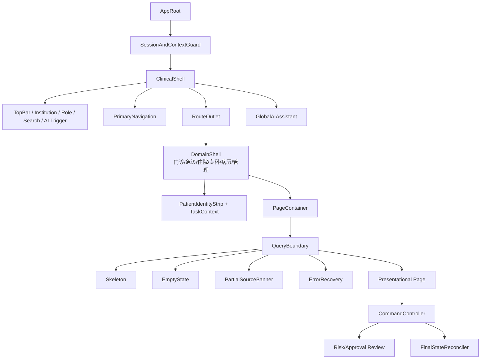
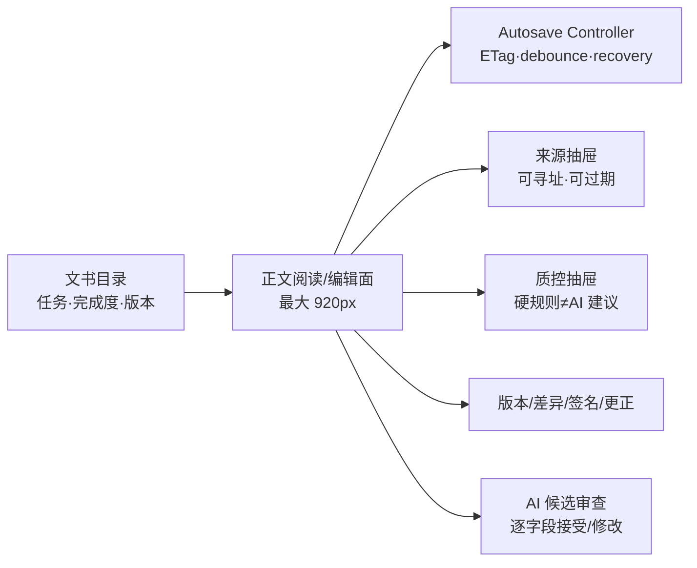
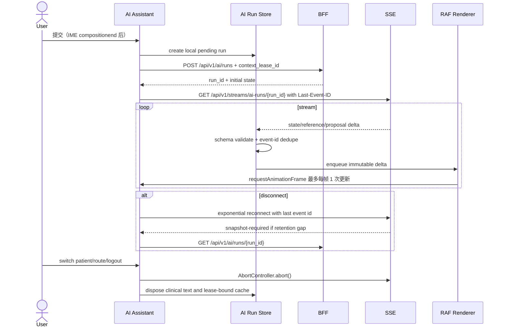

# openemr2026 v1.0 前端详细设计与架构纪律（LLD-FRONT）

## 1. 架构上下文与上游资产映射

### 1.1 资产验收

| 上游 | 前端强契约 |
|---|---|
| PRD v0.15 | 138 FR/AC；门急住独立上下文；10 个核心专科；全科室支持等级；病历是核心；AI 可停用且不替代临床事实 |
| Prototype v0.13 | 194 条实际路由，`route-design-map.csv` 是路由事实源；194/194 深链标题精确匹配，70/70 专科深页 |
| UI A v1.2.0 | `tokens.json`/`design-system.md` 是唯一视觉契约；194/194 当前页面稿、状态母版和可追溯栅格资产 |
| HLD | BFF、S/M/L 部署、集成/AI 故障隔离；不在浏览器保存长期 PHI |
| LLD-DATA/BACK | REST/SSE、ETag/expectedVersion/Idempotency-Key、上下文/水位/部分数据、结构化错误体 |
| LLD-AGENT | ContextLease、AIProposal/AIRun、ContextReference、ToolApproval，无隐藏思维链显示 |

### 1.2 前端工程基线

- **当前已观察**：`web/` 是 React 19 + TypeScript strict + Vite + Zod 的早期纵向切片；它是待迁移实现，不是长期技术决策。
- **生产目标**：Vue 3 + TypeScript strict + Vite 8 + Vue Router + Pinia + TanStack Vue Query + 生成 Zod/JSON Schema codec。Pinia 只管理会话/临床上下文/本地交互，Vue Query 管理服务端事实缓存；不在 store 复制一份可变临床真相。
- **迁移约束**：只有一个生产入口、一个 Route Registry 和一个 ClinicalContext；逐个纵向切片完成 API/路由/截图/E2E 对等后删除对应 React 代码，禁止 iframe/微前端长期双栈。
- Monorepo 包：`apps/web`、`packages/design-tokens`、`packages/ui`、`packages/domain-contracts`、`packages/route-registry`、`packages/testing`。
- 从 OpenAPI/JSON Schema 生成 DTO，禁止在页面手写另一份相似接口。
- 原型合成数据全部从生产 bundle 移除；演示模式通过独立 Mock Service Worker 包启动，显著标记“合成数据”。

## 2. 前端本能与安全防线

1. **患者上下文本能**：所有患者级请求必须从 `ClinicalContextStore` 取 patient/encounter/task lease；组件不从 URL 文本自行拼出。
2. **切换安全**：切患者/就诊/岗位时执行草稿、录音、审批、扫码、AI 运行检查；旧 stream 全部 abort，再清空缓存。
3. **服务端事实本能**：乐观 UI 只用于无副作用的本地交互；签署、医嘱、执行、收费、给药、配置发布以服务端最终状态为准。
4. **无静默旧数据**：部分源、过期水位、断网缓存与模拟数据始终有持久可见标识。
5. **日志脱敏本能**：生产禁止 `console.log(response)`；全局错误上报先经字段白名单和伪名化。
6. **降级本能**：AI、LIS、PACS、搜索或 SSE 失败只影响对应边界；错误边界不使整个工作站白屏。
7. **不可观察的不是成功**：所有按钮有 loading/disabled/success/error；幂等查询最终结果后才显示业务成功。

## 3. 设计系统与 Token 转换

### 3.1 Token 生成管道

`docs/design/ui-delivery/tokens.json -> token compiler -> CSS custom properties + TypeScript const + Storybook docs`。构建过程禁止业务包出现未在 Token 登记的 Hex 颜色。

```typescript
export const semanticColor = {
  brandPrimary: 'var(--oe-color-brand-primary)',
  critical: 'var(--oe-color-semantic-critical-base)',
  warning: 'var(--oe-color-semantic-warning-base)',
  success: 'var(--oe-color-semantic-success-base)',
  information: 'var(--oe-color-semantic-information-base)',
  ai: 'var(--oe-color-semantic-ai-base)',
  stale: 'var(--oe-color-semantic-stale-base)'
} as const;
```

- v1 只发布浅色临床主题；PACS 阅片画布使用局部深色 Token，不影响风险色。
- `compact/standard/touch` 只改变尺寸，不通过 CSS 隐藏字段、状态、权限或阻断。
- 最终功能图标从 `medical-icon-sprite.svg`/组件库生成，禁止 Emoji 作为功能图标。

### 3.2 基础组件发布门禁

| 组件 | 必须状态 | 专项校验 |
|---|---|---|
| Button/Input/Select | default/hover/focus/pressed/disabled/loading/success/error | 键盘、IME、可访问名称、禁止只用颜色 |
| PatientIdentityStrip | normal/risk/switching/stale/emergency | 双标识、重名、过敏、切换未保存 |
| ClinicalTable | loading/empty/partial/stale/offline/error | 表头固定、患者/风险列不丢失、200% 缩放 |
| RecordEditor | autosaving/saved/offline/conflict/blocked/signed/corrected | 不覆盖、草稿恢复、来源/AI/事实分层 |
| RiskBanner | critical/urgent/warning/info/ai/stale | 图标+文字+边框+颜色四重编码 |
| ApprovalReview | loading/stale/approved/rejected/expired/reconciling | 对象、变化、副作用、责任人、恢复方式 |

## 4. 全局数据字典与状态机

### 4.1 领域契约

```typescript
export type UUID = string & { readonly __brand: 'uuid' };
export type ETag = string & { readonly __brand: 'etag' };

export interface ClinicalContextLease {
  leaseId: UUID;
  tenantId: UUID;
  organizationId: UUID;
  facilityId: UUID;
  userId: UUID;
  roleAssignmentIds: UUID[];
  patientId: UUID | null;
  encounterId: UUID | null;
  taskId: UUID | null;
  purposeCode: string;
  allowedSourceTypes: Array<'DOCUMENT_VERSION'|'OBSERVATION'|'ORDER'|'GUIDELINE_CHUNK'|'RULE'>;
  allowedTimeRange: { start: string; end: string } | null;
  authorizationWatermark: string;
  dataClassificationCeiling: 'PUBLIC'|'INTERNAL'|'SENSITIVE'|'RESTRICTED';
  modelResidencyPolicy: 'ON_PREM_ONLY'|'CN_REGION_ONLY'|'APPROVED_EXTERNAL';
  expiresAt: string;
}

export interface ResourceEnvelope<T> {
  data: T;
  etag: ETag;
  dataWatermark: string;
  partialSources: Array<{ source: string; state: 'STALE'|'TIMEOUT'|'OFFLINE'|'DENIED'; asOf?: string }>;
  generatedAt: string;
}

export type PageDataState =
  | { type: 'idle' }
  | { type: 'loading'; previous?: unknown }
  | { type: 'ready'; watermark: string; partialSources: ResourceEnvelope<unknown>['partialSources'] }
  | { type: 'empty'; reason: 'NO_DATA'|'FILTERED'|'NOT_STARTED' }
  | { type: 'offline'; cachedAt?: string; writable: false }
  | { type: 'forbidden'; permissionCode: string; requestable: boolean }
  | { type: 'expired'; kind: 'SESSION'|'CONTEXT'|'DATA' }
  | { type: 'error'; code: string; retryable: boolean; recovery?: RecoveryAction };

export interface RecoveryAction {
  action: 'RETRY'|'RECONNECT'|'OPEN_DIFF'|'REAUTHENTICATE'|'RETURN_TO_QUEUE'|'CONTACT_ADMIN';
  label: string;
  token?: string;
}
```

### 4.2 命令状态

```typescript
export type CommandState<TResult> =
  | { type: 'idle' }
  | { type: 'submitting'; idempotencyKey: string; startedAt: string }
  | { type: 'waiting_external'; idempotencyKey: string; pollAfterMs: number }
  | { type: 'reconciling'; idempotencyKey: string; traceId: string }
  | { type: 'succeeded'; result: TResult; completedAt: string }
  | { type: 'conflicted'; currentEtag: ETag; recovery: RecoveryAction }
  | { type: 'blocked'; violations: RuleViolation[] }
  | { type: 'failed'; code: string; retryable: boolean; recovery?: RecoveryAction };
```

同一按钮在 `submitting/waiting_external/reconciling` 中不生成新幂等键。用户刷新或断线恢复后，前端使用原幂等键查询最终结果。

### 4.3 AI 状态

```typescript
export type AIRunState =
  | 'CREATED' | 'ROUTING' | 'RETRIEVING' | 'PLANNING'
  | 'WAITING_APPROVAL' | 'GENERATING' | 'VERIFYING'
  | 'READY_FOR_REVIEW' | 'ACCEPTED' | 'REJECTED' | 'EXPIRED'
  | 'RETRYING' | 'DEGRADED' | 'RECONCILING'
  | 'COMPLETED' | 'FAILED' | 'BLOCKED' | 'CANCELLED';

export interface ContextReference {
  referenceId: string;
  sourceType: 'DOCUMENT_VERSION'|'OBSERVATION'|'ORDER'|'GUIDELINE_CHUNK'|'RULE';
  sourceId: UUID;
  sourceVersion: string;
  sourceLocator: {
    sectionPath?: string[]; page?: number; paragraph?: string;
    fieldPath?: string; bbox?: [number, number, number, number];
  };
  contentHash: string;
  excerpt: string;
  score: number;
  retrievalMethod: ('SQL'|'BM25'|'DENSE'|'GRAPH')[];
  authorizationWatermark: string;
  retrievedAt: string;
}

export interface AIProposal<T> {
  proposalId: UUID;
  runId: UUID;
  status: 'PENDING_REVIEW'|'ACCEPTED'|'MODIFIED'|'REJECTED'|'EXPIRED';
  payload: T;
  references: ContextReference[];
  provenance: {
    agentVersion: string; skillVersions: string[]; toolVersions: string[];
    modelDeploymentId: string; promptReleaseId: string; knowledgeReleaseIds: string[];
  };
  uncertainty: Array<{ fieldPath: string; reason: string }>;
  expiresAt: string;
}
```

OpenAPI、SSE 和持久化事件的线格式统一使用 `snake_case`；以上 camelCase 仅为前端域内类型。生成的 Zod codec 必须显式完成 `lease_id→leaseId`、`role_assignment_ids→roleAssignmentIds` 等映射，并拒绝未知必填字段、非法枚举和版本不受支持的 payload。禁止组件直接消费未解码 JSON。

界面显示可见计划、来源、模型/Agent/Skill 版本、Tool 副作用和验证结果；不显示或请求隐藏思维链。

### 4.4 错误到 UI 恢复矩阵

| 条件/后端错误 | 用户消息 | 保留状态 | 主动作 | 次动作 | 严重度 |
|---|---|---|---|---|---|
| `AUTHENTICATION_REQUIRED` | 会话已失效，请重新登录 | 加密本地草稿、当前路由 | 重新认证 | 安全退出 | BLOCKING |
| `PATIENT_CONTEXT_CHANGED` | 患者/就诊已变化，旧操作未提交 | 本地草稿、旧上下文摘要 | 返回队列并重新选择 | 导出未保存差异 | BLOCKING |
| `VERSION_CONFLICT` | 资源已被更新，不能覆盖 | 本地编辑内容、ETag、服务器版本 | 打开差异 | 保存为受控草稿 | BLOCKING |
| `RULE_BLOCKED` | 存在必须处理的安全项 | 表单全部内容 | 定位首个阻断 | 查看证据/责任人 | BLOCKING |
| `PARTIAL_SOURCE` | 部分来源不可用，数据不完整 | 已加载内容与来源时间 | 重试缺失来源 | 在允许场景继续并记录原因 | WARNING |
| `DEPENDENCY_TIMEOUT` | 外部服务暂不可用 | 当前任务、幂等键 | 查询最终状态/重试 | 转人工或返回队列 | WARNING |
| `IDEMPOTENCY_IN_PROGRESS` | 操作仍在处理中 | 原幂等键、提交内容只读快照 | 查询结果 | 取消等待（不生成新键） | INFO |
| `RESOURCE_NOT_FOUND_OR_DENIED` | 无权访问或资源不存在 | 不保留正文 | 返回安全入口 | 申请授权 | BLOCKING |

遥测只记录错误码、路由族、恢复动作、耗时和伪名 trace，不记录患者姓名、病历正文、Prompt 或输入控件值。

## 5. 组件拓扑、路由和 API 挂载

### 5.1 总体组件树



### 5.2 Container / Presentational 分离

| Container | 订阅/API | Presentational | Events |
|---|---|---|---|
| `OutpatientWorkspaceContainer` | encounter queue/timeline/tasks | `PatientQueue`, `EncounterSummary`, `TaskRail` | select patient, open record, claim task |
| `RecordEditorContainer` | document/version/source/qc | `DocumentTree`, `RecordPaper`, `SourceDrawer`, `QCRail` | save, open diff, sign, correct |
| `SpecialtyRecordContainer` | capability pack/schema/specialty data | `SpecialtyFieldGrid`, `RelationshipCard`, `SafetyPanel` | validate, open flow, submit QC |
| `IntegrationOpsContainer` | connectors/messages/reconciliation | `ConnectorGrid`, `MessageTrace`, `MappingDiff` | replay, quarantine, approve mapping |
| `AIAssistantContainer` | context lease/AI run/SSE/proposals | `SuggestionList`, `ConversationView`, `ReferenceViewer`, `ToolApprovalCard` | ask, cancel, approve, reject, accept proposal |
| `AdminContainer` | org/users/roles/policies/releases | `AdminNav`, `MasterDetail`, `ImpactDiff`, `ReleaseTimeline` | draft, validate, submit, approve, rollback |

Presentational 组件只接收 props 并抛出语义事件，不直接 fetch、不读 localStorage、不修改全局 store。

### 5.3 194 路由注册

`route-design-map.csv` 在构建时生成强类型 Route Registry：

```typescript
export interface ClinicalRouteDefinition {
  id: string;
  path: string;
  primaryDomain: 'CLINICAL'|'RECORD'|'QUALITY'|'COLLABORATION'|'DATA'|'AI'|'CONFIG'|'ADMIN';
  patientContext: 'NONE'|'OPTIONAL'|'REQUIRED';
  encounterContext?: 'OUTPATIENT'|'EMERGENCY'|'INPATIENT'|'ANY';
  density: 'COMPACT'|'STANDARD'|'TOUCH';
  permissions: string[];
  featureFlag?: string;
  component: () => Promise<{ default: import('vue').Component }>;
}
```

构建门禁校验：194 个 ID 唯一、每个恰有一个一级归属、动态 import 存在、权限非空（公开页除外）、需患者的页面必须经 Vue Router `beforeEach` Guard，H1 与路由中文标题精确匹配，未知深链进入安全 NotFound 而不沿用旧上下文。Prototype v0.13 已修复深链回落门户的问题；生产 Router 仍必须用 E2E 覆盖浏览器刷新和直接粘贴 URL。

科室路由还要读取 `DepartmentSupportAssessment`：`GENERAL_AVAILABLE` 展示通用能力边界，`BASIC_CLOSED_LOOP` 才开放已经通过证据的专业流程，`PACK_PENDING` 展示缺口而不提供伪完成入口，`UNSUPPORTED` 阻止进入。10 个核心专科的设计页不自动把支持状态升级为生产就绪。

### 5.4 病历编辑器详细拓扑



- 自动保存：用户停止输入 800ms 后触发，最长 5s 强制一次；请求携带 ETag；一次仅有一个在途保存。
- 离线恢复：草稿用会话级 WebCrypto 密钥加密存入 IndexedDB；切患者、退出、会话过期时销毁密钥；恢复必须差异审查。
- 并发冲突：保存失败后保留本地草稿，展示当前服务端版本差异；禁止“仍然覆盖”。
- AI 续写进入独立 proposal，红线/紫色差异预览；接受后作为用户编辑更改并保留来源，不绕过自动保存和签署门禁。
- `#/record-qc` 是文书版本级治理视图：必须区分 `NOT_RUN/PASSED/WARNING/BLOCKED`，同屏呈现质控运行、硬规则 finding、签名、分级审签、退回决定与证据水印。AI 建议独立分区，不计入硬规则数，不能直接触发签署。
- 后端返回签名状态 `PENDING_CA_EVIDENCE` 时，UI 必须明示待补强，禁止用绿色“已验真”语义或伪造证书/时间戳。

## 6. SSE/AI 流式渲染与缓存生命周期

### 6.1 流式管线



AI SSE `data` 的线格式固定为：

```typescript
type AIRunWireEvent = {
  schema_version: 1;
  event_id: string;
  run_id: string;
  sequence: number;
  event_type: 'RUN_STATE_CHANGED'|'REFERENCE_ADDED'|'PROPOSAL_UPSERTED'|'VERIFICATION_UPDATED'|'SNAPSHOT_REQUIRED';
  state?: AIRunState;
  occurred_at: string;
  data_watermark: string;
  context_lease_id: string;
  payload: unknown;
};
```

Store 只接受 `run_id/context_lease_id` 与当前 store 相同且 `sequence` 连续递增的事件；重复事件丢弃，序号跳跃进入 `SNAPSHOT_REQUIRED`，未知 `schema_version/event_type` 停止合并并回 REST 快照。UTF-8 由 SSE frame 完整 JSON 传输，不按任意字节切 token；文本增量只能出现在 JSON 字符串字段内。

- 连续 token delta 每 50ms 或每 animation frame 合并，Markdown 分块 AST 增量解析；未闭合标记不得导致白屏。
- 不渲染模型隐藏思维；“正在检索/验证”来自 AIRun 状态，不伪造人类化思考文本。
- 参考引用点击前使用当前授权水位重新获取；无权/已过期则展示原因，不从客户缓存展开。

### 6.2 Query 与缓存策略

| 数据 | 工具 | stale/cache | 失效 |
|---|---|---|---|
| 机构菜单/字典发布 | TanStack Vue Query | 版本键，5–30min | 配置发布事件/版本改变 |
| 患者基本上下文 | TanStack Vue Query | 30s，不持久 | 患者/就诊切换、MPI 合并、权限变更 |
| 病历正文 | TanStack Vue Query + draft controller | `no-store`，内存级 | 版本事件、签署/更正、上下文销毁 |
| 队列/任务 | Query snapshot + SSE patch | 按水位 | stream gap 时重拉快照 |
| AI 会话 | Pinia lease-bound store | 仅当前患者/就诊内存 | 切换、到期、清空上下文、紧急停用 |

## 7. 响应式、可访问性、性能与 QA

### 7.1 布局规则

- 1280–1920 为 P0；1024–1279 进入 compact；不对工作站主任务做横向整页滚动。
- 屏幕宽度不足时首先将来源/质控/辅助栏改为抽屉，然后折叠次要导航；不缩小患者身份、风险、保存和签署。
- 200% 缩放降为单列也必须完成主任务。床旁 Touch 使用独立路由布局与至少 44px 点击区，不把桌面三栏等比压缩。

### 7.2 性能预算

| 项 | 预算 |
|---|---:|
| 首屏壳层 gzip | ≤250KB JS，业务域按路由 lazy load |
| 单路由业务 chunk gzip | ≤180KB（PACS/Record Editor 可独立例外） |
| 队列 10k 行 | 虚拟滚动，DOM 行≤150 |
| SSE delta 渲染 | ≤每帧 1 次 store commit |
| 路由切换主线程长任务 | p95 ≤50ms |
| 内存 | 8h 班次无持续增长；上下文切换后旧 stream/listener/draft 可回收 |

### 7.3 可访问性

- WCAG 2.2 AA 作为工程基线；正文对比 ≥4.5:1，控件/focus ≥3:1。
- 键盘顺序与视觉一致；所有图标按钮有中文 accessible name；弹窗 focus trap 与返回焦点可测试。
- 中文 IME：`compositionstart` 到 `compositionend` 期间 Enter 不提交聊天、表单或快捷指令。
- 风险不只使用红/绿；读屏顺序先读“阻断/警告/AI 建议”再读原因和操作。

### 7.4 资源与资产契约

- 品牌、导航、AI、录音和风险图标仅从版本化本地资产包加载；`medical-icon-sprite.svg` 的 symbol ID 经构建检查，不运行时依赖公共 CDN 或 Emoji。
- 医院 Logo/主题覆盖只替换允许的品牌 Token 与资产槽，不改变阻断、危急、警告、AI 和过期语义色。
- PACS 像素、患者照片和扫描病历不进入通用静态资源缓存；对象 URL 在组件卸载和患者切换时立即 revoke。
- 远程附件需要后端签发短时、用途绑定 URL；下载失败展示来源/时间/重试，不回退不受控公网地址。
- 构建物记录源 commit、`tokens.json` hash、资产清单 hash、目标端和生成时间；未知/孤儿资产或路径缺失阻断构建。
- P0 工作站首屏资源预算遵循 7.2；P1 PWA 安装包与离线清单只包含壳层和无 PHI 静态定义，不预缓存患者正文。

### 7.5 测试金字塔

| 层 | 覆盖 |
|---|---|
| Unit | reducers/selectors、Schema、状态转移、密码脱敏、IME、幂等键保留 |
| Component | 每个设计系统组件全状态、键盘、读屏、高对比度、长中文 |
| Contract | OpenAPI/SSE 事件、结构化错误、ETag/Idempotency、AIProposal/ContextReference |
| Integration | Mock Server 中的断网、部分源、会话过期、冲突、重连、乱序/duplicate SSE |
| E2E | 门诊、住院、病历签署/更正、专科阻断、集成重放、配置发布、AI 批准 |
| Visual | 194 路由基线 + 全局/病历/专科/AI 状态母版，1280/1600 和 200% 关键页 |

### 7.6 Eng Manager & QA 发布清单

- [ ] Route Registry 与 `route-design-map.csv` 194/194，一级激活唯一，未知深链不泄漏旧患者上下文。
- [ ] 生产 bundle 不含原型 Mock 患者/就诊数据、调试凭据或 source map 中的 PHI。
- [ ] 文书保存失败、网络中断和并发冲突无静默覆盖，本地草稿可差异恢复。
- [ ] 签署/医嘱/给药/配置发布在超时时进入对账，不直接显示失败并允许新重试键。
- [ ] SSE 支持 Last-Event-ID、去重、断档快照恢复和 AbortController；切患者后旧事件无法进入新 store。
- [ ] AI 不可用、停用、超时、来源部分失败时，手工 EMR 主链可完成。
- [ ] 有副作用的 AI Tool 显示对象、变化、后果、批准范围和过期时间；拒绝后不执行。
- [ ] 无未清理 stream/timer/listener/object URL；8h soak 测试内存稳定。
- [ ] axe/键盘/200% 缩放/中文 IME/减少动效通过核心页面族门禁。

## 8. V24 `#/archive-assets` 交互契约

- 页面属于“病历中心”一级导航，不跳回门诊工作台；病历中心当前文书卡片提供显式“病案归档”入口。
- 首屏顺序固定为：就诊/文书/阻断/病案四指标 → 归档资格 → 封存控制 → 不可变清单 → 事件时间轴 → 独立导出。
- 不用“问题列表为空”推断可归档，仅使用服务端 `ready`；每个 blocker 显示 code 的中文标签、原始 message 和可选文书定位。
- 只有 `ready=true && archive_case=null` 开放归档；`ARCHIVED/UNSEALED` 显示封存，`SEALED` 显示解封和导出。所有命令防连点，403/409/契约漂移在页内明示错误码，不伪造状态前移。
- 导出列表显示用途、生成时间、字节数、状态和截断校验值；原文下载不使用无身份的普通 `<a>`，后续下载控件必须通过带租约 fetch 获得 blob 后临时创建 object URL。
- 界面永久显示当前能力边界：未实现的纸质扫描、借阅审批、长期保存不显示成功数或可提交假表单。

## 9. S005-4 前端可实施契约

### 9.1 路由追溯与生成制品

`docs/design/ui-delivery/route-design-map.csv` 继续作为 194 页视觉/状态事实源，`prototype/traceability.csv` 作为 FR/AC/SCR 事实源。S007 必须生成 `route-contract.generated.json`，每行包含：

```text
route_id,path,screen_id,roles,fr_refs,ac_refs,api_refs,states,guards,layout
```

| route family | screen/roles | FR/AC | API refs | states/guards/layout |
|---|---|---|---|---|
| `outpatient*` / `opd-record` | 门诊医生/护士 | FR-089/098–100 + 对应 AC | Encounter/Document/Order/Result | 13 类状态；OUTPATIENT lease；desktop clinical |
| `inpatient*` / `inpatient-doc-*` | 住院医生/护士/上级医师 | FR-082–87/090 | Encounter/Document/Task/Order | 时限/审签/科室 Guard；dense desktop/touch |
| `record*` / `archive-*` | 临床/质控/病案 | FR-094/098–101/105 | Document/QC/Signature/Archive | 版本/用途/岗位 Guard；record shell |
| `{specialty}-{mode}` | 授权专科人员 | FR-129–138 + 对应 AC | SpecialtyPack/Assessment + 通用临床 API | 70 页；support level+专项安全 Guard |
| `integration-*` / LIS/PACS | 集成/临床角色 | FR-102–104 | Connector/Message/Result/DICOM | 部分源/延迟/SSO Guard；ops/clinical split |
| `ai-*` / 全局 AI | 临床/AI 治理 | FR-070–81/120–124 | ContextLease/AIRun/Proposal | AI 可停用；patient/purpose/model guard |
| `admin-*` / config/data | 管理/质控/数据角色 | FR-062–69/106–119 | Admin/Config/Data/Research | 职责分离/用途/发布 Guard；admin shell |

构建器对 CSV 和 JSON 做双向集合校验：194 路由不少不多、唯一一级归属、每页有角色/状态/加载组件，所有 FR-001–138 至少追溯到一个路由或明确的无 UI 契约。

### 9.2 组件职责契约

| component | responsibility | inputs / outputs | owned_state / side_effects | a11y / tests |
|---|---|---|---|---|
| `ClinicalShell.vue` | 机构/岗位/一级导航/AI 入口 | session, nav model / semantic nav events | 壳层展开态；无临床写入 | landmark/跳转链接；唯一一级激活 E2E |
| `PatientIdentityStrip.vue` | 固定显示双标识/风险/上下文 | lease envelope / switch request | 切换确认态；触发 context coordinator | 风险先读；错患者/未保存测试 |
| `RecordEditor.vue` | 结构化+叙事文书编辑 | schema, version, sources / draft events | 本地表单/光标/恢复；无直接 fetch | label/IME/键盘；冲突/离线/长文本 |
| `DocumentCommandController.vue` | 保存/质控/签署命令协调 | semantic command / CommandState | 幂等键+对账；调用生成 API adapter | loading/disabled/live region；重放/超时 |
| `GlobalAIAssistant.vue` | 随处可达建议/运行/审批 | page context, AIRun / ask/cancel/review | 当前 lease-bound UI；无业务直写 | focus trap/状态宣告；切患者/停用/断流 |
| `QueryBoundary.vue` | loading/empty/partial/stale/offline/forbidden/error | PageDataState / recovery event | 无服务端事实复制 | focus+message semantics；全状态组件测试 |

### 9.3 状态所有权与 API 适配

| state | source / owner | transitions | persistence / recovery / UI |
|---|---|---|---|
| local interaction | Vue component/composable | click/input/dialog | 不持久或 session；路由离开复位 |
| URL/navigation | Vue Router | guard/push/back/deep link | URL；未知/无权到安全页，不留旧正文 |
| form/draft | Form controller + document store | edit/autosave/conflict/recover | 服务端版本+会话级加密 IndexedDB；差异恢复 |
| server data | TanStack Vue Query | query/invalidate/SSE watermark | 内存；部分/过期永久可见，切上下文清除 |
| session/permission/context | Pinia `useClinicalContextStore` | login/role/patient/encounter/purpose | 短会话；变更先 abort stream/query/command |
| streams/jobs | Pinia per-run/task store | snapshot+ordered event+reconnect | event id/sequence；断档拉快照，超时进对账 |

| contract_id | backend_ref / frontend_type | mappings | error/cancel/retry/cache/telemetry |
|---|---|---|---|
| FE-DOC-001 | `Document_SaveDraft` / `DraftCommand` | generated snake_case codec↔camelCase | error catalog；AbortController 只取消等待；原幂等键对账；no-store；duration/code/route |
| FE-QRY-001 | `GET document/governance` / `ResourceEnvelope<Governance>` | ETag/watermark/partial sources 显式映射 | 可取消；GET 有界重试；内存；source-state |
| FE-AI-001 | `AI run REST+SSE` / `AIRunWireEvent` | schema_version/event/sequence codec | abort 旧 lease；Last-Event-ID；不持久 PHI；gap/reconnect/model route id |
| FE-ARC-001 | `Archive_Export` / `ArchivePackage` | UTF-8 byte/hash 校验 | 取消等待不删作业；轮询/SSE 对账；no-store；hash mismatch P0 |

### 9.4 React → Vue 3 施工门禁

1. 先冻结 OpenAPI/SSE/route/tokens/screenshot 契约，建 Vue 3 壳层与生成 codec，不改后端规则。
2. 首个切片严格跟随现有任务：登录/上下文→门诊→当次门诊病历→全院病历中心→质控/签署。
3. 每切片必须通过 typecheck、unit/component/contract/E2E、深链、患者切换、错误恢复和截图差分，再删除对应 React 入口。
4. 迁移期 CI 阻断新增 React 页面和第二份路由/上下文实现；只有最终发行包不含 React runtime 才可关闭迁移工单。

S005-4 状态为 `CREATED`；Vue 3 单栈、194 路由注册、API codec、弱网恢复、a11y、视觉回归和 8h soak 未形成运行证据前不得标 `VERIFIED`。
