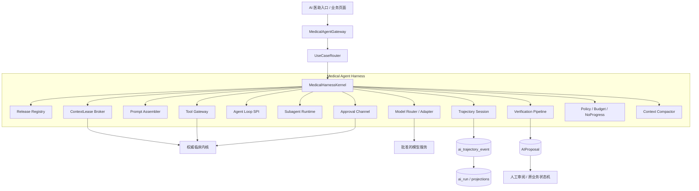
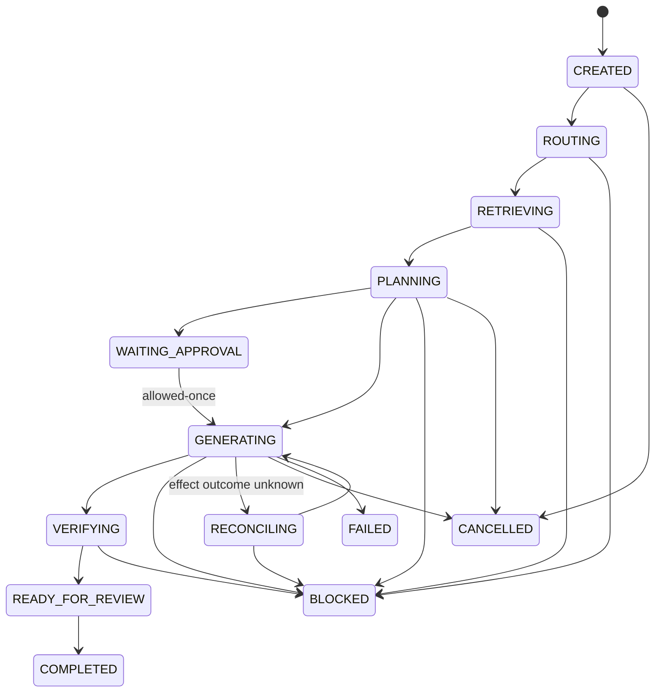

# openemr2026 Medical Agent Harness LLD

> - 文档版本：v0.1
> - 日期：2026-08-25（Asia/Shanghai）
> - 文档状态：`CREATED`，待产品、临床、架构、安全、数据与测试联合评审
> - 设计模式：`DESIGN`
> - 需求输入：[Agent 优化版 PRD v0.2](../../product/prd/2026-08-25-openemr2026-agent-optimization-prd.md)
> - 上位架构：[openemr2026 LLD-AGENT](./2026-08-14-openemr2026-lld-agent.md)
> - 参考实现：[DeepSeek Harness](https://github.com/deepseek-ai/deepseek-harness)
> - 本文定位：补充主 Agent、诊疗环节子 Agent、Skill、Tool 的可实现运行时设计；不替代数据、后端、前端和安全 LLD

## 0. 结论与设计边界

### 0.1 核心结论

openemr2026 应建设自己的 **Medical Agent Harness**，参考 DeepSeek Harness 的插件化运行时、追加式会话事件、作用域化 Prompt/Tool、可替换 Agent Loop 和 Subagent 接缝，但不直接绑定其预览期包名或 API。医疗 Harness 的核心公式是：

```text
Agent = 版本化 AgentDefinition
      + 受控 AgentLoop
      + 最小 ContextLease
      + 版本化 Prompt / Skill / Tool
      + ModelRoute
      + Policy / Approval / Verification
      + 追加式 Trajectory
      + Budget / Cancellation / Recovery
```

模型只负责受约束的语言理解、结构化生成和有限规划；它不是权限主体、临床事实来源、状态机、规则引擎或医疗责任主体。

### 0.2 采用与不采用

| DeepSeek Harness 思路 | 本项目决策 | 医疗化处理 |
|---|---|---|
| Everything is a plugin | `ADOPT` | 抽象为供应商无关的 Harness SPI；实现可替换但发布版本必须锁定 |
| append-only session event log | `ADOPT` | `ai_trajectory_event` 为运行事实源，`ai_run` 为可重建投影；事件不得保存隐藏思维链 |
| per-Agent scoped prompt/tools/listeners | `ADOPT` | 每个父/子 Agent 获得独立作用域，释放作用域后能力自动撤销 |
| swappable agent loop | `ADOPT` | 首版包含 `LegacySingleShotLoop`、`StructuredToolLoop`、`CompositionLoop` 三类 |
| guarded tool pipeline | `ADOPT+HARDEN` | 多层策略只能收紧，不能后置重新放行；Tool 服务端再次鉴权 |
| subagent optional seam | `ADOPT` | 子 Agent 只能来自批准的 `AgentCompositionRelease`，P0 最大深度为 1 |
| compaction preserves original log | `ADOPT` | 只压缩模型可见上下文，保留来源事件序号、ContextReference 和未解决项 |
| model-authored JavaScript workflow | `REJECT` | 医疗生产禁止任意代码；仅执行已审批的声明式 DAG |
| shell/filesystem-style general tools | `REJECT` | 禁止通用 SQL、HTTP、文件、Shell、代码执行 Tool |
| advisory repeat-tool reminder | `HARDEN` | 升级为确定性 NoProgressGuard，达到阈值后阻断或转人工 |
| developer-preview concrete API | `DO NOT COUPLE` | 只借鉴架构原则；所有适配通过本项目 SPI 和契约测试 |

DeepSeek Harness 官方文档将运行内核描述为可替换插件、追加式事件日志和受保护工具循环，并明确当前处于 developer preview、可能发生 breaking changes。因此本文不将其作为运行依赖基线，只作为参考架构。[Architecture](https://github.com/deepseek-ai/deepseek-harness/blob/master/docs/architecture.md) · [Agent lifecycle](https://github.com/deepseek-ai/deepseek-harness/blob/master/docs/agent-lifecycle.md) · [Official landing page](https://deepseek.com/harness/en/)

### 0.3 事实分级

| ID | 类型 | 结论 |
|---|---|---|
| FACT-001 | `OBSERVED` | 当前 `AgentRunService` 同步创建并立即执行一次文书草拟；`ClinicalModelProvider` 只有单次 `generate` 契约。 |
| FACT-002 | `OBSERVED` | 当前已有 `ai_run`、`ai_run_event`、`ai_tool_invocation`、`ai_proposal`、ContextLease、预算、审批和执行表。 |
| FACT-003 | `OBSERVED` | 当前 Agent/Skill/Tool 注册表主要保存身份、版本、状态；`agent_dependency` 只支持 `SKILL/TOOL`，尚不能表达主子 Agent DAG。 |
| FACT-004 | `OBSERVED` | 当前 DeepSeek Provider 硬编码文书草拟 System Prompt，尚未实现 Tool Loop、子 Agent 或 Prompt 资产装配。 |
| FACT-005 | `INFERRED` | 现有治理资产可作为 Harness 的第一批适配器，无需推倒重写。 |
| FACT-006 | `UNKNOWN` | 目标医院的数据驻留、首批科室、模型白名单、预算和保留期尚未批准；本文预算均为初始建议值。 |

## 1. 目标架构

### 1.1 逻辑拓扑



### 1.2 运行时分层

| 层 | 组件 | 责任 | 禁止承担 |
|---|---|---|---|
| L0 | `MedicalAgentGateway` | 身份、上下文、幂等、任务入口、SSE、取消 | 直接拼 Prompt 或执行 Tool |
| L1 | `HarnessKernel` | 装载锁定制品、建立作用域、驱动状态与事件 | 做临床判断 |
| L2 | `AgentLoop` | 在预算内协调模型、Tool、子 Agent 和终止 | 扩权、绕过策略、创建未知制品 |
| L3 | `AgentDefinition/Skill/Prompt` | 固化任务契约、工作流和输出 Schema | 保存患者事实或秘密 |
| L4 | `ToolGateway` | 确定性能力、独立鉴权、幂等、审批 | 暴露通用基础设施能力 |
| L5 | 临床内核 | 权威事实、状态机、规则、签署、执行与审计 | 信任模型声明的权限或完成状态 |

### 1.3 Harness SPI

本文定义逻辑 SPI，不承诺 Java 类名；编码前由 LLD-BACK 固化接口与错误模型。

| SPI | 输入 | 输出 | 关键约束 |
|---|---|---|---|
| `AgentReleaseResolver` | tenant、use case、agent code、clinical stage | 锁定的 release graph | 只解析 `APPROVED/ACTIVE`；全链版本不可漂移 |
| `SessionStore` | run、typed event | append result / replay view | 仅追加；序号单调；支持投影重建 |
| `AgentLoop` | `RunScope`、input envelope | terminal result | 循环可替换；必须响应取消和预算 |
| `PromptContributor` | release、scope、step | prompt sections | 静态与动态分段；不得注入未授权正文 |
| `ContextProvider` | parent lease、declared selector | derived lease + references | 子租约是父租约的真子集 |
| `ModelAdapter` | normalized request | typed stream/result/usage | 供应商细节不泄漏到 Agent 定义 |
| `ToolProvider` | tool call envelope | canonical JSON / error | 输入输出 Schema 强校验，服务端重新鉴权 |
| `PolicyInterceptor` | request/event/call | `ALLOW/DENY/ASK` | 决策只能保持或收紧，`DENY` 不可被后置覆盖 |
| `SubagentProvider` | approved node + child scope | child run handle/result | 不支持时明确失败；记录 lineage |
| `Verifier` | candidate + sources + release | findings / gate decision | Schema、来源、患者一致性、临床质量分层 |
| `ApprovalChannel` | exact action payload hash | one-shot decision | `allowed-once`；拒绝、取消、不可用均 fail closed |
| `Compactor` | event range + unresolved state | compacted context block | 原事件不删除；摘要必须记录 source sequences |
| `TelemetrySink` | redacted metric/event | trace/metric/audit ref | PHI 最小化；禁止记录隐藏思维链 |

DeepSeek Harness 的 Core、Session、Tools 与 Approval 子系统同样以事件和作用域解耦具体实现；工具定义强调输入/输出 Schema，审批是具体动作的一次性决定。[Core](https://github.com/deepseek-ai/deepseek-harness/blob/master/docs/subsystems/core.md) · [Session](https://github.com/deepseek-ai/deepseek-harness/blob/master/docs/subsystems/session.md) · [Tools](https://github.com/deepseek-ai/deepseek-harness/blob/master/docs/subsystems/tools.md) · [Approval](https://github.com/deepseek-ai/deepseek-harness/blob/master/docs/subsystems/approval.md)

## 2. 制品模型与作用域

### 2.1 不可变 Release

注册表继续保存稳定 code；实际运行只引用不可变 Release：

```yaml
agentRelease:
  code: DOCUMENT_DRAFTER
  version: 1.0.0
  level: MAIN
  purpose: 生成可审阅、带来源的文书候选
  autonomy: A1
  loopType: COMPOSITION
  inputSchema: schema://agent/document-drafter/input/1
  outputSchema: schema://proposal/document-draft/1
  promptRelease: prompt://document-drafter/1.0.0
  compositionRelease: composition://document-drafter/p0/1.0.0
  modelRoutePolicy: route://clinical-structured-generation/1
  contextPolicy: context://document-drafter/1
  verificationProfile: verify://document-draft/1
  budgetProfile: budget://document-drafter-main/1
  owner: clinical-documentation
```

建议新增逻辑对象：

| 对象 | 关键字段 |
|---|---|
| `agent_definition_release` | code/version、level、parent_main_code、purpose、autonomy、loop_type、I/O Schema、各 release 引用、owner、status、content_hash |
| `agent_composition_release` | main agent release、clinical stage、DAG、总预算、失败策略、聚合 Schema、approval evidence |
| `agent_composition_node` | child agent release、criticality、trigger、input mapping、output mapping、node budget、retry、skip rule |
| `agent_composition_edge` | from/to、condition、可传字段白名单 |
| `prompt_asset_release` | role、static prefix、template、variables schema、safety header、hash |
| `skill_definition_release` | I/O Schema、workflow、allowed tool releases、knowledge refs、failure semantics、eval suite |
| `tool_definition_release` | risk level、I/O Schema、authorization、scope、timeout、concurrency、idempotency、approval/compensation |

### 2.2 RunScope

每次运行创建不可变的 `RunScope` 快照：

```text
RunScope = actor/role/tenant
         ∩ use-case policy
         ∩ patient/encounter/task/page
         ∩ ContextLease
         ∩ AgentRelease
         ∩ CompositionNode
         ∩ Skill/Tool allowlist
         ∩ model route and data residency
         ∩ budget/deadline/cancellation
```

子 Agent 的 ContextLease、Tool 集、自治等级、预算、截止时间和输出目标必须分别小于或等于父 Scope。任何交集为空都直接 `BLOCKED`，不允许模型自行补救权限。

### 2.3 Scoped capability lifecycle

1. `HarnessKernel` 解析全部锁定 Release 并验证 hash。
2. 创建 root `RunScope`，注册该主 Agent 专属 Prompt、Tool、拦截器和事件监听器。
3. 创建子 Agent 时从父 Scope 派生 child scope，只挂载节点声明能力。
4. 子运行完成、取消或失败时释放 child scope；之后所有旧 Tool token 失效。
5. root 结束时释放所有作用域并吊销尚未消费的 approval token。

这对应 DeepSeek Harness 的 per-Agent scoped registrations 思路，但本项目额外绑定患者、就诊、用户、授权水位和临床任务状态。[System prompt](https://github.com/deepseek-ai/deepseek-harness/blob/master/docs/subsystems/system-prompt.md) · [Subagent](https://github.com/deepseek-ai/deepseek-harness/blob/master/docs/subsystems/subagent.md)

## 3. 声明式主子 Agent 编排

### 3.1 Composition 规则

- 每个用户任务只存在一个 root 主 Agent。
- P0 最大层级为 `MAIN → SUB`，`maxDepth=1`；子 Agent 不得再创建子 Agent。
- 生产只能执行审批后的 DAG；禁止循环、动态下载、动态创建 Agent 和模型生成脚本。
- 节点选择首先依据页面对象和业务状态，其次才使用自然语言意图。
- 子 Agent 输出只进入显式 edge 白名单；不得共享完整上下文或私有工作记忆。
- 只读且互不依赖的子节点可并行；候选创建、审批和业务写入必须排他。
- `critical=true` 节点失败时 root `BLOCKED`；非关键失败仅在组合明确允许时产出 `PARTIAL`。
- root 最终必须再次执行 Schema、patient、source、conflict 和 permission verification。

### 3.2 Composition 示例

```yaml
composition:
  code: DOCUMENT_DRAFTER_WARD_ROUND
  version: 1.0.0
  rootAgent: DOCUMENT_DRAFTER@1.0.0
  clinicalStage: INPATIENT_WARD_ROUND
  maxDepth: 1
  maxChildren: 2
  totalBudget: { steps: 12, toolCalls: 18, inputTokens: 48000, outputTokens: 8000, durationSeconds: 90 }
  nodes:
    - id: context
      agent: INPATIENT_DAILY_SUMMARIZER@1.0.0
      critical: true
      toolPolicy: readonly-inpatient-daily@1
      output: InpatientDailyFactsV1
    - id: draft
      agent: WARD_ROUND_NOTE_DRAFTER@1.0.0
      critical: true
      dependsOn: [context]
      inputMapping: [context.facts, context.sourceRefs, run.userInputs]
      output: WardRoundNoteDraftV1
  aggregate:
    verifier: document-draft@1
    proposalType: CLINICAL_DOCUMENT_DRAFT
    onNonCriticalFailure: PARTIAL
    onCriticalFailure: BLOCKED
```

### 3.3 父子取消、恢复与降级

| 场景 | 行为 |
|---|---|
| 用户取消 root | 广播 cancellation；禁止启动新 child 或 Tool；等待在途只读调用安全终止；root `CANCELLED` |
| child 超时 | 记录 `child.timed_out`；按节点最多一次受控重试；仍失败按 criticality 聚合 |
| Tool 结果未知 | 不自动重试副作用；进入 `RECONCILING`，由领域查询核验 |
| 模型不可用 | 只可切换到同一数据驻留/能力等级的批准 fallback；否则转人工 |
| ContextLease 过期 | 立即停止；候选作废；新上下文创建新 run，不修改旧轨迹 |
| 已完成 child 可复用 | 仅当输入 hash、release graph、授权水位和 source watermark 全部一致时引用旧结果 |
| 非关键 child 不可用 | 组合显式允许才 `PARTIAL`；UI 展示缺失范围，不伪装完整 |

## 4. Agent Loop 与事件轨迹

### 4.1 三类 Loop

| Loop | 用途 | P0 使用 |
|---|---|---|
| `LegacySingleShotLoop` | 兼容当前一次模型调用实现 | 迁移期文书草拟，只在影子/兼容路径 |
| `StructuredToolLoop` | 单 Agent 在有限步内进行模型—Tool—验证循环 | 摘要、质控、趋势复核等子 Agent |
| `CompositionLoop` | 按批准 DAG 驱动子 Agent 并聚合 | 5 个主 Agent |

```text
load releases → create scope → append run.created
→ assemble prompt/context snapshot
→ while budget remains and not terminal:
    request model OR schedule approved child
    validate structured response
    guard requested capability
    execute tool/child with cancellation
    append result event
    run no-progress + policy checks
→ verify aggregate → create AIProposal or BLOCKED/PARTIAL
→ project state → dispose scope
```

### 4.2 规范事件词汇

`ai_trajectory_event` 是规范事实源，`ai_run`、进度视图和 SSE 是投影。可复用现有 `ai_run_event` 并通过迁移扩展；禁止双写两个相互竞争的事实源。

| 类别 | 事件 |
|---|---|
| 生命周期 | `run.created`、`run.started`、`run.cancel_requested`、`run.completed`、`run.partial`、`run.blocked`、`run.failed`、`run.cancelled` |
| 快照 | `release_graph.resolved`、`scope.snapshot`、`context.snapshot`、`prompt.snapshot`、`model_route.selected` |
| 步骤 | `step.started`、`step.completed`、`step.failed`、`budget.consumed`、`no_progress.detected` |
| 模型 | `model.requested`、`model.completed`、`model.failed`、`model.usage_recorded` |
| Tool | `tool.requested`、`tool.guard_decided`、`tool.started`、`tool.completed`、`tool.failed`、`tool.outcome_unknown` |
| 审批 | `approval.asked`、`approval.allowed_once`、`approval.rejected`、`approval.expired`、`approval.consumed` |
| 子运行 | `child.planned`、`child.started`、`child.completed`、`child.incomplete`、`child.blocked`、`child.failed`、`child.cancelled` |
| 压缩 | `context.compaction_started`、`context.compacted`、`context.compaction_failed` |
| 验证/候选 | `verification.finding`、`verification.passed`、`verification.blocked`、`proposal.created`、`proposal.decided` |

### 4.3 事件 Envelope

```json
{
  "eventId": "uuid",
  "tenantId": "uuid",
  "rootRunId": "uuid",
  "parentRunId": "uuid|null",
  "runId": "uuid",
  "sequence": 17,
  "eventType": "tool.completed",
  "occurredAt": "RFC3339",
  "actorRef": "user/service ref",
  "agentReleaseRef": "RESULT_TREND_REVIEWER@1.0.0",
  "scopeHash": "sha256",
  "correlationId": "uuid",
  "causationEventId": "uuid",
  "payloadSchema": "schema://event/tool-completed/1",
  "payload": { "invocationId": "uuid", "resultRef": "encrypted-object-ref" },
  "redactionProfile": "CLINICAL_MINIMUM_V1"
}
```

事件 payload 优先保存 hash、引用、版本、数量和决策，不重复保存完整病历正文。模型隐藏思维链既不展示也不持久化；只保存实现审计、恢复和验证所需的结构化决定与证据引用。

### 4.4 状态机



主运行沿用 PRD 与现有 `ai_run` 的细分状态。`PARTIAL` 是聚合完整性/Proposal 属性，不新增为 root 状态：只有组合明确允许、所有关键节点通过且最终验证通过时，带 `partial=true` 的候选才可进入 `READY_FOR_REVIEW`。

子运行对产品层投影为 `CREATED → QUEUED → RUNNING → COMPLETE | INCOMPLETE | NO_EVIDENCE | BLOCKED | FAILED | CANCELLED`。存储层继续复用 `ai_run.state` 的细分执行阶段：`PLANNING` 投影为 `QUEUED`，`RETRIEVING/GENERATING/VERIFYING` 投影为 `RUNNING`，`COMPLETED + child_outcome` 投影为前三种成功终态；`BLOCKED/FAILED/CANCELLED` 直接投影。这样无需在同一状态列混合 root phase 与 child outcome。`COMPLETE` 只表示子任务契约完成，不表示临床事实生效。

## 5. Context、Prompt 与长期信息

### 5.1 Context 分层

| 层 | 内容 | 来源/约束 |
|---|---|---|
| C0 安全前缀 | 身份边界、禁止动作、输出纪律 | 平台签名资产，Agent 不可覆盖 |
| C1 Agent 任务 | 单一目标、停止条件、输出 Schema | Agent Release |
| C2 Skill 工作流 | 模板、步骤、缺失/失败语义 | Skill Release |
| C3 ContextLease | 授权的患者/就诊/任务字段和水位 | Context Broker，最小化 |
| C4 Evidence | Tool 返回的 canonical JSON + source refs | 有界、版本化、可定位 |
| C5 User input | 本次指令、确认事实、选择项 | 绑定 actor/time，不自动升格事实 |
| C6 Working summary | 已完成步骤、未决问题、预算 | Compactor 生成，引用原 event seq |

Prompt 构建必须采用确定顺序：`safety prefix → agent contract → skill workflow → tool schemas → context manifest → user task → output schema`。禁止把 Tool 输出直接拼接成高优先级指令；外部文本按不可信数据转义和标记。

### 5.2 不建设跨患者“记忆”

- P0 不存在跨患者个人记忆或模型自维护长期记忆。
- 同一任务恢复只依赖追加式轨迹、锁定 Release 和重新授权后的 ContextLease。
- 同一患者跨任务复用必须重新查询权威临床内核，不从旧模型摘要恢复事实。
- 用户偏好只能保存非临床、可见、可撤销的展示/工作流配置。

### 5.3 Compaction

上下文超阈值时，Compactor 只替换模型可见表面，不删除事件或来源：

```json
{
  "summarySchema": "WorkingContextSummaryV1",
  "sourceEventSequences": [8, 9, 10, 11, 12],
  "facts": [{"statement":"...","sourceRefs":["..."]}],
  "unresolved": ["missing allergy confirmation"],
  "completedNodes": ["context"],
  "budgetRemaining": {"steps":4,"toolCalls":6},
  "contentHash": "sha256"
}
```

该设计借鉴 DeepSeek Harness 的 compaction：会话事实保持追加，压缩只改变后续模型输入表面。[Compaction configuration](https://github.com/deepseek-ai/deepseek-harness/blob/master/docs/configuration/compaction.md)

## 6. P0 主 Agent 契约

以下预算是 `CREATED` 建议值，只用于实现首版限流，不代表性能目标已获批准。一次 root 运行实际预算取 `tenant policy ∩ use-case policy ∩ agent profile ∩ request ceiling` 的最小值。

| 主 Agent | 触发/最终责任 | 允许子 Agent | 最终输出 | 默认预算 | 终止与降级 |
|---|---|---|---|---|---|
| `ENCOUNTER_SUMMARIZER` | 按页面和诊疗阶段交付一次带来源的就诊摘要 | 6 个摘要子 Agent | `EncounterSummaryProposalV1` | 12 steps / 24 tools / 64k in / 8k out / 90s | 关键来源越权、患者冲突、环节不明则 `BLOCKED`；非关键来源缺失可 `PARTIAL` |
| `DOCUMENT_DRAFTER` | 为一个明确文书任务生成结构化候选 | 10 个文书子 Agent，可依赖一个摘要结果 | `ClinicalDocumentDraftProposalV1` | 14 / 24 / 64k / 10k / 120s | 模板、作者、文书状态或来源不合法则 `BLOCKED`；模型不可用回人工模板 |
| `RECORD_QC` | 对不可变文书版本给出分层质控候选 | 5 个生命周期 QC 子 Agent | `RecordQcProposalV1` | 10 / 20 / 48k / 8k / 90s | 硬规则不可用或版本不匹配时 `BLOCKED`；低证据发现可降级为提示 |
| `RESULT_FOLLOWUP_COORDINATOR` | 聚合结果状态、趋势、未闭环责任和任务候选 | 6 个结果子 Agent | `ResultFollowupProposalV1` | 14 / 28 / 64k / 8k / 120s | 危急值/结果版本不可信时 `BLOCKED`；任务只创建 Proposal，禁止自动完成 |
| `CARE_COORDINATOR` | 为一次会诊、交接、出院或随访任务交付协同候选 | 6 个协同子 Agent | `CareCoordinationProposalV1` | 14 / 24 / 64k / 8k / 120s | 目标团队、责任人或已确认计划缺失则 `INCOMPLETE/BLOCKED`；所有动作走审批 |

主 Agent 的 Prompt 只包含任务目标、组合规则、聚合和停止条件，不重复塞入 33 个子任务的详细临床模板。具体诊疗环节 Prompt、Skill 和 Tool 由子 Agent 作用域挂载。

## 7. P0 子 Agent 契约

### 7.1 `ENCOUNTER_SUMMARIZER` 子 Agent

默认均为只读 `StructuredToolLoop`，自治 A1；输出必须包含 `status/facts/changes/gaps/sourceRefs/warnings`。

| 子 Agent | 独立目标与输入 | 允许 Tool 类 | 输出 Schema | 子预算 | 完成/阻断条件 |
|---|---|---|---|---|---|
| `PRE_VISIT_SUMMARIZER` | 从既往就诊、问题、过敏、用药、近期结果、开放任务形成诊前事实包 | patient/encounter/document/result/medication/task read | `PreVisitSummaryV1` | 6 steps / 12 tools / 35s | 患者一致且来源可定位则完成；不生成本次诊断/计划 |
| `TRIAGE_CONTEXT_SUMMARIZER` | 汇总主诉、生命体征、既往风险和分诊事实 | encounter/vital/problem/allergy read | `TriageContextV1` | 5 / 10 / 25s | 分诊级别仅引用规则/人工状态；跨患者或规则状态冲突则阻断 |
| `ACTIVE_ENCOUNTER_SUMMARIZER` | 汇总当次录入、历史变化、新结果和待确认问题 | encounter/document/result/order/task read | `ActiveEncounterSummaryV1` | 6 / 12 / 35s | 未确认陈述必须标注；来源缺失可 `INCOMPLETE` |
| `INPATIENT_DAILY_SUMMARIZER` | 按指定时窗汇总医嘱、执行、结果、体征、护理、会诊和任务 | inpatient/order/execution/result/vital/consult/task read | `InpatientDailySummaryV1` | 7 / 16 / 45s | 时间窗和水位必须明确；计划不得写成已执行 |
| `PERIOPERATIVE_CONTEXT_SUMMARIZER` | 形成术前/术后事实包与缺项 | surgery/order/result/consent/execution read | `PerioperativeContextV1` | 7 / 14 / 45s | 患者、部位、侧别冲突或核查来源不可用即 `BLOCKED` |
| `DISCHARGE_READINESS_SUMMARIZER` | 列出出院准备事实和未闭环责任 | document/order/result/medication/task/followup read | `DischargeReadinessSummaryV1` | 7 / 16 / 45s | 只列准备状态，不输出“可出院”；关键未决项显式列出 |

### 7.2 `DOCUMENT_DRAFTER` 子 Agent

文书子 Agent 使用“已确认事实 + 模板 + 必填缺口”生成候选，不得从空白处补写临床事实。候选创建 Tool 只由主 Agent 聚合验证后调用一次。

| 子 Agent | 独立目标与输入 | 主要 Skill / Tool | 输出 Schema | 子预算 | 完成/阻断条件 |
|---|---|---|---|---|---|
| `OUTPATIENT_NOTE_DRAFTER` | 草拟一次门诊病历 | `outpatient-note-draft@1`; encounter/document read | `OutpatientNoteDraftV1` | 6 / 10 / 40s | 诊断/计划保留候选；作者和模板无效则阻断 |
| `EMERGENCY_NOTE_DRAFTER` | 草拟急诊记录和时间关键事件缺口 | `emergency-note-draft@1`; timeline/order/execution/result read | `EmergencyNoteDraftV1` | 7 / 14 / 50s | 不推测抢救动作；关键时间线冲突显式阻断 |
| `ADMISSION_NOTE_DRAFTER` | 草拟入院记录 | `admission-note-draft@1`; history/exam/document read | `AdmissionNoteDraftV1` | 7 / 12 / 50s | 缺失查体不得自动填正常；必填来源缺失 `INCOMPLETE` |
| `FIRST_COURSE_DRAFTER` | 草拟首次病程 | `first-course-draft@1`; admission/problem/evidence read | `FirstCourseDraftV1` | 7 / 12 / 50s | 诊断依据、鉴别和计划保持候选并区分来源 |
| `PROGRESS_NOTE_DRAFTER` | 草拟日常/阶段病程 | `progress-note-draft@1`; event/result/order/execution read | `ProgressNoteDraftV1` | 7 / 14 / 50s | 计划与执行状态严格分层；时窗不明则阻断 |
| `WARD_ROUND_NOTE_DRAFTER` | 草拟主治/主任查房记录 | `ward-round-note-draft@1`; round facts/user inputs read | `WardRoundNoteDraftV1` | 7 / 12 / 50s | 上级意见只能来自实际输入；不代替查房者/签名 |
| `CONSULT_NOTE_DRAFTER` | 草拟会诊申请或基于实际输入草拟会诊意见 | `consult-note-draft@1`; consult/context read | `ConsultNoteDraftV1` | 6 / 10 / 45s | 申请方不得代写会诊方结论；角色不符即阻断 |
| `PERIOPERATIVE_NOTE_DRAFTER` | 草拟术前、手术或术后指定文书 | `perioperative-note-draft@1`; surgery/event/device read | `PerioperativeNoteDraftV1` | 8 / 16 / 60s | 不臆造手术、麻醉、器械、植入物和人员事实 |
| `NURSING_HANDOFF_DRAFTER` | 草拟班次或转单元护理交班 | `nursing-shift-handoff@1`; vital/MAR/care/task read | `NursingHandoffDraftV1` | 7 / 14 / 50s | 待执行与已执行分层；护理角色和班次范围必须匹配 |
| `DISCHARGE_NOTE_DRAFTER` | 草拟出院小结/记录或批准类型的终末文书 | `discharge-summary-draft@1`; course/diagnosis/med/task read | `DischargeNoteDraftV1` | 8 / 16 / 60s | 未决结果/任务必须列出；死亡记录等高风险类型需独立策略 |

### 7.3 `RECORD_QC` 子 Agent

硬规则输出作为独立输入，模型只能补充语义发现，不能覆盖、降级或隐藏硬规则。

| 子 Agent | 独立目标与输入 | 主要 Skill / Tool | 输出 Schema | 子预算 | 完成/阻断条件 |
|---|---|---|---|---|---|
| `WRITING_QC_REVIEWER` | 对当前草稿提供低打扰结构/来源/一致性提示 | `record-semantic-qc@1`; draft/source/rule read | `WritingQcFindingsV1` | 5 / 8 / 25s | 只提示不阻断；无证据发现降置信并可隐藏 |
| `PRE_SIGN_QC_REVIEWER` | 签署前检查完整性、一致性、时序和签署条件 | `pre-sign-qc@1`; immutable version/rule read | `PreSignQcFindingsV1` | 6 / 10 / 35s | 硬规则缺失或版本不匹配即阻断，不得代签 |
| `ACTIVE_RECORD_QC_REVIEWER` | 在院/在诊抽查逾期、复制与诊疗一致性 | `active-record-qc@1`; records/task/rule read | `ActiveRecordQcFindingsV1` | 7 / 14 / 45s | 只创建缺陷候选，不修改原文或创建正式缺陷终态 |
| `TERMINAL_RECORD_QC_REVIEWER` | 出院/归档前检查文书、首页、编码、结果、签名和闭环 | `terminal-record-qc@1`; record/archive/rule read | `TerminalRecordQcFindingsV1` | 8 / 16 / 55s | 归档硬门禁不可用则阻断；不自动豁免/归档 |
| `CORRECTION_CONSISTENCY_REVIEWER` | 对更正前后版本及其引用进行影响分析 | `correction-consistency@1`; version graph/source refs read | `CorrectionImpactV1` | 7 / 14 / 45s | 只能列受影响对象；不得静默改已签文书 |

### 7.4 `RESULT_FOLLOWUP_COORDINATOR` 子 Agent

结果确认、危急值判定、通知、接收和处置状态均来自领域系统或确定性规则；Agent 只汇总、解释和生成候选。

| 子 Agent | 独立目标与输入 | 主要 Skill / Tool | 输出 Schema | 子预算 | 完成/阻断条件 |
|---|---|---|---|---|---|
| `NEW_RESULT_INTAKE_AGENT` | 汇总新增/更正结果及其申请、优先级依据和任务 | result/order/task read; result normalization | `NewResultIntakeV1` | 5 / 10 / 30s | 结果状态不确认时 `INCOMPLETE`；不得自定优先级终态 |
| `RESULT_TREND_REVIEWER` | 计算并解释可比较趋势、异常变化和不可比较项 | result read; unit/reference normalization | `ResultTrendReviewV1` | 6 / 14 / 40s | 计算只用确定性 Tool；单位不可转换则并列不比较 |
| `CRITICAL_RESULT_CONTEXT_AGENT` | 汇总危急值规则与通知/接收/处置状态 | critical-rule/notification/task read | `CriticalResultContextV1` | 5 / 10 / 30s | 规则状态缺失或患者冲突即阻断；不声称已通知/处置 |
| `PENDING_RESULT_TRACKER` | 列出已申请未报告、部分报告或更正中结果 | order/result/task read | `PendingResultListV1` | 5 / 12 / 35s | 未报告永不解释为阴性；来源系统水位必须记录 |
| `FOLLOWUP_TASK_PLANNER` | 基于已确认结果和已确认计划生成任务候选 | result/plan/policy read; `create_task_proposal` | `FollowupTaskPlanV1` | 6 / 12 / 40s | 不新增治疗方案；创建正式任务需审批和领域执行 |
| `CORRECTED_RESULT_RECONCILER` | 找出结果更正影响的文书、任务和后续复核候选 | result version graph/document/task read | `CorrectedResultImpactV1` | 7 / 16 / 50s | 不覆盖文书、不删历史任务；影响图不完整则 `INCOMPLETE` |

### 7.5 `CARE_COORDINATOR` 子 Agent

| 子 Agent | 独立目标与输入 | 主要 Skill / Tool | 输出 Schema | 子预算 | 完成/阻断条件 |
|---|---|---|---|---|---|
| `CONSULT_PREPARATION_AGENT` | 形成会诊摘要、问题清单和资料缺口 | `consult-referral-brief@1`; context/result read | `ConsultPreparationV1` | 6 / 12 / 40s | 不输出会诊结论；目标科室/目的不明则 `INCOMPLETE` |
| `MDT_BRIEF_AGENT` | 形成多学科病例简报、已知分歧和待决问题 | `mdt-brief@1`; authorized multi-domain read | `MdtBriefV1` | 7 / 14 / 50s | 只引用会议前资料，不伪造共识或参会人意见 |
| `TRANSFER_HANDOFF_AGENT` | 形成转床/科/院交接候选和未完成事项 | `transfer-handoff@1`; order/execution/risk/task read | `TransferHandoffV1` | 7 / 14 / 50s | 实际发送、接收状态来自业务流程；接收未确认显式保留 |
| `DISCHARGE_TRANSITION_AGENT` | 将已确认出院计划装配为连续照护候选 | `discharge-transition@1`; diagnosis/med/education/followup read | `DischargeTransitionV1` | 7 / 14 / 50s | 只改写已确认计划，不新增治疗建议 |
| `FOLLOWUP_COORDINATION_AGENT` | 将已确认随访计划转成提醒/任务候选和升级条件 | `followup-coordination@1`; plan/result/task policy read | `FollowupCoordinationV1` | 6 / 12 / 40s | 高风险症状、自由文本分诊转人工；不自动发送 |
| `TASK_RECONCILIATION_AGENT` | 对开放、重复、过期、转派任务提出对账建议 | `task-reconciliation@1`; task/source state read | `TaskReconciliationV1` | 6 / 14 / 40s | 已读不等于完成；终态仅由任务来源系统确认 |

### 7.6 子 Agent 是否应下沉为 Skill 的发布门禁

33 个名称是候选目录，不应为追求数量全部实现为独立进程。只有同时满足以下条件才保留为子 Agent：

1. 有可独立描述的单一目标和临床环节。
2. 有独立 I/O Schema、状态、预算和取消语义。
3. 有至少一次模型/Tool/验证闭环，而非单步模板转换。
4. 失败可被父 Agent 单独识别、恢复或降级。
5. 有独立 Eval 集和严重错误定义。
6. 独立运行带来的可观测/隔离收益大于延迟与复杂度。

不满足者下沉为 Skill；纯确定性查询、转换和校验下沉为 Tool。R0 评审必须为每个候选记录 `KEEP_AS_SUB_AGENT / MERGE / DOWNGRADE_TO_SKILL / DOWNGRADE_TO_TOOL / DEFER` 决议。

## 8. Tool 架构

### 8.1 Tool 分类

| 风险级 | 类型 | 示例 | 默认策略 |
|---|---|---|---|
| T0 | 有界只读 | `get_encounter_context`、`list_document_versions`、`get_result_versions` | Scope 内自动允许，服务端逐次鉴权 |
| T1 | 确定性计算/校验 | 单位换算、参考范围、时间线排序、Schema 校验 | 无副作用；输入和算法版本入轨迹 |
| T2 | AI 候选写入 | `create_document_proposal`、`create_task_proposal` | 幂等；只写 AIProposal 层；主 Agent 聚合后调用 |
| T3 | 真实业务副作用 | 任务创建、预约变更、消息发送 | 精确预览 + 一次性审批 + 领域状态机 + 对账 |
| DENY | 通用基础设施 | SQL、HTTP、文件、Shell、任意代码 | 生产 Agent 永不暴露 |

当前 `tool_registry.tool_type='DATABASE_QUERY'` 不能等同于允许模型生成数据库查询。迁移时应废弃该语义，改为 `DOMAIN_READ` 等受保护适配器类型；已有记录逐项映射，无法证明最小权限的记录停用。

### 8.2 Tool Contract

```yaml
toolRelease:
  code: get_result_versions
  version: 1.0.0
  risk: T0_READONLY
  inputSchema: schema://tool/get-result-versions/input/1
  outputSchema: schema://tool/get-result-versions/output/1
  requiredScopes: [RESULT_READ]
  patientBound: true
  contextSelectors: [patientId, encounterId, resultId]
  timeoutMs: 5000
  concurrency: PARALLEL_READONLY
  maxResultBytes: 131072
  idempotency: SAFE_RETRY
  dataClassification: PHI
  sourceReferenceRequired: true
```

Tool 响应统一为 canonical JSON：

```json
{
  "status": "COMPLETE|INCOMPLETE|NO_EVIDENCE|BLOCKED|FAILED",
  "data": {},
  "sourceRefs": [],
  "warnings": [],
  "error": {"code": "...", "retryable": false},
  "resultHash": "sha256"
}
```

### 8.3 Guard pipeline

```text
schema validation
→ release allowlist
→ agent/node scope
→ actor + tenant + patient authorization
→ ContextLease and watermark
→ clinical object/state preconditions
→ budget/rate/no-progress
→ approval policy
→ provider execution
→ output schema/source/size validation
→ append event and usage
```

任何一步 `DENY` 都是单调终态，后续插件不能重新允许。审批 `allowed-once` 绑定 `tenant + actor + patient + run + tool release + payload hash + expiry`，消费一次即失效。拒绝、取消、通道不可用或内容变化均 fail closed。

### 8.4 并发与 NoProgress

- `PARALLEL_READONLY` Tool 可以在同一 child scope 并行，默认最多 4 个。
- `EXCLUSIVE_PROPOSAL`、`APPROVAL_REQUIRED` 与领域写入串行。
- 同一 `toolCode + canonicalArgsHash` 连续重复 2 次且 source watermark 未变化，记一次 no-progress。
- 同一 step 连续 3 次无新 source、无状态推进或无 Schema 改善，终止当前 child 为 `BLOCKED(NO_PROGRESS)`。
- 父 Agent 不得通过创建新 child 重置全局预算或重复阈值。

DeepSeek Harness 提供重复工具提醒 guard；医疗场景将提醒强化为确定性阻断。[Repeat tool reminder](https://github.com/deepseek-ai/deepseek-harness/blob/master/packages/guard/repeat-tool-reminder/README.md)

## 9. Model Router 与 DeepSeek Adapter

### 9.1 供应商无关请求

```java
record ModelRequest(
    String runId,
    String agentReleaseRef,
    List<PromptSection> prompt,
    List<ToolSchema> visibleTools,
    JsonSchema outputSchema,
    ModelCapabilityRequirement capabilities,
    DataResidencyRequirement residency,
    TokenCeiling tokenCeiling,
    Instant deadline,
    String cancellationTokenRef
) {}
```

`ModelAdapter` 统一处理流式事件、结构化输出、Tool call、usage、错误、取消和供应商 request ID。Agent Prompt 不出现具体模型名；实际 provider/model/endpoint/capability snapshot 必须写入 `model_route.selected`。

### 9.2 路由顺序

```text
tenant data policy
→ use-case approved model allowlist
→ residency/deployment boundary
→ required capabilities (JSON schema/tool calling/context)
→ Agent/Skill evaluation evidence
→ latency/cost ceiling
→ health/capacity
→ deterministic route selection
```

fallback 只能来自同一用例的预批准列表，必须满足相同或更严格的数据边界和输出能力，并产生新的路由事件。不得因主模型失败自动把 PHI 发送到未批准外部服务。

### 9.3 DeepSeek 适配策略

- 保留现有 `DeepSeekClinicalModelProvider` 作为 `DeepSeekModelAdapter` 的迁移输入，不再硬编码文书 Prompt。
- System Prompt、Tool Schema、response schema 和 generation 参数来自锁定 Release。
- Adapter 只负责协议映射，不包含医疗策略、患者权限、Composition 或候选写入。
- 先通过供应商无关契约测试，再对具体模型做场景 Eval；模型可用不等于用例获批。
- 对 Tool calling、JSON Schema、上下文长度、取消和 usage 缺失分别声明 capability，缺能力时路由失败而非静默降级。

DeepSeek Harness 将 model/provider 放在独立 adapter，并在运行请求中记录实际选择；本项目在此基础上增加数据驻留和用例白名单。[LLM streaming](https://github.com/deepseek-ai/deepseek-harness/blob/master/docs/subsystems/llm-streaming.md)

## 10. Verification Pipeline

### 10.1 分层验证

| 顺序 | Verifier | 阻断条件 | 产物 |
|---:|---|---|---|
| 1 | `OutputSchemaVerifier` | JSON/字段/枚举/大小不合格 | Schema findings |
| 2 | `ScopeVerifier` | 跨 tenant/patient/encounter、未授权字段 | security finding，root `BLOCKED` |
| 3 | `SourceReferenceVerifier` | 事实性声明无可定位来源、source hash/版本失配 | unsupported claims |
| 4 | `DeterministicStateVerifier` | 将计划写成执行、将通知写成处置、覆盖硬规则 | semantic state findings |
| 5 | `ConflictVerifier` | 相互矛盾来源被静默合并 | conflict set |
| 6 | `ClinicalProfileVerifier` | 触发用例严重错误定义 | severity finding |
| 7 | `ProposalPolicyVerifier` | proposal 类型、状态、审批或过期策略不符 | proposal gate |

Verifier 失败不把候选写入临床事实。可修复的纯格式错误最多允许一次 `repair` step，且计入父子预算；患者/授权/来源冲突等不可由模型修复，直接阻断。

### 10.2 无隐藏“验证 Agent”特权

Verification 可以包含独立模型评审，但它仍是普通、最小权限、只读 Agent，并受版本、Scope、预算和 Eval 约束。模型评审永远不能覆盖确定性失败或临床人工责任点。

## 11. 数据模型与迁移建议

### 11.1 对现有表的演进

| 现有对象 | 保留 | 演进 |
|---|---|---|
| `agent_registry` | 稳定 code、名称、启停入口 | 新增不可变 `agent_definition_release`，不把复杂 JSON 塞回 identity 表 |
| `skill_registry` | 稳定 code、名称、启停入口 | 新增 `skill_definition_release`、Schema/评测/知识/Tool 依赖 |
| `tool_registry` | 稳定 code、名称、启停入口 | 新增 `tool_definition_release`；废弃通用 `DATABASE_QUERY` 语义 |
| `agent_dependency` | 历史兼容 | 新 Composition 表表达 AGENT 节点/边/关键性；Skill/Tool 依赖绑定 release |
| `ai_run` | 当前状态投影与查询入口 | 增加 root/parent、agent level/release、composition、clinical stage、projection seq |
| `ai_run_event` | 已有追加事件基础 | 原地升级为规范 trajectory，或重命名迁移；只能存在一个 canonical log |
| `agent_run_budget` | tenant 预算目录 | 扩展 step/tool/input/output/cost/child/concurrency 限额和 release |
| `agent_run_budget_consumption` | 不可变用量事实 | 改为可多次追加 delta，避免当前 `(run,budget)` 唯一约束无法记录逐步消费 |
| `ai_tool_invocation` | Tool 审计索引 | 增加 release、call ID、args/result hash、approval、latency、attempt、outcome unknown |
| `ai_proposal` | 候选分层 | 增加 proposal schema release、aggregate verification、partial scope、source graph ref |

### 11.2 `ai_run` 建议字段

```text
root_run_id              uuid not null
parent_run_id            uuid null
agent_level              MAIN | SUB | VERIFIER
agent_code               varchar
agent_release_id         uuid
composition_release_id   uuid null
composition_node_id      varchar null
clinical_stage           varchar
target_type              DOCUMENT | ENCOUNTER | RESULT_SET | TASK_SET | CARE_TRANSITION
target_id                uuid null
task_context_ref         varchar
scope_hash               char(64)
release_graph_hash       char(64)
input_envelope_ref       varchar
output_envelope_ref      varchar null
projection_sequence      bigint
cancellation_requested_at timestamptz null
partial                  boolean
child_outcome            COMPLETE | INCOMPLETE | NO_EVIDENCE | null
```

现有 `ai_run.document_id/document_version_id NOT NULL` 只适合文书草拟。迁移后它们改为文书目标的可空专用引用；通用目标使用受控 `target_type/target_id/task_context_ref`，并由目标类型约束验证必填组合，不能退化为任意对象字符串。

约束：root 行 `root_run_id=run_id AND parent_run_id IS NULL AND agent_level=MAIN`；child 行必须与 parent 同 tenant/root，且其 Agent Release 必须属于 root 锁定的 Composition Release。`child_outcome` 只允许 `agent_level=SUB AND state=COMPLETED` 时非空；失败类终态仍使用 `state`，避免同一运行出现互相矛盾的双终态。

### 11.3 事件一致性

- 同一 run 的 event sequence 通过数据库原子递增或专用 append API 分配。
- 状态投影更新与事件 append 在同一事务；投影落后可 replay，投影领先视为数据损坏。
- 对外 SSE 使用事件白名单映射，不能直接透传内部 payload。
- Tool 与领域业务事务通过 Outbox/结果引用连接，不用分布式事务伪装原子性。
- 大型 PHI payload 存加密对象存储；事件只存短期访问 ref、hash 和 redaction profile。

## 12. API 与运行接口

### 12.1 创建主运行

```http
POST /api/v1/medical-agent-runs
Idempotency-Key: <uuid>
If-Match: <page-context-version>
```

```json
{
  "useCaseCode": "DOCUMENT_DRAFTER",
  "clinicalStage": "INPATIENT_WARD_ROUND",
  "patientId": "uuid",
  "encounterId": "uuid",
  "taskContext": {"documentType":"WARD_ROUND_NOTE","documentId":"uuid"},
  "userInput": {"confirmedFacts":[],"instructions":"..."},
  "requestedCeilings": {"durationSeconds":90},
  "clientContextHash": "sha256"
}
```

响应只返回 root：

```json
{
  "runId": "uuid",
  "state": "CREATED",
  "agent": {"code":"DOCUMENT_DRAFTER","version":"1.0.0"},
  "clinicalStage": "INPATIENT_WARD_ROUND",
  "eventsUrl": "/api/v1/medical-agent-runs/{runId}/events",
  "cancelUrl": "/api/v1/medical-agent-runs/{runId}/cancel"
}
```

### 12.2 子运行接口边界

- 子运行只能由 Harness 内部 `SubagentProvider` 创建；客户端不能提交任意 child agent code。
- UI 可通过 `GET /runs/{rootRunId}?include=children` 查看脱敏节点状态。
- 运行详情展示“读取了哪些数据类别、调用哪些受控能力、完成/缺失/失败什么”，不展示 Prompt 全文和隐藏思维链。
- `POST /runs/{id}/cancel` 只接受 root 或显式允许接管的 child；取消为幂等命令。

### 12.3 SSE 外部事件

| SSE event | 来源内部事件 | 客户端字段 |
|---|---|---|
| `run.status` | lifecycle | state、stage、updatedAt |
| `plan.updated` | child.planned | 节点显示名、顺序、criticality，不暴露内部 Prompt |
| `child.status` | child lifecycle | child id、stage、status、缺失/错误公共码 |
| `approval.required` | approval.asked | action summary、risk、expiry、review URL |
| `source.available` | verification/source | source type、version、定位 token |
| `proposal.ready` | proposal.created | proposal id、type、partial、warnings |
| `run.terminal` | terminal | final state、manual fallback、trace id |

## 13. 错误语义

| 错误码 | 层 | 可重试 | Root 处理 |
|---|---|---:|---|
| `AGENT_RELEASE_NOT_APPROVED` | release | 否 | `BLOCKED`，人工流程 |
| `COMPOSITION_NODE_NOT_ALLOWED` | orchestration | 否 | fail loud，安全事件 |
| `CLINICAL_STAGE_AMBIGUOUS` | routing | 否 | 请求用户澄清，不启动 child |
| `CONTEXT_LEASE_EXPIRED` | context | 新 run | 旧 run `BLOCKED`，候选过期 |
| `PATIENT_SCOPE_MISMATCH` | security | 否 | `BLOCKED`，高优先级审计 |
| `MODEL_CAPABILITY_UNAVAILABLE` | model | 仅批准 fallback | fallback 或人工 |
| `TOOL_POLICY_DENIED` | tool | 否 | 记录拒绝；关键节点阻断 |
| `TOOL_OUTCOME_UNKNOWN` | tool | 仅对账 | `RECONCILING` |
| `APPROVAL_REJECTED` | approval | 否 | 动作取消，任务可回到审阅 |
| `OUTPUT_SCHEMA_INVALID` | verify | 一次 repair | 仍失败则 `BLOCKED` |
| `SOURCE_REFERENCE_INVALID` | verify | 否 | `BLOCKED` |
| `NO_PROGRESS` | guard | 否 | child `BLOCKED`，按关键性聚合 |
| `BUDGET_EXHAUSTED` | budget | 否 | 停止新调用；`PARTIAL/BLOCKED` |
| `CHILD_NONCRITICAL_FAILED` | composition | 取决于契约 | 明示 `PARTIAL` |
| `CHILD_CRITICAL_FAILED` | composition | 最多节点策略一次 | root `BLOCKED` |

## 14. 安全与信任边界

### 14.1 必须在代码/基础设施中执行

- tenant、actor、role、patient、encounter、purpose 和 ContextLease 校验。
- Release 签名/hash、状态、依赖和版本解析。
- Tool allowlist、输入输出 Schema、数据字段过滤、大小和超时。
- 子 Scope 不扩大、DAG 无环、最大深度/子数/并行、父子预算。
- 审批 one-shot、payload hash、有效期、职责分离、幂等和执行对账。
- 确定性规则优先级、AIProposal 分层、已签文书不可覆盖。
- 取消传播、NoProgress、日志脱敏、秘密隔离和紧急停用。

Prompt 只能提示模型遵守这些边界，不能成为唯一执行机制。

### 14.2 Prompt injection 与供应链

- 病历正文、外部报告、知识文档和 Tool 响应均按不可信内容处理，不能贡献 System/Developer 指令。
- Tool schema 只暴露批准字段；错误体不得回显秘密、SQL、内部 URL 或无权对象存在性。
- Agent/Skill/Tool/Prompt Release 需内容 hash、签名、SBOM/许可证、owner、评测证据和审批链。
- 社区 Skill/Tool 在隔离环境静态/动态审查；生产不允许运行时安装。
- 模型供应商请求/响应日志策略必须经隐私批准，默认关闭供应商训练与非必要保留。

## 15. Evals、门禁与可观测性

### 15.1 四层 Eval

| 层 | 评测对象 | 必测 |
|---|---|---|
| Contract | Schema、状态、事件、取消、预算、幂等 | 100% 自动化；失败不可发布 |
| 子 Agent | 单环节事实性、来源、遗漏、边界、严重错误 | 每个保留子 Agent 独立金标 |
| Composition | 路由、DAG、输入映射、冲突、关键失败、partial | 每个 clinical stage 组合回归 |
| Workflow E2E | 门诊、急诊、住院、围术期、结果、出院等完整任务 | 人工责任、AI 停机和真实领域状态 |

### 15.2 组合门禁

- 单子 Agent Eval 通过不代表主 Agent 通过。
- 新增、删除、换序、升级关键节点或更改 input mapping，组合批准立即失效。
- 严重临床错误为 0 才能进入本用例灰度；样本量、亚组与非严重阈值由临床治理批准。
- 路由准确率、人工改选率、子 Agent 有效贡献、重复/冲突率和父子预算放大系数必须单独报告。
- 影子运行不得创建 T2/T3 副作用；候选可写隔离评测库但不进入临床工作流。

### 15.3 运行指标

| 维度 | 指标 |
|---|---|
| 安全 | patient mismatch、policy deny、严重错误、硬规则覆盖尝试、未审批副作用 |
| 质量 | source coverage、unsupported claim、Schema pass、人工修改率、误报/漏报 |
| 编排 | route correction、child skip/fail/partial、critical block、重复输出、冲突 |
| 可靠性 | p50/p95、timeout、cancel latency、replay success、unknown outcome reconciliation |
| 成本 | root/child token、tool calls、model cost、budget amplification、cache/compaction savings |
| 价值 | 净复核时间、采用后修改、人工接管、任务闭环改善；不能只看调用量/采纳率 |

指标标签不放 patient ID、病历正文和自由文本；临床质量抽样通过受控审阅工作台关联加密证据。

## 16. 实施切片

### Phase 0：Harness 骨架与兼容（2–3 个迭代）

1. 定义 SPI、Release manifest、事件 Envelope 和外部 SSE 映射。
2. 扩展 `ai_run` 父子字段与追加式 trajectory；建立 replay/projection contract test。
3. 将现有 `AgentRunService + DeepSeekClinicalModelProvider` 包装成 `LegacySingleShotLoop`。
4. 把硬编码 Prompt 迁为 `prompt_asset_release`，现有 Provider 只做协议适配。
5. 落地 Scope、Budget、Cancellation、NoProgress 和 ToolGuard 基础。

退出条件：旧文书草拟行为不回归；所有旧 run 可查询；新轨迹可重放；没有父子功能对临床开放。

### Phase 1：首条父子链（建议住院查房或门诊接诊）

1. 上线 `ENCOUNTER_SUMMARIZER` 与 `DOCUMENT_DRAFTER` 两个主 Agent。
2. 首批只保留 `ACTIVE_ENCOUNTER_SUMMARIZER`、`INPATIENT_DAILY_SUMMARIZER`、`OUTPATIENT_NOTE_DRAFTER`、`PROGRESS_NOTE_DRAFTER`、`WARD_ROUND_NOTE_DRAFTER`。
3. 其他候选先实现为 Skill/模板或 `DEFER`，经 R0 再晋升。
4. 实现声明式 DAG、child scope、关键失败、partial、取消传播与组合 Eval。

退出条件：对应 AC-003/007/008/030–033、NFR-002/004/005/014/015 通过；先影子后小范围灰度。

### Phase 2：QC、结果闭环与协同

1. `RECORD_QC` 先接入 `PRE_SIGN_QC_REVIEWER`，硬规则单独展示。
2. `RESULT_FOLLOWUP_COORDINATOR` 先上 `NEW_RESULT_INTAKE`、`PENDING_RESULT_TRACKER`、`CORRECTED_RESULT_RECONCILER`。
3. `CARE_COORDINATOR` 先上 `TRANSFER_HANDOFF` 与 `TASK_RECONCILIATION`。
4. 选择一个真实 T3 领域适配器完成批准—执行—对账 E2E；在此之前不得宣称真实动作已验证。

### Phase 3：扩面与 P1

在 P0 有本地临床证据后，再评估 Safety、Coding、Patient Message、Ambient、Research 等主 Agent。高风险场景必须有独立 HLD/LLD、安全审查和法规判断。

### 16.1 禁止大爆炸迁移

- 不一次实现 33 个独立微服务；P0 推荐同一 `ai-runtime` 部署单元内以 release/scope 逻辑隔离。
- 不为每个 Agent 创建独立数据库或消息队列。
- 不先建设自由对话式多 Agent 社会再寻找临床用例。
- 当一个 Agent 的隔离、容量、法规或故障域证据成立时，才拆为独立进程。

## 17. 测试与验收映射

| PRD | LLD 设计点 | 关键测试 |
|---|---|---|
| AOPT/FR-020–023 | Release、Composition DAG、child scope、父子运行 | 未批准 child、循环、孤儿 child、权限扩大、取消传播 |
| AOPT/FR-027–031 | 主子目录与生命周期 | 环节路由、关键/非关键失败、PARTIAL/BLOCKED、预算放大 |
| AOPT/FR-032 | 6 个摘要子 Agent | 门急住/围术/出院来源与硬边界金标 |
| AOPT/FR-033 | 10 个文书子 Agent | 作者/模板/查体/执行/签名/终末文书边界 |
| AOPT/FR-034 | 5 个 QC 子 Agent | 生命周期路由、硬规则不可降级、误报/漏报 |
| AOPT/FR-035 | 6 个结果子 Agent | 单位、危急值状态、待回结果、更正影响图 |
| AOPT/FR-036 | 6 个协同子 Agent | 责任人、接收确认、任务终态、高风险消息转人工 |
| AOPT/NFR-004/009/013 | 强 Schema 与不可变 Release | contract、历史 replay、依赖漂移、制品完整率 |
| AOPT/NFR-005/008/014 | Scope/Source/Trajectory | 跨患者红队、撤权、来源定位、父子追踪 |
| AOPT/NFR-015 | Composition 安全 | 未批准节点=0、取消后新 Tool=0、关键失败候选=0 |

## 18. ADR 与待决问题

### ADR-MAH-001：采用自有 Medical Harness SPI

- **决策：** 借鉴 DeepSeek Harness 的插件和事件架构，不直接耦合预览期包/API。
- **理由：** 保留替换模型/循环/Tool/Session 的能力，同时把医疗授权、事实和状态机留在本项目。
- **代价：** 需要维护 SPI、适配器和契约测试。

### ADR-MAH-002：事件轨迹为运行事实源

- **决策：** 追加式 trajectory 为 canonical，`ai_run` 为投影。
- **理由：** 支持审计、恢复、重放、父子追踪和制品影响分析。
- **代价：** 需要事件版本、投影重建、PHI 最小化和保留策略。

### ADR-MAH-003：声明式 DAG 替代模型脚本

- **决策：** 只执行批准的 AgentComposition Release，P0 深度 1。
- **理由：** 可静态检查权限、预算、失败和数据流；符合医疗生产可控性。
- **代价：** 灵活性低于通用 coding harness，但可评测、可批准。

### ADR-MAH-004：主子 Agent 默认逻辑隔离

- **决策：** 首版同一 `ai-runtime` 内以 scope/release 隔离，不按 Agent 拆微服务。
- **理由：** 避免 38 个服务的运维复杂度；保留未来按故障域拆分的 SPI。
- **代价：** Kernel 必须严格防止作用域泄漏和资源争抢。

### 待决问题

| ID | 问题 | Owner | 阻断范围 |
|---|---|---|---|
| Q-001 | 首条纵向链选门诊接诊还是住院查房？ | 产品 + 试点科室 | Phase 1 Composition |
| Q-002 | 33 个候选的 R0 去留结果？ | 产品 + 临床 + 架构 | Release manifest |
| Q-003 | 模型部署、驻留、fallback 白名单？ | 安全 + 架构 + 采购 | Model route |
| Q-004 | 各 Agent 的 p95、token、成本、并行预算？ | 运维 + 财务 + 产品 | 容量与 SLO |
| Q-005 | 轨迹、Prompt snapshot、模型内容和临床 Eval 证据保留期？ | 隐私 + 数据治理 | 存储/审计 |
| Q-006 | 首个真实 T3 领域适配器？ | 业务 + 架构 | 动作 E2E |
| Q-007 | 哪些子 Agent 名称/状态对临床用户默认可见？ | 产品设计 + 临床 | 前端信息架构 |

## 19. 风险与缓解

| 风险 | 等级 | 缓解 |
|---|---|---|
| 把 Harness 当成医疗安全能力 | 极高 | 明确 Harness 只提供运行骨架；授权、事实、状态机和验证由本项目实现 |
| 过度拆分子 Agent 导致延迟/冲突 | 高 | 六项准入、R0 去留、逻辑隔离、组合贡献指标 |
| 子 Agent 扩大父权限 | 极高 | child scope 真子集、服务端鉴权、属性测试、deny-only guard |
| 事件日志泄漏 PHI/思维链 | 极高 | 引用优先、加密 payload、脱敏、禁止 CoT、保留期审批 |
| 动态工作流执行任意代码 | 极高 | 声明式 DAG、无 Shell/HTTP/SQL/代码 Tool、制品签名 |
| fallback 把数据送往未批准区域 | 极高 | residency 先于健康/成本路由；fallback 白名单；路由快照 |
| 部分结果被当完整结果 | 高 | PARTIAL 显式 Schema/UI、缺失范围、关键失败阻断 |
| 预算被多个 child 放大 | 高 | root 总账、child 子账、不可重置、budget event、放大系数监测 |
| 当前状态表验证被误称真实动作可用 | 高 | Phase 2 必须选真实适配器做 E2E，文档和 UI 分开声明 |
| DeepSeek Harness API 漂移 | 中 | 不耦合 concrete API；隔离 adapter；版本锁定和 contract test |

## 20. 交付与后续承接

- **S005-DATA：** 固化 Release、Composition、父子 Run、trajectory、source graph、预算和保留期数据库设计。
- **S005-BACK：** 固化 Java SPI、append API、投影、SSE、取消、Tool Gateway、approval/reconciliation 和错误码。
- **S005-FRONT：** 设计主任务—诊疗阶段—子任务状态、PARTIAL/BLOCKED、来源和动作预览。
- **S009：** 建立 33 个候选的 R0 决议表、子 Agent gold set、Composition tests、跨患者红队和模型矩阵。
- **S010：** 对 Prompt injection、Scope、供应链、外部模型、轨迹 PHI 和审批绕过做威胁建模。

本文达到 `CREATED` 的定义：架构边界、运行循环、主子契约、Tool/模型/验证、状态/事件、迁移切片和测试映射已具备；预算、R0 去留、首条链、数据驻留与保留期仍待批准，不能进入 `APPROVED`。

## 21. 官方参考资料

- [DeepSeek Harness official repository](https://github.com/deepseek-ai/deepseek-harness)
- [Architecture](https://github.com/deepseek-ai/deepseek-harness/blob/master/docs/architecture.md)
- [Core subsystem](https://github.com/deepseek-ai/deepseek-harness/blob/master/docs/subsystems/core.md)
- [Session subsystem](https://github.com/deepseek-ai/deepseek-harness/blob/master/docs/subsystems/session.md)
- [System prompt subsystem](https://github.com/deepseek-ai/deepseek-harness/blob/master/docs/subsystems/system-prompt.md)
- [Tools subsystem](https://github.com/deepseek-ai/deepseek-harness/blob/master/docs/subsystems/tools.md)
- [Subagent subsystem](https://github.com/deepseek-ai/deepseek-harness/blob/master/docs/subsystems/subagent.md)
- [Approval subsystem](https://github.com/deepseek-ai/deepseek-harness/blob/master/docs/subsystems/approval.md)
- [Workflow subsystem](https://github.com/deepseek-ai/deepseek-harness/blob/master/docs/subsystems/workflow.md)
- [Agent lifecycle](https://github.com/deepseek-ai/deepseek-harness/blob/master/docs/agent-lifecycle.md)
