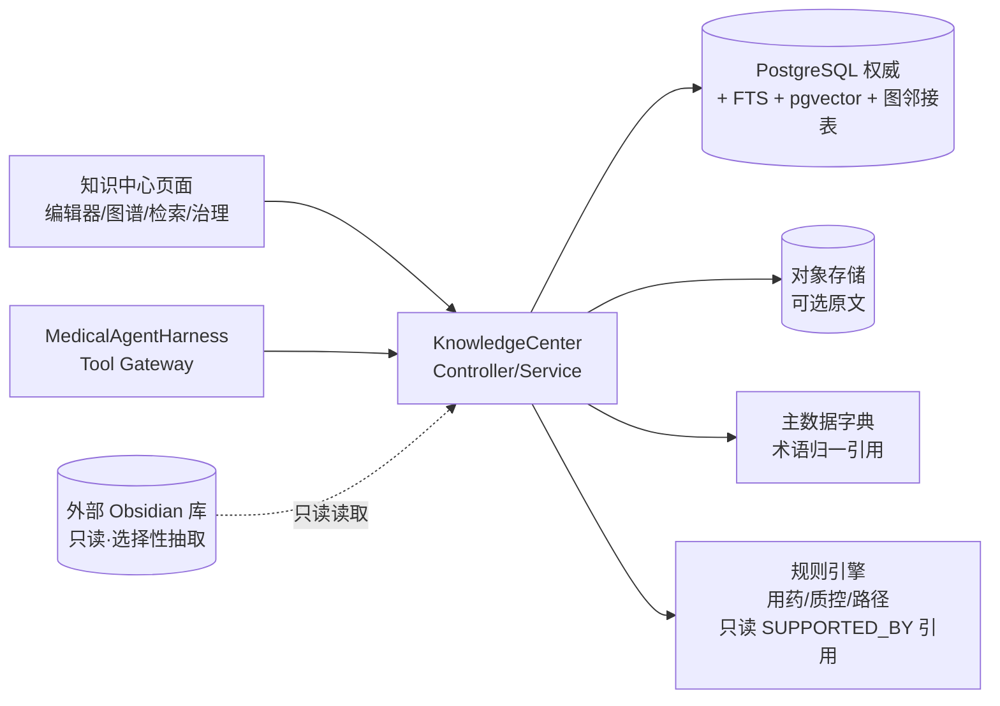

# openemr2026 知识中心 HLD

> - 文档版本：v0.3
> - 日期：2026-09-03（Asia/Shanghai）
> - 文档状态：`CREATED`，待联合评审
> - 需求输入：[知识中心 PRD](../product/prd/2026-09-03-openemr2026-knowledge-center-prd.md)、v1.0 PRD FR-056
> - 上位架构：[openemr2026 HLD](./2026-08-14-openemr2026-hld.md)、[LLD-DATA](./2026-08-14-openemr2026-lld-data.md)、[Medical Agent Harness LLD](./2026-08-25-openemr2026-medical-agent-harness-lld.md)

## 0. 执行摘要与复杂度分级

- **复杂度分级：`STANDARD`**。依据：知识中心是在既有 Spring Boot 单体内新增一个模块，复用现有 PostgreSQL（权威）、Flyway、Outbox、对象存储、Agent Harness；不引入微服务/K8s/独立搜索集群/图数据库。只有容量证据（FTS/向量/图压测不达标）才外置 Search/Vector/Graph（延续 HLD §7.1）。
- **核心结论**：不集成 Obsidian 本体（专有闭源、Electron 本地架构，与「服务端权威 + Vue3 Web 单体」不匹配），采纳其**信息组织范式**（双链、图谱、反链、标签、版本化），用 MIT 开源组件自建；检索复用 PostgreSQL FTS + pgvector；术语引用主数据；Agent 通过 Harness Tool Gateway 以受控 Tool 消费知识。
- **外部知识源**：首批知识图谱与知识详情来自本地 Obsidian 库（见 §2.1），**只读接入、选择性抽取有用数据、不修改原始数据**，排除七巧板/HiTA 等第三方授权资源（ADR-8/ADR-9）。

## 1. 事实与状态

| ID | 类型 | 结论 |
|---|---|---|
| FACT-001 | `OBSERVED` | 平台中心现有 data-center/ai-center，无知识中心；`ClinicalShell.vue` 导航 + `router.ts` 单路由注册。 |
| FACT-002 | `OBSERVED` | LLD-DATA §4.4/§5/§9 已设计知识文档/Chunk/图 Schema、混合检索、SRC-KNOWLEDGE 契约；但无对应数据库迁移。 |
| FACT-003 | `OBSERVED` | HLD §7.1 已选型「PostgreSQL FTS + pgvector 按需 + 图按需」。 |
| FACT-004 | `OBSERVED` | Agent Harness 已有 Tool Gateway、RunScope、Tool 风险分级（T0/T1/T2/T3）、不可变 Release。 |
| FACT-005 | `OBSERVED` | 用药安全/质控/路径为确定性规则引擎；主数据字典独立于知识中心。 |
| FACT-006 | `OBSERVED` | 知识图谱来源 = 本地 Obsidian 库 `医学知识库/医学结构化数据/图谱详情`：11 实体分类 × 7 系统 × ~459 表 × ~800 万行，只读接入、选择性抽取；排除七巧板术语集/HiTA 资源。 |

## 2. 系统上下文与边界

- **范围内**：知识内容层（文档→版本→块→概念/关系→引用）+ 检索读模型 + 治理 + 外部源只读选择性导入 + Agent Tool。
- **范围外（不迁移）**：确定性规则引擎/状态机、AI 资产目录（模型/Prompt/Agent/Skill/Tool）、主数据字典本体。
- **信任边界**：知识文档按不可信内容处理，不能贡献 System/Developer 指令；`RESTRICTED` 敏感级数据层硬门；召回后二次授权。

### 2.1 外部知识源（只读 · 选择性）

| 项 | 值 |
|---|---|
| 路径 | `/Users/liuhaoxian/Downloads/我的/Obsidian/医学知识库` |
| 规模 | 12GB；2949 个 Markdown；7467 个文件 |
| 图谱位置 | `医学结构化数据/图谱详情`：11 实体分类 × 7 系统 × ~459 表 × ~800 万行 |
| 实体分类 | 疾病、症状、药品、检验检查、临床路径、医保目录、科室机构、系统字典、编号表、其他、问诊题库 |
| 系统 | alpha-base、alpha-online、dz-base、exame-check、smart-one、ys-base、ys-online |
| 详情页格式 | Markdown：YAML frontmatter（分类/系统/表名/数据行数/字段数）+ `[[]]` 双链 + 字段表头表格 |
| 全量数据格式 | 制表符分隔、双引号包裹字段，首行表头 |
| 知识详情位置 | `知识详情/`：14 个领域（医保用药规则、医保诊疗项目规则、质控规则、医学术语集、知识图谱与临床路径、药品目录、诊疗项目/价格、疾病/诊断编码、手术编码、检验项目、医学术语与中医标准、医用耗材、考试科普等） |
| 接入约束 | **只读 + 选择性抽取**：只读源文件、只抽取选择矩阵内的有用数据、写本库副本、禁止写回源库；逐文件 `source_path + source_content_hash` 溯源 |
| 明确排除 | 七巧板医学术语集、HiTA 资源等第三方授权/非临床有用内容（选择矩阵白名单硬门） |

## 3. 组件视图

| 层 | 组件 | 责任 | 技术 |
|---|---|---|---|
| 前端 | 知识中心页面族 | 总览、条目编辑、反链、图谱、检索、治理 | Vue 3 + CodeMirror6/TipTap + Cytoscape.js/AntV G6 |
| 后端 | `knowledge` 包 | Controller/Service/Exception/Handler，遵循既有切片模式 | Spring Boot |
| 导入 | `knowledge_import` | 只读读取外部源、按选择矩阵抽取、解析、生成 manifest、写本库副本 | 文件系统只读 + 哈希 + 白名单 |
| 存储 | 权威库 + 派生索引 | 事实源 + FTS/向量/图读模型 | PostgreSQL + pgvector |
| 集成 | 术语引用、规则依据、Agent Tool | 归一、SUPPORTED_BY、受控检索 | 主数据 API、Tool Gateway |
| 治理 | Release 注册表 | 不可变版本、许可、发布/回退 | 复用 Prompt/Agent release 模式 |

## 4. ADR

| ADR | 决策 | 备选 | 不选原因 |
|---|---|---|---|
| ADR-1 | 不集成 Obsidian 本体，采纳其范式 + MIT 组件自建 | 直接集成 Obsidian；集成 AGPL 类笔记（Trilium/SiYuan/AppFlowy） | 专有闭源/Electron 架构不匹配；AGPL 传染 + 完整产品非库 |
| ADR-2 | 检索用 PostgreSQL FTS + pgvector | OpenSearch + 独立向量库 | 单体默认简单；只有容量证据才外置（HLD §7.1） |
| ADR-3 | 图用 PostgreSQL 邻接表 + depth≤2 递归 | Neo4j/等价图库 | 无容量证据前不引入；禁开放遍历 |
| ADR-4 | 术语/本体引用主数据字典 | 知识中心自建本体 | 避免重复；用户已确认 |
| ADR-5 | 知识版本化 Release，检索只命中 ACTIVE | 直接改文档 | 不可追溯/回退；延续 FR-056 |
| ADR-6 | 规则依据与规则引擎分离（SUPPORTED_BY） | 迁移规则进知识中心 | 破坏已通过门禁的确定性闭环 |
| ADR-7 | 不引入 LangChain/LlamaIndex | 重型 RAG 框架 | 医疗生产需完全控制授权/版本/数据驻留/注入 |
| ADR-8 | 外部知识源只读接入（Obsidian 库），导入写本库副本、禁止写回源库 | 原地编辑源库 | 用户要求不动原始数据；保留溯源与可重建 |
| ADR-9 | 外部源选择性抽取，排除七巧板/HiTA 等第三方授权资源 | 全量照搬 | 开源项目避免混入授权术语集；只保留临床有用数据 |

## 5. 数据模型概览（逻辑，字段级交 S005-1）

| 逻辑对象 | 关键字段 | 说明 |
|---|---|---|
| `knowledge_import_batch` | batch_id, source_root, source_manifest_hash, selection_matrix_version, mode(READ_ONLY), imported_at, operator | 导入批次，记录源库只读读取与选择矩阵版本 |
| `knowledge_source_file` | file_id, batch_id, source_path, source_content_hash, entity_category, system, table_name, included(boolean) | 源文件溯源；included 记录是否被选择矩阵纳入 |
| `knowledge_document` | doc_id, tenant, content_type(GUIDELINE/DRUG_LEAFLET/PATHWAY/QC_BASIS/GRAPH_ENTITY/...), source_authority, license, classification | 文档登记 |
| `knowledge_document_version` | doc_version_id, doc_id, version, content_hash, effective_period, approval_status, row_version | 不可变版本，`APPROVED/ACTIVE/RETIRED` |
| `knowledge_chunk` | chunk_id, doc_version_id, section_path, text, token_count, clinical_tags, embedding vector(pgvector), embedding_model/version, content_hash, source_locator | 分块+向量，标题感知切分 |
| `knowledge_concept` | concept_ref, source_type(DICTIONARY/EXTRACTED), source_id, system, code, display | 术语节点，优先引用主数据 |
| `knowledge_relation` | edge_id, from_node, to_node, rel_type(MAPS_TO/MENTIONS/SUPPORTED_BY/CONSTRAINS), version | 图邻接表，depth≤2 |
| `knowledge_source_registry` | source_id, owner, purpose, license/allowed_use, sensitivity, update_frequency, checksum, status | SRC-KNOWLEDGE 登记 |
| `knowledge_retrieval_log` | log_id, use_case, query_hash, version_ref, result_hash, actor, watermark | 命中日志，最小化 |
| `knowledge_feedback` | feedback_id, use_case, version_ref, source_ref, disposition, actor | 反馈闭环 |

- 图谱实体（疾病/症状/药品/检验检查/临床路径/医保目录/科室机构/系统字典/编号表）经只读选择性导入后落为 `knowledge_document`（按表）+ `knowledge_concept`（实体）+ `knowledge_relation`（关系）；`[[]]` 双链解析为关系边，TXT 编码字段（疾病编码/症状编码/药品编码）解析为实体间关系。
- Chunk 稳定 ID = `doc_id + document_version + section_path + normalized_content_hash`（LLD-DATA §9.4）。删除传播覆盖 FTS/向量/图/缓存，每个消费者写完成水位。

## 6. 关键流程

1. **导入（只读 + 选择性）**：按选择矩阵白名单读取外部 Obsidian 库有用数据（Markdown YAML+`[[]]` 双链 + 制表符 TXT），跳过七巧板/HiTA 等排除项 → 生成 source manifest（逐文件 content hash）→ 来源登记 → RAW_FREEZE → PARSE → 分块/建图 → embedding → 评审 → 发布；**不写回源库**，源变更以重新导入生成新版本。
2. **检索**：授权范围/用途/水位 → 意图路由+术语归一 → Dense/BM25/Exact/Graph/SQL 多路 → RRF 融合 → 重排 → 权限二次校验+版本/过期校验 → 上下文截断 → `ContextReference`。
3. **Agent 联动**：`RunScope` 锁定知识 release → `knowledge_*` Tool → 结果注入 C4 Evidence 层（不可信内容，不进 System Prompt）→ `ai_trajectory_event` 记录工具调用/版本/引用。
4. **回退/删除**：版本回退仅改命中路由；删除传播按 `事实引用→FTS→向量→图→缓存→导出副本` 顺序，幂等可重放。

## 7. 接口与契约

### 7.1 REST API（类别）

| 资源 | 动作 | 说明 |
|---|---|---|
| `/knowledge-documents` | CRUD + submit/release/retire/rollback | 文档与版本治理 |
| `/knowledge-chunks` | search（混合检索） | 返回 `ContextReference[]` |
| `/knowledge-relations` | list/traverse（depth≤2） | 图谱 |
| `/knowledge-sources` | register/list | SRC-KNOWLEDGE |
| `/knowledge-imports` | create/list/manifest | 外部源只读选择性导入批次 |
| `/knowledge-feedback` | create/list | 反馈闭环 |

### 7.2 Agent Tool 契约（继承 Harness 风险分级，T0 只读）

| Tool | 输入 | 输出 | 约束 |
|---|---|---|---|
| `knowledge_search` | query, filters, purpose | `ContextReference[]`（混合检索） | patientBound 可选；服务端二次鉴权 |
| `knowledge_lookup` | concept/term/drug/code | canonical 条目 | 精确，不向量猜测 |
| `knowledge_graph` | node_ref | 邻接节点（depth≤2） | 禁开放遍历 |

Tool 响应统一 canonical JSON：`{status, data, sourceRefs, warnings, error, resultHash}`；引用必须含 `source_type/source_id/version/locator/content_hash/authorization_watermark`。

## 8. NFR / SLO / 容量

| 项 | 目标 | 状态 |
|---|---|---|
| 检索延迟 p95 | 交互级，`待基线化` | CREATED |
| 派生索引重建 | 100% 可重建 | CREATED |
| 越权引用 | 0 | CREATED |
| 删除传播 | 幂等可重放 + 完成水位 | CREATED |
| 外部源只读 + 选择性 | 源文件零写回、白名单内导入、排除项不落库 | CREATED |
| 容量 | S/M 档 PostgreSQL FTS + pgvector；1.5× 压测不达标才外置 | CREATED |

## 9. 风险与迁移路线

- **风险**：RESTRICTED 泄露（数据层硬门）；幽灵引用（完成水位）；重排阈值写死（评测基线）；注入（知识文档不可信处理）；外部源混入第三方授权资源（导入白名单硬门，排除七巧板/HiTA）。
- **迁移路线**（新增模块，无存量数据迁移；只读选择性导入 + 回填依据引用）：
  1. Phase 0：`knowledge` 后端包 + 迁移 + 来源登记 + 外部源只读选择性导入（选择矩阵 + 排除七巧板/HiTA）+ 文档/版本/块 + 治理。
  2. Phase 1：混合检索（FTS+pgvector+图）+ `ContextReference` + 前端页面族。
  3. Phase 2：双向链接/反链 + 图谱视图 + 术语引用。
  4. Phase 3：Agent Tool 接入 Harness + RunScope 知识版本锁定 + 反馈闭环 + Evals。
  5. 回填：从用药安全/质控/路径建立 SUPPORTED_BY 引用（只读，不改规则引擎）。

## 10. S005 输入契约

| 分支 | 输入 | 并行关系 |
|---|---|---|
| S005-1 lld-data | 逻辑数据模型、外部源选择矩阵（抽取/排除白名单）、外部源解析与溯源、分块策略、检索路由、删除传播 | 先做，是 S005-2/3 前置 |
| S005-2 lld-back | REST API 契约、错误模型、幂等/并发 | 依赖 S005-1 字段契约 |
| S005-3 lld-agent | Tool 契约、RunScope 扩展、Eval 集 | 依赖 S005-1 检索契约 + harness LLD |
| S005-4 lld-front | 页面族、组件、状态机、编辑器/图谱集成 | 依赖 PRD 原型 + UI 资产 |
| S010 safety | 威胁建模（RESTRICTED、注入、越权、外部源只读/白名单、删除传播） | HLD 起可并行 |

> 交付后由 `haonan-s006-review` 做 DESIGN_REVIEW 检查跨契约一致性。

## 11. 安全威胁模型（S010，轻量）

| 威胁 | 攻击面 | 对策 | 状态 |
|---|---|---|---|
| 跨租户知识泄露 | 所有 `knowledge_*` 查询 | 服务层统一 `identity.tenantId()` + `tenant_id = :tenant` 过滤（源码 19/20/5 处租户过滤） | 已实现 |
| 外部源被写回 | `knowledge_import` 文件扫描 | 仅 `Files.readAllBytes/readString` 只读；测试断言源文件字节不变 | 已实现 + 测试验证 |
| 第三方授权内容混入 | 选择矩阵 | 排除七巧板/HiTA/考试科普/206_ 白名单硬门（`EXCLUDED_PATH_MARKERS`） | 已实现 + 测试验证 |
| Prompt 注入 | 知识正文进入模型上下文 | 检索结果仅经 `knowledge_search` 返回、注入 C4 Evidence 层；网关工具只返回元数据（title/version/hash），不返回正文进 Prompt | 已实现 |
| 越权检索 RESTRICTED 知识 | `knowledge_chunk` 检索 | 首版分类分级为 INTERNAL；RESTRICTED 数据层硬门待接分类分级联动 | 待 S010 深化 |
| SQL 注入 | 检索 `:like` 参数 | 全部参数化绑定（`:like`/`:type`），无字符串拼接 SQL | 已实现 |
| 未评审/过期知识强提示 | 版本状态 | 检索仅 `v.status = 'ACTIVE'`；发布/回退状态机 + 不可变触发器 | 已实现 |

红队静态检查 `security/check-red-team.mjs` 已 PASS（18 payload / 15 面）。
