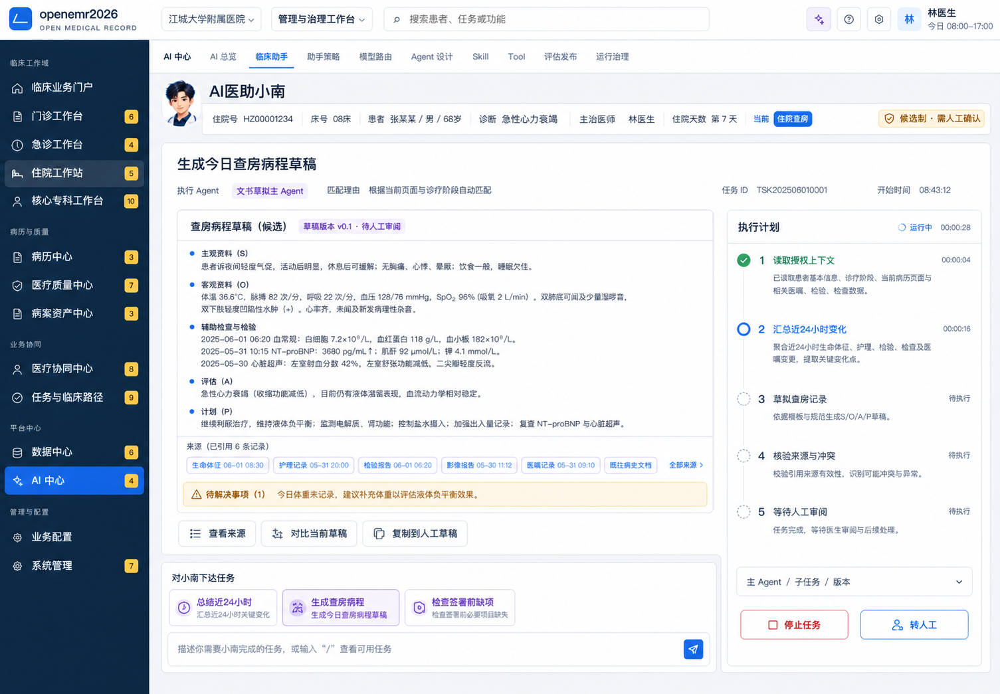
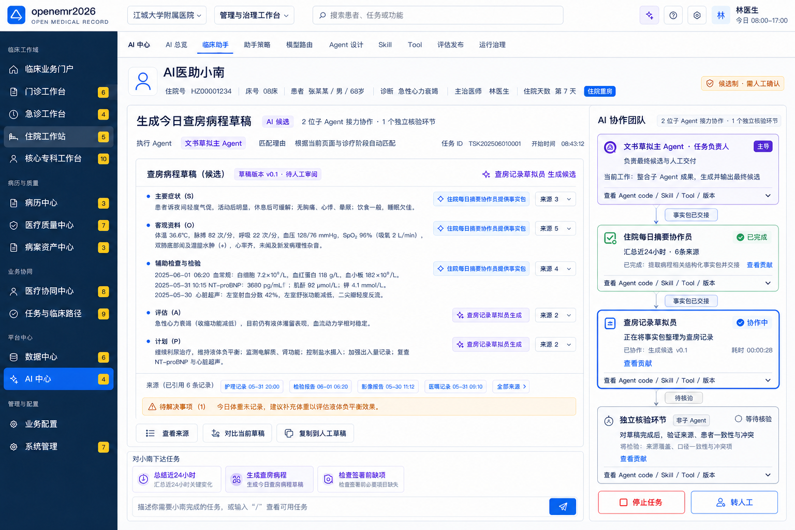
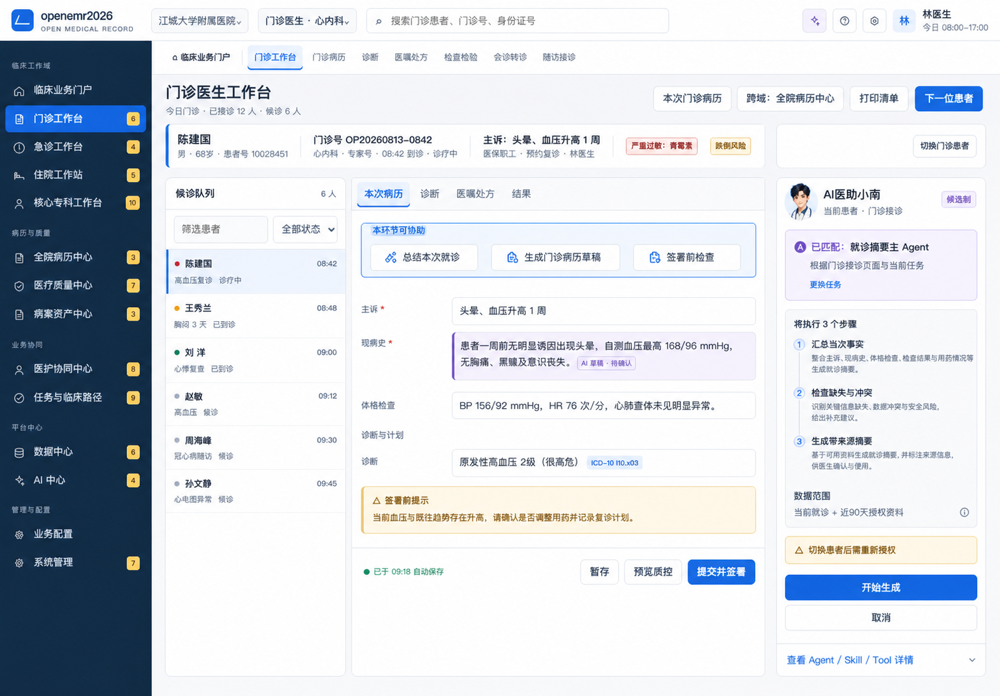
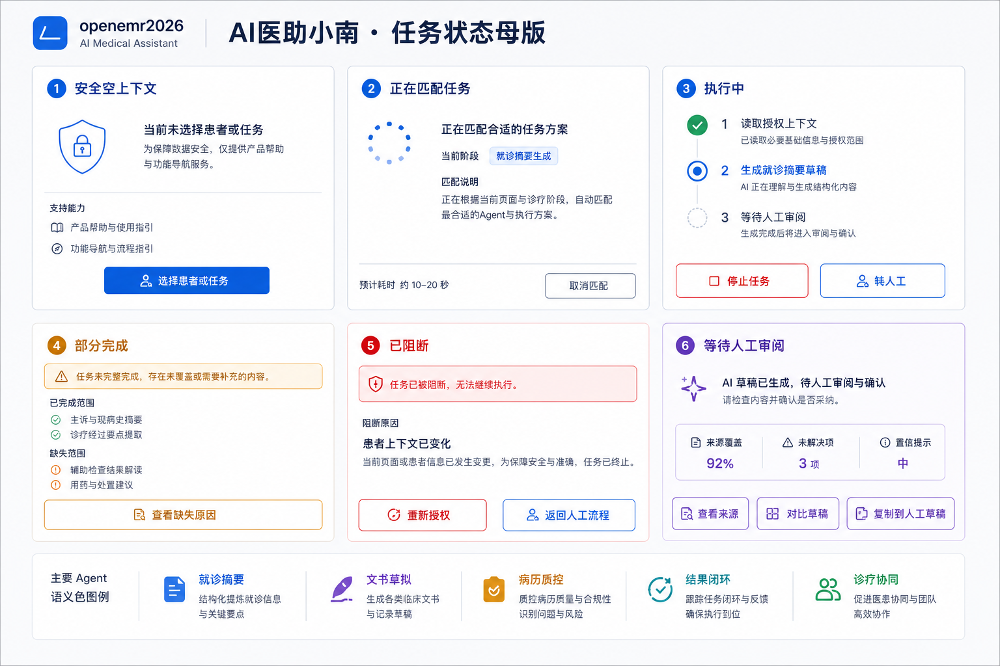

# AI 医助小南 v2 UI 设计交付

> - 模式：`DESIGN`
> - 状态：`CREATED`
> - 日期：2026-08-25
> - 目标端：openemr2026 桌面 Web
> - 代码授权：未授权，本交付未修改前端代码
> - 视觉方向：继承已批准的 A「临床可信蓝」

## 1. 设计结论

AI 医助小南从“通用聊天框 + 手工选择 Agent”调整为“诊疗任务入口 + 自动路由 + 可控执行 + 来源审阅”：

1. 用户选择“总结本次就诊、生成病历草稿、签署前检查”等任务，不直接选择技术 Agent。
2. 系统展示匹配到的唯一主 Agent、匹配原因、数据范围和执行计划，用户可更换任务或退出。
3. 子 Agent 显示为有名称、有职责、有贡献的协作者；code、版本、Skill、Tool 在技术详情中折叠。
4. 流程内默认使用非模态右侧面板，长任务进入完整工作台；高风险动作进入独立审批页。
5. 结果以“候选 + 来源 + 缺失范围 + 人工动作”交付，不提供自动签署、自动处方或自动执行入口。

## 2. 覆盖

| 项目 | 数量 | 状态 |
|---|---:|---|
| 设计屏幕/组件面 | 20 | `CREATED` |
| 主 Agent | 5 | `CREATED` |
| P0 候选子 Agent 用户角色 | 33 | `CREATED` |
| 诊疗流程嵌入环节 | 14 | `CREATED` |
| 任务状态 | 15 | `CREATED` |
| 生图栅格资产 | 5 | `VERIFIED` 文件存在 |
| 前端实现/浏览器视觉验证 | 0 | `BLOCKED`，需用户明确授权 IMPLEMENT |

## 3. 交付导航

- [范围、假设与待决问题](./assumptions-and-open-questions.md)
- [屏幕设计映射](./screen-design-map.csv)
- [流程嵌入与交互设计](./workflow-integration.md)
- [33 个子 Agent 协作体验设计](./child-agent-experience.md)
- [设计系统增量](./design-system.md)
- [设计 Token](./tokens.json)
- [状态矩阵](./states/state-matrix.md)
- [视觉审计](./ui-audit.md)
- [资产清单](./asset-manifest.csv)
- [页面资产映射](./page-asset-map.csv)
- [生图追溯](./image-generation-manifest.csv)

## 4. 核心视觉母版

### 完整任务工作台

### 子 Agent 协作任务工作台

### 诊疗流程内右侧面板

### 任务状态母版

这些 PNG 是视觉方向与布局母版；可见示例内容为合成演示，不是后端契约或临床事实。精确中文、字段、状态和行为以 Markdown、CSV、JSON 规格为准。
