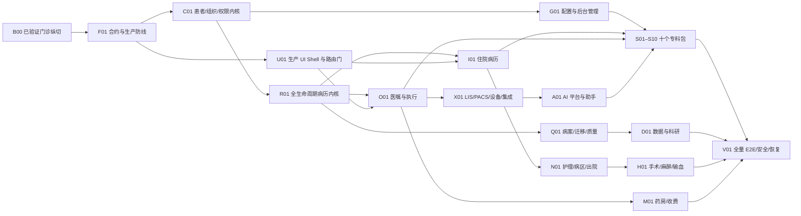

# openemr2026 v1.0 完整实施 Backlog 与依赖 DAG

> S007 模式：`BACKLOG`  
> 状态：`IN_PROGRESS`，只把具有代码、API/契约和自动化证据的纵向切片标为已验证，不把 PRD、原型或静态 UI 页面计为已实现。  
> 目标：把 PRD v0.15 的 FR-001–138、194 个目标路由、S006 DR-002–008 转成可由 `$haonan-s008-coder` 逐项实施、由 S009/S010 逐批关闭的施工单。

## 0. 范围、现状与硬门禁

- 已验证基线：`docs/archive/opencode-tasks.md` 的门诊病历保存、确定性质控、假模型 AI 候选、人工接受、签署、审计/Outbox 事务记录与隔离恢复核心纵切。
- 未完成事实：住院已有入院/床位/病区清单、规则化文书任务、统一临床事件触发、顺序多级审签与退回重写、转科转床、出院首切及作者/主治/主任/病案四角色浏览器 E2E；医嘱执行深化、护理、急诊、LIS/PACS、收费药房、手麻血、病案迁移、配置管理、科研数据、10 专科包和其余 98 个规划路由生产 Web 仍需编码。
- 强制输入：PRD v0.15、HLD、四类 LLD、TRB、`docs/design/ui-delivery/route-design-map.csv`、目标路由截图和当前源代码。
- 架构门禁（2026-08-20）：S004 HLD 和 S005-1/2/3/4 已按既有 FR/AC/SCR、S01–S10 及本 Backlog 收口，S006 已给出有条件工程批准；产品前端已完成 U01-V1–V5 Vue 3 单栈迁移与本机门禁，后续 S008 仍须逐项经过 S009/S010，不因路由已注册而宣称业务已实现。
- 数据门禁：只使用 `samples/data/` 合成患者；任何真实医院连接、真实患者数据导入和生产发布都需用户另行授权。
- 契约门禁：公共 API/事件/Schema 先改 `contracts/openapi.json` 和迁移，再生成 Java/TS 制品；禁止前后端各写一份枚举。
- 质量门禁：每个任务必须提供数据库约束、服务测试、前端状态测试、受影响路由浏览器测试、审计/恢复证据；涉及 AI 还需 eval 与红队。
- 发布门禁：`commit`、`push`、生产部署、数据库迁移和外部审核是不同动作。本 Backlog 只授权本机代码、测试和合成部署。

## 1. DAG 与执行批次

| task_id | 标题 | FR | depends_on | parallel_group | 风险 | 状态 |
|---|---|---|---|---|---|---|
| B00 | 首个门诊病历与 AI 质控纵切 | 009–010、016、032、036、128 部分 | - | BASE | 高 | VERIFIED_BASELINE |
| F01 | 公共契约、Outbox Worker 与生产配置防线 | 017、023、025–028、053、057–058 | B00 | P1 | 极高 | IN_PROGRESS；Outbox、F01-C1、F01-C2 LOCAL_VERIFIED，OIDC 资源服务器由 C01-I1 本机验证，其他真实适配器仍待实现 |
| C01 | 组织、用户、患者主索引、权限与紧急访问 | 001–007、015、097、109–113 | F01 | P2A | 极高 | LOCAL_VERIFIED；C01-I1/O1/A1/P1/T1/E1 全部本机验证，FR-006 就诊全状态机收口 |
| U01 | 生产 UI Shell、唯一导航与 194 路由自动门禁 | 088、095、098、120、127 | F01 | P2B | 高 | LOCAL_VERIFIED；U01-V1–V5 VERIFIED，远端 CI 首跑待确认 |
| R01 | 病历模板、编辑、签署、更正、来源、版本和导出 | 008–012、016–018、053、060–061、098–101 | C01,U01 | P3 | 极高 | LOCAL_VERIFIED；R01-T1–T5 全部完成本机代码、API、自动化和浏览器验收；真实 CA/对象存储/医院适配器仍属发布门禁 |
| I01 | 住院医生工作站与住院文书闭环 | 021–022、082–087、090 | R01 | P4A | 极高 | LOCAL_VERIFIED；入院/床位/病区清单/时限任务、四角色审签及总览/病程/版本/结果/会诊/临床路径/出院深页均完成；真实浏览器新入院→成功出院事务链通过 |
| O01 | 诊断、医嘱、处方、执行与结果任务内核 | 012–014、034–035、095 | R01 | P4B | 极高 | IN_PROGRESS；诊断/医嘱/结果/用药硬规则（过敏、重复、剂量、药物相互作用、受限药品授权）、来源驱动统一任务与统一任务通知投递恢复首切 VERIFIED |
| E01 | 门急诊预约、挂号、分诊、留观与急诊病历 | 019–020、039、089、091、128 | R01,U01 | P4C | 高 | IN_PROGRESS；班次号源/预约/挂号/退号（号源不超卖）、候诊/叫号、报到生成就诊、接诊推进、急诊分级、急诊留观、急诊抢救、急诊护理、先救治后补登与门急诊域间显式切换首切 VERIFIED |
| N01 | 护理、病区、床位、给药、交班与出院 | 021–022、042、050、087、090、096 | I01,O01 | P5A | 极高 | IN_PROGRESS；护理体征记录、护理计划、床旁给药五对核验、交接班、患者级交接清单、出院护理闭环（活动护理计划/未闭环给药/未完交接三项硬门）、移动床旁离线草稿与转区任务迁移首切 VERIFIED |
| X01 | LIS、PACS、病理、设备与集成消息闭环 | 023、043–044、048、059、102–104、126 | O01 | P5B | 极高 | IN_PROGRESS；检验标本与影像检查预约闭环首切 VERIFIED |
| M01 | 门住院药房、价格、收费与结算 | 040–042 | O01 | P5C | 极高 | IN_PROGRESS；价格版本与收费明细/冲正、药房发药双人核验首切 VERIFIED |
| H01 | 治疗、手术、麻醉、监护与输血 | 045–049 | I01,O01 | P5D | 极高 | IN_PROGRESS；输血双人核验与输注反应、手术安全核查首切 VERIFIED |
| W01 | 会诊、转诊、临床路径、院感和不良事件 | 051–052、092 | I01,O01 | P5E | 高 | IN_PROGRESS；会诊/临床路径已在 I01，不良事件、院感监测线索与转诊摘要首切 VERIFIED |
| G01 | 配置平台、字典主数据与后台管理 | 024、062–069、093、108–119 | C01,U01 | P4D | 极高 | IN_PROGRESS；字典主数据与能力包首切 VERIFIED |
| A01 | 临床知识、模型、Agent、Skill、Tool 与受控运行平台 | 030–037、056、070–081 | F01,C01,O01 | P6A | 极高 | IN_PROGRESS；模型目录、Prompt release、Agent/Skill/Tool 目录、模型评估、运行预算与 Agent 依赖解析首切 VERIFIED |
| A02 | 全局 AI 助手、主动提醒、听写与动作审批 | 060、120–124 | A01,R01,U01 | P7A | 极高 | IN_PROGRESS；主动提醒、听写与动作审批首切 VERIFIED |
| Q01 | 病案资产、历史迁移、数据质量和评级取证 | 038、054–055、061、094、105、125 | R01,X01 | P6B | 极高 | IN_PROGRESS；FR-125 内核、数据质量规则、数据质量评估执行、病案资产编目/借阅闭环与历史迁移批次首切 VERIFIED |
| D01 | 数据中心、队列统计、科研数据集与开源指标 | 029、054–055、106–107 | Q01,G01 | P7B | 高 | IN_PROGRESS；科研数据集申请、研究队列、队列成员快照与开源指标快照首切 VERIFIED |
| S01–S10 | 十个核心专科能力包 | 129–138 | G01,I01,O01,X01,A01 | P8 | 极高 | IN_PROGRESS；S01–S10 十个专科 record 层首切全部 VERIFIED（其余六层待办） |
| V01 | 全路由 E2E、临床安全、恢复与合成发行门禁 | 全部 | 上述全部 | FINAL | 极高 | PLANNED |

关键路径：`F01 → C01/U01 → R01 → I01/O01 → N01/X01 → A01/G01 → S01–S10 → V01`。

## 2. 逐任务施工单

### F01 公共契约、Outbox Worker 与生产配置防线

- 目标价值：让后续所有业务切片共享真实、可恢复、默认拒绝的生产骨架。
- 来源：S006 DR-004/005/008，TRB ACT-001/004/006/007。
- 输入上下文：`contracts/`、LLD-BACK 4–7、LLD-DATA 4/7、`application-prod.yml`、安全评估。
- 允许修改：`contracts/`、`src/main` 基础设施适配器、迁移、部署配置、对应测试；禁止实现新的临床页面。
- 实施动作：补齐统一错误字典和事件 envelope；实现 Outbox claim/fencing/重试/死信/对账；实现 secret-ref、OIDC、CA、KMS、对象存储和集成必需配置的 fail-closed 校验；加入幂等与审计公共测试夹具。
- 迁移/兼容：仅增加式迁移；旧 0.1 合成 profile 保留且强提示不可生产。
- 测试与安全：Worker kill、重复投递、迟到回调、配置缺失、秘密泄漏扫描、恢复重放。
- 回滚：先停 Worker，再回滚应用；不删除已写 Outbox/审计记录。
- DoD：Outbox 重启后恰好一次业务效果；prod 缺任一 P0 secret-ref 无法启动；根验证新增故障用例全绿。
- 2026-08-20 实施证据：V5 已实现 `SKIP LOCKED` 有序领取、租约/fencing、同库消费者事务回执、退避/死信、带原因与操作者的重放审计、积压对账；F01-C1 已完成机器契约；F01-C2 已完成 prod 配置与 secret-ref 启动门禁；C01-I1 已接入生产 OAuth2 Resource Server 与本地账户/角色任期映射。真实医院 IdP/JWK 联调、CA/时间戳、KMS 加解密、对象存储和医院连接器适配仍未完成，因此 F01 保持 `IN_PROGRESS`。

#### F01-C1 全量机器契约生成与漂移门禁

- 来源：DR-010、ACT-001/011；当前状态 `VERIFIED`，U01-V1/A01 的机器契约硬依赖已解除。
- 输入：LLD-DATA 9、LLD-BACK 10、LLD-AGENT 9、LLD-FRONT 9、`contracts/openapi.json`、数据库迁移、两个路由 CSV。
- 允许修改：`contracts/`、契约生成脚本、`web/src/generated/`、Java generated DTO/合约测试；禁止用生成脚本直接覆盖手写领域实现。
- 实施：生成 field dictionary、OpenAPI/AsyncAPI index、error catalog、Agent/Tool registry、`route-contract.generated.json`；统一版本/兼容策略；CI 重生成后 `diff --exit-code`。
- 验证：producer/consumer contract、snake_case codec、SSE 乱序/未知版本、DB enum/OpenAPI/Java/TS 集合对等；不得仅比文件存在。
- 安全/回滚：生成制品不含示例 PHI/密钥；回滚恢复上一个契约版本，已发布字段/事件只做兼容增加，不重用旧语义。
- DoD：五类制品可确定性重生成，各消费端无手写重复枚举，契约漂移在 CI 可阻断。
- 2026-08-20 实施证据：`contracts/governance.source.json` 成为治理源，生成 702 个物理字段、62 个 API operation、16 个稳定错误、2 个事件、4 个 Agent、5 个 Tool 和 194 条路由契约；`npm --prefix contracts test` 3/3、`npm --prefix contracts run check` 91 个输出无漂移，根 `scripts/verify.sh` 全绿。生成任务已绑定 migration、OpenAPI、traceability 与 route map 输入并进入现有 CI。运行时 SSE 断点续传/乱序恢复属于 A01/U01 消费端任务，不在本子任务伪造完成。

#### F01-C2 生产配置与 Secret Reference 失败关闭门禁

- 来源：DR-004/008、F01 DoD；当前状态 `LOCAL_VERIFIED`。
- 实施：Spring Boot 4.1 `EnvironmentPostProcessor` 在应用上下文和 Web Server 创建前校验 prod；禁止 `prod + dev-synthetic`；强制数据库、OIDC/MFA、CA/时间戳、KMS、对象存储锁定、集成证书和数据驻留配置。AI 默认关闭，启用时额外强制 HTTPS 模型端点、模型 ID、API key 引用和本地/境内驻留策略。
- Secret Reference：只接受 `env://变量名` 与 `file:///绝对挂载路径`；环境目标必须存在，文件必须可读且大小为 1–65536 字节；错误只报告属性和原因，不输出引用目标的秘密值。生产样例位于 `deploy/production.env.example`。
- 测试：11 个配置测试覆盖 Boot 工厂注册、非生产隔离、缺项聚合拒绝、合成 profile 冲突、HTTP/明文秘密拒绝、环境引用缺失、文件挂载、AI 启停、完整配置以及资源服务器 issuer/audience 防漂移；实际 `bootRun --spring.profiles.active=prod` 缺配置在上下文创建前退出 1。当前全量 58 个 Java 测试、秘密扫描与根 `scripts/verify.sh` 通过。
- 边界：本批只关闭“配置不完整仍启动”的风险，不声称真实 OIDC、CA、KMS、对象存储或医院集成适配器已联调；这些分别进入 C01、R01/X01 和 S010/S011。
- 回滚：移除 Boot 工厂注册即可恢复旧行为，但会重新开放不完整 prod 配置风险；不得作为生产回滚方案。配置字段仅增加，不涉及数据库迁移和临床事实回滚。

### C01 组织、用户、患者主索引、权限与紧急访问

- 目标价值：为不同规模医院提供统一多机构、多岗位和患者身份底座。
- 来源：FR-001–007、015、097、109–113；S006 DR-005/008。
- 输入上下文：PRD 对应 AC、LLD-DATA 主数据、LLD-BACK 命令八道门、管理/患者 UI 截图。
- 允许修改：organization/identity/patient/security/admin 模块、迁移、相关 Web 路由。
- 实施动作：组织/科室/病区/床位有效期；人员与账户分离；角色任期与 ABAC；患者候选匹配、合并/撤销；紧急访问时限/原因/复核；OIDC principal 映射。
- 测试与安全：跨租户、错患者、角色到期、合并冲突、紧急越权超范围；所有拒绝不泄露资源存在。
- 回滚：组织/患者更正使用补偿记录，禁止物理删除历史身份。
- DoD：相关 AC 自动测试通过；`admin-*`、`patient-*`、`emergency-access` 生产路由使用真实 API，无业务 Mock。

#### C01 2026-08-20 基线审计与实施顺序

- 已有事实：V1 已有 tenant/organization/facility/app_user/role_assignment/patient/patient_identifier/encounter 及复合租户外键；ContextLease 已验证活动角色、机构、患者和就诊范围；患者搜索/创建和就诊创建具备合成 API、幂等记录、审计与 Outbox。
- 已完成事实：生产 OIDC JWT/principal 映射已失败关闭；person/account/role/workforce/credential 已分离；机构→院区→科室→病区→床位有效期层级已建立；ABAC、患者关系、动态撤权和紧急访问纵切已本机验证。
- 未完成事实：缺少患者候选/合并/撤销/纠错和跨域临床时间线；患者重复标识目前主要依赖数据库唯一约束，尚无可恢复业务流程。

| subtask_id | 范围 | depends_on | 状态 |
|---|---|---|---|
| C01-I1 | 生产 OIDC JWT、issuer/audience、principal→账户/角色任期映射和撤权失败关闭 | F01-C2 | LOCAL_VERIFIED |
| C01-O1 | 机构、科室、病区、床位有效层级与人员/账户分离 | C01-I1 | LOCAL_VERIFIED |
| C01-A1 | 主体—资源—动作—范围—条件授权、患者关系和紧急访问 | C01-I1,C01-O1 | LOCAL_VERIFIED |
| C01-P1 | MPI 候选匹配、待核身份、双人合并、撤销和纠错 | C01-A1 | LOCAL_VERIFIED |
| C01-T1 | 授权患者时间线与部分源失败恢复 | C01-P1,R01/O01/I01 | LOCAL_VERIFIED |
| C01-E1 | 就诊完整状态机与不可变状态事件 | C01-T1,I01 | LOCAL_VERIFIED |

- C01-I1 实施证据：生产 API 除 readiness 外全部由 Spring OAuth2 Resource Server 保护；issuer/audience 与生产门禁值强制一致；验签后的 `sub + tenant_id + acr` 映射活动账户和数据库当前有效角色任期，Token 自报角色被忽略。账户锁定、租户停用、错误 MFA ACR、未知主体与撤权均失败关闭且不回显主体。本机 7 个 provider 测试、5 个 prod API 测试及 11 个配置测试通过；真实医院 IdP/JWK 与签名密钥联调尚未执行，故标记 `LOCAL_VERIFIED`。
- C01-O1 实施证据：V23–V25 完成机构→院区→科室→病区→床位有效期层级，将 person/account/role/workforce/credential 分离并保留姓名、签名与审核人快照；账户停用和角色结束均使上下文授权失效。组织/人员管理 API、`#/admin-org`、`#/admin-users` 和审计/Outbox 已接入。全仓本机门禁 25 suites/66 Java tests、V1–V25 迁移/恢复、194/194 浏览器路由通过；真实 HR/IAM 同步和远程 CI 未验证，故标记 `LOCAL_VERIFIED`。证据见 `docs/process/testing/2026-08-20-c01-o1-organization-workforce-report.md`。
- C01-A1 实施证据：V26–V28 建立版本化 ALLOW/DENY 策略、组织/院区/科室/病区/岗位任期/患者关系/用途/资源状态条件、患者照护关系、限时紧急授权及可取证到期扫描。模拟与运行时共用安全内核 PDP；显式拒绝优先；旧 ContextLease 在关系终止或授权变化后实时失败关闭；策略创建者不可自批；生产紧急访问要求 IdP `auth_time` 五分钟内二次认证，并进入管理员复核队列、哈希审计链和 Outbox 告警事件。`#/admin-permissions`、`#/emergency-access` 已接真实 API。全仓本机门禁 27 suites/69 Java tests、V1–V28 迁移/恢复及 194/194 浏览器路由通过；真实医院 IdP step-up、外部 SIEM/通知通道和远程 CI 未联调，故标记 `LOCAL_VERIFIED`。证据见 `docs/process/testing/2026-08-20-c01-a1-attribute-authorization-report.md`。
- C01-P1 实施证据：V29 建立待核身份、不可变人口学版本、可解释候选、双人合并案和双人撤销案；活动注册遇到候选时失败关闭，待核验注册进入人工队列，同请求重放返回同一患者。合并只建立规范患者映射，不改写既有标识符与临床外键；撤销准确恢复合并前状态。`#/patient-registry` 与 `#/patient-merge` 已接真实 API。全仓本机门禁 28 suites/71 Java tests、107 schemas/115 outputs/86 operations、V1–V29 迁移/恢复及 194/194 浏览器路由通过；真实医院 MPI 数据迁移、规模性能和远程 CI 未验证，故标记 `LOCAL_VERIFIED`。证据见 `docs/process/testing/2026-08-20-c01-p1-mpi-patient-identity-report.md`。
- C01-T1 实施证据：`GET /patients/{patient_id}/timeline` 联合规范患者与合并前别名档案，按时间、资料类型、状态和游标返回就诊/文书/诊断/医嘱/结果/任务；每条资源使用同一 PDP 独立决策，DENY 项不泄露正文或数量，访问写入哈希审计链。六个源独立隔离故障并返回 `COMPLETE/PARTIAL`、错误码和可重试状态；`#/patient-timeline` 显式区分空数据、未选择和源失败。本机门禁 29 suites/74 Java tests、110 schemas/118 outputs/87 operations、V1–V29 迁移/恢复、Web 13 tests 和 194/194 Chromium 路由通过；院内真实数据量级、跨院数据域和负载性能未验证，故标记 `LOCAL_VERIFIED`。证据见 `docs/process/testing/2026-08-20-c01-t1-patient-timeline-report.md`。
- C01-E1 实施证据（2026-08-21）：V37 建立数据库强约束就诊状态机（`PLANNED→ARRIVED→IN_PROGRESS⇄SUSPENDED→FINISHED` 及到 `CANCELLED` 的合法终态）、`encounter_state_event` 不可变事件表、状态机守卫/证据追加/不可变三组触发器与终态时间约束，并对既有 FINISHED/CANCELLED 就诊回填 `ended_at`；服务端新增状态迁移/状态事件/患者就诊清单 API，创建接口新增 `initial_status/department_id/responsible_user_id`。契约推进至 144 schemas/152 outputs/117 operations。全仓本机门禁 32 suites/85 Java tests、Web 17 tests、V1–V37 迁移/恢复、100 AI eval、15 安全载荷、138/138 FR 与 194/194 路由审计通过；同时修复契约生成器可空枚举 Zod codec 与 security-scan 无 ripgrep 静默跳过两处缺陷。真实医院 IdP/JWK、跨院数据域与规模性能未验证，故标记 `LOCAL_VERIFIED`。证据见 `docs/process/testing/2026-08-21-c01-encounter-state-machine-report.md`。
- 下一施工单 R01：收口全生命周期病历内核的未完成项，优先模板版本/发布、文书附件与并发恢复，以及住院四角色审签 E2E。

### U01 生产 UI Shell、唯一导航与 194 路由自动门禁

- 目标价值：让高保真设计成为可持续开发的生产壳层，而非另一套静态应用。
- 来源：FR-088/095/098/120/127；S006 DR-003/006。
- 输入上下文：`docs/design/ui-delivery/tokens.json`、design-system、state-matrix、route map、194 张截图、LLD-FRONT。
- 允许修改：`web/`、前端测试和 CI；禁止把患者姓名、岗位或权限写死进生产 bundle。
- 实施动作：建立路由注册表、唯一一级父菜单、患者上下文条、全局 AI 入口、SVG sprite、页面状态容器、深链恢复与权限守卫；把 194 路由浏览器审计脚本入库。
- 测试：1280/1440/1600、200% 缩放、键盘/焦点/IME、H1、唯一导航、无横溢出、控制台零错误。
- 回滚：路由按 feature flag 分批启用；未知/未实现路由显示明确能力状态，不回退到错误患者页面。
- DoD：所有目标路由由生产 Vue 3 单栈接管并通过结构审计，最终发行包不含 React runtime；未实现业务显示 `NOT_AVAILABLE`，不得伪装成可提交表单。
- 2026-08-20 收口证据：生产入口为 Vue 3 单栈，194/194 路由精确注册；18 个已实现纵向路由接真实合成 API，71 个专科路由读取真实支持声明，其余 105 个规划路由显示 `NOT_AVAILABLE`，未知深链不复用患者上下文。React 源码、依赖、构建插件和产物 runtime 均已移除。本机全路由 Chromium 审计 194/194 通过，CI 已接入同一脚本；远端 CI 首跑未发生，因此 U01 标为 `LOCAL_VERIFIED`，不扩大为完整 V1.0 业务完成。

#### U01 2026-08-20 REPLAN：Vue 3 单栈迁移批次

| subtask_id | 标题 | 来源 | depends_on | parallel_group | 风险 | 状态 |
|---|---|---|---|---|---|---|
| U01-V1 | Vue 3 壳层、单路由表与合约 codec | ADR-008、DR-009/010、FR-127 | F01-C1 | UI-MIG-1 | 极高 | VERIFIED |
| U01-V2 | 核心纵切对等：门诊→门诊病历→病历中心→质控/签署 | FR-089/098–101、ACT-010 | U01-V1 | UI-MIG-2 | 极高 | VERIFIED |
| U01-V3 | 已实现住院、医嘱、结果、任务、病案纵切对等 | I01/O01/R01/Q01 | U01-V2 | UI-MIG-3 | 极高 | VERIFIED |
| U01-V4 | 194 路由注册、权限/支持级别守卫与 `NOT_AVAILABLE` 安全页 | FR-088/127/129–138、DR-002/003/006 | U01-V2,F01-C1 | UI-MIG-4 | 高 | LOCAL_VERIFIED；CI 已配置 |
| U01-V5 | React 退场、依赖清理与全量前端回归 | ADR-008、DR-009 | U01-V3,U01-V4 | UI-MIG-5 | 极高 | VERIFIED |

**U01-V1 施工单**

- 目标价值：先建立可生产的 Vue 3 单入口，让后续迁移不再新增 React 债务。
- 输入：`docs/design/architecture/*hld.md` ADR-008、`*lld-front.md` 9、`docs/design/ui-delivery/route-design-map.csv`、`prototype/traceability.csv`、`web/src/generated/contracts.ts`。
- 允许修改：`web/`、`contracts/`、相关生成/测试脚本；禁止改临床领域规则、删旧 React 纵切或建第二份患者上下文。
- 实施：锁定 Vue 3/Vue Router/Pinia/TanStack Vue Query；建 `main.ts`/App shell/路由生成器/安全 NotFound；复用 tokens；建 snake_case codec 边界；CI 阻断新 `.tsx` 业务页。
- 测试：`cd web && npm test && npm run build`；路由生成 194/194；`#/record` 不激活门诊；未知深链不保留患者内容；生产 bundle 不含原型患者。
- 安全/回滚：关键响应 `no-store`，遥测脱敏；用构建时单入口开关回到旧 React，不做数据迁移。
- 2026-08-20 V1 阶段快照：`main.ts` 已成为唯一生产入口，Vue 3.5/Vue Router 4.6/Pinia 3/TanStack Vue Query 已锁定；机器生成 `route-contract.ts` 注册 194/194 路由，未实现业务统一显示 `NOT_AVAILABLE`，未知深链清除 Vue 临床上下文。生成 Zod codec 新增 AI event 未知版本拒绝、重复去重、断档快照和错上下文测试；CI 构建前阻断新增 `.tsx`。当时 13 个已实现 React 纵切通过临时 lazy 叶适配器保留能力，不拥有第二路由，旧壳层从视觉和无障碍树隔离。Vitest 13 files/36 tests、vue-tsc、Vite build、生产包合成身份/演示患者扫描、根回归均通过；Playwright 194/194 H1/唯一一级激活/无横向溢出/零控制台问题，未知深链 fail-closed。默认 Logo 已进入可覆盖资产槽，`VITE_BRAND_LOGO_URL` 可切换。该临时适配已在 U01-V5 全部删除，最终状态以 V5 证据为准。
- DoD：Vue 壳层 typecheck/test/build 通过，系统只暴露一个生产入口/一个 Route Registry/一个 ClinicalContext；业务纵切尚未迁移时仍显式标 `PLANNED`。

**U01-V2/V3 共同契约**

- 每批只迁移一组可独立回归的用户任务，保留 API/幂等/错误/恢复语义，禁止趁迁移重写后端。
- 视口 1280/1440/1600 + 200%；默认/loading/empty/partial/stale/offline/permission/session-expired/patient-switch/conflict/blocked/success/recovery 中的受影响状态有测试。
- 每批保留旧 React 只到对等门禁通过，然后在同批删除对应入口；回滚是还原该批构建指针，不回滚已成功临床事实。

**U01-V2 2026-08-20 实施证据**

- `outpatient`、`opd-record`、`record`、`record-qc`、`record-sign` 已由原生 Vue 接管并从 legacy 路由集合删除；共用唯一 Router、Pinia Context、Query cache 和生成契约。
- Playwright 在真实 dev-synthetic 服务上完成“门诊病历 → 命中 1 项确定性警告 → 记录处置意见 → 签署 → `PENDING_CA_EVIDENCE` → 签后只读 → 病历中心 `SIGNED`”闭环；CA 未接入状态未伪造。
- 签后问题展示区分历史命中数与当前未闭环数，避免把“已处置 1 项”误写为“从未发现问题”。
- Vitest 13 files/37 tests、vue-tsc、Vite build、生产包敏感文案扫描、根 `scripts/verify.sh` 和 Playwright 194/194 路由全绿；legacy leaf 从 13 降至 9，lazy React chunk 从 109.98KB 降至 85.56KB gzip。证据见 `docs/process/testing/2026-08-20-u01-v2-vue-core-slice-report.md`。
- U01-V2 为 `VERIFIED`；其后已按同一既有施工顺序完成 U01-V3–V5，证据如下。

**U01-V3 2026-08-20 实施证据**

- `inpatient`、`record-versions`、`record-diff`、`archive-assets`、`opd-orders`、`ip-orders`、`opd-diagnosis`、`clinical-tasks`、`opd-results` 已由原生 Vue 接管，与 U01-V2 合计 14 个生产纵向路由。
- 住院工作台读取真实住院、床位、时限任务和 15 类规则；支持病程、临床事件、出院门禁和文书任务审签。诊断采用追加式确认/更正/停用；医嘱覆盖用药硬规则、签署、执行、停止/取消；结果覆盖追加式更正和危急值接收/处置，并使用独立结果租约与医嘱租约读取两类事实；统一任务支持领域、风险、归属和协作入口。
- 病历版本、服务端差异、病案归档就绪度和证据阻断均保留后端事实语义，未用前端假状态替代 CA、质控或归档结果。关键浏览器流控制台无错误。

**U01-V4 2026-08-20 实施证据**

- 194 条生成路由继续由唯一 registry 注册；71 条专科路由读取真实机构支持评估，`PACK_PENDING`、`UNSUPPORTED`、证据过期和未声明均默认阻断。`BASIC_CLOSED_LOOP` 也不等于对应业务页已实现，仍明确要求 API、异常恢复和临床验收证据。
- 其余 109 条未实现业务路由显示安全 `NOT_AVAILABLE`，未知路由不泄露或继承患者上下文。
- `verify-browser-routes.mjs` 已进入 CI，本机 Chromium 结果为 194/194、零结构失败、零控制台问题、零失败 HTTP 响应、未知深链安全。远端 CI 首跑待仓库接入后确认。

**U01-V5 2026-08-20 实施证据**

- 已删除 React/ReactDOM 源码、类型、Vite 插件、legacy 适配层和迁移基线；依赖树、源码扫描和生产 bundle 均不含 React runtime。
- `check:no-react` 在构建前阻断 React 包、React import 和 `.tsx/.jsx` 回归；Vue typecheck/build、13 个前端单元/契约测试、当前 58 个 Java 测试、契约生成/漂移、迁移/恢复、AI/安全 eval 与根 `scripts/verify.sh` 全绿。
- 删除旧 React 静态标记测试后，前端单元测试数量从 37 降至 13；风险由 Vue 路由/codec/支持守卫单测、后端集成测试与 194 路由真实浏览器审计覆盖。更细的 Vue 组件交互和临床 E2E 继续属于 S009，不以数量下降伪称等价覆盖。

**U01-V4/V5 DoD**

- `route-contract.generated.json` 与两个 CSV 双向一致，194/194 路由标题、一级归属、角色、Guard、加载组件和状态非空；70/70 专科页读真实支持声明。
- Playwright 全路由审计进 CI，H1/唯一导航/深链/横向溢出/控制台零错误阻断；`npm ls react react-dom @vitejs/plugin-react` 在最终批次无生产依赖。
- 状态：本机 DoD 已满足；远端 CI 首次运行仍是发布前外部证据门禁。

### R01 全生命周期病历内核

- 目标价值：把病历打造为系统主轴，覆盖模板、创作、证据、质控、签署、更正、封存与导出。
- 来源：FR-008–012、016–018、053、060–061、098–101。
- 硬依赖：C01、U01；签名适配依赖 F01。
- 允许修改：clinical/record/archive 基础模块、契约、迁移、`record*` 页面。
- 实施动作：版本化模板与结构化字段；专注编辑/自动暂存/冲突 diff；来源定位；硬规则和 AI 建议分层；单签/双签/CA 验签；更正/封存/启封；完整可读导出包。
- 测试与安全：并发保存、签前版本变化、签后不可变、签名撤销、更正链、导出最小权限和审计。
- 回滚：迁移增加式；文书版本永不覆盖；失败导出不产生“成功”资产。
- DoD：`record`、editor/sources/qc/sign/versions/diff 与门诊/住院入口走同一内核；AC 与恢复验真全绿。
- 子任务：`R01-T1` 模板全生命周期 `LOCAL_VERIFIED`；`R01-T2` 文书附件与来源证据 `LOCAL_VERIFIED`；`R01-T3` 自动暂存、离线/并发恢复 `LOCAL_VERIFIED`；`R01-T4` 更正链与签名撤销 `LOCAL_VERIFIED`；`R01-T5` 住院四角色审签 E2E `LOCAL_VERIFIED`。
- 2026-08-20 R01-T1 实施证据：V30 建立通用/机构/院区/科室范围的不可变模板版本，独立审批发布，病历创建时固定绑定且升级不改写历史；模板必填项进入质控/签署门禁，`#/admin-templates` 接入真实 API。本机 30 suites/75 Java tests、115 schemas/123 outputs/92 operations、V1–V30 迁移/恢复、Web 13 tests 和 194/194 Chromium 路由通过；子任务状态 `LOCAL_VERIFIED`，证据见 `docs/process/testing/2026-08-20-r01-template-lifecycle-report.md`。
- 2026-08-20 R01-T2 实施证据：V31 建立不可变附件对象和诊断/医嘱/结果/附件字段级来源引用，固化捕获版本并计算当前版本与 `CURRENT/STALE/MISSING`；确定性质控同时绑定文书内容哈希与来源水印，来源变化后旧结论不得用于签署。上传执行 25 MiB 上限、SHA-256、MIME 特征、文件名和恶意内容校验；非开发环境缺少对象存储适配器时失败关闭。V32 只规范化历史基线中的非 RFC UUID 并保留全部模板/文书引用。`#/record-sources` 接入真实 API，重复读取 Outbox 版本冲突和长期测试后时间轴别名被分页挤出的问题均已加入回归用例。本机 31 suites/76 Java tests、120 schemas/128 outputs/95 operations、V1–V32 迁移/恢复、Web 13 tests、194/194 路由制品审计和桌面/768px 视觉验收通过；子任务状态 `LOCAL_VERIFIED`，证据见 `docs/process/testing/2026-08-20-r01-document-source-evidence-report.md`。
- 2026-08-20 R01-T3 实施证据：`#/opd-record` 已实现停止输入 800ms 自动保存、5s 最长等待、单飞提交、输入法组合保护、离线/保存失败显式状态、离开页面保护和签署态只读。未提交正文使用会话级 WebCrypto AES-GCM 加密后写入 IndexedDB，密文绑定患者/就诊/文书伪匿名指纹；上下文不一致、解密失败或签署后均清除。服务端继续使用不可变版本和 `expected_row_version` 乐观锁；冲突时本地草稿不丢失、不自动覆盖，加载服务器当前版本后逐字段人工选择并可进入完整 diff。真实浏览器验证 v1→v2 自动保存、外部工作站写入 v3、冲突阻断、基于服务器当前版生成 v4，以及延迟可控测试实例中的未提交加密草稿跨路由恢复并提交为 v7；同时发现并修复 Vue 响应式代理直接 `structuredClone` 导致保存卡死的真实回归。全仓门禁通过：120 schemas/128 outputs/95 operations、100 AI eval、15 安全载荷、V1–V32 迁移与隔离恢复、31 suites/76 Java tests、Web 17 tests、Vue 生产构建、安全扫描和 194/194 路由制品审计；桌面、768px、冲突态和恢复态视觉验收通过。子任务状态 `LOCAL_VERIFIED`，证据见 `docs/process/testing/2026-08-20-r01-autosave-recovery-report.md`。
- 2026-08-20 R01-T4 实施证据：V33 建立依法更正/补记案件、不可变签名撤销证据、更正传播任务和不可变生命周期事件。只有当前已签/已撤签文书能创建基于明确来源版本的新草稿；原已签正文和签名记录不覆盖。更正重新通过质控与签署后自动进入传播台账；当前未配置外部共享记录适配器，重试会如实记录 `FAILED / ADAPTER_NOT_CONFIGURED`。签名仅允许原签署人或有效病案/临床管理员撤销，文书头按需转 `VOID`，撤销理由、人员和时间受数据库触发器保护。`#/record-versions` 已接真实 API，提供更正表单、版本/签名证据、撤签二次确认和传播失败恢复。全仓门禁通过：126 schemas/134 outputs/99 operations、100 AI eval、15 安全载荷、V1–V33 迁移与隔离恢复、31 suites/76 Java tests、Web 17 tests、Vue 生产构建、安全扫描和 194/194 路由制品审计；1050px 与 390px 视觉/交互验收通过。子任务状态 `LOCAL_VERIFIED`，证据见 `docs/process/testing/2026-08-20-r01-correction-signature-revocation-report.md`。
- 2026-08-20 R01-T5 实施证据：`#/inpatient-doc-editor` 与 `#/inpatient-doc-qc` 从安全占位转为真实 Vue 页面，住院规则任务成为唯一文书创建入口；动态结构化字段、不可变保存、确定性质控、WARNING 人工处置和四级顺序审签使用同一住院租约与病历治理内核。开发合成环境提供四个相互分离的岗位身份，生产构建整体裁剪该身份表；自动化覆盖主治退回、作者新版本重写及作者/主治/主任/病案四人签署，浏览器实测四份证据绑定同一内容哈希、任务闭环和签后只读。首次全量门禁发现生产包保留开发身份并失败，修正按构建环境裁剪后安全扫描及全量门禁通过：126 schemas/134 outputs/99 operations、100 AI eval、15 安全载荷、V1–V33 迁移与恢复、31 suites/76 Java tests、Web 17 tests、Vue 构建、138/138 追踪和 194/194 路由制品审计。证据见 `docs/process/testing/2026-08-20-r01-inpatient-four-role-e2e-report.md`。
- 2026-08-14 实施证据：V21 提供独立 `#/record` 生产首切，使用真实租约和当前文书 API 显示文书类型、版本、状态、内容指纹、章节数与下一动作，并显式连接编辑、诊断和检查检验来源。草稿/签署态组件回归和真实浏览器证据已通过；全量文书、质控、签署、版本 diff、封存与导出视图仍待实现，R01 保持 `IN_PROGRESS`。
- 2026-08-14 实施证据：V22 新增 `GET /encounters/{encounter_id}/documents` 和 `GET /documents/{document_id}/versions`，与既有服务端 diff 组成同租户、同患者、同就诊的只读证据链。`#/record-versions` 真实展示就诊文书、新到旧版本、状态和内容指纹；`#/record-diff/{document}/{from}/{to}` 只渲染服务端确认的字段差异，不写回、不自动合并。浏览器已实测合成病历 v1→v2→版本链→“治疗与随访计划”差异，1200px 下无横向溢出。全量质控、签署证据读取、封存与导出视图仍待实现，R01 保持 `IN_PROGRESS`。
- 2026-08-14 实施证据：V23 新增不可变 `document_quality_run`，每次确定性质控固化文书、版本、规则版本、内容哈希、问题计数、结果、执行人和时间，并写入审计与 Outbox。签署必须存在绑定当前内容哈希的最新质控运行：未运行返回 `QUALITY_CHECK_REQUIRED`，阻断结果返回 `SIGNING_RULE_BLOCKED`。`GET /documents/{document_id}/governance` 统一返回质控运行、问题闭环、签名、审签策略、退回决定和证据水印；`#/record-qc` 真实呈现“未运行≠通过”、硬规则与 AI 建议隔离、CA 未回传不伪造有效签名。浏览器实测未运行→编辑页执行质控→已通过，1280px 无横溢出、控制台 0 error / 0 warning。全量院级规则、CA 联调、封存和导出仍未完成，R01 保持 `IN_PROGRESS`。
- 2026-08-19 实施证据：V24 新增 V22 迁移中的 `archive_case/archive_case_item/archive_case_event/archive_export_package`，归档清单、事件和导出包均由触发器保护；归档必须同时满足就诊结束、当前版本已签署、最新质控 PASSED 且哈希一致、签名证据全部 VALID。归档人不能封存自己创建的病案，解封限临床管理员且必填理由；JSON 导出包固化病历段落、质控/签名证据、字节数和 SHA-256。`#/archive-assets` 已接入真实就绪度和状态机，明示纸质扫描/借阅/长期保存尚未实现。OpenAPI 83/84 漂移检查、Java 21 隔离 `javac` 主码/新测试编译、Web 30/30 与生产构建通过；当前受执行环境限制，PostgreSQL V22 和 `ArchiveApiTest` 尚未实际执行，故 R01 仍为 `IN_PROGRESS` 且不得宣称发布通过。

### I01 住院医生工作站与住院文书闭环

- 目标价值：形成可在真实病区验证的入院至出院医生主链。
- 来源：FR-021/022、082–087、090；住院 8 个深层路由。
- 输入上下文：入院、住院总览、文书编辑/质控/版本、病程、出院 UI；LLD 状态机。
- 允许修改：inpatient/admission/clinical 相关模块、契约、迁移和 Web。
- 实施动作：入院、床位占用、管床组；患者住院总览；入院记录/首次病程/日常病程/上级查房；事件型文书；时限任务；转科转床；出院记录、诊断和病案交接。
- 测试与安全：床位并发、跨病区不可见、查房签名层级、文书超时、转科权限刷新、出院阻断与授权豁免。
- 回滚：床位/转科采用补偿事件；已签文书不回滚正文。
- DoD：合成患者从入院到出院闭环 E2E 通过；医生/上级/病案三角色证据齐全。
- 2026-08-20 实施证据：V7–V10 已实现入院、床位、病区权限、文书任务—通用病历签署联动、转科转床和出院；V11 建立 16 类租户级版本化规则和多实例任务；V12 强制 `AUTHOR→ATTENDING→CHIEF→MEDICAL_RECORDS` 有序推进、岗位授权、人员分离及退回后新版本重写；V13 建立不可变住院临床事件入口，将会诊、术前、手术、抢救、输血、病危/病重、死亡映射到对应规则，来源事件去重，事件、任务、审计与 Outbox 同事务；原生 Vue 住院工作台已提供新增病程、临床事件、审签进度和真实退回入口。R01-T5 已固化四角色浏览器 E2E。`#/inpatient-overview`、`#/inpatient-course`、`#/inpatient-doc-versions`、`#/ip-results`、`#/inpatient-discharge` 已接真实租约与 API，显示时限任务、审签进度、不可变版本哈希、住院结果/危急值和出院就绪度；结果 API 已参数化门/住院上下文，住院页面不会再使用门诊患者租约。浏览器实测 3 项未完成文书时服务端返回 `DISCHARGE_TASKS_OPEN`，未改变住院事实。V34 新增住院会诊证据表和不可变触发器，服务端强制申请人不能自接诊、只有接诊人能签意见、只有申请人能确认完成；V35 增加证据链数据库级防篡改、法定状态迁移与出院后只读语义。`#/ip-consult` 以独立队列+证据详情承载申请、接诊/退回、意见签署和闭环，不将通知伪装成完成。集成测试和真实浏览器均完成 v1→v4 多角色闭环，桌面/390px 视觉、横向溢出与控制台验收通过。本机全量门禁通过：131 schemas / 139 outputs / 105 operations、V1–V35、31 suites / 77 Java tests、Web 17 tests、Vue 231 modules、138/138 FR 追踪与 194/194 路由审计。证据见 `docs/process/testing/2026-08-20-i01-inpatient-journey-pages-report.md`。I01 仍保持 `IN_PROGRESS`，下一步补齐临床路径和从新入院到出院的完整浏览器验收。

- 2026-08-20 临床路径增量证据：V36 新增版本化临床路径定义、阶段/任务、住院路径实例、真实文书/医嘱来源核验和不可变变异审批。`#/ip-pathway` 已接入院版本固定、三阶段执行、来源水印、必需任务门禁、独立豁免/退径审批与完成证据；不允许手工勾选伪造任务完成，且活动路径未完成或未审批退径时服务端阻断出院。合约 3/3、住院集成 6/6、Web 17/17、Vue 生产构建、V1–V36 迁移与桌面/390px 真实浏览器验收通过；当前 141 schemas / 149 outputs / 112 operations、32 个原生 Vue 路由。证据见 `docs/process/testing/2026-08-20-i01-clinical-pathway-report.md`。I01 仍保持 `IN_PROGRESS`，仅剩从新入院到成功出院的完整浏览器成功链待收口。
- 2026-08-20 入院到出院收口证据：新增 `GET /inpatient/bed-board` 与 `#/admission-bed`，床位事实来自服务端并由活动占床唯一约束保护；患者检索、创建住院就诊和正式入院分别使用机构、患者和就诊范围 ContextLease，不复用旧患者上下文。真实浏览器完成“检索合成患者甲→选择 03 空床→创建 INPATIENT 就诊→入院并自动生成 3 项文书任务→填写出院诊断→具备权限的未完成任务豁免→成功出院并释放 03 床”，状态、床位、审计和 Outbox 同事务更新。桌面 1051px 与移动 390px 均无横向溢出，顶部 AI 入口不遮挡业务动作，控制台只有 Vite debug。合约 142 schemas / 150 outputs / 113 operations，住院集成 6/6、Web 17/17、Vue 235 modules 构建通过；33 个原生 Vue 路由、71 个专科守卫、90 个明确规划路由。证据见 `docs/process/testing/2026-08-20-i01-admission-discharge-e2e-report.md`。I01 状态更新为 `LOCAL_VERIFIED`；护理给药与交班仍归 N01，不纳入住院医生站完成范围。

### O01 诊断、医嘱、处方、执行与结果任务内核

- 目标价值：建立所有临床执行系统共用的可追溯医嘱主链。
- 来源：FR-012–014、034–035、095。
- 允许修改：order/diagnosis/task/result 模块、迁移、契约、`opd-*`/`ip-*` 页面。
- 实施动作：诊断版本；长期/临时/成组医嘱；签署生效/停止/取消；执行任务拆分；部分执行与结果；统一任务消息；过敏/重复/剂量硬规则与 AI 候选。
- 测试与安全：重复签署、停嘱与在途执行竞态、错患者执行、部分执行、结果更正、AI 不可用降级。
- 回滚：禁止删除已执行事实；停止和取消产生反向状态/事件。
- DoD：门诊与住院共用同一状态机；所有副作用幂等；执行/结果可回溯原医嘱和就诊。
- 2026-08-14 实施证据：V14 建立 `clinical_order`、版本化行项、执行任务和不可变执行事件；V15 增加不可变 `order_control_event` 和行版本控制，无执行事实可取消，已有在途事实时停嘱进入 `STOPPING`，待在途执行收口后转为 `STOPPED`。V16 建立按有效期校验的术语发布版、不可变 `clinical_diagnosis_version`、当前指针与数据库级活动主诊断唯一约束；初步确认、更正与停止均保留历史语义、原因、审计和 Outbox。V17 建立不可变结果报告版本、观察项版本、结果更正链和危急值事件链；结果必须关联同患者、同就诊且已完成的检验/检查执行任务，来源报告键幂等，危急值严格执行 `OPEN→ACKNOWLEDGED→DISPOSED`，已阅确认不能替代临床处置。V18 建立版本化药品目录、患者活动过敏、医嘱药品成分/剂量/途径/频次快照和不可变安全评估证据；签署时服务端复检活动成分过敏、同就诊活动成分重复、剂量单位及单次剂量上下限，阻断时不产生执行任务，AI 不可绕过。V19 建立统一 `clinical_task` 聚合和不可变事件链；医嘱执行任务、取消/停止撤回、危急值接收和处置按稳定来源键幂等汇聚，查看与接手不能完成业务，只有来源事实可推进 `COMPLETED/WITHDRAWN`，每个任务版本均进入审计/Outbox；`#/tasks` 提供真实门住院切换、风险/时限、查看/接手和来源回跳。Playwright 真实浏览器已验证“门诊医嘱创建/签署→任务汇聚→查看→接手→来源回跳”，且控制台 0 error / 0 warning。V20 增加限时委托、直接转派和显式升级；只有当前责任人可变更责任，目标必须具有同院区有效岗位，委托时限、人员链、原因、审计和 Outbox 不可变，协作动作不改变来源业务终态。`#/opd-diagnosis`、`#/opd-orders`、`#/ip-orders`、`#/opd-results`、`#/tasks` 已接真实 API。儿童/肝肾剂量，以及任务通知恢复/团队视图和文书/路径/出院/Agent 等来源仍未完成（会诊来源已接入），O01 保持 `IN_PROGRESS`。
- 2026-08-21 药物相互作用证据：V38 建立版本化 `medication_interaction` 目录（`CONTRAINDICATED`/`MODERATE`）与不可变触发器；`evaluateSafety` 增加跨医嘱与单内成对相互作用检测，禁忌映射 `BLOCKING` 阻断签署、中等映射 `WARNING` 记录不阻断；规则水印升级 `RULESET-MEDICATION-3`。全仓本机门禁 32 suites/87 Java tests、Web 17 tests、V1–V38 迁移/恢复、100 AI eval、15 安全载荷、138/138 FR 与 194/194 路由审计通过；真实药典/第三方知识源与规模性能未验证，O01 仍保持 `IN_PROGRESS`。证据见 `docs/process/testing/2026-08-21-o01-drug-interaction-report.md`。
- 2026-08-21 抗菌药/特殊药品授权证据：V39 为药品目录增加 `prescribing_restriction_code` 标注并建立 `medication_prescribing_authorization` 不可变授权表；受限药品签署前必须存在该患者/就诊/药品的有效授权，否则 `RESTRICTED_MEDICATION_AUTHORIZATION_REQUIRED` 阻断，规则水印升级 `RULESET-MEDICATION-4`。全仓本机门禁 32 suites/88 Java tests、Web 17 tests、V1–V39 迁移/恢复、138/138 FR 与 194/194 路由审计通过；真实 AMS 审批流与权限角色映射未验证，O01 仍保持 `IN_PROGRESS`。证据见 `docs/process/testing/2026-08-21-o01-restricted-medication-report.md`。
- 2026-08-21 任务过期证据：契约新增 `ClinicalTaskExpirationResult` 与 `POST /clinical-tasks/expirations`；`expireOverdueTasks` 在单事务内将就诊内 `due_at` 已过且非终态任务逐条转 `EXPIRED`，追加不可变 `EXPIRED` 事件与审计/Outbox 并幂等返回过期数量。全仓本机门禁 32 suites/89 Java tests、Web 17 tests、145 schemas/153 outputs、V1–V39 迁移/恢复、138/138 FR 与 194/194 路由审计通过；定时调度、通知投递恢复与团队视图未实现，O01 仍保持 `IN_PROGRESS`。证据见 `docs/process/testing/2026-08-21-o01-task-expiry-report.md`。
- 2026-08-21 会诊来源接入证据：`InpatientConsultationService` 在创建会诊时生成 `CONSULTATION`/`CONSULTATION_RESPONSE` 统一任务（风险按紧急度映射，`due_at` 同步会诊时限），申请方确认完成后 `SOURCE_COMPLETED`、拒绝时 `SOURCE_WITHDRAWN`，复用既有来源键幂等汇聚。全仓本机门禁 32 suites/89 Java tests、Web 17 tests、145 schemas/153 outputs、V1–V39 迁移/恢复、138/138 FR 与 194/194 路由审计通过；文书/路径/出院/Agent 来源与科室级任务队列未实现，O01 仍保持 `IN_PROGRESS`。证据见 `docs/process/testing/2026-08-21-o01-consultation-task-source-report.md`。
- 2026-08-21 儿童按体重给药证据：V66 为 `medication_catalog_version` 增加 `weight_based`/`min_dose_per_kg`/`max_dose_per_kg`（按体重 ⟺ 每公斤上下限同时存在）并为 `patient` 增加 `weight_kg`；`evaluateSafety` 对按体重给药药品强制校验缺体重（`PEDIATRIC_WEIGHT_REQUIRED`）与每公斤剂量越界（`DOSE_PER_KG_BELOW_MINIMUM`/`DOSE_PER_KG_ABOVE_MAXIMUM`）三档 BLOCKING，规则水印升级 `RULESET-MEDICATION-5`（服务端/前端/测试夹具同步）。全仓本机门禁 55 suites/173 Java tests、Web 17 tests、214 schemas/222 outputs/185 operations、V1–V66 迁移/恢复、138/138 FR 与 194/194 路由审计通过；肝/肾功能调整剂量、任务通知恢复与团队视图未实现，O01 仍保持 `IN_PROGRESS`。证据见 `docs/process/testing/2026-08-21-o01-pediatric-weight-dose-report.md`。
- 2026-08-21 肝肾不全禁忌证据：V67 为 `medication_catalog_version` 增加 `renal_contraindication_stage`（MODERATE/SEVERE）与 `hepatic_contraindication_class`（B/C），为 `patient` 增加 `renal_impairment_stage`（MILD/MODERATE/SEVERE）与 `hepatic_impairment_class`（A/B/C）；`evaluateSafety` 按严重度排序在患者分期/分级达到禁忌阈值时阻断（`RENAL_IMPAIRMENT_CONTRAINDICATION`/`HEPATIC_IMPAIRMENT_CONTRAINDICATION`），规则水印升级 `RULESET-MEDICATION-6`（服务端/前端/测试夹具同步）。全仓本机门禁 55 suites/174 Java tests、Web 17 tests、214 schemas/222 outputs/185 operations、V1–V67 迁移/恢复、138/138 FR 与 194/194 路由审计通过；真实肾/肝功能评估来源、剂量减量算法、任务通知恢复与团队视图未实现，O01 仍保持 `IN_PROGRESS`。证据见 `docs/process/testing/2026-08-21-o01-hepatic-renal-contraindication-report.md`。
- 2026-08-22 统一任务通知投递与恢复证据：V92 建立 `clinical_task_notification`（任务/收件人/类型 CREATED·OVERDUE·ESCALATED·EXPIRED/渠道 IN_APP·OUTBOX、`PENDING→DELIVERED/FAILED` 状态机、「DELIVERED 必含投递时间」「FAILED 必含失败原因」数据库约束、身份不可变触发器、任务索引）；`ClinicalTaskNotificationService` 提供通知创建、投递/投递失败（乐观锁 + 仅 PENDING）、恢复重投（仅 FAILED→PENDING、单调递增 attempt_count、清空失败原因）与按任务列表。契约新增 6 个 Schema 与 5 个端点。全仓本机门禁 80 suites/273 Java tests、Web 17 tests、286 schemas/294 outputs/256 operations、V1–V92 迁移/恢复、138/138 FR 与 194/194 路由审计通过；科室级任务队列/团队视图、真实消息通道（SSE/推送）与定时投递调度未实现，O01 保持 `IN_PROGRESS`。证据见 `docs/process/testing/2026-08-22-o01-notification-recovery-report.md`。
- 2026-08-22 科室级任务队列·团队视图证据：V122 建立 `clinical_task_team_queue`（科室/统一任务/状态 `ENQUEUED→CLAIMED→COMPLETED` + `ENQUEUED→WITHDRAWN`/入队人/领取人、「同科室同任务至多一个活动项」部分唯一索引、「领取状态与领取人/时间一致」显式命名约束、身份不可变触发器、科室索引）；`ClinicalTaskTeamQueueService` 提供入队（终态任务 `TASK_TERMINAL`/跨院区 `TASK_FACILITY_MISMATCH` 硬门）、领取（团队成员资格 `TEAM_MEMBERSHIP_REQUIRED`）、完成与撤回（乐观锁 + 幂等）与按科室列表。契约新增 3 个 Schema 与 5 个端点。全仓本机门禁 110 suites/424 Java tests、Web 17 tests、354 schemas/362 outputs/327 operations、V1–V122 迁移/恢复、138/138 FR 与 194/194 路由审计通过；定时投递调度与真实消息通道未实现，O01 保持 `IN_PROGRESS`。证据见 `docs/process/testing/2026-08-22-o01-clinical-task-team-queue-report.md`。
- 2026-08-22 定时投递调度证据：V125 为 `clinical_task_notification` 增加 `scheduled_at`（非空缺省立即）与调度索引；`ClinicalTaskNotificationService` 增加 `dispatchDue`（`FOR UPDATE SKIP LOCKED` 抢占式批量投递 `scheduled_at ≤ 截止时间` 的 PENDING 通知 + 幂等 + 逐通知审计/Outbox），`create` 支持可选 `scheduled_at`。契约新增 `ClinicalTaskNotificationDispatchRequest`、`ClinicalTaskNotificationDispatchResult` 两 Schema 与 `POST /clinical-task-notifications/dispatches` 端点。全仓本机门禁 112 suites/438 Java tests、Web 17 tests、362 schemas/370 outputs/335 operations、V1–V125 迁移/恢复、138/138 FR 与 194/194 路由审计通过；真实消息通道（SSE/推送）未实现，O01 保持 `IN_PROGRESS`。证据见 `docs/process/testing/2026-08-22-o01-notification-dispatch-report.md`。

### E01 门急诊生产闭环

- 目标价值：完成门诊和急诊两个独立工作域，且不与全院病历中心串路由。
- 来源：FR-019/020/039/089/091/128。
- 实施动作：班次号源、预约/挂号/退号、候诊/叫号；接诊/门诊病历/诊断/医嘱/随访；急诊分级、抢救、护理、留观和交接；域间显式切换。
- 测试：号源不超卖、临时患者、先救治后补登、危重升级、结束就诊阻断、门诊病历链接不跳全院中心。
- 回滚：挂号/退号使用反向事件；急救记录不可撤销删除。
- DoD：门诊与急诊合成主链、异常链和深链浏览器用例全绿。
- 2026-08-21 预约挂号首切证据：V40 建立 `schedule_slot`（班次号源+原子容量计数）、`appointment`（预约状态机）与 `appointment_event`（不可变事件）；`AppointmentService` 提供号源创建、预约（原子 `booked_count < total_capacity` 不超卖）、退号（原子释放号源）与患者预约列表，幂等重放不重复占号，事件/审计/Outbox 同事务。契约新增 5 个 Schema 与 4 个端点。全仓本机门禁 33 suites/93 Java tests、Web 17 tests、150 schemas/158 outputs、V1–V40 迁移/恢复、138/138 FR 与 194/194 路由审计通过；候诊/叫号、接诊、急诊分级/抢救/护理/留观与门急诊域间切换未实现，E01 保持 `IN_PROGRESS`。证据见 `docs/process/testing/2026-08-21-e01-appointment-scheduling-report.md`。
- 2026-08-21 候诊/叫号证据：V41 建立 `appointment.check_in_at` 与 `waiting_queue_entry`（机构/日期唯一序号、状态机 `WAITING→CALLED`、叫号人与时间）；`AppointmentService.checkIn` 通过机构行锁串行分配序号、`callWaitingQueue` 叫号留证、`listWaitingQueue` 按机构/日期列表。契约新增 3 个 Schema 与 3 个端点。全仓本机门禁 33 suites/95 Java tests、Web 17 tests、153 schemas/161 outputs、V1–V41 迁移/恢复、138/138 FR 与 194/194 路由审计通过；报到尚未生成就诊、接诊与急诊分级等未实现，E01 保持 `IN_PROGRESS`。证据见 `docs/process/testing/2026-08-21-e01-waiting-queue-report.md`。
- 2026-08-21 报到生成就诊证据：V42 建立 `appointment.encounter_id` 外链；新增公开 `EncounterGateway` 并让 `ClinicalLifecycleService` 公开 `createEncounter`；`AppointmentService.checkIn` 报到时复用病历内核生成 `OUTPATIENT`/`ARRIVED` 就诊并回写 `encounter_id`，形成预约→就诊闭环。全仓本机门禁 33 suites/95 Java tests、Web 17 tests、153 schemas/161 outputs、V1–V42 迁移/恢复、138/138 FR 与 194/194 路由审计通过；接诊推进、急诊分级/抢救/护理/留观与门急诊域间切换未实现，E01 保持 `IN_PROGRESS`。证据见 `docs/process/testing/2026-08-21-e01-checkin-encounter-link-report.md`。
- 2026-08-21 接诊推进证据：`EncounterGateway` 增加 `transitionEncounter`；`AppointmentService.consult` 校验 `CHECKED_IN` + 关联就诊 `ARRIVED` 后同事务推进就诊到 `IN_PROGRESS`、候诊队列到 `IN_CONSULTATION`；契约新增 `AppointmentConsultRequest` 与 `POST /appointments/{id}/consults`。全仓本机门禁 33 suites/96 Java tests、Web 17 tests、154 schemas/162 outputs、V1–V42 迁移/恢复、138/138 FR 与 194/194 路由审计通过；急诊分级/抢救/护理/留观与门急诊域间切换未实现，E01 保持 `IN_PROGRESS`。证据见 `docs/process/testing/2026-08-21-e01-consult-encounter-advance-report.md`。
- 2026-08-21 急诊分级证据：V68 建立 `emergency_triage_assessment`（四级分诊 LEVEL_1–4、主诉、分诊时间、立即处置标记与「LEVEL_1 必标立即处置」硬约束、身份不可变触发器）；`EmergencyTriageService` 提供急诊分级创建（LEVEL_1 无立即处置硬门拒绝）与按患者列表。契约新增 2 个 Schema 与 2 个端点。全仓本机门禁 56 suites/178 Java tests、Web 17 tests、216 schemas/224 outputs/187 operations、V1–V68 迁移/恢复、138/138 FR 与 194/194 路由审计通过；急诊抢救/护理/留观、先救治后补登与门急诊域间切换未实现，E01 保持 `IN_PROGRESS`。证据见 `docs/process/testing/2026-08-21-e01-emergency-triage-report.md`。
- 2026-08-21 急诊留观证据：V70 建立 `emergency_observation`（开始时间、去留处置、`OBSERVING→COMPLETED` 状态机、「完成须有处置」与「完成须有完成时间」数据库约束、身份不可变触发器）；`EmergencyObservationService` 提供开始留观、完成留观（乐观锁 + 仅 OBSERVING 可完成）与按患者列表。契约新增 3 个 Schema 与 3 个端点。全仓本机门禁 58 suites/185 Java tests、Web 17 tests、221 schemas/229 outputs/192 operations、V1–V70 迁移/恢复、138/138 FR 与 194/194 路由审计通过；急诊抢救/护理、先救治后补登与门急诊域间切换未实现，E01 保持 `IN_PROGRESS`。证据见 `docs/process/testing/2026-08-21-e01-emergency-observation-report.md`。
- 2026-08-22 急诊抢救证据：V83 建立 `emergency_resuscitation`（开始/结束时间、结局、`IN_PROGRESS→COMPLETED` 状态机、「完成须有结局」与状态/时间一致性约束、身份不可变触发器）；`EmergencyResuscitationService` 提供开始抢救、完成抢救（乐观锁 + 仅 IN_PROGRESS 可完成）与按患者列表。契约新增 3 个 Schema 与 3 个端点。全仓本机门禁 71 suites/236 Java tests、Web 17 tests、260 schemas/268 outputs/231 operations、V1–V83 迁移/恢复、138/138 FR 与 194/194 路由审计通过；急诊护理、先救治后补登与门急诊域间切换未实现，E01 保持 `IN_PROGRESS`。证据见 `docs/process/testing/2026-08-21-e01-emergency-resuscitation-report.md`。
- 2026-08-22 急诊护理证据：V89 建立 `emergency_nursing_note`（评估/措施/危重标记/记录时间、「危重必详评估」硬约束、身份不可变触发器）；`EmergencyNursingNoteService` 提供急诊护理记录创建（危重标记无详细评估硬门拒绝）与按患者列表。契约新增 2 个 Schema 与 2 个端点。全仓本机门禁 77 suites/257 Java tests、Web 17 tests、275 schemas/283 outputs/246 operations、V1–V89 迁移/恢复、138/138 FR 与 194/194 路由审计通过；门急诊域间切换与先救治后补登未实现，E01 保持 `IN_PROGRESS`。证据见 `docs/process/testing/2026-08-22-e01-emergency-nursing-note-report.md`。
- 2026-08-22 先救治后补登证据：V90 建立 `emergency_preadmission`（临时身份/原因、`UNREGISTERED→REGISTERED` 状态机、「补登须关联患者与补登时间」数据库约束、临时身份唯一 + 不可变触发器）；`EmergencyPreadmissionService` 提供先救治登记、补登关联（乐观锁 + 仅 UNREGISTERED 可补登）与按院区列表。契约新增 3 个 Schema 与 3 个端点。全仓本机门禁 78 suites/261 Java tests、Web 17 tests、278 schemas/286 outputs/249 operations、V1–V90 迁移/恢复、138/138 FR 与 194/194 路由审计通过；门急诊域间切换与真实临时身份分配未实现，E01 保持 `IN_PROGRESS`。证据见 `docs/process/testing/2026-08-22-e01-emergency-preadmission-report.md`。
- 2026-08-22 门急诊域间显式切换证据：V96 建立 `encounter_domain_switch`（患者/源就诊/目标就诊/源域/目标域/原因/切换时间与人员、「源域≠目标域」「源就诊≠目标就诊」显式命名约束、身份不可变触发器、患者索引）；`EncounterDomainSwitchService` 提供域间切换记录（域差异 + 就诊差异 + 两就诊同患者校验 + 幂等）与按患者列表。契约新增 2 个 Schema 与 2 个端点。全仓本机门禁 84 suites/297 Java tests、Web 17 tests、294 schemas/302 outputs/264 operations、V1–V96 迁移/恢复、138/138 FR 与 194/194 路由审计通过；前端门诊/急诊工作域路由、真实临时身份分配与危重升级未实现，E01 保持 `IN_PROGRESS`。证据见 `docs/process/testing/2026-08-22-e01-encounter-domain-switch-report.md`。

### N01 护理、病区、给药、交班与出院

- 目标价值：医生与护士工作域各自完整又共享同一患者事实。
- 来源：FR-021/022/042/050/087/090/096。
- 实施动作：病区看板、入院/动态评估、护理计划、体征/出入量、护理记录、床旁五对核验、交接班、转区任务迁移、移动床旁离线草稿和出院护理闭环。
- 测试：过期评估、错患者/药品/剂量/时间、停嘱竞态、离线补录双时间、交班未完任务。
- 回滚：给药事实不可删除；错误记录走更正链。
- DoD：护士端 E2E 覆盖接收医嘱到给药/交班/出院，移动端断网恢复不串患者。
- 2026-08-21 护理体征首切证据：V43 建立 `vital_sign_record`（体温/脉搏/呼吸/收缩压/舒张压/血氧 + 生理范围约束 + 不可变触发器 + 就诊索引）；`NursingService` 提供 `POST /vital-signs` 与 `GET /vital-signs`，绑定患者×就诊×院区并要求就诊 `ARRIVED/IN_PROGRESS/SUSPENDED`，幂等重放不重复。契约新增 2 个 Schema。全仓本机门禁 34 suites/100 Java tests、Web 17 tests、156 schemas/164 outputs、V1–V43 迁移/恢复、138/138 FR 与 194/194 路由审计通过；护理计划、给药五对核验、交接班与离线补录未实现，N01 保持 `IN_PROGRESS`。证据见 `docs/process/testing/2026-08-21-n01-vital-signs-report.md`。
- 2026-08-21 护理计划证据：V44 建立 `nursing_care_plan`（问题/目标/措施/评价/优先级/状态 + 内容不可变触发器）；`NursingService` 增加 `createCarePlan`/`listCarePlans`/`completeCarePlan`（完成/停用记录完成人与时间并回填评价）。契约新增 3 个 Schema 与 3 个端点。全仓本机门禁 35 suites/103 Java tests、Web 17 tests、159 schemas/167 outputs、V1–V44 迁移/恢复、138/138 FR 与 194/194 路由审计通过；分层计划/标准化护理诊断、给药五对核验、交接班与离线补录未实现，N01 保持 `IN_PROGRESS`。证据见 `docs/process/testing/2026-08-21-n01-nursing-care-plan-report.md`。
- 2026-08-21 床旁给药五对核验证据：V45 建立 `medication_administration`（执行任务、五对字段、给药/核对人 + `administered_by <> verified_by` 双人约束 + 不可变触发器）；`NursingService.administerMedication` 核验患者/药品/剂量/途径与医嘱执行任务一致并拒绝自核验。契约新增 2 个 Schema 与 2 个端点。全仓本机门禁 36 suites/107 Java tests、Web 17 tests、161 schemas/169 outputs、V1–V45 迁移/恢复、138/138 FR 与 194/194 路由审计通过；给药频次/执行窗口、交接班、转区任务迁移与移动床旁离线草稿未实现，N01 保持 `IN_PROGRESS`。证据见 `docs/process/testing/2026-08-21-n01-medication-administration-report.md`。
- 2026-08-21 交接班证据：V46 建立 `shift_handover`（班次区间、交班/接班护士、交接内容、状态机 `DRAFT→COMPLETED` + 内容不可变触发器）；`NursingService` 增加 `createHandover`/`listHandovers`/`completeHandover`（仅接班护士可确认）。契约新增 3 个 Schema 与 3 个端点。全仓本机门禁 37 suites/110 Java tests、Web 17 tests、164 schemas/172 outputs、V1–V46 迁移/恢复、138/138 FR 与 194/194 路由审计通过；患者级交接清单、转区任务迁移与移动床旁离线草稿未实现，N01 保持 `IN_PROGRESS`。证据见 `docs/process/testing/2026-08-21-n01-shift-handover-report.md`。
- 2026-08-21 患者级交接清单证据：V69 建立 `shift_handover_patient`（交接摘要、风险标记、患者项整体不可变触发器、交接索引）；`NursingService` 增加 `addHandoverPatient`（DRAFT 交接班 + 该病区活动入院双重硬门）与 `listHandoverPatients`。契约新增 2 个 Schema 与 2 个端点。全仓本机门禁 57 suites/181 Java tests、Web 17 tests、218 schemas/226 outputs/189 operations、V1–V69 迁移/恢复、138/138 FR 与 194/194 路由审计通过；转区任务迁移、移动床旁离线草稿与出院护理闭环未实现，N01 保持 `IN_PROGRESS`。证据见 `docs/process/testing/2026-08-21-n01-shift-handover-patient-list-report.md`。
- 2026-08-22 出院护理闭环证据：V86 建立 `nursing_discharge_closure`（闭环人/时间、就诊唯一、整体不可变触发器）；`NursingService` 增加 `closeNursingDischarge`（活动护理计划阻断硬门 `NURSING_CARE_PLANS_OPEN`）与 `listNursingDischargeClosures`。契约新增 2 个 Schema 与 2 个端点。全仓本机门禁 74 suites/245 Java tests、Web 17 tests、268 schemas/276 outputs/239 operations、V1–V86 迁移/恢复、138/138 FR 与 194/194 路由审计通过；给药执行任务未闭环与交接未完项的检查、转区任务迁移与移动床旁离线草稿未实现，N01 保持 `IN_PROGRESS`。证据见 `docs/process/testing/2026-08-22-n01-discharge-nursing-closure-report.md`。
- 2026-08-22 移动床旁离线草稿证据：V91 建立 `nursing_bedside_note`（记录/同步双时间戳、类型 VITAL_SIGNS/INTAKE_OUTPUT/NURSING_NOTE、设备标识、「记录时间不得晚于同步时间」数据库约束 `recorded_at <= synced_at`、身份不可变触发器、患者索引）；`NursingService` 增加 `syncBedsideNote`（双时间时序硬门 `NURSING_BEDSIDE_NOTE_TIME_ORDER_INVALID` + 活动就诊硬门 + 幂等重放）与 `listBedsideNotes`。契约新增 2 个 Schema 与 2 个端点。全仓本机门禁 79 suites/266 Java tests、Web 17 tests、280 schemas/288 outputs/251 operations、V1–V91 迁移/恢复、138/138 FR 与 194/194 路由审计通过；转区任务迁移、给药执行任务未闭环与交接未完项检查、移动端断网队列与真实时钟漂移容限未实现，N01 保持 `IN_PROGRESS`。证据见 `docs/process/testing/2026-08-22-n01-bedside-offline-note-report.md`。
- 2026-08-22 出院护理闭环加固证据：`NursingService.closeNursingDischarge` 在活动护理计划检查后新增两项同事务硬门——未闭环 MEDICATION 执行任务计数（`order_execution_task` 非终态 + `clinical_order_item.item_type='MEDICATION'`）阻断 `MEDICATION_TASKS_OPEN`、患者未完交接班计数（`shift_handover.status='DRAFT'`）阻断 `SHIFT_HANDOVERS_OPEN`；无 Schema/契约变更。全仓本机门禁 81 suites/281 Java tests、Web 17 tests、288 schemas/296 outputs/258 operations、V1–V93 迁移/恢复、138/138 FR 与 194/194 路由审计通过；转区任务迁移、移动端断网队列与真实停药/在途执行竞态未实现，N01 保持 `IN_PROGRESS`。证据见 `docs/process/testing/2026-08-22-n01-discharge-closure-hardening-report.md`。
- 2026-08-22 转区任务迁移证据：V108 为 `clinical_task` 增加可选 `ward_id`（外键至 `clinical_ward` + 部分索引）；`WardTransferTaskMigrationService` 提供 `POST /clinical-tasks/ward-migrations`（源/目标病区不同 `WARD_TRANSFER_SAME_WARD` + 两病区存在 + 仅非终态任务迁移 + 幂等返回迁移数）。契约新增 2 个 Schema 与 1 个端点。全仓本机门禁 96 suites/355 Java tests、Web 17 tests、320 schemas/328 outputs/289 operations、V1–V108 迁移/恢复、138/138 FR 与 194/194 路由审计通过；移动端断网队列、真实停药/在途执行竞态与跨病区交接未完项联动未实现，N01 保持 `IN_PROGRESS`。证据见 `docs/process/testing/2026-08-22-n01-ward-transfer-task-migration-report.md`。

### X01 LIS、PACS、病理、设备与集成消息闭环

- 目标价值：提供中国医院真实接入所需的检验、影像、病理和设备闭环入口。
- 来源：FR-023/043/044/048/059/102–104/126。
- 实施动作：连接器/字段映射/路由/消息箱；检验申请—标本—审核—危急值—更正；检查预约—执行—报告—PACS 索引；病理标本—蜡块/切片—诊断—签发；设备绑定、单位/时钟和断点补传。
- 测试：重复消息、乱序、更正、错患者标本/图像、危急值未闭环、设备解绑、外部系统超时和重放。
- 安全：最小临床正文、双向鉴权、消息审计、附件恶意内容隔离。
- DoD：本地 Mock LIS/PACS/设备适配器完成端到端申请/结果/调阅/对账；外部不可用时 EMR 主链可继续。
- 2026-08-21 检验标本首切证据：V48 建立 `lab_specimen`（标本类型、状态机 `ORDERED→COLLECTED→RECEIVED/REJECTED`、身份不可变触发器、就诊索引）；`LabSpecimenService` 提供标本创建（校验关联医嘱项为 `LAB` 且患者/就诊一致）、采集、接收与列表。契约新增 4 个 Schema 与 4 个端点。全仓本机门禁 39 suites/116 Java tests、Web 17 tests、173 schemas/181 outputs、V1–V48 迁移/恢复、138/138 FR 与 194/194 路由审计通过；真实 LIS 连接器/条码、PACS/病理/设备与消息箱未实现，X01 保持 `IN_PROGRESS`。证据见 `docs/process/testing/2026-08-21-x01-lab-specimen-report.md`。
- 2026-08-21 影像检查预约闭环证据：V71 建立 `imaging_order`（方式/部位/侧别/造影剂、`ORDERED→PERFORMED→REPORTED/CANCELLED` 状态机、「成对部位必填侧别」与状态/时间一致性约束、身份不可变触发器）；`ImagingOrderService` 提供影像检查创建、状态迁移（PERFORM/REPORT/CANCEL、乐观锁）与按患者列表。契约新增 3 个 Schema 与 3 个端点。全仓本机门禁 59 suites/189 Java tests、Web 17 tests、224 schemas/232 outputs/195 operations、V1–V71 迁移/恢复、138/138 FR 与 194/194 路由审计通过；真实 PACS 连接器/调阅、病理、设备与消息箱未实现，X01 保持 `IN_PROGRESS`。证据见 `docs/process/testing/2026-08-21-x01-imaging-order-report.md`。

### M01 药房、价格、收费与结算

- 目标价值：让开箱即用版本具备门住院药品和费用基础闭环。
- 来源：FR-040–042。
- 实施动作：价格版本、费用明细、支付/退费、预交/结算/日结；门诊审方/调剂/发退药；住院摆药/配液/发放/退药、批号效期库存。
- 测试：重复付款、反向退费、库存并发、过期/召回、已发药停止、临床费用对账。
- 回滚：财务和库存只做冲正/反向流水，不物理删除。
- DoD：门诊处方和住院医嘱均完成药品与费用对账，财务差异为零或进入明确待处理队列。
- 2026-08-21 价格与收费首切证据：V47 建立 `price_catalog_version`（版本化价格目录 + 活动价格唯一索引）与 `charge_item`（收费明细，冻结单价/金额快照 + 冲正状态 + 价格字段不可变触发器）；`BillingService` 提供价格版本创建、收费（无活动价格 `PRICE_NOT_AVAILABLE`）、退费冲正（不删除）与收费列表。契约新增 5 个 Schema 与 4 个端点。全仓本机门禁 38 suites/113 Java tests、Web 17 tests、169 schemas/177 outputs、V1–V47 迁移/恢复、138/138 FR 与 194/194 路由审计通过；支付/预交/结算、库存与审方/调剂未实现，M01 保持 `IN_PROGRESS`。证据见 `docs/process/testing/2026-08-21-m01-price-charge-report.md`。
- 2026-08-21 药房发药双人核验证据：V72 建立 `pharmacy_dispensing`（药品编码/批次号/数量/单位、发药人/核对人、「发药人与核对人不同」双人核验约束、`PREPARED→VERIFIED→DISPENSED` 状态机与状态/时间一致性约束、身份不可变触发器）；`PharmacyDispensingService` 提供配药、核对（同人自核 `PHARMACY_SELF_VERIFICATION_FORBIDDEN` 硬门）、发药与按患者列表。契约新增 3 个 Schema 与 3 个端点。全仓本机门禁 60 suites/193 Java tests、Web 17 tests、227 schemas/235 outputs/198 operations、V1–V72 迁移/恢复、138/138 FR 与 194/194 路由审计通过；库存扣减、审方/调剂、支付/预交/结算未实现，M01 保持 `IN_PROGRESS`。证据见 `docs/process/testing/2026-08-21-m01-pharmacy-dispensing-report.md`。

### H01 治疗、手术、麻醉、监护与输血

- 目标价值：覆盖三级医院高风险诊疗的基础闭环。
- 来源：FR-045–049。
- 实施动作：治疗排程/执行；手术申请、审批、排台、安全核查、植入物；麻醉评估/术中事件/复苏；监护趋势；备血/配血/发血/双人床旁核验/输注反应。
- 测试：资质、知情、术侧、术前必备项、血型/血袋/效期、监护断线等硬阻断和恢复。
- DoD：每个高风险动作均有双人/资质/对象/时间门禁、不可变证据和故障恢复测试。
- 2026-08-21 输血首切证据：V50 建立 `blood_transfusion`（血液制品/血型/血袋编号/容量、双人核验 `administered_by <> verified_by`、输注反应、不可变触发器）；`BloodTransfusionService` 提供输血记录（双人核验）、输注反应记录与列表。契约新增 3 个 Schema 与 3 个端点。全仓本机门禁 41 suites/121 Java tests、Web 17 tests、179 schemas/187 outputs、V1–V50 迁移/恢复、138/138 FR 与 194/194 路由审计通过；真实血库/交叉配血、手术/麻醉/监护未实现，H01 保持 `IN_PROGRESS`。证据见 `docs/process/testing/2026-08-21-h01-blood-transfusion-report.md`。
- 2026-08-21 手术安全核查证据：V73 建立 `surgical_procedure`（术式/部位/侧别、主刀/麻醉、「主刀与麻醉不同」与「成对部位必填侧别」硬约束、`SCHEDULED→TIME_OUT_COMPLETED→COMPLETED` 状态机与状态/时间一致性约束、身份不可变触发器）；`SurgicalProcedureService` 提供手术排期、状态迁移（TIME_OUT/COMPLETE、乐观锁）与按患者列表。契约新增 3 个 Schema 与 3 个端点。全仓本机门禁 61 suites/198 Java tests、Web 17 tests、230 schemas/238 outputs/201 operations、V1–V73 迁移/恢复、138/138 FR 与 194/194 路由审计通过；真实手术排台/植入物追溯、麻醉评估/术中事件/监护与真实血库未实现，H01 保持 `IN_PROGRESS`。证据见 `docs/process/testing/2026-08-21-h01-surgical-procedure-report.md`。

### W01 会诊、转诊、路径、院感与不良事件

- 目标价值：补齐跨科协同与医院质量安全闭环。
- 来源：FR-051/052/092。
- 实施动作：会诊申请/受理/意见/完成；转诊摘要；路径入组/节点/变异/退组；院感/传染病/不良事件线索、确认、上报和重试。
- DoD：超时/拒绝/变异/上报失败均有原因和待办；规则只生线索不自动确诊。
- 2026-08-21 不良事件首切证据：V49 建立 `adverse_event`（事件类型/严重程度/描述、状态机 `REPORTED→REVIEWED/CLOSED`、内容不可变触发器）；`AdverseEventService` 提供上报、复核（记录结论并可关闭）与列表。契约新增 3 个 Schema 与 3 个端点。全仓本机门禁 40 suites/118 Java tests、Web 17 tests、176 schemas/184 outputs、V1–V49 迁移/恢复、138/138 FR 与 194/194 路由审计通过；真实上报渠道/RCA、院感监测与转诊摘要未实现，W01 保持 `IN_PROGRESS`。证据见 `docs/process/testing/2026-08-21-w01-adverse-event-report.md`。
- 2026-08-21 院感监测线索证据：V74 建立 `infection_monitoring_event`（感染类型/病原体/上报时间、`REPORTED→CONFIRMED/REFUTED` 状态机、「确认/排除必填结论」与状态/时间一致性约束、身份不可变触发器）；`InfectionEventService` 提供线索上报、确认/排除（乐观锁）与按患者列表。契约新增 3 个 Schema 与 3 个端点。全仓本机门禁 62 suites/202 Java tests、Web 17 tests、233 schemas/241 outputs/204 operations、V1–V74 迁移/恢复、138/138 FR 与 194/194 路由审计通过；真实上报渠道/RCA、院感暴发监测与转诊摘要未实现，W01 保持 `IN_PROGRESS`。证据见 `docs/process/testing/2026-08-21-w01-infection-monitoring-report.md`。
- 2026-08-21 转诊摘要证据：V75 建立 `referral`（转诊类型/目标、原因/摘要、「院内必有科室、院外必有机构」硬约束、`DRAFT→SENT→ACCEPTED/REJECTED` 状态机与状态/时间一致性约束、身份不可变触发器）；`ReferralService` 提供转诊创建、状态迁移（SEND/ACCEPT/REJECT、乐观锁）与按患者列表。契约新增 3 个 Schema 与 3 个端点。全仓本机门禁 63 suites/207 Java tests、Web 17 tests、236 schemas/244 outputs/207 operations、V1–V75 迁移/恢复、138/138 FR 与 194/194 路由审计通过；真实转诊渠道、院感暴发监测与 RCA 未实现，W01 保持 `IN_PROGRESS`。证据见 `docs/process/testing/2026-08-21-w01-referral-report.md`。

### G01 配置平台、字典主数据与后台管理

- 目标价值：同一核心代码适配诊所至三级医院，并提供完整后台管理。
- 来源：FR-024/062–069/093/108–119；S006 DR-002/004。
- 实施动作：能力包继承；流程/状态/表单/模板/规则/权限/接口可视化配置；沙箱、审批、灰度和回滚；配置包升级三方差异；组织/用户/角色/认证/字典/主数据/参数/作业/审计后台。
- 测试：继承冲突、循环流程、保护规则覆盖、权限模拟、灰度失败回退、字典历史语义、批量作业续跑。
- 回滚：配置发布不可覆盖旧 release；回滚创建新发布事件。
- DoD：至少小型门诊、综合二级、三级医院三套合成配置在同一代码构建下通过沙箱回归。
- 2026-08-21 字典主数据首切证据：V51 建立 `dictionary_item`（字典编码分组、状态 `ACTIVE/INACTIVE`、生效期、编码不可变触发器）；`DictionaryService` 提供字典项创建、停用与按字典编码列表。契约新增 3 个 Schema 与 3 个端点。全仓本机门禁 42 suites/124 Java tests、Web 17 tests、182 schemas/190 outputs、V1–V51 迁移/恢复、138/138 FR 与 194/194 路由审计通过；能力包继承、可视化配置与沙箱/灰度未实现，G01 保持 `IN_PROGRESS`。证据见 `docs/process/testing/2026-08-21-g01-dictionary-master-data-report.md`。
- 2026-08-21 能力包证据：V82 建立 `capability_pack`（能力包编码/名称/继承关系、`ACTIVE/INACTIVE`、编码唯一 + 禁止自继承 + 身份不可变触发器）；`CapabilityPackService` 提供能力包定义（自继承硬门拒绝）、停用与按状态列表。契约新增 3 个 Schema 与 3 个端点。全仓本机门禁 70 suites/232 Java tests、Web 17 tests、257 schemas/265 outputs/228 operations、V1–V82 迁移/恢复、138/138 FR 与 194/194 路由审计通过；继承环检测、可视化配置与沙箱/灰度发布未实现，G01 保持 `IN_PROGRESS`。证据见 `docs/process/testing/2026-08-21-g01-capability-pack-report.md`。
- 2026-08-22 能力包灰度发布与回滚证据：V121 建立 `capability_pack_release`（能力包/版本/生命周期 `DRAFT→CANARY→ACTIVE→RETIRED` + `CANARY→ROLLED_BACK`/灰度与提升/退休时间/回退原因、「同包至多一个 ACTIVE」部分唯一索引、「状态与时间戳一致」显式命名约束、身份不可变触发器、能力包索引）；`CapabilityPackReleaseService` 提供发布创建（仅 ACTIVE 能力包 `CAPABILITY_PACK_NOT_ACTIVE`）、启动灰度、提升全量（同事务退休旧 ACTIVE）、退休与回退（回退必附原因 + 乐观锁 + 幂等）与按能力包列表。契约新增 4 个 Schema 与 6 个端点。全仓本机门禁 109 suites/417 Java tests、Web 17 tests、351 schemas/359 outputs/322 operations、V1–V121 迁移/恢复、138/138 FR 与 194/194 路由审计通过；能力包继承环已由 schema 结构保证（`pack_code` 唯一 + `inherits_from` 非延迟外键 + 不可变触发器使继承恒指向更早创建包，DAG 必然无环），可视化配置与三套合成医院沙箱回归未实现，G01 保持 `IN_PROGRESS`。证据见 `docs/process/testing/2026-08-22-g01-capability-pack-release-report.md`。

### A01 临床知识、模型、Agent、Skill、Tool 与受控运行平台

- 目标价值：形成供应商中立、可切换、可审计且受临床内核约束的 AI 平台。
- 来源：FR-030–037/056/070–081；S006 DR-001/008。
- 实施动作：模型目录/连接/驻留/评估/路由；Prompt release；Agent/Skill/Tool 目录与依赖；ContextLease、预算、fencing、审批、SSE 恢复；只读摘要/草拟/编码/结果/QC/检索用例。
- 测试与 eval：PUBLIC–RESTRICTED 硬路由；限制级仅本地无回退；跨患者、Prompt injection、工具重复、模型超时、引用失效；各用例分科金标。
- 回滚：模型/Prompt/Skill/Agent release 可独立回退；在途 run 终止或对账。
- DoD：fake provider 与至少一个本地 provider 通过同一合约；AI 全停时临床主链完整；高风险副作用始终需人工批准。
- 2026-08-21 模型目录首切证据：V52 建立 `model_deployment`（模型编码/供应商/驻留策略/端点/评估状态、编码不可变触发器）；`ModelDeploymentService` 提供模型登记、停用与列表。契约新增 3 个 Schema 与 3 个端点。全仓本机门禁 43 suites/127 Java tests、Web 17 tests、185 schemas/193 outputs、V1–V52 迁移/恢复、138/138 FR 与 194/194 路由审计通过；真实模型评估/Prompt release、Agent/Skill/Tool 目录与 DeepSeek Harness 未实现，A01 保持 `IN_PROGRESS`。证据见 `docs/process/testing/2026-08-21-a01-model-deployment-catalog-report.md`。
- 2026-08-21 Prompt release 证据：V76 建立 `prompt_release`（提示词编码/版本/显示名/内容、`DRAFT/ACTIVE/RETIRED`、同编码唯一 ACTIVE 部分索引、内容与身份不可变触发器）；`PromptReleaseService` 提供发布（同事务退休旧 ACTIVE）、退休与按编码列表。契约新增 3 个 Schema 与 3 个端点。全仓本机门禁 64 suites/211 Java tests、Web 17 tests、239 schemas/247 outputs/210 operations、V1–V76 迁移/恢复、138/138 FR 与 194/194 路由审计通过；真实模型评估、Agent/Skill/Tool 目录、预算/fencing/审批与 SSE 恢复未实现，A01 保持 `IN_PROGRESS`。证据见 `docs/process/testing/2026-08-21-a01-prompt-release-report.md`。
- 2026-08-21 Agent 目录证据：V80 建立 `agent_registry`（Agent 编码/名称/版本、`ACTIVE/INACTIVE`、编码唯一 + 身份不可变触发器）；`AgentRegistryService` 提供 Agent 登记、停用与按状态列表。契约新增 3 个 Schema 与 3 个端点。全仓本机门禁 68 suites/225 Java tests、Web 17 tests、251 schemas/259 outputs/222 operations、V1–V80 迁移/恢复、138/138 FR 与 194/194 路由审计通过；Skill/Tool 目录、Agent 依赖解析、预算/fencing/审批与 SSE 恢复未实现，A01 保持 `IN_PROGRESS`。证据见 `docs/process/testing/2026-08-21-a01-agent-registry-report.md`。
- 2026-08-22 Skill 目录证据：V84 建立 `skill_registry`（技能编码/名称/版本、`ACTIVE/INACTIVE`、编码唯一 + 身份不可变触发器）；`SkillRegistryService` 提供技能登记、停用与按状态列表。契约新增 3 个 Schema 与 3 个端点。全仓本机门禁 72 suites/239 Java tests、Web 17 tests、263 schemas/271 outputs/234 operations、V1–V84 迁移/恢复、138/138 FR 与 194/194 路由审计通过；Tool 目录、Agent/Skill 依赖解析、预算/fencing/审批与 SSE 恢复未实现，A01 保持 `IN_PROGRESS`。证据见 `docs/process/testing/2026-08-22-a01-skill-registry-report.md`。
- 2026-08-22 Tool 目录证据：V85 建立 `tool_registry`（工具编码/名称/版本/类型、`ACTIVE/INACTIVE`、编码唯一 + 身份不可变触发器）；`ToolRegistryService` 提供工具登记、停用与按状态列表。契约新增 3 个 Schema 与 3 个端点。全仓本机门禁 73 suites/242 Java tests、Web 17 tests、266 schemas/274 outputs/237 operations、V1–V85 迁移/恢复、138/138 FR 与 194/194 路由审计通过。至此 A01 的 Agent/Skill/Tool 目录三项首切全部落地；预算/fencing/审批、SSE 恢复与依赖解析未实现，A01 保持 `IN_PROGRESS`。证据见 `docs/process/testing/2026-08-22-a01-tool-registry-report.md`。
- 2026-08-22 模型评估证据：V87 建立 `model_evaluation`（评估名/得分/阈值/结论、「结论与得分阈值一致」数据库约束、整体不可变触发器）；`ModelEvaluationService` 提供评估记录（自动判定 PASSED/FAILED）与按模型列表。契约新增 2 个 Schema 与 2 个端点。全仓本机门禁 75 suites/249 Java tests、Web 17 tests、270 schemas/278 outputs/241 operations、V1–V87 迁移/恢复、138/138 FR 与 194/194 路由审计通过；真实评估数据集、预算/fencing/审批与 SSE 恢复未实现，A01 保持 `IN_PROGRESS`。证据见 `docs/process/testing/2026-08-22-a01-model-evaluation-report.md`。
- 2026-08-22 运行预算证据：V88 建立 `agent_run_budget`（预算编码/名称/最大 token/最大时长、`ACTIVE/INACTIVE`、编码唯一 + 限额不可变触发器）；`AgentRunBudgetService` 提供预算定义（非正限额硬门拒绝）、停用与按状态列表。契约新增 3 个 Schema 与 3 个端点。全仓本机门禁 76 suites/253 Java tests、Web 17 tests、273 schemas/281 outputs/244 operations、V1–V88 迁移/恢复、138/138 FR 与 194/194 路由审计通过；fencing 隔离、审批流与 SSE 恢复未实现，A01 保持 `IN_PROGRESS`。证据见 `docs/process/testing/2026-08-22-a01-agent-run-budget-report.md`。
- 2026-08-22 运行预算强制校验证据：V132 建立 `agent_run_budget_consumption`（预算/运行/消耗 token/消耗时长/记录人/记录时间、「消耗非负」「同运行同预算唯一」显式命名约束、不可变触发器、预算索引）；`AgentRunBudgetConsumptionService` 提供消耗记录（锁预算 + 累计校验 `BUDGET_TOKENS_EXCEEDED`/`BUDGET_DURATION_EXCEEDED` + 仅 ACTIVE 预算 `BUDGET_INACTIVE` + 幂等 + 审计/Outbox）、汇总与按预算列表。契约新增 3 个 Schema 与 3 个端点。全仓本机门禁 119 suites/477 Java tests、Web 17 tests、380 schemas/388 outputs/356 operations、V1–V132 迁移/恢复、138/138 FR 与 194/194 路由审计通过；审批流编排与 SSE 恢复未实现，A01 保持 `IN_PROGRESS`。证据见 `docs/process/testing/2026-08-22-a01-agent-run-budget-consumption-report.md`。
- 2026-08-22 Agent 依赖解析证据：V94 建立 `agent_dependency`（Agent 外键/依赖类型 SKILL·TOOL/依赖编码、「同 Agent 同类型同编码唯一」约束、身份不可变触发器、Agent 索引）；`AgentDependencyService` 提供依赖声明（校验依赖解析到同租户活动技能/工具 `AGENT_DEPENDENCY_UNRESOLVABLE` + 幂等）与按 Agent 列表（按当前注册表状态重算 `resolved`）。契约新增 2 个 Schema 与 2 个端点。全仓本机门禁 82 suites/287 Java tests、Web 17 tests、290 schemas/298 outputs/260 operations、V1–V94 迁移/恢复、138/138 FR 与 194/194 路由审计通过；预算/fencing/审批、SSE 恢复与真实运行编排未实现，A01 保持 `IN_PROGRESS`。证据见 `docs/process/testing/2026-08-22-a01-agent-dependency-report.md`。

#### A01-H1 DeepSeek 本地模型可行性 Harness

- 来源：DR-011、ACT-012、LLD-AGENT 9.4；当前状态 `PLANNED`，依赖 F01-C1 的 Agent/Tool/Schema 契约和 A01 的 fake provider。
- 范围：固定 DeepSeek 候选权重 ID/许可、量化、推理引擎、硬件、参数和数据驻留；禁止自动下载不明权重、真实病历评测或未评估直上临床。
- 实施：实现 provider adapter 同一契约；建 document drafting/QC/summary/Tool args 黄金集；执行否定/时序/单位/专科/引用/Prompt injection/错患者评测；记录 TTFT、tokens/s、峰值显存、超时、取消和恢复。
- 安全：RESTRICTED 数据仅本地获批部署；网络 egress 默认关闭；Prompt/响应不进通用日志；Tool 仍由 PreHook 物理拦截。
- 回滚：停用该 `model_deployment_id`，终止新 run，在途副作用进对账；不影响手工 EMR 主链。
- DoD：报告可由固定制品重现；错患者/越权/未批准 Tool=0，引用可寻址=100%；其他质量/延迟/资源阈值由 S009 基线和临床裁决，未达标仅保留 `EVALUATING`。

### A02 全局 AI 助手、主动提醒、听写与动作审批

- 目标价值：在所有业务页面提供随处可用但不打扰、不越权的临床助手。
- 来源：FR-060/120–124。
- 实施动作：顶栏/浮窗/快捷键/工作区；上下文可视化；提醒限频/静默/转任务；显式录音与转写来源时间；结构化动作 diff/影响/审批/执行核验；效果与安全指标。
- 测试：切患者旧建议失效、未选患者空上下文、录音中断、提醒风暴、动作重复回调、人工流程接管。
- DoD：受影响 194 路由均有可访问入口；零跨患者泄漏、零未批准副作用；本地模型不可用时完整回人工。
- 2026-08-21 主动提醒首切证据：V56 建立 `clinical_reminder`（提醒类型/消息/严重程度、状态机 `PENDING→ACKNOWLEDGED/SILENCED`、内容不可变触发器）；`ClinicalReminderService` 提供提醒创建、确认、静默与列表。契约新增 4 个 Schema 与 4 个端点。全仓本机门禁 46 suites/136 Java tests、Web 17 tests、196 schemas/204 outputs、V1–V56 迁移/恢复、138/138 FR 与 194/194 路由审计通过；顶栏/浮窗 UI、限频/转任务、听写与动作审批未实现，A02 保持 `IN_PROGRESS`。证据见 `docs/process/testing/2026-08-21-a02-clinical-reminder-report.md`。
- 2026-08-21 听写证据：V78 建立 `dictation_note`（转录文本、`DRAFT→REVIEWED→SIGNED` 状态机、「签署前必已复核」与状态/时间一致性约束、身份不可变触发器）；`DictationNoteService` 提供听写笔记创建、状态迁移（REVIEW/SIGN、乐观锁）与按患者列表。契约新增 3 个 Schema 与 3 个端点。全仓本机门禁 66 suites/218 Java tests、Web 17 tests、245 schemas/253 outputs/216 operations、V1–V78 迁移/恢复、138/138 FR 与 194/194 路由审计通过；真实语音转写、顶栏/浮窗 UI、限频/转任务与动作审批未实现，A02 保持 `IN_PROGRESS`。证据见 `docs/process/testing/2026-08-21-a02-dictation-note-report.md`。
- 2026-08-21 动作审批证据：V79 建立 `action_approval`（动作类型/摘要/提议人/提议时间、「审批人与提议人不同」硬约束、`PROPOSED→APPROVED/REJECTED` 状态机与状态/时间一致性约束、身份不可变触发器）；`ActionApprovalService` 提供动作提议、决策（同人自批 `ACTION_SELF_APPROVAL_FORBIDDEN` 硬门）与按患者列表。契约新增 3 个 Schema 与 3 个端点。全仓本机门禁 67 suites/222 Java tests、Web 17 tests、248 schemas/256 outputs/219 operations、V1–V79 迁移/恢复、138/138 FR 与 194/194 路由审计通过；真实执行动作落地、顶栏/浮窗 UI 与限频/转任务未实现，A02 保持 `IN_PROGRESS`。证据见 `docs/process/testing/2026-08-21-a02-action-approval-report.md`。
- 2026-08-22 动作执行核验证据：V124 建立 `action_execution`（动作提案/患者/状态 `PENDING→SUCCEEDED/FAILED`/执行人/执行时间/结果说明、「同提案至多一个执行」唯一约束、「执行状态与执行人/时间一致」「失败必附原因」显式命名约束、身份不可变触发器、提案索引）；`ActionExecutionService` 提供执行创建（仅已批准动作 `ACTION_NOT_APPROVED` + 患者一致 `ACTION_PATIENT_MISMATCH`）、成功与失败（失败必附原因 `ACTION_EXECUTION_FAILURE_REASON_REQUIRED` + 乐观锁 + 幂等）与按提案列表。契约新增 3 个 Schema 与 4 个端点。全仓本机门禁 112 suites/436 Java tests、Web 17 tests、360 schemas/368 outputs/334 operations、V1–V124 迁移/恢复、138/138 FR 与 194/194 路由审计通过；顶栏/浮窗 UI 与提醒限频/转任务未实现，A02 保持 `IN_PROGRESS`。证据见 `docs/process/testing/2026-08-22-a02-action-execution-report.md`。
- 2026-08-22 提醒转任务与限频证据：V128 扩展 `clinical_task.source_type` 增加 `REMINDER`，建立 `clinical_reminder_conversion`（提醒/任务/转换人/转换时间、「同提醒至多一个转换」唯一约束、不可变触发器、任务索引）；`ClinicalReminderConversionService` 提供提醒转任务（仅 PENDING 提醒 `REMINDER_NOT_PENDING` + 风险等级映射 INFO→ROUTINE/WARNING→HIGH/CRITICAL→CRITICAL + 幂等 + 审计/Outbox）与按提醒列表。契约新增 2 个 Schema 与 2 个端点。全仓本机门禁 115 suites/454 Java tests、Web 17 tests、369 schemas/377 outputs/344 operations、V1–V128 迁移/恢复、138/138 FR 与 194/194 路由审计通过；顶栏/浮窗 UI 与按患者/类型每日上限未实现，A02 保持 `IN_PROGRESS`。证据见 `docs/process/testing/2026-08-22-a02-reminder-conversion-report.md`。

### Q01 病案资产、历史迁移、数据质量和评级取证

- 目标价值：支持历史病历安全迁入、纸电融合病案和医院评级取证。
- 来源：FR-038/054/055/061/094/105/125。
- 实施动作：源盘点/映射/患者匹配/试迁/全增量/断点/对账/切换/回退；扫描、编目、借阅、保管、完整性；数据血缘/质量规则；评级证据包；科室支持等级与发行 manifest。
- 测试：重复导入、断点重跑、签名来源、附件哈希、患者错配、删除传播、恢复后对账；未验证科室不能升级支持级别。
- 回滚：源系统只读保留；切换失败回到原系统；转换证据永不覆盖。
- DoD：至少两种合成历史格式完成试迁/增量/对账/回退；病案资产全生命周期和科室支持 API/UI 一致。
- 2026-08-14 实施证据：FR-125 的 V6 数据约束、支持声明读写 API、证据到期自动降级、审计/Outbox 以及 TypeScript 路由判定守卫已验证。实际 70 个专科生产路由尚未绑定，病案/迁移/质量其余范围仍为 `PLANNED`。
- 2026-08-21 数据质量规则证据：V77 建立 `data_quality_rule`（规则编码/维度/目标实体/阈值 0–1/严重度、`ACTIVE/INACTIVE`、编码唯一 + 身份不可变触发器）；`DataQualityRuleService` 提供规则登记、停用与按维度列表。契约新增 3 个 Schema 与 3 个端点。全仓本机门禁 65 suites/215 Java tests、Web 17 tests、242 schemas/250 outputs/213 operations、V1–V77 迁移/恢复、138/138 FR 与 194/194 路由审计通过；质量评估执行、评级取证与历史迁移未实现，Q01 保持 `IN_PROGRESS`。证据见 `docs/process/testing/2026-08-21-q01-data-quality-rule-report.md`。
- 2026-08-22 数据质量评估执行证据：V93 建立 `data_quality_evaluation`（规则/目标实体/实测值/阈值快照/结论、`PASSED/FAILED`、「结论与阈值一致」与「实测值/阈值 0–1」显式命名数据库约束、整体不可变触发器、规则索引）；`DataQualityEvaluationService` 提供评估记录（阈值取规则快照 + 仅 ACTIVE 规则可执行 `DATA_QUALITY_RULE_INACTIVE` + 幂等）与按规则列表。契约新增 2 个 Schema 与 2 个端点。全仓本机门禁 81 suites/279 Java tests、Web 17 tests、288 schemas/296 outputs/258 operations、V1–V93 迁移/恢复、138/138 FR 与 194/194 路由审计通过；评级取证与历史迁移未实现，Q01 保持 `IN_PROGRESS`。证据见 `docs/process/testing/2026-08-22-q01-data-quality-evaluation-report.md`。
- 2026-08-22 病案资产编目与借阅闭环证据：V97 建立 `medical_record_asset`（患者/就诊/类型 PAPER·SCAN·DIGITAL/保管位置/内容哈希、`ARCHIVED⇄BORROWED` 状态机、「内容哈希 64 位」「借阅状态与借阅人/时间/到期一致」显式命名约束、身份不可变触发器、患者索引）；`MedicalRecordAssetService` 提供编目、借阅（乐观锁 + 仅 ARCHIVED + 借期须在未来）、归还（仅 BORROWED）与按患者列表。契约新增 4 个 Schema 与 4 个端点。全仓本机门禁 85 suites/304 Java tests、Web 17 tests、298 schemas/306 outputs/268 operations、V1–V97 迁移/恢复、138/138 FR 与 194/194 路由审计通过；真实扫描件内容校验、评级取证与历史迁移未实现，Q01 保持 `IN_PROGRESS`。证据见 `docs/process/testing/2026-08-22-q01-medical-record-asset-report.md`。
- 2026-08-22 历史迁移批次证据：V115 建立 `historical_migration_batch`（源系统/批次状态 TRIAL·RECONCILED·SWITCHED·ROLLED_BACK/记录数/差异数/开始/完成时间/创建者、「切换须对账一致」「对账后必录完成时间」显式命名约束、身份不可变触发器、源系统索引）；`HistoricalMigrationBatchService` 提供试迁/对账/切换/回退状态机（切换须 `mismatch_count=0` 否则 `HISTORICAL_MIGRATION_MISMATCH` + 乐观锁 + 幂等）与按源系统列表。契约新增 5 个 Schema 与 5 个端点。全仓本机门禁 103 suites/386 Java tests、Web 17 tests、337 schemas/345 outputs/306 operations、V1–V115 迁移/恢复、138/138 FR 与 194/194 路由审计通过；真实源系统盘点、患者匹配、断点重跑与评级取证未实现，Q01 保持 `IN_PROGRESS`。证据见 `docs/process/testing/2026-08-22-q01-historical-migration-batch-report.md`。
- 2026-08-22 源系统盘点证据：V126 建立 `source_system_inventory`（源系统/编码/名称/类型 EMR·LIS·PACS·PHARMACY·BILLING·OTHER/连接状态 `REGISTERED→CONFIGURED→ACTIVE→RETIRED`/注册人/注册时间、「源编码唯一」显式命名约束、身份不可变触发器、状态索引）；`SourceSystemInventoryService` 提供源系统注册、配置、激活与退休（状态机 + 乐观锁 + 幂等 + 审计/Outbox）与按状态列表。契约新增 3 个 Schema 与 5 个端点。全仓本机门禁 113 suites/445 Java tests、Web 17 tests、365 schemas/373 outputs/340 operations、V1–V126 迁移/恢复、138/138 FR 与 194/194 路由审计通过；源映射/患者匹配/断点重跑未实现，Q01 保持 `IN_PROGRESS`。证据见 `docs/process/testing/2026-08-22-q01-source-system-inventory-report.md`。
- 2026-08-22 断点重跑证据：V129 建立 `historical_migration_checkpoint`（批次/已处理记录数/最后源键/记录人/记录时间、「进度非负」约束、不可变触发器、批次索引）；`HistoricalMigrationCheckpointService` 提供检查点记录（仅 `TRIAL/RECONCILED` 批次 `BATCH_NOT_RESUMABLE` + 进度单调 `CHECKPOINT_REGRESSION` + 幂等 + 审计/Outbox）、最近检查点（断点续迁起点）与按批次列表。契约新增 2 个 Schema 与 3 个端点。全仓本机门禁 116 suites/460 Java tests、Web 17 tests、371 schemas/379 outputs/347 operations、V1–V129 迁移/恢复、138/138 FR 与 194/194 路由审计通过；源映射/患者匹配未实现，Q01 保持 `IN_PROGRESS`。证据见 `docs/process/testing/2026-08-22-q01-historical-migration-checkpoint-report.md`。
- 2026-08-22 源字段映射证据：V130 建立 `source_field_mapping`（源系统/源字段/目标实体/目标字段/状态/注册人/注册时间、「源+源字段+目标实体+目标字段唯一」显式命名约束、身份不可变触发器、源系统索引）；`SourceFieldMappingService` 提供映射登记（仅 `CONFIGURED/ACTIVE` 源 `SOURCE_SYSTEM_NOT_CONFIGURED` + 幂等 + 审计/Outbox）、停用与按源系统列表。契约新增 3 个 Schema 与 3 个端点。全仓本机门禁 117 suites/465 Java tests、Web 17 tests、374 schemas/382 outputs/350 operations、V1–V130 迁移/恢复、138/138 FR 与 194/194 路由审计通过；患者匹配未实现，Q01 保持 `IN_PROGRESS`。证据见 `docs/process/testing/2026-08-22-q01-source-field-mapping-report.md`。
- 2026-08-22 迁移源患者匹配证据：V131 建立 `source_patient_match_candidate`（源系统/源标识/姓名/性别/出生日期/匹配患者/匹配分/复核状态/决议人/决议时间、「评分 0–1」「复核状态一致性」「同源同标识唯一」显式命名约束、身份不可变触发器、源系统索引；命名区别于 V29 MPI 患者去重的 `patient_match_candidate`）；`SourcePatientMatchCandidateService` 提供候选登记（仅 ACTIVE 源 `SOURCE_SYSTEM_NOT_ACTIVE` + 服务端确定性匹配评分 + 幂等 + 审计/Outbox）、复核决议（决议目标须活动患者 `PATIENT_INACTIVE`）与按源系统列表。契约新增 3 个 Schema 与 3 个端点。全仓本机门禁 118 suites/471 Java tests、Web 17 tests、377 schemas/385 outputs/353 operations、V1–V131 迁移/恢复、138/138 FR 与 194/194 路由审计通过；姓名模糊/别名匹配与真实源增量读取未实现，Q01 保持 `IN_PROGRESS`。证据见 `docs/process/testing/2026-08-22-q01-source-patient-match-report.md`。

### D01 数据中心、科研统计与开源指标

- 目标价值：把数据质量、运营、科研和开源结果统一到数据中心。
- 来源：FR-029/054/055/106/107。
- 实施动作：指标语义层、血缘/质量；队列构建与统计；科研申请、脱敏、导出、水印和销毁；Stars/有效下载口径与快照。
- 测试与隐私：小样本抑制、重识别风险、用途到期、导出审批、指标重算一致、机器人下载排除。
- DoD：合成队列可复算；研究数据集全流程可撤销；开源指标来源可追溯且不含虚假下载。
- 2026-08-21 科研数据集申请首切证据：V53 建立 `research_dataset_request`（目的/范围、状态机 `REQUESTED→APPROVED→EXPORTED→DESTROYED/REJECTED`、目的不可变触发器）；V54 修正导出时间戳单调约束；`ResearchDatasetService` 提供申请、批准、导出（水印）、销毁与列表。契约新增 5 个 Schema 与 5 个端点。全仓本机门禁 44 suites/130 Java tests、Web 17 tests、190 schemas/198 outputs、V1–V54 迁移/恢复、138/138 FR 与 194/194 路由审计通过；真实脱敏/水印、队列构建与开源指标未实现，D01 保持 `IN_PROGRESS`。证据见 `docs/process/testing/2026-08-21-d01-research-dataset-report.md`。
- 2026-08-21 研究队列证据：V81 建立 `research_cohort`（队列编码/名称/纳入标准/排除标准、`ACTIVE/INACTIVE`、编码唯一 + 身份不可变触发器）；`ResearchCohortService` 提供队列定义、停用与按状态列表。契约新增 3 个 Schema 与 3 个端点。全仓本机门禁 69 suites/228 Java tests、Web 17 tests、254 schemas/262 outputs/225 operations、V1–V81 迁移/恢复、138/138 FR 与 194/194 路由审计通过；真实队列成员计算、队列统计与开源指标未实现，D01 保持 `IN_PROGRESS`。证据见 `docs/process/testing/2026-08-21-d01-research-cohort-report.md`。
- 2026-08-22 队列成员快照证据：V95 建立 `research_cohort_snapshot`（队列外键/成员数/标准哈希/计算时间与人员、「成员数非负」「标准哈希 64 位」显式命名约束、整体不可变触发器、队列索引）；`ResearchCohortSnapshotService` 提供快照记录（标准哈希服务端计算 + 仅 ACTIVE 队列可快照 `RESEARCH_COHORT_INACTIVE` + 幂等）与按队列列表。契约新增 2 个 Schema 与 2 个端点。全仓本机门禁 83 suites/292 Java tests、Web 17 tests、292 schemas/300 outputs/262 operations、V1–V95 迁移/恢复、138/138 FR 与 194/194 路由审计通过；真实成员计算引擎、队列统计口径与开源指标未实现，D01 保持 `IN_PROGRESS`。证据见 `docs/process/testing/2026-08-22-d01-research-cohort-snapshot-report.md`。
- 2026-08-22 开源指标快照证据：V110 建立 `release_metric_snapshot`（指标类型 STARS·DOWNLOADS·ACTIVE_INSTALLS/指标值/来源/快照日期、「指标值非负」「同类型同来源同日唯一」约束、身份不可变触发器、类型索引）；`ReleaseMetricSnapshotService` 提供开源指标快照记录（非负 + 唯一去重 + 幂等）与按指标类型列表。契约新增 2 个 Schema 与 2 个端点。全仓本机门禁 98 suites/362 Java tests、Web 17 tests、324 schemas/332 outputs/293 operations、V1–V110 迁移/恢复、138/138 FR 与 194/194 路由审计通过；真实下载机器人排除口径、多渠道聚合与有效下载去重未实现，D01 保持 `IN_PROGRESS`。证据见 `docs/process/testing/2026-08-22-d01-release-metric-snapshot-report.md`。
- 2026-08-22 开源下载事件·机器人排除与多渠道去重证据：V123 建立 `release_download_event`（渠道 GITHUB·WEBSITE·PACKAGE_REGISTRY·DOCKER_HUB/来源 IP/UA/指纹哈希/机器人标记/下载时间、「指纹 64 位小写哈希」约束、「非机器人按渠道+指纹去重」部分唯一索引、渠道索引）；`ReleaseDownloadEventService` 提供服务端机器人判定（空/缺失 UA 或命中 bot 特征 → 机器人）、记录（重复有效下载 `RELEASE_DOWNLOAD_DEDUP_CONFLICT` + 非法指纹 `INVALID_FINGERPRINT_HASH` + 幂等）与有效下载计数（仅非机器人）。契约新增 3 个 Schema 与 3 个端点。全仓本机门禁 111 suites/430 Java tests、Web 17 tests、357 schemas/365 outputs/330 operations、V1–V123 迁移/恢复、138/138 FR 与 194/194 路由审计通过；真实下载源采集器与队列成员计算引擎未实现，D01 保持 `IN_PROGRESS`。证据见 `docs/process/testing/2026-08-22-d01-release-download-event-report.md`。
- 2026-08-22 队列成员物化证据：V127 建立 `research_cohort_member`（队列/患者/计算人/计算时间、「同队列同患者唯一」显式命名约束、不可变触发器（update/delete 阻断）、队列索引）；`ResearchCohortMemberService` 提供成员物化（仅 ACTIVE 队列 `RESEARCH_COHORT_INACTIVE` + 仅 ACTIVE 患者 `PATIENT_INACTIVE` 硬门 + 幂等 + 审计/Outbox）与按队列列表。契约新增 2 个 Schema 与 2 个端点。全仓本机门禁 114 suites/450 Java tests、Web 17 tests、367 schemas/375 outputs/342 operations、V1–V127 迁移/恢复、138/138 FR 与 194/194 路由审计通过；真实结构化纳入/排除评估引擎与队列统计口径未实现，D01 保持 `IN_PROGRESS`。证据见 `docs/process/testing/2026-08-22-d01-research-cohort-member-report.md`。

### S01–S10 十个核心专科能力包

每个专科是独立工单，不允许用“通用表单可配置”一次性标记全部完成：

| 任务 | 专科 | FR | 必须落地的硬门 | 页面锚点 |
|---|---|---|---|---|
| S01 | 妇产 | 129 | 孕周/高危、产程、母婴身份、子痫/产后出血 | `obgyn-*` |
| S02 | 生殖 | 130 | 夫妇/周期/配子胚胎、双人核验、伦理同意、库存 | `reproductive-*` |
| S03 | 儿科 | 131 | 监护人、月龄、最新体重、儿童剂量、危重升级 | `pediatrics-*` |
| S04 | 新生儿 | 132 | 母婴关联、腕带标本、胎龄/Apgar、筛查交接 | `neonatal-*` |
| S05 | 精神心理 | 133 | RESTRICTED 数据、自杀/暴力风险、保护措施、危机交接 | `mental-*` |
| S06 | 眼科 | 134 | OD/OS、眼压/OCT、术眼、影像来源和知情 | `ophthalmology-*` |
| S07 | 耳鼻喉 | 135 | 侧别/分区、听力/内镜、气道风险、标本来源 | `ent-*` |
| S08 | 口腔 | 136 | FDI 牙位、影像标注、操作牙位、材料批次 | `dental-*` |
| S09 | 皮肤 | 137 | 皮损图谱/BSA/PASI、影像授权、病理部位、生物制剂筛查 | `dermatology-*` |
| S10 | 中医 | 138 | 四诊、证候/治法/方药、毒性饮片、配伍及中西药相互作用 | `tcm-*` |

- 共同实施动作：专科 pack schema/release；独立合成患者；设备/同意/交接；专科硬规则和 AI eval；workbench/record/evidence/treatment/care/followup/qc 七层真实 API；支持等级评审。
- 共同安全检查：患者/部位/侧别/标本/材料/药品身份；限制数据和同意；故障恢复不丢交接。
- 共同 DoD：七个页面无 Mock；专科主链、关键异常、恢复、临床专家签字和发行 manifest 一致，才可标 `GENERAL_AVAILABLE`。
- 2026-08-20 原型、UI 与生产守卫增量：在既有 S01–S10 下，每科 `workbench/record/evidence/treatment/care/followup/qc` 共形成 70 个专科深路由，连同 `specialty-center` 共 71 个生产入口；未新建平行工单。S003-1/S003-2 已完成原型与高保真交付，U01-V4 已让生产 Vue 入口读取真实支持评估并失败关闭。专科业务 API、异常恢复、临床专家签字和发行 manifest 仍未完成，S01–S10 保持 `PLANNED`。
- 2026-08-21 S01 妇产 record 层首切证据：V55 建立 `obstetric_record`（孕次/产次/孕周/预产期/血型/Rh/高危、身份不可变触发器）；`ObstetricService` 提供产科记录创建与按患者列表，产次 ≤ 孕次、孕周 0–45 校验。契约新增 2 个 Schema 与 2 个端点。全仓本机门禁 45 suites/133 Java tests、Web 17 tests、192 schemas/200 outputs、V1–V55 迁移/恢复、138/138 FR 与 194/194 路由审计通过；workbench/evidence/treatment/care/followup/qc 六层、产程/母婴身份/子痫/产后出血硬门与专科 AI eval 未实现，S01–S10 保持 `IN_PROGRESS`。证据见 `docs/process/testing/2026-08-21-s01-obstetric-record-report.md`。
- 2026-08-22 S01 妇产 treatment 层·产科分娩记录证据：V98 建立 `obstetric_delivery_record`（产妇/新生儿/方式 VAGINAL·CESAREAN·FORCEPS·VACUUM/时间/出血量/产程时长/产后出血标记、「出血量非负」「产后出血标记≥500ml」「母婴身份分离」显式命名约束、身份不可变触发器、产妇索引）；`ObstetricDeliveryService` 提供分娩记录（产后出血/母婴身份/女性产妇硬门 + 幂等）与按产妇列表。契约新增 2 个 Schema 与 2 个端点。全仓本机门禁 86 suites/311 Java tests、Web 17 tests、300 schemas/308 outputs/270 operations、V1–V98 迁移/恢复、138/138 FR 与 194/194 路由审计通过；workbench/evidence/care/followup/qc 五层、产程全程监护与子痫处置未实现，S01–S10 保持 `IN_PROGRESS`。证据见 `docs/process/testing/2026-08-22-s01-obstetric-delivery-report.md`。
- 2026-08-22 S01 妇产 evidence 层·产前检查记录证据：V111 建立 `obstetric_antenatal_exam`（患者/就诊/院区/孕周/宫高/胎心/血压/尿蛋白/子痫前期风险/检查时间/记录者、「孕周 0–45」「胎心 60–200」「血压范围」「子痫前期风险达标」显式命名约束、身份不可变触发器、患者索引）；`ObstetricAntenatalExamService` 提供产前检查记录（子痫前期风险 `PREECLAMPSIA_RISK_CRITERIA_UNMET` 硬门 + 活动就诊校验 + 幂等）与按患者列表。契约新增 2 个 Schema 与 2 个端点。全仓本机门禁 99 suites/367 Java tests、Web 17 tests、326 schemas/334 outputs/295 operations、V1–V111 迁移/恢复、138/138 FR 与 194/194 路由审计通过；workbench/followup/qc 三层、子痫全程监护与产后随访未实现，S01–S10 保持 `IN_PROGRESS`。证据见 `docs/process/testing/2026-08-22-s01-obstetric-antenatal-exam-report.md`。
- 2026-08-22 S01 妇产 qc 层·质控复核证据：V112 建立 `obstetric_qc_review`（患者/就诊/院区/被复核记录类型 DELIVERY·ANTENATAL_EXAM/被复核记录/复核结论 PASS·FAIL/缺陷描述/复核者/复核时间、「质控不通过必填缺陷」显式命名约束、身份不可变触发器、患者索引）；`ObstetricQcReviewService` 提供质控复核记录（缺陷必填 `OBSTETRIC_QC_DEFECT_REQUIRED` 硬门 + 活动就诊校验 + 幂等）与按患者列表。契约新增 2 个 Schema 与 2 个端点。全仓本机门禁 100 suites/371 Java tests、Web 17 tests、328 schemas/336 outputs/297 operations、V1–V112 迁移/恢复、138/138 FR 与 194/194 路由审计通过；workbench/followup 两层、发行 manifest 与支持等级评审未实现，S01–S10 保持 `IN_PROGRESS`。证据见 `docs/process/testing/2026-08-22-s01-obstetric-qc-review-report.md`。
- 2026-08-22 S01 妇产 followup 层·产后随访证据：V113 建立 `obstetric_postpartum_followup`（患者/就诊/院区/随访日期/恶露状态 NORMAL·ABNORMAL/伤口愈合 GOOD·COMPLICATED/并发症/记录者/记录时间、「异常随访必填并发症」显式命名约束、身份不可变触发器、患者索引）；`ObstetricPostpartumFollowupService` 提供产后随访记录（并发症必填 `OBSTETRIC_POSTPARTUM_COMPLICATION_REQUIRED` 硬门 + 活动就诊校验 + 幂等）与按患者列表。契约新增 2 个 Schema 与 2 个端点。全仓本机门禁 101 suites/375 Java tests、Web 17 tests、330 schemas/338 outputs/299 operations、V1–V113 迁移/恢复、138/138 FR 与 194/194 路由审计通过；workbench 一层、产后大出血远期随访与支持等级评审未实现，S01–S10 保持 `IN_PROGRESS`。证据见 `docs/process/testing/2026-08-22-s01-obstetric-postpartum-followup-report.md`。
- 2026-08-21 S02 生殖 record 层首切证据：V57 建立 `art_cycle_record`（女方/男方、周期类型/序号、伦理同意日期与文书、身份不可变触发器）；`ArtCycleService` 提供周期创建（伦理同意日期不可晚于当前、配偶不可为同一患者）与按患者列表。契约新增 2 个 Schema 与 2 个端点。全仓本机门禁 47 suites/140 Java tests、Web 17 tests、198 schemas/206 outputs、V1–V57 迁移/恢复、138/138 FR 与 194/194 路由审计通过；配子/胚胎追溯、双人核验与库存未实现，S01–S10 保持 `IN_PROGRESS`。证据见 `docs/process/testing/2026-08-21-s02-art-cycle-record-report.md`。
- 2026-08-22 S02 生殖 treatment 层·胚胎移植证据：V102 建立 `art_embryo_transfer_record`（周期/患者/胚胎数量/移植时间/操作者/核验者、「胚胎数量≥1」「操作者与核验者分离」显式命名约束、身份不可变触发器、患者索引）；`ArtEmbryoTransferService` 提供胚胎移植记录（伦理同意 `ETHICS_CONSENT_REQUIRED` + 双人核验 `SELF_VERIFICATION_FORBIDDEN` + 胚胎数量硬门 + 幂等）与按患者列表。契约新增 2 个 Schema 与 2 个端点。全仓本机门禁 90 suites/331 Java tests、Web 17 tests、308 schemas/316 outputs/278 operations、V1–V102 迁移/恢复、138/138 FR 与 194/194 路由审计通过；workbench/evidence/care/followup/qc 五层、配子/胚胎追溯与库存对账未实现，S01–S10 保持 `IN_PROGRESS`。证据见 `docs/process/testing/2026-08-22-s02-art-embryo-transfer-report.md`。
- 2026-08-22 S02 生殖 followup 层·妊娠结局随访证据：V114 建立 `art_pregnancy_outcome`（患者/周期/就诊/院区/妊娠结局 PREGNANT·NOT_PREGNANT·BIOCHEMICAL·MISCARRIAGE/结局日期/活产数/并发症/记录者/记录时间、「活产数非负」「流产必填并发症」显式命名约束、身份不可变触发器、患者索引）；`ArtPregnancyOutcomeService` 提供妊娠结局随访记录（流产并发症 `ART_MISCARRIAGE_COMPLICATION_REQUIRED` 硬门 + 活动就诊校验 + 幂等）与按患者列表。契约新增 2 个 Schema 与 2 个端点。全仓本机门禁 102 suites/380 Java tests、Web 17 tests、332 schemas/340 outputs/301 operations、V1–V114 迁移/恢复、138/138 FR 与 194/194 路由审计通过；workbench/evidence/qc 三层、配子/胚胎追溯与库存对账未实现，S01–S10 保持 `IN_PROGRESS`。证据见 `docs/process/testing/2026-08-22-s02-art-pregnancy-outcome-report.md`。
- 2026-08-21 S03 儿科 record 层首切证据：V58 建立 `pediatric_record`（监护人姓名/关系/电话、月龄 0–216、体重 0.5–250、测量时间、危重标记、身份不可变触发器）；`PediatricService` 提供儿科记录创建（月龄/体重越界硬门拒绝）与按患者列表。契约新增 2 个 Schema 与 2 个端点。全仓本机门禁 48 suites/143 Java tests、Web 17 tests、200 schemas/208 outputs/171 operations、V1–V58 迁移/恢复、138/138 FR 与 194/194 路由审计通过；儿童剂量、危重升级、生长发育曲线与随访六层未实现，S01–S10 保持 `IN_PROGRESS`。证据见 `docs/process/testing/2026-08-21-s03-pediatric-record-report.md`。
- 2026-08-22 S03 儿科 care 层·生长发育记录证据：V103 建立 `pediatric_growth_record`（患者/就诊/院区/身高/体重/头围/测量时间/记录者、「身高 30–220」「体重 0.5–250」「头围 20–70」显式命名约束、身份不可变触发器、患者索引）；`PediatricGrowthService` 提供生长发育记录（生理范围硬门 + 活动就诊校验 + 幂等）与按患者列表。契约新增 2 个 Schema 与 2 个端点。全仓本机门禁 91 suites/336 Java tests、Web 17 tests、310 schemas/318 outputs/280 operations、V1–V103 迁移/恢复、138/138 FR 与 194/194 路由审计通过；workbench/evidence/treatment/followup/qc 五层、生长曲线百分位与危重升级未实现，S01–S10 保持 `IN_PROGRESS`。证据见 `docs/process/testing/2026-08-22-s03-pediatric-growth-report.md`。
- 2026-08-22 S03 儿科 followup 层·随访记录证据：V109 建立 `pediatric_followup_record`（患者/就诊/院区/随访原因/计划日期/是否如期/失访原因/结果备注/记录者/记录时间、「失访必填原因」显式命名约束、身份不可变触发器、患者索引）；`PediatricFollowupService` 提供随访记录（失访原因 `PEDIATRIC_FOLLOWUP_NO_SHOW_REASON_REQUIRED` 硬门 + 活动就诊校验 + 幂等）与按患者列表。契约新增 2 个 Schema 与 2 个端点。全仓本机门禁 97 suites/359 Java tests、Web 17 tests、322 schemas/330 outputs/291 operations、V1–V109 迁移/恢复、138/138 FR 与 194/194 路由审计通过；workbench/evidence/qc 三层、生长曲线百分位与危重升级联动未实现，S01–S10 保持 `IN_PROGRESS`。证据见 `docs/process/testing/2026-08-22-s03-pediatric-followup-report.md`。
- 2026-08-21 S04 新生儿 record 层首切证据：V59 建立 `neonatal_record`（母婴关联 + `mother_patient_id <> patient_id` 硬约束、胎龄 22–45、Apgar 0–10、出生体重 200–7000、出生性别、身份不可变触发器）；`NeonatalService` 提供新生儿记录创建（母亲须为女性、不可为本人、胎龄/Apgar/体重越界硬门拒绝）与按患者列表。契约新增 2 个 Schema 与 2 个端点。全仓本机门禁 49 suites/148 Java tests、Web 17 tests、202 schemas/210 outputs/173 operations、V1–V59 迁移/恢复、138/138 FR 与 194/194 路由审计通过；同时修复 C01 就诊列表用例因黄金患者累积 431 条就诊而偶发失败（改为自建随机患者）。腕带/标本身份、筛查交接与复苏六层未实现，S01–S10 保持 `IN_PROGRESS`。证据见 `docs/process/testing/2026-08-21-s04-neonatal-record-report.md`。
- 2026-08-22 S04 新生儿 care 层·腕带标本核对证据：V101 建立 `neonatal_wristband_verification`（新生儿/母亲/腕带编号/标本编号/核对者/见证者/核对时间、「核对者与见证者分离」「母婴身份分离」显式命名约束、身份不可变触发器、新生儿索引）；`NeonatalWristbandVerificationService` 提供腕带标本核对记录（双人核验 `SELF_VERIFICATION_FORBIDDEN` + 母婴身份 + 女性母亲硬门 + 幂等）与按患者列表。契约新增 2 个 Schema 与 2 个端点。全仓本机门禁 89 suites/326 Java tests、Web 17 tests、306 schemas/314 outputs/276 operations、V1–V101 迁移/恢复、138/138 FR 与 194/194 路由审计通过；workbench/evidence/treatment/followup/qc 五层、筛查交接与真实腕带扫描对接未实现，S01–S10 保持 `IN_PROGRESS`。证据见 `docs/process/testing/2026-08-22-s04-neonatal-wristband-verification-report.md`。
- 2026-08-22 S04 新生儿 evidence 层·筛查记录证据：V117 建立 `neonatal_screening_record`（新生儿/母亲/就诊/院区/筛查类型 HEARING·METABOLIC·CONGENITAL_HEART/筛查结果 PASS·REFER·PENDING/转诊目标/筛查时间/记录者、「母婴分离」「筛查异常必填转诊」显式命名约束、身份不可变触发器、新生儿索引）；`NeonatalScreeningRecordService` 提供筛查记录（转诊必填 `NEONATAL_SCREENING_REFER_REQUIRED` + 母婴身份硬门 + 活动就诊校验 + 幂等）与按患者列表。契约新增 2 个 Schema 与 2 个端点。全仓本机门禁 105 suites/395 Java tests、Web 17 tests、341 schemas/349 outputs/310 operations、V1–V117 迁移/恢复、138/138 FR 与 194/194 路由审计通过；workbench/followup/qc 三层、真实筛查设备对接与筛查交接未实现，S01–S10 保持 `IN_PROGRESS`。证据见 `docs/process/testing/2026-08-22-s04-neonatal-screening-record-report.md`。
- 2026-08-21 S05 精神心理 record 层首切证据：V60 建立 `mental_health_record`（强制 `data_classification = 'RESTRICTED'`、自杀/暴力风险等级、评估时间、保护措施与「高风险必填保护措施」硬约束、身份不可变触发器）；`MentalHealthService` 提供精神心理记录创建（高风险无保护措施硬门拒绝）与按患者列表。契约新增 2 个 Schema 与 2 个端点。全仓本机门禁 50 suites/152 Java tests、Web 17 tests、204 schemas/212 outputs/175 operations、V1–V60 迁移/恢复、138/138 FR 与 194/194 路由审计通过；危机交接、保护性约束、限制数据访问控制与专科 AI eval 未实现，S01–S10 保持 `IN_PROGRESS`。证据见 `docs/process/testing/2026-08-21-s05-mental-health-record-report.md`。
- 2026-08-22 S05 精神心理 care 层·危机交接证据：V99 建立 `mental_health_crisis_handover`（患者/就诊/交接双方/危机原因/风险等级/保护措施/密级 RESTRICTED/交接时间、「交接双方分离」「高风险必附保护措施」显式命名约束、身份不可变触发器、患者索引）；`MentalHealthCrisisHandoverService` 提供危机交接记录（自交接 `SELF_HANDOVER_FORBIDDEN`/高风险保护措施 `CRISIS_PROTECTIVE_MEASURES_REQUIRED` 硬门 + 活动就诊校验 + 幂等）与按患者列表。契约新增 2 个 Schema 与 2 个端点。全仓本机门禁 87 suites/316 Java tests、Web 17 tests、302 schemas/310 outputs/272 operations、V1–V99 迁移/恢复、138/138 FR 与 194/194 路由审计通过；workbench/evidence/treatment/followup/qc 五层、保护性约束执行与跨机构危机上报未实现，S01–S10 保持 `IN_PROGRESS`。证据见 `docs/process/testing/2026-08-22-s05-mental-health-crisis-handover-report.md`。
- 2026-08-22 S05 精神心理 followup 层·危机干预随访证据：V119 建立 `mental_health_crisis_followup`（患者/就诊/院区/随访日期/风险等级 NONE·LOW·MODERATE·HIGH·IMMINENT/保护措施/密级 RESTRICTED/记录者/记录时间、「高风险必附保护措施」显式命名约束、身份不可变触发器、患者索引）；`MentalHealthCrisisFollowupService` 提供危机干预随访记录（高风险保护措施硬门 + 活动就诊校验 + 幂等）与按患者列表。契约新增 2 个 Schema 与 2 个端点。全仓本机门禁 107 suites/404 Java tests、Web 17 tests、345 schemas/353 outputs/314 operations、V1–V119 迁移/恢复、138/138 FR 与 194/194 路由审计通过；workbench/evidence/qc 三层、保护性约束执行与跨机构危机上报未实现，S01–S10 保持 `IN_PROGRESS`。证据见 `docs/process/testing/2026-08-22-s05-mental-health-crisis-followup-report.md`。
- 2026-08-21 S06 眼科 record 层首切证据：V61 建立 `ophthalmology_record`（侧别 OD/OS/OU、双眼眼压 0–80、术眼标记、「术眼须与侧别一致或覆盖双眼」硬约束、身份不可变触发器）；`OphthalmologyService` 提供眼科记录创建（术眼矛盾、眼压越界硬门拒绝）与按患者列表。契约新增 2 个 Schema 与 2 个端点。全仓本机门禁 51 suites/156 Java tests、Web 17 tests、206 schemas/214 outputs/177 operations、V1–V61 迁移/恢复、138/138 FR 与 194/194 路由审计通过；OCT/影像来源与知情、术前核对与专科 AI eval 未实现，S01–S10 保持 `IN_PROGRESS`。证据见 `docs/process/testing/2026-08-21-s06-ophthalmology-record-report.md`。
- 2026-08-22 S06 眼科 treatment 层·术前核对证据：V104 建立 `ophthalmology_preop_verification`（患者/就诊/院区/术眼 OD·OS·OU/核对者/见证者/核对时间、「核对者与见证者分离」显式命名约束、身份不可变触发器、患者索引）；`OphthalmologyPreopVerificationService` 提供术前核对记录（双人核验 `SELF_VERIFICATION_FORBIDDEN` 硬门 + 活动就诊校验 + 幂等）与按患者列表。契约新增 2 个 Schema 与 2 个端点。全仓本机门禁 92 suites/340 Java tests、Web 17 tests、312 schemas/320 outputs/282 operations、V1–V104 迁移/恢复、138/138 FR 与 194/194 路由审计通过；workbench/evidence/care/followup/qc 五层、真实手术排台与 OCT/影像来源未实现，S01–S10 保持 `IN_PROGRESS`。证据见 `docs/process/testing/2026-08-22-s06-ophthalmology-preop-verification-report.md`。
- 2026-08-22 S06 眼科 followup 层·术后随访证据：V120 建立 `ophthalmology_postop_followup`（患者/就诊/院区/术眼 OD·OS·OU/随访日期/眼压 0–80/并发症/记录者/记录时间、「术后高眼压必填并发症」显式命名约束、身份不可变触发器、患者索引）；`OphthalmologyPostopFollowupService` 提供术后随访记录（高眼压并发症 `OPHTHALMOLOGY_POSTOP_IOP_COMPLICATION_NOTE_REQUIRED` 硬门 + 活动就诊校验 + 幂等）与按患者列表。契约新增 2 个 Schema 与 2 个端点。全仓本机门禁 108 suites/409 Java tests、Web 17 tests、347 schemas/355 outputs/316 operations、V1–V120 迁移/恢复、138/138 FR 与 194/194 路由审计通过；workbench/evidence/qc 三层、真实手术排台与 OCT/影像来源未实现，S01–S10 保持 `IN_PROGRESS`。证据见 `docs/process/testing/2026-08-22-s06-ophthalmology-postop-followup-report.md`。
- 2026-08-21 S07 耳鼻喉 record 层首切证据：V62 建立 `ent_record`（侧别 LEFT/RIGHT/BILATERAL、分区 EAR/NOSE/THROAT、气道风险等级与「高气道风险必填防护措施」硬约束、身份不可变触发器）；`EntService` 提供耳鼻喉记录创建（高气道风险无防护措施硬门拒绝）与按患者列表。契约新增 2 个 Schema 与 2 个端点。全仓本机门禁 52 suites/160 Java tests、Web 17 tests、208 schemas/216 outputs/179 operations、V1–V62 迁移/恢复、138/138 FR 与 194/194 路由审计通过；听力/内镜、标本来源与专科 AI eval 未实现，S01–S10 保持 `IN_PROGRESS`。证据见 `docs/process/testing/2026-08-21-s07-ent-record-report.md`。
- 2026-08-22 S07 耳鼻喉 care 层·气道风险交接证据：V105 建立 `ent_airway_risk_handover`（患者/就诊/院区/气道风险等级 MODERATE·HIGH/防护措施/交接双方/交接时间、「交接双方分离」显式命名约束、身份不可变触发器、患者索引）；`EntAirwayRiskHandoverService` 提供气道风险交接记录（自交接 `SELF_HANDOVER_FORBIDDEN` + 防护措施必填硬门 + 活动就诊校验 + 幂等）与按患者列表。契约新增 2 个 Schema 与 2 个端点。全仓本机门禁 93 suites/344 Java tests、Web 17 tests、314 schemas/322 outputs/284 operations、V1–V105 迁移/恢复、138/138 FR 与 194/194 路由审计通过；workbench/evidence/treatment/followup/qc 五层、真实听力/内镜与标本来源未实现，S01–S10 保持 `IN_PROGRESS`。证据见 `docs/process/testing/2026-08-22-s07-ent-airway-risk-handover-report.md`。
- 2026-08-21 S08 口腔 record 层首切证据：V63 建立 `dental_record`（FDI 牙位与操作牙位、「操作牙位须等于记录牙位」硬约束、恒/乳牙牙位范围校验、身份不可变触发器）；`DentalService` 提供口腔记录创建（非法 FDI、操作牙位不匹配硬门拒绝）与按患者列表。契约新增 2 个 Schema 与 2 个端点。全仓本机门禁 53 suites/164 Java tests、Web 17 tests、210 schemas/218 outputs/181 operations、V1–V63 迁移/恢复、138/138 FR 与 194/194 路由审计通过；影像标注、材料批次与专科 AI eval 未实现，S01–S10 保持 `IN_PROGRESS`。证据见 `docs/process/testing/2026-08-21-s08-dental-record-report.md`。
- 2026-08-22 S08 口腔 treatment 层·治疗操作记录证据：V100 建立 `dental_treatment_record`（患者/就诊/院区/FDI 牙位/治疗类型 FILLING·EXTRACTION·ROOT_CANAL·CROWN·CLEANING·OTHER/材料批次/时间/操作者、「修复类治疗必填材料批次」「FDI 牙位合法」显式命名约束、身份不可变触发器、患者索引）；`DentalTreatmentService` 提供治疗操作记录（材料批次追溯 `DENTAL_TREATMENT_MATERIAL_BATCH_REQUIRED` + FDI 牙位硬门 + 活动就诊校验 + 幂等）与按患者列表。契约新增 2 个 Schema 与 2 个端点。全仓本机门禁 88 suites/321 Java tests、Web 17 tests、304 schemas/312 outputs/274 operations、V1–V100 迁移/恢复、138/138 FR 与 194/194 路由审计通过；workbench/evidence/care/followup/qc 五层、影像标注与材料库存对账未实现，S01–S10 保持 `IN_PROGRESS`。证据见 `docs/process/testing/2026-08-22-s08-dental-treatment-report.md`。
- 2026-08-21 S09 皮肤 record 层首切证据：V64 建立 `dermatology_record`（病理部位、BSA 0–100、PASI 0–72、身份不可变触发器）；`DermatologyService` 提供皮肤记录创建（BSA/PASI 越界硬门拒绝）与按患者列表。契约新增 2 个 Schema 与 2 个端点。全仓本机门禁 54 suites/168 Java tests、Web 17 tests、212 schemas/220 outputs/183 operations、V1–V64 迁移/恢复、138/138 FR 与 194/194 路由审计通过；影像授权、生物制剂筛查、皮损图谱与专科 AI eval 未实现，S01–S10 保持 `IN_PROGRESS`。证据见 `docs/process/testing/2026-08-21-s09-dermatology-record-report.md`。
- 2026-08-22 S09 皮肤 treatment 层·生物制剂筛查证据：V106 建立 `dermatology_biologic_screening`（患者/就诊/院区/生物制剂名称/结核与肝炎筛查结果/放行结论/时间/筛查者、「放行须双阴性」显式命名约束、身份不可变触发器、患者索引）；`DermatologyBiologicScreeningService` 提供生物制剂筛查记录（放行结论服务端按筛查结果计算 + 活动就诊校验 + 幂等）与按患者列表。契约新增 2 个 Schema 与 2 个端点。全仓本机门禁 94 suites/348 Java tests、Web 17 tests、316 schemas/324 outputs/286 operations、V1–V106 迁移/恢复、138/138 FR 与 194/194 路由审计通过；workbench/evidence/care/followup/qc 五层、真实皮损图谱与影像授权未实现，S01–S10 保持 `IN_PROGRESS`。证据见 `docs/process/testing/2026-08-22-s09-dermatology-biologic-screening-report.md`。
- 2026-08-22 S09 皮肤 followup 层·生物制剂随访证据：V118 建立 `dermatology_biologic_followup`（患者/就诊/院区/生物制剂名称/随访日期/PASI 评分/不良事件标记/不良事件描述/记录者/记录时间、「PASI 0–72」「不良事件必填描述」显式命名约束、身份不可变触发器、患者索引）；`DermatologyBiologicFollowupService` 提供生物制剂随访记录（不良事件描述硬门 + 活动就诊校验 + 幂等）与按患者列表。契约新增 2 个 Schema 与 2 个端点。全仓本机门禁 106 suites/400 Java tests、Web 17 tests、343 schemas/351 outputs/312 operations、V1–V118 迁移/恢复、138/138 FR 与 194/194 路由审计通过；workbench/evidence/qc 三层、真实皮损图谱与影像授权未实现，S01–S10 保持 `IN_PROGRESS`。证据见 `docs/process/testing/2026-08-22-s09-dermatology-biologic-followup-report.md`。
- 2026-08-21 S10 中医 record 层首切证据：V65 建立 `tcm_record`（证候/治法/方药必填非空、含毒性饮片声明与「含毒性饮片必填防护措施」硬约束、身份不可变触发器）；`TcmService` 提供中医记录创建（含毒性饮片无防护措施硬门拒绝）与按患者列表。契约新增 2 个 Schema 与 2 个端点。全仓本机门禁 55 suites/172 Java tests、Web 17 tests、214 schemas/222 outputs/185 operations、V1–V65 迁移/恢复、138/138 FR 与 194/194 路由审计通过。至此 S01–S10 十个专科 record 层首切全部落地；各专科其余六层（workbench/evidence/treatment/care/followup/qc）、四诊结构化、配伍禁忌、中西药相互作用与专科 AI eval 未实现，S01–S10 保持 `IN_PROGRESS`。证据见 `docs/process/testing/2026-08-21-s10-tcm-record-report.md`。
- 2026-08-22 S10 中医 treatment 层·方药处方证据：V107 建立 `tcm_herbal_prescription`（患者/就诊/院区/方剂名/草药清单/含毒性饮片标记/毒性饮片防护措施/处方时间/处方者、「含毒性饮片必填防护措施」显式命名约束、身份不可变触发器、患者索引）；`TcmHerbalPrescriptionService` 提供方药处方记录（毒性饮片防护措施硬门 + 活动就诊校验 + 幂等）与按患者列表。契约新增 2 个 Schema 与 2 个端点。全仓本机门禁 95 suites/352 Java tests、Web 17 tests、318 schemas/326 outputs/288 operations、V1–V107 迁移/恢复、138/138 FR 与 194/194 路由审计通过；workbench/evidence/care/followup/qc 五层、四诊结构化、配伍禁忌与中西药相互作用未实现，S01–S10 保持 `IN_PROGRESS`。证据见 `docs/process/testing/2026-08-22-s10-tcm-herbal-prescription-report.md`。
- 2026-08-22 S10 中医 evidence 层·四诊记录证据：V116 建立 `tcm_four_examinations`（患者/就诊/院区/望诊/闻诊/问诊/切诊/四诊时间/记录者、「四诊均非空」逐列约束、身份不可变触发器、患者索引）；`TcmFourExaminationsService` 提供四诊记录（四诊完整硬门 + 活动就诊校验 + 幂等）与按患者列表。契约新增 2 个 Schema 与 2 个端点。全仓本机门禁 104 suites/390 Java tests、Web 17 tests、339 schemas/347 outputs/308 operations、V1–V116 迁移/恢复、138/138 FR 与 194/194 路由审计通过；workbench/followup/qc 三层、配伍禁忌与中西药相互作用未实现，S01–S10 保持 `IN_PROGRESS`。证据见 `docs/process/testing/2026-08-22-s10-tcm-four-examinations-report.md`。

### V01 全量 E2E、安全、恢复与合成发行门禁

- 目标价值：在不虚报生产能力的前提下形成可公开下载、可重复验证的 v1.0 候选包。
- 来源：全部 FR/AC/NFR、S006 DR-002–011、S009/S010。
- 实施动作：138 FR 追踪到代码/API/迁移/测试；194 路由 E2E；多角色/多科室临床剧本；1.5 倍负载；DB/Worker/对象存储/模型/集成故障；备份隔离恢复；SAST/SCA/secret/container/DAST/Agent 红队；SBOM、签名、升级/回滚文档。
- 授权边界：仅生成本机合成发行包；push、公开 Release、真实医院部署需另行授权。
- DoD：P0/P1 缺陷为 0；恢复对象/哈希/关系一致；安全评估从 NO-GO 转为有证据的候选结论；每个支持级别与实际测试一致。

## 3. 每项工单统一交付字段

执行 S008 时，每个任务必须补齐并提交：

1. `requirement_refs`、受影响路由和风险 ID。
2. 修改文件白名单与明确禁止项。
3. OpenAPI/事件/Schema/迁移兼容策略。
4. 单元、合约、数据库、浏览器、故障、恢复和安全测试命令。
5. 代码/配置/数据各自回滚方式。
6. `PLANNED → IN_PROGRESS → VERIFIED` 的证据链接；测试未运行不得标 VERIFIED。

## 4. 下一个既定 S008 调用

`F01-C1/F01-C2`、`U01-V1–V5` 与 `C01-I1/C01-O1/C01-A1/C01-P1/C01-T1/C01-E1` 已完成本机验证，C01 收口为 `LOCAL_VERIFIED`。按照既有关键路径，下一批优先收口 `O01` 剩余项（药物相互作用、儿童/肝肾剂量、抗菌药/特殊药品权限、任务过期与通知恢复、团队视图），随后进入 `E01` 门急诊生产闭环与 `N01` 护理病区。

交给 `$haonan-s008-coder` 的最小上下文：

- `docs/process/planning/2026-08-14-openemr2026-v1.0-implementation-backlog.md` 的 F01、C01 与关键路径。
- `docs/design/architecture/2026-08-14-openemr2026-lld-data.md` 9、`*lld-back.md` 10 和生产配置章节。
- `docs/process/reviews/2026-08-14-openemr2026-trb-review.md` DR-004/005/008、ACT-001/007。
- `contracts/openapi.json`、当前 V1–V29 migration、`web/src/generated/contracts.ts`、`prototype/traceability.csv`、`docs/design/ui-delivery/route-design-map.csv`。
