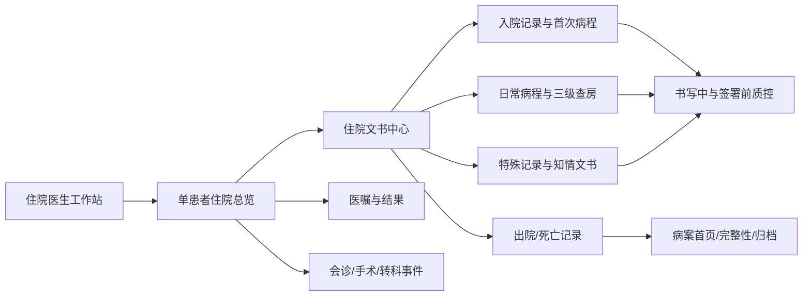

# openemr2026 住院电子病历产品设计核查

## 1. 核查结论

现有 PRD 已经出现“住院文书、入院记录、首程、病程、上级查房、阶段小结、会诊和出院记录”等名词，但主要被压缩在 FR-021、FR-060 和 FR-061 中；现有可运行原型只有病区护理，没有独立的住院医生工作站、住院文书目录、法定时限任务、三级查房和出院病历闭环。因此当前状态是“需求被提及，但没有形成完整住院病历产品设计”。

结论：需要把住院病历从“基础住院流程中的一个步骤”提升为 v1.0 P0 一级产品模块，并补齐独立 FR、AC、页面族和流程。

## 2. 权威要求基线

国家卫健委《病历书写基本规范》明确，住院病历不是单一文书，而是由住院病案首页、入院记录、病程记录、知情同意书、病危（重）通知书、医嘱单、辅助检查资料、护理资料、手术麻醉资料、出院或死亡记录等共同组成；首次病程、上级医师查房、术前术后、会诊、抢救、转科、阶段小结、出院和死亡记录还有不同的责任人与时限要求。

国家卫健委《电子病历系统功能规范（试行）》要求系统能够创建住院病历各组成部分，并自动记录创建时间、创建者和组成部分名称；系统还应完整展示既往病史、过敏史、门诊和住院诊疗信息。

这意味着住院模块必须同时解决：

1. 文书组成与目录完整性；
2. 不同文书的触发条件、责任人、时限和审签；
3. 病程连续性及诊疗事件关联；
4. 三级查房和下级书写、上级审签关系；
5. 医嘱、结果、手术、会诊、护理和文书的一体化上下文；
6. 出院前完整性检查、病案首页、归档和缺陷整改。

## 3. 市场产品公开信息对照

| 产品/公开案例 | 公开能力线索 | 对 openemr2026 的启示 |
|---|---|---|
| 东软 RealOne-EMR | 门诊、住院一体化；医嘱、病历、临床路径、临床数据中心集成；质量管理与临床工作一体化 | 住院医生不能在“病历编辑器”与医嘱、结果、路径之间反复跳系统；需要单患者一体化工作区 |
| 嘉和综合电子病历 | 结构化病历编辑、基于 CDR 的 360 诊疗视图、多级质控、特殊病历监控、病案首页查询、流程自定义 | 文书树、患者纵向视图、多级质控、特殊文书和病案首页应是产品主结构，不是隐藏功能 |
| 北医三院电子病历公开案例 | 住院医生工作站集中展示和处理临床数据，并覆盖从住院医生到病案室的完整病历流程 | 住院书写与病案归档必须形成跨角色闭环 |
| 东软 HAIAs 病历辅助生成 | 面向出院小结、转科记录、阶段小结、术前小结等住院文书，以多源数据生成后由医生审核 | AI 应嵌入住院文书类型和事件上下文，而不是只提供通用“生成病历”按钮 |

公开资料不足以复原各厂商的真实生产 UI、字段和医院实施配置，因此本核查只比较公开能力模型，不复制厂商界面，也不把营销描述当作现场应用效果证明。

## 4. 现有设计缺口

| 缺口 | 当前状态 | 风险 |
|---|---|---|
| 住院医生首页 | 只有护理床位视图 | 医生无法按本人/医疗组管理患者、文书时限、异常结果和待办 |
| 单患者住院总览 | 无独立页面 | 病情、诊断、医嘱、结果、手术、会诊和文书缺少统一上下文 |
| 住院文书目录 | 无目录、完整性和时限模型 | 容易漏写、迟写或错误选择文书类型 |
| 入院记录与首程 | PRD 名词出现，无独立交互与验收 | 入院 24 小时、首程 8 小时等时限不可管理 |
| 连续病程与三级查房 | 无独立工作流 | 不能体现住院诊疗连续性和上下级责任关系 |
| 事件型特殊文书 | 分散在手术、会诊等模块 | 事件发生后无法自动生成对应文书任务或校验完整性 |
| 出院病历闭环 | 只写“出院记录与审签” | 缺少文书完整性、医嘱/结果待办、病案首页、编码和归档交接 |
| AI 住院病历生成 | 通用能力，没有按文书类型设计 | 来源范围、时间窗口和人工复核边界不清楚 |

## 5. 建议产品结构

## 6. v1.0 应纳入的住院文书基线

- 住院志：入院记录、再次/多次入院记录、24 小时内入出院、24 小时内入院死亡。
- 连续病程：首次病程、日常病程、主治首次/日常查房、主任/副主任查房、阶段小结、交接班、转科、会诊、疑难病例讨论、抢救记录。
- 围手术期：术前小结、术前讨论、麻醉术前访视、手术记录、术后首次病程、麻醉术后访视，以及关联的同意书和核查资料。
- 风险与告知：病危（重）通知、输血/手术/麻醉/特殊检查治疗等知情同意。
- 终末文书：出院记录、死亡记录、死亡病例讨论、住院病案首页。
- 其他组成：医嘱单、体温单、检验/检查/病理资料、护理记录等以统一目录和原业务来源呈现，不重复伪造原始记录。

## 7. 原型改造范围

新增四个代表性页面：住院医生工作站、单患者住院总览、住院病程中心、出院病历闭环。病区护理保留为护士视角，不再代替住院医生模块。

## 8. 来源

- [国家卫健委：《病历书写基本规范》](https://www.nhc.gov.cn/wjw/gfxwj/201002/79d42b9c8b3f47ee91000d31de116784.shtml)
- [国家卫健委：《电子病历系统功能规范（试行）》](https://www.nhc.gov.cn/wjw/gfxwj/201101/a769b5f4b9ca4415a72fa9888bce0bc1.shtml)
- [国家卫健委：电子病历系统应用水平分级评价管理办法及标准（试行）](https://www.nhc.gov.cn/wjw/c100175/201812/7d64363a20cd4ea798f8343842b28d0c.shtml)
- [东软：临床医师一体化工作站 RealOne-EMR](https://www.neusoft.com/cn/products/%E5%8C%BB%E7%96%97%E5%81%A5%E5%BA%B7/%E9%9D%A2%E5%90%91%E5%A4%A7%E5%9E%8B%E5%8C%BB%E9%99%A2%E7%9A%84%E4%BF%A1%E6%81%AF%E5%8C%96%E5%BB%BA%E8%AE%BE%E6%95%B4%E4%BD%93%E8%A7%A3%E5%86%B3%E6%96%B9%E6%A1%88/%E5%8C%BB%E9%99%A2%E6%A0%B8%E5%BF%83%E4%B8%9A%E5%8A%A1%E7%B3%BB%E7%BB%9F/%E4%B8%B4%E5%BA%8A%E5%8C%BB%E5%B8%88%E4%B8%80%E4%BD%93%E5%8C%96%E5%B7%A5%E4%BD%9C%E7%AB%99%EF%BC%9Arealone-emr/)
- [嘉和美康：综合电子病历公开能力介绍](https://www.goodwillcis.com/newsinformation.aspx?id=61223)
- [嘉和美康：北医三院电子病历项目公开案例](https://www.goodwillcis.com/platform.aspx?id=10237)
- [东软：HAIAs 病历辅助生成智能体](https://www.neusoft.com/cn/products/%E5%8C%BB%E7%96%97%E5%81%A5%E5%BA%B7/%E5%81%A5%E5%BA%B7%E5%8C%BB%E7%96%97%E8%B5%8B%E8%83%BD%E4%BD%93/haias%E5%81%A5%E5%BA%B7%E5%8C%BB%E7%96%97%E6%99%BA%E8%83%BD%E4%BD%93/%E6%8F%90%E5%8D%87%E5%8C%BB%E7%94%9F%E4%B8%B4%E5%BA%8A%E6%95%88%E7%8E%87/haias%E7%97%85%E5%8E%86%E8%BE%85%E5%8A%A9%E7%94%9F%E6%88%90%E6%99%BA%E8%83%BD%E4%BD%93/)
