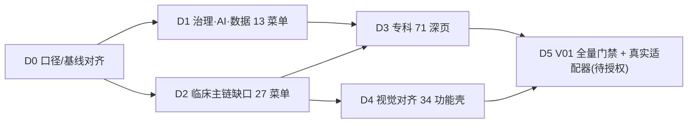

# openemr2026 下一阶段交付级开发计划

> 日期：2026-08-23
> S007 模式：`BACKLOG`（交付批次 DAG）+ `REPLAN`（方向纠偏后的里程碑重排）
> 依据（已通读）：`DEVELOPMENT_PRINCIPLES.md`（19 条硬原则）、`planning/2026-08-22-handover.md`、`planning/2026-08-22-ui-replan.md`、`planning/2026-08-14-openemr2026-v1.0-implementation-backlog.md`，并对 `web/src/vue/route-registry.ts`、`router.ts`、`web/src/clinical-api.ts`、`contracts/generated/route-contract.generated.json` 做了实测核对。
> 状态：所有任务 `PLANNED`；只有被 S008 实际执行并通过门禁后，才把对应项标 `VERIFIED`。

---

## 0. 结论速览（TL;DR）

1. **主度量 = 可用菜单数 / 194**。代码实测当前 `nativeVueRouteIds` = **34 条**；`README.md` 第 9 行仍记「33」，存在 ±1 口径漂移（见 §2 前置项）。
2. **方向已定，不再摇摆**：UI 优先、后端复用；**本阶段禁止再堆「一张表 + 一个服务 + 一个 API + 测试」的后端横向切片**。后端 132 迁移 + 477 测试是资产，不是下一步的工作对象。
3. **下一阶段 = 5 个交付批次**，每批都以「可用菜单数」为可观察增量：

| 批次 | 目标 | 后端 | 菜单增量 | 累计可用菜单 |
|---|---|---|---|---|
| D0 | 口径与基线对齐（前置） | 无 | +0 | 34 |
| D1 | 治理/AI/数据 13 个后台菜单接线 | 零新后端（已就绪） | +13 | 47 |
| D2 | 临床主链缺口菜单接线（复用已就绪后端） | 零/极少新后端 | +27 | ~74 |
| D3 | 专科 71 深页（S01–S10） | 部分新后端 | +71 | ~145 |
| D4 | 视觉对齐现有功能壳 | 无 | +0（质量） | ~145 |
| D5 | V01 全量 E2E/安全/发行门禁 + 真实适配器（待授权） | 待授权 | +0（门禁） | ~145 |

> 194 = 34 原生 + 71 专科守卫 + 89 明确规划（`NOT_AVAILABLE`）。D1/D2 吃掉 89 里「后端已就绪」的约 40 个，其余「需新后端/真实适配器」的留在 D3/D5。

---

## 1. 代码现状（实测，非文档口径）

### 1.1 后端（资产，不再扩）
- 数据库迁移 **V1–V132**；机器契约 **380 schemas / 388 outputs / 356 operations**。
- 测试 **119 suites / 477 tests / 0 failures**；100/100 AI eval；138/138 FR 追踪；194/194 路由审计。
- 门禁 `scripts/verify.sh` 全绿（以 2026-08-22 交接与 backlog 证据为基线）。

### 1.2 前端（缺口所在）
- Vue 3 单栈，194/194 路由唯一注册；`nativeVueRouteIds` = **34**，`specialtyGuardRouteIds` = **71**，其余 **89** 为 `NOT_AVAILABLE`。
- `web/src/vue/views/` 已有 30 个页面文件（部分一个页面服务多个 route_id，如 `OrdersWorkspacePage` 服务 `opd-orders`/`ip-orders`）。
- `web/src/clinical-api.ts`（2050 行）已覆盖**临床主链** API：文书租约/版本/质控/签署/更正、医嘱/诊断/结果/任务、住院总览/文书/会诊/路径/床位/出院、组织/人员/授权/紧急访问/患者合并/时间线/模板。
- **治理/AI/数据域 API 客户端函数缺失**：`clinical-api.ts` 内检索不到 dictionary / capability-pack / model / agent / skill / tool / evaluation / budget / data-quality / cohort / research / opensource / migration / source-system 任何函数。这些域的**后端已就绪、OpenAPI 已生成 TS DTO**（`web/src/generated/contracts.ts`），只差薄 API 客户端 + Vue 页面 + 双登记。

### 1.3 89 条 `NOT_AVAILABLE` 按域实测分布

| primary_domain | 条数 | 后端已就绪可纯接 UI | 需新后端/真实适配器 |
|---|---|---|---|
| ADMIN | 7 | admin-dictionaries、admin-roles、admin-audit | admin-auth、admin-jobs、admin-master-data、admin-parameters |
| AI | 18 | models、agent-catalog、skill-catalog、tool-catalog、model-evaluation、aiops、ai-action-review、ai-reminder-detail、ai-assistant | agent、agent-compose、agent-context、agent-evals、ai-capture、ai-center、ai-assistant-policy、model-connection、model-routing |
| CLINICAL | 13 | appointment-registration、er-triage、er-observation、er-record、er-nursing、er-handoff、emergency、opd-consult、ward | opd-followup、clinical、unified-home、login-context |
| COLLABORATION | 12 | billing、outpatient-pharmacy、inpatient-pharmacy、lab-workbench、imaging-workbench、transfusion、surgery-schedule、care-operations | pathology-workbench、device-monitoring、anesthesia-workbench、therapy-workbench |
| CONFIG | 18 | capability-pack、migration、integration-mapping、specialty-coverage | config-release/upgrade、form-designer、rule-center、scope-designer、workflow、devices、integration(-connectors/messages)、backup、operations、release-gates、install |
| DATA | 7 | data-quality、cohort-builder、research-dataset、opensource | data-center、research、research-stats |
| QUALITY | 5 | infection-events、quality-rating、credentials | department-qc、quality-center |
| RECORD | 9 | archive-borrow、archive-catalog、archive-integrity、asset-detail、record-editor、lis-report、pacs-viewer | archive-scan、archive-preservation |

> 「后端已就绪」= 该菜单核心操作有已验证的 Service/API（对照 backlog 的 V 号）；「需新后端」= 尚无对应 Service，或依赖未授权真实适配器（扫描/长期保存/OIDC/设备/LIS/PACS 真连等）。

---

## 2. 前置项（D0，先于 D1 完成，半天内）

| 项 | 说明 | 门禁 |
|---|---|---|
| D0-1 主指标口径对齐 | `README.md` 记「33」，代码 `nativeVueRouteIds` 为「34」。统一为**代码实测值**并给出可复算脚本口径（`grep -c` route-registry 或读 `nativeVueRouteIds.size`）。 | README 第 9 行与代码一致 |
| D0-2 版本库决策 | 仓库**无 `.git`**，交接/backlog 里的 `commit`/`push`/冻结 commit 发布门禁当前无法用 git 强制。**决策二选一**：(a) 初始化 git 并把「commit + verify 全绿」接入门禁；(b) 以「本机文件态 + `scripts/verify.sh` 全绿 + 测试报告」作为 commit 等价物。默认走 (a)，需用户授权建仓。 | 门禁可执行 |
| D0-3 基线重跑 | 后台重跑 `scripts/verify.sh` 与 `cd web && npm run build`，记录 `VERIFY_EXIT` 与构建产物，作为本计划起点的可复现证据。 | VERIFY_EXIT=0 且 build 通过 |
| D0-4 契约漂移确认 | 确认 `npm --prefix contracts run check` 无漂移、`contracts/generated/route-contract.generated.json` 仍 194 条。 | 无漂移 |

---

## 3. 全局假设、非目标与门禁

### 假设
- 交接文档与 backlog 中标记 `LOCAL_VERIFIED`/`VERIFIED` 的后端切片证据可信；本计划不重新验证后端，只复用其 API。
- 治理/AI/数据域的 OpenAPI operation 已在 `contracts/generated/contracts.ts` 生成 TS 类型与 codec（契约优先 P10 已就位）。
- 每条 `NOT_AVAILABLE` 路由的 route_id / title / 归属在 `route-contract.generated.json` 中完整且与原型锚点一致。

### 非目标（本阶段不做）
- ❌ 不新建后端表/服务/迁移，除非某菜单**真的**没有后端（D2 中被明确标注的少数项，且必须单独评审）。
- ❌ 不引入 React / 不换 Vue 单栈 / 不换 ORM / 不换 PostgreSQL / 不微服务化 / 不追 Spring Boot 大版本。
- ❌ 不做真实 OIDC/CA/KMS/LIS/PACS/对象存储/药典/HR-IAM 适配器（NO-GO，D5 待授权）。
- ❌ 不做 G01 可视化配置、A01 审批流编排/SSE 断点恢复等「重设计」项。
- ❌ 不把「后端切片 + 测试绿」当完成汇报；完成 = 菜单在 UI 可点。

### 门禁（每个菜单切片通用 DoD）
1. `web/src/vue/views/<Xxx>.vue` 页面，视觉对齐原型（`prototype/app/` + `ui-delivery/tokens.json`）。
2. `router.ts` 的 `nativeComponents` + `route-registry.ts` 的 `nativeVueRouteIds` **双登记**。
3. 复用 `clinical-api.ts` 既有函数；缺则新增薄客户端（DTO 用 `contracts.ts` 生成物，**禁止绕过契约手写枚举**）。
4. 状态覆盖：loading / empty / error / permission / success / conflict（`ClinicalPageState.vue` + `toClinicalIssue`）。
5. 验收：`cd web && npm run build`（vue-tsc 通过）+ 真实浏览器打开 `#/<route_id>` 可点；无横向溢出、控制台 0 error。
6. 回写：README 第 5/9 行更新「可用菜单数 / 194」主指标。
7. 禁止：改动后端 Service/迁移/`contracts/openapi.json`/数据库，除非该任务被显式标注为「需新后端」。

---

## 4. 交付批次 DAG 与关键路径

- **关键路径**：`D0 → D1 → D3 → D5`（D1 是 D3 专科 workbench 的「治理/AI 主菜单铺开」前置，符合 P19「专科后置，先铺治理+AI 主菜单」）。
- **D1 与 D2 可并行**：D1 改治理/AI/数据域，D2 改临床域，文件与后端几乎不相交。
- **D4 可与 D2 并行**：视觉对齐不改菜单数，只改现有 34 壳的视觉，与 D2 新接线文件不相交。

---

## 5. 逐批次施工单

### D1 — 治理 / AI / 数据 13 个后台菜单接线（零新后端，最高 ROI）

- 目标价值：把「已就绪但看不见」的后端治理面一次性铺成可点菜单，主指标 +13。
- 依赖：D0。平行组：D1-CFG / D1-AI / D1-DATA 三组可并行。
- 允许修改区：`web/src/vue/views/`、`web/src/vue/router.ts`、`web/src/vue/route-registry.ts`、`web/src/clinical-api.ts`（或新增 `web/src/api/*.ts` 域客户端）。
- 禁止项：后端 Service/迁移、`contracts/openapi.json`、数据库、`web/src/generated/contracts.ts` 手改。
- 关键协调点（防并行冲突）：`clinical-api.ts` 是单文件，13 个任务都会碰。**建议**：三组各任命一个「客户端函数 owner」，或按域拆 `web/src/api/{governance,ai-platform,data}.ts` 纯加法模块，避免同一文件三路并改冲突。

| task_id | 菜单 route_id | 后端（已验证） | 允许修改 | 禁止 | DoD（可观察结果） |
|---|---|---|---|---|---|
| D1-CFG-01 | `admin-dictionaries` | V51 DictionaryService | 页面 + 客户端 + 双登记 | 后端/契约 | 字典项列表/新增/停用可点，状态齐全，`#/admin-dictionaries` 真实 API 无 Mock |
| D1-CFG-02 | `capability-pack` | V82 + V121 灰度发布 | 同上 | 同上 | 能力包列表/定义/灰度发布/回退四态可点，`#/capability-pack` 连真实 API |
| D1-CFG-03 | `migration` | V115+V126+V129+V130+V131 | 同上 | 同上 | 源系统盘点/字段映射/患者匹配/断点重跑/批次切换在 `#/migration` 可点，硬门错误可见 |
| D1-AI-01 | `models` | V52 ModelDeployment | 同上 | 同上 | 模型登记/停用/列表可点，驻留策略/评估状态可见 |
| D1-AI-02 | `agent-catalog` | V80 | 同上 | 同上 | Agent 登记/停用/列表可点 |
| D1-AI-03 | `skill-catalog` | V84 | 同上 | 同上 | Skill 登记/停用/列表可点 |
| D1-AI-04 | `tool-catalog` | V85 | 同上 | 同上 | Tool 登记/停用/列表可点 |
| D1-AI-05 | `model-evaluation` | V87 | 同上 | 同上 | 评估记录（结论与阈值一致）可点，FAILED 阻断可见 |
| D1-AI-06 | `aiops` | V88 + V132 预算强制 | 同上 | 同上 | 运行预算定义/消耗校验/累计超限硬门可点，`#/aiops` 连真实 API |
| D1-DATA-01 | `data-quality` | V77 + V93 | 同上 | 同上 | 质量规则登记/评估执行（结论与阈值一致）可点 |
| D1-DATA-02 | `cohort-builder` | V81 + V95 + V127 | 同上 | 同上 | 队列定义/成员快照/成员物化可点，纳入标准硬门可见 |
| D1-DATA-03 | `research-dataset` | V53 | 同上 | 同上 | 科研申请→批准→导出→销毁状态机可点 |
| D1-DATA-04 | `opensource` | V110 + V123 | 同上 | 同上 | 指标快照/下载事件/机器人排除/去重硬门可点 |

- D1 DoD（批次级）：13 个 route_id 全部离开 `NOT_AVAILABLE`、双登记、`npm run build` 通过、浏览器实测 13 条深链、README 主指标更新为「47 / 194」、`scripts/verify.sh` 仍全绿。

---

### D2 — 临床主链缺口 27 个菜单接线（复用已就绪后端）

- 目标价值：把药房/收费/检验/影像/急诊/护理/输血/手术/转诊/不良事件/院感/病案资产等**后端已就绪**的菜单接成页面，是最大用户可见增量。
- 依赖：D0（可与 D1 并行）。平行组：D2-A 门急诊 / D2-B 协作执行 / D2-C 病案与质量，三组可并行。
- 允许修改区：同 D1 + 视需要复用既有 `clinical-api.ts` 临床函数。
- 禁止项：同 D1；**D2 中「需新后端」项（下表标注 ⚠️）必须先通过一次 S006 范围评审，确认真的没有后端，才允许新建最小 Service，且不阻塞同组纯 UI 项。**

#### D2-A 门急诊域（E01 后端已就绪）
| route_id | 后端 | 备注 |
|---|---|---|
| `appointment-registration` | V40–V42 | 班次号源/预约/退号/报到生成就诊/接诊推进 |
| `er-triage` | V68 | 四级分诊硬门 |
| `er-observation` | V70 | 去留处置闭环 |
| `er-record` | V68/70/83/89/90/96 | 急诊病历工作台（可复用 E01 组合页） |
| `er-nursing` | V89 | 危重详评估硬门 |
| `er-handoff` | V90/96 | 先救治后补登 + 域间切换 |
| `emergency` | V68 | 急诊总览壳 |
| `opd-consult` | V42 | 接诊推进 |
| `ward` | V43–46/108 | 病区看板 + 转区任务迁移 |

#### D2-B 协作执行 + 药房/检验/影像/输血/手术/护理（后端已就绪）
| route_id | 后端 | 备注 |
|---|---|---|
| `billing` | V47 | 价格版本/收费明细/冲正 |
| `outpatient-pharmacy` | V72 | 门诊发药双人核验 |
| `inpatient-pharmacy` | V72 | 住院摆药/发药 |
| `lab-workbench` | V48 | 检验标本闭环 |
| `imaging-workbench` | V71 | 影像预约闭环 |
| `transfusion` | V50 | 输血双人核验/输注反应 |
| `surgery-schedule` | V73 | 手术安全核查 |
| `care-operations` | V43–46/86/91/108 | 护理体征/计划/给药/交接/出院闭环 |
| ⚠️ `pathology-workbench` / `device-monitoring` / `anesthesia-workbench` / `therapy-workbench` | 无 | **推迟**（X01/H01 未实现病理/设备/麻醉/治疗） |

#### D2-C 病案资产 / 结果 / 质量（后端已就绪）
| route_id | 后端 | 备注 |
|---|---|---|
| `archive-borrow` | V97 | 借阅状态机 |
| `archive-catalog` | V97 | 编目 |
| `archive-integrity` | V97 | 内容哈希硬门 |
| `asset-detail` | V97 | 资产详情 |
| `record-editor` | R01 | 复用文书编辑内核 |
| `lis-report` | V48 | 检验结果报告 |
| `pacs-viewer` | V71 | 影像报告索引 |
| `infection-events` | V74 | 院感线索确认/排除 |
| `quality-rating` | V6 + V77/93 | 科室支持等级/评级取证 |
| `credentials` | C01 | 人员资质 |
| ⚠️ `archive-scan` / `archive-preservation` | 无 | **推迟**（需真实扫描/长期保存适配器） |

- D2 DoD（批次级）：上表「后端已就绪」项全部离开 `NOT_AVAILABLE`（约 +27，部分菜单可复用同一工作台页面），`npm run build` + 浏览器实测，README 主指标更新为「约 74 / 194」，`scripts/verify.sh` 全绿。

---

### D3 — 专科 71 深页（S01–S10，后置）

- 目标价值：把 71 条专科守卫路由（读真实支持声明、默认拒绝越界能力）升级为可用的专科 workbench + 六层页面。
- 依赖：D1、D2（P19「专科后置」；D1 铺开治理/AI 主菜单、D2 铺开临床主链后才做专科）。
- 现状：S01–S10 **record 层 10/10 已 VERIFIED**；treatment/evidence/care/followup/qc 部分专科已落（S01 五层、S02 三层、S03 三层、S04 三层、S05 三层、S06 三层、S07 两层、S08 两层、S09 三层、S10 三层），**workbench 层 + 剩余层 + 专科 AI eval + 发行 manifest + 支持等级评审**仍缺。
- 拆解原则：每科 7 层（workbench/record/evidence/treatment/care/followup/qc）为纵向切片；**workbench UI 复用 D1 的治理面与 D2 的临床面模式**。后端缺口项（四诊结构化、配伍禁忌、中西药相互作用、配子/胚胎追溯、库存对账、生长曲线百分位等）单独列任务，先评审再建。
- DoD（批次级）：71 条专科路由离开 `SUPPORT_GUARD`（支持声明仍读真实评估，但已支持科别的页面真实可用），主指标更新为「约 145 / 194」。

---

### D4 — 视觉对齐现有 34 个功能壳（可与 D2 并行）

- 目标价值：把 34 个已接线页面按 `prototype/app/` 高保真 + `ui-delivery/tokens.json` 逐页对齐（不改变菜单数，只提升质量）。
- 依赖：D0。与 D2 并行。
- 范围：逐页对照 state-matrix（loading/empty/error/permission/success/conflict）与响应式（1280/1440/1600/200% + 移动端），修正横向溢出/控制台告警。
- DoD：34 页视觉/交互审计通过，产出 `ui-audit` 更新；不改路由、不改后端。

---

### D5 — V01 全量 E2E/安全/发行门禁 + 真实适配器（待授权）

- 依赖：D1–D4。
- 范围：138 FR → 代码/API/迁移/测试全量追踪；194 路由 E2E；多角色/多科室剧本；1.5 倍负载；DB/Worker/对象存储/模型/集成故障与恢复；SAST/SCA/secret/container/DAST/Agent 红队；SBOM + 签名 + 升级/回滚文档。
- **授权边界（NO-GO，需用户逐项授权）**：真实 OIDC/CA/KMS、对象存储、LIS/PACS/病理/设备连接器、真实药典/知识源、真实下载采集器、真实消息通道（SSE/推送）、真实模型推理计量、HR-IAM 同步。**这些是发布风险项，不是本阶段默认实施项。**
- DoD：P0/P1 缺陷 0；恢复一致；安全从 NO-GO 转为有证据候选结论；每个支持级别与实际测试一致。

---

## 6. 风险与授权清单

| 风险 | 等级 | 缓解 |
|---|---|---|
| 无 git 版本库，`commit/push/冻结 commit` 门禁不可强制 | 高 | D0-2 建仓决策；否则以文件态 + verify 全绿 + 报告为 commit 等价物 |
| 主指标口径漂移（README 33 vs 代码 34） | 中 | D0-1 统一为代码实测值 |
| D1 三组并行改 `clinical-api.ts` 冲突 | 中 | 指定 owner 或按域拆 `web/src/api/*.ts` 纯加法 |
| 「后端已就绪」被误读为「业务完整」（IN_PROGRESS 首切 ≠ 完整） | 高 | 每菜单 DoD 明确「核心操作可点」；业务完整性仍由 D5 全量门禁收口 |
| D2 部分菜单确无后端（opd-followup、病理/设备/麻醉/治疗等）被误接成假页面 | 高 | 标 ⚠️ 项先 S006 范围评审；不伪造 `NOT_AVAILABLE` 为可用 |
| 专科 D3 大量后端缺口（四诊/配伍/配子追溯/库存/生长曲线等） | 高 | D3 逐科列后端缺口任务，评审后再建，不与 UI 混批 |
| 真实适配器未联调即宣称「生产就绪」 | 极高 | D5 保持 NO-GO，逐项授权后才动 |

**授权边界**：本计划只授权**本机代码 + UI 接线 + 合成部署**。`git init`/建仓、真实适配器、`push`、公开 Release、真实医院部署均需用户另行授权。

---

## 7. 首个 S008 调用与上下文

**先做 D0，再做 D1（推荐先 D1-CFG 组跑通「菜单切片模板」作为样板，再并行铺 D1-AI/D1-DATA）。**

交给 `haonan-s008-coder` 的最小上下文包：

- `DEVELOPMENT_PRINCIPLES.md`（19 条硬原则，开工必读）
- `planning/2026-08-22-handover.md`（纪律/踩坑/文件位置）+ `planning/2026-08-22-ui-replan.md` §3 菜单切片模板
- 本文件 §5 的 D1 施工单
- `web/src/vue/route-registry.ts`（`nativeVueRouteIds` 即「已可用」白名单）、`web/src/vue/router.ts`（`nativeComponents` 双登记处）
- `web/src/vue/views/OrganizationAdministrationPage.vue`（现有页面写法样例，最贴近治理域）
- `web/src/clinical-api.ts` + `web/src/generated/contracts.ts`（生成 DTO/type，新增客户端函数只消费它）
- `contracts/generated/route-contract.generated.json`（route_id/title/primary_domain 权威源）
- 验收命令：`cd web && npm run build`；全量门禁 `scripts/verify.sh`

**首个具体任务**：`D1-CFG-01`（`admin-dictionaries` 字典主数据页面）——把 `#/admin-dictionaries` 从 `NOT_AVAILABLE` 接成真实可点菜单，作为 D1 全组的「菜单切片」样板与验收模板。
