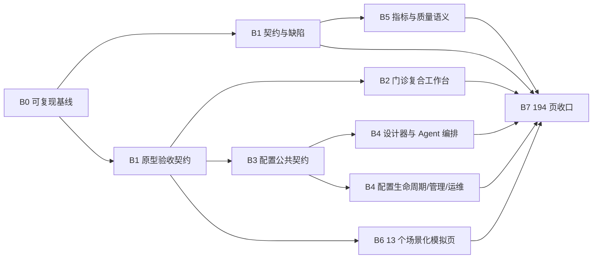

# openemr2026 剩余开发工作清单 v4

> 日期：2026-08-24  
> 模式：`BACKLOG + REPLAN`  
> 状态：本文所有任务均为 `PLANNED`；只有实际实施并通过对应门禁后才能改为 `VERIFIED`。  
> 目标：生产 Vue 应用在功能、业务状态和主要视觉结构上完整覆盖 `prototype/app/index.html` 的 194 个页面，并保留 DeepSeek 新增的配置持久化、指标快照、模拟接口、门诊随访和 Agent 运行需求。

---

## 0. 结论与任务口径

当前已观察到 194/194 路由可打开，但“路由挂载成功”不能证明页面已经包含原型业务能力。按用户目标重新拆分后，剩余工作为 **42 个施工任务**：

- 基线、缺陷与公共契约：5 项。
- 用户点名的门诊复合工作台：1 项。
- 17 个配置/编排/运维页面：17 项。
- 5 个指标与质量页面：5 项。
- 13 个外部依赖页面的场景化模拟实现：13 项。
- 194 页最终视觉、状态与响应式收口：1 项。

这 42 项不包含真实 OIDC、CA/KMS、对象存储、LIS/PACS、设备网关、模型 Provider 等生产适配器。当前计划遵循用户此前“外部系统可先模拟，但必须保留标准接口与文档”的边界；真实适配器另行授权、另立发布里程碑。

---

## 1. 范围、事实源与当前代码状态

### 1.1 事实源

- 用户目标：完整覆盖 `http://127.0.0.1:4178/app/index.html#outpatient` 所在原型的全部 194 页面，并保留 DeepSeek 新增需求。
- 开发硬原则：`DEVELOPMENT_PRINCIPLES.md`。
- 最新交接：`planning/2026-08-23-handover-v3.md`。
- 页面事实源：`prototype/app/`、`ui-delivery/route-design-map.csv`、`ui-delivery/route-titles.json`。
- 路由事实源：`contracts/generated/route-contract.generated.json`。
- 契约事实源：`contracts/openapi.json` 及生成的 Java/TypeScript 制品。
- 上轮 S006 部分审查结论：路由覆盖成立，但至少 36 个页面仍是通用壳、通用指标或通用模拟器，不能按原型功能完成计数。

### 1.2 已观察到的代码状态

- 194/194 route_id 已登记，`NOT_AVAILABLE` 已清零。
- 17 个配置/编排页面共用 `config_item` 的名称、键、说明 CRUD，领域设计器、校验、版本、审批和回滚尚未形成。
- 5 个指标页面共用 `metric_snapshot`，当前自动计算仅聚合患者、就诊、文书、医嘱四类计数。
- 13 个外部依赖页面已经能列接口、展示标准/schema/文档并执行确定性连接测试，但未覆盖原型中的页面专属业务流程。
- `#/outpatient` 当前是“当前文书 + 功能入口”页面，尚未形成原型中的候诊队列、患者切换、病历摘要、风险时间线和页面内动作闭环。
- `MetricSnapshot.unit/period` 的 null 契约不一致仍存在。
- 交接记录 `OutboxDispatcherTest` 有 2 个异步断言失败。
- 当前目录没有 `.git`，本机缺 JDK 21；`scripts/verify.sh` 还依赖预先存在且已迁移的数据库，基线不可一条命令复现。

### 1.3 假设

- 原型是页面默认态、信息架构和主要交互的验收基线；原型中的合成数字不是生产业务事实。
- 优先复用 V1–V165、现有 Service/API 和生成契约；只有现有公共契约无法表达业务状态时才新增迁移或接口。
- 真实外部系统尚不可用，13 个页面先完成“场景化确定性模拟 + 标准接口文档 + 清晰模拟来源”，不写入真实临床事实。
- 开发和测试只使用 `samples/data/` 的合成数据，不使用真实患者数据。

### 1.4 非目标

- 不更换 PostgreSQL、JdbcClient、Flyway、Vue 3 或模块化单体架构。
- 不引入 React、JPA、Hibernate、MyBatis-Plus 或微服务拆分。
- 不在本里程碑接入真实医院身份、签名、存储、LIS/PACS/设备或模型密钥。
- 不进行与 194 页面覆盖无关的框架升级或顺手重构。
- 不执行 `push`、公开 Release、生产部署或真实数据库迁移。

---

## 2. 全局完成门禁

所有页面任务必须同时满足以下门禁，否则保持 `PLANNED` 或 `OBSERVED`：

1. **纵向切片**：页面可进入；真实内部能力连真实 API，外部依赖页连明确标识的确定性模拟 API；写操作具备幂等、审计、Outbox 和并发冲突处理。
2. **状态完整**：可观察到 loading、empty、error、permission、success；涉及写入的页面还必须覆盖 conflict；外部模拟页必须覆盖 unavailable/degraded。
3. **契约优先**：任何公共字段或状态变化先改 `contracts/openapi.json`，再生成 Java/TS；不得手改生成物或前后端各写一套枚举。
4. **原型语义**：H1、一级/二级归属、关键指标、主要操作、风险提示、工作流步骤和结果反馈与对应原型路由的验收矩阵一致。
5. **视口**：至少验证 1280×800、1440×1000、1600×1000、浏览器 200% 缩放和 390px 移动端安全降级；不得出现主操作不可达或横向溢出。
6. **测试**：受影响单测、契约检查、前端测试与构建通过；批次结束运行 `scripts/verify.sh` 和浏览器语义审计。
7. **安全**：不在日志、截图、URL、模拟响应或制品中出现真实 PHI、口令、Token、私钥或真实外部端点凭据。
8. **可回滚**：代码以候选 commit 为单位回滚；数据库只允许向前修复迁移；配置发布必须提供版本回退；模拟 handler 可通过配置恢复到上一版本。

批次通用命令：

```bash
npm --prefix contracts test
npm --prefix contracts run check
scripts/test-schema.sh
scripts/with-java21.sh ./gradlew test --no-daemon --no-configuration-cache
npm --prefix web test
npm --prefix web run build
node prototype/app/verify-route-contract.mjs
node prototype/app/verify-traceability.mjs
```

---

## 3. DAG、批次与关键路径

### 3.1 依赖图



关键路径：`R0-BASE-01 → R0-AC-01 → R0-CFG-CONTRACT-01 → 17 个配置页面 → UI-194-01`。

`OPD-01`、指标任务、配置页面和模拟页面在各自前置完成后可按不同 `parallel_group` 并行；共享文件 `contracts/openapi.json`、`web/src/vue/router.ts`、`route-registry.ts` 必须指定单一 owner，避免并发覆盖。

### 3.2 DAG 表

```text
task_id,title,requirement_refs,depends_on,parallel_group,risk,owner_skill,status
R0-BASE-01,恢复可复现开发与验证基线,USER-2026-08-24;DEV-P1-P3,-,B0,HIGH,haonan-s011-devops,VERIFIED
R0-CONTRACT-01,修复指标快照 null 契约,HO-V3-5.1,R0-BASE-01,B1-A,HIGH,haonan-s008-coder,VERIFIED
R0-OUTBOX-01,修复 Outbox 异步时序测试,HO-V3-5.4,R0-BASE-01,B1-A,HIGH,haonan-s008-coder,VERIFIED
R0-AC-01,建立 194 页语义验收契约,USER-2026-08-24;PROTO-194,R0-BASE-01,B1-B,HIGH,haonan-s009-test,VERIFIED
R0-CFG-CONTRACT-01,冻结共享配置生命周期契约,PROTO-CONFIG;DEV-P10,R0-AC-01,B3,HIGH,haonan-s005-2-lld-back,VERIFIED
OPD-01,门诊复合工作台完整覆盖,PROTO-outpatient,R0-AC-01,B2,HIGH,haonan-s008-coder,VERIFIED
CFG-DES-01,流程与状态设计器,PROTO-workflow,R0-CFG-CONTRACT-01,B4-DES,HIGH,haonan-s008-coder,VERIFIED
CFG-DES-02,表单与病历模板设计器,PROTO-form-designer,R0-CFG-CONTRACT-01,B4-DES,HIGH,haonan-s008-coder,VERIFIED
CFG-DES-03,规则时限与提示设计器,PROTO-rule-center,R0-CFG-CONTRACT-01,B4-DES,HIGH,haonan-s008-coder,VERIFIED
CFG-DES-04,角色职责与数据范围设计器,PROTO-scope-designer,R0-CFG-CONTRACT-01,B4-DES,HIGH,haonan-s008-coder,VERIFIED
CFG-AGT-01,Agent Skill Tool 组合画布,PROTO-agent-compose,R0-CFG-CONTRACT-01,B4-AGT,HIGH,haonan-s008-coder,VERIFIED
CFG-AGT-02,Agent 上下文策略,PROTO-agent-context,R0-CFG-CONTRACT-01,B4-AGT,HIGH,haonan-s008-coder,VERIFIED
CFG-AGT-03,Agent 评估与发布门禁,PROTO-agent-evals,R0-CFG-CONTRACT-01,B4-AGT,HIGH,haonan-s008-coder,VERIFIED
CFG-AGT-04,临床 AI 助手策略,PROTO-ai-assistant-policy,R0-CFG-CONTRACT-01,B4-AGT,HIGH,haonan-s008-coder,VERIFIED
CFG-LIFE-01,配置差异审批灰度发布,PROTO-config-release,R0-CFG-CONTRACT-01,B4-LIFE,HIGH,haonan-s008-coder,VERIFIED
CFG-LIFE-02,配置包升级冲突处理,PROTO-config-upgrade,R0-CFG-CONTRACT-01,B4-LIFE,HIGH,haonan-s008-coder,VERIFIED
CFG-ADM-01,医院主数据管理,PROTO-admin-master-data,R0-CFG-CONTRACT-01,B4-ADM,MEDIUM,haonan-s008-coder,VERIFIED
CFG-ADM-02,系统参数与功能开关,PROTO-admin-parameters,R0-CFG-CONTRACT-01,B4-ADM,HIGH,haonan-s008-coder,VERIFIED
CFG-ADM-03,通知调度与批量任务,PROTO-admin-jobs,R0-CFG-CONTRACT-01;R0-OUTBOX-01,B4-ADM,HIGH,haonan-s008-coder,VERIFIED
CFG-OPS-01,备份恢复与完整性报告,PROTO-backup,R0-CFG-CONTRACT-01,B4-OPS,HIGH,haonan-s008-coder,VERIFIED
CFG-OPS-02,安装向导与首次健康检查,PROTO-install,R0-CFG-CONTRACT-01,B4-OPS,HIGH,haonan-s008-coder,VERIFIED
CFG-OPS-03,生产运行灾备与停机续运,PROTO-operations,R0-CFG-CONTRACT-01,B4-OPS,HIGH,haonan-s008-coder,VERIFIED
CFG-OPS-04,Release 门禁与制品发布,PROTO-release-gates,R0-CFG-CONTRACT-01;R0-OUTBOX-01,B4-OPS,HIGH,haonan-s008-coder,VERIFIED
MET-01,数据中心指标目录与血缘,PROTO-data-center,R0-CONTRACT-01;R0-AC-01,B5-MET,HIGH,haonan-s008-coder,VERIFIED
MET-02,科研项目与统计中心,PROTO-research,R0-CONTRACT-01;R0-AC-01,B5-MET,HIGH,haonan-s008-coder,VERIFIED
MET-03,科研统计分析,PROTO-research-stats,MET-02,B5-MET,HIGH,haonan-s008-coder,VERIFIED
MET-04,院科病历质控与整改,PROTO-department-qc,R0-CONTRACT-01;R0-AC-01,B5-QC,HIGH,haonan-s008-coder,VERIFIED
MET-05,医疗质量中心,PROTO-quality-center,MET-04,B5-QC,HIGH,haonan-s008-coder,VERIFIED
SIM-ID-01,认证与 MFA 场景模拟,PROTO-admin-auth,R0-AC-01,B6-ID,HIGH,haonan-s008-coder,VERIFIED
SIM-AI-01,语音采集转写与复核模拟,PROTO-ai-capture,R0-AC-01,B6-AI,HIGH,haonan-s008-coder,VERIFIED
SIM-AI-02,模型 Provider 连接模拟,PROTO-model-connection,R0-AC-01,B6-AI,HIGH,haonan-s008-coder,VERIFIED
SIM-AI-03,模型路由与降级模拟,PROTO-model-routing,SIM-AI-02,B6-AI,HIGH,haonan-s008-coder,VERIFIED
SIM-DEV-01,设备目录绑定与校准模拟,PROTO-devices,R0-AC-01,B6-DEV,HIGH,haonan-s008-coder,VERIFIED
SIM-DEV-02,设备遥测监控与告警模拟,PROTO-device-monitoring,SIM-DEV-01,B6-DEV,HIGH,haonan-s008-coder,VERIFIED
SIM-INT-01,集成连接器目录与健康模拟,PROTO-integration-connectors,R0-AC-01,B6-INT,HIGH,haonan-s008-coder,VERIFIED
SIM-INT-02,集成消息 Trace 与重试模拟,PROTO-integration-messages,SIM-INT-01,B6-INT,HIGH,haonan-s008-coder,VERIFIED
SIM-ARC-01,纸质病历扫描 OCR 与编目模拟,PROTO-archive-scan,R0-AC-01,B6-ARC,HIGH,haonan-s008-coder,VERIFIED
SIM-ARC-02,病案长期保存与恢复验证模拟,PROTO-archive-preservation,SIM-ARC-01,B6-ARC,HIGH,haonan-s008-coder,VERIFIED
SIM-CLN-01,病理标本到诊断签署模拟,PROTO-pathology-workbench,R0-AC-01,B6-CLN,HIGH,haonan-s008-coder,VERIFIED
SIM-CLN-02,麻醉评估事件轴与复苏模拟,PROTO-anesthesia-workbench,R0-AC-01,B6-CLN,HIGH,haonan-s008-coder,VERIFIED
SIM-CLN-03,治疗排程核对执行模拟,PROTO-therapy-workbench,R0-AC-01,B6-CLN,HIGH,haonan-s008-coder,VERIFIED
UI-194-01,194 页视觉状态响应式与候选发布收口,PROTO-194;STATE-MATRIX,全部页面任务;R0-OUTBOX-01,B7,HIGH,haonan-s009-test,VERIFIED
```

---

## 4. 基线、缺陷与公共契约施工单

### R0-BASE-01 恢复可复现开发与验证基线

- 目标价值：让任何接续 Codex 能从干净终端启动合成环境并得到可追溯验证结果。
- 来源：当前无 `.git`、缺 JDK 21、空库执行 `scripts/verify.sh` 会在备份恢复前置失败。
- 当前状态：`VERIFIED`（JDK 21、幂等建库、统一门禁及新 Git 仓库初始化均已完成；用户已授权推送指定 GitHub 仓库 `main`）。
- 硬依赖：已解除；用户已选择初始化新仓库并授权推送，JDK 21 已由受控工具链提供。
- 可并行项：无；它是后续运行门禁的基础。
- 允许修改：`scripts/dev-db.sh`、`scripts/verify.sh`、`scripts/with-java21.sh`、`docs/development/toolchain.md`、CI 配置；不得改业务领域代码。
- 实施动作：恢复版本库边界；提供 JDK 21 preflight；让数据库 start 包含“存在性检查 + create database”；明确 Flyway/seed 前置；输出一次基线报告。
- 接口/Schema/迁移影响：不得改变业务 Schema；只允许启动和验证编排变化。
- 测试与验证：在停止所有服务、数据库不存在的状态执行启动和 `scripts/verify.sh`；重复一次验证幂等。
- 安全检查：开发库只绑定本机、只含合成数据；不得把密码或本机绝对秘密写入仓库。
- 回滚：脚本按单独 commit 回滚；测试数据库可停止并删除，业务数据不在范围内。
- DoD：新终端按文档命令可启动 V1–V165、合成后端和前端；统一门禁完成且产出 commit/命令/结果证据。
- 输出/交接：可复现命令、环境版本、基线报告、候选 commit 标识。

### R0-CONTRACT-01 修复指标快照 null 契约

- 目标价值：解除 5 个指标页面的统一加载阻断。
- 来源：`MetricSnapshot.unit/period` 服务端可返回 null，OpenAPI 仍声明不可空字符串。
- 当前状态：`VERIFIED`。
- 硬依赖：R0-BASE-01。
- 可并行项：R0-OUTBOX-01、R0-AC-01。
- 允许修改：`contracts/openapi.json`、契约生成器测试、相关 Wire/前端生成物（只能由生成器更新）、MetricSnapshot API 测试。
- 禁止项：前端绕过 zod、手改生成文件、用 `any` 吞掉契约错误。
- 实施动作：将 unit/period 改为 nullable；重新生成双端契约；补 null/非 null 契约测试；验证 list/record/compute。
- 兼容策略：这是放宽响应/请求可空性的兼容变化，不删除字段；现有非空客户端保持兼容。
- 测试与验证：contracts test/check；MetricSnapshotApiTest；前端 5 页至少验证 empty 和 success。
- 安全检查：维度字段不得承载患者标识或自由文本 PHI。
- 回滚：回滚代码 commit；已存在 null 数据不做破坏性回填。
- DoD：5 页不再出现 `CONTRACT_MISMATCH`，null 显示为 `—`，非 null 单位和周期保持原值。
- 输出/交接：更新后的 schema 片段、生成制品校验和、API/页面测试证据。

### R0-OUTBOX-01 修复 Outbox 异步时序测试

- 目标价值：恢复所有写操作依赖的可靠事件投递和可重放证据。
- 来源：交接记录期望 PUBLISHED/DEAD_LETTER 实得 PENDING。
- 当前状态：`VERIFIED`。
- 硬依赖：R0-BASE-01。
- 可并行项：R0-CONTRACT-01、R0-AC-01。
- 允许修改：`org.openemr2026.outbox`、Outbox 测试夹具、必要的配置；若需 Schema 变化必须先追加独立迁移并评审。
- 禁止项：用 sleep 延长掩盖竞争、降低投递语义、移除幂等 receipt/fencing/dead-letter 断言。
- 实施动作：复现失败；区分调度线程竞争与 SQL 领取条件；冻结测试时钟/worker 所有权；修正事务边界；增加重复执行压力回归。
- 测试与验证：OutboxDispatcherTest 连续运行；全量 Java 测试；验证顺序、去重、过期租约回收、dead-letter replay。
- 安全检查：事件 payload 不记录秘密；重放权限和审计保持不变。
- 回滚：代码回滚；若新增迁移只允许 forward-fix；不得删除 outbox/receipt/audit 数据。
- DoD：相关测试连续多轮稳定通过，事件最多一次副作用、至少一次处理语义与 aggregate 顺序均有证据。
- 输出/交接：根因说明、时序图、失败前后测试证据。

### R0-AC-01 建立 194 页语义验收契约

- 目标价值：把“路由能打开”升级为“页面关键功能可验证”，防止再次用 H1/无溢出冒充完成。
- 来源：用户目标和上轮 S006 审查。
- 当前状态：`VERIFIED`。
- 硬依赖：R0-BASE-01。
- 可并行项：R0-CONTRACT-01、R0-OUTBOX-01。
- 允许修改：`testing/`、`web/scripts/`、`prototype/` 的只读提取脚本、`ui-delivery/` 验收清单；不得修改原型业务定义来迎合生产实现。
- 实施动作：为 194 route_id 记录 H1、关键区域、关键操作、主要状态、数据来源和跨域入口；为高风险页定义写操作结果；扩展浏览器脚本断言；生成差异报告。
- 接口/Schema/迁移影响：无。
- 测试与验证：故意移除一个关键按钮时语义测试必须失败；原型和生产报告可定位到 route_id/断言。
- 安全检查：截图、DOM dump 和网络日志必须使用合成数据并做 header/token 清理。
- 回滚：测试资产单独回滚，不改变生产数据。
- DoD：194/194 都有非空语义断言；至少覆盖核心操作而不只是标题、导航、网络和溢出。
- 输出/交接：`route-semantic-contract`、差异报告、后续任务引用方式。

### R0-CFG-CONTRACT-01 冻结共享配置生命周期契约

- 目标价值：避免 17 个页面各自发明草稿、版本、审批、灰度和回滚状态机。
- 来源：通用 `config_item` 只能保存 payload，原型要求领域校验与发布生命周期。
- 当前状态：`VERIFIED`。
- 硬依赖：R0-AC-01。
- 可并行项：OPD-01、指标/模拟任务的设计准备。
- 输入上下文：V163、现有 capability pack release、prompt release、configuration API、17 页原型语义矩阵。
- 允许修改：`architecture/` 或 `planning/` 设计资产；本任务不改业务代码。
- 实施动作：定义配置 aggregate、版本、validation result、approval、release target、gray scope、rollback；决定复用还是扩展现有表；定义权限和职责分离；形成 OpenAPI/迁移草案；S006 评审。
- 接口/Schema/迁移影响：输出兼容方案；禁止覆盖 V163，若需要持久化变化只能追加新迁移。
- 测试与验证：用 workflow、参数开关、release gate 三类配置走一遍状态机例证；检查循环依赖和回滚。
- 安全检查：payload schema 白名单、秘密只允许 secret reference、审批人与作者分离。
- 回滚：本任务仅文档；未批准前不得实施公共接口或迁移。
- DoD：评审结论至少为 `CONDITIONALLY_APPROVED`，公共状态和 API 无歧义，17 个任务能引用同一契约。
- 输出/交接：配置生命周期 LLD、OpenAPI delta、迁移草案、评审问题关闭表。

---

## 5. 门诊复合工作台施工单

### OPD-01 门诊复合工作台完整覆盖

- 目标价值：让用户点名的 `#/outpatient` 在一个屏幕完成“找到患者—理解上下文—进入记录—处理风险—继续诊疗”。
- 来源：`PROTO-outpatient` 与用户 2026-08-24 目标。
- 当前状态：`VERIFIED`。
- 硬依赖：R0-AC-01。
- 可并行项：配置、指标、模拟页面组。
- 输入上下文：原型 `#outpatient`、现有 appointment/waiting queue、当前文书、诊断、医嘱、结果、时间线、提醒 API。
- 允许修改：`OutpatientWorkspacePage.vue`、门诊组件/composable、现有 API 薄客户端、必要的契约与测试；优先不新增后端表。
- 禁止项：复制合成文本冒充实时数据、绕过患者/就诊 context lease、把签署或开药变成 AI 自动动作。
- 实施动作：接候诊队列与筛选；患者选择切换上下文；组合患者风险条、当前文书、诊断/医嘱/结果摘要；接 AI 摘要来源与失效提示；提供自动保存/质控/签署入口和结果反馈；保留跨域病历入口。
- 接口/Schema/迁移影响：先复用现有接口；只有缺少“门诊工作台聚合 DTO”且多请求无法保证一致快照时，才新增只读聚合接口，无 DB 迁移。
- 测试与验证：候诊→选择患者→编辑/暂存→质控→签署的合成 E2E；切换患者后旧请求不得覆盖新上下文；验证 loading/empty/error/permission/success/conflict。
- 安全检查：患者切换必须使旧 lease 失效；搜索和页面日志不得输出身份证号或完整病历正文。
- 回滚：页面和可选聚合 API 同一候选 commit 回滚；不修改既有临床事实。
- DoD：1440×1000 下可观察到候诊队列、当前患者、风险、时间线、病历摘要、AI 来源和主要动作；关键控件达到 `PROTO-outpatient` 语义断言；移动端主操作仍可达。
- 输出/交接：页面截图/DOM 证据、门诊 E2E、接口复用表、已关闭差异列表。

---

## 6. 17 个配置、编排与运维页面施工单

### 6.1 本组共享约束

- 当前状态：全部 `VERIFIED`。
- 公共硬依赖：R0-CFG-CONTRACT-01；`CFG-ADM-03` 和 `CFG-OPS-04` 另依赖 R0-OUTBOX-01。
- 允许修改：对应 `web/src/vue/views/<Page>.vue`、领域组件、`web/src/api/config.ts` 或新薄客户端、configuration 后端、OpenAPI、新增 Flyway 迁移及测试。
- 禁止项：继续用仅“名称/键/说明”的表单宣称完成；17 页共享一个无类型 payload 却不做 schema 校验；覆盖 V163；在 payload 保存明文秘密。
- 公共实施要求：引用共享生命周期；每类 payload 有版本化 schema；显示草稿/验证/待批/已发布/已回退；写操作幂等、审计、Outbox；冲突显示当前版本与用户版本。
- 公共回滚：页面/服务按任务 commit 回滚；数据库只追加 forward-fix；已发布配置通过产品回退动作恢复上一版本，不能直接删行。

| task_id | route_id | 页面专属实施动作 | 任务级验证与 DoD |
|---|---|---|---|
| CFG-DES-01 | `workflow` | 节点库、连线/表格双模式、受保护节点、节点属性、分支终态、超时升级、静态校验、版本/提交验证。 | 合成“住院会诊流程”能保存草稿、发现无终态分支、阻止删除签署/审计节点、批准后发布并回退；1440/1280 画布可操作。 |
| CFG-DES-02 | `form-designer` | 字段/分组/布局、必填与范围、计算字段、术语映射、打印/预览、模板版本。 | 创建门诊病历模板，非法字段 schema 被阻止；预览与生成 schema 一致；发布后旧病历仍绑定旧版本。 |
| CFG-DES-03 | `rule-center` | 条件组、动作、时限、硬规则/机构规则/提醒/AI 建议分层、样例测试、冲突检测。 | 儿童体重剂量硬规则不能被机构规则降级；测试病例显示命中路径；规则发布/停用/回退有证据。 |
| CFG-DES-04 | `scope-designer` | 岗位、组织、患者关系、数据范围、临时授权、职责分离、权限模拟。 | 用作者/审批人/跨科医生三角色运行模拟；越权路径明确拒绝；临时授权有到期和审计。 |
| CFG-AGT-01 | `agent-compose` | Agent/Skill/Tool 组合图、依赖版本锁定、权限交集、预算、停止条件、补偿和验证。 | 缺失/停用依赖或权限扩大时发布被阻止；有效组合生成不可变版本；不得产生独立临床写权限。 |
| CFG-AGT-02 | `agent-context` | 数据源、最小字段、时间窗、脱敏、来源、新鲜度、失效条件和上下文预览。 | 预览只出现允许字段；患者/就诊变化使旧上下文失效；敏感字段策略可验证。 |
| CFG-AGT-03 | `agent-evals` | 数据集版本、用例、阈值、评分、红队、结论、发布门禁和结果差异。 | 低于阈值的 release 被阻止；100 项 golden 与页面结果可追溯；评估版本不可覆盖。 |
| CFG-AGT-04 | `ai-assistant-policy` | 主动级别、允许来源、模型选择、限频、提醒转任务、动作审批和科室覆盖。 | 不同策略下助手行为可复算；无来源回答和未审批副作用被阻止；策略回退后新运行使用旧版本。 |
| CFG-LIFE-01 | `config-release` | 版本 diff、验证结果、审批、灰度范围、发布进度、失败补偿和回退。 | 作者不能批准自己；灰度只影响目标组织；失败不形成 ACTIVE；回退恢复上一版本且留审计。 |
| CFG-LIFE-02 | `config-upgrade` | 产品/配置兼容检查、冲突分类、人工决议、迁移预演、升级执行和恢复点。 | 含破坏性字段删除的包被阻止；冲突可逐项决议；预演与实际 checksum 一致；失败可恢复。 |
| CFG-ADM-01 | `admin-master-data` | 主数据类型、编码、名称、有效期、层级、批量导入、冲突/停用和引用影响。 | 重复编码被阻止；批量导入逐项结果可下载；被临床事实引用的值不能物理删除。 |
| CFG-ADM-02 | `admin-parameters` | 强类型参数、作用域、继承、敏感引用、变更审批、生效时间和回退。 | 类型/范围错误被阻止；机构覆盖可追溯到全局默认；秘密只显示引用；高风险参数需双人审批。 |
| CFG-ADM-03 | `admin-jobs` | 调度策略、批次创建、进度、逐项结果、部分成功、只重试失败项、取消和业务对账。 | 合成 1,650 项任务出现 8 项隔离时状态为部分成功；成功项不重复；失败项可幂等重试；Outbox 证据完整。 |
| CFG-OPS-01 | `backup` | 备份台账、校验和、恢复演练、RPO/RTO、保留、失败告警和完整性报告。 | 对合成库执行备份/恢复并对账指纹；报告包含时间、版本和 checksum；不触碰真实库。 |
| CFG-OPS-02 | `install` | 环境预检、数据库/身份/存储/集成检查、分步安装、断点恢复和清理。 | 缺 JDK/DB/OIDC 等前置时失败关闭；重复执行不重复创建；中断后可从安全步骤继续。 |
| CFG-OPS-03 | `operations` | 服务健康、事件、维护窗、停机续运、积压、恢复步骤和证据。 | 模拟 DB/worker/集成故障时页面显示影响与恢复动作；恢复后对账一致；无“一切正常”硬编码。 |
| CFG-OPS-04 | `release-gates` | 候选 commit、契约/迁移/测试/安全/备份证据、授权、GO/NO-GO 和回滚入口。 | 缺任一 P0 门禁时显示 NO-GO；commit、构建物、DB 版本不一致时禁止 GO；push/部署保持独立未授权状态。 |

每项输出/交接：页面差异关闭表、契约/迁移说明、测试报告、回滚证据、下一任务可复用组件清单。

---

## 7. 5 个指标、科研与质量页面施工单

### 7.1 本组共享约束

- 当前状态：全部 `VERIFIED`。
- 公共硬依赖：R0-CONTRACT-01、R0-AC-01；MET-03 依赖 MET-02，MET-05 依赖 MET-04。
- 允许修改：5 个页面、`web/src/api/metrics.ts` 或领域客户端、metrics/research/quality 后端、OpenAPI、追加迁移与测试。
- 禁止项：用患者/就诊/文书/医嘱四个 count 代表科研统计或病历质控；在快照维度中写入直接患者标识；无口径版本的指标覆盖。
- 公共接口要求：指标编码、口径版本、维度、周期、来源/血缘、计算时间、状态、质量说明；患者级钻取必须走现有授权，而不是把患者 ID 放入公开聚合响应。
- 公共回滚：新指标版本可停用但历史快照不可修改；错误口径以新版本重算，不覆盖旧结果。

| task_id | route_id | 页面专属实施动作 | 任务级验证与 DoD |
|---|---|---|---|
| MET-01 | `data-center` | 指标目录、来源血缘、维度/周期、计算状态、趋势、失败原因和授权钻取。 | 患者/就诊/文书/医嘱四项可正确显示；新增指标有口径版本；null 单位/周期可用；失败计算不伪装 FINAL。 |
| MET-02 | `research` | 科研项目、伦理/用途、队列版本、数据快照、到期、申请状态与统计入口。 | 未批准项目不能生成患者级数据；项目绑定队列和快照 hash；到期后访问被阻止。 |
| MET-03 | `research-stats` | 队列版本、统计口径、年龄/性别等分层、趋势、缺失率、偏倚说明、小样本抑制、脚本版本。 | 对固定合成队列复算得到稳定结果；小样本不泄露；缺失率与分母一致；导出包含口径/脚本/checksum。 |
| MET-04 | `department-qc` | 抽样范围、规则/人工缺陷、责任人、整改任务、文书更正引用、复核与闭环。 | 创建抽查→发现缺陷→分派→跨域更正文书→复核关闭全链通过；质量页不直接改临床原文。 |
| MET-05 | `quality-center` | 全院/院区/科室/文书维度指标、趋势、阻断缺陷、逾期和下钻。 | 汇总值与 MET-04 缺陷台账对账；越权科室不可下钻；指标更新时间和数据截止可见。 |

每项测试必须包含口径对账、重复计算幂等、无数据空态、计算失败、权限拒绝和历史版本保留。

---

## 8. 13 个外部依赖页面的场景化模拟施工单

### 8.1 本组共享约束

- 当前状态：全部 `VERIFIED`。
- 公共硬依赖：R0-AC-01；模型路由依赖模型连接，设备监控依赖设备目录，消息 Trace 依赖连接器，长期保存依赖扫描资产。
- 允许修改：对应页面、`web/src/api/mock.ts`、`org.openemr2026.mock`、Mock OpenAPI 和测试；必要时增加纯合成 fixture。
- 禁止项：访问真实外部端点、保存真实凭据、把模拟结果写成真实临床事实、隐藏“模拟”来源、删除标准接口/schema/integration_doc。
- 公共实施要求：每页保留标准接口和对接文档入口；提供页面专属请求/响应、状态机、错误/降级/重试；所有模拟结果可由固定 seed 复现并带 `synthetic=true` 和来源标记。
- 公共回滚：按页面 handler 和 UI commit 回滚；模拟数据可重建，不迁移真实数据。

| task_id | route_id | 场景化模拟动作 | 任务级验证与 DoD |
|---|---|---|---|
| SIM-ID-01 | `admin-auth` | 登录、MFA 挑战、失败锁定、解锁、重新认证、机构/岗位会话和过期。 | 成功/错误密码/MFA 失败/锁定/过期均可复现；页面不显示真实 token；生产身份仍保持 NO-GO。 |
| SIM-AI-01 | `ai-capture` | 合成音频条目、转写、分句、置信度、说话人、人工修订、确认后形成候选。 | 低置信度明确标记；未经人工确认不得签署或写临床事实；可查看原始模拟请求/响应。 |
| SIM-AI-02 | `model-connection` | Provider 配置、secret reference、连接检查、模型枚举、延迟/错误/限流和健康。 | 不保存明文 key；健康/认证失败/限流/超时四态可复现；标准接口文档可见。 |
| SIM-AI-03 | `model-routing` | 路由规则、主备、科室/任务范围、容量、影子、熔断、回人工和规则测试。 | 主模型失败时按规则降级；高风险任务可强制回人工；路由决定和版本有审计。 |
| SIM-DEV-01 | `devices` | 设备目录、序列号、绑定患者/床位、校准、维护、停用和离线。 | 同一设备不能同时绑定两处；停用设备不产生有效遥测；设备时间与服务端时间并列。 |
| SIM-DEV-02 | `device-monitoring` | 遥测流、质量、延迟、阈值告警、确认、断连和恢复。 | 断连不显示新鲜数据；异常值有设备/采集时间；告警确认留人机证据。 |
| SIM-INT-01 | `integration-connectors` | LIS/PACS/HIS/CA 连接器目录、版本、健康、证书引用、能力和停用。 | 各连接器标准/schema/文档可见；证书只存引用；停用后新消息失败关闭。 |
| SIM-INT-02 | `integration-messages` | 消息 Trace、映射版本、请求/响应摘要、幂等、失败、重试、dead-letter 和对账。 | 相同外部消息不重复落业务副作用；失败原因与重试次数可见；可从 LIS/PACS 页面反向进入 Trace。 |
| SIM-ARC-01 | `archive-scan` | 扫描批次、页缩略、旋转/裁边/重扫、OCR、清晰度、重页/缺页、目录和双人复核。 | 12 页合成批次可识别疑似重页；OCR 只是衍生件；异常未复核时禁止完成编目。 |
| SIM-ARC-02 | `archive-preservation` | 保存包、原件/转换件、格式校验、hash、保留期、对象锁模拟、定期验真和恢复。 | 内容篡改导致验真失败；原件不可覆盖；恢复后 checksum 对账；真实对象存储保持 NO-GO。 |
| SIM-CLN-01 | `pathology-workbench` | 申请、取材、标本接收、制片、诊断草稿、复核、签署和更正。 | 标本身份不一致阻断；未复核诊断不能签署；模拟结果不冒充真实病理报告。 |
| SIM-CLN-02 | `anesthesia-workbench` | 术前评估、麻醉计划、事件轴、用药/体征、time-out、复苏和去向。 | 缺术前评估/time-out 时阻断开始；事件时间单调；异常体征触发可追溯提醒。 |
| SIM-CLN-03 | `therapy-workbench` | 治疗排程、患者/项目核对、开始/暂停/完成、剂量/次数、异常和不良事件。 | 患者或治疗项目核对失败时禁止执行；暂停/终止有原因；不良事件进入既有事件流程或明确模拟出口。 |

每项输出/交接：页面专属 fixture、handler、标准接口文档链接、状态机测试、浏览器语义证据和“替换为真实适配器”的边界说明。

---

## 9. UI-194-01 最终收口施工单

### UI-194-01 194 页视觉、状态、响应式与候选发布收口

- 目标价值：给出“生产应用完整包含原型全部页面”的可审计候选结论。
- 来源：用户目标、D4 未完项、`ui-delivery/state-matrix.md`。
- 当前状态：`VERIFIED`。
- 硬依赖：OPD-01、17 个配置任务、5 个指标任务、13 个模拟任务、R0-OUTBOX-01 全部通过各自门禁。
- 可并行项：页面族截图/DOM/计算样式审计可并行；最终报告和候选 commit 由单一 owner 汇总。
- 允许修改：页面局部 DOM/CSS、`align-prototype.css`、状态组件、浏览器验证脚本、审计报告；不得全局重写 CSS 或修改原型迎合生产。
- 实施动作：逐路由跑语义矩阵；比较 DOM/计算样式；补 9 个已知 empty 状态和所有新页面状态；验证视口；修复控制台/API/溢出；冻结候选 commit；生成 release gate 报告。
- 接口/Schema/迁移影响：原则上无；若发现契约缺口必须退回对应功能任务，不在 UI 收口中临时绕过。
- 测试与验证：194/194 H1 精确匹配、关键控件/动作断言、状态矩阵、未知路由失败关闭；1280/1440/1600/200%/390px；前端 build/test；全量 `scripts/verify.sh`；安全扫描。
- 安全检查：截图和 Trace 只含合成数据；开发身份不得进入 prod bundle；模拟页必须显示模拟来源。
- 回滚：视觉修复按页面族 commit；候选 commit 可整体回滚；不执行 push 或部署。
- DoD：194/194 语义契约通过；P0/P1 缺陷为 0；横向溢出、console error/warning、HTTP 失败为 0；每页有状态证据；报告列明 13 个真实适配器仍为外部发布边界。
- 输出/交接：候选 commit、构建物校验和、194 页审计报告、测试/安全报告、未授权发布动作清单。

---

## 10. 批次执行与候选提交策略

| 批次 | 任务 | 进入条件 | 退出门禁 | 候选提交 |
|---|---|---|---|---|
| B0 | R0-BASE-01 | 用户授权 Git/JDK 环境动作 | 干净环境统一门禁可运行 | `baseline/reproducible-toolchain` |
| B1 | R0-CONTRACT-01、R0-OUTBOX-01、R0-AC-01 | B0 通过 | 契约 bug 关闭、Outbox 稳定、194 语义契约建立 | `stabilize/contracts-outbox-acceptance` |
| B3 | R0-CFG-CONTRACT-01 | R0-AC-01 | S006 条件批准或批准 | 设计资产 commit，不部署 |
| B2/B4 | OPD-01 + 17 配置页面 | 各公共前置通过 | 每个纵向切片单测/E2E/页面门禁通过 | 按页面族集中候选 commit |
| B5 | 5 指标/质量页面 | R0-CONTRACT-01 | 口径对账、权限和历史版本通过 | `feature/metrics-quality` |
| B6 | 13 模拟页面 | R0-AC-01 | 页面专属模拟闭环、标准文档和安全标识通过 | 按 ID/AI/DEV/INT/ARC/CLN 分组 |
| B7 | UI-194-01 | 所有功能任务完成 | 全量门禁和 194 页报告通过 | 冻结本机候选 commit |

说明：

- `commit` 是本机版本冻结；是否 `push` 需用户授权。
- `push` 不等于生产部署。
- 生产数据库迁移、真实适配器配置、公开 Release 和生产部署均不在当前授权范围。
- 不采用“修一个问题就部署一次”；每批先完成本机回归，再形成候选提交。

---

## 11. 风险与授权清单

| 风险/外部依赖 | 等级 | 处理方式 | 当前授权状态 |
|---|---|---|---|
| 无 `.git`，无法冻结和回滚候选版本 | 高 | R0-BASE-01 初始化独立仓库并建立远端 `main` 基线 | 已授权并完成 |
| 缺 JDK 21，后端门禁不可复跑 | 高 | R0-BASE-01 提供受控 JDK 21 | 已完成 |
| 17 页共享配置生命周期未定 | 高 | R0-CFG-CONTRACT-01 先设计和 S006 评审 | 允许写设计，不允许先改公共 Schema |
| 指标口径混用导致错误结论 | 高 | 口径版本、血缘、对账和历史快照不可变 | 本机合成范围已授权 |
| 场景模拟被误认成真实系统 | 极高 | 显著模拟标签、synthetic 来源、禁止写真实临床事实 | 模拟已授权；真实接入未授权 |
| 生产身份/CA/KMS/存储/集成秘密 | 极高 | 只接受 env/file secret reference；本里程碑不接真实值 | 未授权 |
| 194 页并行修改共享路由/CSS 冲突 | 中 | 路由、OpenAPI、全局 CSS 单一 owner；页面族分组 commit | 本机开发范围可执行 |
| 真实患者数据进入测试/截图 | 极高 | 只用 samples 合成数据，日志/截图扫描 | 禁止 |
| push/公开 Release/生产部署 | 极高 | 与 commit、构建、迁移明确分离 | 仅指定 GitHub `main` push 已授权；Release/部署未授权 |

---

## 12. 首个 `$haonan-s008-coder` 推荐调用

先执行 `R0-BASE-01`，不要直接开始页面开发。首个调用建议：

```text
使用 $haonan-s008-coder 实施 planning/2026-08-24-remaining-development-backlog-v4.md 的 R0-BASE-01。
先读 DEVELOPMENT_PRINCIPLES.md、planning/2026-08-23-handover-v3.md、
docs/development/toolchain.md、scripts/dev-db.sh、scripts/verify.sh、scripts/with-java21.sh。
只修改开发/验证基线，不修改业务领域代码；完成后从服务全停、数据库不存在的状态运行统一门禁，
回写命令、结果、风险和可回滚候选 commit。涉及恢复/初始化 Git 或提供 JDK 21 时先请求用户授权。
```

R0-BASE-01 通过后，第二批可并行调用：

- `R0-CONTRACT-01`：指标 nullable 契约。
- `R0-OUTBOX-01`：Outbox 时序。
- `R0-AC-01`：194 页语义验收契约。

后续 Codex 每次只领取一个 task_id 或一个无共享文件冲突的 parallel_group；交接必须包含实际修改范围、验证证据、剩余风险和下一任务依赖，不得只汇报 schema/test 数量。
