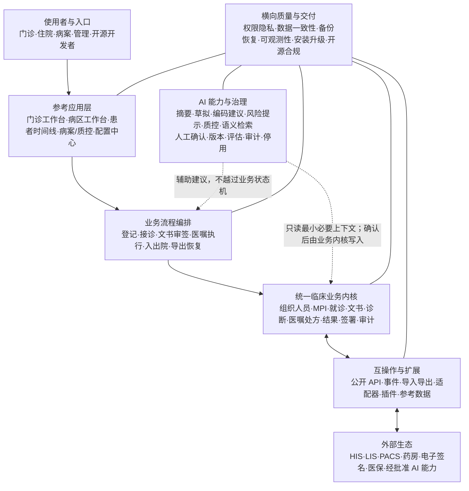
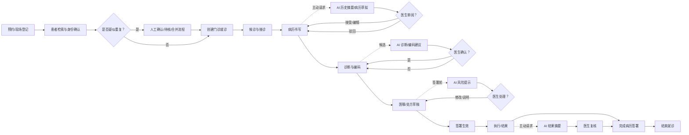
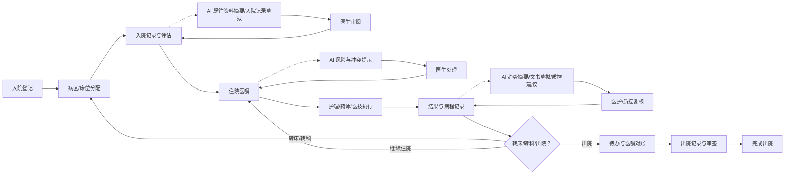
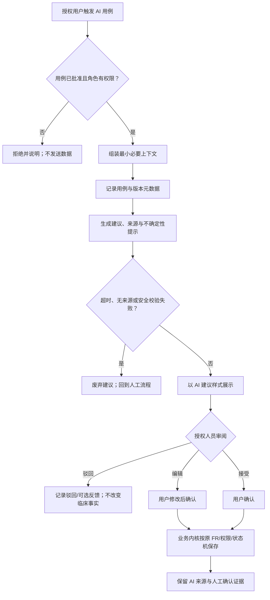

# openemr2026 v0.1 产品需求文档

## 0. 文档控制

| 项目 | 内容 |
|---|---|
| 产品名称 | `openemr2026` |
| 产品版本 | v0.1，覆盖首个 180 天 Alpha → Beta → Release Candidate |
| 文档版本 | PRD v0.2 |
| 文档状态 | `DRAFT` |
| 交付状态 | `CREATED`；不代表需求已经由项目发起人批准 |
| 工作模式 | S002 / `DRAFT` |
| 编写日期 | 2026-08-11（Asia/Shanghai） |
| 上游战略 | `strategy/2026-08-11-china-open-source-emr-strategy.md` v0.2 |
| 产品平台 | 首期为桌面浏览器 Web 应用、管理与部署工具、公开 API；H5/小程序/原生 App 不在本期 |
| 产品目标 | 面向诊所、基层及一二三级医院的统一开源 EMR；机构差异通过模块、配置与集成处理，不分叉核心代码 |
| 技术边界 | 医疗业务内核自主设计和实现；不以现有开源 EMR/HIS/EHR 为底座；技术栈与拓扑由 S004/S005 决定 |

### 0.1 事实、假设与缺失输入

| ID | 内容 | 来源类型 | 置信度 | 处理 |
|---|---|---|---|---|
| FACT-001 | 产品面向诊所、基层及一二三级医院 | `EXPLICIT` | 高 | 作为不可随意缩减的长期产品边界 |
| FACT-002 | 不按机构类型分叉核心代码 | `EXPLICIT` | 高 | 作为所有 FR 和下游设计约束 |
| FACT-003 | 不使用现有开源 EMR/HIS 作为开发底座 | `EXPLICIT` | 高 | 依赖清单与代码来源必须可审计 |
| FACT-004 | 首期交付通用临床内核、门诊参考应用和基础住院流程 | `EXPLICIT` | 高 | 本 PRD 的版本范围 |
| FACT-005 | GitHub Stars、官方可安装发行版有效下载为一级结果 | `EXPLICIT` | 高 | KPI-001/KPI-002 |
| FACT-006 | 安装、安全、数据一致性和恢复为质量门禁 | `EXPLICIT` | 高 | 稳定版发布的阻断条件 |
| FACT-007 | 电子病历系统应覆盖授权认证、审计、患者主索引、门急诊/住院病历、备份恢复和升级后数据继承 | `OBSERVED` | 高 | 国家卫健委功能规范基线 |
| FACT-008 | 正式产品名为 `openemr2026` | `EXPLICIT` | 高 | 用于文档、产品界面和发行制品 |
| FACT-009 | AI 能力需融合进临床、质控和运维工作流 | `EXPLICIT` | 高 | 增加 AI 业务规则、FR、AC、NFR 和风险门禁 |
| ASM-001 | 单一临床内核可用模块与配置覆盖不同机构 | `INFERRED` | 中 | 用跨机构评审和流程演示验证 |
| ASM-002 | 首期门诊参考应用可作为诊所独立应用和医院门诊集成样例 | `INFERRED` | 中 | 不包含完整收费、药房和医保闭环 |
| ASM-003 | 基础住院流程足以验证住院模型，但不等同完整医院 EMR | `INFERRED` | 高 | 明确能力声明与版本标签 |
| Q-001 | 产品名已确定为 `openemr2026`；商标和主仓库地址待定 | `PARTIALLY_RESOLVED` | 中 | 公开发布前完成商标与仓库核查 |
| Q-002 | 最终开源许可证及贡献协议 | `UNKNOWN` | 中 | 代码公开前取得法律意见 |
| Q-003 | 团队规模、技术栈和 180 天实际产能 | `UNKNOWN` | 低 | S004/S007 规划时确认 |
| Q-004 | 大中小规模性能基线、SLO、RPO 和 RTO | `UNKNOWN` | 低 | Alpha 压测与恢复演练后基线化 |
| Q-005 | 目标电子病历应用水平分级评价等级 | `UNKNOWN` | 中 | 不在 v0.1 宣称达到具体等级 |

### 0.2 修订记录

| 版本 | 日期 | 变更 | 影响 |
|---|---|---|---|
| v0.1 | 2026-08-11 | 基于战略 v0.2 首次创建 | 建立范围、角色、FR/NFR/AC、风险和下游交接基线 |
| v0.2 | 2026-08-11 | 确定产品名 `openemr2026`；增加业务流程图、产品能力架构、逐条 FR 详细规格和 AI 融合需求 | 扩展 S003/S004/S009 交接基线；新增 AI 安全与治理门禁 |

## 1. 执行摘要

### 1.1 问题

中国医疗机构缺少一套同时满足以下条件的开源 EMR：医疗业务内核自主可控、可覆盖诊所到医院、符合中国病历和数据治理要求、能够独立部署或与既有系统集成、代码和文档便于开发者学习与贡献。

### 1.2 价值主张

- 对医务人员：提供连贯的患者时间线、病历书写、诊断、医嘱/处方、结果和签署流程。
- 对医疗机构：提供数据自主、权限审计、版本追溯、导出、备份恢复和渐进集成能力。
- 对 IT/实施人员：提供可安装、可升级、可观察、可扩展且不按机构复制分叉的产品。
- 对开源开发者：提供真实、现代、可运行、面向中国医疗流程的开源工程样板。

### 1.3 本期目标

1. 建立统一的组织、人员、权限、患者、就诊、文书、诊断、医嘱、签名、版本和审计产品契约。
2. 交付可完成门诊临床主流程的参考应用。
3. 交付可验证入院、病区/床位、住院文书、医嘱执行、护理记录和出院的基础住院流程。
4. 交付 AI 治理基础与可控的临床辅助能力，覆盖摘要、文书草拟、结构化、编码建议、用药/医嘱风险提示、结果摘要与病历质控，所有临床输出由授权人员确认。
5. 交付公开可安装发行版、合成数据、API 示例、中英文核心文档和贡献入口。
6. 建立 Stars、发行版下载和独立安装的透明统计口径。
7. 通过安装、安全、数据一致性、备份恢复、升级回滚与 AI 安全门禁后，才允许发布稳定版本。

### 1.4 非目标

- 180 天内完成三级医院全部临床、医技、运营、评审和高可用功能。
- 完整重建收费、医保、ERP、LIS、PACS、CA、支付和所有专科系统。
- H5、小程序、iOS、Android 或患者端原生应用。
- 使用 AI 自动诊断、自动处方、自动执行医嘱、自动签署或替代医务人员最终判断。
- 使用其他开源 EMR/HIS/EHR 作为代码或业务模型底座。
- Alpha/Beta 版本直接承载真实生产诊疗。

### 1.5 成功指标

| ID | 指标 | 定义与口径 | Day 90 挑战目标 | Day 180 挑战目标 | 数据源 | 状态 |
|---|---|---|---:|---:|---|---|
| KPI-001 | GitHub Stars | 主仓库累计 Stars；同时记录 30 天净新增 | 300 | 1,500 | GitHub API/仓库页面 | `PLANNED` |
| KPI-002 | 官方可安装发行版有效下载 | 仅汇总官方 Release 中可安装资产；排除源码自动归档、校验文件、签名文件、CI 测试资产；按 Alpha/Beta/RC/Stable 渠道分别报告 | Alpha 100 | RC/Stable 合计 1,000；Stable 单独披露 | GitHub Release/制品仓库 | `PLANNED` |
| KPI-003 | 外部独立成功安装 | 未参与核心开发者在干净环境按文档启动演示并完成健康检查；同一人同一版本重复安装只记一次 | 5 | 20 | 安装验证记录；匿名遥测仅在明确同意后使用 | `PLANNED` |
| KPI-004 | 开发者启动成功率 | 受邀外部开发者在 30 分钟内启动演示的比例 | ≥80% | ≥80% | 任务观察记录 | `PLANNED` |
| KPI-005 | P0 数据一致性缺陷 | 导致患者错配、病历覆盖、签名失真、医嘱/结果错误关联或恢复后数据缺失的缺陷数 | 0 未处置 | 0 未处置 | 测试与缺陷系统 | `PLANNED` |
| KPI-006 | 高危安全缺陷 | 按采用的漏洞严重度标准判定为高危/严重且未处置的缺陷数 | 0 | 0 | 安全扫描、人工测试与披露渠道 | `PLANNED` |
| KPI-007 | 恢复完整率 | 控制数据集恢复后，患者、就诊、病历版本、签名元数据、附件和审计记录通过完整性校验的比例 | 100% | 100% | 自动化恢复验证报告 | `PLANNED` |
| KPI-008 | AI 高严重度安全事件 | AI 建议导致或可合理导致错误患者、错误用药/医嘱、隐私泄露、绕过人工确认的未处置事件数 | 0 | 0 | AI Evals、红队、事件与反馈系统 | `PLANNED` 质量门禁 |

KPI-001/002 为一级结果；KPI-003–008 为产品真实性和发布质量门禁。AI 的日活、调用量与接受率只作为诊断指标，不替代 Stars 和有效下载的一级结果地位。挑战目标来自战略草案，不是基于历史增长做出的预测；公开发布 30 天后允许修订数值，但必须保留原目标和修订原因。

## 2. 背景与证据

| 证据 ID | 来源 | 日期/核查日 | 结论 | 来源类型 | 置信度 |
|---|---|---|---|---|---|
| E-001 | 项目发起人 | 2026-08-11 | 不限制目标机构等级，不使用现有开源 EMR 底座，开源影响力优先 | `EXPLICIT` | 高 |
| E-002 | 战略方案 v0.2 | 2026-08-11 | 单一临床内核、模块化交付、诊所独立与医院集成 | `INFERRED` | 中 |
| E-003 | 国家卫健委《电子病历系统功能规范（试行）》 | 2026-08-11 核查 | EMR 覆盖门急诊、病房及医技信息；基础功能包括授权认证、审计、存储、隐私、主索引、备份恢复 | `OBSERVED` | 高 |
| E-004 | 国家卫健委《电子病历应用管理规范（试行）》 | 2026-08-11 核查 | 病历查阅、书写、归档、复制、修改痕迹和保存受规范约束 | `OBSERVED` | 高 |
| E-005 | 《医疗机构病历管理规定（2013 年版）》 | 2026-08-11 核查 | 同一患者唯一标识；机构保管的门急诊病历不少于 15 年，住院病历不少于 30 年 | `OBSERVED` | 高 |
| E-006 | 《个人信息保护法》第 28–30 条 | 2026-08-11 核查 | 医疗健康信息属于敏感个人信息，需特定目的、充分必要和严格保护 | `OBSERVED` | 高 |
| E-007 | 《网络数据安全管理条例》 | 2026-08-11 核查 | 网络数据处理需安全治理、事件处置和个人信息保护 | `OBSERVED` | 高 |
| E-008 | 电子病历应用水平分级评价通知 | 2026-08-11 核查 | 二级以上医院适用分级评价；v0.1 不据此宣称达到具体等级 | `OBSERVED` | 高 |
| E-009 | GitHub 竞品快照 | 2026-08-11 | OpenEMR 约 5.4k、Medplum 约 2.6k、OpenMRS Core 约 1.9k Stars | `OBSERVED` | 中 |

## 3. 用户、角色与权限

### 3.1 角色表

| 角色 ID | 角色 | 使用情境 | 目标 | 默认数据范围 | 关键权限 |
|---|---|---|---|---|---|
| ROLE-001 | 机构系统管理员 | 初始化机构、组织、账户与配置 | 可控地启用产品 | 本机构配置；默认不可查看临床正文 | 组织、账户、角色、参考数据、系统状态 |
| ROLE-002 | 安全管理员 | 权限审查、审计和安全响应 | 最小权限与可追责 | 本机构安全与审计元数据 | 授权策略、审计查询、账户冻结；不可修改临床记录 |
| ROLE-003 | 医生 | 门急诊和住院诊疗 | 完成病历、诊断、医嘱、处方和签署 | 被分配/授权的患者和就诊 | 创建与签署本人职责内临床记录 |
| ROLE-004 | 上级/审签医生 | 审阅实习、试用或下级医生记录 | 完成双签和质量把关 | 本科室或授权范围 | 审阅、退回、共同签署 |
| ROLE-005 | 护士 | 病区与门诊护理 | 执行医嘱、记录观察与护理 | 所属单元和班次内患者 | 护理记录、生命体征、执行状态 |
| ROLE-006 | 药师 | 处方审核与调剂衔接 | 保障用药流程职责分离 | 授权处方和患者必要信息 | 审核、退回、记录调剂/发药结果 |
| ROLE-007 | 医技人员 | 检验检查申请和结果衔接 | 接收申请并回传结果 | 所属医技单元任务 | 接单、状态更新、结果录入/确认 |
| ROLE-008 | 病案管理员 | 归档、封存、复制和长期保存 | 管理完整病案 | 授权归档病历 | 归档检查、封存、复制、导出 |
| ROLE-009 | 质控人员 | 抽查和反馈病历缺陷 | 提升病历完整性和时效 | 授权科室/项目病历 | 质控抽取、缺陷记录、反馈；不可改写原文 |
| ROLE-010 | 集成管理员 | 配置外部系统连接与排错 | 可靠交换数据 | 接口配置、消息元数据；临床正文最小化 | 连接配置、重放、对账、状态查看 |
| ROLE-011 | 患者服务人员 | 预约、登记和身份维护 | 正确创建/匹配患者和就诊 | 登记所需人口学与就诊信息 | 查询、登记、修正待核信息；不可看非必要病历正文 |
| ROLE-012 | 开源开发者/部署者/项目维护者 | 本地运行、扩展、贡献或发布 | 快速理解、使用和维护项目 | 仅合成数据和项目运营元数据 | 安装演示、调用公开 API、开发插件、按授权发布版本与查看开源指标 |
| ROLE-013 | AI 管理员/医疗 AI 治理负责人 | 配置 AI 使用范围、模型/提示版本、评估和停用策略 | 让 AI 可用、可控、可审计、可随时退出 | 本机构 AI 配置、评估及运行元数据；默认不可查看临床正文 | 用例启停、版本发布、评估门禁、事件处置；不可替医务人员签署 |

### 3.2 权限表达规则

权限必须使用“主体—资源—动作—范围—条件”表达。例如：

> ROLE-003 医生 — 临床文书 — 创建/查看/签署 — 本人当前负责或经授权的就诊 — 账户有效、执业角色有效、就诊未关闭且未封存。

不得仅以“管理员/普通用户”二分权限；组织、科室、病区、患者关系、时间、文书状态和紧急访问均需进入权限条件。

## 4. 范围

### 4.1 v0.1 范围内

#### P0 通用临床内核

- 机构、科室、病区、床位、人员、角色和数据范围。
- 患者主索引、身份检索、重复识别、合并和纠错。
- 门诊、急诊、住院三类就诊的共同状态与关联。
- 临床文书模板、草稿、签署、双签、版本、更正、归档和封存。
- 诊断、医嘱、处方、执行和结果的基础对象与状态。
- 患者临床时间线、审计、检索、打印和电子导出。
- 参考数据版本、外部标识和交换状态。

#### P0 门诊参考应用

- 预约/现场登记、候诊、接诊、病历、诊断、医嘱/处方、结果查看、签署和结束就诊。
- 支持诊所独立演示，也支持医院门诊以外部标识和接口衔接既有系统。
- 不含完整收费、医保结算、药房库存与经营分析。

#### P1 基础住院流程

- 入院登记、病区/床位分配、住院就诊、基础住院文书、医嘱执行、护理记录、转床/转科、出院记录和就诊结束。
- 目标是验证共同内核和基本临床闭环，不宣称覆盖完整住院 EMR 评价条目。

#### P0 开源发行与质量

- 合成演示数据、安装路径、升级与回滚说明、备份恢复、公开 API 示例。
- README、中英文核心文档、安全与贡献政策、版本和制品可追溯。
- Stars、发行版下载和外部安装指标统计。

#### P0/P1 AI 融合能力

- P0 AI 治理基座：机构级启停、用例白名单、模型/提示/知识版本、人工确认、评估门禁、审计、反馈、降级与紧急停用。
- P0 临床信息摘要和病历草拟：只基于当前授权上下文生成建议，来源可回看，不自动写入已签署病历。
- P1 诊断/编码候选、医嘱/处方风险提示、检验检查结果摘要和病历质控建议。
- P1 带临床来源引用的患者记录语义检索与问答；无证据时必须明确说明。
- AI 不可用、超时或被机构停用时，核心 EMR 流程仍必须可用。

### 4.2 v0.1 范围外

- 完整 HIS 收费、医保结算、财务、供应链、固定资产和人力资源。
- 完整 LIS、PACS、病理、输血、手麻、重症、院感、手术排程和体检系统。
- 完整药库、库存、采购、拆零、调剂计价和受控药品全套监管。
- 所有专科深度模板和全部地方监管接口。
- 患者端移动应用、互联网医院、远程诊疗和线上支付。
- AI 自主诊疗、自动处方、自动执行医嘱、自动签署、未经人工复核直接改变临床事实，以及默认使用临床数据训练外部模型。
- 生产级三级医院高可用承诺和具体电子病历分级评价等级承诺。

### 4.3 依赖与约束

- 可使用成熟通用开源基础组件，但不得复制现有开源 EMR/HIS 的业务代码和受保护资产。
- 演示、测试、公开 Issue 和文档只能使用合成或经批准的脱敏数据。
- 电子签名、医保、支付、LIS、PACS 等通过产品契约和模拟器定义；真实供应商接入不是 v0.1 必备交付。
- 技术栈、服务边界、数据库和部署拓扑由 S004/S005 设计，PRD 不作选择。
- AI 能力可由本地、机构私有环境或经批准外部能力提供；本 PRD 只定义产品行为、数据边界和验收门禁，具体实现由 S004/S005 决定。

### 4.4 产品能力架构图

> 下图是产品能力分层，不规定微服务、数据库或模型供应商。所有机构共用同一临床内核，通过模块、配置和集成适配差异。

## 5. 核心对象、流程与状态

### 5.1 核心对象

| 对象 | 产品含义 | 关键约束 |
|---|---|---|
| Organization | 医疗机构或机构集团 | 作为数据、配置和授权边界之一 |
| Department/Unit | 科室、病区、护理单元、医技单元 | 允许层级和有效期 |
| Practitioner/User | 医务人员身份与系统账户 | 人员身份、账户和执业角色分离管理 |
| Patient/MPI | 患者主索引及多种外部标识 | 内部唯一标识不可由身份证或手机号直接替代 |
| Encounter | 门诊、急诊或住院的一次就诊 | 状态、机构、科室、负责人员和时间可追溯 |
| ClinicalDocument | 病历文书及其版本 | 草稿可编辑；签署版本不可覆盖 |
| Diagnosis | 与就诊关联的诊断 | 编码、名称、类型、状态、记录人和时间可追溯 |
| Order/Prescription | 医嘱、检查检验申请或处方 | 状态变化和职责分离可追溯 |
| Execution/Result | 医嘱执行与临床结果 | 必须关联正确患者、就诊和原始医嘱 |
| Signature | 签署人与签署时间等证据 | 不等同于普通“保存”操作 |
| AuditRecord | 用户、资源、动作、结果、原因和上下文 | 普通用户不可修改或删除 |
| ExportPackage | 可独立读取的病历复制/导出包 | 范围、生成者、时间和校验信息可追溯 |
| AIUseCasePolicy | 机构批准的 AI 用例、数据范围、角色、版本和停用策略 | 未发布或未通过评估的用例不可向临床用户开放 |
| AIProposal | AI 基于特定患者/就诊上下文生成的摘要、草拟、候选、风险或质控建议 | 必须区分于临床事实，保留来源、版本、生成时间、确认/驳回状态和操作人 |
| AIEvaluationRecord | AI 用例的离线评估、红队、上线审批与运行反馈记录 | 与用例、模型/提示/知识版本和发行版本关联，不保存无必要的隐藏推理内容 |

### 5.2 主流程

| 流程 ID | 入口 | 主路径 | 失败/中止 | 恢复/完成 |
|---|---|---|---|---|
| FLOW-01 机构初始化 | 首次安装或新增机构 | 建立机构→科室/病区→人员→角色→参考数据 | 配置不完整、权限冲突 | 阻止启用受影响模块并提供校验清单 |
| FLOW-02 患者登记 | 预约、现场或外部系统消息 | 检索→候选匹配→确认已有或创建→分配内部唯一标识 | 身份不明、疑似重复、外部系统超时 | 创建临时身份或待核记录；后续合并/纠错 |
| FLOW-03 门诊诊疗 | 到诊或外部挂号 | 到诊→接诊→病历→诊断→医嘱/处方→结果→签署→结束 | 无权限、重复提交、接口失败、患者中止 | 保留草稿/待处理任务；授权后继续或撤销就诊 |
| FLOW-04 住院基础 | 入院通知或人工登记 | 入院→病区/床位→住院文书→医嘱/执行→护理→转科/床→出院 | 无床位、转科冲突、医嘱未完成 | 进入待处理状态；完成对账或授权豁免后出院 |
| FLOW-05 病历签署更正 | 文书草稿完成 | 提交审签→单签/双签→签署→归档→必要时封存 | 并发编辑、签署资格失效、必填缺失 | 退回草稿；签署后通过新增更正版本处理 |
| FLOW-06 集成交换 | 外部请求或本地事件 | 鉴权→校验→接收/发送→确认→对账 | 超时、重复消息、格式错误、下游拒绝 | 幂等重试、人工重放、死信/失败队列和差异处理 |
| FLOW-07 备份恢复 | 计划任务或灾难恢复演练 | 备份→校验→隔离环境恢复→对象一致性验证→报告 | 备份损坏、版本不兼容、附件缺失 | 阻止宣告成功；使用上一份可用备份并报告差异 |
| FLOW-08 AI 临床辅助 | 授权用户在患者/就诊上下文中主动请求或触发已批准规则 | 权限与用例校验→最小化上下文→生成建议与来源→人工审阅/编辑→接受或驳回→业务内核按原有规则保存 | 无权限、用例未批准、超时、无来源、低可信、内容攻击或服务不可用 | 不写入临床事实；展示原因并回到人工流程；事件可审计和停用 |

### 5.3 业务流程图

#### 5.3.1 门诊诊疗与 AI 辅助

#### 5.3.2 基础住院流程与 AI 辅助

#### 5.3.3 AI 建议的通用受控流程

### 5.4 状态机

#### 患者身份状态

| 状态 | 进入条件 | 允许动作 | 退出条件 | 异常恢复 |
|---|---|---|---|---|
| 待核身份 | 急诊或信息不足 | 补充信息、关联就诊 | 身份核实 | 保留所有历史关联 |
| 有效 | 信息达到机构最低要求 | 检索、关联、维护非关键字段 | 合并、停用 | 关键字段修改保留前后值和原因 |
| 疑似重复 | 查重命中 | 比较、排除、提交合并 | 确认为不同患者或完成合并 | 不允许自动覆盖 |
| 已合并 | 经授权确认同一患者 | 通过主记录访问历史 | 依法/按机构流程撤销合并 | 保留原标识和合并链路 |
| 停用 | 错误创建或其他合法原因 | 查询历史、审计 | 授权恢复 | 不物理删除关联临床数据 |

#### 就诊状态

| 状态 | 进入条件 | 允许动作 | 退出条件 | 异常恢复 |
|---|---|---|---|---|
| 计划中 | 预约或预入院 | 修改计划、取消 | 到诊/入院 | 取消保留原因 |
| 已到达/已入院 | 身份和机构确认 | 分配医生/床位、开始诊疗 | 诊疗中 | 身份待核时标记风险 |
| 诊疗中 | 医务人员开始处理 | 文书、诊断、医嘱、执行 | 完成、暂停 | 中断后继续；并发冲突需处理 |
| 暂停 | 等待结果、转科或异常 | 查看、处理阻塞 | 恢复诊疗或取消 | 记录暂停原因与时长 |
| 已完成/已出院 | 必备项目完成或经授权豁免 | 查看、打印、归档 | 更正或封存不改变完成事实 | 新增更正记录，不回写覆盖 |
| 已取消 | 合法取消 | 查看与审计 | 不再激活；需要时新建就诊 | 保留取消原因 |

#### 临床文书状态

| 状态 | 进入条件 | 允许动作 | 退出条件 | 异常恢复 |
|---|---|---|---|---|
| 草稿 | 创建文书 | 授权编辑、暂存、删除未提交草稿 | 提交审签 | 并发冲突保留双方内容供选择 |
| 待审签 | 作者提交 | 审阅、退回、共同签署 | 退回草稿或签署 | 审签人失效时重新分配 |
| 已签署 | 合格人员完成签署 | 查看、打印、发起更正/归档 | 归档或封存 | 禁止原地覆盖 |
| 已归档 | 符合归档规则 | 查阅、复制、发起补充/更正 | 封存 | 更正生成关联新版本 |
| 已封存 | 依法或机构流程封存 | 授权查阅/复制 | 依法启封 | 所有动作写入审计 |

#### 医嘱/处方状态

| 状态 | 进入条件 | 允许动作 | 退出条件 | 异常恢复 |
|---|---|---|---|---|
| 草稿 | 医生创建 | 编辑、删除 | 提交/签署 | 重复提交不产生重复医嘱 |
| 已生效 | 签署且校验通过 | 接收、执行、停止 | 执行中/完成/停止 | 接口失败可重试但保持同一业务标识 |
| 执行中 | 执行方已接收 | 记录部分执行与异常 | 完成/停止 | 失败需记录原因和后续动作 |
| 已完成 | 全部执行或结果确认 | 查看、关联结果 | 终态 | 更正通过补充记录处理 |
| 已停止/已取消 | 有权限人员依法停止或取消 | 查看、审计 | 终态 | 已执行部分不得被抹除 |

#### AI 建议状态

| 状态 | 进入条件 | 允许动作 | 退出条件 | 异常恢复 |
|---|---|---|---|---|
| 生成中 | 通过用例、权限与数据范围校验 | 取消、等待 | 生成成功或失败 | 超时后不自动重复写入，用户可显式重试 |
| 待审阅 | 建议通过安全与格式校验 | 查看来源、编辑、接受、驳回 | 用户完成处理 | 上下文已变化时标记过期并要求重新生成 |
| 已接受 | 授权用户明确确认 | 按对应 FR 继续编辑、签署或执行 | 业务内核完成保存 | 业务校验失败时保留为草稿，不绕过原状态机 |
| 已驳回 | 授权用户拒绝建议 | 查看、可选提交反馈 | 终态 | 不写入临床事实 |
| 已过期 | 患者、就诊、文书或医嘱上下文已变化 | 查看过期原因、重新生成 | 新建议生成 | 旧建议不得被接受 |
| 已失败/已阻断 | 超时、服务不可用、内容或政策校验失败 | 查看非敏感原因、回到人工流程 | 用户显式重试或管理员恢复服务 | 核心 EMR 不受阻断 |

## 6. 业务规则

| ID | 规则 |
|---|---|
| BR-001 | 所有机构类型使用同一核心对象和状态契约；机构差异由模块、配置、扩展点和集成处理。 |
| BR-002 | 每位患者必须有内部唯一标识；身份证、医保号、手机号和病案号只能作为关联标识。 |
| BR-003 | 身份信息不足时允许创建待核患者，但必须显著标识并支持后续核实、合并和纠错。 |
| BR-004 | 患者合并需双人或等价授权复核；保留原标识、操作人、时间、原因和关联历史。 |
| BR-005 | 账户、人员身份和执业/岗位角色分离；账户停用不得删除既往签署和审计。 |
| BR-006 | 权限遵循最小必要，包含机构、科室/病区、患者关系、资源、动作、时间和状态条件。 |
| BR-007 | 紧急越权访问必须说明原因、限时生效、实时记录并进入事后审查。 |
| BR-008 | 草稿可以由授权作者编辑；提交审签后未经退回不得继续编辑。 |
| BR-009 | 已签署文书不可原地覆盖；任何补充、更正或撤销必须形成新版本并关联原版本。 |
| BR-010 | 实习、试用或机构规定需上级审签的人员，其文书必须完成双签后才视为已签署。 |
| BR-011 | 系统必须区分保存、提交、签署、归档和封存，不得用一个操作隐含多种法律/业务状态。 |
| BR-012 | 医嘱和处方状态变化必须记录操作者、时间、原因和已执行部分；停止不得抹除历史执行。 |
| BR-013 | 处方开具、审核和调剂职责按机构规则分离；同一主体不得在不符合授权条件时跨角色完成。 |
| BR-014 | 重复点击、网络重试或重复接口消息不得产生重复患者、就诊、文书、医嘱或结果。 |
| BR-015 | 外部交换必须使用可追踪的业务标识、发送/接收状态、重试次数和最终处理结果。 |
| BR-016 | 所有临床页面必须持续展示足以辨认患者和当前就诊的关键信息，降低患者错配风险。 |
| BR-017 | 机构保管的门急诊病历至少保存 15 年，住院病历至少保存 30 年；具体更长要求可配置但不得低于适用法规。 |
| BR-018 | 公开仓库、演示、测试、文档和 Issue 默认只允许合成数据；真实数据使用必须单独批准。 |
| BR-019 | Alpha/Beta 默认标记为非生产用途；稳定版只有在质量门禁全部通过后才可发布。 |
| BR-020 | 病历导出必须可独立读取，包含范围、生成者、时间和完整性校验信息。 |
| BR-021 | 普通用户不得修改或删除审计记录；审计查询和导出本身也必须被审计。 |
| BR-022 | 诊断、药品、项目等参考数据必须有版本和有效期；历史记录不得随字典更新静默改变。 |
| BR-023 | 系统不得声称达到电子病历应用水平具体等级，除非完成对应范围的独立评价和证据审查。 |
| BR-024 | Stars、下载和安装统计必须公开口径；不得将源码归档、校验文件或 CI 拉取计入有效下载。 |
| BR-025 | AI 输出默认是“建议”而非临床事实；未经授权人员明确审阅与确认，不得进入已签署文书、已确认诊断、已生效医嘱/处方或已确认结果。 |
| BR-026 | AI 不得自动诊断、自动处方、自动执行医嘱或自动签署；人工确认不得被默认勾选、批量隐藏或用超时自动代替。 |
| BR-027 | AI 只能读取当前用户已有权限且用例必要的数据；默认禁止将临床数据用于外部模型训练，默认禁止未经批准的跨机构或跨患者上下文拼接。 |
| BR-028 | 每个 AI 建议必须关联用例、患者/就诊、输入来源、生成时间、模型/提示/知识版本、生成结果状态和人工处理结果；不要求保存无必要的隐藏推理过程。 |
| BR-029 | AI 不可用、超时、输出不合规或被紧急停用时，必须安全降级为原有人工流程，不得阻断登记、病历书写、医嘱、执行、签署和备份恢复。 |
| BR-030 | 涉及患者历史、诊断、用药、医嘱、结果或质控的 AI 输出必须提供可回看的记录来源；无足够证据时必须显示“无足够证据”，不得伪造来源。 |
| BR-031 | 每个 AI 用例的新模型、新提示、新知识版本或重大配置变更必须先通过对应的离线评估、安全测试和批准门禁；机构可随时按用例紧急停用。 |

## 7. 功能需求

### 7.1 通用内核

| ID | 用户/场景 | 可观察行为 | 状态、异常与权限 | BR | AC | 优先级 |
|---|---|---|---|---|---|---|
| FR-001 | 管理员初始化机构 | 创建机构、科室、病区、床位和有效期层级；机构停用后历史记录仍可查 | 循环层级、重复编码或无上级关系时拒绝保存；ROLE-001 管理 | BR-001 | AC-001 | P0 |
| FR-002 | 管理员维护人员与账户 | 分别维护人员身份、账户状态和角色任期；账户停用不影响历史署名 | 无有效角色不得进入临床工作台；管理员不能通过改名改变历史签署人 | BR-005 | AC-002 | P0 |
| FR-003 | 安全管理员授权 | 按主体、资源、动作、机构/科室/病区、患者关系、时间和状态配置权限 | 无权操作返回明确拒绝且不泄露资源存在性；授权变更可审计 | BR-006 | AC-003 | P0 |
| FR-004 | 登记人员创建/查找患者 | 支持按内部标识和多种人口学/外部标识检索；创建时分配内部唯一标识；支持待核身份 | 匹配候选必须由用户确认；网络重复提交不得创建重复记录 | BR-002、BR-003、BR-014 | AC-004 | P0 |
| FR-005 | 授权人员处理重复患者 | 展示差异，执行合并、撤销合并或纠错；所有原标识和临床关联可追溯 | 高风险冲突阻止自动合并；需双人/等价复核 | BR-004 | AC-005 | P0 |
| FR-006 | 临床/登记人员管理就诊 | 创建门诊、急诊和住院就诊；关联机构、科室、负责人员、状态和外部标识 | 非法状态跳转被拒绝；重复消息不新建重复就诊 | BR-001、BR-014 | AC-006 | P0 |
| FR-007 | 医务人员查看患者时间线 | 按时间和资料类型查看门急诊、住院、文书、诊断、医嘱、结果和版本 | 无资料显示空状态；无权限资料不展示正文且访问被记录 | BR-006、BR-016 | AC-007 | P0 |
| FR-008 | 管理员/临床专家维护模板 | 创建、发布、停用和版本化通用及机构模板；历史文书保持原模板语义 | 未发布模板不可用于新文书；模板更新不改写历史文书 | BR-022 | AC-008 | P0 |
| FR-009 | 医务人员书写文书 | 创建、暂存、继续编辑、提交审签；支持结构化字段和叙述文本 | 并发编辑提示冲突；自动/手动暂存失败时明确提示且不静默丢失内容 | BR-008、BR-011、BR-014 | AC-009 | P0 |
| FR-010 | 医生/上级医生签署 | 根据角色完成单签或双签；签署前显示最终内容和必填缺失 | 资格失效、必填缺失或文书版本已变化时阻止签署 | BR-009、BR-010、BR-011 | AC-010 | P0 |
| FR-011 | 医生/病案人员更正与封存 | 对已签署/归档文书发起补充、更正、封存和依法启封；保留版本链 | 禁止覆盖原文；封存后仅授权动作可执行 | BR-009、BR-011、BR-017 | AC-011 | P0 |
| FR-012 | 医生记录诊断 | 为就诊增加、确认、更正和停止诊断；支持编码、文本、类型和时间 | 参考数据更新不改变历史诊断；无权用户只读或不可见 | BR-022 | AC-012 | P0 |
| FR-013 | 医生开具医嘱/处方 | 创建草稿、签署生效、停止/取消医嘱和处方；显示状态与已执行部分 | 重复提交幂等；停止需原因；不得删除已执行历史 | BR-012、BR-013、BR-014 | AC-013 | P0 |
| FR-014 | 护士/药师/医技执行与回传 | 接收任务，记录接受、部分执行、完成、拒绝和结果；关联原医嘱与正确就诊 | 患者/就诊不匹配时阻断；重复结果不重复入账 | BR-012、BR-013、BR-014 | AC-014 | P1 |
| FR-015 | 紧急接诊人员 | 对身份不明患者建临时身份；有正当理由时申请紧急越权查看必要病历 | 越权限时、显著提示、必须填写原因并通知审查 | BR-003、BR-007 | AC-015 | P0 |
| FR-016 | 质控人员 | 按科室、医师、诊断、时间和文书状态抽取病历，记录缺陷并反馈 | 质控人不能直接改写临床原文；缺陷关闭需留痕 | BR-006、BR-021 | AC-016 | P1 |
| FR-017 | 所有授权用户/审计员 | 自动记录登录、查看、创建、修改、签署、导出、权限和紧急访问事件 | 审计写入失败时，高风险临床写操作必须失败关闭或进入明确受控降级 | BR-021 | AC-017 | P0 |
| FR-018 | 病案人员/患者服务人员 | 按权限打印、导出一次或多次就诊病历；生成可独立读取的复制件 | 空范围、无权限或生成失败时不产生不完整“成功”包 | BR-017、BR-020 | AC-018 | P1 |

### 7.2 门诊参考应用

| ID | 用户/场景 | 可观察行为 | 状态、异常与权限 | BR | AC | 优先级 |
|---|---|---|---|---|---|---|
| FR-019 | 前台/医生完成门诊主流程 | 从预约/现场登记进入候诊、接诊、病历、诊断、医嘱/处方、结果、签署和结束就诊 | 中途离开保留合法草稿；未签署必备文书时不能无提示结束 | BR-011、BR-016 | AC-019 | P0 |
| FR-020 | 医生使用门诊工作台 | 同一工作区看到患者身份、当前就诊、历史摘要、当前文书、诊断、医嘱和结果任务 | 患者切换需明显确认；无历史资料显示空状态 | BR-006、BR-016 | AC-020 | P0 |

### 7.3 基础住院流程

| ID | 用户/场景 | 可观察行为 | 状态、异常与权限 | BR | AC | 优先级 |
|---|---|---|---|---|---|---|
| FR-021 | 入院处/护士/医生完成基础住院流程 | 创建入院、分配病区床位、书写住院文书、下达与执行医嘱、护理记录、转科/床、出院 | 床位冲突被阻止；未完成关键任务时出院需处理或授权豁免 | BR-001、BR-012、BR-016 | AC-021 | P1 |
| FR-022 | 医生/护士管理病区工作 | 按病区查看当前住院患者、床位、待办文书、待执行医嘱和异常任务 | 不显示其他未授权病区患者；转科后权限和待办按规则更新 | BR-006 | AC-022 | P1 |

### 7.4 集成、部署与开源发行

| ID | 用户/场景 | 可观察行为 | 状态、异常与权限 | BR | AC | 优先级 |
|---|---|---|---|---|---|---|
| FR-023 | 集成管理员交换数据 | 通过公开契约接收/发送患者、就诊、医嘱、结果和文书摘要；查看消息状态并重试/重放 | 鉴权失败、格式错误、超时和重复消息分别处理；临床正文最小化 | BR-014、BR-015 | AC-023 | P1 |
| FR-024 | 管理员维护参考数据 | 导入、查询、发布、停用和版本化诊断/药品/项目等参考数据 | 冲突版本需人工确认；历史临床记录保持原编码和值 | BR-022 | AC-024 | P1 |
| FR-025 | 部署者安装与体验 | 按公开文档在干净环境启动系统、加载合成数据、登录角色账户并完成健康检查 | 缺少前置条件时给出可操作错误；安装失败不得回传真实环境秘密 | BR-018、BR-019 | AC-025 | P0 |
| FR-026 | 管理员备份与恢复 | 发起/验证备份，在隔离环境恢复并生成对象完整性报告 | 任一核心对象或附件校验失败时整体状态为失败 | BR-017、BR-020 | AC-026 | P0 |
| FR-027 | 开源开发者学习与贡献 | 从 README 进入演示、架构、API、贡献、安全和 Good First Issue；可运行测试并提交改动 | 文档链接、示例和命令随 Release 验证；不得包含真实病历或秘密 | BR-018、BR-019 | AC-027 | P0 |
| FR-028 | 项目维护者发布版本 | 生成带版本、变更日志、兼容说明、校验值、升级/回滚说明和渠道标签的 Release | 质量门禁失败时阻止 Stable；Alpha/Beta 显著标记非生产 | BR-019、BR-023 | AC-028 | P0 |
| FR-029 | 项目维护者统计开源指标 | 展示 Stars、30 天新增、各渠道可安装资产下载和外部安装证据的口径与快照 | 不把源码包、校验文件、CI 或机器人拉取计入有效下载 | BR-024 | AC-029 | P0 |

### 7.5 AI 融合能力

| ID | 用户/场景 | 可观察行为 | 状态、异常与权限 | BR | AC | 优先级 |
|---|---|---|---|---|---|---|
| FR-030 | AI 管理员配置受控 AI 能力 | 按机构、用例、角色和环境启停 AI，管理模型/提示/知识版本、评估、发布、回退与紧急停用 | 未评估版本不得发布；停用后已有业务数据可查，新请求安全降级 | BR-027–031 | AC-030 | P0 |
| FR-031 | 医护获取患者/就诊摘要 | 基于授权时间线生成问题、诊断、用药、检查和待办摘要，可逐条回看来源 | 上下文变化后旧摘要过期；无来源或越权内容不展示 | BR-025、027–030 | AC-031 | P0 |
| FR-032 | 医护使用 AI 草拟/结构化文书 | 根据当前就诊记录和用户明确输入生成可编辑草拟，标识来源与缺失项 | 不自动签署；不确定内容不冒充事实；接受后仍按 FR-009/010 处理 | BR-025–030 | AC-032 | P0 |
| FR-033 | 医生获取诊断与编码候选 | 结合已记录症状、体征、结果和参考数据给出候选及证据来源 | 不自动确认诊断；无证据或编码失效时明确提示 | BR-025–031 | AC-033 | P1 |
| FR-034 | 医生在医嘱/处方签署前获取 AI 风险提示 | 对过敏、重复、相互作用、剂量/频次、禁忌和必要监测给出带证据的分级提示 | 不自动修改或签署；高风险提示需医生处理或记录理由；AI 不可用时不绕过原有硬性规则 | BR-025–031 | AC-034 | P1 |
| FR-035 | 医护查看检验检查结果摘要 | 归纳异常值、时间趋势、相关医嘱和待处理项，可回到原结果 | 不改写原结果；正常摘要不能被视为排除风险；结果变化后摘要过期 | BR-025、027–030 | AC-035 | P1 |
| FR-036 | 质控人员/医护获取 AI 病历质控建议 | 检查必填、一致性、时效性、明显矛盾和待签署项，生成可分派建议 | AI 不直接改写病历或自动关闭缺陷；误报/漏报可反馈并追溯版本 | BR-025–031 | AC-036 | P1 |
| FR-037 | 授权医务人员语义检索和问答患者记录 | 以自然语言查询当前授权患者记录，返回答案、来源片段、时间和不确定性 | 不跨越用户数据范围；无证据时拒绝编造；恶意指令不能改变权限或导出范围 | BR-026–031 | AC-037 | P1 |

### 7.6 功能需求详细规格

> 本节将上述摘要需求展开为产品、设计、开发和测试共同使用的行为契约。“输出”是产品结果，不代表数据库或接口实现。

#### FR-001 机构与组织初始化

- **用户/价值**：ROLE-001 将诊所、基层机构或医院的组织结构配置为统一产品上下文，为授权、就诊和统计提供边界。
- **前置/输入**：首次安装完成或已有上级机构；输入机构、科室、病区、床位、编码、上下级、有效期和启用模块。
- **主路径/输出**：创建或导入层级→预览校验→发布；输出可选组织范围和配置校验报告。
- **异常/恢复**：循环层级、重复编码、无效上级或被业务引用的破坏性变更被阻止；可修正后重试，停用不删除历史。
- **权限/数据**：仅 ROLE-001 在授权机构范围内管理；所有发布、停用和导入操作可审计。
- **关联**：BR-001；AC-001；NFR-005/019；RISK-001/002。

#### FR-002 人员、账户与角色任期

- **用户/价值**：ROLE-001 分离管理自然人、登录账户和执业/岗位角色，确保历史签署可追责。
- **前置/输入**：组织已发布；输入人员基本信息、账户标识、角色、数据范围和有效期。
- **主路径/输出**：查找/新建人员→绑定账户→分配有期限角色→启用；输出当前有效身份和权限摘要。
- **异常/恢复**：重复人员候选需确认；账户停用、角色过期后立即禁止新操作，恢复需新的授权记录。
- **权限/数据**：ROLE-001 可管理账户，不可修改已签署文书的签署人证据；高权限变更可供 ROLE-002 审查。
- **关联**：BR-005；AC-002；NFR-008/013；RISK-006。

#### FR-003 细粒度权限与拒绝

- **用户/价值**：ROLE-002 管理临床与管理权限，让用户只访问工作必需的患者和资源。
- **前置/输入**：角色、组织和资源类型已存在；输入主体、资源、动作、范围、患者关系、时间和状态条件。
- **主路径/输出**：配置策略→冲突预览→发布→请求时执行；输出允许或最小泄露的拒绝结果。
- **异常/恢复**：显式拒绝优先；策略冲突或计算失败时默认拒绝；授权管理员可修正策略后重试。
- **权限/数据**：只有 ROLE-002/特定 ROLE-001 可发布策略；权限变更、拒绝和紧急访问都写审计。
- **关联**：BR-006；AC-003；NFR-008/009/013；RISK-006。

#### FR-004 患者检索、匹配与登记

- **用户/价值**：ROLE-011 在建立就诊前找到正确患者，降低重复建档和错配。
- **前置/输入**：已进入授权机构；输入内部/外部标识或姓名、出生日期、性别、联系方式等最小必要信息。
- **主路径/输出**：检索→展示可区分的候选→用户确认已有或创建新患者→生成内部唯一标识。
- **异常/恢复**：身份不足时创建待核记录；高相似候选要求人工选择；重复提交只返回同一业务结果。
- **权限/数据**：ROLE-011 仅看登记必要信息；候选列表屏蔽不必要临床正文；查询和创建可审计。
- **关联**：BR-002/003/014；AC-004；NFR-003/005/012；RISK-005。

#### FR-005 重复患者合并与撤销

- **用户/价值**：授权的 ROLE-011/病案人员安全统一同一患者的分散记录。
- **前置/输入**：两条记录处于疑似重复；输入主记录选择、差异处理、合并原因和两次独立授权确认。
- **主路径/输出**：对比人口学/标识/就诊→处理冲突→双人复核→合并关联；输出主记录和可追溯映射。
- **异常/恢复**：关键身份或临床冲突未解决时阻止；合并错误可按授权流程撤销，恢复原关联而不丢数据。
- **权限/数据**：仅特定角色可执行；审核人不得为同一账户；对比、合并和撤销全链路审计。
- **关联**：BR-004；AC-005；NFR-005/013；RISK-005。

#### FR-006 统一就诊创建与状态管理

- **用户/价值**：登记和临床人员使用同一契约创建门诊、急诊和住院就诊，支撑跨机构类型能力复用。
- **前置/输入**：患者、机构/科室和负责人员有效；输入就诊类型、时间、来源、外部标识和初始状态。
- **主路径/输出**：创建→分配负责范围→按状态机迁移；输出唯一就诊、当前状态和状态历史。
- **异常/恢复**：无效组织、重复外部消息或非法跳转被拒绝；中断后从最后合法状态继续。
- **权限/数据**：创建者需有对应机构与就诊类型权限；转移和完成动作记录主体、时间与原因。
- **关联**：BR-001/014；AC-006；NFR-003/005；RISK-002/005。

#### FR-007 患者临床时间线

- **用户/价值**：ROLE-003/005 在授权范围内快速理解患者跨门诊和住院的临床历史。
- **前置/输入**：已确认患者与当前就诊；可输入时间、资料类型、机构和状态筛选。
- **主路径/输出**：默认按时间展示就诊、文书、诊断、医嘱、结果与版本；可展开原记录和来源。
- **异常/恢复**：无数据显示空状态；部分源失败标记未加载而不伪装完整；用户可重试。
- **权限/数据**：每条资料独立校验数据范围；无权限项不显示正文；访问行为可审计。
- **关联**：BR-006/016；AC-007；NFR-002/009/014；RISK-006/011。

#### FR-008 临床文书模板生命周期

- **用户/价值**：ROLE-001/009 与临床专家管理可复用模板，在不修改核心代码的前提下适配机构流程。
- **前置/输入**：已有文书类型与可用字段；输入模板范围、结构、必填、显示规则、版本和有效期。
- **主路径/输出**：创建草稿→预览→审核/发布→新文书引用当前有效版本；输出不可变的版本标识。
- **异常/恢复**：规则循环、字段缺失或不兼容变更被阻止；发布后通过新版本修正，旧文书保持原语义。
- **权限/数据**：模板发布权限独立配置；模板不得内置真实患者数据；变更可审计。
- **关联**：BR-022；AC-008；NFR-005/007；RISK-002。

#### FR-009 临床文书创建与编辑

- **用户/价值**：ROLE-003/005 安全记录结构化和叙述性临床内容，避免网络和并发导致丢失。
- **前置/输入**：就诊处于允许书写状态，用户有相应文书权限；输入模板、字段、文本和附件。
- **主路径/输出**：创建草稿→手动/自动暂存→继续编辑→提交审签；输出版本化草稿和保存状态。
- **异常/恢复**：保存失败保留本地可恢复内容并提示；并发冲突展示差异，禁止静默覆盖；重复提交幂等。
- **权限/数据**：仅授权作者可编辑草稿；审签后不得继续修改；查看、保存和提交可审计。
- **关联**：BR-008/011/014；AC-009；NFR-003/005；RISK-005。

#### FR-010 文书单签与双签

- **用户/价值**：ROLE-003/004 对最终文书内容进行明确签署，保留责任与版本证据。
- **前置/输入**：文书已提交，必填完整，用户角色和签署资格有效；输入待签版本与签署意图。
- **主路径/输出**：展示完整最终内容和缺失项→用户确认→单签或提交上级双签；输出已签署版本和签署证据。
- **异常/恢复**：资格过期、必填缺失、文书版本已变更或审签人无效时阻止；返回草稿修正或重新分配审签。
- **权限/数据**：仅符合机构签署规则的角色可执行；签署证据不可由普通管理员修改。
- **关联**：BR-009/010/011；AC-010；NFR-005/008/013；RISK-005/006。

#### FR-011 文书更正、归档与封存

- **用户/价值**：ROLE-003/008 在不覆盖原始病历的前提下补充或更正，并执行归档与封存。
- **前置/输入**：文书已签署或归档；输入操作类型、原因、新内容、目标版本和必要授权。
- **主路径/输出**：选择原版本→创建补充/更正→重新签署→更新版本链；病案人员可归档、封存或依流程启封。
- **异常/恢复**：目标版本不是当前链、无原因或封存中无特别授权时阻止；修正后重新发起。
- **权限/数据**：作者可发起更正，ROLE-008 执行归档/封存；原版本、新版本和所有操作不可删除。
- **关联**：BR-009/011/017；AC-011；NFR-005/013/014；RISK-005。

#### FR-012 诊断记录与编码

- **用户/价值**：ROLE-003 记录就诊的主要/次要、初步/确认诊断，支持历史与数据交换。
- **前置/输入**：就诊处于允许诊疗状态；输入诊断文本、有效编码/版本、类型、时间和状态。
- **主路径/输出**：检索参考数据→选择/输入→确认→按就诊排序；输出可追溯诊断及当时字典语义。
- **异常/恢复**：失效编码不允许新选但历史可查；更正或停止生成状态变更记录，不覆盖历史。
- **权限/数据**：只有授权诊疗角色可创建/确认；其他角色按数据范围只读或不可见。
- **关联**：BR-022；AC-012；NFR-005/019；RISK-010。

#### FR-013 医嘱与处方开立、生效和停止

- **用户/价值**：ROLE-003 以可追溯状态下达检验、检查、治疗、护理医嘱和处方。
- **前置/输入**：患者/就诊已确认，开立人资格有效；输入项目/药品、剂量、频次、途径、时长、紧性与说明。
- **主路径/输出**：创建草稿→业务校验→签署生效→分发执行；停止/取消时记录原因和已执行部分。
- **异常/恢复**：重复提交不产生新医嘱；必填缺失、无效项目或患者上下文变更时阻止签署；保留草稿修正。
- **权限/数据**：仅有开立权限的医生可签署；处方审核/调剂按角色分离；所有状态变化审计。
- **关联**：BR-012/013/014；AC-013；NFR-003/005/008；RISK-005。

#### FR-014 医嘱执行、调剂与结果回传

- **用户/价值**：ROLE-005/006/007 接收正确任务并将执行和结果闭环回到原医嘱。
- **前置/输入**：医嘱已生效且已分发；输入接受、部分/完成执行、拒绝、调剂或结果及原因。
- **主路径/输出**：任务队列→核对患者/就诊/医嘱→记录执行→确认结果；输出执行历史与医嘱完成状态。
- **异常/恢复**：患者/就诊错配立即阻断；重复结果幂等；失败任务保留原因、可按权限重试或退回。
- **权限/数据**：执行方只看完成任务必需信息；原结果确认后更正需新版本。
- **关联**：BR-012/013/014；AC-014；NFR-003/005；RISK-005/009。

#### FR-015 待核患者与紧急访问

- **用户/价值**：ROLE-003/005/011 在身份不明或危急场景中保证必要诊疗，同时控制越权风险。
- **前置/输入**：无法及时核实身份或常规权限不足但存在紧急必要；输入最小身份信息、访问原因、范围和期限。
- **主路径/输出**：创建待核患者或发起紧急访问→显著风险确认→限时授权→进入诊疗→事后复核。
- **异常/恢复**：无原因、超范围或超时后拒绝；身份核实后通过 FR-005 合并/纠错，保留所有记录。
- **权限/数据**：紧急访问只开放必要资源，显示剩余时间；请求、使用和过期都记入审计并通知 ROLE-002。
- **关联**：BR-003/007；AC-015；NFR-008/009/013；RISK-005/006。

#### FR-016 病历质控缺陷闭环

- **用户/价值**：ROLE-009 抽查病历、反馈缺陷并追踪处置，而不篡改临床原文。
- **前置/输入**：质控人员有授权科室/项目范围；输入抽取条件、缺陷类型、严重度、证据、责任人和时限。
- **主路径/输出**：检索/抽取→查看授权病历→创建缺陷→分派→责任人处理→复核关闭。
- **异常/恢复**：超范围病历不显示；责任人异议可退回并留言；已关闭缺陷再开需原因。
- **权限/数据**：ROLE-009 可创建质控记录但不可改临床原文；缺陷查看受科室/项目范围限制。
- **关联**：BR-006/021；AC-016；NFR-009/013；RISK-006。

#### FR-017 业务与安全审计

- **用户/价值**：所有用户的高风险操作自动留证，ROLE-002 可调查访问、变更和安全事件。
- **前置/输入**：用户发起登录、查看、创建、修改、签署、导出、授权、紧急访问或 AI 操作。
- **主路径/输出**：业务动作与审计记录关联→写入主体、资源、动作、结果、时间、原因和上下文→支持授权查询/导出。
- **异常/恢复**：审计写入失败时，高风险写操作失败关闭或进入经批准的受控降级；恢复后对账。
- **权限/数据**：普通用户不可修改/删除；ROLE-002 仅在授权范围查询；审计导出本身也留痕。
- **关联**：BR-021/028；AC-017；NFR-013/018；RISK-006/013。

#### FR-018 病历打印与电子导出

- **用户/价值**：ROLE-008/011 依权限产生可独立读取、可校验的病历复制件。
- **前置/输入**：已确认患者、请求人和合法范围；输入就诊/时间/文书范围、用途、格式和接收方式。
- **主路径/输出**：预览范围→权限校验→生成→附件/对象对账→完整性校验；输出带范围、生成者、时间和校验值的制品。
- **异常/恢复**：空范围、越权、附件失败或校验失败时不标记成功；用户可调整范围或故障恢复后重试。
- **权限/数据**：导出权限与页面查看权限独立；制品不包含未授权正文；生成与交付可审计。
- **关联**：BR-017/020；AC-018；NFR-005/010/014；RISK-005/006。

#### FR-019 门诊临床主流程

- **用户/价值**：ROLE-011/003 从登记到结束连贯完成一次门诊，验证通用内核的首个参考应用。
- **前置/输入**：机构、人员、患者与门诊模块可用；输入预约/现场来源、就诊信息和诊疗内容。
- **主路径/输出**：登记→候诊→接诊→病历→诊断→医嘱/处方→结果→签署→结束；输出完整可追溯的门诊就诊。
- **异常/恢复**：中途离开保留合法草稿和待办；未签署必备文书或未处理高风险任务时阻止/授权豁免结束。
- **权限/数据**：各步骤按原 FR 权限执行；全程固定展示患者和就诊身份栏。
- **关联**：BR-011/016；AC-019；NFR-002/003/005；RISK-001/005。

#### FR-020 门诊医生工作台

- **用户/价值**：ROLE-003 在单一工作区中完成当前患者的核心诊疗任务，减少切换和错配。
- **前置/输入**：医生已选择授权门诊就诊；输入来自候诊队列、检索或直接链接。
- **主路径/输出**：加载身份/就诊栏、历史摘要、当前文书、诊断、医嘱和结果待办；快捷进入对应操作。
- **异常/恢复**：患者切换要求显著确认并处理未保存内容；无历史显示空状态；部分组件失败可单独重试。
- **权限/数据**：组件按资源逐项鉴权；切换后必须清除上一患者缓存正文；身份栏不可被折叠隐藏。
- **关联**：BR-006/016；AC-020；NFR-002/009/015/016；RISK-005/011。

#### FR-021 基础住院主流程

- **用户/价值**：入院处、ROLE-003/005 完成入院、病区诊疗、转科/床和出院的基础闭环。
- **前置/输入**：患者已登记，住院机构、病区、床位和人员有效；输入入院通知、诊疗和转出院信息。
- **主路径/输出**：入院→分床→住院文书→医嘱/执行→护理→转科/床→待办对账→出院签署；输出完整住院就诊。
- **异常/恢复**：床位冲突、转科目标无效或必备任务未完成时进入待处理；对账或经授权豁免后继续。
- **权限/数据**：入院、分床、转科、出院权限分离；患者所属病区变更驱动当前数据范围，历史仍可追溯。
- **关联**：BR-001/012/016；AC-021；NFR-002/003/005；RISK-001/002/005。

#### FR-022 病区工作台

- **用户/价值**：ROLE-003/005 以病区视角管理在院患者、床位、文书、医嘱、护理和异常待办。
- **前置/输入**：用户有当前病区/班次授权；可输入病区、责任组、床位、任务和风险筛选。
- **主路径/输出**：展示床位/患者列表、待完成文书、待执行医嘱、异常任务→进入患者上下文处理。
- **异常/恢复**：转科/床期间用最新状态防止重复操作；任务加载失败显示来源和重试；不用旧列表继续写入。
- **权限/数据**：只展示授权病区与班次数据；患者转出后新写权限按规则终止，但历史责任记录保留。
- **关联**：BR-006；AC-022；NFR-002/009/016；RISK-002/011。

#### FR-023 外部数据交换与对账

- **用户/价值**：ROLE-010 将 openemr2026 与 HIS、LIS、PACS 等现有系统安全衔接，避免为每个机构分叉内核。
- **前置/输入**：接口契约、连接与授权已配置；输入患者、就诊、医嘱、结果、文书摘要消息及业务标识。
- **主路径/输出**：鉴权→格式/业务校验→幂等处理→确认→对账；输出处理状态、业务关联和可诊断错误。
- **异常/恢复**：鉴权失败不读取正文；格式错误进失败队列；超时可幂等重试；人工重放需原因并重新对账。
- **权限/数据**：连接管理与消息正文查看分权；默认隐藏敏感正文；输入输出和重放审计。
- **关联**：BR-014/015；AC-023；NFR-003/005/010/018；RISK-009。

#### FR-024 参考数据导入、版本与发布

- **用户/价值**：ROLE-001 管理诊断、药品、检验检查和服务项目等参考数据，保证新业务可选、历史语义不变。
- **前置/输入**：数据来源与许可允许使用；输入数据集、版本、有效期、编码体系、映射和冲突策略。
- **主路径/输出**：上传/接收→许可与格式校验→差异预览→人工处理冲突→发布；输出有效版本和变更报告。
- **异常/恢复**：来源不清、许可不兼容、编码重复或映射冲突时阻止发布；可修正后重试或回到前一有效版本。
- **权限/数据**：导入、审核、发布可分权；历史临床记录保留当时值与版本。
- **关联**：BR-022；AC-024；NFR-005/007/019；RISK-010。

#### FR-025 安装、首次启动与健康检查

- **用户/价值**：ROLE-012 从公开发行制品在干净环境快速启动 openemr2026，形成真实下载与使用价值。
- **前置/输入**：获取已校验发行制品和对应文档；输入环境配置、非敏感示例变量和是否加载合成数据。
- **主路径/输出**：前置检查→初始化→加载合成数据→启动→登录演示角色→健康检查；输出安装结果与诊断清单。
- **异常/恢复**：缺少前置、端口/资源冲突或初始化失败时给出可操作修复步骤；重试不产生重复基础数据。
- **权限/数据**：日志/诊断包不得回传凭据或真实病历；合成账户仅用于非生产环境。
- **关联**：BR-018/019；AC-025；NFR-001/011/012/016；RISK-003/006。

#### FR-026 备份、隔离恢复与完整性验证

- **用户/价值**：ROLE-001/运维人员证明数据能从备份可靠恢复，而不只是“备份任务成功”。
- **前置/输入**：已配置备份范围和授权隔离环境；输入目标时点、版本、备份集和校验规则。
- **主路径/输出**：生成备份→制品校验→隔离恢复→患者/就诊/版本/签署/附件/审计对账→输出完整性报告。
- **异常/恢复**：任一核心对象、关联、附件或校验值失败即整体失败；返回差异并尝试上一已验证备份。
- **权限/数据**：备份、恢复、下载和删除权限分离；隔离环境按生产敏感级别保护；全流程审计。
- **关联**：BR-017/020；AC-026；NFR-005/006/007；RISK-005/011。

#### FR-027 开源开发者上手与贡献

- **用户/价值**：ROLE-012 从 README 理解产品、启动演示、运行测试并完成首次贡献。
- **前置/输入**：公开仓库和发行版可访问；用户从安装、架构、API、贡献、安全或 Good First Issue 入口进入。
- **主路径/输出**：阅读快速开始→启动→运行测试→阅读领域/接口文档→选择任务→按贡献规则提交。
- **异常/恢复**：文档断链、命令失效或示例与版本不一致时阻止发布对应文档门禁；失败点可反馈为文档缺陷。
- **权限/数据**：仓库、示例、Issue 和测试只使用合成数据；安全漏洞通过私密渠道报告。
- **关联**：BR-018/019；AC-027；NFR-001/017/019；RISK-003/007/008。

#### FR-028 版本发布与 Stable 门禁

- **用户/价值**：ROLE-012 产生可追溯、可校验、可升级/回滚的正式发行版，不将未达标版本冒充 Stable。
- **前置/输入**：候选代码、文档、制品和门禁证据齐备；输入版本、渠道、变更、兼容、升级/回滚和风险说明。
- **主路径/输出**：构建→校验/SBOM→安装→数据一致性→安全→恢复→升级/回滚→AI 门禁→人工批准→发布。
- **异常/恢复**：任一 Stable 门禁失败即阻止 Stable；符合规则时可发布显著非生产的 Alpha/Beta；错误制品可撤回并发布事件说明。
- **权限/数据**：发布与批准可分权；制品不得包含凭据和真实病历；发布证据长期保留。
- **关联**：BR-019/023/031；AC-028；NFR-007/011/019/020/025；RISK-004/007/013。

#### FR-029 开源影响力指标看板

- **用户/价值**：ROLE-012 以可公开复核的口径跟踪 GitHub Stars、稳定版本有效下载和独立安装。
- **前置/输入**：主仓库、Release 渠道和资产类型已配置；输入时间范围、版本/渠道和资产口径。
- **主路径/输出**：采集原始快照→资产分类→排除源码归档/校验文件/CI/机器人→输出累计与新增、口径和原始证据链接。
- **异常/恢复**：数据源超时显示上次快照时间而不填充假值；口径变更保留历史版本和重算影响。
- **权限/数据**：指标可公开；外部安装证据脱敏；可选遥测默认关闭且不采集临床正文。
- **关联**：BR-024；AC-029；NFR-012/018；RISK-008。

#### FR-030 AI 用例配置、评估与紧急停用

- **用户/价值**：ROLE-013 在机构层面决定哪些 AI 用例可用、对谁可用、使用什么版本和何时必须停用。
- **前置/输入**：机构已配置 AI 数据与安全政策；输入用例、角色、环境、数据范围、模型/提示/知识版本、评估集、通过标准和降级策略。
- **主路径/输出**：创建用例草稿→运行离线评估/安全测试→人工批准→发布→监测反馈；输出有效策略和可追溯发布证据。
- **异常/恢复**：未达标或证据缺失时阻止发布；发生事件时可按用例/机构紧急停用或回退，并自动转入人工流程。
- **权限/数据**：ROLE-013 不因配置权默认获得临床正文权；发布、回退、停用、阈值和数据政策变更全部审计。
- **关联**：BR-027/028/029/031；AC-030；NFR-021–025；RISK-013/014/015。

#### FR-031 患者与就诊 AI 摘要

- **用户/价值**：ROLE-003/005 在接诊、交班或转科前快速理解授权记录中的重要问题和待办。
- **前置/输入**：AI 用例已发布，用户已确认患者/就诊；输入可选时间、就诊、资料类型和摘要目的。
- **主路径/输出**：授权校验→组装最小上下文→生成问题/诊断/用药/结果/待办摘要→用户展开来源；输出待审阅 AIProposal。
- **异常/恢复**：上下文更新使旧摘要过期；部分来源失败时显示不完整范围；无证据项明确标识；可重新生成。
- **权限/数据**：AI 可读范围不超过用户时间线权限；输出不得暴露被屏蔽来源；请求、来源范围和处理结果可审计。
- **关联**：BR-025/027/028/029/030；AC-031；NFR-021–025；RISK-013/014/016。

#### FR-032 AI 病历草拟与结构化

- **用户/价值**：ROLE-003/005 将当前就诊中已记录的资料和明确输入转为可编辑文书草拟，降低重复录入。
- **前置/输入**：FR-009 文书草稿已创建，AI 用例可用；输入目标模板、当前就诊记录和用户明确补充的事实。
- **主路径/输出**：选择草拟范围→预览将被使用的资料→生成结构化/叙述草拟与缺失项→用户逐项审阅、编辑、接受或驳回。
- **异常/恢复**：不确定内容标记待核而不补写；文书上下文已变更时建议过期；生成失败保留原人工草稿。
- **权限/数据**：只有当前文书作者/授权编辑者可请求；接受后仍是未签署草稿，必须经 FR-010 完成签署。
- **关联**：BR-025–030；AC-032；NFR-021–025；RISK-013/014/016。

#### FR-033 AI 诊断与编码候选

- **用户/价值**：ROLE-003 获得与已记录临床证据相连的诊断/编码候选，用于减少漏项和编码查找成本。
- **前置/输入**：就诊已有症状、体征、结果或文书内容，参考编码版本有效；输入候选范围和诊断类型。
- **主路径/输出**：生成有限数量候选→展示名称、编码、支持/反对证据和不确定性→医生查看来源→选择/修改/驳回→回到 FR-012。
- **异常/恢复**：证据不足时不输出确定结论；编码过期或来源失效时不可接受；医生可不使用 AI 直接人工记录。
- **权限/数据**：只有诊断创建权限的用户可接受；接受操作不等于签署整份文书；候选、来源和最终选择可审计。
- **关联**：BR-025–031；AC-033；NFR-021–025；RISK-013/016。

#### FR-034 AI 医嘱与处方风险提示

- **用户/价值**：ROLE-003 在签署前得到与当前患者、用药和已记录诊疗相关的补充风险提示。
- **前置/输入**：已有医嘱/处方草稿、患者过敏与必要临床数据，用例已通过专项评估；输入本次草稿和可读历史。
- **主路径/输出**：签署前触发→检查过敏、重复、交互、剂量/频次、禁忌和监测→按严重度展示证据→医生修改或记录处理。
- **异常/恢复**：AI 超时或停用时显示未完成 AI 检查，原有硬性规则仍执行；上下文更新后旧提示过期；不得默认点击已处理。
- **权限/数据**：AI 只读完成本次检查必需数据；只有医嘱/处方开立者或授权医生可处理；修改、说明与驳回可审计。
- **关联**：BR-025–031；AC-034；NFR-021–025；RISK-013/016。

#### FR-035 AI 结果与趋势摘要

- **用户/价值**：ROLE-003/005 快速定位检验检查异常、趋势变化和待处理结果，但仍回到原始报告判读。
- **前置/输入**：已确认结果与参考范围可用；输入时间范围、结果类型、相关医嘱和重点问题。
- **主路径/输出**：聚合授权结果→标识异常与时间变化→关联原医嘱/结果→生成摘要与待处理项→用户回看原文。
- **异常/恢复**：结果未确认、单位/参考范围缺失或来源冲突时显著提示并禁止生成确定结论；新结果进入后旧摘要过期。
- **权限/数据**：用户必须对每个被引用结果有权限；摘要不修改原结果；查阅与生成可审计。
- **关联**：BR-025/027/028/029/030；AC-035；NFR-021–025；RISK-013/016。

#### FR-036 AI 病历质控建议

- **用户/价值**：ROLE-009 与授权医护在人工质控前获得必填、矛盾、时效和签署遗漏建议。
- **前置/输入**：机构已发布质控规则与 AI 用例；输入病历范围、规则版本、严重度和检查时点。
- **主路径/输出**：硬性规则检查与 AI 检查分开运行→输出问题、证据、严重度和建议→人工确认→按 FR-016 创建缺陷或驳回。
- **异常/恢复**：AI 失败不影响硬性规则；误报/漏报可标记反馈；文书新版本进入后旧建议过期；不得自动关闭缺陷。
- **权限/数据**：AI 读取范围不超过发起者；ROLE-009 可创建质控缺陷而不能修改原文；建议、处理和版本可追溯。
- **关联**：BR-025–031；AC-036；NFR-021–025；RISK-013/016。

#### FR-037 患者记录语义检索与问答

- **用户/价值**：ROLE-003/005 以自然语言查找当前授权患者历史中的特定事实，减少翻阅成本。
- **前置/输入**：已确认患者与数据范围，语义检索用例已发布；输入自然语言问题、时间或资料类型范围。
- **主路径/输出**：查询意图/安全校验→仅检索授权记录→返回答案、来源片段、记录时间和不确定性→用户打开原记录核对。
- **异常/恢复**：无证据返回无足够证据；恶意提示、诱导导出或跨患者请求被拒绝；索引过期显示数据截止时间并可转人工检索。
- **权限/数据**：检索前、召回后和展示前均校验权限；不因问答增加导出权；查询与来源访问可审计。
- **关联**：BR-026–031；AC-037；NFR-021–025；RISK-013/014/016。

## 8. 验收标准

| ID | Given | When | Then | 验证方式 |
|---|---|---|---|---|
| AC-001 | 管理员具有机构配置权限 | 创建包含科室、病区和床位的有效层级并停用一个单元 | 有效层级可用于授权和就诊；停用单元不可新选但历史记录仍可查 | 自动化 + 人工 |
| AC-002 | 已存在人员、账户和角色任期 | 停用账户或结束角色任期 | 用户无法继续临床操作；既往签署仍显示原人员且可审计 | 自动化 |
| AC-003 | 两名用户分别拥有本病区和其他病区权限 | 两人访问同一患者资源 | 合法主体可执行允许动作；非法主体被拒绝且产生审计，不泄露非必要信息 | 自动化安全测试 |
| AC-004 | 系统已有相似患者且客户端重复提交登记 | 登记人员检索并提交两次 | 系统展示候选供确认，仅创建一个内部唯一患者或明确选择已有患者 | 自动化 + 人工 |
| AC-005 | 两条记录经授权确认为同一患者 | 两名复核者完成合并后再撤销 | 所有原标识、就诊和操作链可追溯；撤销后关联恢复且无临床记录丢失 | 自动化 + 数据校验 |
| AC-006 | 有效患者和机构上下文已建立 | 分别创建门诊、急诊和住院就诊并尝试非法状态跳转 | 三类就诊共享基本契约；合法跳转成功，非法跳转被拒绝并说明原因 | 自动化 |
| AC-007 | 患者存在跨门诊和住院资料 | 授权与未授权用户查看时间线 | 授权用户按时间/类型看到允许资料；未授权资料不显示正文；空类别有明确空状态 | 自动化 + 人工 |
| AC-008 | 一个模板已发布并被用于文书 | 管理员发布新版本并停用旧版本 | 新文书使用新版本；历史文书仍按旧版本正确呈现 | 自动化 |
| AC-009 | 两个会话打开同一草稿 | 两端分别修改并保存，其中一次发生网络中断 | 不发生静默覆盖；用户看到冲突/失败并能恢复未保存内容 | 自动化并发测试 + 人工 |
| AC-010 | 文书分别由正式医生和需上级审签人员创建 | 尝试签署、双签及在必填缺失时签署 | 正式医生可单签；受限人员需双签；缺失或版本变化时阻止签署 | 自动化 |
| AC-011 | 文书已签署并归档 | 作者发起更正，病案人员封存并授权启封 | 原版本不变；更正形成新版本链；封存期间非授权访问被拒绝并审计 | 自动化 + 人工 |
| AC-012 | 参考诊断字典存在两个版本 | 记录诊断后更新字典 | 历史诊断保留原编码/名称/版本；新诊断使用有效版本 | 自动化 |
| AC-013 | 医生创建并签署医嘱/处方 | 客户端重复提交后停止已部分执行医嘱 | 仅生成一条业务记录；停止原因与已执行部分保留 | 自动化 |
| AC-014 | 执行任务关联患者 A 和就诊 A | 用户尝试以患者 B 上下文回传结果并重复提交 | 错配被阻止；正确结果仅入账一次且关联原医嘱 | 自动化 |
| AC-015 | 急诊患者身份未知或用户无常规权限 | 创建临时身份并发起紧急访问 | 可继续最小必要诊疗；越权限时、需原因、显著提示并进入审计复核 | 自动化 + 人工安全评审 |
| AC-016 | 质控人员获授权抽查一组已归档文书 | 记录缺陷并退回责任人处理 | 原文不被质控人员修改；缺陷、反馈、处理和关闭时间可追踪 | 自动化 + 人工 |
| AC-017 | 审计系统正常和模拟不可用两种条件 | 执行查看、签署、导出、授权和紧急访问 | 正常时事件字段完整；不可用时高风险写操作按策略失败关闭或明确进入受控降级 | 故障注入 |
| AC-018 | 病案人员选择有权限的病历范围 | 生成打印和电子导出，并模拟附件失败 | 成功包可独立读取且校验通过；附件失败时不得标记整体成功 | 自动化 + 人工 |
| AC-019 | 合成门诊患者到诊 | 医生完成接诊、病历、诊断、处方/医嘱、结果查看、签署和结束 | 流程状态连续可追溯；未完成必备项时结束操作给出阻断或授权处理 | 端到端自动化 + 人工 |
| AC-020 | 医生在门诊工作台处理患者 A | 切换到患者 B 或打开无历史患者 | 切换有显著确认和身份提示；无历史显示空状态；不得残留患者 A 数据 | 端到端 + 人工可用性 |
| AC-021 | 合成住院患者已完成身份登记 | 执行入院、分床、文书、医嘱、护理、转科/床和出院，并制造床位冲突 | 合法流程完成；冲突被阻止；所有关键状态与责任人可追溯 | 端到端自动化 + 人工 |
| AC-022 | 两个病区存在患者和任务 | 本病区护士查看病区工作台并转入一名患者 | 仅展示授权病区；转入后权限和任务按规则变化，原病区历史保留 | 自动化 |
| AC-023 | 外部模拟器发送合法、重复、格式错误和超时消息 | 集成管理员查看并处理 | 合法消息入账一次；重复幂等；错误可诊断；超时可安全重试/重放并对账 | 契约测试 + 故障注入 |
| AC-024 | 参考数据有当前和历史版本 | 管理员导入冲突版本并停用旧条目 | 冲突进入人工处理；历史记录不被改写；新业务只能选择有效条目 | 自动化 |
| AC-025 | 10 名未参与开发的工程师使用干净环境 | 按文档安装并启动演示 | 至少 8 人在 30 分钟内完成健康检查；失败原因和环境被记录且不含秘密 | 观察测试 |
| AC-026 | 受控数据集含患者、门诊、住院、版本、签名元数据、附件和审计 | 执行备份、隔离恢复和完整性校验 | 所有对象 100% 通过；任一缺失使恢复状态失败并产生差异报告 | 自动化恢复演练 |
| AC-027 | 新开发者从主仓库 README 开始 | 运行演示、测试并完成一个 Good First Issue 级改动 | ≥80% 启动成功，≥60% 在 2 小时内完成改动；阻塞反馈进入文档修复 | 观察测试 |
| AC-028 | 候选 Release 已构建 | 分别在质量门禁通过和失败条件下尝试发布 Stable | 通过时制品与说明齐全；失败时 Stable 被阻止但可按规则发布非生产预览 | 发布流水线验证 + 人工审批 |
| AC-029 | 仓库存在 Stars、源码包、可安装包、校验文件和 CI 拉取 | 生成指标快照 | 报告分别列出 Stars 和各渠道下载，只计入符合口径的可安装资产并公开计算说明 | 数据校验 |
| AC-030 | ROLE-013 已创建一个未评估 AI 用例和一个已批准版本 | 尝试发布未评估版本，再紧急停用已批准版本 | 前者被阻止并说明缺失证据；后者不再接收新请求、核心 EMR 继续可用，发布/停用全程审计 | 自动化 + 人工治理评审 |
| AC-031 | 授权用户可访问部分患者历史，另有一条未授权记录 | 生成患者摘要、展开来源，然后新增一条结果 | 摘要只包含授权记录且每项可回看；未授权信息不泄露；新结果进入后旧摘要标记过期 | 权限测试 + AI Eval + 人工 |
| AC-032 | 文书草稿、已授权来源与一个未知事实已准备 | 用户请求 AI 生成草拟、编辑后接受并尝试签署 | 草拟标识来源与缺失项，不编造未知事实；接受后仍为草稿；必须由授权用户按 FR-010 显式签署 | 端到端 + AI Eval + 人工 |
| AC-033 | 就诊含有足够和不足两类诊断证据，字典有有效/失效编码 | 请求诊断/编码候选并尝试接受 | 有证据候选展示支持/反对来源；证据不足时不输出确定诊断；失效编码不可接受；未经医生确认不写入诊断 | AI Eval + 业务规则自动化 |
| AC-034 | 处方草稿含已知过敏/交互风险，并准备 AI 超时场景 | 医生进入签署前检查，分别处理风险和 AI 超时 | 正常时显示带证据的分级提示并要求医生修改或记录理由；AI 超时明确降级，不绕过原有硬性规则，不自动修改/签署 | 安全 Eval + 故障注入 + 人工 |
| AC-035 | 患者有多次含异常、单位冲突和未确认的结果 | 生成趋势摘要并回看原结果 | 只对可比且已确认数据形成趋势；冲突/未确认项显著标识；每个结论可回到原结果，原结果不被改写 | AI Eval + 数据一致性测试 |
| AC-036 | 已签署/待签署病历含硬性缺失、语义矛盾和一个误报样本 | 运行质控并由 ROLE-009 处理建议 | 硬性规则和 AI 建议明确区分；证据可回看；ROLE-009 只能创建/驳回缺陷，不改原文；误报反馈与版本可追溯 | AI Eval + 端到端 + 人工 |
| AC-037 | 当前患者有授权和未授权记录，查询包含可回答、无证据、跨患者和恶意指令 | 用户逐一发起语义检索/问答 | 可回答项返回准确来源与时间；无证据项拒绝编造；跨患者/恶意指令不越权、不扩大导出范围并记录安全事件 | 检索 Eval + 权限/提示攻击红队 |

## 9. 非功能需求

| ID | 类别 | 要求 | 指标/阈值 | 测量方法 | 来源/状态 |
|---|---|---|---|---|---|
| NFR-001 | 可安装性 | 外部开发者可在干净环境按文档启动演示 | 10 人中 ≥80% 在 30 分钟内完成 | 观察测试 AC-025 | 战略 / `PLANNED` |
| NFR-002 | 性能 | 患者检索、时间线、文书保存、医嘱提交需定义不同规模画像下的响应基线 | Alpha 先测量；P50/P95/P99 和数据量阈值 `UNKNOWN`，对应 Q-004 | 负载测试 | `PLANNED` 待基线化 |
| NFR-003 | 并发 | 并发编辑和重复提交不得造成静默覆盖或重复业务记录 | 丢失更新=0；重复核心对象=0 | 并发与幂等测试 | FACT-006 / `PLANNED` |
| NFR-004 | 可用性 | Stable 需定义服务可用性和允许中断窗口；预览版本不承诺生产 SLO | 数值 `UNKNOWN`，对应 Q-004 | 可用性监测与故障演练 | `PLANNED` 待基线化 |
| NFR-005 | 数据完整性 | 患者、就诊、文书、签名、医嘱、结果和审计的关联不得错配或静默丢失 | 未处置 P0 数据一致性缺陷=0 | E2E、属性测试、数据校验 | FACT-006 / `PLANNED` |
| NFR-006 | 备份恢复 | 支持完整备份、隔离恢复和对象一致性验证 | 控制集恢复完整率=100%；RPO/RTO `UNKNOWN` | AC-026、恢复演练 | 法规/战略 / `PLANNED` |
| NFR-007 | 升级回滚 | 版本升级不得破坏历史数据可读性；失败可回滚或恢复 | 数据继承校验=100%；目标时长 `UNKNOWN` | 升级/降级矩阵与演练 | 电子病历功能规范 / `PLANNED` |
| NFR-008 | 身份安全 | 高权限账户和临床签署操作需具备可加强认证能力；具体认证方式由 HLD 确定 | 所有受保护操作均经过认证与授权；绕过=0 | 安全测试 | 法规 / `PLANNED` |
| NFR-009 | 访问控制 | 所有临床资源操作均执行主体—资源—动作—范围—条件校验 | 权限矩阵自动化覆盖率目标在测试设计中基线化；越权成功=0 | 权限组合测试 | BR-006 / `PLANNED` |
| NFR-010 | 数据保护 | 传输、存储、备份和导出均支持适当保护；密钥方案由 HLD 确定 | 明文敏感数据非授权暴露=0 | 配置审查、渗透与制品检查 | 法规 / `PLANNED` |
| NFR-011 | 漏洞门禁 | Release 不得包含已知未处置高危/严重漏洞 | 高危/严重未处置=0 | SAST、SCA、秘密扫描、人工测试 | FACT-006 / `PLANNED` |
| NFR-012 | 隐私 | 公开环境只使用合成数据；可选遥测默认关闭并明确告知用途、字段和退出方式 | 公开真实病历=0；未同意遥测=0 | 数据扫描、隐私审查 | BR-018 / `PLANNED` |
| NFR-013 | 审计 | 高风险业务与安全操作可追溯，普通用户不可修改/删除 | 关键事件字段完整率=100%；保留期限 `UNKNOWN` 但不得短于适用要求 | 审计契约测试 | 法规 / `PLANNED` |
| NFR-014 | 长期保存 | 支持门急诊不少于 15 年、住院不少于 30 年的产品能力和可读性要求 | 规则不可配置低于法定下限；长期介质迁移策略由 HLD/运维设计 | 配置测试、归档恢复演练 | 病历管理规定 / `PLANNED` |
| NFR-015 | 可访问性 | 核心 Web 流程支持键盘操作、焦点可见、错误可感知和合理对比度 | 目标标准与例外 `UNKNOWN`，对应 Q-006 扩展问题 | 自动扫描 + 人工测试 | `PLANNED` 待基线化 |
| NFR-016 | 浏览器兼容 | 支持主流桌面浏览器；不得用“多端兼容”代替明确矩阵 | 版本矩阵 `UNKNOWN`；每个 Release 公布 | 兼容性自动化与人工测试 | `PLANNED` |
| NFR-017 | 本地化 | 产品默认简体中文；核心开源文档同步提供英文 | Release 必备文档中英文完整率=100% | 发布清单 | 战略 / `PLANNED` |
| NFR-018 | 可观测性 | 提供健康状态、业务错误、接口状态和审计异常的可诊断信息，避免记录敏感正文 | 核心流程可关联追踪率目标 `UNKNOWN`；日志秘密/病历泄漏=0 | 故障演练与日志审查 | `PLANNED` |
| NFR-019 | 开源合规 | 所有依赖、许可证和代码来源可审计；发布制品包含相应声明 | 未识别依赖=0；不兼容许可证阻断发布 | SBOM、许可证与来源审查 | FACT-003 / `PLANNED` |
| NFR-020 | 发布稳定性 | Alpha/Beta/RC/Stable 渠道行为和风险声明明确；Stable 受门禁阻断 | Stable 绕过门禁发布=0 | 发布策略测试和审批记录 | BR-019 / `PLANNED` |
| NFR-021 | AI 人工控制 | AI 临床输出不得越过人工确认、原 FR 权限、状态机与签署流程 | 未经确认写入已签署文书/已确认诊断/已生效医嘱=0；自动签署=0 | E2E、状态机测试、安全红队 | BR-025/026 / `PLANNED` |
| NFR-022 | AI 数据与隐私 | AI 只处理用例必要且当前用户有权数据；临床数据不默认用于外部训练 | 越权上下文泄露=0；未批准训练使用=0；各用例字段允许清单覆盖率=100% | 数据流审查、权限测试、隐私红队 | BR-027 / `PLANNED` |
| NFR-023 | AI 可追溯性 | 每个 AI 建议可追溯到用例、上下文来源、版本和人工处理结果；无证据不伪造引用 | AI 关键审计字段完整率=100%；伪造/无法打开来源的临床引用=0 | 契约测试、来源校验、AI Eval | BR-028/030 / `PLANNED` |
| NFR-024 | AI 降级与可用性隔离 | AI 超时、供应方失败、输出被阻断或紧急停用不得阻断核心 EMR | 断开全部 AI 能力时 FR-001–029 P0 主流程可完成率=100%；AI 失败导致核心数据不一致=0 | 故障注入、断网/停用 E2E | BR-029 / `PLANNED` |
| NFR-025 | AI 评估与变更门禁 | 每个 AI 用例必须有分场景评估集、安全样本、临床复核和版本比较；阈值不通用猜测 | 未评估版本发布=0；具体准确性/召回率/严重错误阈值 `UNKNOWN`，对应 Q-013 | 离线 AI Evals、临床双人复核、红队、版本差异报告 | BR-031 / `PLANNED` 待基线化 |

## 10. 数据、指标与隐私

### 10.1 数据分类

| 分类 | 示例 | 产品要求 |
|---|---|---|
| 敏感医疗数据 | 病历、诊断、医嘱、处方、结果、护理记录 | 最小必要、细粒度授权、访问审计、导出控制、长期保存 |
| 身份数据 | 姓名、证件、联系方式、患者标识 | 内部唯一标识与外部标识分离；关键字段修改留痕 |
| 安全数据 | 凭据、授权策略、紧急访问原因、审计 | 严格访问、不可在日志和公开制品泄漏 |
| 机构配置 | 组织、科室、床位、模板、字典 | 版本化、有效期、变更审计 |
| 合成演示数据 | 虚构患者、就诊和结果 | 可公开；必须避免与真实个人相似到可识别 |
| 开源指标数据 | Stars、Release 下载、安装验证 | 公开统计口径；遥测默认关闭且不收集病历正文 |
| AI 输入上下文 | 为特定用例组装的病历、诊断、医嘱、结果与用户输入 | 继承原数据敏感级别；字段允许清单；不超过用户权限；不默认用于外部训练 |
| AI 建议与反馈 | 摘要、草拟、候选、风险/质控建议、接受/编辑/驳回结果 | 在人工确认前与临床事实分离；保留必要来源和版本证据；反馈脱敏后才可用于评估 |

### 10.2 指标事件

| 事件/数据源 | 触发 | 属性 | 口径与保留 |
|---|---|---|---|
| GitHub Star 快照 | 每日或发布节点 | 总数、时间 | 从 GitHub 获取，保存原始快照 |
| Release 资产下载 | GitHub/制品平台统计 | 版本、渠道、资产类型、数量 | 只将可安装资产计入 KPI-002；其他单列 |
| 外部安装验证 | 受邀测试完成 | 版本、环境类别、耗时、成功/失败、阻塞原因 | 人工记录优先；匿名遥测需明确同意；不记录真实病历 |
| 恢复验证 | 每次演练 | 版本、数据集标识、对象计数、差异、RPO/RTO | 报告与 Release 证据关联保存 |
| 安全门禁 | 每次候选发布 | 工具/评审类型、严重度、状态 | 不公开未修复漏洞细节；保留处置证据 |
| AI 用例评估 | 模型/提示/知识版本候选发布 | 用例、版本、数据集版本、质量/安全指标、复核结果 | 不保存无必要临床正文；与 Release 证据关联保留 |
| AI 运行反馈 | 用户接受、编辑、驳回、报告问题或发生降级 | 用例/版本、结果状态、编辑程度、原因分类、耗时、故障类型 | 为质量诊断指标，不作为一级结果；默认不记录完整提示和病历正文 |

### 10.3 患者权利与保留冲突

患者查阅、复制、更正等请求需可追踪处理；涉及删除请求时，系统必须显示法定病历保存义务可能限制删除，不得由普通用户直接物理删除病历。具体法律流程由机构制度和合规评审确定。

## 11. 风险、实验与未决问题

### 11.1 风险

| ID | 描述 | 影响 | 处理/验证 | 状态 |
|---|---|---|---|---|
| RISK-001 | 诊所到三级医院的目标过宽 | 范围失控、延期 | 单内核分层交付；以 FR/版本门禁控制，不排除机构 | `PLANNED` |
| RISK-002 | 通用临床模型无法覆盖不同机构 | 重构、代码分叉 | E1 跨机构评审；门诊/住院垂直切片；禁止客户长期分叉 | `PLANNED` |
| RISK-003 | 从零自研周期和工程复杂度过高 | 无法形成可用 Release | 先完成 P0 垂直切片和参考应用，再扩功能 | `PLANNED` |
| RISK-004 | 公开版本被误用于生产 | 医疗安全与责任风险 | 预览版本显著非生产标识；Stable 质量门禁 | `PLANNED` |
| RISK-005 | 患者错配、文书覆盖或恢复丢失 | 严重医疗风险 | KPI-005=0；MPI、版本、幂等和恢复专项测试 | `PLANNED` |
| RISK-006 | 权限、日志或公开仓库泄露敏感数据 | 法律与声誉风险 | 合成数据、秘密扫描、最小权限、审计和安全响应 | `PLANNED` |
| RISK-007 | 第三方依赖许可证或代码来源污染 | 无法合法发布 | SBOM、来源声明、许可证审查；不复制其他 EMR | `PLANNED` |
| RISK-008 | Stars 增长但下载和安装低 | 虚假产品信号 | 指标分列；用 KPI-002/003 和外部反馈校验 | `PLANNED` |
| RISK-009 | 医院集成接口差异巨大 | 现场定制和分叉 | FR-023 契约、适配器边界、模拟器和差异清单 | `PLANNED` |
| RISK-010 | 标准术语和编码授权不清 | 数据质量与发布风险 | Q-007；只发布合法数据集，支持机构导入 | `PLANNED` |
| RISK-011 | 性能、SLO、RPO/RTO 无基线 | 无法判断医院可用性 | Alpha 建立规模画像，Q-004 关闭后才承诺 Stable SLO | `PLANNED` |
| RISK-012 | 团队能力和人数未知 | 范围不可承诺 | S007 按已评审 PRD/HLD 拆解，必要时调整版本而非牺牲门禁 | `PLANNED` |
| RISK-013 | AI 幻觉、错误归纳或伪造来源 | 医疗安全、错误病历与信任损失 | 建议/事实分离、引用校验、人工确认、分用例 Evals、KPI-008=0 | `PLANNED` |
| RISK-014 | AI 上下文或提示泄露敏感临床数据 | 隐私、法律与机构采用风险 | 最小字段清单、权限继承、部署/供应方政策、不默认外部训练、隐私红队 | `PLANNED` |
| RISK-015 | 模型或供应能力变更、中断或被单一供应方锁定 | 核心流程不可用、质量漂移或成本失控 | AI 与核心 EMR 可用性隔离、用例契约、版本评估、回退与紧急停用 | `PLANNED` |
| RISK-016 | AI 误报、警报疲劳或对特定机构/人群表现偏差 | 重要提示被忽略，或特定场景下质量降低 | 分层提示、机构级配置、分场景/人群 Evals、驳回反馈、阈值评审 | `PLANNED` |

### 11.2 优先实验

| 实验 | 关联需求 | 方法 | 成功标准 |
|---|---|---|---|
| EXP-001 跨机构模型评审 | FR-001、004、006、008、013、021 | 诊所/基层 ≥3、二级医院 ≥2、三级医院 ≥2 的临床/病案/IT 评审 | 共同对象被多数认可；差异可由模块/配置表达 |
| EXP-002 自主垂直切片 | FR-001–017 | 合成数据贯通门诊与住院就诊、文书、签署、版本和审计 | P0 主链通过，未引入其他 EMR 代码 |
| EXP-003 外部开发者安装 | FR-025、027 | 10 名外部开发者按文档操作 | AC-025/027 达标 |
| EXP-004 公开 Alpha | FR-028、029 | 发布演示、文档和可安装资产 | 30 天达到挑战目标或得到足以指导迭代的真实下载/反馈 |
| EXP-005 跨场景演示 | FR-019–023 | 诊所独立、医院门诊集成、基础住院三套合成场景 | 不分叉内核，P0 数据/权限缺陷为 0 |
| EXP-006 AI 受控草拟 | FR-030–032 | 用合成门诊/住院病历测试摘要、草拟、来源和过期处理，临床人员双人复核 | 无越权来源；无自动签署；高严重度错误=0；质量阈值按 Q-013 确定 |
| EXP-007 AI 风险与质控红队 | FR-033–037 | 构造幻觉、错患者、提示注入、无证据、过时编码、警报疲劳和 AI 中断场景 | KPI-008=0；越权=0；核心 EMR 流程在 AI 断开时 100% 可完成 |

### 11.3 未决问题

| ID | 问题 | 影响 | 最迟决策点 | 负责人 |
|---|---|---|---|---|
| Q-001 | 产品名已确定为 `openemr2026`；商标和主仓库组织名是什么？ | 公开传播和法律风险 | 公开仓库前 | 项目发起人 |
| Q-002 | 最终使用 Apache-2.0、AGPL 或其他许可证？采用 DCO 还是 CLA？ | 贡献、再分发和生态 | 代码公开前 | 项目发起人 + 法律顾问 |
| Q-003 | 技术栈、代码仓结构和部署形态是什么？ | HLD/实施 | S004 | 架构负责人 |
| Q-004 | Small/Medium/Large 数据量与并发画像、SLO、RPO、RTO 是多少？ | 性能与稳定版承诺 | Alpha 完成后 | 产品 + 架构 + 测试 |
| Q-005 | 项目计划支持或声明电子病历应用水平哪个等级？ | 医院采用与范围 | Beta 前 | 产品 + 医院专家 |
| Q-006 | 可访问性目标标准与浏览器支持矩阵是什么？ | UI 与测试 | 原型评审前 | 产品 + 前端 + 测试 |
| Q-007 | 首批内置诊断、药品和医疗服务术语数据来源及许可证是什么？ | 数据与发布合法性 | Alpha 前 | 数据负责人 + 法律顾问 |
| Q-008 | 首期电子签名只实现内部签署证据，还是集成第三方可靠电子签名？ | 合规与产品声明 | Beta 前 | 产品 + 法律 + 架构 |
| Q-009 | 是否提供默认关闭的匿名安装遥测？ | KPI-003 与隐私 | Alpha 前 | 项目发起人 + 隐私负责人 |
| Q-010 | 哪些诊所、二级和三级医院人员参与 E1/E5？ | 跨机构验证 | PRD 评审后 | 项目发起人 |
| Q-011 | 门诊参考应用是否纳入轻量收费/发药，还是严格只做临床流程？ | 范围与演示完整性 | 原型前 | 项目发起人 + 产品负责人 |
| Q-012 | 基础住院首期必备文书、护理记录和医嘱种类清单是什么？ | FR-021 深度 | 原型/HLD 前 | 产品 + 临床专家 |
| Q-013 | FR-031–037 各 AI 用例的严重错误、准确率、召回率、证据正确率和可接受延迟阈值是什么？ | AI 发布门禁与用户体验 | 对应 AI 用例进入 Alpha 前 | 产品 + 临床 + AI 评估 + 测试 |
| Q-014 | 首期 AI 支持本地/私有部署、经批准外部服务还是两者都支持？ | 数据边界、安装复杂度和采用范围 | S004 HLD 前 | 项目发起人 + 安全/隐私 + 架构 |
| Q-015 | 哪些机构、专科与临床人员参与 AI 评估集构建和双人复核？ | 评估代表性、偏差与临床可用性 | AI 用例开发前 | 项目发起人 + 临床负责人 |
| Q-016 | AI 上下文、建议、反馈和评估记录的具体保留期与删除/冻结策略是什么？ | 隐私、调查、成本和长期保存 | Beta 前 | 隐私 + 病案 + 安全 + 产品 |

## 12. 追溯矩阵

| FR | 用户/流程 | 页面/入口线索 | BR | AC | 关键 NFR | 风险 | 下游设计 |
|---|---|---|---|---|---|---|---|
| FR-001 | FLOW-01 / ROLE-001 | 机构与组织管理 | BR-001 | AC-001 | NFR-005、019 | RISK-001/002 | S003 管理信息架构；S004 组织边界 |
| FR-002 | FLOW-01 / ROLE-001 | 人员与账户 | BR-005 | AC-002 | NFR-008、013 | RISK-006 | S003 账户状态；S004 身份边界 |
| FR-003 | ROLE-002 | 权限策略与拒绝页 | BR-006 | AC-003 | NFR-008、009、013 | RISK-006 | S003 权限反馈；S004 安全模型 |
| FR-004 | FLOW-02 / ROLE-011 | 患者检索与登记 | BR-002/003/014 | AC-004 | NFR-003、005、012 | RISK-005 | S003 匹配流程；S005 数据契约 |
| FR-005 | FLOW-02 / ROLE-011 | 重复患者工作台 | BR-004 | AC-005 | NFR-005、013 | RISK-005 | S003 差异比较；S005 合并契约 |
| FR-006 | FLOW-03/04 | 就诊登记/状态 | BR-001/014 | AC-006 | NFR-003、005 | RISK-002/005 | S003 状态呈现；S005 就诊模型 |
| FR-007 | ROLE-003/005 | 患者时间线 | BR-006/016 | AC-007 | NFR-002、009、014 | RISK-006/011 | S003 时间线；S004 查询边界 |
| FR-008 | ROLE-001/009 | 模板管理 | BR-022 | AC-008 | NFR-005、007 | RISK-002 | S003 模板流程；S005 版本模型 |
| FR-009 | FLOW-05 / ROLE-003/005 | 文书编辑器 | BR-008/011/014 | AC-009 | NFR-003、005 | RISK-005 | S003 编辑/冲突；S004 并发策略 |
| FR-010 | FLOW-05 / ROLE-003/004 | 审签队列与签署确认 | BR-009/010/011 | AC-010 | NFR-005、008、013 | RISK-005/006 | S003 审签；S004 签名边界 |
| FR-011 | FLOW-05 / ROLE-003/008 | 版本、归档、封存 | BR-009/011/017 | AC-011 | NFR-005、013、014 | RISK-005 | S003 版本对比；S005 文书版本 |
| FR-012 | ROLE-003 | 诊断面板 | BR-022 | AC-012 | NFR-005、019 | RISK-010 | S003 诊断录入；S005 术语模型 |
| FR-013 | ROLE-003 | 医嘱/处方编辑 | BR-012/013/014 | AC-013 | NFR-003、005、008 | RISK-005 | S003 状态与确认；S005 医嘱契约 |
| FR-014 | ROLE-005/006/007 | 执行任务与结果 | BR-012/013/014 | AC-014 | NFR-003、005 | RISK-005/009 | S003 任务队列；S005 结果契约 |
| FR-015 | ROLE-003/005/011 | 临时身份/紧急访问 | BR-003/007 | AC-015 | NFR-008/009/013 | RISK-005/006 | S003 风险提示；S004 越权治理 |
| FR-016 | ROLE-009 | 质控工作台 | BR-006/021 | AC-016 | NFR-009、013 | RISK-006 | S003 缺陷闭环；S005 质控对象 |
| FR-017 | 所有流程 / ROLE-002 | 审计查询 | BR-021 | AC-017 | NFR-013、018 | RISK-006 | S003 审计检索；S004 降级策略 |
| FR-018 | ROLE-008/011 | 打印与导出 | BR-017/020 | AC-018 | NFR-005、010、014 | RISK-005/006 | S003 导出流程；S004 制品边界 |
| FR-019 | FLOW-03 | 门诊工作流入口 | BR-011/016 | AC-019 | NFR-002/003/005 | RISK-001/005 | S003 门诊原型 |
| FR-020 | ROLE-003 | 门诊医生工作台 | BR-006/016 | AC-020 | NFR-002/009/015/016 | RISK-005/011 | S003 核心工作台 |
| FR-021 | FLOW-04 | 入院/病区/出院 | BR-001/012/016 | AC-021 | NFR-002/003/005 | RISK-001/002/005 | S003 住院原型；S005 住院模型 |
| FR-022 | ROLE-005 | 病区工作台 | BR-006 | AC-022 | NFR-002/009/016 | RISK-002/011 | S003 病区原型 |
| FR-023 | FLOW-06 / ROLE-010 | 集成监控与重放 | BR-014/015 | AC-023 | NFR-003/005/010/018 | RISK-009 | S004 集成边界；S005 API 契约 |
| FR-024 | ROLE-001 | 参考数据管理 | BR-022 | AC-024 | NFR-005/007/019 | RISK-010 | S003 字典管理；S005 版本模型 |
| FR-025 | ROLE-012 | 安装与首次运行 | BR-018/019 | AC-025 | NFR-001/011/012/016 | RISK-003/006 | S004 部署约束；S011 交付 |
| FR-026 | FLOW-07 / ROLE-001 | 备份恢复管理 | BR-017/020 | AC-026 | NFR-005/006/007 | RISK-005/011 | S004 数据保护；S011 灾备 |
| FR-027 | ROLE-012 | README/文档/贡献入口 | BR-018/019 | AC-027 | NFR-001/017/019 | RISK-003/007/008 | S003 开发者旅程；S012 文档 |
| FR-028 | ROLE-012 | Release 清单 | BR-019/023 | AC-028 | NFR-007/011/019/020 | RISK-004/007 | S011 发布门禁 |
| FR-029 | ROLE-012 | 开源指标看板 | BR-024 | AC-029 | NFR-012、018 | RISK-008 | S003 指标呈现；S011 数据采集 |
| FR-030 | FLOW-08 / ROLE-013 | AI 治理与评估中心 | BR-027/028/029/031 | AC-030 | NFR-021–025 | RISK-013/014/015 | S003 治理页面；S004 AI 边界；S009 Evals |
| FR-031 | FLOW-03/04/08 / ROLE-003/005 | 患者时间线/AI 摘要 | BR-025/027/028/029/030 | AC-031 | NFR-021–025 | RISK-013/014/016 | S003 摘要与来源；S005 AI 上下文契约 |
| FR-032 | FLOW-05/08 / ROLE-003/005 | 文书编辑器/AI 草拟 | BR-025–030 | AC-032 | NFR-021–025 | RISK-013/014/016 | S003 草拟审阅；S005 建议状态 |
| FR-033 | FLOW-03/04/08 / ROLE-003 | 诊断面板/AI 候选 | BR-025–031 | AC-033 | NFR-021–025 | RISK-013/016 | S003 候选与证据；S009 诊断/编码 Eval |
| FR-034 | FLOW-03/04/08 / ROLE-003 | 医嘱/处方签署前风险提示 | BR-025–031 | AC-034 | NFR-021–025 | RISK-013/015/016 | S003 分级提示；S009 用药安全 Eval |
| FR-035 | FLOW-03/04/08 / ROLE-003/005 | 结果时间线/AI 趋势 | BR-025/027/028/029/030 | AC-035 | NFR-021–025 | RISK-013/014/016 | S003 趋势与原结果；S005 结果来源 |
| FR-036 | FLOW-05/08 / ROLE-009 | 质控工作台/AI 建议 | BR-025–031 | AC-036 | NFR-021–025 | RISK-013/016 | S003 AI/硬规则区分；S009 质控 Eval |
| FR-037 | FLOW-08 / ROLE-003/005 | 患者记录语义搜索/问答 | BR-026–031 | AC-037 | NFR-021–025 | RISK-013/014/016 | S003 问答与来源；S004 检索权限；S009 提示攻击 |

## 13. 版本与发布策略

| 版本 | 目标 | 范围 | 发布声明 | 进入条件 |
|---|---|---|---|---|
| Milestone 0 | 产品契约 | PRD、跨机构场景和领域词汇 | 不发布软件 | PRD 完成评审，Q-010 启动 |
| Alpha | 自主内核和可运行演示 | P0 内核、门诊参考、住院垂直切片、安装与合成数据、AI 治理基座与受控摘要/草拟 | 非生产、接口可能变化；AI 用例逐个标记评估范围 | AC-001–017、025、030–032 基本通过；高危漏洞=0；KPI-008=0 |
| Beta | 功能和集成验证 | 完整门诊参考、基础住院、集成模拟、导出、质控、恢复与已达单用例门禁的 AI 能力 | 非生产或受控验证 | 关键 AC 全部通过；恢复完整率 100%；外部安装达标；AI 断开不影响核心流程 |
| Release Candidate | 稳定候选 | 升级/回滚、完整文档、安全与兼容报告 | 候选生产，仍需机构独立评估 | 所有 P0/P1 AC、NFR 门禁和风险处置完成 |
| Stable | 首个稳定版 | 经批准的 RC 内容；AI 用例可独立标记 Stable/Preview/默认关闭 | 明确支持边界；不夸大医院等级或 AI 临床能力 | KPI-005/006/007/008 达标；Q-004/005/008 关闭或有批准范围；启用的 AI 用例分别通过 NFR-021–025 |

### 13.1 变更、迁移与回滚

- 新功能、缺陷修复、数据补录、配置变更和安全修复分别标记，不得混为“优化”。
- 每个涉及核心对象或状态的变更必须声明数据迁移、兼容性、回滚和审计影响。
- 破坏性接口变更仅允许在预览阶段按版本政策执行；Stable 后需提供兼容窗口。
- 回滚不得造成新版本已写入的病历、签名和审计静默丢失；无法安全回滚时必须使用前滚修复或恢复方案并提前说明。

## 14. 下游交接

### 给 S003-1 原型

- 优先原型：患者检索/登记、门诊医生工作台、文书编辑/签署/更正、患者时间线、病区工作台、权限拒绝、紧急访问、导出和安装首启。
- 必须覆盖：正常、空、错误、无权限、并发冲突、重复提交、撤销/停止和恢复状态。
- AI 原型必须将“AI 建议”与“已确认临床事实”视觉分离，覆盖来源回看、生成中、超时、无证据、过期、编辑、接受、驳回、紧急停用和人工降级状态。
- 关键页面线索已在追溯矩阵中标明。

### 给 S004 HLD

- 不可改变的边界：单一临床内核、自主医疗业务实现、机构/科室/病区多层数据范围、签署版本不可覆盖、审计不可由普通用户修改、公开环境无真实病历。
- 必须回答：身份与授权边界、并发/幂等、集成重试、数据保护、升级回滚、备份恢复、可观测性、规模画像和模块扩展方式。
- AI 必须回答：本地/私有/外部能力边界、数据最小化、权限继承、提示注入防护、用例契约、版本与评估证据、降级/停用、可观测性与供应方替换，但不得让 AI 绕过临床内核状态机。
- 技术选型保持开放，由 HLD 基于 NFR 和团队能力决策。

### 给 S009 测试

- 以 AC-001–037 为首轮验收基线。
- 优先风险测试：MPI 合并/撤销、并发文书、签署/更正、重复医嘱、患者错配、权限组合、紧急访问、接口重放、升级回滚、备份恢复、AI 幻觉/伪引用、越权上下文、提示注入、人工确认绕过、AI 超时/停用降级和质量漂移。
- Stable 门禁：P0 数据一致性缺陷=0、高危/严重未处置漏洞=0、受控恢复完整率=100%、AI 高严重度安全事件=0；每个启用 AI 用例单独通过评估门禁。

## 15. 权威来源

- [国家卫健委：《电子病历系统功能规范（试行）》](https://www.nhc.gov.cn/wjw/gfxwj/201101/a769b5f4b9ca4415a72fa9888bce0bc1.shtml)
- [国家卫健委：《电子病历应用管理规范（试行）》](https://www.nhc.gov.cn/wjw/c100175/201702/90f3de8ae03d488cbddf509dc958f75b.shtml)
- [国家卫健委：《医疗机构病历管理规定（2013 年版）》](https://www.nhc.gov.cn/yzygj/c100068/201312/c9955f0471c04450a9f9ab74648fbdd4.shtml)
- [国家卫健委：《病历书写基本规范》](https://www.nhc.gov.cn/wjw/c100175/201002/b1bec53d90f243e0861529723f00221a.shtml)
- [国家卫健委：电子病历系统应用水平分级评价管理办法及标准（试行）](https://www.nhc.gov.cn/wjw/c100175/201812/7d64363a20cd4ea798f8343842b28d0c.shtml)
- [国家卫健委：医疗质量安全核心制度要点](https://www.nhc.gov.cn/yzygj/c100068/201804/42ab2552298047679cd6ec733f233862.shtml)
- [国家卫健委：进一步加强医疗机构电子病历信息使用管理](https://www.nhc.gov.cn/yzygj/c100068/202506/c68abee7c54b4651a774cd533761780b.shtml)
- [中国人大网：《中华人民共和国个人信息保护法》](https://www.npc.gov.cn/npc/c2/c30834/202108/t20210820_313088.html)
- [中国政府网：《网络数据安全管理条例》](https://app.www.gov.cn/govdata/gov/202409/30/520076/article.html)

> 本 PRD 是可评审草案，不构成法律、医疗或安全认证。任何真实数据处理、生产诊疗或电子病历等级能力声明，都必须经过适用机构制度、法律、安全、医疗质量和独立测试评审。
