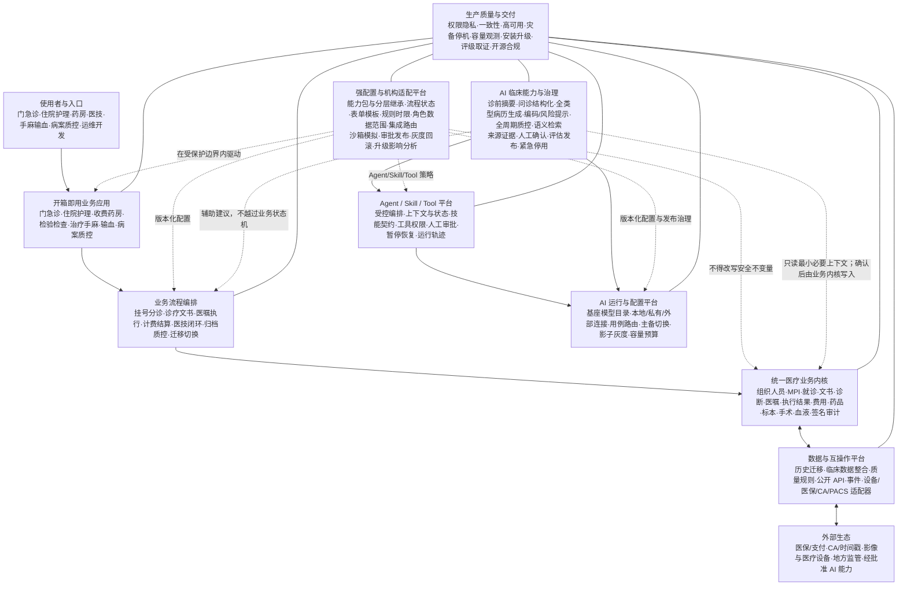
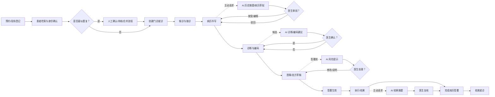
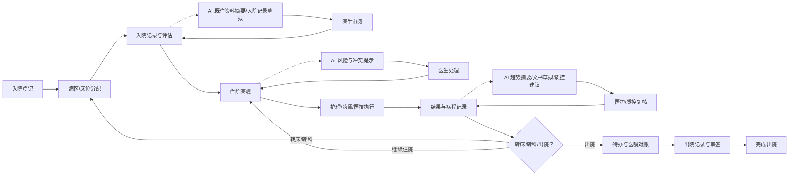
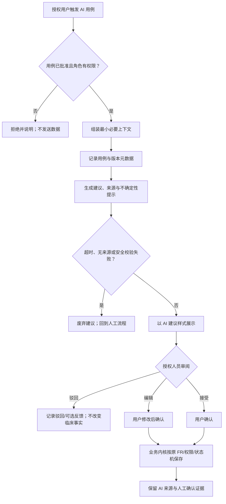
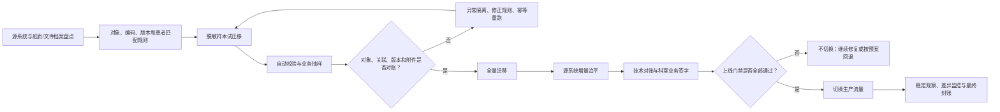
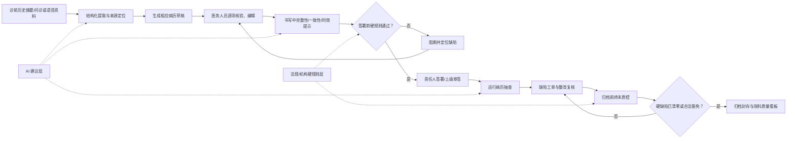
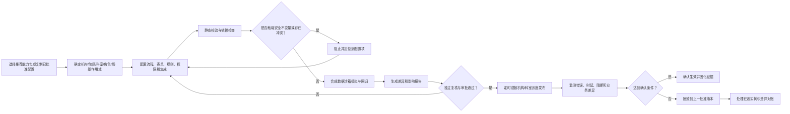
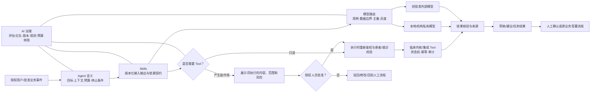

# openemr2026 v1.0 产品需求文档

## 0. 文档控制

| 项目 | 内容 |
|---|---|
| 产品名称 | `openemr2026` |
| 产品版本 | v1.0，面向真实医疗机构生产部署的首个稳定版 |
| 文档版本 | PRD v0.15 |
| 文档状态 | `DRAFT` |
| 交付状态 | `UPDATED_AND_AUDITED`；不代表需求已经由项目发起人批准或代码已经实现 |
| 工作模式 | S002 / `UPDATE` + `AUDIT` |
| 编写日期 | 2026-08-11（Asia/Shanghai） |
| 上游战略 | `strategy/2026-08-11-china-open-source-emr-strategy.md` v0.2；`research/2026-08-11-emr-rating-coverage-audit.md` |
| 产品平台 | 首期为桌面浏览器 Web 应用、响应式床旁/移动查房 PWA、管理与部署工具、公开 API；小程序和原生 App 不在本期 |
| 产品目标 | 面向诊所、基层及一二三级医院的统一开源 EMR；v1.0 以二级综合医院生产可用和电子病历 4 级产品能力前提为基线，机构差异通过模块、配置与集成处理，不分叉核心代码 |
| 技术边界 | 医疗业务内核自主设计和实现；不以现有开源 EMR/HIS/EHR 为底座；技术栈与拓扑由 S004/S005 决定 |

### 0.1 事实、假设与缺失输入

| ID | 内容 | 来源类型 | 置信度 | 处理 |
|---|---|---|---|---|
| FACT-001 | 产品面向诊所、基层及一二三级医院 | `EXPLICIT` | 高 | 作为不可随意缩减的长期产品边界 |
| FACT-002 | 不按机构类型分叉核心代码 | `EXPLICIT` | 高 | 作为所有 FR 和下游设计约束 |
| FACT-003 | 不使用现有开源 EMR/HIS 作为开发底座 | `EXPLICIT` | 高 | 依赖清单与代码来源必须可审计 |
| FACT-004 | 首期交付通用临床内核、门诊参考应用和基础住院流程 | `EXPLICIT` | 高 | 本 PRD 的版本范围 |
| FACT-005 | GitHub Stars、官方可安装发行版有效下载为一级结果 | `EXPLICIT` | 高 | KPI-001/KPI-002 |
| FACT-006 | 安装、安全、数据一致性和恢复为质量门禁 | `EXPLICIT` | 高 | 稳定版发布的阻断条件 |
| FACT-007 | 电子病历系统应覆盖授权认证、审计、患者主索引、门急诊/住院病历、备份恢复和升级后数据继承 | `OBSERVED` | 高 | 国家卫健委功能规范基线 |
| FACT-008 | 正式产品名为 `openemr2026` | `EXPLICIT` | 高 | 用于文档、产品界面和发行制品 |
| FACT-009 | AI 能力需融合进临床、质控和运维工作流 | `EXPLICIT` | 高 | 增加 AI 业务规则、FR、AC、NFR 和风险门禁 |
| FACT-010 | v1.0 需开箱即用并可在真实医院生产使用 | `EXPLICIT` | 高 | 将药房、检验、检查、治疗、手麻、监护、输血、生产运维等移入 v1.0 |
| FACT-011 | 需核查并覆盖电子病历分级评价需求 | `EXPLICIT` | 高 | 以 39 评价项目建立追溯；v1.0 以 4 级产品能力前提为基线 |
| FACT-012 | 历史病历导入与迁移是真实医院上线必备能力 | `EXPLICIT` | 高 | 新增迁移、对账、增量追平、切换与回退契约 |
| FACT-013 | 病历生成和病历质控必须深度融合 | `EXPLICIT` | 高 | 扩展诊前、书写中、签署前、归档前和院科级质控闭环 |
| FACT-014 | 不同级别和不同管理模式医院的流程、表单、规则、权限与集成要求不同，需要强配置能力 | `EXPLICIT` | 高 | 新增配置中心、流程编排、能力包、配置治理及发布回滚契约 |
| FACT-015 | 强配置能力还需覆盖基座模型的配置和切换，以及 AI Agent 与 Skill 的完整生命周期 | `EXPLICIT` | 高 | 新增模型注册/路由/回退、Agent/Skill 定义、执行、评估、发布和安全治理契约 |
| FACT-016 | 住院病历必须成为独立核心模块，不能由基础住院流程或护理工作台代替 | `EXPLICIT` | 高 | 新增住院医生工作站、文书目录、法定时限、三级查房、特殊文书和出院归档闭环 |
| FACT-017 | 门诊与住院必须在一级信息架构上直接分开，并分别提供完整工作域 | `EXPLICIT` | 高 | 新增临床业务门户、门诊工作域和住院工作域字段契约；患者、待办、搜索和 AI 上下文按工作域隔离 |
| FACT-018 | 需对标卫宁健康、东软、嘉和美康公开产品能力，发现缺漏后更新 PRD 与原型 | `EXPLICIT` | 高 | 完成头部 EMR 能力缺口审计；补齐急诊、路径、病案资产、统一任务、专科包、移动查房和临床资质授权 |
| FACT-019 | 病历是 openemr2026 的核心产品亮点，不能将创作、来源、质控、审签、版本和归档挤在单一页面 | `EXPLICIT` | 高 | 建立病历工作台及三级/四级页面族，编辑器采用专注写作模式 |
| FACT-020 | 需显式呈现与 LIS、PACS/RIS、HIS、CA、医保、设备等外部系统的连接、临床入口和运行治理 | `EXPLICIT` | 高 | 新增集成中心、连接器目录、消息追踪、映射对账及临床嵌入入口 |
| FACT-021 | 病案资产中心需覆盖编目、完整性、扫描质控、封存、借阅、复制、长期保存和利用，而非仅展示文件清单 | `EXPLICIT` | 高 | 扩展病案资产全生命周期、四级页面与恢复验真门禁 |
| FACT-022 | 需融合以病历数据为基础的科研统计能力 | `EXPLICIT` | 高 | 新增受治理的队列探索、统计分析、数据申请、脱敏、伦理/用途绑定和受控导出；不把科研查询直接打到生产临床库 |
| FACT-023 | 配置中心需同时具备真实医院日常使用所需的系统后台管理，包括组织、用户、角色、权限、字典、主数据、认证策略、参数、模板、通知、审计和批量任务 | `EXPLICIT` | 高 | 将“业务配置”与“系统管理”分域；新增管理员工作台及可验收的三级页面族 |
| FACT-024 | 需要一个随处可见、能根据医生当前操作主动提醒的 AI 助手 | `EXPLICIT` | 高 | 新增全局入口、浮窗、页面内提醒、完整工作区及上下文/提醒/证据/人工控制契约 |
| FACT-025 | 原型必须逐一补齐全部一至四级规格页面，不能只用代表性 BUILD 代替 | `EXPLICIT` | 高 | 建立 SCR-001–102 全量可运行路由矩阵，并对每页主标题、主体、导航和状态逐页回归 |
| FACT-026 | 一级菜单需要重新合并，数据相关能力统一进入数据中心，急诊入口使用简洁名称“急诊工作台” | `EXPLICIT` | 高 | 重构为临床、病历质量、业务协同、数据中心、AI 中心、业务配置和系统管理七个产品域 |
| FACT-027 | 病历中心等页面不能因共享路由在多个一级菜单之间串跳 | `EXPLICIT` | 高 | 一级菜单采用唯一归属；跨域查看使用显式入口，不复用为第二父级 |
| FACT-028 | 需要核查系统对全部科室的适配程度 | `EXPLICIT` | 高 | 新增科室适配矩阵与上线门禁，区分通用可用、基础闭环、专科包待交付和暂不支持 |
| FACT-029 | PRD、验收、原型屏幕与可运行路由必须能够逐项对应 | `EXPLICIT` | 高 | 新增 FR→AC→SCR→路由机器可读追踪清单并纳入变更检查 |
| FACT-030 | 门诊工作台的病历入口必须保留门诊一级工作域，不得直接把医生切换到全院病历中心 | `EXPLICIT` | 高 | 新增独立 `opd-record` 门诊病历路由；全院病历中心改为显式跨域入口 |
| FACT-031 | 妇产、生殖、儿科、新生儿、精神、眼科、耳鼻喉、口腔、皮肤和中医是 v1.0 核心科室 | `EXPLICIT` | 高 | 每个专科补齐工作台、专科病历、检查设备、诊疗执行、关键流程、随访交接、质控安全七层页面与验收契约 |
| ASM-001 | 单一临床内核可用模块与配置覆盖不同机构 | `INFERRED` | 中 | 用跨机构评审和流程演示验证 |
| ASM-002 | 同一门急诊应用可由中小机构独立使用，也可在大型医院通过适配器衔接既有平台 | `INFERRED` | 中 | v1.0 内置基础收费/药房并提供医保适配，按试点验证 |
| ASM-003 | v1.0 的内置医技、手麻、输血和收费药房提供综合医院基础闭环，专科深度仍可由外部系统替换 | `INFERRED` | 中 | 以 Q-017–021 和医院全流程日验证 |
| Q-001 | 产品名已确定为 `openemr2026`；商标和主仓库地址待定 | `PARTIALLY_RESOLVED` | 中 | 公开发布前完成商标与仓库核查 |
| Q-002 | 最终开源许可证及贡献协议 | `UNKNOWN` | 中 | 代码公开前取得法律意见 |
| Q-003 | 团队规模、技术栈和 180 天实际产能 | `UNKNOWN` | 低 | S004/S007 规划时确认 |
| Q-004 | 大中小规模性能基线、SLO、RPO 和 RTO | `UNKNOWN` | 低 | Alpha 压测与恢复演练后基线化 |
| Q-005 | v1.0 目标支持电子病历 4 级的产品能力前提；医院实际等级由应用范围、数据质量和现场评审决定 | `RESOLVED_FOR_V1` | 高 | 建立 39 项评价取证矩阵 |

### 0.2 修订记录

| 版本 | 日期 | 变更 | 影响 |
|---|---|---|---|
| v0.1 | 2026-08-11 | 基于战略 v0.2 首次创建 | 建立范围、角色、FR/NFR/AC、风险和下游交接基线 |
| v0.2 | 2026-08-11 | 确定产品名 `openemr2026`；增加业务流程图、产品能力架构、逐条 FR 详细规格和 AI 融合需求 | 扩展 S003/S004/S009 交接基线；新增 AI 安全与治理门禁 |
| v0.3 | 2026-08-11 | 产品范围升级到 v1.0 真实医院生产版；新增电子病历 39 项评价覆盖、历史数据迁移、药房、检验、检查、治疗、手麻、监护、输血、生产运维和深度病历生成/质控 | 从参考应用变更为可生产部署的整体产品契约 |
| v0.4 | 2026-08-11 | 新增面向不同医院的强配置平台：机构能力包、分层继承、流程/状态、表单、规则、权限、集成路由、沙箱验证、审批发布、灰度回滚和升级兼容 | 将“单一内核适配不同医院”从原则展开为可验收产品能力；新增 FR-062–069 |
| v0.5 | 2026-08-11 | 增加基座模型目录、能力画像、连接、路由切换、影子/灰度、回退；增加 Agent 定义、上下文、工具审批、执行恢复及 Skill 契约、依赖、供应链、评估发布和运行治理 | 将 AI 从单点功能扩展为供应商中立、可配置、可审计且受临床内核约束的平台能力；新增 FR-070–081 |
| v0.6 | 2026-08-13 | 基于国家住院病历组成及时限要求和主流全院 EMR 公开能力，补齐住院医生工作站、文书目录、入院/首程、连续病程/三级查房、事件型特殊文书和出院病历闭环 | 将住院病历从概括性流程提升为 v1.0 P0 一级模块；新增 FR-082–087、AC-082–087 |
| v0.7 | 2026-08-13 | 新增一级“临床业务门户”，将门诊诊疗与住院诊疗拆为两个独立工作域；补齐两域的功能地图、工作台字段、患者上下文、任务对象、状态和跨域切换安全规则 | 新增 FR-088–090、AC-088–090、BR-076–078；原型增加 SCR-069 和门住院双入口 |
| v0.8 | 2026-08-13 | 对标卫宁健康、东软和嘉和美康的公开产品、官网及采购项目能力，补齐急诊一体化、临床路径变异、专科能力包、无纸化/CDA 病案、统一临床任务消息、移动查房和临床资质授权 | 新增 FR-091–097、AC-091–097、BR-079–089；v1.0 P0/P1 范围、非目标、发布门禁和原型入口同步更新 |
| v0.9 | 2026-08-13 | 以病历为产品主轴重构信息架构；扩展病历工作台、专注编辑、来源证据、质控审签、版本更正、病案资产全生命周期、LIS/PACS 等外部集成中心及科研统计 | 新增 FR-098–107、AC-098–107、BR-090–102；原型增加三级/四级页面族并将病历编辑从拥挤三栏拆分 |
| v0.10 | 2026-08-13 | 将配置中心扩展为完整医院后台管理域，补齐组织、用户、角色、权限、认证、字典/术语、主数据、模板、参数、通知、审计和批量任务 | 新增 FR-108–119、AC-108–119、BR-103–116；系统管理与业务配置分域但复用统一验证、审批、发布和回滚机制 |
| v0.11 | 2026-08-13 | 将 AI 助手升级为贯穿所有工作域的上下文助手；重构一级菜单并合并数据能力；要求 SCR-001–102 全量可运行原型覆盖 | 新增 FR-120–124、AC-120–124、BR-117–125；原型新增临床协同/质量/数据/AI 聚合中心及缺失业务页面 |
| v0.12 | 2026-08-14 | 修复跨一级菜单的共享路由；建立全科室适配声明与上线门禁；补齐病理科基础闭环；把需求追踪延伸到实际路由 | 新增 FR-125–127、AC-125–127、BR-126–128、SCR-103–104；原型新增院科质控、科室适配和病理工作台 |
| v0.13 | 2026-08-14 | 将门诊域内病历与全院病历中心彻底分路由；把妇产、生殖、儿科、新生儿、精神、眼科、耳鼻喉、口腔、皮肤和中医升级为核心专科 | 新增 FR-128–138、AC-128–138、BR-129–140、SCR-105–145；新增 1 个门诊病历页和 40 个专科深页 |
| v0.14 | 2026-08-14 | 将 `record` 修正为无单一患者正文的全院病历任务中心；将 10 类核心专科从“页面存在”扩展到独立患者上下文、多场景、角色、设备接口、知情授权、交接恢复和质控证据 | 不新增 FR 编号；深化 FR/AC-128–138、SCR-105–145 的可观察行为与原型验收口径 |
| v0.15 | 2026-08-20 | 继续修正门诊“本次病历”与“全院病历中心”的入口语义；十类核心专科从四层扩展到七层，补齐检查/设备来源、诊疗执行和随访交接 | 不新增 FR/AC 编号；新增 SCR-146–175，目标路由由 164 增至 194；并入既有 S01–S10 实施任务 |

## 1. 执行摘要

### 1.1 问题

中国医疗机构缺少一套同时满足以下条件的开源 EMR：医疗业务内核自主可控、可覆盖诊所到医院、符合中国病历和数据治理要求、能够独立部署或与既有系统集成、代码和文档便于开发者学习与贡献。

### 1.2 价值主张

- 对医务人员：提供连贯的患者时间线、病历书写、诊断、医嘱/处方、结果和签署流程。
- 对医疗机构：提供数据自主、权限审计、版本追溯、导出、备份恢复和渐进集成能力。
- 对 IT/实施人员：提供可安装、可升级、可观察、可扩展且不按机构复制分叉的产品。
- 对开源开发者：提供真实、现代、可运行、面向中国医疗流程的开源工程样板。

### 1.3 本期目标

1. 建立统一的组织、人员、权限、患者、就诊、文书、诊断、医嘱、签名、版本和审计产品契约。
2. 交付可完成门诊临床主流程的参考应用。
3. 交付可在真实医院使用的门急诊、住院、护理、药房、检验、检查影像、一般治疗、手术、麻醉、监护、输血和病案质控闭环。
4. 交付门诊/住院基础价格、计费、预缴、结算和外部医保适配契约，使中小机构可独立运行、大型医院可衔接已有 HIS。
5. 支持历史病历、患者、就诊、文书版本、诊断、医嘱、结果、附件和签名来源的可审计迁移，支持试迁移、增量追平、全量对账、切换和回退。
6. 建立电子病历 39 个评价项目的功能、应用范围、数据质量和取证契约，v1.0 以支持 4 级的产品能力前提为基线。
7. 交付 AI 治理基础与可控的病历生成和质控闭环，覆盖诊前摘要、问诊资料整理、文书/病程/交班/出院记录生成、书写中检查、签署前质控、归档前终末质控和院科级看板。
8. 交付公开可安装发行版、高可用/灾备/停机续运契约、默认业务配置、合成数据、标准接口和中英文核心文档。
9. 建立 Stars、发行版下载和独立安装的透明统计口径。
10. 通过安装、安全、数据一致性、备份恢复、升级回滚、历史迁移、生产容量、业务连续性与 AI 安全门禁后，才允许发布 Stable。
11. 提供强配置平台，使不同机构可在不分叉核心代码的前提下配置能力模块、组织差异、临床流程、状态转换、表单模板、规则时限、角色权限和集成路由，并通过沙箱、审批、灰度、回滚及升级影响分析安全发布。
12. 提供供应商中立的 AI 运行与治理平台：可注册、评估、路由、切换和回退本地/私有/经批准外部基座模型；可定义受控 Agent 与可复用 Skill，并对上下文、工具、审批、预算、运行轨迹、版本、评估、发布和紧急停用进行全生命周期治理。
13. 交付独立住院医生工作站与完整住院病历页面族，使入院、首程、连续病程、三级查房、特殊记录、出院/死亡记录、病案首页和归档形成可用闭环，而不是只在通用文书编辑器中出现模板名称。
14. 建立一级临床业务门户，将门诊诊疗和住院诊疗作为两个独立工作域直接呈现；两域共享患者主索引和临床内核，但分别管理就诊上下文、任务队列、搜索范围、页面导航和 AI 会话。
15. 交付独立急诊临床工作域、临床路径变异闭环、统一临床任务中心、纸电融合病案资产中心和临床资质授权，使 v1.0 不只满足常规门住院书写，也具备头部医院 EMR 常见的关键生产能力。
16. 验证专科能力包和响应式移动查房的扩展边界：不分叉核心代码、不弱化患者核验和高风险动作门禁，并允许医院逐步启用。
17. 将病历打造为独立产品主轴：通过病历工作台组织一次就诊内的应有文书、创作任务、来源证据、质控缺陷、审签责任、版本链和归档状态；编辑时只保留写作必需信息，其余能力通过独立三级/四级页面渐进披露。
18. 提供“临床使用入口—连接器配置—消息运行治理”三层集成体验，使医生可在结果和病历上下文调阅 LIS 报告与 PACS 图像，集成人员可配置、追踪、重放和对账而不读取超出职责的病历正文。
19. 提供受治理的科研统计基础：授权研究者在批准项目和用途范围内定义队列、查看去标识聚合、固化可复算数据集和受控导出；临床原始事实、病历版本和科研衍生变量严格分离。

### 1.4 非目标

- 以 v1.0 单一版本覆盖三级医院全部专科深度、完整 CTMS/随机化/药械注册试验、精细化运营和电子病历 5–8 级的全部要求；v1.0 仅交付受治理的科研队列、统计、数据集和导出基础。
- 重建 ERP、人力资源、财务总账、固定资产、完整供应链和所有专科系统。
- 小程序、iOS、Android 或患者端原生应用；v1.0 仅提供受控的响应式移动查房/床旁 PWA，不承诺完整原生移动医院或全离线闭环。
- 使用 AI 自动诊断、自动处方、自动执行医嘱、自动签署或替代医务人员最终判断。
- 使用其他开源 EMR/HIS/EHR 作为代码或业务模型底座。
- Alpha/Beta 版本直接承载真实生产诊疗。
- 允许医院通过配置执行任意脚本、修改数据库结构、绕过统一临床状态机，或关闭患者唯一性、签署不可覆盖、审计、强制安全核查等平台安全不变量。
- 允许 Agent 自主诊断、处方、签署、执行医嘱或在没有相应用户/服务身份授权和风险审批的情况下产生临床、费用、药品、设备或外部报送副作用。

### 1.5 成功指标

| ID | 指标 | 定义与口径 | Day 90 挑战目标 | Day 180 挑战目标 | 数据源 | 状态 |
|---|---|---|---:|---:|---|---|
| KPI-001 | GitHub Stars | 主仓库累计 Stars；同时记录 30 天净新增 | 300 | 1,500 | GitHub API/仓库页面 | `PLANNED` |
| KPI-002 | 官方可安装发行版有效下载 | 仅汇总官方 Release 中可安装资产；排除源码自动归档、校验文件、签名文件、CI 测试资产；按 Alpha/Beta/RC/Stable 渠道分别报告 | Alpha 100 | RC/Stable 合计 1,000；Stable 单独披露 | GitHub Release/制品仓库 | `PLANNED` |
| KPI-003 | 外部独立成功安装 | 未参与核心开发者在干净环境按文档启动演示并完成健康检查；同一人同一版本重复安装只记一次 | 5 | 20 | 安装验证记录；匿名遥测仅在明确同意后使用 | `PLANNED` |
| KPI-004 | 开发者启动成功率 | 受邀外部开发者在 30 分钟内启动演示的比例 | ≥80% | ≥80% | 任务观察记录 | `PLANNED` |
| KPI-005 | P0 数据一致性缺陷 | 导致患者错配、病历覆盖、签名失真、医嘱/结果错误关联或恢复后数据缺失的缺陷数 | 0 未处置 | 0 未处置 | 测试与缺陷系统 | `PLANNED` |
| KPI-006 | 高危安全缺陷 | 按采用的漏洞严重度标准判定为高危/严重且未处置的缺陷数 | 0 | 0 | 安全扫描、人工测试与披露渠道 | `PLANNED` |
| KPI-007 | 恢复完整率 | 控制数据集恢复后，患者、就诊、病历版本、签名元数据、附件和审计记录通过完整性校验的比例 | 100% | 100% | 自动化恢复验证报告 | `PLANNED` |
| KPI-008 | AI 高严重度安全事件 | AI 建议导致或可合理导致错误患者、错误用药/医嘱、隐私泄露、绕过人工确认的未处置事件数 | 0 | 0 | AI Evals、红队、事件与反馈系统 | `PLANNED` 质量门禁 |
| KPI-009 | 电子病历 39 项产品覆盖 | 39 个官方评价项目均有已实现 FR/AC、有效应用口径、数据质量规则和取证报表 | 不适用 | 39/39 | 评级覆盖矩阵与取证包 | `PLANNED` v1.0 门禁 |
| KPI-010 | 历史数据迁移对账 | 经批准迁移范围内的对象、关联、版本、附件、签名来源和记录计数通过自动与业务抽样对账的比例 | 不适用 | 100% | 迁移报告、对账报告、业务签字 | `PLANNED` 上线门禁 |
| KPI-011 | 生产上线门禁 | 安全、数据一致性、容量、HA/灾备、停机续运、监控告警、升级回滚、迁移和用户验收门禁全部通过 | 不适用 | 未通过项=0 | 生产就绪报告 | `PLANNED` v1.0 门禁 |
| KPI-012 | 配置发布安全 | 生产配置发布经过验证、影响分析、审批、可观测灰度和回滚；统计配置导致的 P0/P1 事故与无法回滚发布 | 不适用 | P0/P1 配置事故=0；无法回滚发布=0 | 配置发布记录、事故与回滚演练 | `PLANNED` v1.0 门禁 |
| KPI-013 | AI 运行变更安全 | 基座模型、路由、Agent、Skill 或 Tool 策略变更均通过逐用例评估和发布门禁；统计未批准版本运行、切换越权和未审批副作用 | 不适用 | 未批准版本运行=0；切换导致权限/数据边界扩大=0；未审批高风险副作用=0 | AI 注册表、运行轨迹、审批、评估和发布记录 | `PLANNED` v1.0 门禁 |

KPI-001/002 为一级开源结果；KPI-003–013 为产品真实性、评级准备度和生产发布质量门禁。AI 的日活、调用量与接受率只作为诊断指标，不替代 Stars 和有效下载的一级结果地位。

## 2. 背景与证据

| 证据 ID | 来源 | 日期/核查日 | 结论 | 来源类型 | 置信度 |
|---|---|---|---|---|---|
| E-001 | 项目发起人 | 2026-08-11 | 不限制目标机构等级，不使用现有开源 EMR 底座，开源影响力优先 | `EXPLICIT` | 高 |
| E-002 | 战略方案 v0.2 | 2026-08-11 | 单一临床内核、模块化交付、诊所独立与医院集成 | `INFERRED` | 中 |
| E-003 | 国家卫健委《电子病历系统功能规范（试行）》 | 2026-08-11 核查 | EMR 覆盖门急诊、病房及医技信息；基础功能包括授权认证、审计、存储、隐私、主索引、备份恢复 | `OBSERVED` | 高 |
| E-004 | 国家卫健委《电子病历应用管理规范（试行）》 | 2026-08-11 核查 | 病历查阅、书写、归档、复制、修改痕迹和保存受规范约束 | `OBSERVED` | 高 |
| E-005 | 《医疗机构病历管理规定（2013 年版）》 | 2026-08-11 核查 | 同一患者唯一标识；机构保管的门急诊病历不少于 15 年，住院病历不少于 30 年 | `OBSERVED` | 高 |
| E-006 | 《个人信息保护法》第 28–30 条 | 2026-08-11 核查 | 医疗健康信息属于敏感个人信息，需特定目的、充分必要和严格保护 | `OBSERVED` | 高 |
| E-007 | 《网络数据安全管理条例》 | 2026-08-11 核查 | 网络数据处理需安全治理、事件处置和个人信息保护 | `OBSERVED` | 高 |
| E-008 | 电子病历应用水平分级评价通知及标准 | 2026-08-11 核查 | 评价包含 0–8 级、10 个工作角色、39 个项目，考察功能、有效应用与数据质量；产品功能不等同医院评级 | `OBSERVED` | 高 |
| E-010 | 国家卫健委公立医院绩效监测操作手册 | 2026-08-11 核查 | 基本项有效应用范围应超过 80%、数据质量指数超过 0.5；选择项相应超过 50% 和 0.5，并满足前序等级 | `OBSERVED` | 高 |
| E-009 | GitHub 竞品快照 | 2026-08-11 | OpenEMR 约 5.4k、Medplum 约 2.6k、OpenMRS Core 约 1.9k Stars | `OBSERVED` | 中 |

## 3. 用户、角色与权限

### 3.1 角色表

| 角色 ID | 角色 | 使用情境 | 目标 | 默认数据范围 | 关键权限 |
|---|---|---|---|---|---|
| ROLE-001 | 机构系统管理员 | 初始化机构、组织、账户与配置 | 可控地启用产品 | 本机构配置；默认不可查看临床正文 | 组织、账户、角色、参考数据、系统状态 |
| ROLE-002 | 安全管理员 | 权限审查、审计和安全响应 | 最小权限与可追责 | 本机构安全与审计元数据 | 授权策略、审计查询、账户冻结；不可修改临床记录 |
| ROLE-003 | 医生 | 门急诊和住院诊疗 | 完成病历、诊断、医嘱、处方和签署 | 被分配/授权的患者和就诊 | 创建与签署本人职责内临床记录 |
| ROLE-004 | 上级/审签医生 | 审阅实习、试用或下级医生记录 | 完成双签和质量把关 | 本科室或授权范围 | 审阅、退回、共同签署 |
| ROLE-005 | 护士 | 病区与门诊护理 | 执行医嘱、记录观察与护理 | 所属单元和班次内患者 | 护理记录、生命体征、执行状态 |
| ROLE-006 | 药师 | 处方审核与调剂衔接 | 保障用药流程职责分离 | 授权处方和患者必要信息 | 审核、退回、记录调剂/发药结果 |
| ROLE-007 | 医技人员 | 检验检查申请和结果衔接 | 接收申请并回传结果 | 所属医技单元任务 | 接单、状态更新、结果录入/确认 |
| ROLE-008 | 病案管理员 | 归档、封存、复制和长期保存 | 管理完整病案 | 授权归档病历 | 归档检查、封存、复制、导出 |
| ROLE-009 | 质控人员 | 抽查和反馈病历缺陷 | 提升病历完整性和时效 | 授权科室/项目病历 | 质控抽取、缺陷记录、反馈；不可改写原文 |
| ROLE-010 | 集成管理员 | 配置外部系统连接与排错 | 可靠交换数据 | 接口配置、消息元数据；临床正文最小化 | 连接配置、重放、对账、状态查看 |
| ROLE-011 | 患者服务人员 | 预约、登记和身份维护 | 正确创建/匹配患者和就诊 | 登记所需人口学与就诊信息 | 查询、登记、修正待核信息；不可看非必要病历正文 |
| ROLE-012 | 开源开发者/部署者/项目维护者 | 本地运行、扩展、贡献或发布 | 快速理解、使用和维护项目 | 仅合成数据和项目运营元数据 | 安装演示、调用公开 API、开发插件、按授权发布版本与查看开源指标 |
| ROLE-013 | AI 管理员/医疗 AI 治理负责人 | 配置 AI 使用范围、模型/提示版本、评估和停用策略 | 让 AI 可用、可控、可审计、可随时退出 | 本机构 AI 配置、评估及运行元数据；默认不可查看临床正文 | 用例启停、版本发布、评估门禁、事件处置；不可替医务人员签署 |
| ROLE-014 | 收费/结算人员 | 门诊收退费、住院预交与出院结算 | 保证费用可核对、可日结 | 本收费窗口/授权机构的费用与结算数据；临床正文最小化 | 划价、收费、退费、日结、预交、结算；不可修改临床事实 |
| ROLE-015 | 检验人员 | 标本、检验结果、危急值和报告 | 完成可追溯的检验闭环 | 所属检验单元任务和必要患者信息 | 标本处理、结果录入/审核、危急值通知、报告签发/更正 |
| ROLE-016 | 检查/影像人员 | 检查预约、执行、图像和报告 | 完成检查与报告图像关联 | 所属检查单元的申请、图像和必要病历摘要 | 预约/登记、执行记录、图像索引、报告书写/审签/更正 |
| ROLE-017 | 治疗/手术/麻醉人员 | 一般治疗、围手术期和麻醉流程 | 保证核对、记录和不良事件闭环 | 本治疗单元/手术间和被分配患者 | 治疗执行、手术排程/核查/记录、麻醉评估/记录/复苏 |
| ROLE-018 | 输血科/临床用血人员 | 备血、配血、发血和床旁输注 | 实现血液到患者全链路追溯 | 授权用血任务和必要患者/标本信息 | 申请审核、标本、备/配/发血、床旁核对、输注观察与反应上报 |
| ROLE-019 | 迁移/上线/运维管理员 | 历史数据迁移、切换、高可用、灾备和应急演练 | 安全完成上线并维持业务连续性 | 迁移与运维元数据；临床正文仅限授权任务 | 试迁移、对账、切换/回退、备份恢复、灾备切换、告警与演练 |
| ROLE-020 | 临床应用配置管理员 | 将医院制度、组织差异和应用范围配置为可发布产品行为 | 不改代码即可适配医院且不破坏医疗安全 | 本机构配置元数据和经批准的脱敏/合成测试数据；默认不可浏览真实病历正文 | 创建配置草稿、编排流程/表单/规则、运行模拟；不能单人发布本人创建的高风险配置 |
| ROLE-021 | AI 应用/Agent/Skill 设计者 | 将临床辅助场景定义成受控 Agent、Skill、Tool 组合和模型路由 | 复用 AI 能力且行为可测试、可切换、可停止 | AI 定义、合成/批准评估数据和最小必要运行元数据；不因设计权限获得真实病历正文 | 创建 Agent/Skill 草稿、编排允许工具、配置模型候选和评估；不能批准本人创建的临床高风险版本 |
| ROLE-022 | 科研人员/项目成员 | 在获批项目、伦理和用途边界内定义队列、运行统计和使用研究数据 | 将临床数据转化为可复算且合规的科研证据 | 仅限本人参与且有效的科研项目、获批字段、人群、时间窗和环境 | 可定义口径、运行聚合、申请数据；不能以科研权限修改临床病历或绕过审批导出 |
| ROLE-023 | 科研数据管理员/数据治理人员 | 审查科研数据申请、执行脱敏交付、管理期限和审计 | 让数据可用而不扩大用途、成员或识别风险 | 科研申请、数据目录、脱敏规则、交付元数据和受控质量抽样 | 可批准/缩减/驳回范围、生成快照、停止访问；不能替代伦理或科学性审查 |

### 3.2 权限表达规则

权限必须使用“主体—资源—动作—范围—条件”表达。例如：

> ROLE-003 医生 — 临床文书 — 创建/查看/签署 — 本人当前负责或经授权的就诊 — 账户有效、执业角色有效、就诊未关闭且未封存。

不得仅以“管理员/普通用户”二分权限；组织、科室、病区、患者关系、时间、文书状态和紧急访问均需进入权限条件。

## 4. 范围

### 4.1 v1.0 范围内

#### P0 通用临床内核

- 机构、科室、病区、床位、人员、角色和数据范围。
- 患者主索引、身份检索、重复识别、合并和纠错。
- 门诊、急诊、住院三类就诊的共同状态与关联。
- 临床文书模板、草稿、签署、双签、版本、更正、归档和封存。
- 诊断、医嘱、处方、执行和结果的基础对象与状态。
- 患者临床时间线、审计、检索、打印和电子导出。
- 参考数据版本、外部标识和交换状态。

#### P0 强配置与机构适配平台

- 提供平台默认、机构/院区、科室/病区、角色与具体业务场景的分层配置和显式继承；冲突时可解释最终生效来源。
- 提供可组合的机构能力包和模块依赖校验。诊所、基层、一二三级医院可选择推荐基线后继续调整，但“机构等级”不成为代码分支，也不等于评级结论。
- 提供门急诊、住院、护理、药房、医技、手麻、输血、病历归档和质控等流程的可视化编排，支持节点、角色、条件、分支、时限、升级、退回、撤销、补偿和异常终态。
- 提供结构化表单/病历模板、字段、布局、默认值、计算、必填/可见/可编辑条件、签署策略、打印导出和标准数据映射配置。
- 提供规则中心，配置硬性安全/合规规则、机构业务规则、提醒和 AI 建议的分层、适用范围、优先级、证据、处置动作、例外和有效期。
- 提供角色、职责分离和数据范围策略配置，以及接口字段映射、路由、重试、降级、外部系统主从关系和设备接入配置。
- 所有配置均需版本、差异、依赖、影响分析、合成数据模拟、审批、定时/灰度发布、运行观测、回滚、导入导出和升级兼容处理。
- AI 配置覆盖基座模型、模型连接与数据边界、用例路由、主备切换、影子/灰度、Agent、Skill、Tool、上下文、人工审批、预算和紧急停用；AI 运行配置沿用同一配置发布治理。

#### P0 基座模型、Agent 与 Skill 平台

- 建立供应商中立的基座模型目录，登记模型/部署版本、文本/图像/语音/向量等能力、上下文限制、语言、数据驻留、用途许可、延迟/容量/成本画像、生命周期和评估证据。
- 支持本地、机构私有环境和经批准外部能力的连接配置；凭据只使用秘密引用，模型连接不得默认获得临床数据。
- 按机构、环境、AI 用例、数据分类、患者/就诊场景、模态、延迟、容量、预算和批准状态配置候选模型、主模型、备选模型、不可使用条件、影子、灰度、切换和回退。
- 定义 Agent 为“在明确目标、上下文、Skills、Tools、预算和停止条件内执行多步骤任务的受控编排”；Agent 不拥有独立临床身份，不得绕过人工确认和临床内核。
- 定义 Skill 为“可版本化、可测试、可复用的 AI 能力契约”，包含用途、输入/输出、前置条件、允许上下文、工具、权限、依赖、失败语义、评估和责任人；Skill 本身不自动获得工具权限。
- 定义 Tool 为具有明确输入/输出和副作用等级的受保护操作；每次执行重新校验调用主体、患者/就诊范围、业务状态、幂等键和审批。
- Agent 运行支持计划预览、逐步执行、暂停等待、人工批准/驳回/修改、取消、超时、幂等重试、断点恢复、补偿、结果核验和紧急停用。
- Agent、Skill、Tool、模型和路由均需独立版本、依赖锁定、评估集、红队、审批、影子/灰度、回滚、运行轨迹、质量/安全/延迟/成本监控和事件处置。

#### P0 门急诊生产应用

- 预约/现场登记、候诊、接诊、病历、诊断、医嘱/处方、结果查看、签署和结束就诊。
- 门诊支持预约、挂号、分诊、叫号、接诊、结果、随访、结束和取消。
- 急诊提供独立工作域，覆盖院前信息接收、预检分诊、抢救区/诊室/留观分区、急诊病历、时间关键事件、急诊医嘱与结果、抢救/护理、输液、急会诊、交接班和去向闭环。
- 支持中小机构独立运行，也支持大型医院以标准接口衔接既有 HIS。

#### P0 住院与护理生产应用

- 入院通知/登记、预交金、病区/床位、医嘱、执行、住院文书、护理评估、护理计划、体征、护理记录、交接班、转床/科/院和出院结算。
- 支持长期/临时/急医嘱、停医嘱、医嘱核对、药品/标本/检查/治疗执行与异常闭环。
- 住院医生工作站按本人、医疗组、病区和会诊关系呈现在院患者，聚合病情等级、关键风险、待写/待签/逾期文书、异常结果、待审医嘱、会诊、手术和出院计划。
- 单患者住院总览持续展示患者身份、住院日、主管医师/医疗组、主要诊断、病情等级、过敏/隔离、当前医嘱、趋势、检查检验、会诊/手术事件和文书完整性；任何患者切换都处理未保存草稿。
- 住院文书中心提供按住院志、病程、会诊、围手术期、知情告知、护理、终末文书和病案首页分组的目录，显示责任人、触发事件、法定/机构时限、草稿/待审/已签/退回/逾期/缺失状态及版本链。
- v1.0 住院文书基线覆盖：入院记录、再次/多次入院记录、24 小时内入出院/入院死亡、首次病程、日常病程、主治首次/日常查房、主任/副主任查房、阶段小结、交接班、转科、会诊、疑难病例讨论、抢救、术前小结/讨论、手术记录、术后首次病程、出院记录、死亡记录、死亡病例讨论及所需知情同意、病危（重）通知和病案首页。
- 文书时限、病情等级频次、上下级审签和科室模板允许按机构配置，但不得低于适用规范或绕过平台签署、版本和审计不变量。
- 出院病历闭环同时检查诊疗待办、医嘱/结果、必要文书、病案首页、编码、费用与签署状态；缺项进入责任人整改，完成后交病案归档。

#### P0 收费结算与药品保障

- 统一价格与计费项目、门诊划价/收费/退费、住院记账/预交/出院结算、自费支付和外部医保适配契约。
- 门诊审方、调剂、发药、退药和基础库存；住院摆药、配送、退药、配液/静配衔接和药品可供状态。
- 支持药品批号/效期、高警示药品、抗菌药分级、特殊药品权限与用药记录追溯；完整采购与供应链不在 v1.0。

#### P0 检验、检查影像与治疗

- 内置基础 LIS：申请、标本条码、采集、接收/退回、处理、结果、审核、危急值、报告、更正和仪器接入契约。
- 内置基础 RIS/检查工作流：申请、预约、登记、执行、记录、报告审签/更正、图像索引和 PACS 调阅契约。
- 一般治疗排程、核对、执行、中止、不良事件和治疗记录。

#### P0 手术、麻醉、监护与输血基础闭环

- 手术申请、审批、预约/排台、安全核查、手术记录、器械/植入物追溯和术后去向。
- 麻醉评估、计划、安全核查、术中记录、复苏评分、不良事件和麻醉总结。
- 监护设备与患者绑定、数据接收、人工确认、趋势、告警和原始来源追溯。
- 输血申请、备血、标本、配血、发血、床旁核对、输注、反应、回收和全链路追溯。

#### P0 病历生成、质控与电子签名

- 诊前历史摘要，问诊/语音资料结构化，门诊病历、入院记录、首程、日常/上级查房病程、护理记录、交接班、手麻记录和出院记录的受控生成。
- 书写中完整性/一致性/逻辑/时效质控、签署前强制质控、归档前终末质控、缺陷整改和院科级质量看板。
- 内部签署证据、签署顺序、双签、签名验证，以及 CA/时间戳/可靠电子签名适配契约。

#### P0 历史数据迁移与全院数据整合

- 数据盘点、字段/编码映射、患者匹配、试迁移、全量+增量迁移、断点续传、对账、业务抽验、切换、回退和迁移证据。
- 历史文书版本、原签名来源、导入时间、原系统标识、附件和不可结构化内容保真；不把导入动作伪装成原签署。
- 全院临床数据注册、统一时间线、标准术语/主数据、数据质量规则、问题整改和评级取证报表。

#### P0 临床路径、统一任务、病案资产与资质授权

- 临床路径支持路径/版本、准入、阶段/日程、医嘱/检查/护理/文书任务包、执行完成度、变异、退出和质量统计；路径建议不能静默生成生效医嘱。
- 统一临床任务与消息中心覆盖危急值、异常结果、会诊、审签、文书时限、路径变异、医嘱审核/执行、出院整改、数据异常和 Agent 审批；通知送达不等于业务完成。
- 纸电融合病案资产中心统一管理电子原生文书、外部报告、患者签字材料、扫描/高拍影像、CDA/共享文档、CA 证据、格式转换、目录/页序、借阅复制、对外提供和长期验证。
- 临床资质与医务授权覆盖执业范围、处方权、抗菌药物、麻精毒放药品、手术分级、高风险技术、输血、会诊、值班和临时授权，并以事件时间和授权版本判定。

#### P1 专科能力包与移动查房

- 专科能力包可组合专科术语、结构化控件、量表、文书模板、医嘱集、临床路径、质控规则、数据集和 AI Skill；不新建专科核心代码分支。
- v1.0 以中医、妇产、口腔和重症四类示范包验证扩展机制与升级兼容，不承诺覆盖这些专科的全部生产深度。
- 响应式移动查房/床旁 PWA 支持只读患者总览、任务查看/确认、病程或会诊意见草稿、结果确认和语音录入；医嘱生效、病历签署、给药、输血等仍执行原高风险核验。

#### P0 生产安全、连续性与开源交付

- 生产身份鉴别、细粒度权限、审计、数据保护、漏洞处置、容量管理、高可用、健康检查、日志/指标/链路和告警。
- 备份、异地/隔离恢复、RPO/RTO、灾备切换、停机续运、纸质/离线补录、恢复后对账和应急演练。
- 默认配置包、合成演示、生产安装及升级工具、回滚、运维手册、安全政策、数据迁移工具和评级取证工具。

#### P0 开源发行与质量

- 合成演示数据、安装路径、升级与回滚说明、备份恢复、公开 API 示例。
- README、中英文核心文档、安全与贡献政策、版本和制品可追溯。
- Stars、发行版下载和外部安装指标统计。

#### P0/P1 AI 融合能力

- P0 AI 治理基座：机构级启停、用例白名单、模型/提示/知识版本、人工确认、评估门禁、审计、反馈、降级与紧急停用。
- P0 临床信息摘要和病历草拟：只基于当前授权上下文生成建议，来源可回看，不自动写入已签署病历。
- P1 诊断/编码候选、医嘱/处方风险提示、检验检查结果摘要和病历质控建议。
- P1 带临床来源引用的患者记录语义检索与问答；无证据时必须明确说明。
- AI 不可用、超时或被机构停用时，核心 EMR 流程仍必须可用。

### 4.2 v1.0 范围外

- 财务总账、成本核算、全院预算、人力资源、固定资产和完整 ERP。
- 完整药品/耗材采购、供应商、物流、供应链精细化与大型药库自动化；v1.0 只保证诊疗必需的可供、库存和追溯。
- 病理全专业流程、重症高级临床信息系统、产科/新生儿、透析、康复、口腔、体检等所有专科完整深度应用；v1.0 只提供通用内核和少量示范专科能力包，不宣称替代成熟专科系统。
- 所有专科深度模板和全部地方监管接口。
- 患者端移动应用、互联网医院、远程诊疗和线上支付。
- AI 自主诊疗、自动处方、自动执行医嘱、自动签署、未经人工复核直接改变临床事实，以及默认使用临床数据训练外部模型。
- 宣称任何安装 openemr2026 的医院会自动通过电子病历 4 级或更高级别；医院仍需实现有效应用和数据质量要求并参与评审。

### 4.3 依赖与约束

- 可使用成熟通用开源基础组件，但不得复制现有开源 EMR/HIS 的业务代码和受保护资产。
- 演示、测试、公开 Issue 和文档只能使用合成或经批准的脱敏数据。
- 医保、CA/时间戳、PACS、检验仪器、监护设备、支付与地方监管网络需由医院获得合法接入资质和现场配置；v1.0 必须提供基础业务流和标准适配契约，不承诺替医院取得第三方资质。
- 技术栈、服务边界、数据库和部署拓扑由 S004/S005 设计，PRD 不作选择。
- AI 能力可由本地、机构私有环境或经批准外部能力提供；本 PRD 只定义产品行为、数据边界和验收门禁，具体实现由 S004/S005 决定。
- 强配置平台配置的是产品允许的行为集合，不是任意低代码开发或脚本执行环境；核心安全不变量和受保护状态转换不能被机构配置关闭。

### 4.4 产品能力架构图

> 下图是产品能力分层，不规定微服务、数据库或模型供应商。所有机构共用同一临床内核，通过模块、配置和集成适配差异。

## 5. 核心对象、流程与状态

### 5.1 核心对象

| 对象 | 产品含义 | 关键约束 |
|---|---|---|
| Organization | 医疗机构或机构集团 | 作为数据、配置和授权边界之一 |
| Department/Unit | 科室、病区、护理单元、医技单元 | 允许层级和有效期 |
| Practitioner/User | 医务人员身份与系统账户 | 人员身份、账户和执业角色分离管理 |
| Patient/MPI | 患者主索引及多种外部标识 | 内部唯一标识不可由身份证或手机号直接替代 |
| Encounter | 门诊、急诊或住院的一次就诊 | 状态、机构、科室、负责人员和时间可追溯 |
| ClinicalDocument | 病历文书及其版本 | 草稿可编辑；签署版本不可覆盖 |
| Diagnosis | 与就诊关联的诊断 | 编码、名称、类型、状态、记录人和时间可追溯 |
| Order/Prescription | 医嘱、检查检验申请或处方 | 状态变化和职责分离可追溯 |
| Execution/Result | 医嘱执行与临床结果 | 必须关联正确患者、就诊和原始医嘱 |
| Signature | 签署人与签署时间等证据 | 不等同于普通“保存”操作 |
| AuditRecord | 用户、资源、动作、结果、原因和上下文 | 普通用户不可修改或删除 |
| ExportPackage | 可独立读取的病历复制/导出包 | 范围、生成者、时间和校验信息可追溯 |
| AIUseCasePolicy | 机构批准的 AI 用例、数据范围、角色、版本和停用策略 | 未发布或未通过评估的用例不可向临床用户开放 |
| AIProposal | AI 基于特定患者/就诊上下文生成的摘要、草拟、候选、风险或质控建议 | 必须区分于临床事实，保留来源、版本、生成时间、确认/驳回状态和操作人 |
| AIEvaluationRecord | AI 用例的离线评估、红队、上线审批与运行反馈记录 | 与用例、模型/提示/知识版本和发行版本关联，不保存无必要的隐藏推理内容 |
| Charge/Settlement | 临床项目对应的计费、收退费、预交、结算和日结记录 | 与临床来源可对账；冲正不删除原账 |
| Specimen/DiagnosticReport | 标本、检验/检查执行、结果、报告和更正版本 | 患者、申请、标本/设备、结果和报告全链路关联 |
| MedicationDispense/Administration | 审方、调剂、发药、摆药、配液、给药和退药事实 | 状态、批号/效期、执行者及患者核对可追溯 |
| Procedure/Surgery/Anesthesia | 治疗、手术、麻醉、监护及植入物记录 | 申请、核查、执行、事件、结果与签署连续可追溯 |
| BloodProduct/Transfusion | 备血、配血、发血、输注、反应和回收记录 | 患者、标本、血袋及双人核对链不可断裂 |
| MigrationBatch/Provenance | 数据源、映射、批次、转换、异常、对账、切换和回退证据 | 幂等且保留原标识、原作者/签名来源和原始记录时间 |
| QualityRule/Defect/Evidence | 硬规则、结构规则、AI 建议、缺陷工单、整改及评级证据快照 | 规则版本化；不改写临床原文；结果可重算和追溯 |
| CapabilityProfile | 推荐能力模块、依赖、默认流程和配置的可组合基线 | “医院级别”仅作为推荐模板条件之一；启用不代表达到评级或可以绕过依赖 |
| ConfigurationSet | 某一范围内成组发布的流程、表单、规则、权限和集成配置版本 | 有作用域、继承来源、依赖、有效期、审批、发布批次和回滚目标 |
| WorkflowDefinition | 业务节点、状态、角色、条件、分支、时限、异常和补偿定义 | 只能使用产品登记的安全动作；不得产生非法状态跳转或删除已执行事实 |
| FormDefinition | 表单/文书字段、布局、校验、签署、打印和标准映射定义 | 已产生记录绑定原定义版本；新版不得静默改变历史语义 |
| RuleDefinition | 合规/安全硬规则、机构规则、提醒和 AI 建议定义 | 规则类型和优先级不可伪装；平台保护规则不可由机构停用或降级 |
| FoundationModelProfile | 一个可调用基座模型及具体部署/版本的能力、安全、驻留、容量、成本和生命周期画像 | 模型名称不等于固定能力；每个部署版本需独立评估和批准用途 |
| ModelRoutePolicy | AI 用例选择主/备模型、不可用条件、影子/灰度、切换、会话固定和回退的策略 | 切换不得扩大数据、地域、权限和临床用途边界；运行中不可静默换成未批准模型 |
| AgentDefinition | 受控 Agent 的目标、触发、上下文、步骤策略、Skills、Tools、审批、预算、停止和输出契约 | 不拥有独立临床权力；只能在调用主体和定义共同允许的交集内执行 |
| AgentRun | Agent 一次运行的主体、患者/就诊上下文、定义/模型/Skill/Tool 版本、步骤、审批、状态和结果 | 全程绑定作用域和版本；可暂停、取消、恢复、核验，不保存隐藏思维链 |
| SkillDefinition | 可复用 AI 能力的用途、输入/输出、前置条件、允许上下文/工具、依赖、失败语义、评估和版本 | Skill 不因被安装或调用自动获得数据/工具权限；依赖必须可解析和锁定 |
| ToolDefinition | 可由 Agent/Skill 请求的查询或副作用操作契约 | 执行时重新鉴权、校验状态与幂等；高风险副作用必须人工批准或禁止 |
| AIActionApproval | 某次 Agent 高风险步骤的内容、范围、风险、批准/驳回/修改、有效期和执行结果 | 批准仅适用于可见内容和限定运行，不是未来步骤的通用授权 |
| DocumentTask/Evidence | 一份病历在创建、来源核验、质控、审签、更正和归档过程中的任务及证据 | 任务进度必须回溯到实际文书、规则、来源、签名和责任人，不能用页面勾选伪造完成 |
| ConnectorDefinition/IntegrationTrace | 外部系统端点、协议、映射、路由、凭据引用、消息轨迹和业务对账 | 凭据不明文展示；技术成功不等于患者、申请、标本、报告或影像业务关联成功 |
| ResearchProject/CohortDefinition | 科研项目、审批边界、版本化纳排标准、时间窗、术语和可复算查询定义 | 项目暂停或审批过期后停止新取数；缺失值不得默认等于阴性 |
| ResearchDataset | 绑定项目、队列、字段、快照、脱敏、质量报告、成员、期限和受控环境的数据制品 | 不回写临床事实；范围扩展重新审批；到期停止新访问并保留审计 |
| OrganizationVersion | 机构、院区、科室、病区、护理单元及其有效期版本 | 历史业务继续引用当时版本；停用不得删除既有病历责任链 |
| Identity/AccountLifecycle | 自然人身份、从业人员档案、登录账户、服务账户及入转调离状态 | 人员、账号、岗位和资质分离；离岗撤权不得破坏历史署名 |
| RoleDefinition/Workgroup | 职能角色、临床角色、岗位角色、工作组及成员关系 | 角色不直接等于科室；临时授权有原因、期限、审批和自动回收 |
| PermissionPolicy | 主体、资源、动作、数据范围、条件、显式拒绝和优先级组成的授权策略 | 默认拒绝、最小权限；发布前可模拟且运行时由服务端重新判定 |
| Dictionary/ValueSetVersion | 通用字典、医学术语、值域、映射和机构扩展的版本 | 编码、显示名、有效期、标准来源和替代关系可追溯；历史语义稳定 |
| MasterDataRecord | 药品、诊疗项目、耗材、检验检查、床位等受治理主数据 | 与普通字典分离，支持业务属性、标准映射、启停和外部同步对账 |
| SystemParameterDefinition | 带类型、作用域、默认值、安全下限、秘密引用和发布状态的参数定义 | 不允许任意键值绕开状态机；敏感值不可回显或写入普通审计明文 |
| BackgroundJob/AdminReview | 定时任务、批处理、通知、失败重试、管理审计和周期权限复核 | 任务幂等且部分失败可解释；管理动作可查询、不可由普通管理员抹除 |

### 5.2 主流程

| 流程 ID | 入口 | 主路径 | 失败/中止 | 恢复/完成 |
|---|---|---|---|---|
| FLOW-01 机构初始化 | 首次安装或新增机构 | 建立机构→科室/病区→人员→角色→参考数据 | 配置不完整、权限冲突 | 阻止启用受影响模块并提供校验清单 |
| FLOW-02 患者登记 | 预约、现场或外部系统消息 | 检索→候选匹配→确认已有或创建→分配内部唯一标识 | 身份不明、疑似重复、外部系统超时 | 创建临时身份或待核记录；后续合并/纠错 |
| FLOW-03 门诊诊疗 | 到诊或外部挂号 | 到诊→接诊→病历→诊断→医嘱/处方→结果→签署→结束 | 无权限、重复提交、接口失败、患者中止 | 保留草稿/待处理任务；授权后继续或撤销就诊 |
| FLOW-04 住院基础 | 入院通知或人工登记 | 入院→病区/床位→住院文书→医嘱/执行→护理→转科/床→出院 | 无床位、转科冲突、医嘱未完成 | 进入待处理状态；完成对账或授权豁免后出院 |
| FLOW-05 病历签署更正 | 文书草稿完成 | 提交审签→单签/双签→签署→归档→必要时封存 | 并发编辑、签署资格失效、必填缺失 | 退回草稿；签署后通过新增更正版本处理 |
| FLOW-06 集成交换 | 外部请求或本地事件 | 鉴权→校验→接收/发送→确认→对账 | 超时、重复消息、格式错误、下游拒绝 | 幂等重试、人工重放、死信/失败队列和差异处理 |
| FLOW-07 备份恢复 | 计划任务或灾难恢复演练 | 备份→校验→隔离环境恢复→对象一致性验证→报告 | 备份损坏、版本不兼容、附件缺失 | 阻止宣告成功；使用上一份可用备份并报告差异 |
| FLOW-08 AI 临床辅助 | 授权用户在患者/就诊上下文中主动请求或触发已批准规则 | 权限与用例校验→最小化上下文→生成建议与来源→人工审阅/编辑→接受或驳回→业务内核按原有规则保存 | 无权限、用例未批准、超时、无来源、低可信、内容攻击或服务不可用 | 不写入临床事实；展示原因并回到人工流程；事件可审计和停用 |
| FLOW-09 历史数据迁移与切换 | 医院确定上线范围并冻结源系统变更窗口 | 盘点→映射→患者匹配→试迁移→异常修复→全量迁移→增量追平→技术/业务对账→批准切换 | 源数据脏、关联断裂、重复批次、对账失败或切换后重大异常 | 幂等重跑、隔离异常、继续增量；未批准不切换，必要时按预案回退 |
| FLOW-10 病历生成与全周期质控 | 医务人员进入文书或病案进入质控节点 | 汇集授权来源→生成/书写→来源核验→书写中提示→签署前规则→人工审签→运行抽查→终末质控→整改归档 | 无来源、事实冲突、硬规则未过、AI 失败、逾期未改或豁免不成立 | 保留人工书写；阻断或形成缺陷工单；整改复核后归档，所有版本与处理留痕 |
| FLOW-11 生产上线与业务连续性 | 候选版本、迁移结果和医院配置准备完成 | 容量/安全/HA/恢复/停机/升级演练→用户验收→变更审批→上线→监控→稳定观察 | 任一门禁失败、重大告警、数据对账失败或核心流程不可用 | 阻止上线或启动回退；停机流程续运；恢复后补录与业务对账 |
| FLOW-12 配置设计与发布 | 医院制度、科室差异、评级目标或外部系统变化形成配置变更单 | 选择能力基线→设置作用域/继承→编排流程/表单/规则/权限/集成→静态校验→合成数据模拟→影响分析→复核审批→定时/灰度发布→观测→确认或回滚 | 依赖缺失、循环流程、越权、保护规则被修改、在途业务不兼容、模拟失败或发布后异常 | 阻止发布并给出定位；修正后重验；灰度异常自动/人工回滚，既有业务仍绑定可解释版本 |
| FLOW-13 基座模型接入与切换 | 新模型、部署版本、成本/容量变化或供应方异常 | 登记画像→连接/隐私检查→离线评估→批准用例→影子→灰度→设为主/备→运行观测→回退/隔离 | 能力不匹配、数据边界不符、评估失败、漂移、超预算、连接失败或供应方撤回 | 不进入候选；保持当前批准模型；触发同边界备选或人工降级，运行/会话版本可追溯 |
| FLOW-14 Agent 受控执行 | 用户主动发起或已批准业务事件触发 Agent | 校验主体/用例→绑定患者/就诊与版本→组装最小上下文→形成可见计划→执行无副作用步骤→高风险步骤请求人工批准→调用 Tool→核验结果→提交草稿/任务→完成 | 越权、患者切换、工具失败、审批拒绝/过期、预算/步数超限、上下文变化、取消或紧急停用 | 不执行副作用；暂停等待、幂等重试、补偿或恢复；必要时回到纯人工流程 |
| FLOW-15 Agent/Skill 设计与发布 | 新 AI 用例、复用需求、缺陷或模型变化 | 定义契约→选择/创建 Skills 和 Tools→锁定依赖→合成测试→临床评估/红队→审批→影子/灰度→发布→监测→回滚/停用 | 依赖冲突、权限扩大、未覆盖失败路径、工具副作用不明、质量/安全/成本门禁失败 | 阻止发布；隔离社区包；回滚到批准版本并保存运行兼容与事件证据 |
| FLOW-16 科研数据利用 | 科研项目完成科学性/伦理/机构审批并提出数据需求 | 登记项目→定义版本化队列→运行去标识计数→统计质量检查→申请字段/人群→数据治理审批→脱敏快照→受控交付→到期回收 | 审批缺失/过期、用途或人群越界、小样本识别风险、自由文本/影像高风险、数据质量不足 | 缩减或阻止范围；修订口径后复算；暂停项目即停止新访问；保留版本、质量和访问审计 |
| FLOW-17 医院后台初始化与身份生命周期 | 首次上线、组织调整、员工入转调离或账号异常 | 建组织版本→导入人员→绑定岗位/资质→创建账号→分配角色/工作组→权限模拟→独立复核→生效→周期复核/离岗回收 | 组织环、身份重复、孤儿账户、资质无效、自提权、数据范围扩大或复核缺失 | 阻止发布；保留原有效版本；离岗立即停止新访问，历史署名与审计不删除 |
| FLOW-18 管理配置变更发布 | 字典、主数据、参数、编号、模板、通知或作业需要变更 | 草拟→差异预览→依赖/影响/安全下限校验→沙箱验证→审批→定时/灰度发布→业务对账→确认或回滚 | 标准映射断裂、历史语义改变、编号碰撞、秘密泄露、任务重复副作用或部分失败不可解释 | 阻止/暂停；回滚至批准版本；批任务按成功/失败明细幂等续跑并保留证据 |

### 5.3 业务流程图

#### 5.3.1 门诊诊疗与 AI 辅助

#### 5.3.2 住院临床主流程与 AI 辅助

#### 5.3.3 AI 建议的通用受控流程

#### 5.3.4 历史病历迁移与上线切换

#### 5.3.5 病历生成与全生命周期质控

#### 5.3.6 机构配置设计、验证与发布

#### 5.3.7 基座模型、Agent、Skill 与 Tool 受控执行

### 5.4 状态机

#### 患者身份状态

| 状态 | 进入条件 | 允许动作 | 退出条件 | 异常恢复 |
|---|---|---|---|---|
| 待核身份 | 急诊或信息不足 | 补充信息、关联就诊 | 身份核实 | 保留所有历史关联 |
| 有效 | 信息达到机构最低要求 | 检索、关联、维护非关键字段 | 合并、停用 | 关键字段修改保留前后值和原因 |
| 疑似重复 | 查重命中 | 比较、排除、提交合并 | 确认为不同患者或完成合并 | 不允许自动覆盖 |
| 已合并 | 经授权确认同一患者 | 通过主记录访问历史 | 依法/按机构流程撤销合并 | 保留原标识和合并链路 |
| 停用 | 错误创建或其他合法原因 | 查询历史、审计 | 授权恢复 | 不物理删除关联临床数据 |

#### 就诊状态

| 状态 | 进入条件 | 允许动作 | 退出条件 | 异常恢复 |
|---|---|---|---|---|
| 计划中 | 预约或预入院 | 修改计划、取消 | 到诊/入院 | 取消保留原因 |
| 已到达/已入院 | 身份和机构确认 | 分配医生/床位、开始诊疗 | 诊疗中 | 身份待核时标记风险 |
| 诊疗中 | 医务人员开始处理 | 文书、诊断、医嘱、执行 | 完成、暂停 | 中断后继续；并发冲突需处理 |
| 暂停 | 等待结果、转科或异常 | 查看、处理阻塞 | 恢复诊疗或取消 | 记录暂停原因与时长 |
| 已完成/已出院 | 必备项目完成或经授权豁免 | 查看、打印、归档 | 更正或封存不改变完成事实 | 新增更正记录，不回写覆盖 |
| 已取消 | 合法取消 | 查看与审计 | 不再激活；需要时新建就诊 | 保留取消原因 |

#### 临床文书状态

| 状态 | 进入条件 | 允许动作 | 退出条件 | 异常恢复 |
|---|---|---|---|---|
| 草稿 | 创建文书 | 授权编辑、暂存、删除未提交草稿 | 提交审签 | 并发冲突保留双方内容供选择 |
| 待审签 | 作者提交 | 审阅、退回、共同签署 | 退回草稿或签署 | 审签人失效时重新分配 |
| 已签署 | 合格人员完成签署 | 查看、打印、发起更正/归档 | 归档或封存 | 禁止原地覆盖 |
| 已归档 | 符合归档规则 | 查阅、复制、发起补充/更正 | 封存 | 更正生成关联新版本 |
| 已封存 | 依法或机构流程封存 | 授权查阅/复制 | 依法启封 | 所有动作写入审计 |

#### 医嘱/处方状态

| 状态 | 进入条件 | 允许动作 | 退出条件 | 异常恢复 |
|---|---|---|---|---|
| 草稿 | 医生创建 | 编辑、删除 | 提交/签署 | 重复提交不产生重复医嘱 |
| 已生效 | 签署且校验通过 | 接收、执行、停止 | 执行中/完成/停止 | 接口失败可重试但保持同一业务标识 |
| 执行中 | 执行方已接收 | 记录部分执行与异常 | 完成/停止 | 失败需记录原因和后续动作 |
| 已完成 | 全部执行或结果确认 | 查看、关联结果 | 终态 | 更正通过补充记录处理 |
| 已停止/已取消 | 有权限人员依法停止或取消 | 查看、审计 | 终态 | 已执行部分不得被抹除 |

#### AI 建议状态

| 状态 | 进入条件 | 允许动作 | 退出条件 | 异常恢复 |
|---|---|---|---|---|
| 生成中 | 通过用例、权限与数据范围校验 | 取消、等待 | 生成成功或失败 | 超时后不自动重复写入，用户可显式重试 |
| 待审阅 | 建议通过安全与格式校验 | 查看来源、编辑、接受、驳回 | 用户完成处理 | 上下文已变化时标记过期并要求重新生成 |
| 已接受 | 授权用户明确确认 | 按对应 FR 继续编辑、签署或执行 | 业务内核完成保存 | 业务校验失败时保留为草稿，不绕过原状态机 |
| 已驳回 | 授权用户拒绝建议 | 查看、可选提交反馈 | 终态 | 不写入临床事实 |
| 已过期 | 患者、就诊、文书或医嘱上下文已变化 | 查看过期原因、重新生成 | 新建议生成 | 旧建议不得被接受 |
| 已失败/已阻断 | 超时、服务不可用、内容或政策校验失败 | 查看非敏感原因、回到人工流程 | 用户显式重试或管理员恢复服务 | 核心 EMR 不受阻断 |

#### 配置集状态

| 状态 | 进入条件 | 允许动作 | 退出条件 | 异常恢复 |
|---|---|---|---|---|
| 草稿 | 新建、复制或导入配置 | 编辑、比较、删除未提交草稿 | 提交验证 | 导入冲突保留差异，不覆盖已发布版本 |
| 验证中 | 完成基本编辑 | 静态校验、依赖检查、沙箱模拟、回归和影响分析 | 验证通过或退回草稿 | 任一失败定位到作用域、配置项、流程节点和样本 |
| 待审批 | 所有强制验证通过 | 独立复核、批准、退回 | 已批准或草稿 | 创建者不能单独批准自己创建的高风险配置 |
| 已批准待发布 | 审批完成且发布窗口已确定 | 取消发布、定时、选择灰度范围 | 灰度中或退回草稿 | 依赖/基线变化使批准失效，必须重新验证 |
| 灰度中 | 到达发布时间且范围合法 | 观测、暂停、扩大范围、回滚 | 已生效或已回滚 | 超过批准阈值自动或人工停止扩大并回滚 |
| 已生效 | 灰度确认或批准直接发布 | 查看、导出、复制新版本、发起回滚 | 被新版本替代或已回滚 | 在途实例按绑定版本继续或执行已批准迁移策略 |
| 已回滚/已停用 | 回滚完成或配置到期 | 查看证据、比较、重新复制 | 新草稿 | 不删除历史实例的配置解析证据 |

#### 基座模型部署版本状态

| 状态 | 进入条件 | 允许动作 | 退出条件 | 异常恢复 |
|---|---|---|---|---|
| 已登记未验证 | 录入模型/部署画像和连接 | 连通性、隐私、能力和离线评估 | 待批准或隔离 | 不可被临床路由选择 |
| 待批准 | 强制评估通过 | 临床/安全/隐私/运维审批 | 影子或已批准候选 | 任一画像、模型权重/服务版本或数据政策变化使批准失效 |
| 影子/灰度 | 批准限定用例和流量 | 对照观测、暂停、扩大、回退 | 已批准主/备或隔离 | 不把影子输出写入临床事实；超阈值立即停流 |
| 已批准主/备 | 灰度和审批通过 | 被路由选择、观测、降级或切换 | 废弃/隔离/被新版本替代 | 运行固定具体部署版本，切换保留原因和对照证据 |
| 已废弃 | 计划退出且存在替代 | 仅供历史追溯、迁移路由 | 终态 | 新运行不可选择，历史证据仍可解析 |
| 已隔离 | 安全事件、质量漂移、供应方撤回或策略违规 | 调查、导出证据、修复后重新登记 | 新登记版本 | 立即停止新流量；运行中按风险取消或转人工，不静默切到未批准模型 |

#### Agent 运行状态

| 状态 | 进入条件 | 允许动作 | 退出条件 | 异常恢复 |
|---|---|---|---|---|
| 已创建/计划中 | 用户/事件触发并通过初步授权 | 绑定上下文、生成可见计划、取消 | 执行中/待批准/已阻断 | 上下文或定义变化需重新校验 |
| 执行中 | 计划和版本已固定 | 调用无副作用 Skill/Tool、记录结构化轨迹、暂停/取消 | 待批准/等待外部/完成/失败 | 重试必须幂等且不跨越预算/步数/时间限制 |
| 待人工批准 | 下一步有副作用或政策要求复核 | 查看输入、拟执行内容、证据和风险；批准/修改/驳回 | 执行中/已取消 | 批准过期或内容变化必须重新批准 |
| 等待外部/用户 | 等待结果、补充资料或人工处理 | 恢复、取消、超时 | 执行中/失败/已取消 | 恢复时重新验证权限、患者上下文、工具和模型版本 |
| 已完成 | 所有步骤和结果核验完成 | 查看结果、来源、运行摘要和后续人工操作 | 终态 | “完成”不代表临床事实已签署；仍按原流程确认 |
| 已失败/已阻断 | 工具/模型错误、越权、安全策略、预算或停止条件触发 | 查看非敏感原因、补偿、人工接管、批准后重试 | 新运行或终态 | 已执行副作用不重复；补偿和差异可追溯 |
| 已取消/已停用 | 用户取消或管理员紧急停用 | 查看轨迹、处理已执行步骤和未完成任务 | 终态 | 不继续新步骤；必要时生成人工待办和对账 |

## 6. 业务规则

| ID | 规则 |
|---|---|
| BR-001 | 所有机构类型使用同一核心对象和状态契约；机构差异由模块、配置、扩展点和集成处理。 |
| BR-002 | 每位患者必须有内部唯一标识；身份证、医保号、手机号和病案号只能作为关联标识。 |
| BR-003 | 身份信息不足时允许创建待核患者，但必须显著标识并支持后续核实、合并和纠错。 |
| BR-004 | 患者合并需双人或等价授权复核；保留原标识、操作人、时间、原因和关联历史。 |
| BR-005 | 账户、人员身份和执业/岗位角色分离；账户停用不得删除既往签署和审计。 |
| BR-006 | 权限遵循最小必要，包含机构、科室/病区、患者关系、资源、动作、时间和状态条件。 |
| BR-007 | 紧急越权访问必须说明原因、限时生效、实时记录并进入事后审查。 |
| BR-008 | 草稿可以由授权作者编辑；提交审签后未经退回不得继续编辑。 |
| BR-009 | 已签署文书不可原地覆盖；任何补充、更正或撤销必须形成新版本并关联原版本。 |
| BR-010 | 实习、试用或机构规定需上级审签的人员，其文书必须完成双签后才视为已签署。 |
| BR-011 | 系统必须区分保存、提交、签署、归档和封存，不得用一个操作隐含多种法律/业务状态。 |
| BR-012 | 医嘱和处方状态变化必须记录操作者、时间、原因和已执行部分；停止不得抹除历史执行。 |
| BR-013 | 处方开具、审核和调剂职责按机构规则分离；同一主体不得在不符合授权条件时跨角色完成。 |
| BR-014 | 重复点击、网络重试或重复接口消息不得产生重复患者、就诊、文书、医嘱或结果。 |
| BR-015 | 外部交换必须使用可追踪的业务标识、发送/接收状态、重试次数和最终处理结果。 |
| BR-016 | 所有临床页面必须持续展示足以辨认患者和当前就诊的关键信息，降低患者错配风险。 |
| BR-017 | 机构保管的门急诊病历至少保存 15 年，住院病历至少保存 30 年；具体更长要求可配置但不得低于适用法规。 |
| BR-018 | 公开仓库、演示、测试、文档和 Issue 默认只允许合成数据；真实数据使用必须单独批准。 |
| BR-019 | Alpha/Beta 默认标记为非生产用途；稳定版只有在质量门禁全部通过后才可发布。 |
| BR-020 | 病历导出必须可独立读取，包含范围、生成者、时间和完整性校验信息。 |
| BR-021 | 普通用户不得修改或删除审计记录；审计查询和导出本身也必须被审计。 |
| BR-022 | 诊断、药品、项目等参考数据必须有版本和有效期；历史记录不得随字典更新静默改变。 |
| BR-023 | 系统不得声称达到电子病历应用水平具体等级，除非完成对应范围的独立评价和证据审查。 |
| BR-024 | Stars、下载和安装统计必须公开口径；不得将源码归档、校验文件或 CI 拉取计入有效下载。 |
| BR-025 | AI 输出默认是“建议”而非临床事实；未经授权人员明确审阅与确认，不得进入已签署文书、已确认诊断、已生效医嘱/处方或已确认结果。 |
| BR-026 | AI 不得自动诊断、自动处方、自动执行医嘱或自动签署；人工确认不得被默认勾选、批量隐藏或用超时自动代替。 |
| BR-027 | AI 只能读取当前用户已有权限且用例必要的数据；默认禁止将临床数据用于外部模型训练，默认禁止未经批准的跨机构或跨患者上下文拼接。 |
| BR-028 | 每个 AI 建议必须关联用例、患者/就诊、输入来源、生成时间、模型/提示/知识版本、生成结果状态和人工处理结果；不要求保存无必要的隐藏推理过程。 |
| BR-029 | AI 不可用、超时、输出不合规或被紧急停用时，必须安全降级为原有人工流程，不得阻断登记、病历书写、医嘱、执行、签署和备份恢复。 |
| BR-030 | 涉及患者历史、诊断、用药、医嘱、结果或质控的 AI 输出必须提供可回看的记录来源；无足够证据时必须显示“无足够证据”，不得伪造来源。 |
| BR-031 | 每个 AI 用例的新模型、新提示、新知识版本或重大配置变更必须先通过对应的离线评估、安全测试和批准门禁；机构可随时按用例紧急停用。 |
| BR-032 | v1.0 必须对电子病历 39 个评价项目建立功能、应用范围、数据质量和取证映射；产品能力不得被宣传为医院已通过评级。 |
| BR-033 | Stable 生产版必须通过真实医院规模的安装、容量、高可用、安全、迁移、备份恢复、停机续运、升级回滚和业务验收门禁，不得以“开源软件”为由降低生产安全标准。 |
| BR-034 | 导入的历史病历必须保留原系统、原标识、原版本/签名来源、原记录时间、导入时间和转换规则；导入人不得被伪装成原作者或原签署人。 |
| BR-035 | 历史数据迁移必须幂等、可断点续传、可重放、可对账、可停止并有明确回退/恢复方案；任一核心对象或关联未对账不得宣告切换成功。 |
| BR-036 | 临床医嘱/处方、执行、调剂、标本、检查、治疗、手术、输血与费用记录必须使用同一业务标识或可追溯关联；退费/退药不得删除临床历史。 |
| BR-037 | 药品、检验、检查、治疗、手术和输血均需覆盖申请/医嘱、预约或准备、核对、执行、结果/记录、异常、中止/更正和对账状态；已执行事实不可被删除。 |
| BR-038 | 外部 CA/时间戳不可用时不得伪造可靠签名；系统必须按机构批准策略阻止签署或使用明确的待补签/内部签署状态并后续对账。 |
| BR-039 | 仪器、监护或影像设备数据必须关联设备、患者、就诊、采集时间、原始值/单位和人工确认状态；设备重连不得产生静默重复或错患者数据。 |
| BR-040 | AI 生成的病历、病程、护理、交班和出院内容必须显示来源与未确认项，由相应医务人员逐份审核后才能进入原文书签署流程；不得批量自动签署。 |
| BR-041 | 病历质控必须区分法规/机构硬规则、结构一致性规则和 AI 辅助建议；硬规则不得因 AI 不可用而失效，AI 建议不得伪装为法定阻断。 |
| BR-042 | 停机续运期间产生的纸质/离线记录必须有唯一标识、作者、时间和补录状态；系统恢复后依授权补录并对账，不得伪造原始电子签署时间。 |
| BR-043 | 39 个评价项目的数据质量需按一致性、完整性、整合性和及时性建立可运行规则、问题工单、重算和历史快照，不得只生成一个手工填报数字。 |
| BR-044 | 配置按“平台默认→机构/院区→科室/病区→角色→业务场景”分层继承；每个生效值必须可解释来源、覆盖链、版本和有效期，禁止隐式优先级。 |
| BR-045 | 机构等级只能用于推荐能力包和默认配置，不得形成不同核心代码分支，也不得将“选择某等级能力包”宣传为通过对应电子病历评级。 |
| BR-046 | 患者唯一性、已签署文书不可覆盖、审计不可篡改、已执行事实不可删除、身份授权、关键双人核查和数据关联完整性属于平台安全不变量，不允许机构配置关闭或降级。 |
| BR-047 | 可配置流程必须显式定义入口、节点、允许角色、前置条件、状态转换、分支、时限、升级、退回、撤销、异常与终态；循环、死路、无责任人节点及非法转换必须在发布前阻止。 |
| BR-048 | 表单和文书模板需版本化字段语义、校验、签署、打印/导出及标准映射；已产生记录绑定原模板版本，新配置不得静默改写历史数据或签名语义。 |
| BR-049 | 规则必须标识为平台保护规则、法规/机构硬规则、普通业务规则、提醒或 AI 建议，并定义证据、严重度、适用范围、处置、例外和有效期；低等级规则不得覆盖高等级规则。 |
| BR-050 | 配置创建、临床/业务复核、信息安全复核和生产发布按风险分级职责分离；高风险配置不得由同一人创建并最终批准。 |
| BR-051 | 配置发布前必须通过静态校验、依赖检查、合成数据沙箱模拟、回归测试和影响分析；生产支持定时/灰度发布、观测、暂停、扩大和一键或等价安全回滚。 |
| BR-052 | 在途就诊、医嘱、标本、手术、输血、文书和质控任务必须保存实际解析的配置版本；新配置对在途实例继续旧版本或迁移到新版必须采用显式、已批准且可对账的策略。 |
| BR-053 | 配置包导入导出必须包含兼容范围、依赖、校验值、签名/来源和差异预览；不得携带可任意执行的代码或明文秘密，跨版本不兼容项不得静默忽略。 |
| BR-054 | 基座模型按具体部署/服务版本登记能力、模态、上下文限制、语言、数据驻留、用途许可、容量、延迟、成本和评估证据；供应商品牌或模型名称不能替代实际能力与批准结论。 |
| BR-055 | 模型路由必须使用已批准的机构、环境、用例、数据分类、模态、容量和预算条件；同一 Agent 运行或临床文书生成默认固定具体模型部署版本，禁止无记录的中途切换。 |
| BR-056 | 模型主备切换、影子和灰度不得扩大原用例的数据字段、数据驻留、权限、患者范围或临床用途；没有同等边界的批准备选时必须明确降级到人工流程。 |
| BR-057 | 新模型、模型升级、路由变化或供应方策略变化必须按受影响用例重新评估、审批和灰度；影子输出不得未经确认写入临床事实，失败回退保留版本、原因和结果差异。 |
| BR-058 | Agent 必须定义单一可理解目标、触发者、允许患者/就诊范围、上下文来源、Skills、Tools、最大步骤/时间/成本、停止条件、人工接管和输出类型；不得采用无限自主目标。 |
| BR-059 | Agent 不具有独立执业或临床身份；其有效权限是调用主体、Agent 定义、Skill、Tool、机构策略和当前业务状态允许范围的交集，不得借服务账户扩大用户权限。 |
| BR-060 | 诊断确认、处方/医嘱生效、临床文书签署、给药/治疗/手术/输血执行、收费退费、患者合并、数据导出和外部监管报送等高风险副作用不得由 Agent 自主最终完成，必须进入原业务授权/签署或逐次人工审批。 |
| BR-061 | 人工批准必须展示将执行的具体动作、对象、患者/就诊、关键参数、证据、风险和有效期；动作内容或上下文变化、批准过期或运行恢复后必须重新批准。 |
| BR-062 | Agent 运行必须绑定主体、患者/就诊、Agent/Skill/Tool/模型/路由版本，具备步数/时间/成本预算、幂等键、暂停、取消、超时、断点恢复、补偿和结果核验；恢复时重新校验权限与上下文。 |
| BR-063 | Agent 上下文和记忆按机构、用户、患者、就诊和任务隔离；跨患者长期记忆默认禁止，临床事实从权威记录重新读取；摘要/缓存过期必须可识别且不得成为隐藏事实来源。 |
| BR-064 | Tool 必须声明只读/副作用等级、输入输出、前置状态、所需权限、幂等、超时、失败和补偿语义；执行端必须独立鉴权，不能信任 Agent 在提示中声称已有权限。 |
| BR-065 | Skill 必须声明用途、责任人、输入输出模式、前置/后置条件、允许上下文/Tools、数据分类、依赖、资源预算、失败语义、评估集、版本和许可证；Skill 不自动继承安装者或调用者的全部权限。 |
| BR-066 | Agent、Skill 和 Tool 依赖必须锁定兼容版本并检测循环/冲突；社区或外部包按不受信输入处理，执行来源/签名/许可证/秘密/敏感数据/任意代码扫描和沙箱测试后才可进入候选。 |
| BR-067 | AI 运行只保存审计所需的结构化计划、工具请求/结果、来源、审批、版本、质量、延迟、用量、成本和最终结果，不要求或展示模型隐藏思维链；模型、路由、Agent、Skill 或 Tool 均可独立紧急停用且不阻断人工 EMR。 |
| BR-068 | 住院病历是同一次住院就诊下多类文书、医嘱、结果、护理、手术麻醉、知情资料和病案首页的有序集合，不得把单个富文本或单份 PDF 视为完整住院病历。 |
| BR-069 | 每类住院文书必须声明触发事件、适用条件、责任角色、完成与审签时限、签署方式、前后置依赖和缺失处置；时限以患者/事件时间计算并保留机构规则版本。 |
| BR-070 | 系统至少内置规范基线：入院记录 24 小时、首次病程 8 小时、主治医师首次查房 48 小时、抢救补记 6 小时、出院/死亡记录 24 小时等；机构可配置更严格要求，不得无依据放宽平台保护下限。 |
| BR-071 | 日常病程频次必须结合病危、病重、稳定等病情等级和机构规则动态计算；病情等级或责任人变化后重新生成后续时限任务，但不得抹除既往逾期事实。 |
| BR-072 | 下级医师书写与上级医师查房/审签是不同责任行为；系统必须记录实际查房者、记录者、审阅/签署者、时间与意见，禁止用同一签名或复制内容伪装三级查房。 |
| BR-073 | 会诊、转科、手术、抢救、输血、病危（重）、出院和死亡等事件必须触发对应文书完整性检查；事件撤销或更正不得删除已形成记录，而应按状态和版本处理。 |
| BR-074 | 住院文书可引用医嘱、结果、体征和既往记录，但引用必须保留来源、采集/报告时间、版本和确认状态；来源更正后已签文书不静默改写。 |
| BR-075 | 出院和病案归档前必须分别执行临床待办检查与病历完整性检查；未签、缺失、逾期未解释、编码/首页冲突或关键结果未处置时，按规则阻断或进入有权限、有原因、有时限的整改/豁免流程。 |
| BR-076 | 门诊诊疗和住院诊疗是两个独立工作域。二者共享患者主索引、诊断/术语、临床时间线和安全服务，但不得共用当前就诊、任务筛选、编辑草稿、选中患者、最近搜索或 AI 会话状态。 |
| BR-077 | 从门诊切换入住院或从住院切换入门诊时，系统必须先处理未保存草稿和未完成高风险动作，再清空原工作域的患者正文、医嘱表单、任务选择和 AI 上下文；目标工作域需重新选择对应门诊就诊或住院就诊。 |
| BR-078 | 一级临床业务门户只聚合最小必要统计、风险和快捷入口，不在跨域视图展示完整病历正文；用户只能看到其岗位、科室、病区、医疗组和患者关系授权范围内的数据，且门诊/住院数量分别计算。 |
| BR-079 | 急诊是独立临床工作域，不是门诊队列的一个标签；急诊就诊、留观和转住院可关联但保持各自事件时间、责任、文书、医嘱和状态，转域不得覆盖原急诊记录。 |
| BR-080 | 急诊预检分诊级别、抢救开始、首次医疗接触、关键检查/用药、会诊、离开抢救区和去向等时间关键事件必须记录事件时间、记录时间、来源和责任人；补录或更正保留双时间和原值。 |
| BR-081 | 临床路径实例绑定患者、就诊、路径定义和版本；路径升级不静默改变在途实例，阶段任务的完成必须来自真实业务对象状态，不得由用户直接勾选伪造完成。 |
| BR-082 | 临床路径可生成候选医嘱/检查/护理/文书任务，但处方、医嘱和其他高风险动作仍须进入原业务审核、签署和执行状态机；路径变异必须记录类型、原因、责任、处置和是否退出。 |
| BR-083 | 专科能力包只能通过已声明的扩展契约组合术语、控件、量表、模板、医嘱集、路径、规则、数据集和 AI Skill；不得分叉患者/就诊/文书/医嘱核心表、绕过保护规则或携带任意执行代码。 |
| BR-084 | 病案资产必须保留原始载体、业务语义、来源系统/设备、采集/生成时间、提交者、哈希、格式、页序、签名/CA 和转换链；OCR 或格式转换结果不能替代原件或伪装为原签署文书。 |
| BR-085 | CDA/共享文档、PDF/A、扫描影像及其他归档格式必须经过格式、完整性、患者/就诊关联、签名和目录校验；转换失败进入隔离和人工处理，不得以空白或降质文件通过归档。 |
| BR-086 | 统一临床任务使用业务对象引用和独立状态：待分派、已分派、已送达、已查看、已接手、处理中、已完成、已撤回、已过期、已升级；通知已读不等于任务完成，业务终态由来源系统确认。 |
| BR-087 | 任务委托、转派、升级和批量处理必须保留原责任人、接受人、原因、有效期和处理结果；危急值、患者核对、给药/输血、签署等任务不得通过普通批量“完成”绕过原业务核验。 |
| BR-088 | 移动查房和床旁页面采用最小必要字段、短会话、设备/用户再认证、遮屏和患者显著核验；丢失设备、离线、截屏/导出和切换患者策略由机构配置，移动端不得扩大桌面端权限。 |
| BR-089 | 临床操作权限是账户角色、执业/岗位任期、科室/患者关系、处方/手术/技术等专项资质、当前班次和业务状态的交集；授权过期、撤销或上下文变化后，旧页面的写操作必须实时拒绝并保留安全草稿。 |
| BR-090 | 病历产品必须分离“工作台、编辑、来源、质控、审签、版本和归档”职责；专注编辑页默认只显示患者条、文书大纲、正文和保存/提交动作，来源、质控与版本以可展开抽屉或独立页面承载，不得用固定三栏压缩正文。 |
| BR-091 | 每份文书必须绑定患者、就诊、文书类型、模板版本、作者/责任人、触发事件、时限、状态、来源快照、质控结果、签署证据和版本链；工作台展示的是这些对象的聚合，不另造不可追溯的“完成率”。 |
| BR-092 | 文书引用 LIS、PACS/RIS、病理、设备或外部文档时必须保留来源系统、业务标识、采集/检查/报告时间、报告版本和引用时间；来源后续更正不得静默改写已签病历，只生成通知和更正评估任务。 |
| BR-093 | LIS/PACS 等集成采用“临床对象、标准契约、机构映射”三层模型；支持 HL7 v2/FHIR、DICOM/DICOMweb 或机构批准协议，但内部患者、就诊、申请、结果和文书状态机不随厂商私有字段分叉。 |
| BR-094 | PACS 临床入口必须区分报告可用、图像可用、部分序列、调阅失败和患者/检查错配；DICOMweb 查询、调阅和存储能力分别声明，图像不可用时不得以报告存在伪装完整影像。 |
| BR-095 | 集成消息必须拥有相关业务对象、方向、协议/版本、连接器版本、幂等标识、事件时间、接收时间、转换记录、处理状态、重试/重放链和对账结果；重放不得新建重复临床事实。 |
| BR-096 | 病案资产中心以病案目录为主线管理应有/已有、原件/转换件、页序、缺页重页、签名/CA、封存、借阅、复制、对外提供、保管期限、销毁冻结和长期验真；任何 OCR、格式转换或科研副本均不得替代临床原件。 |
| BR-097 | 病历临床库与科研分析区物理或逻辑隔离；科研查询不得直接对生产临床事务库执行任意 SQL，不得因科研角色扩大临床页面权限，数据通过批准快照、最小字段和可审计管道进入研究项目。 |
| BR-098 | 每个科研项目必须绑定项目编号、负责人、研究类型、科学性/伦理/机构批准状态、用途、数据范围、有效期、成员、导出策略和停止条件；未立项、审批过期、实质变更未重审或项目暂停时禁止新取数和导出。 |
| BR-099 | 队列定义必须版本化并保存纳排条件、术语/字段版本、观察窗、索引日期、缺失值和去重规则；每次运行记录数据截止时间、数据质量、结果计数和执行版本，使统计结果可复算。 |
| BR-100 | 科研统计默认先展示去标识聚合和小样本抑制结果；患者级明细、可重识别字段、自由文本和影像按风险单独审批、脱敏/假名化并使用水印、到期、用途限制和访问审计。 |
| BR-101 | 科研衍生变量、人工标注、AI 抽取和统计结果必须与原始病历事实分开保存，记录算法/规则/模型版本、输入快照、生成者、审核者和质量状态；不得回写或修改原病历。 |
| BR-102 | AI 可辅助队列条件翻译、病历结构化和变量抽取，但必须生成可执行条件预览、来源字段、置信度和抽样验证任务；AI 不得代替伦理判断、项目审批或自主导出患者级数据。 |
| BR-103 | 系统管理与业务配置必须分域：系统管理负责组织、身份、角色、权限、字典、主数据、认证、参数和审计；业务配置负责流程、表单、规则、集成映射及发布。二者共享版本、审批和审计，但不能以一个“超级管理员”绕过职责分离。 |
| BR-104 | 机构、院区、科室、病区、医疗组、岗位和工作组必须有内部标识、编码、层级、负责人、类型、有效期和来源；停用有业务引用的节点只能结束有效期，不能物理删除或改写历史归属。 |
| BR-105 | 自然人、医务人员档案、登录账户、岗位任期、执业资质和临床专项授权分别管理；入职、转岗、借调、休假、离岗和返聘须触发相应账户/权限复核，离岗不得删除历史署名与审计。 |
| BR-106 | 每位交互用户使用独立账户；共享账户默认禁止。服务账户、接口账户和应急账户必须标记类型、责任人、用途、允许来源、凭据轮换、有效期和禁止交互登录策略。 |
| BR-107 | 角色是权限模板，工作组是协作/分派集合，岗位是组织任期，临床资质是高风险动作条件；四者不得合并成一个字符串角色。角色继承须可视化并禁止循环、隐式扩大和自我提权。 |
| BR-108 | 权限采用主体—资源—动作—范围—条件—效果模型；显式拒绝、安全不变量和职责冲突优先。每次高风险发布前必须通过典型用户访问模拟、权限差异和跨机构/科室负向测试。 |
| BR-109 | 认证策略至少覆盖密码强度/有效期、首次修改、失败锁定、解锁/重置、MFA/证书/SSO 扩展、会话时长、并发会话、受信设备和高风险再认证；管理员不得读取用户原密码或认证秘密。 |
| BR-110 | 字典/术语条目必须有字典编码、条目编码、显示名、同义词、标准映射、排序、有效期、版本、状态和引用数；停用/合并/替换不静默改变历史业务记录，删除被引用条目必须阻止。 |
| BR-111 | 字典、术语和值集需区分国家/行业标准、产品内置、机构扩展和外部系统映射；标准升级采用新版本、差异预览、冲突处理和影响分析，不得用机构别名覆盖标准编码原义。 |
| BR-112 | 药品、耗材、诊疗项目、检验项目、检查部位、设备、供应商、床位等主数据具有独立业务属性和生命周期，不能全部退化为键值字典；主数据的权威方、同步状态、价格/库存等外部属性和临床使用状态分别治理。 |
| BR-113 | 系统参数必须有类型、单位、默认值、允许范围、作用域、敏感级别、是否需重启、依赖、风险和版本；平台安全下限不可下调，秘密仅保存引用，不通过页面回显明文。 |
| BR-114 | 编号规则、打印/输出样式、通知渠道和任务调度均属于可发布配置；发布前校验重复号、模板缺失、通知风暴、无效收件范围、时区和重复执行，运行结果可对账。 |
| BR-115 | 用户、权限、字典、主数据和参数的批量导入须经历模板校验、预检、差异预览、幂等键、分批执行、失败隔离、结果报告和回滚/补偿；不得用整表覆盖绕过逐项业务规则。 |
| BR-116 | 登录、账户、角色、权限、字典、主数据、参数、导入导出和管理员查询均产生不可篡改审计；支持按用户、对象、动作、来源、时间和结果检索，并建立高权账户、长期未用权限、离岗未撤权和异常导出的定期复核任务。 |
| BR-117 | AI 助手在所有授权页面提供一致入口，但默认上下文只包含当前机构、岗位、患者、就诊、任务和页面允许字段；未选择患者时进入安全空上下文，不得推断或延续上一患者。 |
| BR-118 | 主动提醒必须声明“为什么现在提醒”、严重度、业务对象、来源与版本、触发规则/模型、建议动作、失效条件和是否阻断；同一事实在未变化前去重，允许忽略、稍后、转任务和按类别静默。 |
| BR-119 | AI 助手的回答、摘要、病历草稿、诊断/医嘱候选和质控建议必须与已签临床事实分层；不得自动签署、确认诊断、使处方/医嘱生效、完成给药/输血或替代专业核查。 |
| BR-120 | AI 建议必须支持回到最小必要来源片段；来源不可用、过期、更正、患者/就诊不匹配或模型无法形成可验证依据时明确降级，不生成貌似确定的临床结论。 |
| BR-121 | 页面、患者、就诊、岗位或机构切换时，助手必须重新鉴权并清除或冻结不再适用的上下文、提醒和草稿；旧标签页写操作也必须按最新权限和业务状态再次校验。 |
| BR-122 | 环境记录、语音听写和多模态输入必须由用户显式开始/停止，持续显示录制状态、对象和数据用途；原始音频保留策略、患者知情和启用范围由机构配置，默认不开启后台常驻录音。 |
| BR-123 | 助手提出 Tool 动作时先展示具体患者、对象、字段、参数、风险、影响和恢复方式；查询与草稿动作仍按用户权限执行，高风险动作进入原业务状态机和逐次人工批准。 |
| BR-124 | AI 提醒效果按接受、修改、驳回、忽略、稍后、回源、任务完成和误报反馈评估；不得仅以点击率衡量，需监测提醒负担、重复率、每班次打断量和高严重度漏报。 |
| BR-125 | 一级信息架构按临床工作域、病历与质量、业务协同、数据中心、AI 中心、业务配置和系统管理组织；数据中心统一承载集成、迁移、质量、设备与科研，但不扩大任一数据访问或导出权限。 |
| BR-126 | 每个可运行路由只能有一个一级菜单所有者；病历创作页、院科质量治理页和病案资产页分别归属病历中心、医疗质量中心和病案资产中心。跨中心查看必须标明目标域并在跳转后切换导航上下文，不得让同一路由同时激活两个父级。 |
| BR-127 | 科室支持必须按诊疗科目、真实工作流和能力版本声明为“通用可用、基础闭环、专科包待交付、暂不支持”之一；页面存在或通用表单可配置不得被表述为完整专科生产支持。 |
| BR-128 | 病理流程必须独立管理申请、标本容器与部位、接收/退回、固定、取材、蜡块、切片、染色、阅片、会诊、诊断、报告签发及更正；标本错配不得通过修改标识继续处理。 |
| BR-129 | 门诊域内病历与全院病历中心是两个路由上下文；门诊病历保持当前门诊队列/就诊/AI 上下文，全院病历中心通过显式跨域入口打开。 |
| BR-130 | 妇产科对象必须显式关联孕妇、妊娠、胎儿/新生儿、产程和分娩事件；高危妊娠、子痫、产后出血和母婴身份规则为硬门禁。 |
| BR-131 | 生殖医学必须以夫妇、治疗周期、配子、胚胎、容器/载杆和库存位置为独立可追溯对象，关键操作双人核验且不允许覆盖原身份。 |
| BR-132 | 儿童用药必须绑定采集时间明确的体重、年龄/月龄和适用公式；监护人身份、授权和危重分诊结果持续可见。 |
| BR-133 | 新生儿必须通过出生/分娩事件建立母婴关系，腕带、标本、喂养、用药和筛查均使用新生儿独立身份并保留母亲关联。 |
| BR-134 | 精神科病历实施特殊数据范围；自杀/暴力高风险、保护性医疗和危机处置必须进入专用状态机，普通结束就诊不得绕过。 |
| BR-135 | 眼科所有测量、图像、诊断、医嘱和手术必须结构化标识 OD/OS/双眼，侧别冲突禁止签署或执行。 |
| BR-136 | 耳鼻喉所有检查、内镜、操作和标本必须标识解剖分区与侧别；气道风险达到阈值后自动升级急诊处置。 |
| BR-137 | 口腔所有诊断、影像、治疗、材料和费用使用同一 FDI 牙位；操作前牙位、影像、计划和患者口内复核不一致即阻断。 |
| BR-138 | 皮肤影像必须绑定患者、皮损部位、拍摄时间、授权用途和版本；生物制剂/高风险用药在适用筛查未完成前不得生效。 |
| BR-139 | 中医病历同时保留中医病名/证候与适用西医诊断，理法方药关系可核验，四诊和证候变化可纵向比较。 |
| BR-140 | 中药处方必须执行毒性饮片、剂量、炮制、煎煮、十八反十九畏、中西药相互作用及调剂复核；AI 不得自动替医生完成辨证或使处方生效。 |

## 7. 功能需求

### 7.1 通用内核

| ID | 用户/场景 | 可观察行为 | 状态、异常与权限 | BR | AC | 优先级 |
|---|---|---|---|---|---|---|
| FR-001 | 管理员初始化机构 | 创建机构、科室、病区、床位和有效期层级；机构停用后历史记录仍可查 | 循环层级、重复编码或无上级关系时拒绝保存；ROLE-001 管理 | BR-001 | AC-001 | P0 |
| FR-002 | 管理员维护人员与账户 | 分别维护人员身份、账户状态和角色任期；账户停用不影响历史署名 | 无有效角色不得进入临床工作台；管理员不能通过改名改变历史签署人 | BR-005 | AC-002 | P0 |
| FR-003 | 安全管理员授权 | 按主体、资源、动作、机构/科室/病区、患者关系、时间和状态配置权限 | 无权操作返回明确拒绝且不泄露资源存在性；授权变更可审计 | BR-006 | AC-003 | P0 |
| FR-004 | 登记人员创建/查找患者 | 支持按内部标识和多种人口学/外部标识检索；创建时分配内部唯一标识；支持待核身份 | 匹配候选必须由用户确认；网络重复提交不得创建重复记录 | BR-002、BR-003、BR-014 | AC-004 | P0 |
| FR-005 | 授权人员处理重复患者 | 展示差异，执行合并、撤销合并或纠错；所有原标识和临床关联可追溯 | 高风险冲突阻止自动合并；需双人/等价复核 | BR-004 | AC-005 | P0 |
| FR-006 | 临床/登记人员管理就诊 | 创建门诊、急诊和住院就诊；关联机构、科室、负责人员、状态和外部标识 | 非法状态跳转被拒绝；重复消息不新建重复就诊 | BR-001、BR-014 | AC-006 | P0 |
| FR-007 | 医务人员查看患者时间线 | 按时间和资料类型查看门急诊、住院、文书、诊断、医嘱、结果和版本 | 无资料显示空状态；无权限资料不展示正文且访问被记录 | BR-006、BR-016 | AC-007 | P0 |
| FR-008 | 管理员/临床专家维护模板 | 创建、发布、停用和版本化通用及机构模板；历史文书保持原模板语义 | 未发布模板不可用于新文书；模板更新不改写历史文书 | BR-022 | AC-008 | P0 |
| FR-009 | 医务人员书写文书 | 创建、暂存、继续编辑、提交审签；支持结构化字段和叙述文本 | 并发编辑提示冲突；自动/手动暂存失败时明确提示且不静默丢失内容 | BR-008、BR-011、BR-014 | AC-009 | P0 |
| FR-010 | 医生/上级医生签署 | 根据角色完成单签或双签；签署前显示最终内容和必填缺失 | 资格失效、必填缺失或文书版本已变化时阻止签署 | BR-009、BR-010、BR-011 | AC-010 | P0 |
| FR-011 | 医生/病案人员更正与封存 | 对已签署/归档文书发起补充、更正、封存和依法启封；保留版本链 | 禁止覆盖原文；封存后仅授权动作可执行 | BR-009、BR-011、BR-017 | AC-011 | P0 |
| FR-012 | 医生记录诊断 | 为就诊增加、确认、更正和停止诊断；支持编码、文本、类型和时间 | 参考数据更新不改变历史诊断；无权用户只读或不可见 | BR-022 | AC-012 | P0 |
| FR-013 | 医生开具医嘱/处方 | 创建草稿、签署生效、停止/取消医嘱和处方；显示状态与已执行部分 | 重复提交幂等；停止需原因；不得删除已执行历史 | BR-012、BR-013、BR-014 | AC-013 | P0 |
| FR-014 | 护士/药师/医技执行与回传 | 接收任务，记录接受、部分执行、完成、拒绝和结果；关联原医嘱与正确就诊 | 患者/就诊不匹配时阻断；重复结果不重复入账 | BR-012、BR-013、BR-014 | AC-014 | P1 |
| FR-015 | 紧急接诊人员 | 对身份不明患者建临时身份；有正当理由时申请紧急越权查看必要病历 | 越权限时、显著提示、必须填写原因并通知审查 | BR-003、BR-007 | AC-015 | P0 |
| FR-016 | 质控人员 | 按科室、医师、诊断、时间和文书状态抽取病历，记录缺陷并反馈 | 质控人不能直接改写临床原文；缺陷关闭需留痕 | BR-006、BR-021 | AC-016 | P1 |
| FR-017 | 所有授权用户/审计员 | 自动记录登录、查看、创建、修改、签署、导出、权限和紧急访问事件 | 审计写入失败时，高风险临床写操作必须失败关闭或进入明确受控降级 | BR-021 | AC-017 | P0 |
| FR-018 | 病案人员/患者服务人员 | 按权限打印、导出一次或多次就诊病历；生成可独立读取的复制件 | 空范围、无权限或生成失败时不产生不完整“成功”包 | BR-017、BR-020 | AC-018 | P1 |

### 7.2 门诊参考应用

| ID | 用户/场景 | 可观察行为 | 状态、异常与权限 | BR | AC | 优先级 |
|---|---|---|---|---|---|---|
| FR-019 | 前台/医生完成门诊主流程 | 从预约/现场登记进入候诊、接诊、病历、诊断、医嘱/处方、结果、签署和结束就诊 | 中途离开保留合法草稿；未签署必备文书时不能无提示结束 | BR-011、BR-016 | AC-019 | P0 |
| FR-020 | 医生使用门诊工作台 | 同一工作区看到患者身份、当前就诊、历史摘要、当前文书、诊断、医嘱和结果任务 | 患者切换需明显确认；无历史资料显示空状态 | BR-006、BR-016 | AC-020 | P0 |

### 7.3 住院临床主流程

| ID | 用户/场景 | 可观察行为 | 状态、异常与权限 | BR | AC | 优先级 |
|---|---|---|---|---|---|---|
| FR-021 | 入院处/护士/医生完成基础住院流程 | 创建入院、分配病区床位、书写住院文书、下达与执行医嘱、护理记录、转科/床、出院 | 床位冲突被阻止；未完成关键任务时出院需处理或授权豁免 | BR-001、BR-012、BR-016 | AC-021 | P0 |
| FR-022 | 医生/护士管理病区工作 | 按角色进入住院医生或病区护理工作台，查看在院患者、床位、文书、医嘱和异常任务 | 不显示其他未授权病区患者；转科后权限和待办按规则更新；医生与护士视图不互相代替 | BR-006 | AC-022 | P0 |

### 7.4 集成、部署与开源发行

| ID | 用户/场景 | 可观察行为 | 状态、异常与权限 | BR | AC | 优先级 |
|---|---|---|---|---|---|---|
| FR-023 | 集成管理员交换数据 | 通过公开契约接收/发送患者、就诊、医嘱、结果和文书摘要；查看消息状态并重试/重放 | 鉴权失败、格式错误、超时和重复消息分别处理；临床正文最小化 | BR-014、BR-015 | AC-023 | P1 |
| FR-024 | 管理员维护参考数据 | 导入、查询、发布、停用和版本化诊断/药品/项目等参考数据 | 冲突版本需人工确认；历史临床记录保持原编码和值 | BR-022 | AC-024 | P1 |
| FR-025 | 部署者安装与体验 | 按公开文档在干净环境启动系统、加载合成数据、登录角色账户并完成健康检查 | 缺少前置条件时给出可操作错误；安装失败不得回传真实环境秘密 | BR-018、BR-019 | AC-025 | P0 |
| FR-026 | 管理员备份与恢复 | 发起/验证备份，在隔离环境恢复并生成对象完整性报告 | 任一核心对象或附件校验失败时整体状态为失败 | BR-017、BR-020 | AC-026 | P0 |
| FR-027 | 开源开发者学习与贡献 | 从 README 进入演示、架构、API、贡献、安全和 Good First Issue；可运行测试并提交改动 | 文档链接、示例和命令随 Release 验证；不得包含真实病历或秘密 | BR-018、BR-019 | AC-027 | P0 |
| FR-028 | 项目维护者发布版本 | 生成带版本、变更日志、兼容说明、校验值、升级/回滚说明和渠道标签的 Release | 质量门禁失败时阻止 Stable；Alpha/Beta 显著标记非生产 | BR-019、BR-023 | AC-028 | P0 |
| FR-029 | 项目维护者统计开源指标 | 展示 Stars、30 天新增、各渠道可安装资产下载和外部安装证据的口径与快照 | 不把源码包、校验文件、CI 或机器人拉取计入有效下载 | BR-024 | AC-029 | P0 |

### 7.5 AI 融合能力

| ID | 用户/场景 | 可观察行为 | 状态、异常与权限 | BR | AC | 优先级 |
|---|---|---|---|---|---|---|
| FR-030 | AI 管理员配置受控 AI 能力 | 按机构、用例、角色和环境启停 AI，管理模型/提示/知识版本、评估、发布、回退与紧急停用 | 未评估版本不得发布；停用后已有业务数据可查，新请求安全降级 | BR-027–031 | AC-030 | P0 |
| FR-031 | 医护获取患者/就诊摘要 | 基于授权时间线生成问题、诊断、用药、检查和待办摘要，可逐条回看来源 | 上下文变化后旧摘要过期；无来源或越权内容不展示 | BR-025、027–030 | AC-031 | P0 |
| FR-032 | 医护使用 AI 草拟/结构化文书 | 根据当前就诊记录和用户明确输入生成可编辑草拟，标识来源与缺失项 | 不自动签署；不确定内容不冒充事实；接受后仍按 FR-009/010 处理 | BR-025–030 | AC-032 | P0 |
| FR-033 | 医生获取诊断与编码候选 | 结合已记录症状、体征、结果和参考数据给出候选及证据来源 | 不自动确认诊断；无证据或编码失效时明确提示 | BR-025–031 | AC-033 | P1 |
| FR-034 | 医生在医嘱/处方签署前获取 AI 风险提示 | 对过敏、重复、相互作用、剂量/频次、禁忌和必要监测给出带证据的分级提示 | 不自动修改或签署；高风险提示需医生处理或记录理由；AI 不可用时不绕过原有硬性规则 | BR-025–031 | AC-034 | P1 |
| FR-035 | 医护查看检验检查结果摘要 | 归纳异常值、时间趋势、相关医嘱和待处理项，可回到原结果 | 不改写原结果；正常摘要不能被视为排除风险；结果变化后摘要过期 | BR-025、027–030 | AC-035 | P1 |
| FR-036 | 质控人员/医护获取 AI 病历质控建议 | 检查必填、一致性、时效性、明显矛盾和待签署项，生成可分派建议 | AI 不直接改写病历或自动关闭缺陷；误报/漏报可反馈并追溯版本 | BR-025–031 | AC-036 | P1 |
| FR-037 | 授权医务人员语义检索和问答患者记录 | 以自然语言查询当前授权患者记录，返回答案、来源片段、时间和不确定性 | 不跨越用户数据范围；无证据时拒绝编造；恶意指令不能改变权限或导出范围 | BR-026–031 | AC-037 | P1 |

### 7.6 v1.0 生产、评级与业务完整性

| ID | 用户/场景 | 可观察行为 | 状态、异常与权限 | BR | AC | 优先级 |
|---|---|---|---|---|---|---|
| FR-038 | ROLE-019 迁移历史病历和临床数据 | 完成数据盘点、映射、患者匹配、试迁移、全量/增量迁移、断点续传、对账、切换和回退 | 任一核心对象/关联未对账不得切换；保留原系统、版本、签名来源与转换证据 | BR-034/035/043 | AC-038 | P0 |
| FR-039 | ROLE-011 完成门急诊预约、挂号和分诊 | 管理班次/号源、预约、挂号、退号、分诊、叫号、急诊分级和留观 | 号源并发不超卖；急危患者可先救治后补入；取消保留原因 | BR-001/014/016/036 | AC-039 | P0 |
| FR-040 | ROLE-014 管理价格、计费和结算 | 支持价格版本、门诊划价/收退费、住院记账/预交/结算、日结和医保/支付适配 | 重复付款幂等；退费必须反向记录不删原账；临床与费用可对账 | BR-014/022/036 | AC-040 | P0 |
| FR-041 | ROLE-006 完成门诊审方、调剂与发药 | 处方审核、拆零/配药、复核、发药、退药、批号/效期和库存扣减 | 无库存、过期、召回或审方不通过时阻止；已发药不可静默删除 | BR-013/036/037 | AC-041 | P0 |
| FR-042 | ROLE-006/005 完成住院药品配置与给药 | 医嘱审核、摆药/配液、发放、床旁核对给药、退药、不良反应与对账 | 停医嘱、配送中和已给药分开处理；患者/药品/剂量/时间核对失败阻止 | BR-012/013/036/037 | AC-042 | P0 |
| FR-043 | ROLE-015 完成检验申请到报告闭环 | 申请、标本条码、采集、接收/退回、结果、审核、危急值、报告、更正与仪器接入 | 标本错配、单位/参考冲突或未复核危急值阻止报告；更正保留版本 | BR-014/022/037/039 | AC-043 | P0 |
| FR-044 | ROLE-016 完成检查申请、预约、图像和报告 | 检查申请、排程、登记、执行、记录、报告审签/更正、图像索引与 PACS 调阅 | 禁忌/准备不足提示；错患者/错申请阻止；图像不可用时不伪装完整报告 | BR-015/037/039 | AC-044 | P0 |
| FR-045 | ROLE-017 执行一般治疗 | 排程、患者/项目核对、开始、过程记录、完成/中止、不良事件和治疗报告 | 无医嘱、错患者或资质不足时阻止；中止保留已执行记录 | BR-012/037 | AC-045 | P0 |
| FR-046 | ROLE-017 管理围手术期 | 手术申请/审批、排台、术前准备、安全核查、手术记录、植入物/器械与术后去向 | 资质、知情、术前必备项或患者核对不通过时阻止；改期/取消留痕 | BR-011/016/037 | AC-046 | P0 |
| FR-047 | ROLE-017 完成麻醉评估与记录 | 麻醉前评估/计划、核查、用药、术中事件、监护、复苏评分、不良事件与总结 | 关键评估/核查缺失阻止开始；离线补录标注原始时间和补录时间 | BR-011/016/037/039/042 | AC-047 | P0 |
| FR-048 | ROLE-005/017 采集和使用监护数据 | 设备与患者绑定、采集、趋势、告警、人工确认、更正和解绑 | 绑定冲突或时钟/单位异常显著提示；断线后幂等补传不错配 | BR-014/039 | AC-048 | P0 |
| FR-049 | ROLE-018/003/005 完成备血、配血与用血 | 申请/审批、标本、备血、配血、发血、双人床旁核对、输注观察、反应和回收 | 血型/患者/血袋/效期任一不匹配即阻止；已发/已用状态不可删除 | BR-016/037 | AC-049 | P0 |
| FR-050 | ROLE-005 完成护理评估、计划、记录和交班 | 入院/动态评估、风险评分、护理计划、体征、护理记录、出入量、交接班与护理文书签署 | 重要评估过期、必填缺失或患者转区时提示；交班前未完任务明示 | BR-011/016/037/040/041 | AC-050 | P0 |
| FR-051 | ROLE-003/005 完成会诊、转诊与临床路径 | 申请/受理/意见/完成会诊，转院/转诊摘要，临床路径入组、节点、变异与退组 | 超时、拒绝和变异必须留原因；路径建议不自动覆盖医嘱 | BR-006/011/031/037 | AC-051 | P1 |
| FR-052 | ROLE-003/009 管理院感、传染病和不良事件 | 基于诊断/结果/用药生成待确认线索，完成调查、确认、补充、上报和闭环 | 系统只生成线索不自动确诊；上报失败可幂等重试并显示截止时限 | BR-015/025/026/037 | AC-052 | P1 |
| FR-053 | ROLE-003/004/005/008 使用可验证电子签名 | 支持签名策略、CA/时间戳适配、签名、验签、失效/撤销状态、批量验证和导出证据 | 外部服务不可用时按批准策略阻止或待补签；不伪造可靠签名 | BR-009–011/038 | AC-053 | P0 |
| FR-054 | ROLE-010/019 整合全院临床数据并治理质量 | 统一注册患者、就诊、文书、医嘱、结果、图像索引和费用，执行一致/完整/整合/及时质量规则 | 来源冲突不静默覆盖；质量问题可分派、修复、重算并保留快照 | BR-015/022/032/043 | AC-054 | P0 |
| FR-055 | ROLE-009/管理者管理医疗质量指标 | 配置指标版本，生成院/科/临床质量指标、异常下钻、整改工单、复核和申报取证包 | 指标口径变更保留版本；数据不完整时不伪装成完整结论 | BR-021/032/043 | AC-055 | P0 |
| FR-056 | ROLE-013/009 管理知识与临床决策支持 | 管理指南/药品/路径/质控知识的来源、版本、有效期、评审、发布、命中、反馈与回退 | 未评审/过期知识不得作为强提示；决策支持不自动诊疗；版本可追溯 | BR-022/025/031/032 | AC-056 | P0 |
| FR-057 | ROLE-019/002 运行生产高可用与安全管控 | 提供生产安装、容量、节点健康、高可用、日志/指标/链路、告警、安全策略和变更管理 | 单点、容量超限、高危安全项或监控盲区阻止生产上线 | BR-019/033 | AC-057 | P0 |
| FR-058 | ROLE-019 管理灾备、停机续运与恢复对账 | 配置 RPO/RTO、备份、异地/隔离恢复、灾备切换、停机表单/离线流程、补录和恢复对账 | 演练或对账不通过不得宣称达到 RPO/RTO；补录不伪造原签署 | BR-017/020/033/042 | AC-058 | P0 |
| FR-059 | ROLE-010/019 管理医疗设备与数据接入 | 注册设备、绑定位置/能力、配置接口、监测连接、对账数据、隔离异常和追溯原始来源 | 错患者绑定、时钟偏差、单位冲突、重复数据或不可信设备进入隔离队列 | BR-014/015/039 | AC-059 | P0 |
| FR-060 | ROLE-003/005/017 使用 AI 生成完整病历文书 | 从历史摘要、问诊/语音资料和当前记录生成门诊、入院、病程、交班、护理、手麻和出院文书草稿 | 未知事实不补造；来源可回看；每份由责任医务人员审核后进入原签署流程 | BR-025–031/040 | AC-060 | P0 |
| FR-061 | ROLE-009/003/005 完成全周期病历质控 | 执行书写中提示、签署前强制质控、运行病历抽查、归档前终末质控、缺陷整改与院科看板 | 硬规则/结构规则/AI 建议分层；质控不直接改原文；误报/豁免/关闭可追溯 | BR-021/025–031/041/043 | AC-061 | P0 |

### 7.7 强配置与机构适配

| ID | 用户/场景 | 可观察行为 | 状态、异常与权限 | BR | AC | 优先级 |
|---|---|---|---|---|---|---|
| FR-062 | ROLE-020/001 按机构差异启用能力 | 从诊所、基层、综合医院等推荐能力包开始，按机构/院区/科室组合模块并查看依赖和评级项目影响 | 能力包只是可编辑基线；依赖缺失、保护模块关闭或循环依赖时阻止 | BR-044–046 | AC-062 | P0 |
| FR-063 | ROLE-020 配置流程与状态 | 可视化编排业务节点、角色、条件、分支、时限、升级、退回、撤销、异常和补偿，并模拟正常/异常路径 | 非法状态、死路、循环、无责任人或绕过强制核查时阻止发布 | BR-046/047/051/052 | AC-063 | P0 |
| FR-064 | ROLE-020/临床专家配置表单和文书 | 设计结构化字段、布局、默认值、计算、校验、可见/编辑条件、签署、打印导出和标准映射 | 历史记录保持原模板；字段删除/语义变更需兼容和影响提示；保护字段不可删 | BR-046/048/051–053 | AC-064 | P0 |
| FR-065 | ROLE-020/009/013 配置规则、时限与提示 | 分层配置安全/合规硬规则、机构规则、提醒和 AI 建议，定义适用范围、证据、处置、例外、有效期和优先级 | 低等级规则不可覆盖保护/硬规则；冲突、无证据强提示或无权限豁免被阻止 | BR-046/049–051 | AC-065 | P0 |
| FR-066 | ROLE-020/002 配置角色、职责和数据范围 | 以角色模板结合机构、科室/病区、患者关系、班次、资源、动作和状态配置权限并模拟访问结果 | 显式拒绝和保护职责优先；越权、职责冲突或配置管理员自提权被阻止 | BR-006/013/044/046/050/051 | AC-066 | P0 |
| FR-067 | ROLE-020/010 配置接口映射与路由 | 配置字段/编码映射、来源主从、路由、重试、超时、降级、对账、设备与外部环境，并在模拟器验证 | 明文秘密、未知字段静默丢弃、循环路由、无幂等键或患者绑定不足时阻止 | BR-014/015/039/044/051/053 | AC-067 | P0 |
| FR-068 | ROLE-020/复核人治理配置发布 | 查看跨版本/作用域差异和影响，运行沙箱回归，独立审批，定时/灰度发布，监测并确认、暂停或回滚 | 高风险创建者不得自批；验证/依赖失效、超阈值或在途实例无策略时阻止/回滚 | BR-044/050–052 | AC-068 | P0 |
| FR-069 | ROLE-020/012 复用和升级配置包 | 导出带来源/依赖/兼容/校验信息的配置包，导入预览差异；产品升级时识别废弃项、默认变化和机构覆盖冲突 | 包被篡改、来源不可信、不兼容、含代码/秘密或冲突未处置时阻止导入/升级 | BR-045/051–053 | AC-069 | P0 |

### 7.8 基座模型、Agent、Skill 与 Tool 平台

| ID | 用户/场景 | 可观察行为 | 状态、异常与权限 | BR | AC | 优先级 |
|---|---|---|---|---|---|---|
| FR-070 | ROLE-013/021 管理基座模型目录 | 登记本地/私有/外部模型部署版本的能力、模态、限制、驻留、许可、容量、延迟、成本、生命周期和证据 | 画像/连接/政策不完整时不可进入临床候选；模型名不代表已批准能力 | BR-054/057 | AC-070 | P0 |
| FR-071 | ROLE-013/019 配置模型连接与数据边界 | 配置端点、认证秘密引用、网络/驻留、允许数据分类、容量、超时和健康检查 | 不回显秘密；外部模型不得默认接收临床数据；边界冲突和不可信连接被阻止 | BR-027/054/056 | AC-071 | P0 |
| FR-072 | ROLE-013/021 配置模型路由、切换与回退 | 按机构/用例/数据/模态/容量/预算设置主备、禁止条件、会话固定、影子、灰度、切换和人工降级 | 不得切到未批准或边界更宽模型；运行中静默切换被阻止；无合格备选则回人工 | BR-055–057 | AC-072 | P0 |
| FR-073 | ROLE-013 发布模型和路由版本 | 比较候选模型/路由在质量、安全、延迟、稳定性和成本上的用例级证据，审批、灰度、回滚和隔离 | 任一强制门禁失败不得发布；供应方/版本/政策变化使批准失效并触发重评 | BR-031/054–057/067 | AC-073 | P0 |
| FR-074 | ROLE-021 定义 Agent | 配置明确目标、触发、角色/范围、上下文、Skills、Tools、步骤/时间/成本预算、停止/接管和输出契约 | 无限目标、权限不明确、高风险动作无审批或失败路径不完整时阻止 | BR-058–060/062 | AC-074 | P0 |
| FR-075 | 医务人员受控运行 Agent | 查看计划、逐步运行、暂停等待、批准/修改/驳回动作、取消、恢复、核验结果并转为草稿/任务 | 患者/上下文变化、审批过期、预算超限或紧急停用时暂停/阻断；已执行动作不重复 | BR-059–064/067 | AC-075 | P0 |
| FR-076 | ROLE-013/021 管理 Agent 上下文与记忆 | 配置数据字段允许清单、来源优先级、患者/就诊绑定、有效期、摘要/缓存、会话和长期记忆策略 | 跨患者记忆、过期事实、越权来源或未批准外部训练被阻止并可定位 | BR-027/028/058/063/067 | AC-076 | P0 |
| FR-077 | ROLE-013/021 管理 Tool 与动作审批 | 登记查询/副作用 Tool 的契约、权限、前置状态、幂等、失败/补偿和审批策略，模拟执行 | Tool 每次重新鉴权；高风险副作用不能自动批准；服务账户不得扩大用户权限 | BR-059–064 | AC-077 | P0 |
| FR-078 | ROLE-021 创建和管理 Skill | 定义用途、输入输出、前置/后置、上下文、Tools、数据分类、预算、失败、评估、负责人、版本和许可证 | 缺契约/评估、权限过宽、输出不可验证或含秘密/敏感样本时不能发布 | BR-065–067 | AC-078 | P0 |
| FR-079 | ROLE-021 组合 Agent、Skills 与 Tools | 可视化/结构化组合步骤和依赖，锁定兼容版本，检查循环、冲突、权限交集和失败补偿 | 依赖不可解析、循环、隐式权限扩大、无补偿副作用或版本漂移时阻止 | BR-058/059/062/064–066 | AC-079 | P0 |
| FR-080 | ROLE-013/021 治理 Agent/Skill 发布 | 运行合成/批准临床评估、权限红队、工具故障、模型切换、成本和人机协作测试，审批、影子/灰度、回滚 | 社区包默认不受信；创建者不得自批高风险版本；门禁失败或漂移时隔离/回滚 | BR-031/050/051/057/066/067 | AC-080 | P0 |
| FR-081 | ROLE-013/019 监控 AI 运行与事件 | 按模型/路由/Agent/Skill/Tool/用例查看质量、安全、审批、失败、延迟、用量、成本和版本轨迹，独立停用 | 不采集隐藏思维链或无必要正文；预算/安全阈值触发限流、停用和人工降级 | BR-028–030/057/062/067 | AC-081 | P0 |

### 7.9 完整住院电子病历

| ID | 用户/场景 | 可观察行为 | 状态、异常与权限 | BR | AC | 优先级 |
|---|---|---|---|---|---|---|
| FR-082 | ROLE-003 使用住院医生工作站 | 按本人/医疗组/病区/会诊关系查看在院患者、病情等级、文书时限、异常结果、待审医嘱、会诊手术和出院计划 | 无权患者不出现；转科、代管、交班后职责和待办按生效时间变化；旧列表不得继续写入 | BR-006/016/068/069 | AC-082 | P0 |
| FR-083 | ROLE-003 查看单患者住院总览 | 在持续可见的患者身份与住院上下文中查看诊断、病情、医嘱、结果趋势、体征、会诊/手术事件、护理摘要、文书完整性和时间线 | 任一来源失败显著标记不完整；患者切换处理草稿；无权限来源不显示正文 | BR-006/016/074 | AC-083 | P0 |
| FR-084 | ROLE-003/004 管理住院文书目录与时限 | 按住院志、连续病程、会诊、围手术期、知情告知、终末文书等分类查看应有/已有文书、责任人、截止时间、审签和版本状态 | 缺失、临期、逾期、退回和待上级审签可筛选、催办和升级；规则变化不改写历史截止时间 | BR-068–073 | AC-084 | P0 |
| FR-085 | ROLE-003/004 完成入院记录、首次病程和连续病程/三级查房 | 从模板或当前事件创建相应文书，引用可追溯资料，完成结构化编辑、AI 辅助、质控、提交、上级审阅/意见和签署 | 文书类型/责任人/时限/查房者不合法时阻止；复制异常、跨患者内容和并发覆盖被阻止或要求处理 | BR-008–011/040/069–074 | AC-085 | P0 |
| FR-086 | ROLE-003/004 完成事件型特殊住院文书 | 会诊、转科、手术、抢救、输血、病危（重）、出院或死亡事件自动产生对应文书任务和完整性校验，允许从事件上下文进入书写 | 事件撤销、更正或延迟补记均保留双时间和版本；缺必备文书时相应后续动作被阻断或进入授权处理 | BR-009/011/042/069/070/073/074 | AC-086 | P0 |
| FR-087 | ROLE-003/004/008 完成出院病历与病案归档交接 | 聚合临床待办、医嘱/结果、出院记录、病案首页、诊断/手术编码、签署、质控和费用状态，分派整改并在完成后交病案归档 | 未签/缺失/冲突/未处置关键结果阻断；授权豁免需原因、责任人和期限；归档后更正形成新版本 | BR-009/011/017/041/043/075 | AC-087 | P0 |

### 7.10 一级临床业务门户与门住院工作域

| ID | 用户/场景 | 可观察行为 | 状态、异常与权限 | BR | AC | 优先级 |
|---|---|---|---|---|---|---|
| FR-088 | ROLE-003/004/005 从一级入口进入临床工作 | 展示门诊诊疗和住院诊疗两个并列入口；分别汇总当日/在院患者、风险、待办、文书、异常结果和出院任务，并提供最近访问与系统状态 | 数量按岗位和数据范围分别计算；数据源异常标明不完整；无工作域权限时入口只说明原因且不可进入 | BR-006/076–078 | AC-088 | P0 |
| FR-089 | ROLE-003 在门诊工作域完成当次诊疗 | 提供门诊队列、患者与就诊抬头、病历、诊断、医嘱处方、检验检查、治疗、会诊、结果、费用状态、随访和签署终诊入口；全程显示门诊就诊上下文 | 候诊/到诊/诊中/待结果/待签/已结束状态可辨；切换患者或工作域先处理草稿和高风险动作；不出现住院床位任务 | BR-001/006/011/016/076/077 | AC-089 | P0 |
| FR-090 | ROLE-003/004/005 在住院工作域完成连续诊疗 | 提供在院患者、床位/医疗组、病情等级、医嘱、结果趋势、文书时限、查房、会诊手术、护理摘要、管路风险、出院与病案入口；全程显示住院就诊上下文 | 转科/转床/代管/交班按生效时间更新；来源中断显著提示；切换患者或工作域清理原住院草稿和 AI 上下文 | BR-006/016/068–078 | AC-090 | P0 |

#### 7.10.1 一级临床业务门户字段契约

| 区域 | 必备功能 | 必备字段/状态 |
|---|---|---|
| 全局上下文 | 确认当前机构、院区、岗位、科室/病区、班次和数据时间；进入个人工作设置 | 机构、院区、登录角色、科室/病区/医疗组、工作站、班次起止、最后刷新时间、数据完整性状态 |
| 门诊入口 | 查看今日门诊负荷、风险和关键待办；一键进入门诊工作域 | 今日号源/挂号、已到诊、候诊、诊疗中、待结果、待签病历、待审核处方/医嘱、危急值、会诊、已结束、平均等待时长 |
| 住院入口 | 查看本人/医疗组在院负荷、风险和关键待办；一键进入住院工作域 | 在管/代管患者、病危/病重、新入院、转入转出、文书待写/待签/临期/逾期、未处置异常/危急值、待审医嘱、会诊/手术、拟出院/出院未归档 |
| 快捷模块 | 按工作域启动常用任务，入口受权限和机构模块配置控制 | 门诊：预约/队列、病历、医嘱处方、结果、会诊、随访；住院：患者列表、总览、病程、医嘱、检查检验、会诊手术、护理摘要、出院病案 |
| 最近访问 | 在当前用户授权内恢复最近患者或任务，但必须重新校验权限与就诊状态 | 工作域、患者脱敏标识、就诊/住院号、科室/病区、上次访问时间、草稿状态、权限/状态变化提示 |
| 风险与运行状态 | 聚合临床安全提示和依赖服务状态，不展示跨域正文 | 危急值数量、硬阻断数量、逾期任务、未签文书、接口延迟/中断、数据最后成功时间、AI 可用/降级/停用状态 |

#### 7.10.2 门诊工作域完整功能与字段

| 对象/页面 | 核心功能 | 关键字段（最小完整集） |
|---|---|---|
| 门诊队列 | 预约/挂号、到诊、分诊、叫号、过号、转科、退号、急诊/留观分流、排序和批量打印 | 队列号、预约/挂号/到诊/叫号时间、患者、性别、年龄、患者号、门诊就诊号、就诊来源、号别、科室、医生、分诊级别、主诉/就诊原因、等待时长、特殊人群、状态 |
| 患者与就诊抬头 | 患者身份核验、就诊切换、风险持续可见、查看跨次时间线 | 姓名、性别、出生日期/年龄、患者号、门诊就诊号、证件核验状态、联系方式、医保/支付类别、就诊日期时间、科室、医生、来源、过敏、孕产、传染/隔离、跌倒/自伤等风险、隐私限制 |
| 诊前资料与问诊 | 诊前问卷、主诉结构化、生命体征、既往资料汇总、AI 诊前摘要及来源核验 | 主诉、症状起止/部位/性质/程度/伴随症状、既往史、手术史、家族史、个人史、用药史、过敏史、月经婚育史（适用时）、体温/脉搏/呼吸/血压/血氧、身高/体重/BMI、疼痛评分、资料来源与时间 |
| 门诊病历 | 模板选择、结构化/文本编辑、引用结果、版本、暂存、质控、单/双签、更正、打印导出 | 主诉、现病史、既往/个人/婚育/月经/家族/过敏/用药史、查体、专科查体、辅助检查、诊断、鉴别诊断、评估、治疗计划、患者教育、复诊/转诊计划、医生、记录/签署时间、模板/版本、AI 来源状态 |
| 诊断与问题 | 录入初步/确诊/疑似/排除诊断，主次排序，编码和变更留痕 | 诊断名称、ICD 编码、诊断类型、主诊断标志、侧别/部位、严重度、确诊状态、发病/诊断时间、医生、依据、版本/更正原因 |
| 医嘱与处方 | 药品、检验、检查、治疗、处置、转诊/会诊医嘱；审方、签署、撤销/停止、执行状态跟踪 | 医嘱类型、项目/药品、规格、剂量、单位、途径、频次、疗程/数量、用法、目的/诊断、开立/生效/停止时间、优先级、执行科室、医生、审方/执行/结果/费用状态、过敏/相互作用/重复风险 |
| 结果与闭环 | 查看检验、检查、图像、病理、治疗记录和趋势；异常/危急值确认、处置、回写病历 | 申请号、项目、标本/部位、采集/执行/报告时间、结果值、单位、参考范围、异常/危急标记、报告人、报告版本、更正状态、查看/确认/处置人和时间、来源系统 |
| 会诊、转诊与随访 | 发起院内会诊/转诊、接收意见；设置复诊计划和随访任务 | 申请原因、目的科室/医生、紧急度、期限、摘要、附件、受理/完成状态、意见、复诊日期/方式、随访项目、责任人、患者知情状态 |
| 收尾与终诊 | 签署前检查、处方/医嘱状态确认、费用提示、打印、结束就诊、重新开放/更正 | 必填/逻辑/安全缺陷、未处置结果、未签文书、处方/医嘱状态、费用/医保状态、患者教育、复诊计划、结束人/时间、重开原因和审批 |

#### 7.10.3 住院工作域完整功能与字段

| 对象/页面 | 核心功能 | 关键字段（最小完整集） |
|---|---|---|
| 在院患者与任务队列 | 按本人/医疗组/病区/会诊关系筛选患者；按风险、截止时间和任务类型排序 | 床号、姓名、性别、年龄、患者号、住院号、病区/科室、医疗组、主管/主治/主任、入院时间、住院天数、病情等级、护理级别、主要诊断、责任关系、任务类型/责任人/截止/状态/升级 |
| 住院患者抬头 | 住院身份核验、转床/转科历史、风险持续可见、责任关系和预计出院 | 患者身份字段、住院号、床号、入院日期时间、入院途径、科室/病区/医疗组、主管医生/责任护士、主治/主任、病情等级、护理级别、隔离、过敏、跌倒/压疮/VTE/营养/自伤风险、预期出院日期 |
| 住院总览 | 聚合诊断/问题、病情、医嘱、给药、体征、出入量、结果趋势、手术会诊、护理摘要和时间线 | 主次诊断、活动问题、病情变化、当前治疗目标、关键医嘱、24h 用药、生命体征、出入量、体重、疼痛/意识/风险评分、异常/危急结果、管路/导管、感染/隔离、营养/活动、手术/操作、会诊、护理重点、预计出院 |
| 文书目录与病程中心 | 应有/已有文书目录、时限任务、入院/首程、日常病程、三级查房、阶段小结、交接班、转科、会诊、围术期、抢救、输血、知情、出院/死亡记录 | 文书类型/子类型、触发事件、模板/版本、责任人、实际查房者、记录者、审阅者、签署者、事件/创建/记录/提交/签署时间、截止时间、草稿/待审/已签/退回/更正状态、来源、质控缺陷、版本链 |
| 医嘱、执行与用药 | 长期/临时/术前/出院医嘱，成组、审签、停止、重整、药师审核、执行/给药和异常闭环 | 医嘱组、类型、项目、剂量/途径/频次/疗程、计划起止、首日/末日次数、开立/审核/停止人和时间、执行科室、执行计划/实际时间、执行/拒绝/漏执行原因、药品批次、给药核对、状态 |
| 检验检查与危急值 | 申请、标本/预约/执行、报告/图像、趋势、危急值通知确认处置、报告更正 | 申请/标本/检查号、项目、标本/部位、目的、优先级、预约/采集/执行/报告时间、结果/结论、异常标志、报告版本、危急值通知/接收/处置/复测、来源系统 |
| 查房、会诊、手术与协同 | 查房清单、会诊申请/意见、MDT、手术申请/排程/核查、转科转院、交接班 | 参与者与角色、事件类型、申请/计划/实际时间、诊疗目的、病情摘要、意见/计划、知情状态、安全核查、术式/麻醉、术后去向、责任人、期限和状态 |
| 护理与床旁摘要 | 医护共享查看护理评估、计划、执行、体征、给药、管路、风险和交班，不越权修改护理原文 | 护理级别、生命体征、出入量、疼痛/意识、风险评分、护理问题/目标/措施、给药状态、管路类型/部位/置入时间/状态、皮肤/伤口、隔离、营养、活动、交班重点、责任护士/记录时间 |
| 出院与病案 | 出院准备、出院医嘱/带药、患者教育、随访、出院记录、首页编码、终末质控、整改、归档和更正 | 出院日期/方式/去向、出院诊断、住院经过、手术操作、出院情况、带药名称/剂量/用法/天数、注意事项、复诊计划、待回结果、患者教育确认、首页诊断/手术编码、费用状态、完整性/质控/整改/归档状态和责任时间 |

### 7.11 头部 EMR 对标补强能力

| ID | 用户/场景 | 可观察行为 | 状态、异常与权限 | BR | AC | 优先级 |
|---|---|---|---|---|---|---|
| FR-091 | ROLE-003/005/011 在急诊工作域完成急救诊疗 | 从院前/自行来院接收开始，完成预检分诊、分区、急诊病历、时间关键事件、医嘱结果、抢救护理、输液、急会诊、交接和去向 | 无身份/先救治、拥堵改区、抢救补录、留观转住院、死亡等均保留事件链；硬安全规则不可因急诊被普遍关闭 | BR-015/016/079/080 | AC-091 | P0 |
| FR-092 | ROLE-003/005/009 使用临床路径 | 选择适用路径和版本，执行阶段任务包，查看完成度，记录变异、审批退出并统计路径质量 | 路径版本固定；任务完成来自真实对象；候选医嘱需原授权；无理由变异和非法跳阶段被阻止 | BR-046/052/081/082 | AC-092 | P0 |
| FR-093 | ROLE-020/临床专家发布专科能力包 | 组合专科术语、控件、量表、模板、医嘱集、路径、质控、数据集和 AI Skill，完成依赖/兼容/样本回放后发布 | 核心表分叉、保护规则覆盖、任意代码、依赖冲突或升级不兼容时阻止；支持停用和回滚 | BR-045/046/050–053/083 | AC-093 | P1 |
| FR-094 | ROLE-008/003 管理纸电融合病案资产和共享文档 | 自动汇聚电子文书、外部报告、签字材料和扫描影像，完成格式转换、CDA/共享文档、目录/页序、CA、质控、借阅复制、对外提供和长期验证 | 患者错配、缺页、模糊、哈希/签名失败或转换失败进入隔离；保留原件和转换链；无权借阅/导出被拒绝 | BR-017/020/084/085 | AC-094 | P0 |
| FR-095 | 全部临床角色处理统一任务与消息 | 在一个中心按患者、工作域、风险、责任和时限查看、接手、处理、委托、转派、升级和回到业务来源 | 已读不等于完成；撤回/过期/升级可辨；高风险任务必须在来源业务页完成核验；来源中断显示不确定 | BR-006/086/087 | AC-095 | P0 |
| FR-096 | ROLE-003/004/005 通过移动查房/床旁 PWA 工作 | 在受控移动会话查看患者总览、结果、任务和护理摘要，确认结果，录入语音/文本病程或会诊草稿并回桌面继续 | 离线/撤权/设备风险时降级或锁定；患者切换清上下文；签署、医嘱生效、给药/输血仍走原核验 | BR-006/077/088/089 | AC-096 | P1 |
| FR-097 | ROLE-002/医务管理员配置并执行临床资质授权 | 维护执业范围、处方/抗菌药/麻精毒放、手术分级、高风险技术、输血、会诊、值班和临时授权，并在每次操作实时判断 | 过期、撤销、超范围、自授权、职责冲突和旧页面写入被拒绝；紧急授权有原因、时限、审批和事后复核 | BR-005–007/050/089 | AC-097 | P0 |

#### 7.11.1 急诊工作域字段契约

| 区域 | 必备功能 | 关键字段 |
|---|---|---|
| 急诊队列与分区 | 院前接收、预检分诊、抢救/诊室/留观分区、动态改区、绿色通道 | 急诊号、来源/送达方式、到院/首次接触时间、主诉、生命体征、分诊级别/依据/人员/时间、绿色通道类型、当前区域/床位、等待时长、状态 |
| 时间关键事件轴 | 自动/人工记录急救关键节点并支持补录更正 | 事件类型、事件时间、记录时间、来源设备/系统、责任人、补录/更正原因、原值、新值、是否超时 |
| 急诊病历与抢救 | 急诊病历、抢救记录、急诊护理、急诊医嘱、结果、用药、输液、操作 | 病情摘要、创伤/胸痛/卒中等专病字段、意识/疼痛/评分、诊断、抢救措施、药物剂量途径、操作、反应、参与人员、记录/签署时间 |
| 会诊交接与去向 | 急会诊、跨班交接、留观、入院、转院、离院、死亡 | 会诊目的/紧急度/期限/意见，交接双方/未完任务/风险，去向、决定/执行时间、接收科室/机构、离院医嘱、死亡相关记录 |

#### 7.11.2 临床路径对象与字段契约

| 对象 | 关键字段 |
|---|---|
| 路径定义 | 路径编码/名称、适用诊断/手术/条件、排除条件、版本、发布范围、责任人、有效期、证据/指南来源 |
| 路径实例 | 患者、就诊、路径/版本、准入人/时间/依据、当前阶段/日程、预计完成、状态、完成度、退出人/时间/原因 |
| 阶段任务 | 阶段、日程、任务类型、候选医嘱/检查/护理/文书、责任角色、计划时间、来源业务对象、实际状态、延迟/失败原因 |
| 变异 | 变异类型、发生节点、原因分类、自由说明、临床影响、处理动作、责任人、审批、是否退出、可预防标志 |

#### 7.11.3 病案资产、统一任务与资质字段契约

| 对象 | 关键字段 |
|---|---|
| 病案资产 | 资产 ID、患者/就诊、业务类型、原始/转换标志、来源系统/设备、文件格式/大小/页数/页序、生成/采集/提交时间、提交人、哈希、CA/签名、OCR 质量、CDA 类型、转换链、保管期限、归档/借阅/对外提供状态 |
| 临床任务 | 任务类型、患者/就诊、来源工作域/业务对象、严重度、责任人/组、创建/截止/送达/查看/接手/完成时间、状态、委托/转派/升级链、完成证据、来源最终状态 |
| 临床资质 | 人员、资质类型、级别/范围、机构/科室、授予/审批人、证据附件、起止时间、状态、限制条件、临时授权原因、撤销原因和审计 |

### 7.12 病历主轴、外部集成、病案深化与科研统计

| ID | 用户/场景 | 可观察行为 | 状态、异常与权限 | BR | AC | 优先级 |
|---|---|---|---|---|---|---|
| FR-098 | ROLE-003/004/005 使用病历工作台 | 按本次就诊看到应有/已有文书、时限、责任、来源准备度、质控、审签、版本和归档进度，并进入对应三级任务页 | 缺失、临期、逾期、退回、并发、撤权和来源中断分别显示；完成度可回溯到实际文书对象 | BR-090/091 | AC-098 | P0 |
| FR-099 | ROLE-003/005 以专注模式创作病历 | 选择模板/章节，结构化与叙述混合书写，自动保存，引用来源，使用 AI 草拟，预览后提交 | 正文拥有主要宽度；质控/来源/版本按需展开；断网、冲突、跨患者和版本变化不能静默丢失或覆盖 | BR-008–011/090–092 | AC-099 | P0 |
| FR-100 | ROLE-003/004/009 管理来源、质控和审签 | 在独立页面逐条核验引用来源，处理硬规则/AI 建议/人工缺陷，查看签署责任链并完成退回、单签/双签 | 来源过期/更正、误报、豁免、签署资格失效和内容变化均使原处理状态失效或重新评估 | BR-009–011/021/090–092 | AC-100 | P0 |
| FR-101 | ROLE-003/004/008 管理版本、更正和法律证据 | 对草稿、已签、退回、更正、归档和封存版本进行时间轴查看、字段/文本差异、签名验真和依法更正 | 禁止覆盖已签版本；更正保留原因、引用来源、重新质控/签署和归档传播状态 | BR-009–011/084/091/092 | AC-101 | P0 |
| FR-102 | ROLE-010/020 管理外部系统集成 | 在集成中心维护 LIS、PACS/RIS、HIS、CA、医保、设备等连接器、能力、协议、字段映射、主从关系、路由、重试和降级 | 秘密不明文；生产连接变更需模拟/审批/灰度；连接器故障不扩大数据范围或改写权威事实 | BR-015/044/050/093–095 | AC-102 | P0 |
| FR-103 | ROLE-003/005/015/016 在病历上下文使用 LIS/PACS | 从检验/检查/病历页面查看申请—执行—报告链，调阅报告、趋势、图像/关键帧并引用到文书 | 错患者/错申请、部分结果、报告更正、图像不可用和外部超时明确；临床核心仍可人工降级 | BR-074/092–095 | AC-103 | P0 |
| FR-104 | ROLE-010 追踪、重放和对账集成消息 | 按患者/就诊/申请/消息查找端到端链路，查看原始/转换摘要、失败阶段、重试、死信和业务对账 | 重放幂等；正文最小化/脱敏；无权限不能看完整 payload；来源与目标差异形成工单 | BR-014/015/093–095 | AC-104 | P0 |
| FR-105 | ROLE-008 完成病案资产全生命周期 | 按病案目录编目、扫描质控、原件/转换件对照、完整性检查、签名/CDA 验证、归档封存、借阅复制、长期验真和恢复抽检 | 缺页重页、模糊、恶意文件、错患者、签名/哈希失败隔离；封存/借阅/导出受权限与时限控制 | BR-017/020/084/085/096 | AC-105 | P0 |
| FR-106 | 授权研究者创建队列与统计项目 | 在批准项目内用结构化条件或自然语言助手定义纳排、观察窗、指标和分层，运行去标识计数、趋势和交叉统计并固化版本 | 小样本抑制、缺失/偏倚提示、数据截止和口径版本明确；AI 条件必须人工确认 | BR-097–102 | AC-106 | P1 |
| FR-107 | 研究/数据管理人员申请和交付科研数据集 | 提交项目/伦理/用途、字段和人群申请，经审批后生成脱敏快照、数据字典、质量报告、到期策略、审计和受控导出 | 未批准、超范围、自由文本/影像高风险、审批过期或项目暂停时阻止；撤销后停止新访问且保留审计 | BR-097–102 | AC-107 | P1 |

#### 7.12.1 病历页面分层与最小字段契约

| 层级/页面 | 目标 | 必须呈现 |
|---|---|---|
| L2 病历工作台 | 组织一次就诊全部文书任务，不直接承载长正文编辑 | 文书目录、应有/已有、责任人、时限、状态、来源准备度、质控缺陷、审签、版本、归档进度、快速新建 |
| L3 专注编辑器 | 最大化安全写作空间 | 患者强标识、文书类型/模板/版本、章节导航、正文、自动保存、AI 标识、引用标记、提交动作；右侧面板默认收起 |
| L3 来源证据中心 | 核验引用事实 | 来源类型/系统、患者/就诊、业务标识、事件/报告时间、版本、片段、引用位置、确认/冲突/过期状态 |
| L3 质控审签中心 | 集中处理病历质量与责任 | 硬规则、机构规则、AI 建议、人工缺陷、严重度、证据、定位、处理/豁免、责任人、时限、签署链和最终预览 |
| L3 版本证据中心 | 查看不可覆盖的法律版本链 | 版本状态、作者/签署人、创建/签署/归档时间、模板/来源快照、字段差异、签名/CA/时间戳、哈希、更正原因 |
| L4 来源详情/差异 | 深入单一对象 | 原始报告/文书、转换视图、字段级差异、访问审计、关联引用、下载/调阅权限 |
| L4 缺陷整改/签署确认 | 完成高风险终态 | 最终内容摘要、缺陷处理证据、签署身份/资质、版本锁定、CA 策略、失败恢复 |

#### 7.12.2 外部系统集成页面与能力契约

| 层级/页面 | 核心对象与字段 |
|---|---|
| 临床嵌入入口 | 患者、就诊、申请、标本/Study UID、报告版本、结果/图像可用性、来源系统、最后同步、查看/引用/确认动作 |
| 集成总览 | 系统类型、连接器、环境、健康度、24h 消息/失败/积压、主数据权威方、降级策略、负责人、最近变更 |
| 连接器详情 | 厂商/系统、协议与版本、端点/网络区、认证秘密引用、能力声明、字段范围、超时/重试/熔断、数据驻留、版本 |
| 映射与路由 | 内部对象/字段、外部消息/标签、值域映射、转换规则、方向、过滤条件、主从/冲突策略、样本模拟和发布版本 |
| 消息追踪与对账 | Trace ID、业务对象、方向、协议、幂等键、各阶段时间/状态、脱敏 payload 摘要、错误、重试/重放、业务入账、差异工单 |

#### 7.12.3 病案资产与科研统计字段契约

| 对象 | 关键字段 |
|---|---|
| 病案目录项 | 病案号、就诊、目录分类、应有依据、文书/资产引用、页序、完整性、签署/CA、质控、归档/封存、保管期限 |
| 扫描批次 | 批次、设备、操作人、患者/病案、页数、双面/彩色、分隔码、OCR、清晰度、方向、重页/缺页、恶意文件扫描、复核状态 |
| 借阅/复制/提供 | 申请人/机构、依据/用途、范围、审批、脱敏、水印、介质、访问码、有效期、下载/打印次数、归还/撤销和审计 |
| 科研项目 | 项目编号/标题、类型、负责人、成员、科学性/伦理/机构审批、用途、方案版本、数据范围、有效期、暂停/终止和变更 |
| 队列定义 | 版本、纳入/排除条件、术语版本、索引日期、观察窗、去重、缺失规则、运行截止、人数、抑制/偏倚和复算标识 |
| 科研数据集 | 项目/队列版本、数据快照、字段/字典、脱敏方法、衍生变量/算法版本、质量报告、审批、交付方式、到期/撤销和审计 |

#### 7.12.4 围绕病历的全生命周期覆盖核查

| 生命周期能力 | v1.0 需求承载 | 原型承载 | 完整性判断 |
|---|---|---|---|
| 文书目录、应有文书、责任与时限 | FR-084/098 | 病历工作台、住院病程中心 | 已覆盖；门诊/住院按同一文书内核和不同任务策略呈现 |
| 模板、结构化字段、自由文本与专注写作 | FR-009/064/084/099 | 门诊/住院专注编辑器 | 已覆盖；正文与辅助面板分离，模板/字段可配置且历史版本可解释 |
| AI 生成、摘要、续写、编码候选与来源标识 | FR-030–037/060/070–081/099/100 | 专注编辑、来源证据、Agent/模型治理 | 已覆盖；AI 仅生成草稿/建议，模型可切换，Agent/Skill/Tool 受控 |
| 历史病历、LIS、PACS、医嘱、体征等来源 | FR-012/038/060/100/103 | 来源证据、LIS 报告、PACS 调阅、迁移 | 已覆盖；保留来源对象、版本、时间、业务号和引用位置 |
| 书写中、签署前、运行与终末质控 | FR-036/053/061/085/087/100 | 质控审签、住院分级审签、病案质控 | 已覆盖；硬规则、机构规则、AI 建议和人工缺陷不混同 |
| 单签/双签/分级审签、CA 和时间戳 | FR-010/016/084–087/100 | 签署确认、住院审签链 | 已覆盖；资质失效/CA 失败不产生伪签署终态 |
| 草稿、并发、退回、签署、更正和版本差异 | FR-009–011/101 | 版本证据、差异页 | 已覆盖；已签版本不可覆盖，更正重新质控/签署并传播 |
| 门诊、急诊、住院与专科/事件文书 | FR-019/082–091/093 | 三临床工作域及二级页面族 | 已覆盖基础通用范围；专科深度由能力包渐进扩展，不分叉核心代码 |
| 出院病案首页、完整性、归档、封存 | FR-053/087/094/105 | 出院闭环、病案目录、完整性验真 | 已覆盖；文书、首页、结果、费用和签名对账后归档 |
| 扫描、附件、原件/转换件、CDA 与长期保存 | FR-038/094/105 | 扫描编目、资产详情、长期保存 | 已覆盖；原件不被转换覆盖，格式/介质迁移保持证据链 |
| 借阅、复制、脱敏、依法提供与访问审计 | FR-017/018/105 | 借阅复制、受控交付 | 已覆盖；范围、用途、水印、访问码、有效期和撤销可审计 |
| 历史导入、患者匹配、版本/签名来源和切换对账 | FR-038/054 | 历史迁移工作台、资产隔离 | 已覆盖；核心对象/关联未 100% 对账不得切换 |
| 质量统计、评级取证、科研队列和数据利用 | FR-054–056/106/107 | 评级质量、科研项目/队列/统计/数据集 | 已覆盖基础治理和统计；科研衍生数据不回写临床病历 |
| 配置、权限、互操作、审计、恢复与停机续运 | FR-001–029/057–069/098–105 | 配置中心、集成中心、运维与页面全局状态 | 已覆盖产品契约；性能、RPO/RTO 和首家医院策略仍按 Q-004 等门禁实测 |

结论：围绕病历的“产生—引用—质控—审签—版本—归档—利用”产品链已经形成闭环。这里的“完整”指 v1.0 通用 EMR 产品能力已可逐项验收，不表示任何医院仅安装软件即可自动通过电子病历评级；专科深度、医院制度、接口范围、数据质量和实际应用仍须按机构配置、实施和现场证据验证。

### 7.13 系统管理与医院后台

| ID | 用户/场景 | 可观察行为 | 状态、异常与权限 | BR | AC | 优先级 |
|---|---|---|---|---|---|---|
| FR-108 | ROLE-001 使用系统管理工作台 | 查看组织、用户、账户、角色、字典、主数据、参数、批量任务、安全告警和待审批的健康度与快捷入口 | 指标可下钻到真实对象；来源中断/统计延迟明确；不得在总览展示患者正文或认证秘密 | BR-103/116 | AC-108 | P0 |
| FR-109 | ROLE-001 管理机构与组织 | 维护机构、院区、科室、病区、医疗组、岗位、工作组、床位和有效期层级，支持导入、差异预览与引用检查 | 循环、重复编码、跨机构父子、被引用删除和无负责人关键单元被阻止；停用保留历史 | BR-001/103/104/115 | AC-109 | P0 |
| FR-110 | ROLE-001 管理人员与账户 | 建立/关联人员，配置账户类型、登录名、状态、岗位任期、组织范围、SSO 标识和生命周期事件，支持锁定、解锁、停用与批量导入 | 重复人员候选需确认；共享账户、无责任服务账户、离岗仍有效和改名影响历史署名被阻止 | BR-005/103/105/106/115 | AC-110 | P0 |
| FR-111 | ROLE-001/002 管理角色和工作组 | 创建角色模板、工作组与继承关系，分配成员、岗位适用范围、有效期、互斥角色和责任人，查看引用及变更影响 | 循环继承、自提权、无责任高权角色、职责冲突和跨机构继承被阻止 | BR-006/103/107/108 | AC-111 | P0 |
| FR-112 | ROLE-002/020 管理权限策略与模拟 | 按资源、动作、范围、患者关系、时间、状态和显式允许/拒绝配置权限；选择用户与业务上下文模拟最终授权并比较版本差异 | 配置者不能批准自身提权；显式拒绝/保护规则优先；模拟结果与运行鉴权契约一致 | BR-006/007/103/108 | AC-112 | P0 |
| FR-113 | ROLE-001/002 管理认证和账户安全策略 | 配置密码、MFA/证书/SSO、会话、锁定、受信设备、高风险再认证、服务账户凭据轮换和应急访问 | 明文密码/密钥不显示；削弱安全下限、禁用必要再认证、无期限应急账户和不安全 SSO 映射被阻止 | BR-106/109/113/116 | AC-113 | P0 |
| FR-114 | ROLE-001/009/020 管理字典、术语和值集 | 建立字典目录与版本，维护条目/同义词/值域/标准映射，批量导入、比较版本、停用/合并/替换并查看引用 | 被引用条目不可物理删除；重复编码、映射多义、标准升级冲突和历史语义漂移被阻止 | BR-022/110/111/115 | AC-114 | P0 |
| FR-115 | ROLE-001/010 管理医院主数据 | 管理药品、耗材、诊疗项目、检验/检查项目、设备、供应商、床位等目录，声明权威方、外部编码、同步和临床启停状态 | 主数据冲突、外部同步覆盖本地保护字段、在用项目停用和价格/临床状态混淆被阻止或进入影响处理 | BR-022/103/111/112/115 | AC-115 | P0 |
| FR-116 | ROLE-001/020 管理模板、编号与输出 | 管理文书/表单/医嘱模板目录、编号规则、打印/标签/报告样式和使用范围，并查看依赖、预览和发布版本 | 重复号风险、历史模板覆盖、保护字段缺失、错误患者标识和打印内容越权被阻止 | BR-048/103/114 | AC-116 | P0 |
| FR-117 | ROLE-001/019/020 管理系统参数和功能开关 | 按平台、机构、院区、科室和环境查看最终生效值，编辑带类型/范围/依赖的参数和功能开关，运行影响分析后发布 | 非法值、下调安全下限、跨作用域污染、秘密明文、需重启未说明和在途业务无策略时阻止 | BR-044–046/103/113 | AC-117 | P0 |
| FR-118 | ROLE-001/019 管理通知、任务调度与批量作业 | 配置站内信/短信/邮件/企业协同适配、通知模板/频控/升级；查看导入、导出、同步、索引、归档等后台任务和失败重试 | 通知风暴、敏感正文外发、重复执行、错误时区、无幂等和批量部分失败须隔离并可恢复 | BR-014/015/103/114/115 | AC-118 | P1 |
| FR-119 | ROLE-002 审计管理员行为和定期复核 | 检索登录、用户、角色、权限、字典、主数据、参数、导入导出及数据访问审计；生成高权、闲置、离岗和异常导出复核任务 | 普通管理员不能删改审计；审计查询/导出也留痕；无权用户只见最小化事件摘要 | BR-021/103/116 | AC-119 | P0 |

#### 7.13.1 系统管理信息架构与页面字段

| 页面族 | 关键字段与功能 |
|---|---|
| 管理工作台 | 待审批、锁定/停用账户、即将到期任期、权限风险、字典/主数据待发布、同步异常、失败批量任务、最近发布与快捷入口 |
| 组织机构 | 组织树、机构/院区/科室/病区/医疗组类型、编码、负责人、上级、有效期、来源、成员/床位/业务引用、停用影响 |
| 用户与账户 | 人员 ID、工号/姓名、账户/类型、登录名、SSO 标识、组织/岗位任期、角色、资质摘要、状态、最后登录、锁定/停用原因 |
| 角色与工作组 | 名称/编码、类型、父角色、成员、组织范围、权限数量、互斥角色、责任人、有效期、引用、风险等级和版本 |
| 权限策略 | 主体、资源、动作、范围、条件、效果、优先级、来源、版本、有效期；用户/患者关系/班次/业务状态模拟与版本差异 |
| 认证安全 | 密码/MFA/证书/SSO/会话/锁定/设备/再认证策略，服务/应急账户清单，凭据轮换、异常登录和安全基线差异 |
| 字典术语 | 字典/值集、条目编码、显示名/同义词、标准系统/版本/代码、机构映射、排序、有效期、状态、引用数、替换项和导入批次 |
| 主数据 | 领域、内部编码、外部编码、权威方、关键业务属性、临床启停、同步状态、冲突、来源和版本；领域详情采用专用 schema |
| 模板输出 | 模板/编号/打印样式类型、适用角色/科室/场景、版本、依赖、预览、签署/患者标识字段、发布范围和历史引用 |
| 参数开关 | Key、显示名、类型/单位、默认/当前/最终生效值、作用域/继承、范围、敏感级别、需重启、依赖、风险、版本和发布状态 |
| 通知与任务 | 渠道、模板、接收范围、脱敏、频控、升级；任务类型、批次、进度、成功/失败、幂等键、责任人、重试/取消、结果报告 |
| 管理审计 | 时间、操作者/账户类型、来源 IP/设备、对象、动作、前后差异摘要、结果/原因、审批/发布批次、风险和复核状态 |

#### 7.13.2 管理对象状态

| 对象 | 主要状态 | 关键约束 |
|---|---|---|
| 账户 | 邀请/待激活、有效、锁定、暂停、离岗待撤权、已停用 | 停用不删除历史；解锁、重置和恢复需要权限与审计 |
| 角色/权限策略 | 草稿、验证中、待审批、已发布、已停用、已替代 | 高风险不可自批；发布前模拟；在途会话按再鉴权策略处理 |
| 字典/主数据版本 | 草稿、预检失败、待审批、已发布、部分同步、已停用、已替代 | 历史记录绑定原版本；停用影响需处理；同步失败不伪装完成 |
| 参数/功能开关 | 草稿、已验证、待发布、灰度、已生效、暂停、已回滚 | 显示最终解析；安全下限不可降；回滚不丢已产生业务事实 |
| 批量任务 | 待运行、运行中、部分成功、已完成、失败、取消中、已取消 | 逐条结果可查；重试幂等；部分成功不得整体标为完成 |

### 7.14 全局临床 AI 助手与信息架构收口

| ID | 用户/场景 | 可观察行为 | 状态、异常与权限 | BR | AC | 优先级 |
|---|---|---|---|---|---|---|
| FR-120 | 医生、护士及授权临床人员在任意页面使用 AI 助手 | 通过顶栏入口、右下浮窗、快捷键或完整工作区随时提问；助手展示当前机构、岗位、患者、就诊、任务和页面上下文，可切换到安全空上下文 | 未选患者时不得读取病历；切换患者/就诊/岗位后旧建议失效；无权限来源不进入提示词也不泄露存在性 | BR-117/121 | AC-120 | P0 |
| FR-121 | AI 助手根据医生当前操作提供主动提醒 | 在患者切换、文书书写、诊断、医嘱处方、结果确认、签署、会诊、出院等节点，按风险和时机展示证据化提醒，支持查看来源、采纳草稿、忽略、稍后和转任务 | 硬规则与 AI 建议分层；提醒去重、限频并可按类别静默；紧急/高风险提醒不能只用 Toast；来源变化后旧处理失效 | BR-118/120/124 | AC-121 | P0 |
| FR-122 | 临床人员使用 AI 对话、听写、环境记录和快捷动作 | 总结时间线、解释结果、生成病历/随访/交接草稿、查缺补漏、自然语言导航；显式开始/停止录制并从转写回到来源时间点 | 原始音频策略可配置且默认不后台常录；生成内容在确认前保持 AI 草稿；模型失败、录音中断或无来源时完整回人工 | BR-119/120/122 | AC-122 | P0 |
| FR-123 | AI 助手提出可执行动作 | 生成结构化诊断、检查、处方、任务或文书候选；调用 Tool 前展示患者、对象、参数、影响、风险、审批和恢复，执行后核验真实业务结果 | 不自动签署/开药/使医嘱生效/执行临床操作；服务账户不扩大用户权限；重复回调不得重复副作用；拒绝后不执行 | BR-119/123 | AC-123 | P0 |
| FR-124 | 医院管理 AI 助手策略、提醒负担和效果 | 按角色/科室/用例配置入口、主动级别、静默策略、允许来源、模型/Agent/Skill；查看提醒量、重复、忽略、回源、采纳修改、误报、漏报与人工接管 | 不得以点击或采纳率单独判断安全有效；高严重度漏报、跨患者、无来源、警报风暴或人工流程受阻时可单用例紧急停用 | BR-117–124 | AC-124 | P0 |
| FR-125 | 产品、实施和科室负责人核查科室适配程度 | 以国家诊疗科目和医院实际科室为分母，逐项展示通用内核、专业工作台、专科字段/流程、设备接口、质控、恢复和验证证据，并声明支持等级 | 页面存在、可配置表单或接口占位不能自动升级为生产支持；缺少高风险闭环、科室签字或恢复验证时阻止上线 | BR-127 | AC-125 | P0 |
| FR-126 | 病理科完成病理申请到报告闭环 | 管理标本接收/退回、固定、取材、蜡块、切片、染色、诊断、会诊、报告审签、更正和临床回传 | 患者/部位/容器错配硬阻断；取材、诊断、复核和签发分权；更正保留原报告版本 | BR-092/128 | AC-126 | P0 |
| FR-127 | 用户在病历、质量、病案等中心之间稳定导航 | 每个路由始终高亮唯一一级父菜单；域内导航只显示本域页面；跨域按钮明确标注目标中心并在跳转后完整切换上下文 | 禁止共享路由产生双父级或依据进入路径改变归属；未知路由进入安全默认页且不保留旧患者上下文 | BR-125/126 | AC-127 | P0 |
| FR-128 | 门诊医生在当前就诊内完成门诊病历 | 从门诊工作台进入独立门诊病历，保留门诊患者、就诊、队列、AI 与任务上下文，完成书写、质控、签署和结束就诊 | 不得把域内“本次病历”直接路由到一级全院病历中心；跨域入口必须明确标注并重新核验上下文 | BR-126/129 | AC-128 | P0 |
| FR-129 | 妇产科完成孕产妇及母婴诊疗闭环 | 管理孕产史、孕周、高危妊娠、产程、分娩/手术、母婴关系和产后随访 | 子痫、产后出血、母婴身份、胎心/产程异常触发专业门禁 | BR-130 | AC-129 | P0 |
| FR-130 | 生殖医学完成夫妇、周期与胚胎闭环 | 管理夫妇联合建档、周期方案、促排、取卵、培养、冷冻、移植和妊娠随访 | 配子/胚胎/载杆身份、双人核验、伦理同意和库存账实不符时阻断 | BR-131 | AC-130 | P0 |
| FR-131 | 儿科完成儿童安全诊疗闭环 | 管理监护人、年龄/月龄、身高体重、生长发育、儿童剂量、疫苗与传染病筛查 | 体重过期、年龄体重剂量越界、监护人未核验和危重未升级时阻断 | BR-132 | AC-131 | P0 |
| FR-132 | 新生儿科完成出生到出院交接闭环 | 管理出生事件、母婴关联、胎龄/Apgar、腕带、监护、喂养、黄疸和筛查 | 母婴身份、腕带标本、胎龄体重单位和筛查未闭环时阻断相应状态 | BR-133 | AC-132 | P0 |
| FR-133 | 精神心理科完成授权、风险和危机闭环 | 管理特殊隐私、精神检查、自杀/暴力风险、量表、保护性医疗、治疗和危机随访 | 明确自杀计划、保护措施过期、越权访问或危机交接缺失时阻断 | BR-134 | AC-133 | P0 |
| FR-134 | 眼科完成双眼检查、影像与手术闭环 | 管理 OD/OS 视力、眼压、屈光、前后节、OCT/眼底影像、手术眼别和随访 | 左右眼、手术眼别、设备测量来源或知情同意不一致时阻断 | BR-135 | AC-134 | P0 |
| FR-135 | 耳鼻喉科完成分区、听力、内镜和操作闭环 | 管理耳鼻咽喉部位/侧别、听力/声导抗、内镜影像、气道风险、操作和病理送检 | 侧别部位不一致、气道风险未升级、内镜/标本来源缺失时阻断 | BR-136 | AC-135 | P0 |
| FR-136 | 口腔科完成牙位、影像、治疗和材料闭环 | 管理 FDI 牙位、牙周、咬合、全景/CBCT、分期治疗、操作与材料植入物 | 操作牙位、影像标注、麻醉过敏或材料批次不一致时阻断 | BR-137 | AC-136 | P0 |
| FR-137 | 皮肤科完成皮损、影像、病理和疗效闭环 | 管理皮损图谱、BSA/PASI、皮肤镜/摄影、病理、生物制剂和疗效随访 | 照片未授权、病理部位不一致或用药前感染筛查未完成时阻断 | BR-138 | AC-137 | P0 |
| FR-138 | 中医科完成四诊、辨证论治和方药闭环 | 管理望闻问切、舌脉、病名证候、治法方剂、饮片、针灸推拿和疗效 | 理法方药不一致、毒性饮片未核验、配伍禁忌或中西药相互作用时阻断 | BR-139/140 | AC-138 | P0 |

#### 7.14.1 全局 AI 助手呈现层级

| 形态 | 适用场景 | 必须展示 | 禁止事项 |
|---|---|---|---|
| 顶栏入口/快捷键 | 随时唤起、自然语言导航和空上下文问答 | 助手状态、未读提醒、当前上下文摘要 | 不在无患者上下文时暗中加载最近患者 |
| 右下浮窗 | 跨页面持续问答、快速摘要、查看提醒 | 患者/就诊锁、当前任务、来源按钮、模型/Agent 版本入口 | 不遮挡签署、给药、输血和关键患者身份条 |
| 页面内主动提醒 | 当前动作恰当时机的风险、遗漏和来源冲突 | 为什么现在、严重度、来源、动作、稍后/忽略/转任务 | 不重复弹出同一事实；不将 AI 建议伪装成硬阻断 |
| 完整 AI 工作区 | 多来源分析、长对话、环境记录、草稿审阅和动作审批 | 会话范围、来源清单、建议/事实分层、Tool 动作、预算和清空上下文 | 不保存隐藏思维链；不提供无限制跨患者聊天历史 |

#### 7.14.2 一级菜单与中心化信息架构

| 一级域 | 二级能力 | 收口原则 |
|---|---|---|
| 临床工作域 | 临床门户、门诊工作台、急诊工作台、住院工作站、患者登记/时间线 | 门急住三域独立；通用患者能力复用，不混用当前就诊和 AI 上下文 |
| 病历与质量 | 病历中心、医疗质量中心、病案资产中心 | 以文书—缺陷—整改—归档—证据为主线 |
| 业务协同 | 医疗协同中心、任务与临床路径 | 收费、药房、医技、治疗、手麻、输血保留专业工作台和安全状态机 |
| 数据中心 | 集成交换、历史迁移、数据质量、设备接入、科研统计 | 数据能力统一入口；消息成功、业务成功、质量合格和允许利用分别判定 |
| AI 中心 | 临床助手、模型、Agent、Skill、Tool、评估与运行治理 | AI 能力统一治理，临床助手深入业务现场 |
| 业务配置 | 能力包、流程、表单、规则、职责范围、验证发布与升级冲突 | 不包含组织账号和认证后台，不允许任意代码逃逸 |
| 系统管理 | 组织、人员账户、角色权限、认证、字典主数据、参数作业和审计 | 身份、安全和平台运行职责分离；管理权限不等于病历内容权限 |

#### 7.14.3 唯一导航归属

| 一级入口 | 唯一所有页面 | 允许的显式跨域入口 |
|---|---|---|
| 病历中心 | 本次病历工作台、专注编辑、来源、患者级质控审签、签署、版本、更正、LIS/PACS 临床调阅 | 查看数据中心消息 Trace、查看病案资产证据、转院科质量整改任务 |
| 医疗质量中心 | 院科质控、评级取证、院感事件、临床资质 | 打开具体病历时显式进入病历中心；打开病案证据时进入病案资产中心 |
| 病案资产中心 | 病案目录、扫描编目、完整性验真、借阅复制、长期保存、资产详情 | 回看签署文书时显式进入病历中心 |
| 数据中心 | 集成、迁移、数据质量、设备和科研 | 临床对象查看必须重新进入其业务所有页面并执行患者权限校验 |

#### 7.14.4 科室适配支持矩阵

| 科室组 | 当前 v1.0 能力判断 | 仍需补齐/验证 | 声明 |
|---|---|---|---|
| 全科、内科与外科各亚专业 | 通用门急住、病历、诊断、医嘱、结果、会诊、手术和质控内核可复用 | 逐科专病模板、量表、路径、医嘱集、设备和 AI Skill | `通用可用`，非全部专病深度 |
| 急诊、药学、检验、影像、病理、手麻、输血 | 已定义基础专业状态机和工作台 | 真实设备/接口、容量、停机和科室全流程日验证 | `基础闭环` |
| 妇产/生殖、儿科/新生儿 | 已完成工作台、专科病历、关键流程与质控安全原型 | 母婴关联、孕产次/孕周/产程、生殖周期/胚胎、监护人、胎龄、年龄体重剂量 | `核心专科原型完成`；待专业评审、接口与真实流程验收 |
| 重症、透析、肿瘤放疗 | 共享住院、医嘱、监护和结果内核 | 高频事件轴、器官支持、透析处方/容量、放疗计划与剂量 | `专科包或专业系统待验证` |
| 精神/心理 | 已完成工作台、专科病历、关键流程与质控安全原型 | 特殊隐私/授权、自杀暴力风险、保护性医疗与危机随访 | `核心专科原型完成`；待精神科专家与隐私红队验收 |
| 眼科、耳鼻喉、口腔、皮肤 | 已分别完成七层专科原型 | 双眼/侧别、听力与内镜、牙位牙周、皮损图谱、专科设备图像/测量/材料、诊疗执行与随访 | `核心专科原型完成`；待设备、部位与真实任务验收 |
| 中医/民族医 | 已完成中医七层专科原型 | 四诊、证候、治法、方药、中药规则、毒性饮片、调剂/治疗与疗效随访 | `核心专科原型完成`；待中医专家、审方与术语验收 |
| 康复、疼痛、营养 | 通用治疗和量表机制部分可用 | 疗程计划、功能结局、跨专业团队和专科规则 | `部分可用` |
| 预防保健、公卫、院感 | 患者、任务、随访、上报与院感事件部分可用 | 各地方/专项上报接口、时限与公共卫生项目 | `部分可用` |
| 体检中心 | 仅能复用患者、检验检查和报告对象 | 套餐、导检、总检、团检、职业健康和独立工作台 | `暂不支持` |

结论：v1.0 当前仍不是“全部科室完整生产支持”。上述 10 类核心专科已经从占位配置升级为完整交互原型，但只有完成专业评审、字段/规则、设备/接口、权限、质控、恢复、容量、科室签字和真实场景验证后，单个科室才能进入生产支持清单。

#### 7.14.5 核心专科功能与流程基线

| 核心专科 | 专业数据/病历 | 关键状态流 | 不可绕过门禁 |
|---|---|---|---|
| 妇产科 | 孕产史、孕周、预产期、高危评分、胎心胎位、产程图、分娩与产后记录 | 建档→孕产评估→产程/手术→母婴交接→产后随访 | 子痫前期、产后出血、母婴腕带/事件不一致 |
| 生殖医学 | 夫妇关联、不孕评估、周期方案、促排、取卵、胚胎培养/评级/冷冻/移植 | 夫妇建档→方案→促排→取卵/实验室→移植/妊娠随访 | 配子/胚胎/载杆双人核验、伦理同意、库存账实一致 |
| 儿科 | 监护人、月龄、身高体重、生长曲线、体表面积、疫苗/接触史 | 监护人核验→年龄分诊→生长评估→诊疗用药→教育随访 | 体重时效、按年龄体重剂量、危重分诊 |
| 新生儿科 | 母婴关系、出生事件、胎龄、体重、Apgar、腕带足印、喂养与筛查 | 出生接收→母婴核验→胎龄评估→监护喂养→出院交接 | 母婴身份、标本腕带、早产剂量、新生儿筛查闭环 |
| 精神心理科 | 特殊授权、精神检查、自杀/暴力风险、量表、保护性措施、危机计划 | 授权→精神检查→风险分层→干预→危机随访 | 明确自杀计划、保护措施审批/时限、敏感病历最小访问 |
| 眼科 | OD/OS 视力、眼压、屈光、裂隙灯、眼底、OCT 与手术眼别 | 视力→眼压验光→前后节/影像→计划→手术随访 | 左右眼、手术眼别、测量设备来源和散瞳禁忌 |
| 耳鼻喉科 | 耳鼻咽喉分区、患侧、听力/声导抗、内镜和气道风险 | 分区主诉→专科查体→听力/内镜→操作→随访 | 侧别部位、气道升级、内镜/病理来源一致 |
| 口腔科 | FDI 牙位、牙周袋、咬合、全景片/CBCT、分期治疗、材料植入物 | 口腔检查→牙位记录→影像→治疗计划→操作随访 | 操作牙位、材料批次、局麻过敏与收费操作对账 |
| 皮肤科 | 皮损部位图、形态、BSA/PASI、皮肤镜、医学摄影、生物制剂筛查 | 定位→形态评估→影像/病理→治疗→疗效随访 | 照片授权、病理部位、生物制剂感染筛查 |
| 中医科 | 望闻问切、舌脉、病名/证候、治法、方剂饮片、穴位与疗效 | 四诊→辨病辨证→治法方药→调剂执行→疗效随访 | 理法方药一致、毒性饮片、十八反十九畏、中西药相互作用 |

每个专科必须使用共享患者、就诊、医嘱、结果、签署、审计与配置内核；专业字段、状态机、设备适配、规则和 AI Skill 以版本化专科能力注册，不复制或分叉核心表和核心服务。

### 7.15 产品负责人补充建议：成为国内最佳开源 EMR 的六项长期工程

1. **先建立安全可信的临床内核，再追求 AI 炫技**：患者、就诊、文书版本、签名、医嘱执行、结果、费用和审计必须成为稳定公开契约；AI 只能通过这些契约协助。
2. **把病历做到真正领先**：文书任务、专注写作、来源证据、AI 生成、四阶段质控、分级审签、版本更正和病案长期证据链形成一个产品，而非多个孤立模块。
3. **做可验证的开箱即用**：提供二级综合医院合成样例、安装向导、标准能力包、LIS/PACS 模拟器、迁移样例、恢复演练和电子病历评级证据模板；下载后能够真实跑通主链。
4. **公开互操作和数据契约**：发布稳定 API、事件、术语、FHIR/DICOM/HL7 适配边界、映射测试套件和连接器认证，避免医院被某个厂商私有字段锁死。
5. **建设开源可信供应链**：安全响应流程、SBOM、可复现构建、迁移兼容策略、长期支持分支、公开路线图和真实医院匿名化案例优先于营销功能数量。
6. **建立临床共创与评测网络**：让医生、护士、病案、药学、医技、信息和安全人员共同维护场景库、合成数据、AI Evals、可用性基线和回归门禁；任何核心页面必须通过真实角色任务测试。

### 7.16 功能需求详细规格

> 本节将上述摘要需求展开为产品、设计、开发和测试共同使用的行为契约。“输出”是产品结果，不代表数据库或接口实现。

#### FR-001 机构与组织初始化

- **用户/价值**：ROLE-001 将诊所、基层机构或医院的组织结构配置为统一产品上下文，为授权、就诊和统计提供边界。
- **前置/输入**：首次安装完成或已有上级机构；输入机构、科室、病区、床位、编码、上下级、有效期和启用模块。
- **主路径/输出**：创建或导入层级→预览校验→发布；输出可选组织范围和配置校验报告。
- **异常/恢复**：循环层级、重复编码、无效上级或被业务引用的破坏性变更被阻止；可修正后重试，停用不删除历史。
- **权限/数据**：仅 ROLE-001 在授权机构范围内管理；所有发布、停用和导入操作可审计。
- **关联**：BR-001；AC-001；NFR-005/019；RISK-001/002。

#### FR-002 人员、账户与角色任期

- **用户/价值**：ROLE-001 分离管理自然人、登录账户和执业/岗位角色，确保历史签署可追责。
- **前置/输入**：组织已发布；输入人员基本信息、账户标识、角色、数据范围和有效期。
- **主路径/输出**：查找/新建人员→绑定账户→分配有期限角色→启用；输出当前有效身份和权限摘要。
- **异常/恢复**：重复人员候选需确认；账户停用、角色过期后立即禁止新操作，恢复需新的授权记录。
- **权限/数据**：ROLE-001 可管理账户，不可修改已签署文书的签署人证据；高权限变更可供 ROLE-002 审查。
- **关联**：BR-005；AC-002；NFR-008/013；RISK-006。

#### FR-003 细粒度权限与拒绝

- **用户/价值**：ROLE-002 管理临床与管理权限，让用户只访问工作必需的患者和资源。
- **前置/输入**：角色、组织和资源类型已存在；输入主体、资源、动作、范围、患者关系、时间和状态条件。
- **主路径/输出**：配置策略→冲突预览→发布→请求时执行；输出允许或最小泄露的拒绝结果。
- **异常/恢复**：显式拒绝优先；策略冲突或计算失败时默认拒绝；授权管理员可修正策略后重试。
- **权限/数据**：只有 ROLE-002/特定 ROLE-001 可发布策略；权限变更、拒绝和紧急访问都写审计。
- **关联**：BR-006；AC-003；NFR-008/009/013；RISK-006。

#### FR-004 患者检索、匹配与登记

- **用户/价值**：ROLE-011 在建立就诊前找到正确患者，降低重复建档和错配。
- **前置/输入**：已进入授权机构；输入内部/外部标识或姓名、出生日期、性别、联系方式等最小必要信息。
- **主路径/输出**：检索→展示可区分的候选→用户确认已有或创建新患者→生成内部唯一标识。
- **异常/恢复**：身份不足时创建待核记录；高相似候选要求人工选择；重复提交只返回同一业务结果。
- **权限/数据**：ROLE-011 仅看登记必要信息；候选列表屏蔽不必要临床正文；查询和创建可审计。
- **关联**：BR-002/003/014；AC-004；NFR-003/005/012；RISK-005。

#### FR-005 重复患者合并与撤销

- **用户/价值**：授权的 ROLE-011/病案人员安全统一同一患者的分散记录。
- **前置/输入**：两条记录处于疑似重复；输入主记录选择、差异处理、合并原因和两次独立授权确认。
- **主路径/输出**：对比人口学/标识/就诊→处理冲突→双人复核→合并关联；输出主记录和可追溯映射。
- **异常/恢复**：关键身份或临床冲突未解决时阻止；合并错误可按授权流程撤销，恢复原关联而不丢数据。
- **权限/数据**：仅特定角色可执行；审核人不得为同一账户；对比、合并和撤销全链路审计。
- **关联**：BR-004；AC-005；NFR-005/013；RISK-005。

#### FR-006 统一就诊创建与状态管理

- **用户/价值**：登记和临床人员使用同一契约创建门诊、急诊和住院就诊，支撑跨机构类型能力复用。
- **前置/输入**：患者、机构/科室和负责人员有效；输入就诊类型、时间、来源、外部标识和初始状态。
- **主路径/输出**：创建→分配负责范围→按状态机迁移；输出唯一就诊、当前状态和状态历史。
- **异常/恢复**：无效组织、重复外部消息或非法跳转被拒绝；中断后从最后合法状态继续。
- **权限/数据**：创建者需有对应机构与就诊类型权限；转移和完成动作记录主体、时间与原因。
- **关联**：BR-001/014；AC-006；NFR-003/005；RISK-002/005。

#### FR-007 患者临床时间线

- **用户/价值**：ROLE-003/005 在授权范围内快速理解患者跨门诊和住院的临床历史。
- **前置/输入**：已确认患者与当前就诊；可输入时间、资料类型、机构和状态筛选。
- **主路径/输出**：默认按时间展示就诊、文书、诊断、医嘱、结果与版本；可展开原记录和来源。
- **异常/恢复**：无数据显示空状态；部分源失败标记未加载而不伪装完整；用户可重试。
- **权限/数据**：每条资料独立校验数据范围；无权限项不显示正文；访问行为可审计。
- **关联**：BR-006/016；AC-007；NFR-002/009/014；RISK-006/011。

#### FR-008 临床文书模板生命周期

- **用户/价值**：ROLE-001/009 与临床专家管理可复用模板，在不修改核心代码的前提下适配机构流程。
- **前置/输入**：已有文书类型与可用字段；输入模板范围、结构、必填、显示规则、版本和有效期。
- **主路径/输出**：创建草稿→预览→审核/发布→新文书引用当前有效版本；输出不可变的版本标识。
- **异常/恢复**：规则循环、字段缺失或不兼容变更被阻止；发布后通过新版本修正，旧文书保持原语义。
- **权限/数据**：模板发布权限独立配置；模板不得内置真实患者数据；变更可审计。
- **关联**：BR-022；AC-008；NFR-005/007；RISK-002。

#### FR-009 临床文书创建与编辑

- **用户/价值**：ROLE-003/005 安全记录结构化和叙述性临床内容，避免网络和并发导致丢失。
- **前置/输入**：就诊处于允许书写状态，用户有相应文书权限；输入模板、字段、文本和附件。
- **主路径/输出**：创建草稿→手动/自动暂存→继续编辑→提交审签；输出版本化草稿和保存状态。
- **异常/恢复**：保存失败保留本地可恢复内容并提示；并发冲突展示差异，禁止静默覆盖；重复提交幂等。
- **权限/数据**：仅授权作者可编辑草稿；审签后不得继续修改；查看、保存和提交可审计。
- **关联**：BR-008/011/014；AC-009；NFR-003/005；RISK-005。

#### FR-010 文书单签与双签

- **用户/价值**：ROLE-003/004 对最终文书内容进行明确签署，保留责任与版本证据。
- **前置/输入**：文书已提交，必填完整，用户角色和签署资格有效；输入待签版本与签署意图。
- **主路径/输出**：展示完整最终内容和缺失项→用户确认→单签或提交上级双签；输出已签署版本和签署证据。
- **异常/恢复**：资格过期、必填缺失、文书版本已变更或审签人无效时阻止；返回草稿修正或重新分配审签。
- **权限/数据**：仅符合机构签署规则的角色可执行；签署证据不可由普通管理员修改。
- **关联**：BR-009/010/011；AC-010；NFR-005/008/013；RISK-005/006。

#### FR-011 文书更正、归档与封存

- **用户/价值**：ROLE-003/008 在不覆盖原始病历的前提下补充或更正，并执行归档与封存。
- **前置/输入**：文书已签署或归档；输入操作类型、原因、新内容、目标版本和必要授权。
- **主路径/输出**：选择原版本→创建补充/更正→重新签署→更新版本链；病案人员可归档、封存或依流程启封。
- **异常/恢复**：目标版本不是当前链、无原因或封存中无特别授权时阻止；修正后重新发起。
- **权限/数据**：作者可发起更正，ROLE-008 执行归档/封存；原版本、新版本和所有操作不可删除。
- **关联**：BR-009/011/017；AC-011；NFR-005/013/014；RISK-005。

#### FR-012 诊断记录与编码

- **用户/价值**：ROLE-003 记录就诊的主要/次要、初步/确认诊断，支持历史与数据交换。
- **前置/输入**：就诊处于允许诊疗状态；输入诊断文本、有效编码/版本、类型、时间和状态。
- **主路径/输出**：检索参考数据→选择/输入→确认→按就诊排序；输出可追溯诊断及当时字典语义。
- **异常/恢复**：失效编码不允许新选但历史可查；更正或停止生成状态变更记录，不覆盖历史。
- **权限/数据**：只有授权诊疗角色可创建/确认；其他角色按数据范围只读或不可见。
- **关联**：BR-022；AC-012；NFR-005/019；RISK-010。

#### FR-013 医嘱与处方开立、生效和停止

- **用户/价值**：ROLE-003 以可追溯状态下达检验、检查、治疗、护理医嘱和处方。
- **前置/输入**：患者/就诊已确认，开立人资格有效；输入项目/药品、剂量、频次、途径、时长、紧性与说明。
- **主路径/输出**：创建草稿→业务校验→签署生效→分发执行；停止/取消时记录原因和已执行部分。
- **异常/恢复**：重复提交不产生新医嘱；必填缺失、无效项目或患者上下文变更时阻止签署；保留草稿修正。
- **权限/数据**：仅有开立权限的医生可签署；处方审核/调剂按角色分离；所有状态变化审计。
- **关联**：BR-012/013/014；AC-013；NFR-003/005/008；RISK-005。

#### FR-014 医嘱执行、调剂与结果回传

- **用户/价值**：ROLE-005/006/007 接收正确任务并将执行和结果闭环回到原医嘱。
- **前置/输入**：医嘱已生效且已分发；输入接受、部分/完成执行、拒绝、调剂或结果及原因。
- **主路径/输出**：任务队列→核对患者/就诊/医嘱→记录执行→确认结果；输出执行历史与医嘱完成状态。
- **异常/恢复**：患者/就诊错配立即阻断；重复结果幂等；失败任务保留原因、可按权限重试或退回。
- **权限/数据**：执行方只看完成任务必需信息；原结果确认后更正需新版本。
- **关联**：BR-012/013/014；AC-014；NFR-003/005；RISK-005/009。

#### FR-015 待核患者与紧急访问

- **用户/价值**：ROLE-003/005/011 在身份不明或危急场景中保证必要诊疗，同时控制越权风险。
- **前置/输入**：无法及时核实身份或常规权限不足但存在紧急必要；输入最小身份信息、访问原因、范围和期限。
- **主路径/输出**：创建待核患者或发起紧急访问→显著风险确认→限时授权→进入诊疗→事后复核。
- **异常/恢复**：无原因、超范围或超时后拒绝；身份核实后通过 FR-005 合并/纠错，保留所有记录。
- **权限/数据**：紧急访问只开放必要资源，显示剩余时间；请求、使用和过期都记入审计并通知 ROLE-002。
- **关联**：BR-003/007；AC-015；NFR-008/009/013；RISK-005/006。

#### FR-016 病历质控缺陷闭环

- **用户/价值**：ROLE-009 抽查病历、反馈缺陷并追踪处置，而不篡改临床原文。
- **前置/输入**：质控人员有授权科室/项目范围；输入抽取条件、缺陷类型、严重度、证据、责任人和时限。
- **主路径/输出**：检索/抽取→查看授权病历→创建缺陷→分派→责任人处理→复核关闭。
- **异常/恢复**：超范围病历不显示；责任人异议可退回并留言；已关闭缺陷再开需原因。
- **权限/数据**：ROLE-009 可创建质控记录但不可改临床原文；缺陷查看受科室/项目范围限制。
- **关联**：BR-006/021；AC-016；NFR-009/013；RISK-006。

#### FR-017 业务与安全审计

- **用户/价值**：所有用户的高风险操作自动留证，ROLE-002 可调查访问、变更和安全事件。
- **前置/输入**：用户发起登录、查看、创建、修改、签署、导出、授权、紧急访问或 AI 操作。
- **主路径/输出**：业务动作与审计记录关联→写入主体、资源、动作、结果、时间、原因和上下文→支持授权查询/导出。
- **异常/恢复**：审计写入失败时，高风险写操作失败关闭或进入经批准的受控降级；恢复后对账。
- **权限/数据**：普通用户不可修改/删除；ROLE-002 仅在授权范围查询；审计导出本身也留痕。
- **关联**：BR-021/028；AC-017；NFR-013/018；RISK-006/013。

#### FR-018 病历打印与电子导出

- **用户/价值**：ROLE-008/011 依权限产生可独立读取、可校验的病历复制件。
- **前置/输入**：已确认患者、请求人和合法范围；输入就诊/时间/文书范围、用途、格式和接收方式。
- **主路径/输出**：预览范围→权限校验→生成→附件/对象对账→完整性校验；输出带范围、生成者、时间和校验值的制品。
- **异常/恢复**：空范围、越权、附件失败或校验失败时不标记成功；用户可调整范围或故障恢复后重试。
- **权限/数据**：导出权限与页面查看权限独立；制品不包含未授权正文；生成与交付可审计。
- **关联**：BR-017/020；AC-018；NFR-005/010/014；RISK-005/006。

#### FR-019 门诊临床主流程

- **用户/价值**：ROLE-011/003 从登记到结束连贯完成一次门诊，验证通用内核的首个参考应用。
- **前置/输入**：机构、人员、患者与门诊模块可用；输入预约/现场来源、就诊信息和诊疗内容。
- **主路径/输出**：登记→候诊→接诊→病历→诊断→医嘱/处方→结果→签署→结束；输出完整可追溯的门诊就诊。
- **异常/恢复**：中途离开保留合法草稿和待办；未签署必备文书或未处理高风险任务时阻止/授权豁免结束。
- **权限/数据**：各步骤按原 FR 权限执行；全程固定展示患者和就诊身份栏。
- **关联**：BR-011/016；AC-019；NFR-002/003/005；RISK-001/005。

#### FR-020 门诊医生工作台

- **用户/价值**：ROLE-003 在单一工作区中完成当前患者的核心诊疗任务，减少切换和错配。
- **前置/输入**：医生已选择授权门诊就诊；输入来自候诊队列、检索或直接链接。
- **主路径/输出**：加载身份/就诊栏、历史摘要、当前文书、诊断、医嘱和结果待办；快捷进入对应操作。
- **异常/恢复**：患者切换要求显著确认并处理未保存内容；无历史显示空状态；部分组件失败可单独重试。
- **权限/数据**：组件按资源逐项鉴权；切换后必须清除上一患者缓存正文；身份栏不可被折叠隐藏。
- **关联**：BR-006/016；AC-020；NFR-002/009/015/016；RISK-005/011。

#### FR-021 基础住院主流程

- **用户/价值**：入院处、ROLE-003/005 完成入院、病区诊疗、转科/床和出院的基础闭环。
- **前置/输入**：患者已登记，住院机构、病区、床位和人员有效；输入入院通知、诊疗和转出院信息。
- **主路径/输出**：入院→分床→住院文书→医嘱/执行→护理→转科/床→待办对账→出院签署；输出完整住院就诊。
- **异常/恢复**：床位冲突、转科目标无效或必备任务未完成时进入待处理；对账或经授权豁免后继续。
- **权限/数据**：入院、分床、转科、出院权限分离；患者所属病区变更驱动当前数据范围，历史仍可追溯。
- **关联**：BR-001/012/016；AC-021；NFR-002/003/005；RISK-001/002/005。

#### FR-022 病区工作台

- **用户/价值**：ROLE-003/005 以病区视角管理在院患者、床位、文书、医嘱、护理和异常待办。
- **前置/输入**：用户有当前病区/班次授权；可输入病区、责任组、床位、任务和风险筛选。
- **主路径/输出**：展示床位/患者列表、待完成文书、待执行医嘱、异常任务→进入患者上下文处理。
- **异常/恢复**：转科/床期间用最新状态防止重复操作；任务加载失败显示来源和重试；不用旧列表继续写入。
- **权限/数据**：只展示授权病区与班次数据；患者转出后新写权限按规则终止，但历史责任记录保留。
- **关联**：BR-006；AC-022；NFR-002/009/016；RISK-002/011。

#### FR-023 外部数据交换与对账

- **用户/价值**：ROLE-010 将 openemr2026 与 HIS、LIS、PACS 等现有系统安全衔接，避免为每个机构分叉内核。
- **前置/输入**：接口契约、连接与授权已配置；输入患者、就诊、医嘱、结果、文书摘要消息及业务标识。
- **主路径/输出**：鉴权→格式/业务校验→幂等处理→确认→对账；输出处理状态、业务关联和可诊断错误。
- **异常/恢复**：鉴权失败不读取正文；格式错误进失败队列；超时可幂等重试；人工重放需原因并重新对账。
- **权限/数据**：连接管理与消息正文查看分权；默认隐藏敏感正文；输入输出和重放审计。
- **关联**：BR-014/015；AC-023；NFR-003/005/010/018；RISK-009。

#### FR-024 参考数据导入、版本与发布

- **用户/价值**：ROLE-001 管理诊断、药品、检验检查和服务项目等参考数据，保证新业务可选、历史语义不变。
- **前置/输入**：数据来源与许可允许使用；输入数据集、版本、有效期、编码体系、映射和冲突策略。
- **主路径/输出**：上传/接收→许可与格式校验→差异预览→人工处理冲突→发布；输出有效版本和变更报告。
- **异常/恢复**：来源不清、许可不兼容、编码重复或映射冲突时阻止发布；可修正后重试或回到前一有效版本。
- **权限/数据**：导入、审核、发布可分权；历史临床记录保留当时值与版本。
- **关联**：BR-022；AC-024；NFR-005/007/019；RISK-010。

#### FR-025 安装、首次启动与健康检查

- **用户/价值**：ROLE-012 从公开发行制品在干净环境快速启动 openemr2026，形成真实下载与使用价值。
- **前置/输入**：获取已校验发行制品和对应文档；输入环境配置、非敏感示例变量和是否加载合成数据。
- **主路径/输出**：前置检查→初始化→加载合成数据→启动→登录演示角色→健康检查；输出安装结果与诊断清单。
- **异常/恢复**：缺少前置、端口/资源冲突或初始化失败时给出可操作修复步骤；重试不产生重复基础数据。
- **权限/数据**：日志/诊断包不得回传凭据或真实病历；合成账户仅用于非生产环境。
- **关联**：BR-018/019；AC-025；NFR-001/011/012/016；RISK-003/006。

#### FR-026 备份、隔离恢复与完整性验证

- **用户/价值**：ROLE-001/运维人员证明数据能从备份可靠恢复，而不只是“备份任务成功”。
- **前置/输入**：已配置备份范围和授权隔离环境；输入目标时点、版本、备份集和校验规则。
- **主路径/输出**：生成备份→制品校验→隔离恢复→患者/就诊/版本/签署/附件/审计对账→输出完整性报告。
- **异常/恢复**：任一核心对象、关联、附件或校验值失败即整体失败；返回差异并尝试上一已验证备份。
- **权限/数据**：备份、恢复、下载和删除权限分离；隔离环境按生产敏感级别保护；全流程审计。
- **关联**：BR-017/020；AC-026；NFR-005/006/007；RISK-005/011。

#### FR-027 开源开发者上手与贡献

- **用户/价值**：ROLE-012 从 README 理解产品、启动演示、运行测试并完成首次贡献。
- **前置/输入**：公开仓库和发行版可访问；用户从安装、架构、API、贡献、安全或 Good First Issue 入口进入。
- **主路径/输出**：阅读快速开始→启动→运行测试→阅读领域/接口文档→选择任务→按贡献规则提交。
- **异常/恢复**：文档断链、命令失效或示例与版本不一致时阻止发布对应文档门禁；失败点可反馈为文档缺陷。
- **权限/数据**：仓库、示例、Issue 和测试只使用合成数据；安全漏洞通过私密渠道报告。
- **关联**：BR-018/019；AC-027；NFR-001/017/019；RISK-003/007/008。

#### FR-028 版本发布与 Stable 门禁

- **用户/价值**：ROLE-012 产生可追溯、可校验、可升级/回滚的正式发行版，不将未达标版本冒充 Stable。
- **前置/输入**：候选代码、文档、制品和门禁证据齐备；输入版本、渠道、变更、兼容、升级/回滚和风险说明。
- **主路径/输出**：构建→校验/SBOM→安装→数据一致性→安全→恢复→升级/回滚→AI 门禁→人工批准→发布。
- **异常/恢复**：任一 Stable 门禁失败即阻止 Stable；符合规则时可发布显著非生产的 Alpha/Beta；错误制品可撤回并发布事件说明。
- **权限/数据**：发布与批准可分权；制品不得包含凭据和真实病历；发布证据长期保留。
- **关联**：BR-019/023/031；AC-028；NFR-007/011/019/020/025；RISK-004/007/013。

#### FR-029 开源影响力指标看板

- **用户/价值**：ROLE-012 以可公开复核的口径跟踪 GitHub Stars、稳定版本有效下载和独立安装。
- **前置/输入**：主仓库、Release 渠道和资产类型已配置；输入时间范围、版本/渠道和资产口径。
- **主路径/输出**：采集原始快照→资产分类→排除源码归档/校验文件/CI/机器人→输出累计与新增、口径和原始证据链接。
- **异常/恢复**：数据源超时显示上次快照时间而不填充假值；口径变更保留历史版本和重算影响。
- **权限/数据**：指标可公开；外部安装证据脱敏；可选遥测默认关闭且不采集临床正文。
- **关联**：BR-024；AC-029；NFR-012/018；RISK-008。

#### FR-030 AI 用例配置、评估与紧急停用

- **用户/价值**：ROLE-013 在机构层面决定哪些 AI 用例可用、对谁可用、使用什么版本和何时必须停用。
- **前置/输入**：机构已配置 AI 数据与安全政策；输入用例、角色、环境、数据范围、模型/提示/知识版本、评估集、通过标准和降级策略。
- **主路径/输出**：创建用例草稿→运行离线评估/安全测试→人工批准→发布→监测反馈；输出有效策略和可追溯发布证据。
- **异常/恢复**：未达标或证据缺失时阻止发布；发生事件时可按用例/机构紧急停用或回退，并自动转入人工流程。
- **权限/数据**：ROLE-013 不因配置权默认获得临床正文权；发布、回退、停用、阈值和数据政策变更全部审计。
- **关联**：BR-027/028/029/031；AC-030；NFR-021–025；RISK-013/014/015。

#### FR-031 患者与就诊 AI 摘要

- **用户/价值**：ROLE-003/005 在接诊、交班或转科前快速理解授权记录中的重要问题和待办。
- **前置/输入**：AI 用例已发布，用户已确认患者/就诊；输入可选时间、就诊、资料类型和摘要目的。
- **主路径/输出**：授权校验→组装最小上下文→生成问题/诊断/用药/结果/待办摘要→用户展开来源；输出待审阅 AIProposal。
- **异常/恢复**：上下文更新使旧摘要过期；部分来源失败时显示不完整范围；无证据项明确标识；可重新生成。
- **权限/数据**：AI 可读范围不超过用户时间线权限；输出不得暴露被屏蔽来源；请求、来源范围和处理结果可审计。
- **关联**：BR-025/027/028/029/030；AC-031；NFR-021–025；RISK-013/014/016。

#### FR-032 AI 病历草拟与结构化

- **用户/价值**：ROLE-003/005 将当前就诊中已记录的资料和明确输入转为可编辑文书草拟，降低重复录入。
- **前置/输入**：FR-009 文书草稿已创建，AI 用例可用；输入目标模板、当前就诊记录和用户明确补充的事实。
- **主路径/输出**：选择草拟范围→预览将被使用的资料→生成结构化/叙述草拟与缺失项→用户逐项审阅、编辑、接受或驳回。
- **异常/恢复**：不确定内容标记待核而不补写；文书上下文已变更时建议过期；生成失败保留原人工草稿。
- **权限/数据**：只有当前文书作者/授权编辑者可请求；接受后仍是未签署草稿，必须经 FR-010 完成签署。
- **关联**：BR-025–030；AC-032；NFR-021–025；RISK-013/014/016。

#### FR-033 AI 诊断与编码候选

- **用户/价值**：ROLE-003 获得与已记录临床证据相连的诊断/编码候选，用于减少漏项和编码查找成本。
- **前置/输入**：就诊已有症状、体征、结果或文书内容，参考编码版本有效；输入候选范围和诊断类型。
- **主路径/输出**：生成有限数量候选→展示名称、编码、支持/反对证据和不确定性→医生查看来源→选择/修改/驳回→回到 FR-012。
- **异常/恢复**：证据不足时不输出确定结论；编码过期或来源失效时不可接受；医生可不使用 AI 直接人工记录。
- **权限/数据**：只有诊断创建权限的用户可接受；接受操作不等于签署整份文书；候选、来源和最终选择可审计。
- **关联**：BR-025–031；AC-033；NFR-021–025；RISK-013/016。

#### FR-034 AI 医嘱与处方风险提示

- **用户/价值**：ROLE-003 在签署前得到与当前患者、用药和已记录诊疗相关的补充风险提示。
- **前置/输入**：已有医嘱/处方草稿、患者过敏与必要临床数据，用例已通过专项评估；输入本次草稿和可读历史。
- **主路径/输出**：签署前触发→检查过敏、重复、交互、剂量/频次、禁忌和监测→按严重度展示证据→医生修改或记录处理。
- **异常/恢复**：AI 超时或停用时显示未完成 AI 检查，原有硬性规则仍执行；上下文更新后旧提示过期；不得默认点击已处理。
- **权限/数据**：AI 只读完成本次检查必需数据；只有医嘱/处方开立者或授权医生可处理；修改、说明与驳回可审计。
- **关联**：BR-025–031；AC-034；NFR-021–025；RISK-013/016。

#### FR-035 AI 结果与趋势摘要

- **用户/价值**：ROLE-003/005 快速定位检验检查异常、趋势变化和待处理结果，但仍回到原始报告判读。
- **前置/输入**：已确认结果与参考范围可用；输入时间范围、结果类型、相关医嘱和重点问题。
- **主路径/输出**：聚合授权结果→标识异常与时间变化→关联原医嘱/结果→生成摘要与待处理项→用户回看原文。
- **异常/恢复**：结果未确认、单位/参考范围缺失或来源冲突时显著提示并禁止生成确定结论；新结果进入后旧摘要过期。
- **权限/数据**：用户必须对每个被引用结果有权限；摘要不修改原结果；查阅与生成可审计。
- **关联**：BR-025/027/028/029/030；AC-035；NFR-021–025；RISK-013/016。

#### FR-036 AI 病历质控建议

- **用户/价值**：ROLE-009 与授权医护在人工质控前获得必填、矛盾、时效和签署遗漏建议。
- **前置/输入**：机构已发布质控规则与 AI 用例；输入病历范围、规则版本、严重度和检查时点。
- **主路径/输出**：硬性规则检查与 AI 检查分开运行→输出问题、证据、严重度和建议→人工确认→按 FR-016 创建缺陷或驳回。
- **异常/恢复**：AI 失败不影响硬性规则；误报/漏报可标记反馈；文书新版本进入后旧建议过期；不得自动关闭缺陷。
- **权限/数据**：AI 读取范围不超过发起者；ROLE-009 可创建质控缺陷而不能修改原文；建议、处理和版本可追溯。
- **关联**：BR-025–031；AC-036；NFR-021–025；RISK-013/016。

#### FR-037 患者记录语义检索与问答

- **用户/价值**：ROLE-003/005 以自然语言查找当前授权患者历史中的特定事实，减少翻阅成本。
- **前置/输入**：已确认患者与数据范围，语义检索用例已发布；输入自然语言问题、时间或资料类型范围。
- **主路径/输出**：查询意图/安全校验→仅检索授权记录→返回答案、来源片段、记录时间和不确定性→用户打开原记录核对。
- **异常/恢复**：无证据返回无足够证据；恶意提示、诱导导出或跨患者请求被拒绝；索引过期显示数据截止时间并可转人工检索。
- **权限/数据**：检索前、召回后和展示前均校验权限；不因问答增加导出权；查询与来源访问可审计。
- **关联**：BR-026–031；AC-037；NFR-021–025；RISK-013/014/016。

#### FR-038 历史病历与临床数据迁移

- **用户/价值**：ROLE-019 将旧 EMR/HIS/LIS/PACS 中的历史患者和临床记录可追溯地迁入 openemr2026，使上线后临床历史连续。
- **前置/输入**：完成数据盘点、合法性/授权审查和迁移范围批准；输入源库/文件/文档、字段、编码、患者匹配、附件、版本和签名来源映射。
- **主路径/输出**：发现/采样→映射评审→试迁移→患者匹配/重复处理→全量迁移→增量追平→自动对账→业务抽验→冻结/切换；输出不可变迁移批次、差异和签字报告。
- **异常/恢复**：重复运行幂等；可断点续传且已完成对象不重复；无法转换记录进隔离队列；任一核心对象/关联未对账即阻止切换；失败按批次回退或从源系统恢复读服务。
- **权限/数据**：迁移读取、映射、执行、对账和切换分权；临床正文只在授权任务中可见；保留原系统/原标识/原时间/版本/签名来源与转换规则，导入人不冒充原作者。
- **关联**：BR-034/035/043；AC-038；NFR-005/006/026/027；RISK-017/018。

#### FR-039 门急诊预约、挂号、分诊与留观

- **用户/价值**：ROLE-011 管理患者从预约/到诊到进入诊疗的运营流程，支持门诊、急诊和留观。
- **前置/输入**：机构、科室、人员、班次/号源和收费规则已发布；输入患者、日期、科室/医生、来源、优先级和急诊分级。
- **主路径/输出**：查找患者→选择号源/急诊登记→划价/费用状态→到诊→分诊/叫号→接诊或留观；输出唯一业务号、队列位置、当前状态和等待时间。
- **异常/恢复**：号源并发不超卖；重复提交返回原结果；取消/退号保留原因并联动费用；急危患者允许先救治后补登记，但必须进入待补录队列。
- **权限/数据**：号源、分诊、叫号和急诊分级分权；公开叫号屏隐藏敏感信息；操作与修正审计。
- **关联**：BR-001/014/016/036；AC-039；NFR-002/003/005/028；RISK-005/019。

#### FR-040 价格、计费、收费与结算

- **用户/价值**：ROLE-014 使临床项目、药品和服务能被正确计费、收退费、日结和出院结算，中小机构可独立运行。
- **前置/输入**：价格、计费项目、支付方式、减免/退费权限和医保适配已配置；输入临床业务标识、数量、执行状态和付款请求。
- **主路径/输出**：临床项目划价/记账→患者确认→收款/医保请求→回执→结算/日结；输出费用清单、支付状态、票据标识和与临床事实的关联。
- **异常/恢复**：重复付款/回执幂等；外部结算超时进待对账；退费生成反向记录不删原账；金额或临床数量不一致阻止出院结算或进差异处理。
- **权限/数据**：收费、退费审批、日结和价格发布分权；ROLE-014 不可改临床事实；高额/异常退费需二次授权并审计。
- **关联**：BR-014/022/036；AC-040；NFR-003/005/029；RISK-020。

#### FR-041 门诊药品审方、调剂与发药

- **用户/价值**：ROLE-006 将已签署处方安全转为已调剂/已发药记录并维持基础库存与批号追溯。
- **前置/输入**：处方已签署且收费/允许先发规则满足；输入处方、药房、库位、批号/效期、拆零、替代与审方意见。
- **主路径/输出**：接收处方→药师审方→锁定库存/选批号→配药→复核→发药→扣减库存；输出审方、调剂、发药、批号和费用对账记录。
- **异常/恢复**：过期/召回/无库存/审方退回时阻止；中途取消释放库存；已发药退药需核对实物、生成反向库存/费用记录并保留原记录。
- **权限/数据**：审方、调剂、复核、发药和退药按机构规则分权；处方临床内容只向任务必需角色展示。
- **关联**：BR-013/036/037；AC-041；NFR-003/005/029；RISK-005/020。

#### FR-042 住院药品配置、发放与给药

- **用户/价值**：ROLE-006/005 完成住院药疗医嘱从审核、摆药/配液、发放到床旁给药的闭环。
- **前置/输入**：药疗医嘱已生效，病区、给药时间和库存可用；输入审核、配送批次、批号、配液、给药和退药记录。
- **主路径/输出**：医嘱审核→生成摆药/配液任务→配置/复核→发放病区→护士按患者/药品/剂量/途径/时间核对→给药/观察；输出全链路状态与对账。
- **异常/恢复**：医嘱停止时区分未配、配送中、已到病区和已给药；核对失败阻止；遗漏/拒绝/不良反应记录原因并通知医生；退药反向对账。
- **权限/数据**：药师审核/配置与护士给药分权；越病区任务不可见；所有执行与反向动作审计。
- **关联**：BR-012/013/036/037；AC-042；NFR-003/005/029；RISK-005/020。

#### FR-043 检验申请、标本、结果与报告

- **用户/价值**：ROLE-003/005/015 完成门诊/住院检验从申请到报告与危急值处理的全链路。
- **前置/输入**：检验项目/标本/单位/参考范围字典已发布；输入申请、采集条件、标本、仪器/人工结果、审核和危急值信息。
- **主路径/输出**：申请/医嘱→打印标签→床旁核对采集→运送/接收→检测→结果复核→危急值通知闭环→报告签发；输出标本轨迹、结果、报告版本和执行时间线。
- **异常/恢复**：错患者/错容器/标本不合格被退回；仪器重传幂等；单位/参考范围冲突进人工复核；危急值未通知/未确认进升级队列；报告更正产生新版本并通知。
- **权限/数据**：采集、接收、结果录入、审核、签发和更正分权；只显示任务必需临床摘要；原始仪器数据与人工修改可区分。
- **关联**：BR-014/022/037/039；AC-043；NFR-003/005/030；RISK-005/021。

#### FR-044 检查预约、执行、图像与报告

- **用户/价值**：ROLE-003/016 完成门诊/住院检查申请、排程、执行、图像与报告的可追溯闭环。
- **前置/输入**：检查项目、设备/房间、准备与禁忌规则已发布；输入申请、临床问题、预约资源、检查记录、图像索引和报告。
- **主路径/输出**：申请/医嘱→预约/准备→到科登记→患者/部位/项目核对→执行→图像索引→报告草稿/审签→回传临床；输出检查记录、图像可用性和报告版本。
- **异常/恢复**：资源冲突阻止预约；禁忌/未准备显著提示；错患者/错部位阻止执行；图像或 PACS 不可用标注不完整；报告更正保留原版本并通知申请者。
- **权限/数据**：预约、执行、报告书写、审签和更正分权；图像调阅继承患者权限并审计。
- **关联**：BR-015/037/039；AC-044；NFR-005/010/030；RISK-005/021。

#### FR-045 一般治疗排程、执行与记录

- **用户/价值**：ROLE-017 对换药、雾化、理疗、康复等通用治疗项目完成排程、核对、执行和记录。
- **前置/输入**：治疗医嘱已生效，项目、场所、人员资质和准备规则有效；输入排程、到诊、执行过程、材料、结果和异常。
- **主路径/输出**：接收医嘱→排程→患者/项目/部位核对→开始→过程记录→完成/报告→费用对账；输出任务状态、操作者和治疗记录。
- **异常/恢复**：无医嘱、资质不足或错患者阻止；患者拒绝、不良事件或设备故障时中止并保留已执行内容；可重新排程而不重复计费。
- **权限/数据**：只有具备项目资质与所属单元权限者可执行；执行、中止、更正与费用关联可审计。
- **关联**：BR-012/036/037；AC-045；NFR-003/005/029；RISK-005/020。

#### FR-046 围手术期申请、排程与记录

- **用户/价值**：ROLE-003/017 完成手术申请到术后去向的基础围手术期闭环，保证资质、知情和核查可追溯。
- **前置/输入**：手术/切口/级别字典、手术间、人员资质和审批规则已发布；输入手术申请、诊断、术式、级别、团队、时间、知情、准备和手术记录。
- **主路径/输出**：申请→分级审批→排台/资源冲突检查→术前准备→入室三方核查→手术开始/结束→器械/植入物→手术记录签署→术后去向。
- **异常/恢复**：资质、审批、知情、必备结果或患者/部位核对失败时阻止开始；加台/改期/取消留原因；紧急手术允许先执行经批准的简化流程并进待补录。
- **权限/数据**：申请、审批、排台、核查、记录与记录签署分权；不得通过排台权修改临床记录。
- **关联**：BR-011/016/037；AC-046；NFR-005/008/013/029；RISK-005/022。

#### FR-047 麻醉评估、术中记录与复苏

- **用户/价值**：ROLE-017 连续记录麻醉前、术中和复苏期信息，与手术、用药、监护和不良事件关联。
- **前置/输入**：手术已排程，麻醉人员资质有效；输入麻醉前评估、分级、计划、知情、用药、气道、监护、事件、复苏评分和总结。
- **主路径/输出**：术前评估/计划→安全核查→麻醉开始→用药/液体/监护/事件时间线→麻醉结束→复苏评分→离室→总结签署。
- **异常/恢复**：评估/知情/核查缺失阻止常规开始；设备断线允许人工记录并后续对账；离线补录区分事件原时间和补录时间；不良事件进闭环。
- **权限/数据**：麻醉评估、记录、复苏和签署按资质授权；监护原始数据、人工确认和更正可区分。
- **关联**：BR-011/016/037/039/042；AC-047；NFR-005/013/030；RISK-005/022。

#### FR-048 监护设备绑定、数据采集与告警

- **用户/价值**：ROLE-005/017 将监护设备数据与正确患者/就诊关联，用于趋势、事件和临床记录。
- **前置/输入**：设备已注册且时钟同步，患者在对应床位/手术间；输入设备、通道、单位、采样时间、告警和人工确认。
- **主路径/输出**：扫码/双人绑定→连接验证→持续采集→单位/范围校验→趋势和告警→必要时人工确认进文书→解绑；输出原始来源和临床确认值。
- **异常/恢复**：设备已绑其他患者、时钟偏差、单位冲突或数据洪泛进隔离；断线后幂等补传；重连不产生重复；错绑修正保留原关联与影响范围。
- **权限/数据**：绑定/解绑、告警配置和临床确认分权；原始数据只读；绑定、隔离和更正审计。
- **关联**：BR-014/039；AC-048；NFR-003/005/030；RISK-005/021。

#### FR-049 备血、配血、发血与床旁输注

- **用户/价值**：ROLE-003/005/018 从用血申请到输注反应完成血液到患者的双向追溯。
- **前置/输入**：用血规则、血型/成分字典、审批和双人核对策略已发布；输入申请、适应证、标本、血袋、配血、发血、输注观察和反应。
- **主路径/输出**：申请/分级审批→标本采集核对→备血→配血→发血→床旁双人核对→开始/观察/结束→反应上报/血袋回收；输出全链路时间线。
- **异常/恢复**：患者、标本、血型、血袋、成分或效期任一不匹配即阻止；紧急用血按批准快速流程且后续补齐；输血反应立即中止并进闭环；已发/已用不可删除。
- **权限/数据**：申请、审批、配血、发血、床旁核对与反应处置分权；双人核对不得为同一账户；血袋和患者双向可追溯。
- **关联**：BR-016/037；AC-049；NFR-003/005/013/029；RISK-005/022。

#### FR-050 护理评估、计划、记录与交接班

- **用户/价值**：ROLE-005 按病区/班次记录护理评估、计划、观察、处置和交接班，支持护理连续性。
- **前置/输入**：患者已入院/留观并分配护理单元；输入入院/专项评估、风险评分、护理计划、体征、出入量、护理记录、事件和交班摘要。
- **主路径/输出**：入区评估→风险分层→护理计划/任务→体征/观察/处置→动态再评估→交班摘要审阅→接班确认；输出护理记录、计划状态和未完任务。
- **异常/恢复**：评估过期或高风险无计划时提示/按规则阻止签署；转区时未完任务转交且历史保留；系统停机后按 FR-058 补录；AI 生成交班内容需护士审阅。
- **权限/数据**：只有当前授权病区/班次护士可写；护理文书按签署/更正规则管理；评分、计划、交接与更正审计。
- **关联**：BR-011/016/037/040/041；AC-050；NFR-005/013/028；RISK-005/019。

#### FR-051 会诊、转诊与临床路径

- **用户/价值**：ROLE-003/005 完成院内会诊、转诊/转院信息交接和临床路径节点/变异管理。
- **前置/输入**：就诊、会诊类型/时限、转诊目标与路径版本已配置；输入申请原因、临床问题、必要资料、意见、节点和变异。
- **主路径/输出**：会诊申请→受理/分派→查阅必要资料→意见签署→执行/完成；转诊生成摘要/交接包；路径入组→节点执行→变异记录→出组。
- **异常/恢复**：会诊超时/拒绝升级并留原因；转诊外部交付失败可重试/导出；路径变异不自动改医嘱，需医生处理并记录原因。
- **权限/数据**：会诊医师只获得该任务所需范围和时限权限；转诊导出需独立授权；临床路径版本与变异可追溯。
- **关联**：BR-006/011/031/037；AC-051；NFR-005/009/013；RISK-005/016。

#### FR-052 院感、传染病与不良事件闭环

- **用户/价值**：ROLE-003/009 从临床数据识别待确认线索，完成人工确认、调查、上报与改进。
- **前置/输入**：线索规则、上报口径、时限和责任角色已发布；输入诊断、检验、用药、器械、院感、传染病和不良事件数据。
- **主路径/输出**：规则/AI 产生待确认线索→责任人查看来源→确认/排除→补充调查→上报/对内通知→处置与关闭；输出线索、结论、时间和改进记录。
- **异常/恢复**：线索不自动成为确诊/上报；误报可驳回并反馈规则；上报超时幂等重试并在截止时限前升级；外部系统不可用时支持受控导出与后续对账。
- **权限/数据**：线索、调查、确认、上报和统计分权；院级统计默认脱敏；所有排除、修正和上报可追溯。
- **关联**：BR-015/025/026/037；AC-052；NFR-005/013/031；RISK-013/016/023。

#### FR-053 可验证电子认证与签名

- **用户/价值**：ROLE-003/004/005/008 使用与文书版本和身份绑定的签名证据，支持验签和外部 CA/时间戳。
- **前置/输入**：机构签名策略、人员身份/资格、凭证状态和可选 CA/时间戳连接已配置；输入文书版本、签名人、意图、签名顺序和批次。
- **主路径/输出**：身份/资格校验→展示最终版本→用户确认→生成内部证据/请求 CA 签名与时间戳→验签→锁定版本；输出签名类型、凭证标识、时间和验证状态。
- **异常/恢复**：凭证过期/撤销、资格无效、文书版本变化时阻止；CA 不可用时按批准策略阻止或标记内部签署/待补签，恢复后对账；不伪造可靠签名。
- **权限/数据**：签名只由凭证所属本人触发；管理员可管理策略不能代签；签名、验签、失败和补签审计。
- **关联**：BR-009–011/038；AC-053；NFR-008/010/013/031；RISK-006/023。

#### FR-054 全院临床数据整合与数据质量治理

- **用户/价值**：ROLE-010/019 将自产与合法接入的临床数据汇聚为统一患者和就诊视图，为连续诊疗、评级取证和质量改进提供可信数据。
- **前置/输入**：机构数据目录、主数据、来源优先级、患者匹配规则、质量规则和责任科室已发布；输入患者、就诊、文书、医嘱、执行、结果、图像索引、费用及历史迁移数据。
- **主路径/输出**：数据接收→身份/就诊关联→语义与单位标准化→一致性、完整性、整合性、及时性校验→入账或隔离→质量问题分派→修复/重算；输出统一视图、质量分数、问题清单和历史快照。
- **异常/恢复**：来源冲突、身份不确定、单位异常和关联断裂进入隔离队列，不静默覆盖；规则修复后可幂等重放；数据撤回/更正形成新版本并重算受影响指标。
- **权限/数据**：临床正文、质量明细和汇总分权；跨系统追踪使用来源标识且不暴露无必要敏感数据；修复、合并、覆盖决定和重算均审计。
- **关联**：BR-015/022/032/043；AC-054；NFR-005/013/030/032；RISK-005/009/021/024。

#### FR-055 医疗质量指标、整改与评级取证

- **用户/价值**：ROLE-009 和授权管理者按院、科、病区、医师和病种查看医疗质量，完成异常下钻、整改和电子病历评级证据准备。
- **前置/输入**：指标定义、分母分子、排除条件、时间窗、责任组织和发布版本已评审；输入 FR-054 的合格数据及 39 项应用日志/质量结果。
- **主路径/输出**：计算指标→展示数据覆盖和置信状态→下钻到可授权明细→创建整改工单→责任人处理→复核关闭→按评价项目生成含口径、应用范围、数据质量和证据链接的取证包。
- **异常/恢复**：源数据不完整或规则版本变化时标记“不可完整判断”并支持重算；迟到数据产生新快照，不覆盖历史申报证据；指标异常不自动判定临床责任。
- **权限/数据**：管理汇总与患者明细分离授权；导出需范围、用途、审批和水印/校验；指标配置、计算、下钻、整改和导出全审计。
- **关联**：BR-021/032/043；AC-055；NFR-013/018/032；RISK-006/024。

#### FR-056 临床知识与决策支持治理

- **用户/价值**：ROLE-013/009 管理药品、指南、路径、质控和临床规则，使提示有来源、有版本、可评估、可回退且不过度打扰。
- **前置/输入**：知识来源合法、适用机构/人群、有效期、严重度、命中条件、处置动作和评审人已定义；输入临床上下文、知识版本和用户反馈。
- **主路径/输出**：导入/编制→校验来源→双人或批准流程评审→模拟命中和评估→发布→运行命中→用户处理/说明→效果监测→更新、停用或回退；输出提示及证据、知识版本和处理记录。
- **异常/恢复**：过期、撤回、冲突或未评审知识不得产生强制提示；规则引擎/AI 不可用时保留必要硬规则并明确降级；警报疲劳可按机构审查后调优，不能由普通用户私自关闭高风险规则。
- **权限/数据**：知识编辑、临床审批、发布和机构启用职责分离；患者上下文只在运行时按最小必要使用；所有版本、审批、命中和回退审计。
- **关联**：BR-022/025/031/032；AC-056；NFR-021–025/032；RISK-010/013/015/016/024。

#### FR-057 生产高可用、安全与可观测运行

- **用户/价值**：ROLE-019/002 按可复核门禁部署和运行 openemr2026，及时发现容量、依赖、接口、业务和安全异常。
- **前置/输入**：生产拓扑、容量画像、服务等级、告警责任链、变更窗口、安全基线和秘密/证书管理策略已批准；输入节点、数据库、队列、对象存储、接口及业务指标。
- **主路径/输出**：预检→安装/升级→健康和依赖校验→冗余/故障转移验证→监控日志链路启用→安全扫描→容量测试→审批上线→持续告警与变更审计；输出生产就绪与运行状态报告。
- **异常/恢复**：单点、容量不足、时间漂移、证书过期、高危漏洞、监控盲区或关键依赖失败阻止上线；运行中按故障等级降级/切换/回退，不以健康页正常掩盖业务失败。
- **权限/数据**：生产管理、密钥、审计和临床数据访问分权；日志默认不记录病历正文/秘密；高权限操作加强认证并全审计。
- **关联**：BR-019/033；AC-057；NFR-004/008–013/018/033；RISK-004/006/011/025。

#### FR-058 灾备、停机续运与恢复对账

- **用户/价值**：ROLE-019 在基础设施或应用故障时维持必要诊疗，并以可证明方式恢复完整数据和正常业务。
- **前置/输入**：按规模确定 RPO/RTO、备份周期、异地/隔离副本、灾备拓扑、停机角色/表单/编号、补录规则和演练计划；输入核心数据、附件、配置、密钥材料和审计。
- **主路径/输出**：备份与校验→隔离恢复→灾备切换演练→宣布停机流程→纸质/离线唯一编号续运→恢复服务→按权限补录→临床/费用/药品/标本/结果对账→批准恢复；输出 RPO/RTO、差异和处置报告。
- **异常/恢复**：备份不可恢复、密钥缺失、停机记录重复或对账失败时不得宣告成功；无法安全回切时保持灾备运行并前滚修复；补录保留原记录时间、补录人和补录时间。
- **权限/数据**：灾备操作双人或等价审批；停机资料按敏感数据保护；备份、下载、切换、补录、冲突处理和销毁均审计。
- **关联**：BR-017/020/033/042；AC-058；NFR-006/007/013/027/033；RISK-005/006/011/018/025。

#### FR-059 医疗设备与数据接入管理

- **用户/价值**：ROLE-010/019 安全接入检验、监护、影像及其他设备，使设备数据可靠关联正确患者、就诊、医嘱和报告。
- **前置/输入**：设备身份、位置、时钟源、能力、协议/字段、单位、患者绑定方式、可信证书和校准状态已配置；输入原始测量、波形/摘要、图像索引和连接状态。
- **主路径/输出**：注册认证→连接测试→患者/任务绑定→采集→格式/单位/时钟校验→去重→人工确认或自动入账策略→解绑→对账；输出原始来源、标准化值、连接与异常状态。
- **异常/恢复**：错患者、重复、时钟/单位异常、不可信设备或断线数据进入隔离；重连后按原业务标识补传；人工修正不覆盖原始值。
- **权限/数据**：设备配置、临床绑定、结果确认和故障运维分权；技术人员默认只看最小化内容；连接、绑定、重放、修正和解绑审计。
- **关联**：BR-014/015/039；AC-059；NFR-003/005/010/018/030；RISK-005/009/021。

#### FR-060 AI 辅助生成完整病历文书

- **用户/价值**：ROLE-003/005/017 将授权的历史病历、问诊/语音资料、结构化临床事实和当前工作成果转成高质量可编辑草稿，减少机械录入但不替代责任人。
- **前置/输入**：对应文书模板、必填项、角色、时限、可用数据字段、生成策略和 AI 版本已批准；输入可追溯的患者摘要、主诉/现病史、体征、诊断、医嘱、结果、手麻/护理事件及用户明确口述。
- **主路径/输出**：选择文书类型→展示将使用的来源范围→语音转写/结构化→生成段落与结构字段→标记逐条来源、冲突、缺失和待确认项→责任人逐项审阅编辑→接受为草稿→书写中/签署前质控→原签署流程；覆盖门诊、急诊、入院、首程、日常/上级查房、阶段小结、会诊、交班、护理、手术、麻醉和出院文书。
- **异常/恢复**：无证据、患者/就诊错配、转写低置信、相互冲突或模型失败时不补造事实并回到人工书写；上下文变化使草稿过期；不得从其他患者复制隐性内容或批量自动签署。
- **权限/数据**：只使用当前用户可见且用例允许的数据；草稿与原始语音/转写按批准期限处理；保留用例、模型/提示/知识版本、来源、生成时间、编辑差异、接受/驳回人和后续签署链。
- **关联**：BR-025–031/040；AC-060；NFR-021–025/034；RISK-005/013–016/026。

#### FR-061 全生命周期病历质量控制

- **用户/价值**：ROLE-003/005 在书写与签署时即时纠错，ROLE-009/008 在运行和归档阶段形成缺陷整改闭环及院科改进证据。
- **前置/输入**：按文书/角色/科室配置法规硬规则、机构硬规则、结构完整性、跨记录一致性、逻辑与时效规则、AI 建议、抽样方案、缺陷分级、豁免及升级时限；输入文书版本和关联诊断、医嘱、结果、护理、手麻、费用数据。
- **主路径/输出**：书写中非阻断提示→提交时结构/时效校验→签署前硬规则阻断与 AI 证据建议→签署→运行病历自动筛查/人工抽查→缺陷工单→责任人以更正/补充方式整改→复核→归档前终末质控→封存→院科指标和趋势；支持缺项、矛盾、复制粘贴异常、时间逻辑、诊疗一致性、编码和签名完整性检查。
- **异常/恢复**：规则引擎不可用时需阻止受保护签署或进入批准降级，AI 不可用不影响硬规则；误报可驳回并反馈，合法特殊情形可按权限豁免但需理由/时限；质控人不能直接修改原文，整改不覆盖既往签署版本。
- **权限/数据**：作者、上级审签、质控、病案和管理者职责分离；病例级与统计级数据分权；记录规则版本、命中证据、严重度、阻断/提示、处理、豁免、复核、关闭和逾期升级。
- **关联**：BR-021/025–031/041/043；AC-061；NFR-005/013/021–025/032/034；RISK-005/006/013/016/024/026。

#### FR-062 机构能力包、模块组合与分层继承

- **用户/价值**：ROLE-020/001 以统一内核快速建立适合当前机构的功能基线，避免为诊所、基层或等级医院复制代码，同时允许逐步扩容。
- **前置/输入**：产品已登记可用模块、依赖、互斥项、默认配置、适用场景和相关评价项目；输入机构类型、院区、科室、现有外部系统、计划应用范围和启用日期。
- **主路径/输出**：选择一个或多个推荐能力包→预览模块与依赖→按平台/机构/院区/科室/角色/场景调整→解析继承与冲突→生成最终生效清单、依赖图、评级影响和待配置任务。
- **异常/恢复**：缺少必需模块、循环依赖、互斥、下级越权覆盖或试图关闭保护能力时阻止；配置人可回到最近有效组合；停用模块需处理在途任务、数据可读和接口影响。
- **权限/数据**：ROLE-020 创建，业务/安全负责人按风险复核，ROLE-001 发布机构启用范围；只处理配置元数据，所有覆盖和启停审计。
- **关联**：BR-044–046；AC-062；NFR-035/036/038；RISK-001/002/019/027/028。

#### FR-063 可视化流程、状态与时限编排

- **用户/价值**：ROLE-020 把不同医院和科室的制度转成可理解、可模拟的流程，而无需修改核心代码。
- **前置/输入**：产品已登记允许使用的业务动作、受保护状态、角色、事件、条件字段和异常处理能力；输入流程入口、节点、责任人、前置条件、分支、时限、升级、退回、撤销、补偿及终态。
- **主路径/输出**：选择流程类型/现有版本→拖放或结构化编辑节点和连线→设置条件/时限/责任→覆盖正常、取消、超时、退回和失败路径→静态校验→用合成病例逐步模拟→输出流程图、路径清单、状态转换表和待办规则。
- **异常/恢复**：不可达节点、无终态、无限循环、矛盾条件、无责任角色、非法状态跳转、绕过签署/核查/对账或补偿不足时准确定位并阻止提交；编辑中断可恢复草稿。
- **权限/数据**：配置人只能选用授权动作和字段；涉及手术、输血、给药、签署、收费冲正等高风险流程需临床/业务/安全独立审批；全过程版本化审计。
- **关联**：BR-046/047/050–052；AC-063；NFR-035–037；RISK-022/027/028/030。

#### FR-064 表单、病历模板与输出设计

- **用户/价值**：ROLE-020 与临床/病案专家按机构和科室配置结构化采集与病历表达，同时保持标准化、长期可读和历史版本正确。
- **前置/输入**：可用数据类型、标准术语、保护字段、文书状态、签署策略和输出组件已登记；输入字段、分组、布局、默认值、计算、必填、条件可见/编辑、引用、重复段、签署、打印/导出和标准映射。
- **主路径/输出**：复制标准模板或新建→配置字段语义和布局→绑定字典/单位/校验/条件→配置角色与签署→预览不同屏幕/打印/导出→样例填报和版本差异→提交发布；输出表单、数据字典和映射说明。
- **异常/恢复**：重复字段标识、计算循环、单位冲突、必填不可达、签署信息缺失、删除已被引用字段或改变历史语义时阻止/要求兼容迁移；未保存编辑可恢复，旧模板持续可读。
- **权限/数据**：模板创建、临床内容确认、病案合规确认和发布分权；预览使用合成数据；患者标识、作者、时间、签名等保护字段不可删除或伪造。
- **关联**：BR-046/048/050–053；AC-064；NFR-005/014/035/036/038；RISK-005/010/027–029。

#### FR-065 规则、时限、质控与提示配置

- **用户/价值**：ROLE-020/009/013 将法规、医院制度、科室要求和 AI 建议配置为分层规则，使不同机构既可适配又能明确哪些不能绕过。
- **前置/输入**：规则字段目录、事件、动作、证据来源、严重度、平台保护规则和 AI 用例已登记；输入规则类型、条件、适用组织/角色/人群、时限、提示文案、阻断/工单/升级动作、例外、有效期和优先级。
- **主路径/输出**：选择规则层级→编写条件并查看自然语言解释→绑定证据与处置→设置范围/时限/例外→冲突分析→历史/合成样本回放→评估命中和警报负担→审批发布；输出规则版本、模拟结果和处置契约。
- **异常/恢复**：语法/字段错误、互相矛盾、无证据强提示、覆盖保护规则、例外无审批、命中量异常或 AI 建议伪装成硬阻断时阻止；运行异常可按单规则停用/回滚，但保护规则保持有效。
- **权限/数据**：合规/临床硬规则需对应专家批准；AI 规则还需 FR-030 评估门禁；普通科室管理员不得改变上级保护规则；配置、命中、豁免和回滚审计。
- **关联**：BR-041/043/046/049–051；AC-065；NFR-021–025/032/034–037；RISK-013/016/024/026–028。

#### FR-066 角色、职责分离与数据范围配置

- **用户/价值**：ROLE-020/002 通过角色模板和范围条件适配不同医院岗位体系，在组织变化时仍保持最小权限与职责分离。
- **前置/输入**：组织、岗位、资源、动作、患者关系、班次、状态、紧急访问和保护职责已定义；输入角色继承、允许/拒绝、数据范围、临时授权、代理、有效期和互斥职责。
- **主路径/输出**：从角色模板复制→设置机构/科室/病区/患者关系和动作→配置显式拒绝与互斥职责→以测试身份模拟页面、API 和导出→生成权限差异与高风险授权清单→安全审批发布。
- **异常/恢复**：无范围的高权限、循环继承、允许与拒绝冲突、创建者自提权、同人完成受保护职责或代理越过期限时阻止；发布造成现有用户失去关键工作能力时给出影响清单但不自动放宽。
- **权限/数据**：ROLE-020 只创建建议，ROLE-002 最终安全审批；查看模拟结果不得泄露真实患者正文；授权变化和模拟结果审计。
- **关联**：BR-006/007/013/044/046/050/051；AC-066；NFR-008/009/013/035–037；RISK-006/028/030。

#### FR-067 接口字段映射、主从与路由配置

- **用户/价值**：ROLE-020/010 在不同医院既有 HIS/LIS/PACS、医保、CA、设备和监管环境下配置交换，而不修改临床内核。
- **前置/输入**：接口契约、字段目录、编码/单位、业务标识、事件、端点引用和认证方式已登记；输入源/目标、字段/编码映射、必填、主从权威、路由条件、重试/超时、降级、对账和环境。
- **主路径/输出**：选择适配器→配置非秘密参数和秘密引用→映射字段/编码/单位→设置主从、过滤、路由、幂等、重试和失败队列→用模拟器验证正常/重复/超时/错误→生成契约、映射和对账报告。
- **异常/恢复**：患者/就诊绑定不足、必填丢失、未知字段静默忽略、单位不可转换、循环路由、无幂等键、明文秘密或生产端点用于沙箱时阻止；错误消息隔离并可按同一业务标识重放。
- **权限/数据**：ROLE-010 管连接和运行，ROLE-020 管业务映射，秘密值不可回显；模拟默认合成数据；配置、测试、发布和重放全审计。
- **关联**：BR-014/015/039/044/050/051/053；AC-067；NFR-010/018/030/031/035–038；RISK-006/009/021/023/029。

#### FR-068 配置验证、审批、灰度发布与回滚

- **用户/价值**：ROLE-020、临床/业务/安全复核人和 ROLE-019 将配置作为正式生产变更治理，避免“一保存就全院生效”。
- **前置/输入**：配置集、风险等级、依赖基线、合成回归集、批准人、发布窗口、灰度范围、观测指标、停止阈值、在途实例策略和回滚目标已确定。
- **主路径/输出**：生成跨版本/作用域差异→静态校验与依赖锁定→沙箱全路径回归→计算受影响模块/角色/在途实例/接口/评级项→独立审批→定时灰度→实时观察→暂停/扩大→确认生效或回滚→生成发布证据。
- **异常/恢复**：批准后依赖变化、回归失败、审批人冲突、窗口失效、灰度超阈值、在途实例无法解释或回滚校验失败时阻止扩大并告警；回滚后核对任务、数据和配置解析版本。
- **权限/数据**：按风险分级至少包含业务/临床和生产发布授权；高风险创建者不得最终自批；紧急配置需事后复核但不能绕过保护规则；全部动作审计。
- **关联**：BR-044/050–052；AC-068；NFR-013/018/027/033/035–037；RISK-018/025/027–030。

#### FR-069 配置包复用、升级兼容与冲突处理

- **用户/价值**：ROLE-020/012 在开源社区和不同部署间安全复用配置成果，并在产品升级时保留机构差异而不过度分叉。
- **前置/输入**：配置已批准导出；目标环境提供产品版本、能力、保护规则、已安装依赖和机构现有覆盖；输入配置包、来源、许可证/声明、兼容范围、依赖、校验值和可选签名。
- **主路径/输出**：导出最小配置包→扫描秘密/代码/敏感数据→生成清单和校验→目标环境验源→兼容/依赖检查→三方差异比较“旧平台默认/新平台默认/机构覆盖”→人工处理冲突→沙箱回归→按 FR-068 发布。
- **异常/恢复**：包被篡改、来源/许可证不明、含任意代码/明文秘密、缺依赖、保护规则冲突、废弃字段或无法映射时阻止；升级失败保留旧版可运行配置并生成逐项处置清单。
- **权限/数据**：导出和导入需授权并记录来源；配置包默认不得含患者数据、凭据或内部端点秘密；社区包必须以“不受信输入”处理。
- **关联**：BR-045/051–053；AC-069；NFR-010/019/035/036/038；RISK-006/007/027–029。

#### FR-070 基座模型目录与能力画像

- **用户/价值**：ROLE-013/021 用统一目录管理不同供应方、不同部署形态和版本的基座模型，避免业务用例直接绑定模糊模型名称或单一厂商。
- **前置/输入**：模型来源和使用权合法；输入供应方/所有者、模型族、精确模型与部署版本、文本/图像/语音/向量/重排等模态、上下文/文件限制、语言、数据驻留、训练使用政策、许可、容量、延迟、成本、生命周期及评估材料。
- **主路径/输出**：创建模型画像→关联一个或多个部署→校验必填和来源→连接/能力探测→关联适用/禁止用例→提交验证；输出可比较能力卡、限制、数据边界、状态和证据链接。
- **异常/恢复**：模型自报能力与实测不一致、版本不可辨认、许可/驻留/训练政策不清、即将停服或证据过期时标记不可候选；修正后按新部署版本重新验证，不覆盖历史画像。
- **权限/数据**：ROLE-021 可登记候选，ROLE-013 管用例批准；模型供应方或外部用户不能自证临床适用；目录不得存储明文凭据或真实患者样本。
- **关联**：BR-054/057；AC-070；NFR-039/044；RISK-015/032/033。

#### FR-071 模型连接、部署与数据边界配置

- **用户/价值**：ROLE-013/019 在本地、机构私有或经批准外部模型之间配置安全连接，并显式限制哪些数据能离开何种边界。
- **前置/输入**：FoundationModelProfile 已创建；输入环境、端点/区域、认证秘密引用、网络路径、证书、允许数据分类/字段、保留/训练政策、并发/速率、超时、健康检查和维护窗口。
- **主路径/输出**：选择模型画像→创建部署连接→绑定秘密引用和网络/驻留策略→最小数据探测→健康/限流/超时测试→批准候选环境；输出连接状态、允许字段、容量和故障信息。
- **异常/恢复**：秘密无效、证书/区域/供应方政策冲突、响应含未知数据处理声明或健康异常时阻止；秘密不可回显；断开连接不会删除历史运行证据，可切断新请求并回人工流程。
- **权限/数据**：ROLE-019 管连接，ROLE-013 批准数据和用例边界，职责分离；测试默认合成数据；模型连接身份不获得临床资源直接访问权。
- **关联**：BR-027/054/056；AC-071；NFR-010/022/039/042/044；RISK-006/014/015/032。

#### FR-072 模型路由、主备切换与人工降级

- **用户/价值**：ROLE-013/021 为不同机构和 AI 用例选择最合适且已批准的模型，在供应方故障、容量不足或成本变化时安全切换。
- **前置/输入**：至少一个批准模型候选；输入机构、环境、用例、数据分类、模态、语言、患者/就诊场景、质量等级、延迟/容量/预算、主备顺序、禁止条件、会话固定、影子/灰度和人工降级策略。
- **主路径/输出**：建立候选集合→验证每个候选边界→设置选择/拒绝规则→模拟正常、限流、超时和预算场景→发布→运行时记录路由决策和具体版本；支持显式手动切换、自动同边界故障转移及回退。
- **异常/恢复**：未批准候选、备选数据边界更宽、模态不足、规则冲突、无确定路由、运行中版本漂移或所有候选失败时不发请求；显示降级原因并转人工，不伪装 AI 结果。
- **权限/数据**：模型选择不能改变用户/患者权限或上下文字段；切换和例外需审批；运行用户可看到用例状态和必要模型版本说明，但不暴露秘密。
- **关联**：BR-055–057；AC-072；NFR-024/039/042/044；RISK-015/032/033/037。

#### FR-073 模型与路由评估、发布和隔离

- **用户/价值**：ROLE-013 基于具体临床用例证据晋升、替换或隔离模型/路由，使“可连接”不等于“可用于临床”。
- **前置/输入**：候选模型/路由、当前基线、分用例评估集、严重错误、安全/隐私样本、延迟/稳定性/容量/成本目标、审批人和回滚目标已就绪。
- **主路径/输出**：离线对照→权限/隐私/提示攻击红队→工具/Agent 联合测试→临床双人复核→差异报告→审批→影子→灰度→设为批准主/备→持续漂移监测；输出门禁证据和版本状态。
- **异常/恢复**：任一硬门禁失败、置信区间不足、供应方政策变化、输出格式/工具调用破坏、成本或延迟超界时阻止晋升；运行事件可立即隔离并恢复上一个批准路由或人工流程。
- **权限/数据**：评估数据按批准用途和最小化处理；创建/供应方人员不得独立最终批准；影子结果不进入患者病历或改变业务状态。
- **关联**：BR-031/054–057/067；AC-073；NFR-025/039/044；RISK-013–016/032/033/037。

#### FR-074 Agent 定义与边界配置

- **用户/价值**：ROLE-021 将“整理资料、生成病历、质控、随访准备、接口异常处置建议”等任务定义为边界明确的可复用 Agent，而非开放式自主代理。
- **前置/输入**：用例、用户角色、业务对象、可用 Skills/Tools 和模型路由已批准；输入单一目标、触发方式、患者/就诊范围、上下文字段、计划策略、允许步骤、最大步数/时间/成本、审批点、停止/接管和输出契约。
- **主路径/输出**：选择模板/新建→配置目标和范围→选择 Skills/Tools/路由→设置预算、审批和停止→生成自然语言行为说明与权限摘要→用合成场景模拟→提交评估；输出版本化 AgentDefinition。
- **异常/恢复**：无限/自我扩展目标、无患者边界、通配 Tool、缺预算/停止条件、高风险动作无审批、失败/取消/恢复未定义或输出不可验证时阻止。
- **权限/数据**：ROLE-021 只能选择自身可见的定义，不能通过 Agent 设计获得真实病历；ROLE-013/临床/安全按风险批准；Agent 不具备执业资格或最终签署权。
- **关联**：BR-058–060/062；AC-074；NFR-040–044；RISK-013/028/034–036。

#### FR-075 Agent 计划、人工审批与可恢复执行

- **用户/价值**：授权医务人员可理解并控制 Agent 的多步骤工作，在提高效率的同时随时暂停、修改、拒绝或接管。
- **前置/输入**：AgentDefinition 已批准；调用主体、患者/就诊、用例、模型路由、Skill/Tool 版本和预算有效；输入用户目标及必要资料。
- **主路径/输出**：校验权限→固定版本与上下文→展示计划/预计数据和副作用→执行只读步骤→遇高风险动作展示具体内容和证据→用户批准/修改/拒绝→执行 Tool→核验结果→产出草稿/建议/待办→人工确认或原签署流程。
- **异常/恢复**：患者切换、上下文/配置变化、审批过期、模型/Tool 失败、重复回调、预算/步数/时间超限、取消或紧急停用时暂停/阻断；按幂等键恢复，不重复已成功副作用，必要时补偿和人工接管。
- **权限/数据**：Agent 有效权限取多方交集；每次 Tool 执行重新鉴权；审批仅覆盖屏幕所示动作；运行、暂停、批准、修改、拒绝、恢复和结果审计。
- **关联**：BR-059–064/067；AC-075；NFR-040–044；RISK-005/006/013/034–036。

#### FR-076 Agent 上下文、会话与记忆治理

- **用户/价值**：ROLE-013/021 精确控制 Agent 能看到什么、保持多久以及何时必须重新读取权威病历，避免串患者和过期事实。
- **前置/输入**：用例字段目录、数据分类、用户权限、患者/就诊关系、来源优先级、保留政策和模型数据边界已定义；输入允许/禁止字段、时间窗、摘要、缓存、会话、短期/长期记忆和过期条件。
- **主路径/输出**：配置字段允许清单→绑定患者/就诊和来源→设置最小时间窗/有效期→定义摘要/缓存刷新→定义是否允许去标识评估反馈→模拟跨患者、转科、权限撤销和记录更新；输出上下文契约和可见来源清单。
- **异常/恢复**：跨患者引用、无来源记忆、过期摘要、权限已撤销、模型边界不允许、隐式长期保存或外部训练使用时阻止并清除/隔离缓存；运行恢复重新组装上下文。
- **权限/数据**：运行上下文不因 Agent/Skill 作者权限扩大；默认禁止跨患者长期记忆；保存必要来源/哈希/版本而非无界复制病历正文；不保存隐藏思维链。
- **关联**：BR-027/028/058/063/067；AC-076；NFR-022/023/042/044；RISK-005/006/014/034/035。

#### FR-077 Tool 注册、权限和副作用审批

- **用户/价值**：ROLE-013/021 将患者查询、病历草稿创建、任务创建、通知、接口重放等操作封装为安全 Tool，使 Agent 不能直接绕过业务 API 和状态机。
- **前置/输入**：目标业务能力已有受保护契约；输入 Tool 用途、只读/副作用等级、输入输出、前置状态、调用身份、所需权限、患者范围、幂等、超时、失败/补偿、审批策略和审计字段。
- **主路径/输出**：登记 Tool→生成风险标签和人类可读动作预览→配置允许 Agent/Skill/角色→模拟授权/拒绝/重复/失败→安全审批→发布；运行时执行端重新鉴权和业务校验，返回结构化结果/错误。
- **异常/恢复**：通配权限、服务账户代替用户扩大范围、无幂等副作用、患者/就诊缺失、无补偿高风险操作、输出泄密或审批内容不可预览时阻止；失败不伪装成功，可安全重试/补偿。
- **权限/数据**：Tool 管理与调用分离；诊断确认、医嘱/处方生效、签署、临床执行、收费退费、患者合并、敏感导出和监管报送必须沿用原业务授权/签署或逐次审批。
- **关联**：BR-059–064；AC-077；NFR-009/013/040/041/044；RISK-005/006/028/034/036。

#### FR-078 Skill 定义、版本与目录

- **用户/价值**：ROLE-021 把摘要、结构化、编码候选、质控、资料检索、趋势分析等能力沉淀为可发现、可组合和可测试的 Skill。
- **前置/输入**：Skill 业务用途和责任人明确；输入名称/稳定标识、说明、输入输出模式、前置/后置条件、允许上下文/Tools、数据分类、模型能力要求、依赖、资源预算、失败语义、评估集、示例、版本、兼容、许可证和来源。
- **主路径/输出**：新建/复制→定义契约→选择模型能力和 Tools→设置依赖/权限/预算→加入合成样例与 Evals→生成能力卡和权限摘要→验证→提交发布；输出版本化、可搜索的 SkillDefinition。
- **异常/恢复**：模糊输入输出、不可验证结果、隐式 Tool、权限过宽、缺负责人/失败语义/Eval、依赖不固定、示例含敏感数据或来源/许可证不清时阻止；旧版供历史运行解析。
- **权限/数据**：Skill 作者不因创建获得患者数据或 Tool 权限；Skill 运行权限按交集计算；社区 Skill 默认隔离，定义/变更/安装/停用审计。
- **关联**：BR-065–067；AC-078；NFR-038/040/043/044；RISK-006/007/034–036。

#### FR-079 Agent、Skill 与 Tool 组合及依赖解析

- **用户/价值**：ROLE-021 组合经批准的能力完成复杂任务，同时清楚看到数据流、权限交集、版本和失败边界。
- **前置/输入**：候选 Agent、Skills、Tools、模型能力和路由存在；输入步骤顺序/条件、数据传递、并行/重试、版本范围、失败处理、补偿和最终输出。
- **主路径/输出**：选择组件→连接输入输出→锁定具体兼容版本→计算权限/数据交集→生成依赖与数据流图→检测循环/冲突→模拟各失败点和模型切换→输出组合契约及制品清单。
- **异常/恢复**：循环依赖、模式不匹配、版本不可解析、隐式权限扩大、敏感数据进入不允许组件、无界并行/递归、已产生副作用却无补偿或社区依赖未验证时阻止。
- **权限/数据**：组合权限不得超过任何一层允许范围；每个中间数据只传给明确声明的下一步；依赖变化使批准失效并触发重新评估。
- **关联**：BR-058/059/062/064–066；AC-079；NFR-040–044；RISK-007/015/034–037。

#### FR-080 Agent 与 Skill 评估、发布和供应链治理

- **用户/价值**：ROLE-013/021 确保 Agent/Skill 在具体模型、工具和医院配置下通过质量、安全、人机协作和运行门禁后才上线。
- **前置/输入**：候选定义/依赖制品、当前基线、合成及批准临床评估集、权限/提示攻击/工具故障样本、模型切换矩阵、质量/安全/延迟/成本阈值、审批和回滚目标就绪。
- **主路径/输出**：验源/签名/许可证/秘密/代码扫描→契约/单元 Eval→组合/端到端 Eval→权限/跨患者/提示注入/副作用红队→人工审批→影子→灰度→发布→漂移监控；输出 SBOM 类依赖清单、证据和版本状态。
- **异常/恢复**：创建者自批高风险版本、社区包来源不明、任何严重安全样本失败、工具/模型版本未锁、人工审批绕过、成本/延迟超界或运行漂移时阻止/暂停/隔离并回滚。
- **权限/数据**：社区/外部包一律不受信；评估数据遵循最小化和批准用途；影子运行不产生副作用；发布、回滚、隔离和例外全审计。
- **关联**：BR-031/050/051/057/066/067；AC-080；NFR-025/039–044；RISK-007/013–016/032–038。

#### FR-081 AI 运行可观测性、预算与事件处置

- **用户/价值**：ROLE-013/019 按用例和版本识别质量漂移、安全事件、失败、延迟、容量与成本问题，并在不关闭 EMR 的情况下精确停用问题组件。
- **前置/输入**：模型、路由、Agent、Skill、Tool、用例、评估阈值、预算、告警责任链和事件等级已配置；输入结构化运行轨迹、审批、错误、用量、成本和用户反馈。
- **主路径/输出**：按机构/用例/版本聚合成功、拒绝、人工接管、工具失败、模型切换、质量/安全、延迟、token/资源和成本→下钻到授权轨迹→告警→限流/停用单模型/路由/Agent/Skill/Tool→调查→回滚/恢复；输出事件和处置报告。
- **异常/恢复**：监控盲区、预算突增、重复工具调用、未批准版本、切换扩大边界、异常批准率或安全阈值命中时自动阻止扩大/触发停用；观测系统失败不允许高风险 Agent 盲跑。
- **权限/数据**：只记录必要结构化轨迹和来源，不采集/展示隐藏思维链或无必要病历正文；运营指标与患者级轨迹分权；导出脱敏且审计。
- **关联**：BR-028–030/057/062/067；AC-081；NFR-018/023/039–044；RISK-006/013–016/032–038。

#### FR-082 住院医生工作站

- **用户/价值**：ROLE-003 在本人、医疗组、病区和会诊授权范围内集中管理在院患者及当日医疗任务，避免用护理床位视图代替医生工作流。
- **前置/输入**：住院就诊已入区并分配医疗组/主管医师；输入病区、医疗组、责任、病情等级、任务和预计出院日筛选。
- **主路径/输出**：加载患者清单→按危急/逾期/待审优先级排序→查看每位患者病情、住院日、主要诊断、异常结果、文书时限、医嘱/会诊/手术/出院待办→进入单患者总览；输出可恢复的工作队列状态。
- **异常/恢复**：名单部分来源失败时标记具体缺失；转科/代管/交班导致授权变化时立即刷新并保护未保存草稿；旧浏览器标签提交时服务端重新鉴权。
- **权限/数据**：患者出现在列表必须有当前医疗责任或授权关系；会诊医师只在任务有效期和必要资料范围内访问。
- **关联**：BR-006/016/068/069；AC-082；NFR-002/003/005/009；RISK-002/005/006/011。

#### FR-083 单患者住院总览

- **用户/价值**：ROLE-003 以患者和本次住院为中心理解病情、趋势、诊疗决策和待办，不在多个模块中拼接上下文。
- **前置/输入**：已从住院工作站、检索或深链确认患者；输入时间窗和资料类型筛选。
- **主路径/输出**：持续显示身份/床位/住院日/医疗组/病情等级/过敏风险→聚合主要诊断、当前医嘱、检查检验趋势、体征、会诊/手术事件、护理摘要、文书完整性和住院时间线→深链进入来源并返回原位置。
- **异常/恢复**：部分系统失败不展示“正常”假象；迟到/更正结果显著标识；切换患者前检查未保存草稿和正在审批动作。
- **权限/数据**：每个来源独立鉴权；缓存绑定患者与住院就诊，切换后清除上一患者正文和 AI 上下文。
- **关联**：BR-006/016/074；AC-083；NFR-002/005/009/015/016；RISK-005/006/011。

#### FR-084 住院文书目录、完整性与时限任务

- **用户/价值**：ROLE-003/004 明确“本次住院应有哪些文书、由谁在何时完成、当前缺什么”，降低漏写、迟写和错误审签。
- **前置/输入**：住院就诊、病情等级、诊疗事件、人员职责和已批准的文书/时限规则版本有效。
- **主路径/输出**：根据入院、病情、会诊、转科、手术、抢救、出院/死亡事件计算应有文书→在目录中显示未创建/草稿/待审/退回/待双签/已签/逾期/更正状态→按责任人生成待办、临期提醒、逾期升级和完整性报告。
- **异常/恢复**：规则缺失或互相冲突进入配置异常而非静默漏任务；规则升级只影响按批准策略的新任务，在途截止时间及其版本可追溯；事件更正重新计算差异但不删除历史任务。
- **权限/数据**：医生查看其责任及授权患者；科主任可查看医疗组；医务/病案按制度查看全科缺陷但不修改原文。
- **关联**：BR-068–073；AC-084；NFR-003/005/013/034–038；RISK-002/005/024/026–031。

#### FR-085 入院、首次病程、连续病程与三级查房

- **用户/价值**：ROLE-003/004 形成完整、连续、责任清楚的住院诊疗记录，支持入院分析、每日病情演变和上级医师指导。
- **前置/输入**：已选择合法文书任务；患者/住院、作者资格、查房关系、模板和时限规则有效；输入问诊查体、诊断依据、鉴别诊断、计划、病情变化、重要结果、措施及效果和上级意见。
- **主路径/输出**：从入院/查房/病程任务进入→展示上次病程后的新事件和来源→选择入院记录、首程、日常病程、主治/主任查房、阶段小结等类型→人工或 AI 草拟→逐条审阅来源/缺失/冲突→书写中质控→提交→上级补充意见/退回/签署→进入连续时间轴和文书目录。
- **异常/恢复**：跨患者复制、重复粘贴异常、内容与结果/医嘱矛盾、并发编辑和作者资格变化显著阻断或提示；AI 失败回人工；签署后更正形成新版本。
- **权限/数据**：记录者、实际查房者和签署者分别记录；下级不得代替上级确认查房，上级修改需保留修改痕迹和责任。
- **关联**：BR-008–011/040/069–074；AC-085；NFR-003/005/008/013/021–025/034；RISK-005/006/013–016/026。

#### FR-086 事件型特殊住院文书

- **用户/价值**：ROLE-003/004 在关键诊疗事件发生时及时形成相应法律和临床记录，防止特殊文书脱离实际流程。
- **前置/输入**：存在会诊、转科、手术、麻醉、抢救、输血、病危（重）、出院或死亡等事件；文书触发与责任规则有效。
- **主路径/输出**：事件创建/进入关键状态→生成相应文书与知情任务→从事件页面带入患者、参与者、时间、诊断、操作、结果等可引用来源→完成编辑/质控/审签→将文书状态回写事件完整性视图。
- **异常/恢复**：事件取消/改期保留原任务并标明无需完成或需更正文书；抢救后补记保留事件时间和补记时间；来源未确认或设备断线数据不得直接成为已签事实。
- **权限/数据**：按事件参与者、职责和资质授权；知情同意、手术/麻醉/输血和死亡文书遵循各自签署规则。
- **关联**：BR-009/011/042/069/070/073/074；AC-086；NFR-005/008/013/029/030/034；RISK-005/006/021/022/026。

#### FR-087 出院病历、病案首页与归档交接

- **用户/价值**：ROLE-003/004/008 在患者离院与病案归档之间完成临床总结、编码首页、完整性检查和缺陷整改，形成可长期保存的完整住院病历。
- **前置/输入**：医生发起出院/死亡结局；输入出院诊断、诊疗经过、出院情况与医嘱、手术操作、转归、病案首页字段和必要说明。
- **主路径/输出**：发起出院检查→汇总未完成医嘱/结果/会诊/文书和费用→完成出院或死亡记录→生成/核对病案首页和编码→签署前质控→完成出院→病案终末质控→缺陷分派/整改/复核→归档封存；输出完整性报告、责任轨迹和病案版本。
- **异常/恢复**：关键结果未处置、文书未签、首页与正文冲突、诊断/手术编码缺失或费用未对账时阻断相应阶段；紧急离院允许先完成业务出院但保留有期限的病历整改，不得把未完成病历显示为已归档。
- **权限/数据**：临床医生负责临床内容，编码/病案人员按职责补充或退回，质控人不能直接改临床原文；归档后任何修订走更正与重新签署。
- **关联**：BR-009/011/017/041/043/075；AC-087；NFR-005/008/013/014/026/032/034；RISK-005/006/017/024/026。

#### FR-088 一级临床业务门户

- **用户/价值**：ROLE-003/004/005 登录后先判断进入门诊诊疗还是住院诊疗，在一个页面看清本人授权范围内的两域负荷、风险、关键待办和运行状态，避免在混合菜单中误入错误就诊类型。
- **前置/输入**：用户具有至少一个临床工作域权限；组织、角色、排班、科室/病区/医疗组关系和各域统计服务可用。
- **主路径/输出**：解析用户工作上下文→分别计算门诊/住院最小聚合指标→展示两个并列大入口、完整模块地图、风险和最近访问→用户选择工作域→建立该域独立导航、搜索范围和空患者上下文→进入工作台。
- **异常/恢复**：某域数据源失败时保留入口但标记统计不完整和最后成功时间；无权工作域说明不可进入原因；最近访问对象已转科、结束或撤权时不直接恢复正文，而要求重新选择。
- **权限/数据**：门户不展示跨域病历正文；统计、最近访问和告警按机构、科室/病区、医疗组、患者关系和最小必要原则过滤。
- **关联**：BR-006/076–078；AC-088；NFR-002/005/009/015/016；RISK-005/006/011。

#### FR-089 门诊诊疗工作域

- **用户/价值**：ROLE-003 在独立门诊上下文中完成从候诊到终诊的单次诊疗，随时确认当前患者、门诊就诊号、诊疗状态、风险和未完成任务。
- **前置/输入**：用户具有门诊岗位和科室权限；已存在或允许创建预约/挂号/急诊/留观就诊；门诊所需模板、规则、价格和执行服务已配置。
- **主路径/输出**：进入门诊域→选择队列/就诊→核验患者和风险→查看诊前资料/AI 摘要→完成问诊、查体、诊断、医嘱处方、检验检查/治疗→处理结果与会诊→质控/签署→设置教育、复诊/随访→结束就诊；输出完整门诊病历、诊疗状态和可追溯版本。
- **异常/恢复**：患者或工作域切换前检测草稿、未提交医嘱处方和待确认 AI 内容；网络/并发冲突不得丢失草稿或重复开立；待回结果、未处置危急值、未签病历或硬规则缺陷按规则阻止结束。
- **权限/数据**：仅展示当前门诊就诊允许的数据与操作；跨次资料通过只读时间线和来源引用访问；门诊页面不得把患者当前住院床位作为可编辑门诊上下文。
- **关联**：BR-001/006/011/016/076/077；AC-089；NFR-002/003/005/008/009/015/016；RISK-001/005/006/011。

#### FR-090 住院诊疗工作域

- **用户/价值**：ROLE-003/004/005 在独立住院上下文中连续管理入院到出院归档的患者、任务、医嘱、结果、文书、查房和协同，不与门诊单次就诊界面混用。
- **前置/输入**：用户具有病区、医疗组、会诊或护理责任关系；患者已建立住院就诊和床位/责任上下文；住院文书、时限、医嘱和协同规则有效。
- **主路径/输出**：进入住院域→按风险/任务选择在院患者→核验住院抬头与责任关系→查看总览→完成医嘱、结果处置、病程/查房、会诊手术和医护协同→准备出院→完成临床/病案闭环；输出连续住院记录、事件时间线和职责轨迹。
- **异常/恢复**：转床、转科、代管、交班、患者切换或工作域切换时重新校验权限和责任；原患者草稿安全暂存/放弃后才可清除；来源中断、迟到/更正结果、并发签署和配置版本变化不得静默覆盖事实。
- **权限/数据**：医疗、护理和病案角色按职责查看/编辑；护理原文、已签文书和已执行记录不可由其他工作台直接改写；AI 会话和草稿绑定住院号及具体患者。
- **关联**：BR-006/016/068–078；AC-090；NFR-002/003/005/008/009/013/015/016/034；RISK-002/005/006/011/026。

#### FR-091 急诊工作台与独立临床工作域

- **用户/价值**：ROLE-003/005/011 在独立急诊上下文中管理高时效、高风险、可先救治后补身份的连续急救过程。
- **前置/输入**：急诊工作域、分诊规则、区域/床位、急诊模板、时间关键事件和去向流程已配置；患者可为已核验或待核身份。
- **主路径/输出**：接收院前/自行来院→身份检索或待核→预检分诊→进入抢救/诊室/留观→形成急诊病历、抢救护理、医嘱和结果→急会诊/输液/操作→交接→离院、转院、入院或死亡；输出完整急诊事件轴和责任轨迹。
- **异常/恢复**：先救治后补身份、拥堵改区、抢救后补记、设备断线、跨班未完任务和转住院均保留原时间与来源；合并身份或转域不覆盖急诊记录。
- **权限/数据**：按急诊岗位、分区、班次和患者关系授权；紧急访问有原因和事后审查，不能作为长期通配权限。
- **关联**：BR-015/016/079/080；AC-091；NFR-002/003/005/008/009/013/016/034；RISK-001/005/006/019/026。

#### FR-092 临床路径执行与变异闭环

- **用户/价值**：ROLE-003/005/009 在不替代临床判断的前提下执行标准诊疗路径、识别偏离并形成质量改进数据。
- **前置/输入**：路径定义/版本已发布；患者满足准入条件；阶段任务包、责任和变异字典有效。
- **主路径/输出**：匹配/人工选择路径→核验准入→生成路径实例和候选阶段任务→逐项进入原业务完成→计算完成度→记录变异/处置→进入下一阶段或批准退出→完成并统计。
- **异常/恢复**：诊断变化、禁忌、资源不可用、患者拒绝、任务失败或路径升级时显式记录；不得直接勾选完成或无理由跳阶段；在途实例按批准策略继续旧版或迁移。
- **权限/数据**：路径不能扩大开立/签署/执行权限；变异修改、退出和统计口径保留责任人与版本。
- **关联**：BR-046/052/081/082；AC-092；NFR-003/005/013/035–038；RISK-005/019/027–031。

#### FR-093 专科电子病历能力包

- **用户/价值**：ROLE-020 与临床专家通过可复用能力包适配专科深度，而不复制产品或分叉核心代码。
- **前置/输入**：扩展契约、包来源/许可证、兼容范围和依赖明确；使用合成或批准脱敏样本。
- **主路径/输出**：选择专科→组合术语/控件/量表/模板/医嘱集/路径/规则/数据集/AI Skill→预览依赖和数据模型→样本回放/回归→临床与安全审批→灰度发布；输出能力卡和版本证据。
- **异常/恢复**：核心表分叉、任意代码、保护规则覆盖、循环依赖、数据字段冲突和升级不兼容时阻止；停用只影响新实例，历史保持原包版本。
- **权限/数据**：临床专家参与内容确认但不能单人发布高风险包；社区包按不受信输入治理。
- **关联**：BR-045/046/050–053/083；AC-093；NFR-019/035–038/043/044；RISK-007/010/027–031/034–038。

#### FR-094 无纸化病案资产与 CDA 共享文档

- **用户/价值**：ROLE-008/003 将电子原生和纸质签字等异构材料形成可长期验证、可借阅和可对外提供的完整病案。
- **前置/输入**：病案目录、格式/CDA 规则、扫描设备、CA/签名、保管和借阅策略已配置；资产与患者/就诊可核验关联。
- **主路径/输出**：自动汇聚电子文书/报告→采集签字纸张/外部材料→校验患者和页序→OCR/格式转换/CDA→哈希/签名验证→完整性质控→归档→授权借阅/复制/对外提供→长期验证；输出资产清单和转换链。
- **异常/恢复**：错患者、缺页、重页、模糊、方向错误、恶意文件、哈希/签名/CDA 失败进入隔离；可重采、重转或人工说明，原件永不被转换结果覆盖。
- **权限/数据**：扫描、编目、审核、归档、借阅和导出职责可分离；所有调阅与对外提供可审计并遵循最小范围。
- **关联**：BR-017/020/084/085；AC-094；NFR-005/008/010/013/014/026/032；RISK-005/006/017/023/024。

#### FR-095 统一临床任务与消息中心

- **用户/价值**：所有临床角色在一个入口处理跨工作域待办，同时可以回到权威业务来源完成实际操作。
- **前置/输入**：来源业务注册任务类型、对象引用、责任规则、严重度、时限、升级和完成判定。
- **主路径/输出**：来源事件创建任务→分派并送达→用户查看/接手→跳转来源页处理→来源回传终态→任务完成；支持委托、转派、升级、撤回、筛选、订阅和个人/团队视图。
- **异常/恢复**：通知失败、重复事件、来源中断、处理者撤权、任务过期和冲突更新可恢复；已读不完成任务，批量操作不能绕过危急值/签署/给药等核验。
- **权限/数据**：中心只显示最小摘要；正文在来源页鉴权；管理员可看运行状态但不因运维权限读取病历正文。
- **关联**：BR-006/086/087；AC-095；NFR-003/005/009/013/016/018；RISK-005/006/009/011。

#### FR-096 移动查房与床旁 PWA

- **用户/价值**：ROLE-003/004/005 在查房和床旁场景快速查看重点资料、确认低风险任务并录入可继续编辑的临床草稿。
- **前置/输入**：设备和浏览器满足机构策略；用户完成短会话认证；网络和患者核验状态可知。
- **主路径/输出**：进入移动工作域→选择患者/扫码核验→查看总览、结果、任务和护理摘要→确认结果或录入病程/会诊语音文本草稿→同步桌面继续审阅/签署。
- **异常/恢复**：离线只允许机构批准的只读缓存/暂存草稿；设备风险、撤权、会话过期、患者切换和同步冲突立即锁定或要求处理；不在移动降级状态完成高风险终态。
- **权限/数据**：最小字段、遮屏、禁止无权导出；签署、医嘱生效、给药和输血执行原业务认证与核验。
- **关联**：BR-006/077/088/089；AC-096；NFR-008–010/013/015/016/028；RISK-005/006/019/025。

#### FR-097 临床资质、诊疗权限与医务授权

- **用户/价值**：ROLE-002/医务管理员确保医生和其他人员只能在有效执业、岗位和专项授权范围内执行临床操作。
- **前置/输入**：人员身份已核验；输入资质类型、等级/范围、机构/科室、证据、授予/审批、有效期和限制。
- **主路径/输出**：登记/导入资质→双人或风险分级审核→生效→每次临床操作实时判定→临期提醒→续期/撤销；临时授权包含原因、范围、时限和事后复核。
- **异常/恢复**：过期、撤销、超范围、自授权、职责冲突或接口延迟时按风险拒绝；旧页面操作被拒绝但允许保存不产生临床事实的安全草稿。
- **权限/数据**：医务、科室和安全职责分离；普通系统管理员不能自行授予临床资质；历史操作绑定当时授权版本。
- **关联**：BR-005–007/050/089；AC-097；NFR-008/009/013/035–037；RISK-005/006/028/030。

#### FR-098 病历工作台与文书任务编排

- **用户/价值**：ROLE-003/004/005 不必在拥挤编辑器中寻找所有能力，而是先从病历工作台识别本次就诊的应有文书、优先级和下一动作。
- **前置/输入**：患者/就诊已确认；文书目录、触发事件、模板、责任、时限、审签和归档规则已发布。
- **主路径/输出**：聚合应有/已有文书→按缺失/逾期/待审排序→展示来源准备度、质控、版本和归档状态→进入创建、继续编辑、整改、审签或版本页；输出可解释完整性。
- **异常/恢复**：规则源中断、事件更正、责任人变化和权限撤销均显示影响；完成率从真实对象重算，不以手工勾选完成。
- **权限/数据**：正文权限逐文书判断；工作台只显示授权摘要，跨患者切换清除选中项和 AI 上下文。
- **关联**：BR-090/091；AC-098；NFR-002/003/005/009；RISK-005/006/011。

#### FR-099 专注病历创作与渐进披露

- **用户/价值**：医护在大正文空间安全完成结构化与叙述混合记录，按需调用来源、AI 和质控，不被固定多栏持续挤压。
- **前置/输入**：文书任务、模板版本和作者责任有效；输入人工内容、结构化字段、语音转写、引用和 AI 草稿。
- **主路径/输出**：选择章节→书写/插入来源→自动保存→按需展开来源/质控抽屉→预览最终文书→提交审签；输出草稿版本和保存证据。
- **异常/恢复**：断网、本地恢复、并发冲突、模板失效、来源更正、AI 失败和切换患者均有明确状态；不得静默覆盖或串患者。
- **权限/数据**：AI 内容持续可识别；接受 AI 仅写入草稿，签署仍由有资质人员完成。
- **关联**：BR-008–011/090–092；AC-099；NFR-002/003/005/008/021–025；RISK-005/013–016。

#### FR-100 来源证据、质控缺陷与审签中心

- **用户/价值**：作者、审签者和质控人员在独立工作区逐条处理来源真实性、质量问题和最终责任，而不覆盖正文。
- **前置/输入**：草稿版本、来源快照、规则/AI 版本、责任链和签署策略已确定。
- **主路径/输出**：查看来源→确认/冲突/过期→处理硬规则/AI/人工缺陷→定位正文→修改或提交理由/豁免→预览锁定版本→退回或签署。
- **异常/恢复**：正文或来源变化使旧确认、旧质控和旧签署批准失效；CA/时间戳失败进入机构批准的阻止或待补签路径。
- **权限/数据**：质控人员不能修改原文；审签人只能处理授权责任范围，所有决定和依据留痕。
- **关联**：BR-009–011/021/090–092；AC-100；NFR-005/008/009/013/021–025；RISK-005/006/013/016。

#### FR-101 版本比较、更正传播与证据验真

- **用户/价值**：医护和病案人员理解任一文书从草稿到签署、归档和更正的完整版本事实。
- **前置/输入**：至少存在一个版本；输入比较基线、目标版本、更正原因和传播范围。
- **主路径/输出**：查看时间轴→字段/文本差异→验签/哈希→发起更正→重新质控/签署→通知引用该版本的病历、病案和外部共享文档；输出不可覆盖版本链。
- **异常/恢复**：签名无效、引用传播失败、外部系统拒收或并发更正进入待处理，不隐藏原版本或假装传播完成。
- **权限/数据**：更正与封存按角色和理由授权；历史查看、导出和验真均审计。
- **关联**：BR-009–011/084/091/092；AC-101；NFR-005/010/013/026；RISK-005/017/023。

#### FR-102 外部系统连接器与路由中心

- **用户/价值**：ROLE-010/020 可接入或替换 LIS、PACS/RIS、HIS、CA、医保和设备，而不修改临床核心模型。
- **前置/输入**：网络、对方能力、协议、端点、秘密引用、字段/值域、主从关系和降级策略明确。
- **主路径/输出**：登记系统/连接器→能力发现/连通测试→映射路由→合成样本模拟→安全/临床审批→灰度发布→健康观测；输出连接器版本和支持矩阵。
- **异常/恢复**：认证失败、协议不兼容、映射丢字段、积压、熔断和回滚分别处理；生产秘密不显示，失败不扩大权限。
- **权限/数据**：集成人员默认只能看脱敏消息元数据和批准样本，不因排错获得任意病历正文。
- **关联**：BR-015/044/050/093–095；AC-102；NFR-010/018/030/031/035–038；RISK-006/009/021/023/029。

#### FR-103 病历上下文中的 LIS/PACS 临床使用

- **用户/价值**：临床人员从病历或结果页直接查看权威报告、趋势和影像，不跳出患者上下文重复登录或手工复制。
- **前置/输入**：患者、就诊、申请和外部业务标识已正确映射；用户拥有临床查看权限。
- **主路径/输出**：进入结果中心→查看申请/标本或 Study→调阅报告/图像→选择结果片段或关键帧→带来源引用到草稿→确认处置。
- **异常/恢复**：错配、部分序列、报告更正、PACS 超时、图像加载失败和单点登录失败有独立状态；人工流程继续且任务保留。
- **权限/数据**：影像与报告按最小权限调阅；引用只保存业务标识和批准快照，不复制整个外部库。
- **关联**：BR-074/092–095；AC-103；NFR-002/005/009/010/018；RISK-005/006/009/021。

#### FR-104 集成消息追踪、重放和业务对账

- **用户/价值**：ROLE-010 能从一个 Trace 解释“消息是否到达、如何转换、是否入账、为何差异”，缩短跨厂商排障。
- **前置/输入**：消息和业务对象建立相关 ID；脱敏、保留、重放和审批策略生效。
- **主路径/输出**：按对象/Trace 查询→查看阶段时间线/转换摘要→诊断失败→修复配置或重试/重放→核验内部对象→关闭差异工单。
- **异常/恢复**：重复、乱序、迟到、目标超时、死信和“未知是否执行”分别处理；重放沿用幂等键并保留父子链。
- **权限/数据**：默认掩码 payload；临床正文临时解密需额外授权、理由和审计。
- **关联**：BR-014/015/093–095；AC-104；NFR-003/005/009/010/013/018；RISK-005/006/009/023。

#### FR-105 病案资产全生命周期中心

- **用户/价值**：ROLE-008 从“文件列表”升级为按病案目录管理采集、完整性、封存、利用和长期保存。
- **前置/输入**：病案目录、应有规则、扫描/格式/CDA/CA、借阅复制、保管和长期验证策略生效。
- **主路径/输出**：生成目录→汇聚/扫描→编目页序→质量与安全校验→原件/转换件对照→完整性/签名/CDA 检查→归档封存→借阅复制→定期验真/恢复抽检。
- **异常/恢复**：错患者、缺页重页、模糊、恶意文件、转换/哈希/签名失败隔离；可重采、重转或形成有责任人和期限的例外工单。
- **权限/数据**：采集、编目、审核、归档、借阅和导出职责分离；用途、范围、水印、有效期和访问全审计。
- **关联**：BR-017/020/084/085/096；AC-105；NFR-005/008/010/013/014/026/032；RISK-005/006/017/023/024。

#### FR-106 科研队列探索与可复算统计

- **用户/价值**：经批准研究者在不触碰生产事务库的前提下快速评估可行性、定义队列并形成可复算统计结果。
- **前置/输入**：研究项目已立项且审批有效；输入纳排条件、索引日期、观察窗、指标、分层和数据截止时间。
- **主路径/输出**：结构化/自然语言定义→条件预览→字段/术语校验→运行去标识计数→查看趋势/交叉/生存等批准统计→保存队列版本和结果快照。
- **异常/恢复**：小样本抑制、缺失、术语映射失败、偏倚风险、审批过期和项目暂停阻止明细下钻或新运行；历史结果保留状态。
- **权限/数据**：默认仅聚合；项目成员、用途和有效期限制访问，AI 条件必须人工确认。
- **关联**：BR-097–102；AC-106；NFR-005/009/010/013/032；RISK-005/006/017/024。

#### FR-107 科研数据申请、脱敏与受控交付

- **用户/价值**：研究者和数据管理人员以最小必要、可审计方式获得固定版本数据集，而非手工导出全量病历。
- **前置/输入**：项目、伦理/科学性/机构批准、用途、队列版本、字段、脱敏和交付环境明确。
- **主路径/输出**：提交申请→风险分类/审批→冻结数据快照→去标识/假名化→生成字典与质量报告→安全区访问或受控导出→到期/撤销；输出数据集证据包。
- **异常/恢复**：范围扩大、自由文本/影像、人遗信息、境外合作、重识别风险或审批过期触发额外审查/阻止；失败制品不得标成功。
- **权限/数据**：临床原件不被修改；衍生变量记录规则/模型版本和审核状态，所有访问/下载/打印审计。
- **关联**：BR-097–102；AC-107；NFR-005/009/010/012/013/026/032；RISK-005/006/017/023/024。

#### FR-108 系统管理工作台

- **用户/价值**：ROLE-001/002 从一个后台入口发现待办、风险和异常，并进入明确的管理对象页。
- **前置/输入**：管理员已选定机构与管理角色；聚合服务拥有最小化管理元数据权限。
- **主路径/输出**：加载健康指标→按风险排序→点击指标/待办→带筛选进入组织、账户、权限、字典、主数据、参数、任务或审计页面。
- **异常/恢复**：单一来源失败局部降级并显示最后成功时间；不展示伪造的 0；刷新保持筛选范围。
- **权限/数据**：不展示患者正文、密码、Token 或完整秘密；不同管理员只见授权模块和机构。
- **关联**：BR-103/116；AC-108；NFR-002/005/009/013；RISK-006/030。

#### FR-109 组织机构与工作单元管理

- **用户/价值**：ROLE-001 建立医院真实组织、业务单元和责任边界，供人员、权限、床位、任务和统计共同引用。
- **前置/输入**：输入组织类型、编码、名称、上级、负责人、有效期和来源；导入时提供幂等标识。
- **主路径/输出**：树/表切换→新建或导入→层级/编码/引用预检→差异预览→审批发布→生成组织版本和影响报告。
- **异常/恢复**：循环、跨机构父节点、重复编码和引用中删除阻止；停用后新业务不可选择，历史仍显示原组织。
- **权限/数据**：只管理组织元数据；高风险重组需复核，所有前后差异可审计。
- **关联**：BR-001/103/104/115；AC-109；NFR-005/013/035–038；RISK-001/002/027–031。

#### FR-110 人员与账户生命周期

- **用户/价值**：ROLE-001 将人员、账户、岗位和生命周期事件分开管理，减少共享账户与离岗未撤权。
- **前置/输入**：组织有效；人员基础信息、工号、账户类型、认证标识、岗位任期和状态来源可用。
- **主路径/输出**：检索重复人员→建立/关联人员→创建账户→分配岗位/初始角色→激活→转岗/借调/休假/离岗联动复核→停用。
- **异常/恢复**：重复身份、共享账户、服务账户无责任人、账户类型冲突和离岗仍有高权时阻止或创建安全工单；批量部分失败可逐项重试。
- **权限/数据**：管理员不能更改历史签署主体或查看认证秘密；重置、解锁、冻结和停用均留痕。
- **关联**：BR-005/103/105/106/115；AC-110；NFR-005/008/009/013；RISK-006/030。

#### FR-111 角色、工作组与职责分离

- **用户/价值**：ROLE-001/002 用角色模板表达权限，用工作组表达协作与任务分派，并治理高权和互斥职责。
- **前置/输入**：组织、资源目录和权限动作已发布；输入角色/组类型、责任人、成员、父角色、范围和有效期。
- **主路径/输出**：创建草稿→配置继承/互斥→成员预览→权限差异→职责冲突扫描→独立审批→发布。
- **异常/恢复**：循环继承、孤儿高权角色、自提权、创建与最终批准同人、跨机构扩大和互斥角色同时有效时阻止。
- **权限/数据**：角色管理本身是高风险资源；成员批量调整有差异、幂等和审计。
- **关联**：BR-006/103/107/108；AC-111；NFR-008/009/013/035–037；RISK-006/028/030/031。

#### FR-112 权限策略与访问模拟

- **用户/价值**：ROLE-002/020 精确解释“谁在什么条件下能对什么做什么”，并在发布前发现越权和误拒绝。
- **前置/输入**：主体、资源、动作、组织、患者关系、班次和业务状态可作为模拟上下文。
- **主路径/输出**：编辑策略→静态冲突检查→选择用户/患者/就诊/时间→模拟允许/拒绝及命中链→与当前版本差异→审批发布。
- **异常/恢复**：计算失败默认拒绝；保护规则和显式拒绝优先；发布后异常可回滚但已合法完成的历史动作不撤销。
- **权限/数据**：模拟使用最小合成或授权上下文；配置者不能通过模拟或发布给自己增加权限。
- **关联**：BR-006/007/103/108；AC-112；NFR-008/009/013/035–037；RISK-006/028/030。

#### FR-113 认证与账户安全策略

- **用户/价值**：ROLE-001/002 统一管理登录、会话和高风险再认证，满足不同医院身份基础设施。
- **前置/输入**：认证提供方、密码/MFA/证书/SSO 能力和平台安全基线已登记。
- **主路径/输出**：配置策略→连接/证书检查→合成账户验证→影响分析→审批/灰度→异常登录与锁定监测→回滚或隔离提供方。
- **异常/恢复**：不安全映射、无备用管理员、弱于平台基线、无期限应急账户和明文秘密阻止；SSO 故障保留批准的应急登录路径。
- **权限/数据**：原密码、私钥和完整 Token 不可见；凭据只引用安全存储并按期限轮换。
- **关联**：BR-106/109/113/116；AC-113；NFR-008–010/013/033；RISK-006/025/030。

#### FR-114 字典、术语和值集管理

- **用户/价值**：ROLE-001/009/020 维护可追溯的院内术语并与标准、外部系统和值域同步，保障历史语义稳定。
- **前置/输入**：字典类型、标准来源/许可、版本、条目和映射文件已明确。
- **主路径/输出**：建立目录→编辑/导入条目→重复/引用/映射预检→版本差异→业务抽样→审批发布→同步和质量监控。
- **异常/恢复**：被引用删除、编码重复、映射多义、标准/机构语义冲突和非法许可证数据阻止；停用或替换保留旧条目解析。
- **权限/数据**：国家/行业标准原义与机构别名分栏；导出受数据集许可约束，所有版本可回溯。
- **关联**：BR-022/110/111/115；AC-114；NFR-005/007/013/019/038；RISK-010/027/029。

#### FR-115 医院主数据管理

- **用户/价值**：ROLE-001/010 统一管理药品、耗材、项目、检验检查、设备、供应商和床位等带业务属性的目录。
- **前置/输入**：领域 schema、权威系统、外部编码、同步策略和临床启停规则已配置。
- **主路径/输出**：按领域进入专用列表→编辑/同步→主从冲突预览→引用/业务影响→审批发布→同步对账。
- **异常/恢复**：外部覆盖保护字段、重复编码、在用项目直接停用、价格状态与临床状态混用及部分同步失败分别处理；差异形成工单。
- **权限/数据**：不同领域由对应数据负责人复核；不授予主数据管理员浏览无关病历正文。
- **关联**：BR-022/103/111/112/115；AC-115；NFR-005/007/010/013/030/032；RISK-009/010/020/021。

#### FR-116 模板、编号与输出管理

- **用户/价值**：ROLE-001/020 管理文书/表单/医嘱模板目录、各类编号和打印输出，保证患者身份、版本和业务连续性。
- **前置/输入**：模板内容、适用范围、字段依赖、编号作用域和输出设备/介质已声明。
- **主路径/输出**：选择类型→编辑→样例预览/批量号冲突模拟→患者标识与权限检查→审批发布→历史引用和打印结果审计。
- **异常/恢复**：重复号、保护字段缺失、历史模板覆盖、输出泄露越权字段和设备不可用时阻止或降级至批准样式。
- **权限/数据**：临床模板需业务专家复核；管理员不得用打印模板扩大可见数据。
- **关联**：BR-048/103/114；AC-116；NFR-005/008/013/014/035–038；RISK-005/006/029。

#### FR-117 参数、功能开关与生效解析

- **用户/价值**：ROLE-001/019/020 在不改代码的前提下安全调整系统行为，并明确每个最终值从何而来。
- **前置/输入**：参数 schema、默认值、范围、依赖、敏感/重启/风险属性由产品登记。
- **主路径/输出**：筛选作用域→查看继承和最终值→编辑草稿→静态/影响/沙箱验证→审批→定时/灰度发布→观测/确认或回滚。
- **异常/恢复**：未知参数、类型/范围错误、下调安全下限、秘密明文、循环依赖、跨作用域污染和无在途策略阻止。
- **权限/数据**：高风险参数创建与批准分离；秘密只展示引用与健康状态。
- **关联**：BR-044–046/103/113；AC-117；NFR-035–038；RISK-027–031。

#### FR-118 通知、任务调度与批量作业

- **用户/价值**：ROLE-001/019 统一观察后台任务，安全配置通知和恢复部分失败，避免“后台跑了但不知道结果”。
- **前置/输入**：渠道适配、模板、脱敏、频控、时区、任务幂等和取消/补偿契约已登记。
- **主路径/输出**：配置渠道/模板/调度→合成目标预览→审批发布→运行→查看进度/逐项结果→重试失败项/取消→对账报告。
- **异常/恢复**：通知风暴、患者正文外发、重复调度、执行未知、部分成功和取消中分别呈现；只重试失败项且不重复副作用。
- **权限/数据**：渠道秘密不可见；导出/通知真实敏感数据需单独业务授权，后台管理员权限不自动包含内容权限。
- **关联**：BR-014/015/103/114/115；AC-118；NFR-003/005/009/010/013/018；RISK-006/009/025。

#### FR-119 管理审计与权限复核

- **用户/价值**：ROLE-002 追踪所有管理变更并定期发现高权、闲置、离岗未撤和异常导出风险。
- **前置/输入**：统一审计事件契约、保留期限、风险规则和复核责任组已发布。
- **主路径/输出**：按用户/对象/动作/时间/结果检索→查看前后差异/审批链→创建复核任务→确认合理、收回权限或升级事件→导出受控证据包。
- **异常/恢复**：审计源延迟、链路缺失或校验失败显著阻断“无异常”结论；导出失败不删除复核状态。
- **权限/数据**：普通管理员不能删改审计；审计查询和导出自身被审计，正文按最小必要掩码。
- **关联**：BR-021/103/116；AC-119；NFR-005/007/009/013/020；RISK-006/030。

#### FR-120 全局 AI 助手入口与上下文

- **用户/价值**：临床人员在任意业务页面无需离开当前任务即可获得协助，同时明确 AI 正在读取什么。
- **前置/输入**：用户、机构、岗位和页面权限有效；患者级问答还必须选择患者、就诊和任务。
- **主路径/输出**：顶栏/浮窗/快捷键唤起→展示上下文锁→组装最小允许来源→问答或导航→引用回源→关闭或进入完整工作区。
- **异常/恢复**：无患者进入安全空上下文；来源超时显示不完整；页面/患者/岗位变化立即重新鉴权并使旧建议失效。
- **权限/数据**：上下文不得超过用户原权限；关闭患者上下文后不保留可跨患者检索的自由聊天记忆。
- **关联**：BR-117/121；AC-120；NFR-042/050；RISK-035/047。

#### FR-121 操作感知的主动提醒

- **用户/价值**：在恰当临床节点发现遗漏、冲突和待处理风险，减少医生主动翻找资料的负担。
- **前置/输入**：已批准提醒用例、规则/模型版本、触发节点、来源和限频策略有效。
- **主路径/输出**：观察业务事件而非键盘内容→触发候选→权限/患者/来源核验→去重分级→显示为什么现在提醒→回源/采纳草稿/忽略/稍后/转任务→记录结果。
- **异常/恢复**：来源更正或正文变化使旧处理失效；重复、低价值或过量提醒被抑制；硬规则失败不降级为普通 AI 提示。
- **权限/数据**：提醒不泄露无权记录存在性；用户反馈进入脱敏评估集前必须治理。
- **关联**：BR-118/120/124；AC-121；NFR-044/050/051；RISK-026/036/048。

#### FR-122 AI 对话、环境记录与临床草拟

- **用户/价值**：以问答、听写和经批准的环境记录减少病历、交接、随访和结果解释的机械劳动。
- **前置/输入**：机构启用相应用例和录音政策；录制对象、用途和患者知情要求满足。
- **主路径/输出**：显式开始→持续录制状态→转写分段/说话人→生成带来源的结构化草稿→人工编辑确认→进入原文书或任务流程。
- **异常/恢复**：录音/转写/模型失败可保存授权的本地草稿并回人工；无来源内容标为待核，不进入签署版本。
- **权限/数据**：默认不后台常驻录音；原始音频、转写和生成物分别配置保留期；不自动形成长期患者记忆。
- **关联**：BR-119/120/122；AC-122；NFR-010/021–025/042/050；RISK-013–016/026/047。

#### FR-123 AI 候选动作与 Tool 执行

- **用户/价值**：AI 从“告诉医生”升级为“准备好可检查的下一步”，但临床控制仍属于授权人员。
- **前置/输入**：Tool 契约、调用主体、患者/就诊、业务状态、参数、幂等键和批准策略有效。
- **主路径/输出**：生成候选→展示对象/参数/风险/影响→用户编辑/批准/拒绝→执行端重新鉴权→原状态机处理→核验结果→更新建议与任务。
- **异常/恢复**：上下文变化、审批过期、重复回调、执行未知、Tool 失败和取消分别暂停、核验、幂等重试、补偿或回人工。
- **权限/数据**：助手不拥有独立签署、处方、医嘱、给药、输血或退费权；服务账户只能缩小能力。
- **关联**：BR-119/123；AC-123；NFR-040/041/044/050；RISK-034–036/047。

#### FR-124 AI 助手策略与效果治理

- **用户/价值**：AI 管理和医疗质量团队控制助手开放范围并判断是否真正减负、提质且安全。
- **前置/输入**：用例、角色/科室、允许来源、主动级别、模型路由、Agent/Skill、指标和停止阈值已定义。
- **主路径/输出**：配置→离线/沙箱→影子→灰度→按科室发布→观察提醒负担/回源/采纳修改/误报漏报/人工接管→维持、调整、回滚或停用。
- **异常/恢复**：跨患者、无来源、高严重度漏报、警报风暴或人工主链受阻立即单用例隔离；AI 断开时核心流程可完成。
- **权限/数据**：效果看板默认汇总去标识；患者级 Bad Case 查阅需独立授权和审计。
- **关联**：BR-117–124；AC-124；NFR-039/044/050/051；RISK-026/032–038/047/048。

#### FR-125 科室适配矩阵与上线门禁

- **用户/价值**：产品、实施、医务、信息和科室负责人基于同一分母判断某科室能否安全上线，避免把通用内核或演示页面误报为完整专科能力。
- **前置/输入**：导入国家诊疗科目、医院执业登记和实际科室树；输入目标业务范围、工作流、字段/量表、模板、医嘱集、设备接口、权限、质控、恢复、数据迁移和验证证据。
- **主路径/输出**：选择医院/科室→继承通用内核→匹配专业工作台和专科包→显示缺口→建立负责人/版本/期限→样本回放与真实流程验证→科室/安全/信息联合签字→发布支持等级与适用边界。
- **异常/恢复**：科室无映射、跨学科、多院区差异、外部系统替代、包版本冲突或证据过期时降级状态；不得自动继承其他科室的“生产支持”。
- **权限/数据**：只有批准角色可改变支持声明；临床专家确认内容，信息和安全角色确认接口、权限、恢复与审计，任一阻断未关闭不得发布。
- **关联**：BR-127；AC-125；NFR-035–038/052；RISK-019/021/049。

#### FR-126 病理科申请、标本、诊断与报告

- **用户/价值**：病理技师和病理医师将临床申请、实体标本、制片过程、诊断意见与报告版本形成同一证据链。
- **前置/输入**：病理项目、标本/部位、容器、固定液、取材、染色、诊断术语、报告模板和人员资质已发布；输入患者、就诊、申请、手术/操作来源和标本信息。
- **主路径/输出**：临床申请/送检→患者/部位/容器核对→接收或退回→固定/取材→蜡块/切片/染色→阅片/补充检查→上级复核/会诊→报告签发→临床确认→更正；输出标本、制片和报告版本链。
- **异常/恢复**：错患者、错部位、无标识、固定超时、标本数量不符进入隔离；切片/染色失败可重做并保留记录；诊断更正形成新版本并通知临床，不覆盖原报告。
- **权限/数据**：接收、技术处理、诊断、复核、签发和更正按资质分权；临床人员只读签发报告和允许图像，不能修改病理原始记录。
- **关联**：BR-092/128；AC-126；NFR-005/010/030/053；RISK-005/021/050。

#### FR-127 页面唯一归属与跨域导航

- **用户/价值**：所有用户能够预测页面所处产品域，避免病历中心、质量中心和其他中心在同一路由上来回切换。
- **前置/输入**：路由注册表为每个页面声明唯一 `owner_domain`、父入口、域内面包屑、允许来源和显式跨域出口。
- **主路径/输出**：从一级菜单或深链打开页面→解析唯一父级→高亮一个一级入口→显示本域二/三级导航→域内跳转保持父级→跨域操作显示目标中心并完整切换导航上下文。
- **异常/恢复**：重复所有者、无所有者、死链和循环跳转在构建/发布门禁失败；未知/撤权路由进入安全页，不沿用旧患者、草稿或 AI 上下文。
- **权限/数据**：导航归属不替代服务端权限；跨域打开具体患者/病历/消息时重新鉴权并只传不可猜测对象引用。
- **关联**：BR-125/126；AC-127；NFR-045/054；RISK-051。

#### FR-128 门诊域内病历

- **前置/输入**：授权门诊医生已锁定患者与当前门诊就诊，从候诊队列、门诊工作台或临床门户进入本次病历。
- **主路径/输出**：打开 `opd-record`→持续显示门诊上下文→书写主诉/病史/查体/诊断计划→运行规则与 AI 质控→处理结果和处方→签署并结束就诊。
- **异常/恢复**：切患者、断网、并发编辑、来源更正和签名失败保留独立草稿；只有点击标明目标的按钮才进入全院病历中心。
- **关联**：BR-126/129；AC-128；NFR-045/054；RISK-051。

#### FR-129–138 十类核心专科七层工作域

- **共同结构**：每类专科提供工作台、专科病历、检查与设备证据、诊疗执行、关键诊疗流程、随访与交接、质控安全七层页面；工作台管理队列和风险，病历管理可签署专业记录，证据页管理专业对象来源，执行页进入统一医嘱/治疗状态机，流程页管理状态与恢复，随访页管理跨场景责任，质控页管理书写中、执行前、签署前和终末规则。
- **共享内核**：患者、就诊、医嘱、执行、结果、费用、签署版本、审计、权限、消息、配置和 AI 上下文继续使用单一临床内核，禁止专科复制核心表或绕过状态机。
- **专业差异**：妇产/生殖使用妊娠母婴和配子胚胎对象；儿科/新生儿使用监护人、月龄、体重剂量与出生事件；精神使用特殊授权和危机状态；眼耳口皮使用结构化部位/侧别/设备图像；中医使用四诊、证候、治法方药与中药规则。
- **异常/恢复**：身份/部位/侧别/标本/设备/剂量/授权冲突均保留原事实并阻断危险状态；外部系统不可用时进入专科人工降级路径，恢复后逐对象对账，不静默补写。
- **AI 边界**：AI 可生成有来源的专科病历草稿、量表候选和质控建议，不得臆造设备测量、胎心/产程、胚胎评级、精神风险、手术侧别、牙位、皮损图像或辨证结论，不得自动签署/处方/执行。
- **关联**：BR-130–140；AC-129–138；NFR-005/010/052/055；RISK-049/052。

##### 核心专科共同完成契约（v0.14）

- **工作台不是换模板**：每个专科必须同时呈现门诊、急诊/日间、住院/病区或专业实验室等真实适用场景，按患者风险、时限、位置、流程阶段和责任角色形成队列；不得只显示通用门诊患者和四张统计卡。
- **病历不是字段清单**：专业字段必须与主诉、现病史、既往史/过敏/用药、专科查体/评估、诊断与鉴别、计划、知情授权、来源版本、文书事件目录和签署责任共同形成可签署版本。不同专科使用独立合成患者，禁止妇产、新生儿等页面沿用普通成年男性上下文。
- **流程必须可恢复**：每个节点明确对象、前置条件、允许角色、设备/外部来源、状态、时限、失败、撤销、退回、转科/转院交接和停机补录；恢复时保留已完成节点、原始事实、流程版本和事件/记录双时间。
- **专业接口是业务对象来源**：胎监、超声、胚胎实验室、监护仪、量表、验光/眼压/OCT、听力/内镜、CBCT、皮肤镜/摄影、病理、中药审方和饮片追溯均声明患者、就诊、专业对象、设备/系统、采集时间、版本、单位和确认人，不直接把厂商字段写入核心病历。
- **质控必须有证据**：书写中、签署前、运行病历和终末质控均能定位患者、字段/对象、来源、规则版本、严重度、责任人、整改时限、复核和审计证据；身份、侧别/部位、剂量、配子胚胎、母婴、精神危机、毒性饮片等安全不变量不可由 AI 或普通配置豁免。

| 核心专科 | 必须覆盖的业务场景 | 协作角色 | 关键接口/对象 | 跨场景交接与强门禁 |
|---|---|---|---|---|
| 妇产科 | 妇科门诊、产前门诊、产房、产科病区 | 产科医师、助产士、护士、新生儿医师 | 胎监、产科超声、LIS/输血、出生事件 | 产房—产科—新生儿/儿童保健；高危妊娠、产程异常、母婴身份、产后出血 |
| 生殖医学 | 不孕门诊、周期管理、取卵/移植、胚胎实验室 | 生殖医师/护士、胚胎师、伦理管理员 | 夫妇/周期、配子胚胎、载杆、超声、激素、冷冻库存 | 临床—实验室—移植—产科；双人身份、伦理同意、库存去向永久可追溯 |
| 儿科 | 门诊、儿童急诊、病区、儿童保健 | 儿科医师/护士、药师、监护人 | 月龄、体重/体表面积、剂量、疫苗/公卫 | 门急诊—病区—保健；监护人、体重时效、剂量上限、危重分诊 |
| 新生儿科 | 产房接收、NICU、母婴同室、随访 | 新生儿医师、NICU 护士、产科/助产士、保健人员 | 出生事件、母婴腕带、监护/呼吸、床旁检验、筛查标本 | 产房—NICU—保健；母婴身份、胎龄/Apgar、喂养出入量和筛查闭环 |
| 精神心理科 | 精神门诊、心理治疗、精神病区、危机干预 | 精神科医师、治疗师、护士、授权监护人 | 特殊隐私、风险量表、保护措施、药物监测、精防随访 | 门诊—危机/病区—社区；最小披露、自杀/暴力风险和保护措施时限 |
| 眼科 | 门诊、检查中心、日间手术、病区 | 眼科医师、验光师、技师、手术护士 | OD/OS、验光/眼压、OCT/眼底、手术眼别、植入物 | 检查—手术—随访；双眼侧别、设备来源、散瞳禁忌、三方核查 |
| 耳鼻喉科 | 耳/鼻/咽喉门诊、听力/内镜中心、手术 | 医师、听力师、内镜技师、手术护士 | 侧别/部位、测听、声导抗、内镜、病理标本 | 门诊—检查/急诊气道—手术—听力随访；气道升级、图像和标本部位 |
| 口腔科 | 综合口腔、牙周/牙体、颌面外科、种植修复 | 口腔医师/护士、影像/修复技师 | FDI 牙位、牙周、CBCT、诊椅、材料/植入物 | 检查—分期治疗—修复/种植；牙位、麻醉过敏、材料批次和费用对账 |
| 皮肤科 | 门诊、皮肤影像、光疗、日间治疗 | 皮肤科医师、技师、护士、病理医师 | 皮损图谱、量表、摄影/皮肤镜、病理、生物制剂 | 影像/病理—治疗—随访；摄影授权、位置版本、筛查和累计治疗量 |
| 中医科 | 门诊、病区、中药房、针灸推拿 | 中医医师/护士、中药师、治疗师 | 四诊、病名证候、治法方药、饮片、穴位/疗程 | 病历—审方调剂/治疗—疗效随访；理法方药、毒性饮片、配伍和中西药作用 |

## 8. 验收标准

| ID | Given | When | Then | 验证方式 |
|---|---|---|---|---|
| AC-001 | 管理员具有机构配置权限 | 创建包含科室、病区和床位的有效层级并停用一个单元 | 有效层级可用于授权和就诊；停用单元不可新选但历史记录仍可查 | 自动化 + 人工 |
| AC-002 | 已存在人员、账户和角色任期 | 停用账户或结束角色任期 | 用户无法继续临床操作；既往签署仍显示原人员且可审计 | 自动化 |
| AC-003 | 两名用户分别拥有本病区和其他病区权限 | 两人访问同一患者资源 | 合法主体可执行允许动作；非法主体被拒绝且产生审计，不泄露非必要信息 | 自动化安全测试 |
| AC-004 | 系统已有相似患者且客户端重复提交登记 | 登记人员检索并提交两次 | 系统展示候选供确认，仅创建一个内部唯一患者或明确选择已有患者 | 自动化 + 人工 |
| AC-005 | 两条记录经授权确认为同一患者 | 两名复核者完成合并后再撤销 | 所有原标识、就诊和操作链可追溯；撤销后关联恢复且无临床记录丢失 | 自动化 + 数据校验 |
| AC-006 | 有效患者和机构上下文已建立 | 分别创建门诊、急诊和住院就诊并尝试非法状态跳转 | 三类就诊共享基本契约；合法跳转成功，非法跳转被拒绝并说明原因 | 自动化 |
| AC-007 | 患者存在跨门诊和住院资料 | 授权与未授权用户查看时间线 | 授权用户按时间/类型看到允许资料；未授权资料不显示正文；空类别有明确空状态 | 自动化 + 人工 |
| AC-008 | 一个模板已发布并被用于文书 | 管理员发布新版本并停用旧版本 | 新文书使用新版本；历史文书仍按旧版本正确呈现 | 自动化 |
| AC-009 | 两个会话打开同一草稿 | 两端分别修改并保存，其中一次发生网络中断 | 不发生静默覆盖；用户看到冲突/失败并能恢复未保存内容 | 自动化并发测试 + 人工 |
| AC-010 | 文书分别由正式医生和需上级审签人员创建 | 尝试签署、双签及在必填缺失时签署 | 正式医生可单签；受限人员需双签；缺失或版本变化时阻止签署 | 自动化 |
| AC-011 | 文书已签署并归档 | 作者发起更正，病案人员封存并授权启封 | 原版本不变；更正形成新版本链；封存期间非授权访问被拒绝并审计 | 自动化 + 人工 |
| AC-012 | 参考诊断字典存在两个版本 | 记录诊断后更新字典 | 历史诊断保留原编码/名称/版本；新诊断使用有效版本 | 自动化 |
| AC-013 | 医生创建并签署医嘱/处方 | 客户端重复提交后停止已部分执行医嘱 | 仅生成一条业务记录；停止原因与已执行部分保留 | 自动化 |
| AC-014 | 执行任务关联患者 A 和就诊 A | 用户尝试以患者 B 上下文回传结果并重复提交 | 错配被阻止；正确结果仅入账一次且关联原医嘱 | 自动化 |
| AC-015 | 急诊患者身份未知或用户无常规权限 | 创建临时身份并发起紧急访问 | 可继续最小必要诊疗；越权限时、需原因、显著提示并进入审计复核 | 自动化 + 人工安全评审 |
| AC-016 | 质控人员获授权抽查一组已归档文书 | 记录缺陷并退回责任人处理 | 原文不被质控人员修改；缺陷、反馈、处理和关闭时间可追踪 | 自动化 + 人工 |
| AC-017 | 审计系统正常和模拟不可用两种条件 | 执行查看、签署、导出、授权和紧急访问 | 正常时事件字段完整；不可用时高风险写操作按策略失败关闭或明确进入受控降级 | 故障注入 |
| AC-018 | 病案人员选择有权限的病历范围 | 生成打印和电子导出，并模拟附件失败 | 成功包可独立读取且校验通过；附件失败时不得标记整体成功 | 自动化 + 人工 |
| AC-019 | 合成门诊患者到诊 | 医生完成接诊、病历、诊断、处方/医嘱、结果查看、签署和结束 | 流程状态连续可追溯；未完成必备项时结束操作给出阻断或授权处理 | 端到端自动化 + 人工 |
| AC-020 | 医生在门诊工作台处理患者 A | 切换到患者 B 或打开无历史患者 | 切换有显著确认和身份提示；无历史显示空状态；不得残留患者 A 数据 | 端到端 + 人工可用性 |
| AC-021 | 合成住院患者已完成身份登记 | 执行入院、分床、文书、医嘱、护理、转科/床和出院，并制造床位冲突 | 合法流程完成；冲突被阻止；所有关键状态与责任人可追溯 | 端到端自动化 + 人工 |
| AC-022 | 两个病区存在患者和任务 | 本病区护士查看病区工作台并转入一名患者 | 仅展示授权病区；转入后权限和任务按规则变化，原病区历史保留 | 自动化 |
| AC-023 | 外部模拟器发送合法、重复、格式错误和超时消息 | 集成管理员查看并处理 | 合法消息入账一次；重复幂等；错误可诊断；超时可安全重试/重放并对账 | 契约测试 + 故障注入 |
| AC-024 | 参考数据有当前和历史版本 | 管理员导入冲突版本并停用旧条目 | 冲突进入人工处理；历史记录不被改写；新业务只能选择有效条目 | 自动化 |
| AC-025 | 10 名未参与开发的工程师使用干净环境 | 按文档安装并启动演示 | 至少 8 人在 30 分钟内完成健康检查；失败原因和环境被记录且不含秘密 | 观察测试 |
| AC-026 | 受控数据集含患者、门诊、住院、版本、签名元数据、附件和审计 | 执行备份、隔离恢复和完整性校验 | 所有对象 100% 通过；任一缺失使恢复状态失败并产生差异报告 | 自动化恢复演练 |
| AC-027 | 新开发者从主仓库 README 开始 | 运行演示、测试并完成一个 Good First Issue 级改动 | ≥80% 启动成功，≥60% 在 2 小时内完成改动；阻塞反馈进入文档修复 | 观察测试 |
| AC-028 | 候选 Release 已构建 | 分别在质量门禁通过和失败条件下尝试发布 Stable | 通过时制品与说明齐全；失败时 Stable 被阻止但可按规则发布非生产预览 | 发布流水线验证 + 人工审批 |
| AC-029 | 仓库存在 Stars、源码包、可安装包、校验文件和 CI 拉取 | 生成指标快照 | 报告分别列出 Stars 和各渠道下载，只计入符合口径的可安装资产并公开计算说明 | 数据校验 |
| AC-030 | ROLE-013 已创建一个未评估 AI 用例和一个已批准版本 | 尝试发布未评估版本，再紧急停用已批准版本 | 前者被阻止并说明缺失证据；后者不再接收新请求、核心 EMR 继续可用，发布/停用全程审计 | 自动化 + 人工治理评审 |
| AC-031 | 授权用户可访问部分患者历史，另有一条未授权记录 | 生成患者摘要、展开来源，然后新增一条结果 | 摘要只包含授权记录且每项可回看；未授权信息不泄露；新结果进入后旧摘要标记过期 | 权限测试 + AI Eval + 人工 |
| AC-032 | 文书草稿、已授权来源与一个未知事实已准备 | 用户请求 AI 生成草拟、编辑后接受并尝试签署 | 草拟标识来源与缺失项，不编造未知事实；接受后仍为草稿；必须由授权用户按 FR-010 显式签署 | 端到端 + AI Eval + 人工 |
| AC-033 | 就诊含有足够和不足两类诊断证据，字典有有效/失效编码 | 请求诊断/编码候选并尝试接受 | 有证据候选展示支持/反对来源；证据不足时不输出确定诊断；失效编码不可接受；未经医生确认不写入诊断 | AI Eval + 业务规则自动化 |
| AC-034 | 处方草稿含已知过敏/交互风险，并准备 AI 超时场景 | 医生进入签署前检查，分别处理风险和 AI 超时 | 正常时显示带证据的分级提示并要求医生修改或记录理由；AI 超时明确降级，不绕过原有硬性规则，不自动修改/签署 | 安全 Eval + 故障注入 + 人工 |
| AC-035 | 患者有多次含异常、单位冲突和未确认的结果 | 生成趋势摘要并回看原结果 | 只对可比且已确认数据形成趋势；冲突/未确认项显著标识；每个结论可回到原结果，原结果不被改写 | AI Eval + 数据一致性测试 |
| AC-036 | 已签署/待签署病历含硬性缺失、语义矛盾和一个误报样本 | 运行质控并由 ROLE-009 处理建议 | 硬性规则和 AI 建议明确区分；证据可回看；ROLE-009 只能创建/驳回缺陷，不改原文；误报反馈与版本可追溯 | AI Eval + 端到端 + 人工 |
| AC-037 | 当前患者有授权和未授权记录，查询包含可回答、无证据、跨患者和恶意指令 | 用户逐一发起语义检索/问答 | 可回答项返回准确来源与时间；无证据项拒绝编造；跨患者/恶意指令不越权、不扩大导出范围并记录安全事件 | 检索 Eval + 权限/提示攻击红队 |
| AC-038 | 两套异构源数据含重复患者、历史文书版本、附件、失效签名来源、重复批次和断点 | 执行试迁移、失败续传、全量及增量追平、对账、切换演练和回退 | 重跑不重复入账；患者/就诊/文书/版本/附件关联及来源可追溯；批准范围对账 100%，失败时切换被阻止且可回退 | 迁移自动化 + 数据校验 + 业务抽样 + 切换演练 |
| AC-039 | 存在有限号源、并发挂号、急危患者和退号场景 | 执行预约、挂号、分诊、叫号、急诊分级、留观和取消 | 号源不超卖；普通流程连续；急危患者可先救治后补录且显著标识；取消/退号原因可追溯 | 并发 E2E + 人工场景评审 |
| AC-040 | 价格版本、临床项目、门诊支付和住院预交已配置 | 执行划价、重复支付、退费、日结、住院记账及出院结算 | 重复支付仅入账一次；退费以冲正保留原账；临床与费用无未解释差异；日结可复核 | 财务业务 E2E + 幂等/对账测试 |
| AC-041 | 处方包含正常、缺货、过期/召回和审方不通过药品 | 执行审方、调剂、复核、发药、退药和批号追踪 | 正常药品完成闭环；风险药品被阻止；已发药及退药均保留批号、效期、操作者和库存变动 | 药房 E2E + 库存对账 |
| AC-042 | 住院医嘱包含正常、停止中、部分配送和床旁患者错配场景 | 执行审核、摆药/配液、发放、床旁给药、停止和退药 | 五正确核对失败即阻止；部分执行与停止边界清晰；医嘱、药房、给药、退药和费用可对账 | 住院用药 E2E + 条码/状态机测试 |
| AC-043 | 检验申请含正常标本、错患者、拒收、重复仪器结果、危急值和报告更正 | 完成申请至签发/更正 | 错配被阻止、重复不重复入账、拒收可重采；危急值通知确认可追溯；更正保留原报告版本 | LIS E2E + 仪器模拟 + 危急值演练 |
| AC-044 | 检查申请含准备不足、错患者、PACS 暂时不可用和报告更正 | 执行预约、登记、检查、图像关联、审签及更正 | 禁忌/准备问题提示，错配阻止；PACS 失败不伪装图像完整；恢复后关联同一申请；报告版本可追溯 | RIS/PACS 契约 + E2E + 故障注入 |
| AC-045 | 有有效医嘱、无医嘱、错患者、资质不足和中止治疗场景 | 执行排程、核对、治疗和报告 | 仅合法任务可开始；中止保留已执行步骤、原因与处置；结果关联原医嘱且可计费对账 | 治疗 E2E + 权限/状态机测试 |
| AC-046 | 手术申请具有完整/缺失知情同意、术前检查和资质条件 | 执行审批、排台、三方核查、手术记录、植入物追踪、改期和取消 | 缺关键条件时阻止开始；正常病例全链完成；植入物、器械、参与者、时间和术后去向可追溯 | 围手术期 E2E + 安全核查演练 |
| AC-047 | 麻醉病例包含完整评估、缺失核查、设备断线和离线补录 | 执行麻醉前评估、术中记录、复苏和总结 | 缺关键项阻止开始；断线明确提示且恢复不重复；补录区分事件时间和补录时间；所有记录审签完整 | 麻醉 E2E + 设备故障注入 + 人工复核 |
| AC-048 | 两台监护设备与两个患者、时钟偏差、单位异常和断线补传已准备 | 执行绑定、采集、告警、确认、重连和解绑 | 错绑定/异常数据隔离；正确数据仅入账一次并保留原始来源；告警处理和人工更正可追溯 | 设备模拟 + 并发/去重测试 |
| AC-049 | 用血流程含正确与血型/患者/血袋/效期不匹配场景 | 执行申请、配血、发血、双人床旁核对、输注、反应和回收 | 任一不匹配即阻止；正确流程形成标本到血袋到患者的完整链；反应及处置闭环 | 输血 E2E + 双人核对安全测试 |
| AC-050 | 患者发生入院、风险变化、转区和交班且存在未完任务 | 执行评估、计划、体征/出入量记录、护理文书和交接班 | 动态评估及时更新；未完任务显著带入交班；转区后权限正确变化；护理文书签署和更正可追溯 | 护理 E2E + 权限/时效测试 |
| AC-051 | 存在正常、超时、拒绝会诊及临床路径变异病例 | 执行会诊、转诊摘要、路径入组、节点和退组 | 受理/意见/完成连续；超时、拒绝、变异和退组原因可追溯；路径不自动覆盖医嘱 | E2E + 业务人员评审 |
| AC-052 | 规则产生院感/传染病/不良事件的真实线索和误报，外部上报暂时失败 | 执行人工确认、排除、调查、上报、重试和关闭 | 线索不自动确诊；误报可反馈；合法上报幂等且时限清晰；处置与关闭证据完整 | 规则测试 + 外部模拟 + 人工评审 |
| AC-053 | 内部签署和 CA/时间戳服务的正常、撤销、过期与中断场景已配置 | 完成签名、验签、批量验证及补签/阻止策略 | 签名绑定最终文书版本和本人身份；撤销/过期可识别；中断时不伪造可靠签名，恢复后可对账 | 密码/CA 契约测试 + 故障注入 + 人工审查 |
| AC-054 | 多来源临床数据含重复、错患者、单位冲突、迟到、缺项和撤回 | 执行整合、质量校验、隔离、修复和重算 | 冲突不静默覆盖；四维质量规则均产生可定位问题；修复后统一视图正确，历史快照和来源链不丢失 | 数据质量自动化 + 属性测试 + 人工抽样 |
| AC-055 | 39 项评价映射、应用日志、质量规则和一个不完整指标周期已准备 | 生成院科质量看板、整改工单和评级取证包 | 每项均能回到 FR/AC、应用范围、四维质量和原始证据；不完整周期明确标识；历史口径和快照可复核 | 报表校验 + 39 项逐条证据审查 |
| AC-056 | 同一知识存在有效、过期、未评审和回退版本 | 发布并触发决策支持，处理提示后回退 | 未评审/过期版本不得产生强提示；有效提示展示来源与版本；用户处理有留痕；回退后新命中使用批准版本 | 规则/知识版本测试 + 临床评审 |
| AC-057 | 生产候选环境含节点故障、容量超限、证书即将过期、高危漏洞和监控盲区 | 执行生产就绪检查、故障转移和变更演练 | 任一高风险门禁失败阻止上线；正常故障转移达到批准目标且无数据错配；告警能到责任人并定位业务影响 | 容量/HA/安全/可观测性演练 |
| AC-058 | 完整生产控制集、停机表单和灾备环境已准备 | 执行备份恢复、灾备切换、停机续运、恢复补录和对账 | 达到批准的 RPO/RTO；对象完整率 100%；停机记录不重复不遗漏且保留双时间；失败时不得宣告恢复成功 | 灾备演练 + 业务连续性桌面/实战演练 |
| AC-059 | 合法设备模拟正常、错患者、时钟/单位异常、重复和断线补传 | 执行注册、绑定、采集、隔离、重放和解绑 | 正常数据正确入账；异常数据隔离；补传幂等；原始值、标准化值、设备和人工处理均可追溯 | 设备契约 + 故障/数据质量测试 |
| AC-060 | 多类型文书样本包含已知、未知、冲突、低置信转写和跨患者诱导信息 | 分别生成门诊、入院、病程、交班、护理、手麻和出院草稿并审签 | 未知/冲突不被编造成事实；逐项来源可打开；跨患者内容不泄露；接受后仍为草稿，经责任人编辑、质控和原签署流程后才生效 | 多文书 AI Eval + 权限红队 + 临床双人复核 |
| AC-061 | 文书包含缺项、时间矛盾、诊疗不一致、复制异常、逾期、AI 误报和合法豁免样本 | 贯穿书写中、签署前、运行抽查、整改、终末质控和归档 | 硬规则与 AI 建议分层；应阻断项不得绕过；质控人不改原文；整改形成更正版本；误报/豁免/逾期升级和关闭全追溯 | 规则自动化 + AI Eval + 质控 E2E + 病案人工评审 |
| AC-062 | 已定义诊所、基层和综合医院推荐能力包，目标机构另有科室差异和外部系统 | 分别选择、组合、覆盖和停用模块 | 最终生效值能解释完整继承链；正常组合依赖齐全；循环/互斥/保护模块关闭被阻止；能力包不显示为评级证书 | 组合/依赖自动化 + 跨机构人工评审 |
| AC-063 | 门诊接诊和住院会诊流程含正常、退回、超时、撤销、异常和试图绕过签署的配置 | 编排、校验并用合成病例模拟全部路径 | 合法路径生成正确任务/状态；不可达、循环、无责任人、非法跳转和绕过保护节点被精确定位且无法发布 | 流程模型/属性测试 + 沙箱 E2E + 临床评审 |
| AC-064 | 一个已使用旧模板和一个新科室表单需求包含条件字段、计算、签署、打印及标准映射 | 创建新版、删除被引用字段、预览并发布 | 新记录使用新版；历史记录按旧版可读/验签；破坏性字段/语义修改被阻止或要求批准迁移；打印导出与结构数据一致 | 表单回归 + 历史兼容 + 打印/导出校验 |
| AC-065 | 规则集中包含平台保护、机构硬规则、普通提醒、AI 建议、冲突规则和无证据强提示 | 设置范围/时限/例外并用历史和合成样本回放 | 规则层级清晰；保护规则不可覆盖；冲突/无证据强提示被阻止；命中、豁免、反馈和版本可追溯 | 规则属性测试 + 回放 + AI Eval + 专家复核 |
| AC-066 | 多院区角色含本病区、跨科会诊、班次、临时代理、互斥职责和配置人自提权场景 | 配置并模拟页面、API、导出和受保护操作 | 合法访问准确，无权访问均拒绝且不泄露；互斥职责和自提权被阻止；权限变更影响清单完整 | 权限组合/差分测试 + 安全红队 |
| AC-067 | 两个外部系统存在不同编码/单位，模拟重复、超时、未知字段、患者绑定缺失、循环路由和秘密误填 | 配置映射、主从、路由和重试后执行模拟 | 合法消息转换正确且幂等；危险配置发布前阻止；失败隔离可重放；配置导出不含明文秘密 | 契约/映射测试 + 模拟器 + 秘密扫描 |
| AC-068 | 高风险配置由创建人提交，准备通过/失败回归、依赖变更、灰度异常、在途病例和可回滚旧版 | 执行验证、审批、定时灰度、暂停、扩大与回滚 | 创建者不能单独批准；失败/依赖变化阻止发布；灰度异常停止扩大并恢复旧版；在途实例版本和差异可解释 | 发布流水线 + 故障注入 + 回滚演练 |
| AC-069 | 一个合法签名配置包、一个被篡改/含秘密或代码的包及一次平台默认变化的升级 | 导出、导入并执行三方差异和升级 | 合法包清单/依赖/来源完整；危险包被阻止；机构覆盖不被新默认静默覆盖；冲突逐项处理，失败后旧配置仍可运行 | 供应链/兼容矩阵 + 升级回滚测试 |
| AC-070 | 登记同名不同部署版本的本地文本模型、外部多模态模型和一个许可/驻留信息不全模型 | 完成画像、探测并尝试加入临床候选 | 前两者按实测能力独立展示限制和证据；信息不全者不可候选；任一历史运行可定位精确部署版本 | 目录契约 + 能力探测 + 人工证据审查 |
| AC-071 | 本地、私有和外部连接分别配置秘密、区域、允许字段、限流和健康检查，并制造秘密/政策冲突 | 执行连接验证和数据边界测试 | 合法连接可用且不回显秘密；外部连接只接收允许字段；冲突/不可信连接阻止；测试不发送真实病历 | 连接契约 + DLP/秘密扫描 + 故障注入 |
| AC-072 | 一个用例配置已批准主模型、同边界备选、边界更宽未批准备选和人工降级 | 模拟正常、限流、超时、会话中故障和手动切换 | 运行固定版本；仅同边界批准备选可切换且有原因；未批准备选不被选择；无候选时明确回人工而不伪造结果 | 路由属性测试 + 故障/灰度演练 |
| AC-073 | 候选模型分别出现质量提升、安全失败、成本超界和供应方政策变化 | 执行对照评估、影子、灰度、晋升和隔离 | 只有全部门禁通过者可成为主/备；影子无临床写入；政策变化使批准失效；隔离后新流量为 0 且可回退 | 多用例 Eval + 红队 + 发布回滚演练 |
| AC-074 | Agent 草稿包含有限资料整理目标，另含无限自主目标、通配 Tool、无预算和无审批高风险动作 | 验证并尝试发布 | 有限 Agent 生成清楚的目标/权限/预算/停止说明；危险 Agent 被逐项定位且不能发布 | Agent 定义静态检查 + 人工临床/安全评审 |
| AC-075 | 授权医生运行含只读检索和创建草稿 Tool 的 Agent，并准备患者切换、审批修改/拒绝、重复回调、超时和恢复 | 查看计划并逐步执行 | Tool 每次鉴权；高风险步骤等待具体审批；拒绝不执行；恢复不重复副作用；患者切换/超预算立即暂停；最终只产出草稿 | Agent E2E + 幂等/故障/人工审批测试 |
| AC-076 | 上下文含授权/未授权记录、两个患者、过期摘要、权限撤销、跨患者记忆和外部模型限制 | 运行上下文组装、会话恢复和记忆读写 | 只包含当前授权患者/就诊允许字段；过期内容标识/刷新；权限撤销立即生效；跨患者记忆和越界外发被阻止 | 上下文差分测试 + 隐私红队 + DLP |
| AC-077 | Tool 集合含只读查询、创建病历草稿、签署病历、退费和一个使用高权服务账户的 Tool | 注册、模拟并由 Agent 请求执行 | 只读/草稿按授权运行；签署/退费必须走原业务授权或逐次审批；服务账户不能扩大用户权限；重复请求不重复副作用 | Tool 契约 + 权限红队 + 状态机/幂等测试 |
| AC-078 | Skill 候选含完整契约、模糊输出、隐式 Tool、未锁依赖、真实病历示例和来源不明社区包 | 验证、登记并尝试发布 | 只有完整候选进入目录；其余逐项阻止；能力卡展示输入输出、权限、依赖、预算、Evals、来源/许可证和版本 | Schema/制品扫描 + 目录人工评审 |
| AC-079 | 组合多个 Skills/Tools，构造兼容组合、循环依赖、版本冲突、敏感数据越界和有副作用无补偿 | 解析、模拟并生成依赖/数据流图 | 合法组合锁定版本且权限为交集；危险组合发布前阻止；每条数据流、失败和补偿可解释 | 依赖解析属性测试 + 数据流/故障模拟 |
| AC-080 | 官方与社区 Agent/Skill 包分别经历正常、提示注入、跨患者、工具失败、模型切换和漂移样本 | 执行供应链扫描、评估、审批、影子、灰度和回滚 | 未签/含秘密/严重安全失败版本不能发布；创建者不能自批；影子无副作用；漂移后可隔离并恢复批准版本 | 供应链测试 + Agent Evals + 红队 + 灰度回滚 |
| AC-081 | 模拟未批准模型、成本激增、重复 Tool、审批率异常、安全告警和观测服务故障 | 查看运行轨迹并执行限流、单组件停用和人工降级 | 告警定位到模型/路由/Agent/Skill/Tool 版本；可独立停用且 EMR 人工流程可用；高风险 Agent 不在监控盲区继续运行；无隐藏思维链/正文泄漏 | 可观测性 + 预算/事件演练 + 日志隐私审查 |
| AC-082 | 医疗组含病危、临期首程、逾期查房、异常检验、待会诊和拟出院患者，并发生转科/代管变更 | 医生筛选、排序、进入患者并在旧标签尝试操作 | 风险和逾期待办优先可见；转科/代管后列表、权限和任务及时变化；旧标签越权写入被拒绝且草稿可安全处理 | 住院工作站 E2E + 权限/并发测试 + 医生评审 |
| AC-083 | 同一住院患者有医嘱、体征、异常/更正结果、会诊、手术、护理和文书资料，另模拟一个来源中断 | 查看住院总览、下钻来源、返回原位置并切换患者 | 患者身份持续可见；资料按时间和来源正确聚合；中断源明确显示不完整；更正不静默覆盖；切换后无上一患者正文或 AI 上下文残留 | 聚合契约 + 权限差分 + 前端状态 E2E |
| AC-084 | 配置入院、病危、手术、转科和出院事件及对应文书/时限规则，并制造规则升级和事件更正 | 生成目录、临期/逾期待办、催办和完整性报告 | 应有文书无遗漏；责任人、规则版本和截止时间可解释；规则升级不改历史；事件更正产生可追溯差异而非删除旧任务 | 规则属性测试 + 时钟测试 + 病案专家逐项评审 |
| AC-085 | 准备普通入院、需双签下级医师、病危频次、三级查房、并发编辑、复制异常和 AI 错误来源样本 | 完成入院记录、首程、日常病程、主治/主任查房和阶段小结 | 规范时限任务正确；实际记录/查房/审签人员分别留痕；跨患者和无来源内容不进入签署；冲突不覆盖；AI 失败可全人工完成 | 多文书 E2E + AI Eval + 并发/权限测试 + 临床双人复核 |
| AC-086 | 会诊、转科、手术改期、抢救补记、输血、病危和死亡事件同时存在 | 触发、完成、撤销或更正对应特殊文书 | 每个事件产生正确文书/同意/时限任务；改期撤销不删除历史；抢救记录保留事件时间与补记时间；缺失关键文书阻断对应后续状态 | 事件—文书契约测试 + 时钟/状态机测试 + 医疗安全评审 |
| AC-087 | 拟出院患者存在未签病程、待回结果、首页诊断冲突、费用差异和一个有权限的紧急离院场景 | 执行出院检查、出院记录/首页、整改、复核、归档和归档后更正 | 各类阻断准确；紧急离院不伪装病历完成；整改责任和期限清晰；归档后原版本不可覆盖且更正重新签署 | 出院—病案 E2E + 数据对账 + 病案人工评审 |
| AC-088 | 用户同时具有门诊科室和住院医疗组权限，另模拟住院统计源中断和无住院权限用户 | 打开临床业务门户并分别进入两个工作域 | 两个入口一级并列；指标分别计算且来源中断标明不完整/最后成功时间；无权入口不可进入；门户不泄露病历正文 | 信息架构可用性测试 + 权限差分 + 聚合降级 E2E |
| AC-089 | 门诊患者存在预约到诊、过敏、未确认 AI 草稿、未提交处方、危急结果、待签病历和跨域切换请求 | 从门户进入门诊并完成问诊、病历、诊断、医嘱处方、结果处置、签署和结束 | 门诊字段完整；当前门诊就诊持续可见；硬阻断准确；切换患者/住院域前草稿与动作被安全处理，住院页无门诊正文或 AI 上下文残留 | 门诊全链 E2E + 字段契约 + 状态机/上下文隔离测试 |
| AC-090 | 在院患者包含转床/转科、病重、逾期病程、危急值、待审医嘱、会诊手术、管路风险和拟出院任务 | 从门户进入住院并依次使用工作站、总览、病程与出院病案 | 住院字段和任务完整；责任/时限/来源可解释；转科后权限及时变化；切换门诊域后无住院正文、草稿或 AI 上下文残留 | 住院全链 E2E + 字段契约 + 权限/并发/上下文隔离测试 |
| AC-091 | 急诊含待核身份、一级抢救、留观、跨班交接和转住院患者，并模拟时间设备断线和事后补录 | 完成预检分诊、改区、急诊病历/抢救护理、医嘱结果、急会诊、交接和去向 | 先救治路径可用但持续追踪身份；关键事件双时间/来源完整；转住院不覆盖急诊；未完高风险任务正确交接 | 急诊全链 E2E + 时钟/身份/状态机 + 临床评审 |
| AC-092 | 路径定义有两个版本，患者包含正常执行、禁忌变异、资源不可用、诊断改变和无权医生 | 准入、生成任务、完成来源业务、记录变异、跳阶段、退出和升级路径 | 在途版本固定；完成度与真实对象一致；候选医嘱不自动生效；非法跳转/无理由变异/越权被阻止；统计可复算 | 路径属性测试 + 医嘱安全 E2E + 质控复核 |
| AC-093 | 示例专科包分别包含合法中医/妇产/口腔/重症资源，以及核心表分叉、保护规则覆盖、任意代码和冲突依赖 | 导入、验证、样本回放、审批、灰度、升级和回滚 | 合法包不分叉内核且历史绑定原版本；危险包逐项阻止；升级差异可解释并可安全回滚 | 包 Schema/供应链扫描 + 回归/兼容矩阵 + 临床专家评审 |
| AC-094 | 病案包含电子文书、外部报告、纸质签字扫描、CDA、缺页/重页/模糊/错患者、签名失败和恶意文件 | 采集、转换、编目、质控、归档、借阅、复制、导出和长期验签 | 原件与转换链保留；错配和质量/安全问题隔离；目录页序正确；无权调阅拒绝；归档资产可完整恢复和验证 | 病案资产 E2E + 文件安全 + CDA/CA/恢复校验 + 人工抽检 |
| AC-095 | 同时产生危急值、会诊、审签、文书逾期、路径变异、出院整改和 Agent 审批，并模拟重复消息、撤权和来源中断 | 送达、查看、接手、处理、委托、转派、升级、撤回和完成 | 已读不等于完成；重复不建新任务；高风险项回来源核验；责任链完整；来源中断不伪装完成 | 任务状态机/幂等 E2E + 权限/通知故障演练 |
| AC-096 | 医生在受信与不受信设备、在线/离线、撤权、会话过期、患者切换和同步冲突条件下查房 | 查看总览、扫码患者、确认结果、语音病程草稿并尝试签署/医嘱/给药 | 只显示授权最小字段；草稿可恢复且不串患者；离线/风险设备正确降级；高风险终态不能绕过桌面同等核验 | 响应式/设备 E2E + 离线/同步 + 安全可用性测试 |
| AC-097 | 人员具有不同处方权、抗菌药级别、手术分级、会诊/输血资质，另有过期、撤销、自授权和临时授权 | 尝试开立、签署、申请手术/会诊/输血并在旧页面重试 | 权限按事件时间和版本准确；越权实时拒绝；临时授权范围/期限/审批/复核完整；旧页面只允许安全草稿 | 权限组合生成测试 + 时钟/撤权 + 医务审计评审 |
| AC-098 | 同一就诊配置应有文书、缺失/逾期/待审/更正/已归档实例和责任变化 | 从病历工作台筛选、排序并分别进入创建、整改、审签和版本页 | 完整性来自实际对象；状态、责任、时限、来源、质控、审签和归档均可解释；撤权后正文不可见且摘要不泄露 | 病历工作台 E2E + 时钟/权限 + 临床评审 |
| AC-099 | 大文书含结构化字段、长文本、AI 草稿、LIS/PACS 引用，并制造断网、并发与模板变化 | 在专注编辑器书写、展开/收起辅助面板、恢复、比较冲突并提交 | 正文在 1440 宽度拥有主要空间；无静默丢失/覆盖/串患者；AI 与引用可识别；提交锁定准确版本 | 前端可用性 + 并发/离线 E2E + AI/来源检查 |
| AC-100 | 文书含硬规则、AI 建议、人工缺陷、过期来源和单/双签策略 | 在来源、质控和审签中心处理、修改正文后再次提交 | 三类问题可区分且可定位；正文/来源变化使旧处理失效；质控不改原文；最终签署绑定锁定版本和有效资质 | 规则/AI Eval + 审签 E2E + 人工复核 |
| AC-101 | 文书存在已签、归档、两次更正、签名撤销和外部共享传播失败 | 比较版本、验签、发起更正并重试传播 | 原版本不可覆盖；字段/文本/签名差异清晰；更正重新质控签署；外部失败不伪装完成且可对账 | 版本属性测试 + CA/传播故障注入 + 病案评审 |
| AC-102 | 配置 LIS、PACS、HIS、CA 连接器的合法/错误协议、秘密、映射和降级样本 | 连通、模拟、审批、灰度、熔断和回滚 | 合法连接可用；秘密不泄露；危险映射/字段丢失阻止发布；故障按配置降级且不改写权威事实 | 连接器契约 + 配置发布/安全测试 |
| AC-103 | 患者有检验标本、报告更正、完整/部分影像和 PACS 超时场景 | 从病历调阅报告/图像、引用结果并确认处置 | 患者/申请/版本匹配；报告、图像和可用性独立；引用可回源；超时保留人工流程和待办 | LIS/PACS E2E + DICOMweb/报告契约 + 临床评审 |
| AC-104 | 准备正常、重复、乱序、迟到、死信和目标未知执行消息 | 按 Trace 查询、重试/重放并完成业务对账 | 阶段与转换可解释；重放不重复入账；未知执行需核验；差异工单闭环；无权用户看不到 payload 正文 | 消息属性/幂等测试 + 故障注入 + 权限检查 |
| AC-105 | 一份病案含电子原件、扫描批次、缺页重页、模糊页、恶意文件、CDA/CA 失败、借阅和恢复抽检 | 完成编目、质量处理、封存、借阅复制、长期验真和恢复 | 目录完整；问题资产隔离；原件不被替代；借阅范围/水印/到期有效；恢复后哈希、签名和页序一致 | 病案 E2E + 文件安全/CDA/CA + 恢复演练 |
| AC-106 | 批准科研项目含两个队列版本、缺失数据、小样本、术语升级和 AI 自然语言条件 | 预览条件、运行计数/统计、修改口径并复算 | AI 条件须确认；小样本抑制；截止时间/数据质量/口径版本明确；相同快照与版本结果可复算 | 队列/统计自动化 + 隐私测试 + 方法学评审 |
| AC-107 | 数据申请包含聚合、患者级、自由文本、影像、人遗信息和审批过期场景 | 审批、脱敏、生成数据集、访问/导出、到期撤销 | 仅批准最小范围交付；高风险触发额外审查或阻止；数据字典/质量/版本完整；到期停止新访问且审计保留 | 数据管道/脱敏测试 + 权限/到期 + 伦理数据评审 |
| AC-108 | 管理员分别具有组织、用户、安全和配置权限，并模拟一个聚合源中断 | 打开系统管理工作台并从风险/待办下钻 | 指标来自真实对象；中断不显示伪 0；入口按权显示；无患者正文/秘密泄露；筛选上下文保留 | 管理门户 E2E + 权限差分 + 降级测试 |
| AC-109 | 准备多院区组织树、重复编码、循环层级、在用科室停用和批量导入部分错误 | 新建、调整、导入、停用并发布组织版本 | 合法层级发布；危险变更阻止；停用保留历史归属；批量逐项报告且重试幂等 | 组织属性测试 + 引用完整性 + 导入 E2E |
| AC-110 | 准备新员工、重名人员、转岗、借调、离岗、锁定账户、服务账户和共享账户样本 | 建档、关联、激活、转岗、解锁、停用和批量导入 | 人员/账户/岗位分离；共享/无责任服务账户阻止；离岗撤新权限但保留历史署名；部分失败可恢复 | 身份生命周期 E2E + 权限/审计 + 批量测试 |
| AC-111 | 角色含继承、互斥职责、高权孤儿角色、自提权和跨机构成员 | 创建角色/工作组、分配成员、比较权限并审批 | 循环/冲突/自提权/跨机构扩大阻止；合法版本及责任人清晰；成员变更可追溯 | 角色图属性测试 + SoD 权限红队 |
| AC-112 | 为同一用户构造不同机构、科室、患者关系、班次、业务状态和显式拒绝 | 模拟查看/编辑/签署/导出并发布策略差异 | 每个结果可解释命中链；显式拒绝和保护规则优先；模拟与运行授权一致；配置者不能自提权 | 权限组合生成 + 模拟/运行差分 + 安全测试 |
| AC-113 | 准备合法/弱密码策略、MFA/证书/SSO、会话超时、锁定、应急和服务账户 | 配置、验证、灰度、故障切换和凭据轮换 | 弱于基线/明文秘密/无期限应急阻止；锁定/解锁/再认证准确；SSO 故障有批准恢复路径 | 认证 E2E + 安全基线/秘密扫描 + 故障演练 |
| AC-114 | 字典有重复编码、在用条目删除、同义词、标准升级、映射多义和导入差异 | 编辑、导入、合并/替换、发布和回滚 | 历史语义不变；被引用删除阻止；标准/机构含义分离；差异、引用和版本完整 | 字典属性/版本测试 + 术语专家抽检 |
| AC-115 | 药品、项目、检验、设备目录由两个外部源同步并含冲突、在用停用和部分失败 | 编辑、同步、主从处理、审批和对账 | 专用业务属性不丢失；权威字段不被错误覆盖；临床/价格状态分离；差异工单可闭环 | 主数据契约 + 同步/冲突 E2E + 业务评审 |
| AC-116 | 配置文书/医嘱模板、门诊号/病案号、腕带/报告打印，制造重复号和缺患者标识 | 预览、批量模拟、发布并查看历史记录 | 重复号/保护字段缺失/越权输出阻止；历史绑定原版；降级输出仍含必要身份和版本 | 编号并发属性 + 模板/打印快照 + 权限测试 |
| AC-117 | 同一参数在平台、机构、院区和科室有覆盖，并包含错误类型、秘密、需重启和在途实例 | 查看解析、编辑、沙箱、灰度、暂停和回滚 | 最终值/来源可解释；非法/降安全/跨域污染阻止；重启/在途策略明确；回滚不丢事实 | 配置解析属性 + 灰度/回滚/隔离测试 |
| AC-118 | 准备通知频控、敏感正文、重复调度、批量导入部分成功、执行未知和取消中任务 | 预览目标、运行、重试失败项、取消并对账 | 无通知风暴/敏感外发/重复副作用；进度与逐项结果准确；部分成功不伪装完成 | 任务状态机/幂等 + 渠道故障 + 数据泄露测试 |
| AC-119 | 审计包含登录、账户、角色、权限、字典、参数、导出，以及高权/闲置/离岗异常 | 检索、查看差异、创建复核、撤权、导出证据 | 管理事件完整且不可修改；异常可闭环；查询/导出留痕；审计缺失不输出“无异常” | 审计完整性/防篡改 + 复核 E2E + 权限测试 |
| AC-120 | 医生打开门诊患者 A 的助手，随后切到患者 B、无患者管理页和已撤权旧标签页 | 分别提问、查看来源并尝试继续使用旧建议 | A 只读 A 授权资料；切 B 后 A 上下文和建议失效；管理页为空上下文；旧标签写入拒绝且不泄露正文 | 上下文差分 + 患者切换/撤权 E2E + 隐私红队 |
| AC-121 | 准备病历遗漏、来源冲突、异常结果未处置、重复事件、低价值提醒和硬规则样本 | 在书写、医嘱、结果、签署和出院节点连续操作 | 恰当时机出现证据化提醒；重复/低价值被抑制；可回源/忽略/稍后/转任务；硬规则保持阻断且不伪装成 AI | 触发/去重属性测试 + 临床可用性 + 警报负担评审 |
| AC-122 | 在允许/禁止录音科室、断网、转写失败、患者切换和无来源语句条件下使用听写/环境记录 | 开始/停止录制、生成病历/交接草稿并尝试签署 | 录制状态与对象持续可见；禁止场景不启动；失败可回人工；切患者不串录音/草稿；无来源内容不能直接签署 | 录音状态 E2E + 数据保留检查 + 临床双人复核 |
| AC-123 | 助手提出查看结果、创建病历草稿、候选处方、签署、给药和退费动作，并制造重复回调和审批过期 | 用户批准、修改或拒绝后执行 | 只读/草稿按权运行；处方/签署/给药/退费进入原状态机和具体审批；拒绝不执行；重复无副作用；过期重新确认 | Tool 契约 + 权限/状态机 + 幂等与人工审批测试 |
| AC-124 | 一个科室出现高忽略、重复提醒、严重漏报、跨患者 Bad Case 和模型成本激增 | 查看助手效果并调整/停用用例 | 可定位至规则/模型/Agent/Skill 版本；患者级查看受控；单用例停用后新提醒为 0；人工 EMR 不受影响；不以采纳率掩盖风险 | AI Evals + 运行治理 E2E + 隐私/成本/停用演练 |
| AC-125 | 选择综合医院内外妇儿、急诊、药学、检验、影像、病理、手麻输血及至少 8 类专科/支持科室，混入缺字段、缺设备接口和未签字场景 | 生成适配矩阵、切换机构/科室、上传证据并尝试发布支持声明 | 每科室的通用/专业能力、缺口、外部替代、版本和证据可解释；缺关键闭环或验证时只能是待交付/暂不支持；状态不跨科室污染 | 科室矩阵属性测试 + 临床/信息/安全联合评审 |
| AC-126 | 准备正常标本、错患者/部位/容器、固定超时、制片失败、会诊和报告更正样本 | 从申请、接收、取材、制片、诊断、复核走到签发和更正 | 正常标本全链可追溯；错配硬阻断并隔离；失败重做保留历史；签发/更正分权且临床收到新版本通知 | 病理状态机/条码 E2E + 权限/版本/消息测试 + 病理专家评审 |
| AC-127 | 从侧栏、深链、病历来源、质量任务和病案证据分别进入病历/质量/病案/数据页面，并注入重复父级和未知路由 | 连续前进后退、域内和跨域跳转，检查一级高亮、域内导航、标题、患者与 AI 上下文 | 任一路由仅一个一级父级；病历深页始终归病历中心；院科质控归质量中心；跨域按钮标明目标且跳转后上下文完整；重复/无主路由阻止发布 | 路由注册表静态检查 + 逐路由浏览器 E2E + 深链/权限测试 |
| AC-128 | 从门诊队列、门诊工作台和临床门户分别点击“本次病历/门诊病历”，并准备未保存草稿和患者切换 | 打开、书写、质控、签署，再点击显式跨域全院病历中心 | 域内入口始终到 `#opd-record` 且只高亮门诊工作台；患者/就诊/AI 上下文不丢失；跨域后才高亮病历中心且未保存内容被安全处理 | 路由注册 + 门诊全链浏览器 E2E + 上下文差分 |
| AC-129 | 准备正常孕产、子痫前期、产后出血、母婴腕带错配和急诊剖宫产样本 | 从妇产工作台完成建档、评估、产程/手术、分娩和母婴交接 | 正常链完整；高危自动升级；母婴错配与高危未处置不得完成分娩/交接；所有更正可追溯 | 妇产状态机 + 母婴身份 + 产程/手术 E2E + 专家评审 |
| AC-130 | 准备夫妇、多个治疗周期、同名配子/胚胎、载杆错配、伦理过期和冷冻库存差异 | 完成方案、促排、取卵、培养、冷冻、移植和随访 | 周期与库存全链可追溯；关键操作双人核验；身份/伦理/库存差异硬阻断且不允许改标识绕过 | 生殖周期 + 条码双核 + 库存对账 E2E + 专家评审 |
| AC-131 | 准备不同月龄儿童、过期/错误体重、剂量单位错误、监护人撤权和危重患儿 | 接诊、评估生长、开立儿童用药并随访 | 月龄/体重/体表面积可解释；剂量越界和过期体重阻断；撤权后敏感访问失效；危重按时升级 | 儿童剂量属性测试 + 监护人权限 + 分诊 E2E |
| AC-132 | 准备早产儿、母婴同名、腕带/分娩事件错配、喂养中断、黄疸和筛查逾期 | 从出生接收到监护、喂养、筛查和出院交接 | 独立新生儿身份和母婴关系稳定；错配禁止接收/采样；出入量和筛查闭环；出院交接完整 | 母婴 MPI + 腕带标本 + 喂养筛查 E2E |
| AC-133 | 准备普通、特殊隐私、自杀/暴力高风险、保护性措施过期和越权用户 | 精神检查、量表、风险分层、治疗、保护措施与危机随访 | 特殊病历最小访问；高风险不能普通结束；保护措施按时复核；危机交接和访问审计完整 | 精神风险状态机 + 隐私红队 + 危机 E2E + 专家评审 |
| AC-134 | 准备左右眼测量、设备重传、手术眼别冲突和散瞳禁忌 | 检查、影像、诊断、手术计划和随访 | OD/OS 全链一致；重复测量按来源版本化；侧别冲突与禁忌阻断；影像报告可追溯 | 眼别属性测试 + 设备重放 + 手术核查 E2E |
| AC-135 | 准备左右耳、不同解剖部位、内镜更正、听力设备离线和气道危险样本 | 专科查体、听力/内镜、操作、病理送检和随访 | 侧别/部位一致；设备恢复可对账；气道风险及时升级；内镜与标本版本链完整 | 部位侧别 + 设备/内镜 + 气道升级 E2E |
| AC-136 | 准备牙位图、影像标注、拔牙计划、材料批次和收费项目不一致样本 | 完成检查、影像、分期计划、麻醉、操作和材料登记 | FDI 牙位贯穿全链；牙位/影像/计划冲突硬阻断；材料和费用与实际操作一致 | 牙位属性测试 + 材料追溯 + 收费对账 E2E |
| AC-137 | 准备多皮损、照片授权撤回、病理部位错配、生物制剂筛查缺失和量表重算 | 完成图谱、影像、病理、治疗和疗效随访 | 皮损和照片版本化；撤权后用途受限；部位错配和筛查缺失阻断；量表可复算 | 皮损图谱 + 媒体授权 + 病理/用药 E2E |
| AC-138 | 准备多次四诊、证候变化、毒性饮片、十八反十九畏、中西药相互作用和 AI 错误辨证 | 完成辨病辨证、治法方药、审方调剂和疗效随访 | 四诊/证候纵向可比；理法方药可解释；禁忌与毒性饮片阻断；AI 只能生成待确认草稿 | 中医术语/规则 + 中药审方 + AI 安全 E2E + 专家评审 |

## 9. 非功能需求

| ID | 类别 | 要求 | 指标/阈值 | 测量方法 | 来源/状态 |
|---|---|---|---|---|---|
| NFR-001 | 可安装性 | 外部开发者可在干净环境按文档启动演示 | 10 人中 ≥80% 在 30 分钟内完成 | 观察测试 AC-025 | 战略 / `PLANNED` |
| NFR-002 | 性能 | 患者检索、时间线、文书保存、医嘱提交需定义不同规模画像下的响应基线 | Alpha 先测量；P50/P95/P99 和数据量阈值 `UNKNOWN`，对应 Q-004 | 负载测试 | `PLANNED` 待基线化 |
| NFR-003 | 并发 | 并发编辑和重复提交不得造成静默覆盖或重复业务记录 | 丢失更新=0；重复核心对象=0 | 并发与幂等测试 | FACT-006 / `PLANNED` |
| NFR-004 | 可用性 | Stable 需定义服务可用性和允许中断窗口；预览版本不承诺生产 SLO | 数值 `UNKNOWN`，对应 Q-004 | 可用性监测与故障演练 | `PLANNED` 待基线化 |
| NFR-005 | 数据完整性 | 患者、就诊、文书、签名、医嘱、结果和审计的关联不得错配或静默丢失 | 未处置 P0 数据一致性缺陷=0 | E2E、属性测试、数据校验 | FACT-006 / `PLANNED` |
| NFR-006 | 备份恢复 | 支持完整备份、隔离恢复和对象一致性验证 | 控制集恢复完整率=100%；RPO/RTO `UNKNOWN` | AC-026、恢复演练 | 法规/战略 / `PLANNED` |
| NFR-007 | 升级回滚 | 版本升级不得破坏历史数据可读性；失败可回滚或恢复 | 数据继承校验=100%；目标时长 `UNKNOWN` | 升级/降级矩阵与演练 | 电子病历功能规范 / `PLANNED` |
| NFR-008 | 身份安全 | 高权限账户和临床签署操作需具备可加强认证能力；具体认证方式由 HLD 确定 | 所有受保护操作均经过认证与授权；绕过=0 | 安全测试 | 法规 / `PLANNED` |
| NFR-009 | 访问控制 | 所有临床资源操作均执行主体—资源—动作—范围—条件校验 | 权限矩阵自动化覆盖率目标在测试设计中基线化；越权成功=0 | 权限组合测试 | BR-006 / `PLANNED` |
| NFR-010 | 数据保护 | 传输、存储、备份和导出均支持适当保护；密钥方案由 HLD 确定 | 明文敏感数据非授权暴露=0 | 配置审查、渗透与制品检查 | 法规 / `PLANNED` |
| NFR-011 | 漏洞门禁 | Release 不得包含已知未处置高危/严重漏洞 | 高危/严重未处置=0 | SAST、SCA、秘密扫描、人工测试 | FACT-006 / `PLANNED` |
| NFR-012 | 隐私 | 公开环境只使用合成数据；可选遥测默认关闭并明确告知用途、字段和退出方式 | 公开真实病历=0；未同意遥测=0 | 数据扫描、隐私审查 | BR-018 / `PLANNED` |
| NFR-013 | 审计 | 高风险业务与安全操作可追溯，普通用户不可修改/删除 | 关键事件字段完整率=100%；保留期限 `UNKNOWN` 但不得短于适用要求 | 审计契约测试 | 法规 / `PLANNED` |
| NFR-014 | 长期保存 | 支持门急诊不少于 15 年、住院不少于 30 年的产品能力和可读性要求 | 规则不可配置低于法定下限；长期介质迁移策略由 HLD/运维设计 | 配置测试、归档恢复演练 | 病历管理规定 / `PLANNED` |
| NFR-015 | 可访问性 | 核心 Web 流程支持键盘操作、焦点可见、错误可感知和合理对比度 | 目标标准与例外 `UNKNOWN`，对应 Q-006 扩展问题 | 自动扫描 + 人工测试 | `PLANNED` 待基线化 |
| NFR-016 | 浏览器兼容 | 支持主流桌面浏览器；不得用“多端兼容”代替明确矩阵 | 版本矩阵 `UNKNOWN`；每个 Release 公布 | 兼容性自动化与人工测试 | `PLANNED` |
| NFR-017 | 本地化 | 产品默认简体中文；核心开源文档同步提供英文 | Release 必备文档中英文完整率=100% | 发布清单 | 战略 / `PLANNED` |
| NFR-018 | 可观测性 | 提供健康状态、业务错误、接口状态和审计异常的可诊断信息，避免记录敏感正文 | 核心流程可关联追踪率目标 `UNKNOWN`；日志秘密/病历泄漏=0 | 故障演练与日志审查 | `PLANNED` |
| NFR-019 | 开源合规 | 所有依赖、许可证和代码来源可审计；发布制品包含相应声明 | 未识别依赖=0；不兼容许可证阻断发布 | SBOM、许可证与来源审查 | FACT-003 / `PLANNED` |
| NFR-020 | 发布稳定性 | Alpha/Beta/RC/Stable 渠道行为和风险声明明确；Stable 受门禁阻断 | Stable 绕过门禁发布=0 | 发布策略测试和审批记录 | BR-019 / `PLANNED` |
| NFR-021 | AI 人工控制 | AI 临床输出不得越过人工确认、原 FR 权限、状态机与签署流程 | 未经确认写入已签署文书/已确认诊断/已生效医嘱=0；自动签署=0 | E2E、状态机测试、安全红队 | BR-025/026 / `PLANNED` |
| NFR-022 | AI 数据与隐私 | AI 只处理用例必要且当前用户有权数据；临床数据不默认用于外部训练 | 越权上下文泄露=0；未批准训练使用=0；各用例字段允许清单覆盖率=100% | 数据流审查、权限测试、隐私红队 | BR-027 / `PLANNED` |
| NFR-023 | AI 可追溯性 | 每个 AI 建议可追溯到用例、上下文来源、版本和人工处理结果；无证据不伪造引用 | AI 关键审计字段完整率=100%；伪造/无法打开来源的临床引用=0 | 契约测试、来源校验、AI Eval | BR-028/030 / `PLANNED` |
| NFR-024 | AI 降级与可用性隔离 | AI 超时、供应方失败、输出被阻断或紧急停用不得阻断任何非 AI 医疗业务与硬性质控 | 断开全部 AI 能力时所有非 AI P0 主流程可完成率=100%；AI 失败导致核心数据不一致=0 | 故障注入、断网/停用 E2E | BR-029 / `PLANNED` |
| NFR-025 | AI 评估与变更门禁 | 每个 AI 用例必须有分场景评估集、安全样本、临床复核和版本比较；阈值不通用猜测 | 未评估版本发布=0；具体准确性/召回率/严重错误阈值 `UNKNOWN`，对应 Q-013 | 离线 AI Evals、临床双人复核、红队、版本差异报告 | BR-031 / `PLANNED` 待基线化 |
| NFR-026 | 迁移完整性 | 历史迁移必须保持患者、就诊、文书版本、诊断、医嘱、执行、结果、附件、签名来源和原始时间的关联与来源 | 批准迁移范围对象/关联对账=100%；重复入账=0；无法解释差异=0 | AC-038、自动对账、业务抽样 | FACT-012 / `PLANNED` |
| NFR-027 | 切换与回退 | 迁移切换、版本升级和灾备切换均有演练过的进入/退出条件、责任人、观察窗和回退/前滚方案 | 未演练切换=0；未批准切换=0；目标时长由 Q-004/Q-017 基线化 | 切换演练、故障注入、审批记录 | BR-033/035 / `PLANNED` |
| NFR-028 | 生产容量与临床体验 | 门急诊高峰、病区批量任务、结果回传和文书自动保存应在已批准规模画像下保持可用，慢操作可定位 | 患者错切换=0、静默保存失败=0；并发/P95/P99 阈值 `UNKNOWN`，对应 Q-004 | 真实业务模型负载、前端监测、可用性测试 | FACT-010 / `PLANNED` 待基线化 |
| NFR-029 | 闭环与账实一致 | 临床、药品、标本、检查、治疗、手术、输血、收费状态可对账，冲正/退回保留原事实 | 核心闭环无法解释差异=0；重复支付/给药/结果=0 | 端到端状态机、日终对账、属性测试 | BR-036/037 / `PLANNED` |
| NFR-030 | 互操作与设备可靠性 | 接口和设备数据具有认证、幂等、时钟/单位校验、来源追踪、隔离与重放能力 | 错患者接入=0；静默重复=0；未标识来源数据=0 | 契约、模拟器、断线重连、数据质量测试 | BR-014/015/039 / `PLANNED` |
| NFR-031 | 可信电子凭证与监管交换 | 签名、报告和监管报送可验证身份、版本、时间、状态和传输结果；外部服务失败不伪造成功 | 无法验证却显示成功=0；重复报送=0；失败可诊断/重试率=100% | CA/监管模拟、验签、故障注入 | BR-038 / `PLANNED` |
| NFR-032 | 评级证据与数据质量 | 39 项评价均具备功能、有效应用、四维数据质量和可复核证据，不把功能存在等同于医院等级 | 产品映射=39/39；证据不可追溯=0；数据质量阈值按适用官方标准配置 | AC-054–056、逐项审查、现场模拟 | FACT-011 / `PLANNED` |
| NFR-033 | 高可用与业务连续性 | 生产部署无未经批准单点，支持监测、故障转移、灾备、停机续运和恢复对账 | 生产门禁未通过项=0；RPO/RTO/可用性 `UNKNOWN`，对应 Q-004 | AC-057/058、混沌/灾备/停机演练 | FACT-010 / `PLANNED` 待基线化 |
| NFR-034 | 病历生成与质控安全 | 生成内容逐项可核验，质控规则分层且不直接改写原文；AI 断开时硬规则和人工书写持续可用 | 自动签署=0；无来源事实写入=0；硬规则被 AI 故障绕过=0；严重错误阈值对应 Q-013 | AC-060/061、多文书 Eval、规则测试、临床/病案双人复核 | FACT-013 / `PLANNED` |
| NFR-035 | 配置表达与隔离 | 可配置行为必须有明确类型、作用域、继承、版本和最终解析说明；一个机构/科室配置不能污染其他范围 | 生效配置来源可解释率=100%；跨作用域污染=0；保护不变量绕过=0 | 配置解析属性测试、租户/组织隔离和差分测试 | FACT-014 / `PLANNED` |
| NFR-036 | 配置发布可靠性 | 高风险配置需验证、审批、灰度、观测和回滚；配置服务异常不使核心流程进入未定义状态 | 未验证高风险发布=0；无法回滚发布=0；配置解析失败时使用最近批准版本或安全失败 | AC-068/069、故障注入、发布/回滚演练 | BR-050–053 / `PLANNED` |
| NFR-037 | 配置性能与规模 | 配置解析不得在临床关键路径造成不可接受延迟，流程/规则/权限在目标医院规模下可稳定执行 | 解析正确率=100%；P95/P99、配置数量和规则命中容量 `UNKNOWN`，对应 Q-004/Q-026 | 规模画像负载、缓存失效和规则风暴测试 | FACT-014 / `PLANNED` 待基线化 |
| NFR-038 | 配置可移植与升级兼容 | 配置包可验证来源、依赖和兼容范围；产品升级能区分平台默认变化与机构覆盖，并保持历史实例可解释 | 不兼容静默忽略=0；秘密/患者数据进入配置包=0；历史实例配置版本可解析率=100% | AC-069、升级矩阵、制品和数据扫描 | BR-052/053 / `PLANNED` |
| NFR-039 | 模型可移植与路由可靠性 | AI 用例不硬编码单一供应方；运行固定精确模型版本，切换保持数据/权限/用途边界并可回退 | 未批准模型运行=0；静默版本切换=0；切换扩大边界=0；路由可用性/切换时长 `UNKNOWN`，对应 Q-028 | AC-070–073、路由属性、故障与灰度测试 | FACT-015 / `PLANNED` |
| NFR-040 | Agent 最小权限与临床控制 | Agent 权限取主体、定义、Skill、Tool、机构策略和状态交集，高风险临床副作用必须保留人工最终控制 | Agent 自主签署/处方/医嘱生效/临床执行=0；越权 Tool 成功=0；未审批高风险副作用=0 | AC-074/075/077/079/080、状态机、安全红队 | FACT-015 / `PLANNED` |
| NFR-041 | Agent 执行可靠性 | 多步骤运行支持版本固定、预算、幂等、暂停、取消、超时、恢复、补偿和结果核验 | 重复副作用=0；取消后新步骤=0；恢复后权限重验率=100%；最大步骤/时长阈值对应 Q-030 | AC-075/077/079、故障注入和恢复演练 | BR-062/064 / `PLANNED` |
| NFR-042 | AI 上下文与记忆隔离 | 上下文按机构、用户、患者、就诊和任务隔离，最小化、可过期、可撤权且不默认形成跨患者长期记忆 | 跨患者泄露=0；撤权后继续读取=0；未批准外部训练/保留=0；上下文来源覆盖率=100% | AC-071/072/075/076、权限差分、DLP 和隐私红队 | BR-027/056/063 / `PLANNED` |
| NFR-043 | Agent/Skill 供应链与兼容 | Agent/Skill/Tool 制品有来源、签名/校验、许可证、依赖、版本、扫描和评估，社区包按不受信输入处理 | 未知来源生产运行=0；未锁依赖=0；秘密/患者样本进入包=0；循环/冲突依赖发布=0 | AC-078–080、SBOM 类清单、扫描和兼容矩阵 | BR-065/066 / `PLANNED` |
| NFR-044 | AI 运行可观测性与预算 | 对模型、路由、Agent、Skill、Tool、审批和结果记录必要结构化轨迹、质量、安全、延迟、用量与成本，可独立停用且不采集隐藏思维链 | 关键版本/审批/Tool 轨迹完整率=100%；预算超限未处置=0；日志正文/秘密泄露=0；具体预算和告警阈值 `UNKNOWN`，对应 Q-031 | AC-073/075/080/081、轨迹契约、预算/事件演练和日志审查 | BR-067 / `PLANNED` |
| NFR-045 | 病历创作可用性 | 病历工作台承担任务判断，正文编辑、来源核验、质控、签署和版本比较使用独立专注页面；高频写作不被固定多栏压缩 | 1440px 视口正文有效宽度≥720px；切换页面不丢草稿；当前患者/就诊始终可见；关键动作可在 3 次导航内到达 | AC-098–101、门诊/住院角色可用性测试、并发与断网恢复 | FACT-019 / `PLANNED` |
| NFR-046 | 集成可观测与业务对账 | LIS/PACS 等连接器从技术消息追踪到患者、就诊、申请、标本、报告、Study/影像和临床引用形成同一证据链 | 核心消息 Trace 覆盖率=100%；未对账对象不得标记业务成功；重放重复业务对象=0；凭据明文泄漏=0 | AC-102–104、消息重放/乱序/更正/超时/降级及跨患者安全测试 | FACT-020 / `PLANNED` |
| NFR-047 | 科研可复算与隐私 | 队列、指标、术语、快照、脚本/引擎、缺失规则和脱敏版本可复算；研究衍生事实与原病历隔离 | 同版本复算差异=0；小样本未抑制=0；超范围字段交付=0；项目暂停/到期后新访问=0 | AC-106/107、复算、重识别风险、权限/到期、DLP 和数据质量测试 | FACT-022 / `PLANNED` |
| NFR-048 | 后台管理规模与操作安全 | 组织、用户、角色、权限、字典和主数据支持大型医院规模的筛选、分页、批量预检和异步执行；高风险操作不因页面超时重复执行 | 最大规模与 P95 `UNKNOWN`，对应 Q-004；重复管理副作用=0；批量逐项结果覆盖率=100% | AC-108–119、规模负载、幂等/超时/取消和恢复测试 | FACT-023 / `PLANNED` |
| NFR-049 | 管理变更可解释与可追责 | 任一账户、权限、字典、主数据和参数的最终状态均能解释来源、版本、审批和有效期；审计完整且防篡改 | 生效来源解释率=100%；高风险无审批发布=0；管理事件审计覆盖率=100%；审计删除/篡改成功=0 | AC-109–119、配置解析、审计链完整性和职责分离测试 | FACT-023 / `PLANNED` |
| NFR-050 | 全局 AI 助手上下文与可用性 | 助手入口在授权桌面页面持续可达，当前患者/就诊/任务明确，切换后清理且 AI 失败不阻断人工主链 | 入口 2 次操作内可达=100%；跨患者上下文泄漏=0；AI 不可用时核心任务完成率=100% | AC-120–124、上下文差分、故障和医生任务测试 | FACT-024 / `PLANNED` |
| NFR-051 | AI 提醒负担与时机 | 主动提醒去重、限频、可解释、可稍后/静默并能回源；高风险提示不能被低价值提醒淹没 | 同事实重复提醒=0；无来源提醒=0；每班次打断阈值与提醒精确率 `UNKNOWN`，由分科室实验基线化 | AC-121/124、提醒回放、警报疲劳和临床评审 | FACT-024 / `PLANNED` |
| NFR-052 | 科室支持声明可验证性 | 每个科室支持等级绑定能力版本、外部依赖、缺口、样本回放、真实流程、责任人和批准证据 | 无证据生产支持声明=0；跨科室状态污染=0；证据过期未降级=0 | AC-125、适配矩阵属性测试与科室联合评审 | FACT-028 / `PLANNED` |
| NFR-053 | 病理标本与报告完整性 | 申请—容器—标本—取材—蜡块—切片—染色—诊断—报告版本链完整且患者/部位一致 | 错患者/错部位接收=0；签发报告无可追溯标本=0；更正覆盖原版=0 | AC-126、病理状态机/条码/版本测试 | BR-128 / `PLANNED` |
| NFR-054 | 导航确定性与可达性 | 每个路由唯一归属一级产品域，域内层级和跨域出口可解释，深链/前进后退不改变所有者 | 多父级路由=0；无父级路由=0；全路由一级高亮错误=0；死链=0 | AC-127、路由注册表静态检查与浏览器 E2E | FACT-027/029 / `PLANNED` |
| NFR-055 | 核心专科安全与扩展一致性 | 十类专科共享核心对象和安全不变量，同时支持版本化专业字段、状态机、设备、规则与 AI Skill | 核心表/服务分叉=0；身份/部位/侧别/剂量硬门禁绕过=0；跨专科上下文污染=0；70 个专业深页可达率=100% | AC-129–138、专科契约/状态机/浏览器与专家联合测试 | FACT-031 / `PLANNED` |
## 10. 数据、指标与隐私

### 10.1 数据分类

| 分类 | 示例 | 产品要求 |
|---|---|---|
| 敏感医疗数据 | 病历、诊断、医嘱、处方、结果、护理记录 | 最小必要、细粒度授权、访问审计、导出控制、长期保存 |
| 身份数据 | 姓名、证件、联系方式、患者标识 | 内部唯一标识与外部标识分离；关键字段修改留痕 |
| 安全数据 | 凭据、授权策略、紧急访问原因、审计 | 严格访问、不可在日志和公开制品泄漏 |
| 机构配置 | 组织、科室、床位、模板、字典 | 版本化、有效期、变更审计 |
| 合成演示数据 | 虚构患者、就诊和结果 | 可公开；必须避免与真实个人相似到可识别 |
| 开源指标数据 | Stars、Release 下载、安装验证 | 公开统计口径；遥测默认关闭且不收集病历正文 |
| AI 输入上下文 | 为特定用例组装的病历、诊断、医嘱、结果与用户输入 | 继承原数据敏感级别；字段允许清单；不超过用户权限；不默认用于外部训练 |
| AI 建议与反馈 | 摘要、草拟、候选、风险/质控建议、接受/编辑/驳回结果 | 在人工确认前与临床事实分离；保留必要来源和版本证据；反馈脱敏后才可用于评估 |
| 配置与配置包 | 能力包、流程、表单、规则、权限、字段映射、路由、审批和发布记录 | 版本化、来源可验证、作用域隔离；不得包含患者数据、任意执行代码、明文秘密或未批准生产端点凭据 |
| 模型与路由配置 | 模型/部署能力画像、端点秘密引用、数据边界、主备、影子/灰度、容量和预算 | 画像和策略可审计；秘密不可回显；模型连接本身不获得临床数据；切换不扩大数据边界 |
| Agent/Skill/Tool 定义 | 目标、输入输出、上下文、工具、权限、依赖、预算、失败/补偿、评估、版本和许可证 | 与临床事实分离；社区包按不受信输入；不得包含患者样本、秘密或未批准任意代码 |
| Agent 运行与审批 | 运行主体、患者/就诊绑定、结构化计划/步骤、Tool 请求结果、批准、版本、来源、状态、用量和成本 | 继承临床敏感级别；最小化保留；不保存/展示隐藏思维链；患者级与运营汇总分权 |
| 外部集成消息 | LIS/PACS/RIS/HIS/CA/设备消息、标识映射、转换、Trace、错误和对账 | 正文最小化、payload 默认掩码；按协议/连接器版本保留；重放与访问可审计 |
| 病案资产与法律证据 | 原件、转换件、扫描影像、CDA、目录页序、哈希、签名/CA、借阅复制和封存记录 | 原件不可替代；长期可读/可验；访问、导出、封存和恢复抽检全程审计 |
| 科研项目与队列 | 项目/伦理/用途、纳排条件、队列版本、统计快照和数据质量 | 与临床权限分离；只在批准项目内使用；默认去标识聚合、小样本抑制且可复算 |
| 科研数据集与衍生变量 | 批准快照、字段字典、脱敏/假名化、衍生规则/模型、质量、交付和到期记录 | 不回写临床原件；最小字段、用途限制、到期撤销、水印与访问审计 |

### 10.2 指标事件

| 事件/数据源 | 触发 | 属性 | 口径与保留 |
|---|---|---|---|
| GitHub Star 快照 | 每日或发布节点 | 总数、时间 | 从 GitHub 获取，保存原始快照 |
| Release 资产下载 | GitHub/制品平台统计 | 版本、渠道、资产类型、数量 | 只将可安装资产计入 KPI-002；其他单列 |
| 外部安装验证 | 受邀测试完成 | 版本、环境类别、耗时、成功/失败、阻塞原因 | 人工记录优先；匿名遥测需明确同意；不记录真实病历 |
| 恢复验证 | 每次演练 | 版本、数据集标识、对象计数、差异、RPO/RTO | 报告与 Release 证据关联保存 |
| 安全门禁 | 每次候选发布 | 工具/评审类型、严重度、状态 | 不公开未修复漏洞细节；保留处置证据 |
| AI 用例评估 | 模型/提示/知识版本候选发布 | 用例、版本、数据集版本、质量/安全指标、复核结果 | 不保存无必要临床正文；与 Release 证据关联保留 |
| AI 运行反馈 | 用户接受、编辑、驳回、报告问题或发生降级 | 用例/版本、结果状态、编辑程度、原因分类、耗时、故障类型 | 为质量诊断指标，不作为一级结果；默认不记录完整提示和病历正文 |
| 配置验证与发布 | 配置提交验证、审批、灰度、扩大、暂停、确认或回滚 | 配置集/版本、作用域、差异、风险级别、验证结果、审批、发布批次、观测指标和回滚目标 | 与生产变更证据关联；不得记录秘密值和患者正文；支持 KPI-012 复核 |
| 模型/路由评估发布 | 模型或路由候选进入评估、影子、灰度、晋升、回滚或隔离 | 精确部署版本、用例、数据边界、评估集版本、质量/安全/延迟/成本、审批和状态 | 与 KPI-013 及具体用例 Release 关联；影子输出不进入临床事实 |
| Agent/Skill 运行与事件 | Agent 创建/暂停/恢复/完成、Tool 请求/批准/执行、Skill/模型选择、预算或安全事件 | 主体、患者/就诊标识、组件版本、结构化步骤、结果状态、审批、故障、用量/成本和处置 | 不记录隐藏思维链；正文按最小必要；支持副作用幂等、事件调查和独立停用 |
| 病历工作台与版本 | 文书创建、保存、提交、退回、签署、更正、归档及来源/缺陷变化 | 患者/就诊、文书/模板/版本、责任、状态、时限、来源准备度、缺陷计数和签署证据 | 支持完整性重算、时限与版本审计；不采集无关正文作为运营指标 |
| 集成消息与对账 | 消息接收/发送、转换、重试/重放、入账、差异工单 | Trace、协议/连接器版本、业务对象、幂等键、阶段时延、错误类、重试、对账结果 | payload 默认掩码；用于可靠性和业务一致性，不把消息成功等同临床闭环完成 |
| 科研队列运行 | 保存/运行队列、生成统计、申请明细、导出/到期 | 项目/审批、队列/术语/算法版本、数据截止、人数、抑制、质量、访问主体和用途 | 科研质量/合规诊断；不得作为医生绩效或绕过临床授权的患者检索手段 |

### 10.3 患者权利与保留冲突

患者查阅、复制、更正等请求需可追踪处理；涉及删除请求时，系统必须显示法定病历保存义务可能限制删除，不得由普通用户直接物理删除病历。具体法律流程由机构制度和合规评审确定。

### 10.4 电子病历分级评价 39 项覆盖与取证

评价对象是医院以电子病历为核心的整体信息系统及其实际应用，不是对单一软件颁发等级。v1.0 的产品门禁是为 39 项提供功能、有效应用统计、数据质量和证据能力；医院仍须完成部署、制度、真实使用、数据质量及申报评审。逐项缺口、官方名称和 FR 映射见 `research/2026-08-11-emr-rating-coverage-audit.md`。

强配置平台允许医院按实际申报范围选择能力、流程、表单和规则，但评级取证必须绑定实际生效的配置版本。系统应显示某次评价周期内各科室使用了什么配置、何时生效以及配置变化对分母、分子和数据质量的影响；选择“二级/三级/4 级推荐能力包”本身不构成评级证据。

| 官方项目组 | 项目编号 | v1.0 主要能力 | 主要 FR | 取证最低构成 |
|---|---|---|---|---|
| 病房医师 | 1–6 | 医嘱、检验检查、报告、病历 | FR-013/014/021/042–044/060/061 | 功能演示、角色应用率、医嘱—执行—报告关联、文书质量 |
| 病房护士 | 7–9 | 评估、医嘱执行、护理记录 | FR-014/042/043/045/050/060/061 | 病区覆盖、执行闭环、护理时效/完整性 |
| 门诊医师 | 10–15 | 处方、检验检查、门诊病历 | FR-019/020/041/043/044/060/061 | 科室应用率、处方/报告/病历质量、来源链 |
| 检查科室 | 16–19 | 申请预约、检查记录、报告、图像 | FR-044/059 | 预约执行率、报告图像关联、患者/申请一致性 |
| 检验处理 | 20–22 | 标本、结果、报告 | FR-043/059 | 标本全链、审核/危急值、报告时效和更正版本 |
| 治疗信息处理 | 23–26 | 治疗、手术、麻醉、监护 | FR-045–048/059 | 申请—核查—执行—记录闭环、设备来源、时效质量 |
| 医疗保障 | 27–30 | 备配用血、门诊调剂、病房配药 | FR-041/042/049 | 血液/药品到患者的闭环和对账、异常处置 |
| 病历管理 | 31–32 | 病历质控、电子文档应用 | FR-007–011/016/018/053/054/060/061 | 运行/终末质控、签署版本、归档调阅、缺陷整改 |
| 电子病历基础 | 33–36 | 存储、签名、安全、灾备 | FR-003/017/025/026/038/053/057/058 | 容量、完整性、验签、安全监测、RPO/RTO 和演练证据 |
| 信息利用 | 37–39 | 数据整合、医疗质控、知识管理 | FR-054–056/061/070–080 | 四维数据质量、指标整改、知识版本/命中/反馈，以及可追溯的模型、Agent 与 Skill 决策支持治理 |

FR-098–107 是上述 39 项既有能力的产品化深化：FR-098–101 加强病历管理、电子文档与基础安全证据；FR-102–104 加强检验/检查/数据整合的互操作和对账；FR-105 深化病案长期保存；FR-106/107 支撑经治理的信息利用，但不新增或替代官方评价项目口径。

FR-108–119 进一步补齐电子病历的系统管理底座：用户认证、角色/工作组、数据范围与操作权限、权限变更留痕、字典/术语版本、主数据和后台任务均形成可验证的产品能力。它们为基础安全、电子文档、数据整合和信息利用提供横向支撑，但仍不能仅凭“页面存在”宣称达到某一级评价。

每项取证都必须保存评价周期、组织/角色分母、实际使用分子、数据质量规则版本、原始证据链接、异常解释和批准快照。KPI-009 只在 39 项均可运行和复核时达标。

## 11. 风险、实验与未决问题

### 11.1 风险

| ID | 描述 | 影响 | 处理/验证 | 状态 |
|---|---|---|---|---|
| RISK-001 | 诊所到三级医院的目标过宽 | 范围失控、延期 | 单内核分层交付；以 FR/版本门禁控制，不排除机构 | `PLANNED` |
| RISK-002 | 通用临床模型无法覆盖不同机构 | 重构、代码分叉 | E1 跨机构评审；门诊/住院垂直切片；禁止客户长期分叉 | `PLANNED` |
| RISK-003 | 从零自研周期和工程复杂度过高 | 无法形成可用 Release | 先完成 P0 垂直切片和参考应用，再扩功能 | `PLANNED` |
| RISK-004 | 公开版本被误用于生产 | 医疗安全与责任风险 | 预览版本显著非生产标识；Stable 质量门禁 | `PLANNED` |
| RISK-005 | 患者错配、文书覆盖或恢复丢失 | 严重医疗风险 | KPI-005=0；MPI、版本、幂等和恢复专项测试 | `PLANNED` |
| RISK-006 | 权限、日志或公开仓库泄露敏感数据 | 法律与声誉风险 | 合成数据、秘密扫描、最小权限、审计和安全响应 | `PLANNED` |
| RISK-007 | 第三方依赖许可证或代码来源污染 | 无法合法发布 | SBOM、来源声明、许可证审查；不复制其他 EMR | `PLANNED` |
| RISK-008 | Stars 增长但下载和安装低 | 虚假产品信号 | 指标分列；用 KPI-002/003 和外部反馈校验 | `PLANNED` |
| RISK-009 | 医院集成接口差异巨大 | 现场定制和分叉 | FR-023 契约、适配器边界、模拟器和差异清单 | `PLANNED` |
| RISK-010 | 标准术语和编码授权不清 | 数据质量与发布风险 | Q-007；只发布合法数据集，支持机构导入 | `PLANNED` |
| RISK-011 | 性能、SLO、RPO/RTO 无基线 | 无法判断医院可用性 | Alpha 建立规模画像，Q-004 关闭后才承诺 Stable SLO | `PLANNED` |
| RISK-012 | 团队能力和人数未知 | 范围不可承诺 | S007 按已评审 PRD/HLD 拆解，必要时调整版本而非牺牲门禁 | `PLANNED` |
| RISK-013 | AI 幻觉、错误归纳或伪造来源 | 医疗安全、错误病历与信任损失 | 建议/事实分离、引用校验、人工确认、分用例 Evals、KPI-008=0 | `PLANNED` |
| RISK-014 | AI 上下文或提示泄露敏感临床数据 | 隐私、法律与机构采用风险 | 最小字段清单、权限继承、部署/供应方政策、不默认外部训练、隐私红队 | `PLANNED` |
| RISK-015 | 模型或供应能力变更、中断或被单一供应方锁定 | 核心流程不可用、质量漂移或成本失控 | AI 与核心 EMR 可用性隔离、用例契约、版本评估、回退与紧急停用 | `PLANNED` |
| RISK-016 | AI 误报、警报疲劳或对特定机构/人群表现偏差 | 重要提示被忽略，或特定场景下质量降低 | 分层提示、机构级配置、分场景/人群 Evals、驳回反馈、阈值评审 | `PLANNED` |
| RISK-017 | 历史源数据质量差、标识冲突或原签名不可验证 | 错患者、版本失真、迁移延期 | 数据画像、MPI 人工队列、来源标记、试迁移、100% 技术对账与业务抽样 | `PLANNED` |
| RISK-018 | 切换窗口、增量追平或回退方案失败 | 业务中断、双写差异、数据丢失 | 冻结/增量策略、演练、进入退出门禁、观察窗和批准回退/前滚方案 | `PLANNED` |
| RISK-019 | 真实医院全流程范围超过团队 180 天产能 | 形成大量半成品、无法安全上线 | 以生产垂直切片和 39 项门禁排序；未达门禁不得以 Stable 名义发布 | `PLANNED` |
| RISK-020 | 收费、药品和临床状态不一致 | 账实不符、重复收费/给药、患者投诉 | 单一业务标识、状态机、冲正、日终对账和异常工单 | `PLANNED` |
| RISK-021 | LIS/PACS/设备协议和厂商差异 | 现场接入延期、错配或数据丢失 | 标准契约、模拟器、适配器认证、异常隔离、原始来源和现场联调清单 | `PLANNED` |
| RISK-022 | 手术、麻醉、输血等高风险流程实现不完整 | 直接医疗安全风险 | 强制核查、职责分离、设备/标本/血袋追溯、临床双人评审和专项演练 | `PLANNED` |
| RISK-023 | CA、医保、支付和监管平台资质或可用性不受项目控制 | 无法上线相关闭环或产生错误能力声明 | 适配器边界、受控降级、重试对账、现场资质清单和不夸大声明 | `PLANNED` |
| RISK-024 | 将产品功能映射误宣传为医院通过电子病历评级 | 采购误导、合规和声誉风险 | 39 项证据包同时显示应用范围和数据质量；声明医院需独立评价 | `PLANNED` |
| RISK-025 | 生产容量、HA、灾备或监控不足 | 门急诊/住院中断且无法及时恢复 | 容量画像、无单点审查、故障转移/灾备/停机演练和上线否决权 | `PLANNED` |
| RISK-026 | AI 病历生成或质控在不同文书、科室和人群上失真 | 错误进入病历、漏过关键缺陷或警报疲劳 | 分文书/科室评估集、来源核验、人工审签、硬规则隔离、误报闭环和逐用例停用 | `PLANNED` |
| RISK-027 | 配置维度和局部覆盖过多形成“配置债务” | 无人能解释生效行为，实施和升级失控 | 分层继承、作用域可视化、能力包基线、依赖图、无引用配置清理建议和配置复杂度报告 | `PLANNED` |
| RISK-028 | 错误配置绕过安全核查、硬规则或职责分离 | 直接医疗安全和合规风险 | 平台安全不变量、静态验证、沙箱回放、独立审批、灰度与停止阈值 | `PLANNED` |
| RISK-029 | 产品升级或配置包复用覆盖医院本地差异 | 流程突变、数据不兼容或生产中断 | 三方差异、兼容矩阵、机构覆盖保护、历史版本解析、升级彩排和回滚 | `PLANNED` |
| RISK-030 | 权限、流程或作用域继承错误造成跨科/跨院区泄露 | 隐私泄露、越权操作 | 显式拒绝优先、最终生效解释、权限差分测试、配置人不可自提权和发布前影响分析 | `PLANNED` |
| RISK-031 | 可视化配置能力过于复杂，医院无法独立维护 | 仍依赖开发者现场改代码或长期分叉 | 分层向导、推荐能力包、模板库、自然语言解释、沙箱示例、复杂度警示和配置运维手册 | `PLANNED` |
| RISK-032 | 不同基座模型/部署版本能力、政策和输出行为差异大 | 切换后质量下降、格式破坏或数据越界 | 精确版本画像、逐用例评估、同边界候选、会话固定、影子/灰度和快速隔离 | `PLANNED` |
| RISK-033 | 自动故障转移或模型供应方变更扩大数据驻留、训练或隐私范围 | 敏感病历外泄和合规风险 | 路由边界交集、禁止跨边界自动切换、供应方政策监测、DLP 和无候选转人工 | `PLANNED` |
| RISK-034 | Agent 多步骤组合产生预期外副作用或重复执行 | 错误病历/任务/费用或临床操作 | Tool 独立鉴权、风险分级、逐次审批、幂等、预算/停止条件、补偿和结果核验 | `PLANNED` |
| RISK-035 | Agent 上下文、缓存或记忆串患者、过期或继承撤销前权限 | 错患者建议和隐私泄露 | 患者/就诊强绑定、最小字段、来源/有效期、撤权重验、默认禁止跨患者长期记忆 | `PLANNED` |
| RISK-036 | 频繁审批导致疲劳，用户机械批准 Agent 动作 | 人工控制名存实亡 | 风险分层、具体动作预览、禁止批量空白授权、批准有效期、异常批准率监测和抽查 | `PLANNED` |
| RISK-037 | Agent/Skill/Tool/模型依赖漂移或社区包供应链污染 | 未评估行为进入生产、任意代码/秘密泄漏 | 版本锁定、来源/签名/许可证/扫描、沙箱 Evals、依赖清单、灰度和紧急停用 | `PLANNED` |
| RISK-038 | Agent 循环、模型重试或高成本路由造成预算失控和服务拥塞 | 临床流程变慢、资源耗尽或成本不可控 | 步数/时间/token/调用/成本预算、限流、熔断、用例配额、告警和人工降级 | `PLANNED` |
| RISK-039 | 病历编辑器持续堆叠固定面板导致正文狭窄和认知负担过高 | 医生漏看、误点、书写效率与接受度下降 | 病历工作台分流、专注编辑、渐进披露、键盘/可用性实测和大文书压力测试 | `PLANNED` |
| RISK-040 | 外部系统“消息成功”被误认为临床业务完成 | 报告/图像/医嘱实际未入账或错配 | Trace 与业务对象对账分离、端到端状态、未知执行核验和差异工单 | `PLANNED` |
| RISK-041 | 科研查询或导出成为绕过临床权限和隐私控制的后门 | 大规模敏感数据泄露、伦理和法律风险 | 独立分析区、项目/用途绑定、默认聚合、小样本抑制、审批脱敏、到期撤销与红队 | `PLANNED` |
| RISK-042 | AI 抽取或科研衍生变量被误当作原始病历事实 | 研究偏倚、错误回写临床、不可复算 | 衍生数据独立存储、来源/算法版本、抽样验证、质量状态和禁止回写原件 | `PLANNED` |
| RISK-043 | 用户、角色和权限后台存在“超级管理员捷径”或职责混用 | 大范围越权、审计失真和医疗安全风险 | 系统/安全/配置/审计分权，高风险独立审批，自提权红队和定期权限复核 | `PLANNED` |
| RISK-044 | 字典或主数据升级静默改变历史语义或临床可选项 | 诊断、医嘱、报告、统计和接口不一致 | 版本/有效期/引用保护、标准与机构扩展分层、差异预览、业务抽样和可回滚发布 | `PLANNED` |
| RISK-045 | 批量导入、参数或功能开关误操作扩大影响面 | 大批账户/目录异常、全院流程中断 | 预检、影响范围、分批/灰度、幂等、停止阈值、逐项结果、独立审批和回滚/补偿 | `PLANNED` |
| RISK-046 | 后台任务、通知或同步部分失败却显示整体成功 | 管理员遗漏失败对象，产生数据/权限差异 | 部分成功独立状态、逐项结果、端到端对账、只重试失败项和失败升级 | `PLANNED` |
| RISK-047 | 全局 AI 助手在页面或患者切换后保留错误上下文 | 错患者建议、隐私泄漏或错误动作 | 患者/就诊显著锁、切换清理、旧建议失效、执行时重新鉴权和跨患者红队 | `PLANNED` |
| RISK-048 | 主动提醒过多、时机不当或优化采纳率导致警报疲劳 | 医生忽略真正高风险问题或机械采纳 | 风险分级、去重限频、稍后/静默、提醒负担指标、严重漏报门禁和分科室灰度 | `PLANNED` |
| RISK-049 | 将通用内核或可配置表单夸大为全部科室完整支持 | 试点失败、采购误导和医疗安全风险 | 科室适配矩阵、支持等级、缺口清单、版本证据和联合上线签字 | `PLANNED` |
| RISK-050 | 病理标本错配、过程断链或更正覆盖原报告 | 错误诊断、延误治疗和法律证据缺失 | 容器/部位核对、隔离队列、全链追踪、分权签发和不可覆盖版本 | `PLANNED` |
| RISK-051 | 同一路由被多个一级菜单拥有或跨域跳转不清楚 | 用户迷失、误判权限/上下文并在错误页面操作 | 唯一路由所有者、显式跨域入口、构建期重复检查和全路由浏览器回归 | `PLANNED` |
| RISK-052 | 核心专科只做换皮模板或复制核心代码，专业硬门禁缺失 | 产科/儿科/精神等高风险诊疗出错，数据模型碎片化且无法升级 | 七层专科页面、共享内核、专业状态机、设备/部位/剂量规则、专家评审和专科全链 E2E | `PLANNED` |

### 11.2 优先实验

| 实验 | 关联需求 | 方法 | 成功标准 |
|---|---|---|---|
| EXP-001 跨机构模型评审 | FR-001、004、006、008、013、021 | 诊所/基层 ≥3、二级医院 ≥2、三级医院 ≥2 的临床/病案/IT 评审 | 共同对象被多数认可；差异可由模块/配置表达 |
| EXP-002 自主垂直切片 | FR-001–017 | 合成数据贯通门诊与住院就诊、文书、签署、版本和审计 | P0 主链通过，未引入其他 EMR 代码 |
| EXP-003 外部开发者安装 | FR-025、027 | 10 名外部开发者按文档操作 | AC-025/027 达标 |
| EXP-004 公开 Alpha | FR-028、029 | 发布演示、文档和可安装资产 | 30 天达到挑战目标或得到足以指导迭代的真实下载/反馈 |
| EXP-005 跨场景演示 | FR-019–023 | 诊所独立、医院门诊集成、基础住院三套合成场景 | 不分叉内核，P0 数据/权限缺陷为 0 |
| EXP-006 AI 受控草拟 | FR-030–032 | 用合成门诊/住院病历测试摘要、草拟、来源和过期处理，临床人员双人复核 | 无越权来源；无自动签署；高严重度错误=0；质量阈值按 Q-013 确定 |
| EXP-007 AI 风险与质控红队 | FR-033–037 | 构造幻觉、错患者、提示注入、无证据、过时编码、警报疲劳和 AI 中断场景 | KPI-008=0；越权=0；核心 EMR 流程在 AI 断开时 100% 可完成 |
| EXP-008 历史数据迁移和彩排 | FR-038/054 | 选择至少两种异构来源，完成画像、试迁移、全量/增量、对账、切换和回退 | AC-038、KPI-010 达标；无患者错配和无法解释差异 |
| EXP-009 医院全流程日 | FR-039–059 | 用综合医院合成场景贯通门诊、住院、护理、药房、医技、手麻、输血、收费和停机恢复 | 所有 P0 闭环完成；临床/费用/药品/报告差异=0；高风险核查绕过=0 |
| EXP-010 多文书生成与全周期质控 | FR-060/061 | 不同科室人员双人复核多文书生成，并从书写中走到终末质控 | 无来源事实=0、自动签署=0、硬规则绕过=0；各文书阈值按 Q-013 批准 |
| EXP-011 39 项评级证据演练 | FR-054–056/061 | 模拟一个评价周期，逐项生成应用范围、数据质量和证据包并由医院专家审查 | 39/39 可追溯；不存在把功能安装数当有效应用或数据质量的项目 |
| EXP-012 生产与停机演练 | FR-057/058 | 按目标规模压测、节点故障、灾备切换、停机续运、补录和恢复对账 | KPI-011 达标；业务连续性和批准 RPO/RTO 通过 |
| EXP-013 病历核心任务可用性 | FR-098–101 | 门诊/住院医生分别完成大文书创作、来源核验、缺陷处理、审签和版本更正 | 1440 宽度正文不被固定三栏压缩；关键任务完成率 100%；无串患者/静默丢失；效率基线经临床批准 |
| EXP-014 LIS/PACS 替换与故障演练 | FR-102–104 | 两种 LIS、两种 PACS 模拟器执行映射切换、部分结果、报告更正、DICOMweb 超时和消息重放 | 内核不分叉；重复入账=0；错配=0；报告/图像可用性准确；所有差异可定位/对账 |
| EXP-015 病案资产完整恢复 | FR-105 | 含电子文书、扫描、CDA、签名和借阅记录的病案执行封存、长期验真和隔离恢复 | 原件/转换链/页序/签名/审计 100% 可验证；问题资产不通过归档 |
| EXP-016 科研队列与隐私红队 | FR-106/107 | 运行批准队列复算、自然语言条件、小样本、自由文本/影像和越权导出攻击 | 同版本结果可复算；小样本泄露=0；越权导出=0；衍生变量不回写临床原件 |
| EXP-017 跨机构无代码配置 | FR-062–067 | 由未参与研发的医院配置人员分别建立诊所、基层、二级和三级医院典型流程/表单/规则/权限/集成差异 | 不修改核心代码完成规定场景；安全不变量不被绕过；配置结果可解释 |
| EXP-018 配置发布与升级灾难演练 | FR-068/069 | 构造错误规则、权限扩大、流程死路、灰度异常、配置包篡改和平台升级冲突 | KPI-012 达标；危险配置发布前或灰度期被阻止；回滚后在途业务和历史版本一致 |
| EXP-019 多模型切换与边界演练 | FR-070–073 | 连接本地、私有和外部模拟模型，构造版本升级、限流、政策变化、边界更宽备选、质量/成本漂移 | KPI-013 达标；只切到同边界批准版本；运行可追溯；无候选时人工流程可完成 |
| EXP-020 Agent 高风险动作红队 | FR-074–077/081 | 构造患者切换、提示注入、服务账户提权、审批过期、重复回调、取消恢复、Tool 失败和循环任务 | 越权/自主临床副作用/重复副作用=0；停用后新步骤=0；人工接管可完成 |
| EXP-021 Skill 组合与供应链演练 | FR-078–080 | 导入官方/社区 Skill，构造来源不明、秘密/患者样本、依赖循环、版本冲突、隐式 Tool 和模型变化 | 危险制品发布=0；合法组合权限为交集；依赖/数据流/评估/许可证可追溯 |
| EXP-022 医院后台初始化与生命周期演练 | FR-108–116 | 从空机构导入组织、人员、岗位、角色、字典、药品/项目主数据、模板和编号，模拟转岗/离岗与标准升级 | 无共享/孤儿高权账户；历史署名/语义稳定；危险批量变更发布=0；所有对象与差异可解释 |
| EXP-023 权限、参数与批量任务灾难演练 | FR-112/113/117–119 | 构造自提权、显式拒绝、SSO 故障、错误参数、通知风暴、批量部分成功、审计缺失和回滚 | 越权=0；安全下限绕过=0；重复副作用=0；部分失败准确；审计缺失阻断无异常结论 |
| EXP-024 全局 AI 助手患者切换红队 | FR-120–123 | 连续切换门诊/急诊/住院患者、岗位、旧标签、撤权、断网、录音和 Tool 审批 | 跨患者/越权上下文=0；旧建议执行=0；重复副作用=0；AI 断开时人工任务 100% 完成 |
| EXP-025 主动提醒减负与安全实验 | FR-121/124 | 医生按科室完成真实任务回放，对比无助手、被动助手和主动提醒，测量回源、完成、打断、误报漏报和修改 | 高严重度漏报=0；同事实重复=0；任务质量提升且每班次打断不超过批准阈值；临床人员批准继续灰度 |

### 11.3 未决问题

| ID | 问题 | 影响 | 最迟决策点 | 负责人 |
|---|---|---|---|---|
| Q-001 | 产品名已确定为 `openemr2026`；商标和主仓库组织名是什么？ | 公开传播和法律风险 | 公开仓库前 | 项目发起人 |
| Q-002 | 最终使用 Apache-2.0、AGPL 或其他许可证？采用 DCO 还是 CLA？ | 贡献、再分发和生态 | 代码公开前 | 项目发起人 + 法律顾问 |
| Q-003 | 技术栈、代码仓结构和部署形态是什么？ | HLD/实施 | S004 | 架构负责人 |
| Q-004 | Small/Medium/Large 数据量与并发画像、SLO、RPO、RTO 是多少？ | 性能与稳定版承诺 | Alpha 完成后 | 产品 + 架构 + 测试 |
| Q-005 | v1.0 已确定以电子病历 4 级产品能力前提为基线；医院实际评级不属于产品保证 | 能力声明边界 | 已解决；每次发布复核 | 产品 + 医院专家 |
| Q-006 | 可访问性目标标准与浏览器支持矩阵是什么？ | UI 与测试 | 原型评审前 | 产品 + 前端 + 测试 |
| Q-007 | 首批内置诊断、药品和医疗服务术语数据来源及许可证是什么？ | 数据与发布合法性 | Alpha 前 | 数据负责人 + 法律顾问 |
| Q-008 | 首期电子签名只实现内部签署证据，还是集成第三方可靠电子签名？ | 合规与产品声明 | Beta 前 | 产品 + 法律 + 架构 |
| Q-009 | 是否提供默认关闭的匿名安装遥测？ | KPI-003 与隐私 | Alpha 前 | 项目发起人 + 隐私负责人 |
| Q-010 | 哪些诊所、二级和三级医院人员参与 E1/E5？ | 跨机构验证 | PRD 评审后 | 项目发起人 |
| Q-011 | v1.0 已确定纳入门诊基础收费、审方、调剂和发药闭环 | 范围与演示完整性 | 已解决；按 FR-040/041 验收 | 项目发起人 + 产品负责人 |
| Q-012 | v1.0 住院病历产品基线已按 FR-082–087 明确；首家试点医院还需确认地方/机构更严格时限、专科模板、护理表单和医嘱执行分类 | 默认基线已解决，试点差异影响配置包 | 试点配置冻结前 | 产品 + 临床/病案专家 |
| Q-013 | FR-031–037 各 AI 用例的严重错误、准确率、召回率、证据正确率和可接受延迟阈值是什么？ | AI 发布门禁与用户体验 | 对应 AI 用例进入 Alpha 前 | 产品 + 临床 + AI 评估 + 测试 |
| Q-014 | 首期 AI 支持本地/私有部署、经批准外部服务还是两者都支持？ | 数据边界、安装复杂度和采用范围 | S004 HLD 前 | 项目发起人 + 安全/隐私 + 架构 |
| Q-015 | 哪些机构、专科与临床人员参与 AI 评估集构建和双人复核？ | 评估代表性、偏差与临床可用性 | AI 用例开发前 | 项目发起人 + 临床负责人 |
| Q-016 | AI 上下文、建议、反馈和评估记录的具体保留期与删除/冻结策略是什么？ | 隐私、调查、成本和长期保存 | Beta 前 | 隐私 + 病案 + 安全 + 产品 |
| Q-017 | 首家真实医院的机构等级、床位、日门急诊量、峰值并发、现有系统和计划上线模块是什么？ | v1.0 规模画像与实施边界 | HLD/180 天计划前 | 项目发起人 + 试点医院 |
| Q-018 | 首批历史迁移源系统、数据库/文件格式、数据年限、纸质扫描件规模和原签名可验证程度是什么？ | 迁移适配、工期与风险 | 迁移设计前 | 试点医院 + 数据负责人 |
| Q-019 | 首家医院采用内置基础 LIS/RIS/药房/手麻还是对接既有系统？厂商与接口条件是什么？ | 架构、采购和联调 | HLD 前 | 试点医院 + 集成负责人 |
| Q-020 | 医保、支付、CA/时间戳、发票和地方监管接口的省市、资质和供应方是什么？ | 上线闭环和能力声明 | Beta 前 | 试点医院 + 财务/合规/集成 |
| Q-021 | 39 项中 v1.0 实际申报的 4 级基本项/选择项组合和现场应用科室范围是什么？ | 取证口径和实施优先级 | 试点启动前 | 产品 + 试点医院评级专家 |
| Q-022 | 各类病历生成/质控的文书清单、时限、强制规则、抽样方案和临床评估阈值是什么？ | AI 与规则引擎验收 | 原型/HLD 前 | 医务/病案 + 临床 + AI 评估 |
| Q-023 | v1.0 首批提供哪些推荐能力包：通用诊所、基层、二级综合、三级综合，是否还含中医/专科基线？ | 默认配置资产和验证范围 | 原型前 | 产品 + 医院专家 |
| Q-024 | 哪些流程必须在 v1.0 支持完整可视化编排，哪些仅允许参数化或固定保护流程？ | 配置平台范围和安全边界 | HLD 前 | 产品 + 临床安全 + 架构 |
| Q-025 | 不同风险等级配置需要哪些临床、病案、安全和运维审批组合及紧急变更时限？ | 配置治理和发布流程 | Beta 前 | 医务/病案 + 安全 + 运维 |
| Q-026 | 目标医院的最大配置规模：组织层级、流程版本、表单字段、规则数量、并发命中和灰度范围是多少？ | 性能容量和产品限制 | Alpha 压测前 | 试点医院 + 架构 + 测试 |
| Q-027 | 社区配置包采用何种来源签名、兼容声明、许可证和官方认证/推荐机制？ | 开源生态与供应链安全 | 首个社区包发布前 | 项目维护者 + 安全 + 法律 |
| Q-028 | v1.0 首批必须支持哪些基座模型能力和部署形态：文本、多模态、语音、Embedding、重排、本地 GPU/CPU、私有云和外部服务？ | 模型目录、路由和部署支持矩阵 | HLD 前 | 产品 + AI 架构 + 试点医院 |
| Q-029 | 各数据分类和 AI 用例允许的驻留区域、供应方保留/训练政策和可外发字段分别是什么？ | 模型连接和数据边界 | 首个真实数据试点前 | 隐私/安全 + 医院 + 法律 |
| Q-030 | v1.0 首批 Agent 用例、允许触发方式、最大步数/时长、可用 Skills/Tools 和必须人工审批的动作清单是什么？ | Agent 范围和执行门禁 | Agent 原型前 | 产品 + 临床 + 安全 |
| Q-031 | 各用例的 token/请求/并发/时间/成本预算和质量、安全、延迟、成本停止阈值是什么？ | 运行容量、预算和自动停用 | Beta 前 | 产品 + AI/运维 + 财务 |
| Q-032 | Tool 副作用风险分级、逐次审批、原业务签署、双人审批和完全禁止自动调用的边界如何定义？ | Agent 临床控制和交互 | 原型/HLD 前 | 医务/病案 + 安全 + 产品 |
| Q-033 | Skill/Agent 包的开放规范、来源签名、许可证、依赖清单、官方目录、社区审核和漏洞响应机制是什么？ | 开源 AI 生态和供应链 | 首个社区 Skill 发布前 | 项目维护者 + 安全 + 法律 |
| Q-034 | 是否允许任何跨会话/跨就诊 Agent 记忆；若允许，具体用途、字段、来源、保留期、患者权利和清除流程是什么？ | 隐私、错患者风险和长期可解释性 | Beta 前 | 隐私 + 临床 + 病案 + 产品 |

## 12. 追溯矩阵

| FR | 用户/流程 | 页面/入口线索 | BR | AC | 关键 NFR | 风险 | 下游设计 |
|---|---|---|---|---|---|---|---|
| FR-001 | FLOW-01 / ROLE-001 | 机构与组织管理 | BR-001 | AC-001 | NFR-005、019 | RISK-001/002 | S003 管理信息架构；S004 组织边界 |
| FR-002 | FLOW-01 / ROLE-001 | 人员与账户 | BR-005 | AC-002 | NFR-008、013 | RISK-006 | S003 账户状态；S004 身份边界 |
| FR-003 | ROLE-002 | 权限策略与拒绝页 | BR-006 | AC-003 | NFR-008、009、013 | RISK-006 | S003 权限反馈；S004 安全模型 |
| FR-004 | FLOW-02 / ROLE-011 | 患者检索与登记 | BR-002/003/014 | AC-004 | NFR-003、005、012 | RISK-005 | S003 匹配流程；S005 数据契约 |
| FR-005 | FLOW-02 / ROLE-011 | 重复患者工作台 | BR-004 | AC-005 | NFR-005、013 | RISK-005 | S003 差异比较；S005 合并契约 |
| FR-006 | FLOW-03/04 | 就诊登记/状态 | BR-001/014 | AC-006 | NFR-003、005 | RISK-002/005 | S003 状态呈现；S005 就诊模型 |
| FR-007 | ROLE-003/005 | 患者时间线 | BR-006/016 | AC-007 | NFR-002、009、014 | RISK-006/011 | S003 时间线；S004 查询边界 |
| FR-008 | ROLE-001/009 | 模板管理 | BR-022 | AC-008 | NFR-005、007 | RISK-002 | S003 模板流程；S005 版本模型 |
| FR-009 | FLOW-05 / ROLE-003/005 | 文书编辑器 | BR-008/011/014 | AC-009 | NFR-003、005 | RISK-005 | S003 编辑/冲突；S004 并发策略 |
| FR-010 | FLOW-05 / ROLE-003/004 | 审签队列与签署确认 | BR-009/010/011 | AC-010 | NFR-005、008、013 | RISK-005/006 | S003 审签；S004 签名边界 |
| FR-011 | FLOW-05 / ROLE-003/008 | 版本、归档、封存 | BR-009/011/017 | AC-011 | NFR-005、013、014 | RISK-005 | S003 版本对比；S005 文书版本 |
| FR-012 | ROLE-003 | 诊断面板 | BR-022 | AC-012 | NFR-005、019 | RISK-010 | S003 诊断录入；S005 术语模型 |
| FR-013 | ROLE-003 | 医嘱/处方编辑 | BR-012/013/014 | AC-013 | NFR-003、005、008 | RISK-005 | S003 状态与确认；S005 医嘱契约 |
| FR-014 | ROLE-005/006/007 | 执行任务与结果 | BR-012/013/014 | AC-014 | NFR-003、005 | RISK-005/009 | S003 任务队列；S005 结果契约 |
| FR-015 | ROLE-003/005/011 | 临时身份/紧急访问 | BR-003/007 | AC-015 | NFR-008/009/013 | RISK-005/006 | S003 风险提示；S004 越权治理 |
| FR-016 | ROLE-009 | 质控工作台 | BR-006/021 | AC-016 | NFR-009、013 | RISK-006 | S003 缺陷闭环；S005 质控对象 |
| FR-017 | 所有流程 / ROLE-002 | 审计查询 | BR-021 | AC-017 | NFR-013、018 | RISK-006 | S003 审计检索；S004 降级策略 |
| FR-018 | ROLE-008/011 | 打印与导出 | BR-017/020 | AC-018 | NFR-005、010、014 | RISK-005/006 | S003 导出流程；S004 制品边界 |
| FR-019 | FLOW-03 | 门诊工作流入口 | BR-011/016 | AC-019 | NFR-002/003/005 | RISK-001/005 | S003 门诊原型 |
| FR-020 | ROLE-003 | 门诊医生工作台 | BR-006/016 | AC-020 | NFR-002/009/015/016 | RISK-005/011 | S003 核心工作台 |
| FR-021 | FLOW-04 | 入院/病区/出院 | BR-001/012/016 | AC-021 | NFR-002/003/005 | RISK-001/002/005 | S003 住院原型；S005 住院模型 |
| FR-022 | ROLE-005 | 病区工作台 | BR-006 | AC-022 | NFR-002/009/016 | RISK-002/011 | S003 病区原型 |
| FR-023 | FLOW-06 / ROLE-010 | 集成监控与重放 | BR-014/015 | AC-023 | NFR-003/005/010/018 | RISK-009 | S004 集成边界；S005 API 契约 |
| FR-024 | ROLE-001 | 参考数据管理 | BR-022 | AC-024 | NFR-005/007/019 | RISK-010 | S003 字典管理；S005 版本模型 |
| FR-025 | ROLE-012 | 安装与首次运行 | BR-018/019 | AC-025 | NFR-001/011/012/016 | RISK-003/006 | S004 部署约束；S011 交付 |
| FR-026 | FLOW-07 / ROLE-001 | 备份恢复管理 | BR-017/020 | AC-026 | NFR-005/006/007 | RISK-005/011 | S004 数据保护；S011 灾备 |
| FR-027 | ROLE-012 | README/文档/贡献入口 | BR-018/019 | AC-027 | NFR-001/017/019 | RISK-003/007/008 | S003 开发者旅程；S012 文档 |
| FR-028 | ROLE-012 | Release 清单 | BR-019/023 | AC-028 | NFR-007/011/019/020 | RISK-004/007 | S011 发布门禁 |
| FR-029 | ROLE-012 | 开源指标看板 | BR-024 | AC-029 | NFR-012、018 | RISK-008 | S003 指标呈现；S011 数据采集 |
| FR-030 | FLOW-08 / ROLE-013 | AI 治理与评估中心 | BR-027/028/029/031 | AC-030 | NFR-021–025 | RISK-013/014/015 | S003 治理页面；S004 AI 边界；S009 Evals |
| FR-031 | FLOW-03/04/08 / ROLE-003/005 | 患者时间线/AI 摘要 | BR-025/027/028/029/030 | AC-031 | NFR-021–025 | RISK-013/014/016 | S003 摘要与来源；S005 AI 上下文契约 |
| FR-032 | FLOW-05/08 / ROLE-003/005 | 文书编辑器/AI 草拟 | BR-025–030 | AC-032 | NFR-021–025 | RISK-013/014/016 | S003 草拟审阅；S005 建议状态 |
| FR-033 | FLOW-03/04/08 / ROLE-003 | 诊断面板/AI 候选 | BR-025–031 | AC-033 | NFR-021–025 | RISK-013/016 | S003 候选与证据；S009 诊断/编码 Eval |
| FR-034 | FLOW-03/04/08 / ROLE-003 | 医嘱/处方签署前风险提示 | BR-025–031 | AC-034 | NFR-021–025 | RISK-013/015/016 | S003 分级提示；S009 用药安全 Eval |
| FR-035 | FLOW-03/04/08 / ROLE-003/005 | 结果时间线/AI 趋势 | BR-025/027/028/029/030 | AC-035 | NFR-021–025 | RISK-013/014/016 | S003 趋势与原结果；S005 结果来源 |
| FR-036 | FLOW-05/08 / ROLE-009 | 质控工作台/AI 建议 | BR-025–031 | AC-036 | NFR-021–025 | RISK-013/016 | S003 AI/硬规则区分；S009 质控 Eval |
| FR-037 | FLOW-08 / ROLE-003/005 | 患者记录语义搜索/问答 | BR-026–031 | AC-037 | NFR-021–025 | RISK-013/014/016 | S003 问答与来源；S004 检索权限；S009 提示攻击 |
| FR-038 | FLOW-09 / ROLE-019 | 迁移工作台/切换门禁 | BR-034/035/043 | AC-038 | NFR-026/027/032 | RISK-005/017/018 | S003 对账差异；S004 迁移隔离区；S005 映射契约；S011 切换 |
| FR-039 | FLOW-03 / ROLE-011 | 预约挂号/分诊叫号/留观 | BR-001/014/016/036 | AC-039 | NFR-003/005/028 | RISK-001/019 | S003 门急诊入口；S005 号源/队列模型 |
| FR-040 | FLOW-03/04 / ROLE-014 | 费用工作台/结算 | BR-014/022/036 | AC-040 | NFR-003/005/029 | RISK-020/023 | S003 收退费/结算；S005 账务契约 |
| FR-041 | FLOW-03 / ROLE-006 | 门诊药房工作台 | BR-013/036/037 | AC-041 | NFR-005/029 | RISK-020 | S003 审方调剂；S005 药品批次/库存 |
| FR-042 | FLOW-04 / ROLE-006/005 | 住院药房/床旁给药 | BR-012/013/036/037 | AC-042 | NFR-005/029 | RISK-005/020 | S003 摆药给药；S005 用药闭环 |
| FR-043 | FLOW-03/04 / ROLE-015 | 检验工作台/危急值 | BR-014/022/037/039 | AC-043 | NFR-005/029/030 | RISK-005/021 | S003 标本/报告；S005 LIS 契约；S009 危急值 |
| FR-044 | FLOW-03/04 / ROLE-016 | 检查排程/报告/图像 | BR-015/037/039 | AC-044 | NFR-005/029/030 | RISK-005/021 | S003 RIS 工作台；S004 PACS 边界 |
| FR-045 | FLOW-03/04 / ROLE-017 | 治疗排程与执行 | BR-012/037 | AC-045 | NFR-005/029 | RISK-019/022 | S003 治疗核对；S005 执行状态 |
| FR-046 | FLOW-04 / ROLE-017 | 手术申请/排台/核查 | BR-011/016/037 | AC-046 | NFR-005/029 | RISK-019/022 | S003 围手术期；S005 手术契约；S009 安全核查 |
| FR-047 | FLOW-04 / ROLE-017 | 麻醉记录与复苏 | BR-011/016/037/039/042 | AC-047 | NFR-005/029/030 | RISK-021/022 | S003 麻醉时间轴；S005 事件模型 |
| FR-048 | FLOW-04 / ROLE-005/017 | 监护绑定/趋势/告警 | BR-014/039 | AC-048 | NFR-003/005/030 | RISK-005/021/022 | S003 监护趋势；S004 设备接入 |
| FR-049 | FLOW-04 / ROLE-018/003/005 | 输血全链工作台 | BR-016/037 | AC-049 | NFR-005/029 | RISK-005/022 | S003 双人床旁核对；S005 血袋状态 |
| FR-050 | FLOW-04/10 / ROLE-005 | 护理评估/记录/交班 | BR-011/016/037/040/041 | AC-050 | NFR-005/028/034 | RISK-002/019/026 | S003 护理工作台；S005 护理对象 |
| FR-051 | FLOW-03/04 / ROLE-003/005 | 会诊/转诊/路径 | BR-006/011/031/037 | AC-051 | NFR-005/013 | RISK-002/019 | S003 协同工作台；S005 路径版本 |
| FR-052 | FLOW-03/04/06 / ROLE-003/009 | 院感/上报/不良事件 | BR-015/025/026/037 | AC-052 | NFR-005/013/031 | RISK-013/016/023 | S003 线索处置；S004 监管适配 |
| FR-053 | FLOW-05 / ROLE-003/004/005/008 | 签名/验签/证据 | BR-009–011/038 | AC-053 | NFR-008/010/013/031 | RISK-006/023 | S003 签名确认；S004 CA 边界；S009 验签 |
| FR-054 | FLOW-06/09 / ROLE-010/019 | 临床数据整合/质量工单 | BR-015/022/032/043 | AC-054 | NFR-005/013/030/032 | RISK-005/009/017/021/024 | S003 数据质量；S004 数据平台；S005 主数据/来源 |
| FR-055 | FLOW-10 / ROLE-009 | 质量指标/评级取证 | BR-021/032/043 | AC-055 | NFR-013/018/032 | RISK-006/024 | S003 院科看板；S005 指标版本；S009 39 项证据 |
| FR-056 | FLOW-08/10 / ROLE-013/009 | 知识与决策支持治理 | BR-022/025/031/032 | AC-056 | NFR-021–025/032 | RISK-010/013/015/016/024 | S003 知识中心；S004 规则/AI；S009 命中评估 |
| FR-057 | FLOW-11 / ROLE-019/002 | 生产运行与安全中心 | BR-019/033 | AC-057 | NFR-004/008–013/018/033 | RISK-004/006/011/025 | S004 生产拓扑；S011 HA/监控/变更 |
| FR-058 | FLOW-07/11 / ROLE-019 | 灾备/停机/恢复对账 | BR-017/020/033/042 | AC-058 | NFR-006/007/013/027/033 | RISK-005/006/011/018/025 | S003 停机补录；S004 灾备；S011 演练 |
| FR-059 | FLOW-06 / ROLE-010/019 | 设备注册/绑定/隔离 | BR-014/015/039 | AC-059 | NFR-003/005/010/018/030 | RISK-005/009/021 | S003 设备管理；S004 网关；S005 原始数据 |
| FR-060 | FLOW-08/10 / ROLE-003/005/017 | 多文书 AI 生成 | BR-025–031/040 | AC-060 | NFR-021–025/034 | RISK-005/013–016/026 | S003 来源核验编辑器；S005 草稿/来源；S009 多文书 Evals |
| FR-061 | FLOW-05/10 / ROLE-009/003/005 | 全周期病历质控 | BR-021/025–031/041/043 | AC-061 | NFR-005/013/021–025/032/034 | RISK-005/006/013/016/024/026 | S003 分层质控/整改；S005 规则缺陷；S009 质控测试 |
| FR-062 | FLOW-01/12 / ROLE-020/001 | 能力包/模块/继承视图 | BR-044–046 | AC-062 | NFR-035/036/038 | RISK-001/002/019/027/028 | S003 配置总览；S004 配置边界；S005 作用域/依赖 |
| FR-063 | FLOW-12 / ROLE-020 | 流程设计器/模拟器 | BR-046/047/050–052 | AC-063 | NFR-035–037 | RISK-022/027/028/030/031 | S003 可视编排；S004 流程执行边界；S005 定义/实例 |
| FR-064 | FLOW-05/10/12 / ROLE-020 | 表单/文书设计器 | BR-046/048/050–053 | AC-064 | NFR-005/014/035/036/038 | RISK-005/010/027–029/031 | S003 表单设计预览；S005 字段版本；S009 兼容 |
| FR-065 | FLOW-08/10/12 / ROLE-020/009/013 | 规则中心/样本回放 | BR-041/043/046/049–051 | AC-065 | NFR-021–025/032/034–037 | RISK-013/016/024/026–028/031 | S003 规则解释；S004 规则/AI 边界；S009 回放 |
| FR-066 | FLOW-01/12 / ROLE-020/002 | 角色/范围/权限模拟 | BR-006/007/013/044/046/050/051 | AC-066 | NFR-008/009/013/035–037 | RISK-006/028/030/031 | S003 权限模拟；S004 授权边界；S009 差分测试 |
| FR-067 | FLOW-06/12 / ROLE-020/010 | 映射路由/接口模拟 | BR-014/015/039/044/050/051/053 | AC-067 | NFR-010/018/030/031/035–038 | RISK-006/009/021/023/029/031 | S003 映射编辑；S004 适配器；S005 契约 |
| FR-068 | FLOW-11/12 / ROLE-020/019 | 差异/审批/灰度/回滚 | BR-044/050–052 | AC-068 | NFR-013/018/027/033/035–037 | RISK-018/025/027–031 | S003 发布中心；S004 配置版本；S011 灰度回滚 |
| FR-069 | FLOW-12 / ROLE-020/012 | 配置包/升级冲突中心 | BR-045/051–053 | AC-069 | NFR-010/019/035/036/038 | RISK-006/007/027–031 | S003 三方差异；S004 兼容边界；S011 升级 |
| FR-070 | FLOW-13 / ROLE-013/021 | 基座模型目录/能力卡 | BR-054/057 | AC-070 | NFR-039/044 | RISK-015/032/033 | S003 模型目录；S004 模型适配边界；S005 画像契约 |
| FR-071 | FLOW-13 / ROLE-013/019 | 模型连接/数据边界 | BR-027/054/056 | AC-071 | NFR-010/022/039/042/044 | RISK-006/014/015/032 | S003 连接与字段边界；S004 网络/秘密；S009 DLP |
| FR-072 | FLOW-13/14 / ROLE-013/021 | 用例路由/切换/降级 | BR-055–057 | AC-072 | NFR-024/039/042/044 | RISK-015/032/033/037 | S003 路由解释；S004 路由执行；S009 故障切换 |
| FR-073 | FLOW-13/15 / ROLE-013 | 模型评估/影子/灰度/隔离 | BR-031/054–057/067 | AC-073 | NFR-025/039/044 | RISK-013–016/032/033/037 | S003 评估发布；S004 版本边界；S009 多模型 Evals |
| FR-074 | FLOW-15 / ROLE-021 | Agent 定义编辑器 | BR-058–060/062 | AC-074 | NFR-040–044 | RISK-013/028/034–036 | S003 Agent 设计；S004 编排边界；S005 定义契约 |
| FR-075 | FLOW-14 / ROLE-003/005/009 | Agent 计划/审批/运行 | BR-059–064/067 | AC-075 | NFR-040–044 | RISK-005/006/013/034–036 | S003 运行与审批；S004 durable execution；S009 E2E/恢复 |
| FR-076 | FLOW-14/15 / ROLE-013/021 | 上下文与记忆策略 | BR-027/028/058/063/067 | AC-076 | NFR-022/023/042/044 | RISK-005/006/014/034/035 | S003 来源/过期；S004 上下文隔离；S009 隐私红队 |
| FR-077 | FLOW-14/15 / ROLE-013/021 | Tool 目录/风险/审批 | BR-059–064 | AC-077 | NFR-009/013/040/041/044 | RISK-005/006/028/034/036 | S003 Tool 动作预览；S004 执行鉴权；S009 副作用 |
| FR-078 | FLOW-15 / ROLE-021 | Skill 目录/能力卡 | BR-065–067 | AC-078 | NFR-038/040/043/044 | RISK-006/007/034–037 | S003 Skill 设计/目录；S004 扩展边界；S005 契约 |
| FR-079 | FLOW-15 / ROLE-021 | Agent/Skill/Tool 组合图 | BR-058/059/062/064–066 | AC-079 | NFR-040–044 | RISK-007/015/034–038 | S003 组合/数据流；S004 依赖解析；S009 组合故障 |
| FR-080 | FLOW-15 / ROLE-013/021 | Agent/Skill 评估发布 | BR-031/050/051/057/066/067 | AC-080 | NFR-025/039–044 | RISK-007/013–016/032–038 | S003 Eval/发布；S004 制品版本；S009 Agent 红队 |
| FR-081 | FLOW-13–15 / ROLE-013/019 | AI 运行/预算/事件中心 | BR-028–030/057/062/067 | AC-081 | NFR-018/023/039–044 | RISK-006/013–016/032–038 | S003 运行看板；S004 轨迹/停用；S011 告警预算 |
| FR-082 | FLOW-04 / ROLE-003 | 住院医生工作站 | BR-006/016/068/069 | AC-082 | NFR-002/003/005/009 | RISK-002/005/006/011 | S003 医疗组队列；S004 住院查询边界 |
| FR-083 | FLOW-04 / ROLE-003 | 单患者住院总览 | BR-006/016/074 | AC-083 | NFR-002/005/009/015/016 | RISK-005/006/011 | S003 住院 360 总览；S004 聚合边界 |
| FR-084 | FLOW-04/05/10 / ROLE-003/004/008 | 住院文书目录/时限/完整性 | BR-068–073 | AC-084 | NFR-003/005/013/034–038 | RISK-002/005/024/026–031 | S003 文书树/任务；S005 时限规则 |
| FR-085 | FLOW-04/05 / ROLE-003/004 | 入院/病程/三级查房编辑与审签 | BR-008–011/040/069–074 | AC-085 | NFR-003/005/008/013/021–025/034 | RISK-005/006/013–016/026 | S003 病程中心；S005 文书责任模型；S009 多文书测试 |
| FR-086 | FLOW-04/05 / ROLE-003/004 | 事件型特殊文书任务 | BR-009/011/042/069/070/073/074 | AC-086 | NFR-005/008/013/029/030/034 | RISK-005/006/021/022/026 | S003 事件—文书联动；S005 事件契约 |
| FR-087 | FLOW-04/05/10 / ROLE-003/004/008 | 出院病历/首页/归档交接 | BR-009/011/017/041/043/075 | AC-087 | NFR-005/008/013/014/026/032/034 | RISK-005/006/017/024/026 | S003 出院门禁；S005 病案完整性；S009 出院 E2E |
| FR-088 | FLOW-03/04 / ROLE-003/004/005 | 一级临床业务门户 | BR-006/076–078 | AC-088 | NFR-002/005/009/015/016 | RISK-005/006/011 | S003 门住院双入口；S004 工作域隔离；S009 权限/降级 |
| FR-089 | FLOW-03/05 / ROLE-003 | 门诊诊疗工作域 | BR-001/006/011/016/076/077 | AC-089 | NFR-002/003/005/008/009/015/016 | RISK-001/005/006/011 | S003 门诊全链；S005 门诊字段契约；S009 跨域隔离 |
| FR-090 | FLOW-04/05/10 / ROLE-003/004/005 | 住院诊疗工作域 | BR-006/016/068–078 | AC-090 | NFR-002/003/005/008/009/013/015/016/034 | RISK-002/005/006/011/026 | S003 住院全链；S005 住院字段契约；S009 跨域隔离 |
| FR-091 | 急诊主链 / ROLE-003/005/011 | 急诊工作域 | BR-015/016/079/080 | AC-091 | NFR-002/003/005/008/009/013/016/034 | RISK-001/005/006/019/026 | S003 急诊工作台；S005 时间事件；S009 急救 E2E |
| FR-092 | FLOW-04/10/12 / ROLE-003/005/009 | 临床路径实例/变异中心 | BR-046/052/081/082 | AC-092 | NFR-003/005/013/035–038 | RISK-005/019/027–031 | S003 路径面板；S005 路径实例；S009 医嘱安全 |
| FR-093 | FLOW-12/15 / ROLE-020/临床专家 | 专科能力包目录/发布 | BR-045/046/050–053/083 | AC-093 | NFR-019/035–038/043/044 | RISK-007/010/027–031/034–038 | S003 能力包；S005 扩展契约；S009 兼容/供应链 |
| FR-094 | FLOW-05/09/10 / ROLE-008/003 | 病案资产/CDA/无纸化归档 | BR-017/020/084/085 | AC-094 | NFR-005/008/010/013/014/026/032 | RISK-005/006/017/023/024 | S003 病案资产；S005 文件/文档模型；S009 恢复验签 |
| FR-095 | 全流程 / 全部临床角色 | 统一临床任务与消息中心 | BR-006/086/087 | AC-095 | NFR-003/005/009/013/016/018 | RISK-005/006/009/011 | S003 任务中心；S005 任务状态；S009 幂等/通知 |
| FR-096 | FLOW-04/05 / ROLE-003/004/005 | 移动查房/床旁 PWA | BR-006/077/088/089 | AC-096 | NFR-008–010/013/015/016/028 | RISK-005/006/019/025 | S003 响应式查房；S005 同步；S009 设备/离线 |
| FR-097 | 全流程 / ROLE-002/医务管理员 | 临床资质与医务授权 | BR-005–007/050/089 | AC-097 | NFR-008/009/013/035–037 | RISK-005/006/028/030 | S003 资质中心；S005 授权判定；S009 权限组合 |
| FR-098 | FLOW-05 / ROLE-003/004/005 | 病历工作台/文书任务 | BR-090/091 | AC-098 | NFR-002/003/005/009 | RISK-005/006/039 | S003 病历主页；S005 文书任务聚合；S009 时限/权限 |
| FR-099 | FLOW-05/08 / ROLE-003/005 | 专注编辑器 | BR-008–011/090–092 | AC-099 | NFR-002/003/005/021–025 | RISK-005/013–016/039 | S003 专注写作/抽屉；S005 草稿/冲突；S009 可用性 |
| FR-100 | FLOW-05/10 / ROLE-003/004/009 | 来源质控审签中心 | BR-009–011/021/090–092 | AC-100 | NFR-005/008/009/013/034 | RISK-005/006/013/016 | S003 来源/缺陷/签署；S005 证据状态；S009 E2E |
| FR-101 | FLOW-05/09 / ROLE-003/004/008 | 版本比较与更正 | BR-009–011/084/091/092 | AC-101 | NFR-005/010/013/026 | RISK-005/017/023 | S003 版本证据；S005 不可变版本；S009 CA/传播 |
| FR-102 | FLOW-06/12 / ROLE-010/020 | 外部系统集成中心 | BR-015/044/050/093–095 | AC-102 | NFR-010/018/030/031/035–038 | RISK-006/009/021/023/029 | S003 连接器/路由；S004 集成架构；S009 契约 |
| FR-103 | FLOW-03/04/06 / ROLE-003/005/015/016 | LIS/PACS 临床入口 | BR-074/092–095 | AC-103 | NFR-002/005/009/010/018 | RISK-005/006/009/021 | S003 报告/影像调阅；S004 SSO/DICOMweb；S009 E2E |
| FR-104 | FLOW-06 / ROLE-010 | 消息追踪/重放/对账 | BR-014/015/093–095 | AC-104 | NFR-003/005/009/010/013/018 | RISK-005/006/009/040 | S003 Trace 工作台；S005 消息链；S009 幂等/故障 |
| FR-105 | FLOW-05/09/10 / ROLE-008 | 病案资产全生命周期 | BR-017/020/084/085/096 | AC-105 | NFR-005/008/010/013/014/026/032 | RISK-005/006/017/023/024 | S003 病案目录/扫描/借阅；S005 资产证据；S009 恢复 |
| FR-106 | 研究利用 / 授权研究者 | 科研队列与统计 | BR-097–102 | AC-106 | NFR-005/009/010/013/032 | RISK-005/006/041/042 | S003 队列构建/统计；S004 分析区；S009 隐私/复算 |
| FR-107 | 研究利用 / 研究与数据管理 | 科研数据申请/脱敏/交付 | BR-097–102 | AC-107 | NFR-005/009/010/012/013/026/032 | RISK-005/006/017/023/041/042 | S003 数据申请/交付；S005 快照/衍生；S009 DLP/到期 |
| FR-108 | FLOW-01/12 / ROLE-001/002 | 系统管理工作台 | BR-103/116 | AC-108 | NFR-002/005/009/013/048/049 | RISK-006/030/043 | S003 管理门户；S004 管理聚合边界；S009 权限/降级 |
| FR-109 | FLOW-01/12 / ROLE-001 | 组织机构树/详情 | BR-001/103/104/115 | AC-109 | NFR-005/013/035–038/048/049 | RISK-001/002/027–031/045 | S003 组织管理；S005 组织版本；S009 层级/引用 |
| FR-110 | FLOW-01 / ROLE-001 | 用户与账户生命周期 | BR-005/103/105/106/115 | AC-110 | NFR-005/008/009/013/048/049 | RISK-006/030/043/045 | S003 用户管理；S004 身份边界；S009 生命周期 |
| FR-111 | FLOW-01/12 / ROLE-001/002 | 角色/工作组管理 | BR-006/103/107/108 | AC-111 | NFR-008/009/013/035–037/048/049 | RISK-006/028/030/031/043 | S003 角色目录；S005 继承/互斥；S009 SoD |
| FR-112 | FLOW-01/12 / ROLE-002/020 | 权限策略/访问模拟 | BR-006/007/103/108 | AC-112 | NFR-008/009/013/035–037/049 | RISK-006/028/030/043 | S003 权限模拟；S004 PDP/PEP；S009 差分红队 |
| FR-113 | FLOW-01/11 / ROLE-001/002 | 认证与账户安全 | BR-106/109/113/116 | AC-113 | NFR-008–010/013/033/049 | RISK-006/025/030/043 | S003 安全策略；S004 IdP/秘密；S009 认证故障 |
| FR-114 | FLOW-01/12 / ROLE-001/009/020 | 字典/术语/值集管理 | BR-022/110/111/115 | AC-114 | NFR-005/007/013/019/038/048/049 | RISK-010/027/029/044/045 | S003 字典中心；S005 版本/映射；S009 历史兼容 |
| FR-115 | FLOW-01/06/12 / ROLE-001/010 | 医院主数据管理 | BR-022/103/111/112/115 | AC-115 | NFR-005/007/010/013/030/032/048/049 | RISK-009/010/020/021/044–046 | S003 主数据目录；S004 MDM 边界；S009 同步对账 |
| FR-116 | FLOW-01/05/12 / ROLE-001/020 | 模板/编号/输出管理 | BR-048/103/114 | AC-116 | NFR-005/008/013/014/035–038/048/049 | RISK-005/006/029/044/045 | S003 模板输出；S005 编号/版本；S009 并发/打印 |
| FR-117 | FLOW-11/12 / ROLE-001/019/020 | 参数/功能开关 | BR-044–046/103/113 | AC-117 | NFR-035–038/048/049 | RISK-027–031/043/045 | S003 参数中心；S004 解析/缓存；S009 灰度回滚 |
| FR-118 | FLOW-06/11/12 / ROLE-001/019 | 通知/任务/批量作业 | BR-014/015/103/114/115 | AC-118 | NFR-003/005/009/010/013/018/048/049 | RISK-006/009/025/045/046 | S003 任务中心；S004 调度/通知；S009 幂等/取消 |
| FR-119 | ROLE-002 / 全管理流程 | 管理审计/权限复核 | BR-021/103/116 | AC-119 | NFR-005/007/009/013/020/049 | RISK-006/030/043/046 | S003 审计检索；S004 审计存储；S009 防篡改/复核 |
| FR-120 | 全临床流程 / 授权临床角色 | 全局 AI 入口、患者/就诊/任务上下文与安全空上下文 | BR-117/121 | AC-120 | NFR-042/050 | RISK-035/047 | S003 全局浮层/完整工作区；S004 上下文组装与隔离；S009 跨患者/撤权红队 |
| FR-121 | FLOW-03–05/10 / ROLE-003/004/005 | 操作感知、证据化、可抑制的主动提醒 | BR-118/120/124 | AC-121 | NFR-044/050/051 | RISK-026/036/048 | S003 页面内提醒/证据详情；S005 触发与去重契约；S009 警报负担/漏报评测 |
| FR-122 | FLOW-03–05 / ROLE-003/004/005 | AI 对话、听写、环境记录与临床草稿 | BR-119/120/122 | AC-122 | NFR-010/021–025/042/050 | RISK-013–016/026/047 | S003 环境记录/草稿审阅；S004 媒体与生成边界；S009 录音/来源/切患者 E2E |
| FR-123 | FLOW-03–06/14 / 授权业务角色 | AI 候选动作、逐次审批和 Tool 结果核验 | BR-119/123 | AC-123 | NFR-040/041/044/050 | RISK-034–036/047 | S003 动作审批；S004 运行时鉴权/幂等补偿；S009 副作用与审批过期 |
| FR-124 | FLOW-13–15 / ROLE-013/019/医务管理 | 助手策略、提醒负担、效果与单用例停用 | BR-117–124 | AC-124 | NFR-039/044/050/051 | RISK-026/032–038/047/048 | S003 策略治理；S004 指标/隔离/停用；S009 AI Evals/隐私/成本演练 |
| FR-125 | FLOW-01/12 / 产品/实施/科室负责人 | 科室适配矩阵与上线门禁 | BR-127 | AC-125 | NFR-035–038/052 | RISK-019/021/049 | S003 科室适配页；S005 能力证据契约；S009 科室联合验收 |
| FR-126 | FLOW-03/04/06 / 病理技师/病理医师 | 病理申请、标本、诊断和报告工作台 | BR-092/128 | AC-126 | NFR-005/010/030/053 | RISK-005/021/050 | S003 病理工作台；S005 标本/制片/报告模型；S009 条码/版本 E2E |
| FR-127 | 全页面 / 全部角色 | 唯一路由归属、域内导航与显式跨域跳转 | BR-125/126 | AC-127 | NFR-045/054 | RISK-051 | S003 路由注册表；S004 导航/鉴权边界；S009 全路由回归 |

## 13. 版本与发布策略

| 版本 | 目标 | 范围 | 发布声明 | 进入条件 |
|---|---|---|---|---|
| Milestone 0 | 产品契约与试点约束 | PRD、39 项矩阵、医院规模画像、迁移源盘点和领域词汇 | 不发布软件 | PRD 完成评审；Q-010/017/018/021/022 启动 |
| Alpha | 自主内核和关键垂直切片 | 通用内核、门诊与住院/护理主链、安装合成数据、迁移框架、AI 治理和受控生成/质控 | 非生产、接口可能变化；各模块和 AI 用例标记完成度 | AC-001–037 核心项、AC-038 试迁移、AC-060/061 样本通过；高危漏洞=0 |
| Beta | 全院业务闭环验证 | 门急诊、住院、护理、路径、病历页面族、统一任务、病案资产、外部集成、科研治理基础、收费药房、检验检查、病理、治疗手麻监护、输血、十类核心专科、电子签名、数据治理、完整系统管理、强配置、全局 AI 助手、模型/Agent/Skill 平台和运维 | 非生产或隔离医院验证；不得承载未批准真实诊疗 | AC-001–138 关键路径通过；39 项功能映射齐全；AI 断开不影响核心和硬规则；危险管理变更、配置、模型或 Agent/Skill 无法发布 |
| Release Candidate | 真实医院生产候选 | 完整迁移彩排、机构/AI 配置、容量/HA/灾备/停机/升级、安全、数据质量、评级取证和用户验收 | 仅在批准试点和回退方案下候选生产 | P0/P1 AC 与适用 NFR 全通过；KPI-005–013 达标；39 项证据、配置回滚和模型/Agent/Skill 切换停用演练通过 |
| Stable v1.0 | 首个医院生产稳定版 | 经批准 RC 内容、部署/配置/AI/集成/科室支持矩阵、迁移工具和证据包；AI 与科研用例可独立 Stable/Preview/默认关闭 | 明确机构、科室、模型/Agent/Skill、第三方和科研范围边界；不承诺医院自动通过评级或未验证专科完整支持 | 真实医院完整观察窗无未处置 P0；AC-001–138、KPI-005–013 达标；Q-004/008/017–034 关闭或形成批准边界 |

### 13.1 180 天战略门禁

| 门禁 | 最迟时间 | 必须交付/证据 | Go 条件 | No-Go 处理 |
|---|---:|---|---|---|
| G1 产品与试点锁定 | Day 30 | PRD、39 项矩阵、首家医院科室范围、规模画像、迁移源、第三方、系统管理/配置及首批助手/模型/Agent/Skill/Tool/科研边界 | Q-017–034 有可执行答案；FR-001–138 负责人/依赖明确；每个试点科室有支持等级 | 缩减首家上线科室、模块、AI 或科研用例但不删除内核、系统管理、配置或安全门禁；不得承诺 Stable 日期 |
| G2 核心数据与临床主链 | Day 60 | MPI、就诊、文书签署版本、医嘱执行、权限审计、门诊/住院垂直切片 | 患者错配/覆盖/重复核心对象=0；AC-001–023 核心项通过 | 停止扩功能，先修数据模型和状态机 |
| G3 医院业务闭环 | Day 100 | 急诊、临床路径、统一任务、病历页面族、病案资产、资质授权、LIS/PACS 集成、收费药房、检验检查、病理、护理治疗、手麻监护、输血基础闭环和试迁移 | FR-039–053、091/092/094/095/097–105/126 P0 场景贯通；临床/药品/费用/结果/任务/病历/病案/外部报告差异=0 | 未完成模块保持 Alpha，不进入整院 Beta |
| G4 数据、AI、配置与评级证据 | Day 130 | 全院数据质量、39 项取证、知识治理、多文书生成/质控、完整后台管理、跨机构/科室配置、全局 AI 助手、模型路由、Agent/Skill/Tool、科研队列/统计治理和沙箱回归 | 39/39 可追溯；无来源事实/自动签署/硬规则绕过/跨患者助手上下文=0；FR-062–081、098–125/127 典型场景通过；自提权/越权/重复副作用/科研越范围/虚假科室支持=0 | AI、科研用例、Agent/Skill、后台模块、科室或可配置项逐个关闭；修复安全与评价缺口后再进入 RC |
| G5 生产就绪与迁移彩排 | Day 160 | 全量/增量迁移、配置灰度/回滚、模型切换、Agent/Skill 隔离、容量、HA、灾备、停机、升级回滚、安全和 UAT | KPI-005–013 全部达标；无法解释迁移/配置/AI 运行差异=0 | 阻止生产切换；继续 RC 修复和演练 |
| G6 稳定版判定 | Day 180 | 生产观察报告、发布资产、文档、SBOM、支持矩阵和开源指标快照 | 无未处置 P0/高危；真实医院批准；Stable 门禁无豁免 | 发布 Beta/RC，不以 v1.0 Stable 宣传；保持证据透明 |

### 13.2 变更、迁移与回滚

- 新功能、缺陷修复、数据补录、配置变更和安全修复分别标记，不得混为“优化”。
- 每个涉及核心对象或状态的变更必须声明数据迁移、兼容性、回滚和审计影响。
- 破坏性接口变更仅允许在预览阶段按版本政策执行；Stable 后需提供兼容窗口。
- 回滚不得造成新版本已写入的病历、签名和审计静默丢失；无法安全回滚时必须使用前滚修复或恢复方案并提前说明。

## 14. 下游交接

### 给 S003-1 原型

- 优先原型：病历工作台、专注编辑、来源证据、质控审签、版本更正、病案目录/扫描/借阅/长期验真、LIS/PACS 临床调阅、外部系统集成/消息追踪、科研队列/统计/数据申请；并保留一级临床门户、独立门急住工作域、统一任务、路径、收费药房、护理手麻输血、迁移和生产运维入口。
- 必须覆盖：正常、空、错误、无权限、并发冲突、重复提交、撤销/停止和恢复状态。
- AI 原型必须将“AI 建议”与“已确认临床事实”视觉分离，覆盖多文书生成、来源逐项核验、冲突/缺失、语音低置信、书写中提示、签署前硬规则、运行/终末质控、整改、误报/豁免、紧急停用和人工降级状态。
- 配置原型必须覆盖能力包与依赖、分层继承和最终值解释、流程设计/模拟、表单/规则/权限/集成配置、三方差异、影响分析、审批、定时/灰度发布、运行观测、暂停和回滚；不能只做静态键值表。
- 原型路由必须有唯一一级菜单所有者；病历中心、医疗质量中心和病案资产中心不得复用同一路由作为二级页面。跨域入口需标明目标中心，并维护 FR→AC→SCR→Hash 路由追踪表。
- 科室适配原型必须显示支持等级、缺口和上线门禁；病理科需有独立基础闭环。任何未完成专科不得以“全科室支持”展示。
- AI 平台原型必须覆盖模型能力卡和数据边界、路由主备/影子/灰度、Agent 定义与计划预览、上下文来源、Skill/Tool 目录、Tool 风险标签与具体动作审批、暂停/恢复/取消、依赖/数据流、评估发布、预算和单组件紧急停用。
- 关键页面线索已在追溯矩阵中标明。

### 给 S004 HLD

- 不可改变的边界：单一临床内核、自主医疗业务实现、机构/科室/病区多层数据范围、患者—就诊—医嘱—执行—结果—费用关联、签署版本不可覆盖、审计不可由普通用户修改、公开环境无真实病历。
- 必须回答：身份授权、并发幂等、收费/药品/医技状态机、设备网关、历史迁移隔离区、数据整合/质量、集成重试、数据保护、生产 HA、灾备停机、升级回滚、可观测性、规模画像和模块扩展方式。
- AI 必须回答：模型/部署抽象、连接和秘密、数据驻留、用例路由与版本固定、影子/灰度/故障转移、Agent durable execution、上下文/记忆隔离、Skill/Tool 契约、执行时鉴权、幂等/补偿、人工审批、依赖供应链、Evals、结构化运行轨迹、预算、回滚和单组件停用；不得让 AI 绕过临床内核状态机或保存隐藏思维链。
- 配置平台必须回答：配置模型与作用域继承、保护不变量、流程定义和运行实例版本绑定、表单/规则表达、权限模拟、秘密引用、沙箱与回归、审批、灰度/回滚、配置缓存失效、配置包供应链和产品升级三方合并；不得实现可任意执行代码的配置后门。
- 技术选型保持开放，由 HLD 基于 NFR 和团队能力决策。

### 给 S009 测试

- 以 AC-001–138 为 v1.0 验收基线，并按 39 个评价项目各建立功能、应用范围、四维数据质量和证据测试。
- 优先风险测试：MPI/迁移患者匹配、并发文书、签署更正、重复医嘱/支付/给药/结果、临床费用对账、标本/设备/血袋错配、手麻核查绕过、权限组合、接口重放、生产 HA、灾备停机、升级回滚、AI 幻觉/伪引用、跨患者泄露、人工确认绕过和硬规则降级。
- Stable 门禁：P0 数据一致性缺陷=0、高危/严重未处置漏洞=0、迁移与受控恢复完整率=100%、39/39 证据可追溯、AI 高严重度安全事件=0、配置事故=0、未批准模型/Agent/Skill 运行=0、越权或重复 Tool 副作用=0；每个启用 AI 用例、模型路由、Agent、Skill、Tool、文书类型和高风险配置类型单独通过门禁。

## 15. 权威来源

- [国家卫健委：《电子病历系统功能规范（试行）》](https://www.nhc.gov.cn/wjw/gfxwj/201101/a769b5f4b9ca4415a72fa9888bce0bc1.shtml)
- [国家卫健委：《电子病历应用管理规范（试行）》](https://www.nhc.gov.cn/wjw/c100175/201702/90f3de8ae03d488cbddf509dc958f75b.shtml)
- [国家卫健委：《医疗机构病历管理规定（2013 年版）》](https://www.nhc.gov.cn/yzygj/c100068/201312/c9955f0471c04450a9f9ab74648fbdd4.shtml)
- [国家卫健委：《病历书写基本规范》](https://www.nhc.gov.cn/wjw/c100175/201002/b1bec53d90f243e0861529723f00221a.shtml)
- [国家卫健委：电子病历系统应用水平分级评价管理办法及标准（试行）](https://www.nhc.gov.cn/wjw/c100175/201812/7d64363a20cd4ea798f8343842b28d0c.shtml)
- [国家卫健委：《国家三级公立医院绩效考核操作手册（2022 版）》电子病历应用功能水平分级指标口径](https://www.nhc.gov.cn/yzygj/c100068/202205/ff1fb1880dfa421995e69f6c9212797e/files/1732873515744_34572.pdf)
- [国家卫健委：医疗质量安全核心制度要点](https://www.nhc.gov.cn/yzygj/c100068/201804/42ab2552298047679cd6ec733f233862.shtml)
- [国家卫健委：进一步加强医疗机构电子病历信息使用管理](https://www.nhc.gov.cn/yzygj/c100068/202506/c68abee7c54b4651a774cd533761780b.shtml)
- [国家卫健委等：《医疗卫生机构网络安全管理办法》](https://app.www.gov.cn/govdata/gov/202208/31/488953/article.html)
- [中国人大网：《中华人民共和国个人信息保护法》](https://www.npc.gov.cn/npc/c2/c30834/202108/t20210820_313088.html)
- [中国政府网：《网络数据安全管理条例》](https://app.www.gov.cn/govdata/gov/202409/30/520076/article.html)
- [国家卫健委等：《医疗卫生机构开展研究者发起的临床研究管理办法》](https://www.nhc.gov.cn/qjjys/c100016/202409/3a3ad0a7b656420d9580b65f2321a623.shtml)
- [国家卫健委统计信息中心：医院信息互联互通标准化成熟度测评方案（2020年版）](https://www.nhc.gov.cn/mohwsbwstjxxzx/s8553/202008/bdd0d4fcb1c747dda000e0adec3c17b9.shtml)
- [HL7 FHIR R5：DiagnosticReport](https://hl7.org/fhir/diagnosticreport.html)、[ImagingStudy](https://hl7.org/fhir/imagingstudy.html)、[ResearchStudy](https://hl7.org/fhir/researchstudy.html)
- [DICOM：DICOMweb QIDO-RS、WADO-RS、STOW-RS](https://www.dicomstandard.org/using/dicomweb)
- [头部 EMR 竞品能力缺口审计](../research/2026-08-13-leading-emr-competitive-gap-audit.md)
- [卫宁健康 WiNEX 公开发布材料](https://www.chima.org.cn/Html/News/Articles/4592.html)
- [东软基于电子病历的医院信息平台](https://www.neusoft.com/cn/products/%E5%8C%BB%E7%96%97%E5%81%A5%E5%BA%B7/%E9%9D%A2%E5%90%91%E5%A4%A7%E5%9E%8B%E5%8C%BB%E9%99%A2%E7%9A%84%E4%BF%A1%E6%81%AF%E5%8C%96%E5%BB%BA%E8%AE%BE%E6%95%B4%E4%BD%93%E8%A7%A3%E5%86%B3%E6%96%B9%E6%A1%88/%E5%9F%BA%E4%BA%8E%E7%94%B5%E5%AD%90%E7%97%85%E5%8E%86%E7%9A%84%E5%8C%BB%E9%99%A2%E4%BF%A1%E6%81%AF%E5%B9%B3%E5%8F%B0/)
- [嘉和美康临床管理与数据应用公开说明](https://www.bjgoodwill.com/newsinformation.aspx?id=111484)
- [公开医院项目能力清单：卫宁健康](https://www.ccgp.gov.cn/cggg/dfgg/zbgg/202606/t20260611_26728220.htm)、[东软](https://www.ccgp.gov.cn/cggg/dfgg/zbgg/202501/t20250119_24086068.htm)、[嘉和美康](https://www.ccgp.gov.cn/cggg/zygg/zbgg/202507/t20250715_24969101.htm)

> 本 PRD 是可评审草案，不构成法律、医疗或安全认证。任何真实数据处理、生产诊疗或电子病历等级能力声明，都必须经过适用机构制度、法律、安全、医疗质量和独立测试评审。
